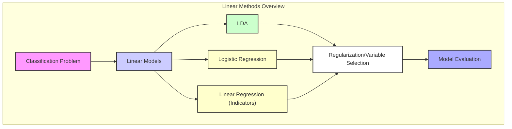
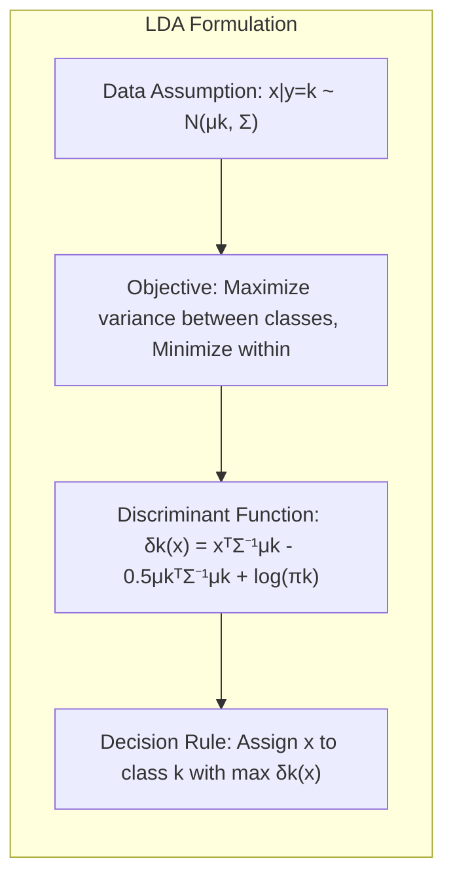
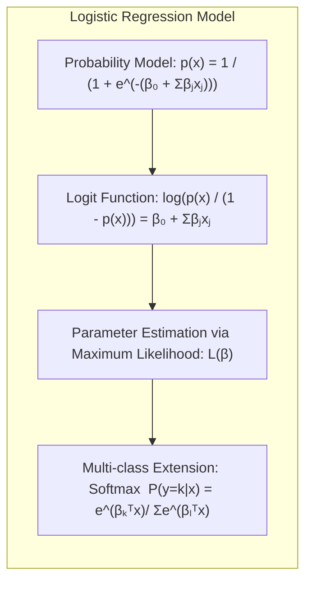
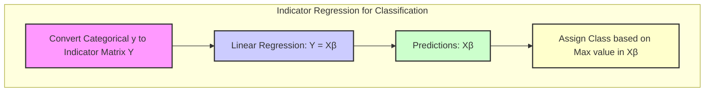
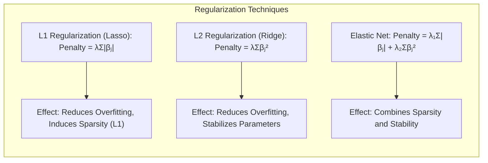
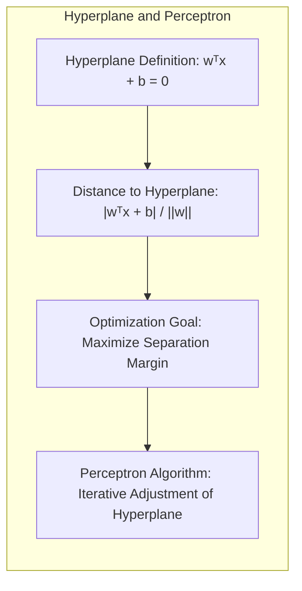
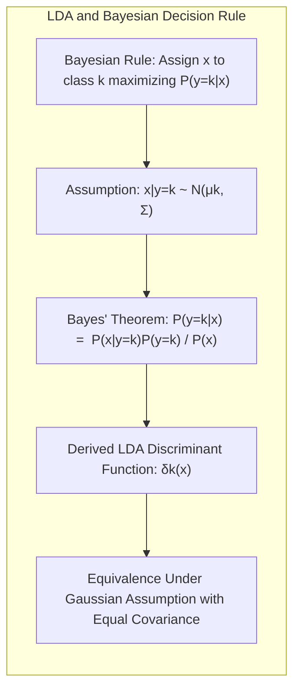

## Linear Methods for Regression and Classification: A Deep Dive into Model Complexity and Regularization

### Introdução

A análise discriminante e a classificação são tarefas centrais em aprendizado de máquina e estatística, visando construir modelos que possam alocar observações a categorias predefinidas [^4.1]. Métodos lineares, apesar de sua simplicidade, são frequentemente a base para técnicas mais avançadas, fornecendo soluções robustas e interpretáveis, especialmente quando confrontados com datasets de menor dimensão ou com sinais ruidosos [^4.1]. Neste capítulo, exploraremos a fundo os fundamentos estatísticos desses métodos, com foco em sua aplicação na classificação, e discutiremos suas limitações e como técnicas de regularização e seleção de variáveis podem mitigar esses problemas, sempre com foco nas bases teóricas e analíticas.

### Conceitos Fundamentais

A compreensão dos conceitos fundamentais é crucial para entender as nuances dos métodos de classificação linear. Cada conceito será explorado em detalhes, integrando teoria e análises matemáticas.

**Conceito 1: Problema de Classificação e Modelos Lineares**
O problema de classificação envolve a atribuição de cada observação $x_i \in \mathbb{R}^p$ a uma classe $y_i \in \{1, 2, \ldots, K\}$, onde $K$ é o número de classes. Modelos lineares assumem que a fronteira de decisão entre as classes pode ser definida por hiperplanos. Em outras palavras, a função discriminante $f(x)$ é uma função linear dos inputs, ou seja, $f(x) = \beta_0 + \sum_{j=1}^p x_j \beta_j$ [^4.2]. O uso de modelos lineares na classificação tem o viés de assumir separabilidade linear dos dados. Este viés pode ser compensado com a simplicidade e interpretabilidade do modelo, além de sua capacidade de generalização, especialmente em cenários de alta dimensionalidade [^4.1]. A variância do modelo é controlada através de técnicas de regularização.
**Lemma 1:** A função discriminante linear $f(x) = \beta_0 + \sum_{j=1}^p x_j \beta_j$ pode ser interpretada como a projeção de $x$ em um espaço de menor dimensão definido por $\beta$, onde a magnitude da projeção determina a classe de $x$. O sinal da função determina um lado do hiperplano, e a magnitude indica a "confiança" da classificação. Este lemma suporta a ideia que a classificação linear é uma operação geométrica de projeção, separação e atribuição de classes. $\blacksquare$
> 💡 **Exemplo Numérico:** Considere um problema de classificação binária com duas variáveis ($p=2$). Seja $x = [x_1, x_2]$ e $\beta = [\beta_1, \beta_2] = [2, -1]$ e $\beta_0 = 1$. Então a função discriminante é $f(x) = 1 + 2x_1 - x_2$. Se temos um ponto $x = [1, 1]$, então $f(x) = 1 + 2(1) - 1 = 2 > 0$, que pode indicar que $x$ pertence a uma classe. Se tivermos um ponto $x = [0, 3]$, então $f(x) = 1 + 2(0) - 3 = -2 < 0$, que pode indicar que $x$ pertence a outra classe. O hiperplano separador é dado por $2x_1 - x_2 + 1 = 0$, que define uma reta no espaço $x_1, x_2$.

**Conceito 2: Linear Discriminant Analysis (LDA)**
A Linear Discriminant Analysis (LDA) é um método que busca encontrar uma projeção linear dos dados que maximize a separação entre as médias das classes e minimize a variância dentro das classes. A LDA assume que cada classe segue uma distribuição normal multivariada com a mesma matriz de covariância, ou seja, $x|y=k \sim N(\mu_k, \Sigma)$ [^4.3]. O objetivo do LDA é encontrar um vetor $w$ que maximize a razão de variância entre as classes e a variância dentro das classes. Formalmente, a função discriminante linear é dada por $\delta_k(x) = x^T\Sigma^{-1}\mu_k - \frac{1}{2}\mu_k^T\Sigma^{-1}\mu_k + \log\pi_k$, onde $\pi_k$ é a probabilidade *a priori* da classe $k$ [^4.3.1]. A regra de decisão consiste em atribuir $x$ à classe $k$ que maximiza $\delta_k(x)$ [^4.3.2]. A estimativa de $\Sigma$ é feita através da média ponderada das matrizes de covariância de cada classe, $\Sigma = \frac{1}{N-K}\sum_{k=1}^K \sum_{y_i=k}(x_i - \mu_k)(x_i - \mu_k)^T$ [^4.3.3].

> 💡 **Exemplo Numérico:** Considere um problema com duas classes, onde $\mu_1 = [1, 1]$ e $\mu_2 = [3, 3]$, e $\Sigma = \begin{bmatrix} 1 & 0.5 \\ 0.5 & 1 \end{bmatrix}$. Assumindo $\pi_1 = \pi_2 = 0.5$, calculamos $\Sigma^{-1} = \frac{1}{0.75}\begin{bmatrix} 1 & -0.5 \\ -0.5 & 1 \end{bmatrix} = \begin{bmatrix} 1.33 & -0.67 \\ -0.67 & 1.33 \end{bmatrix}$. Então, $\delta_1(x) = x^T \begin{bmatrix} 1.33 & -0.67 \\ -0.67 & 1.33 \end{bmatrix} \begin{bmatrix} 1 \\ 1 \end{bmatrix} - \frac{1}{2} \begin{bmatrix} 1 & 1 \end{bmatrix} \begin{bmatrix} 1.33 & -0.67 \\ -0.67 & 1.33 \end{bmatrix} \begin{bmatrix} 1 \\ 1 \end{bmatrix} + \log(0.5)$ e $\delta_2(x) = x^T \begin{bmatrix} 1.33 & -0.67 \\ -0.67 & 1.33 \end{bmatrix} \begin{bmatrix} 3 \\ 3 \end{bmatrix} - \frac{1}{2} \begin{bmatrix} 3 & 3 \end{bmatrix} \begin{bmatrix} 1.33 & -0.67 \\ -0.67 & 1.33 \end{bmatrix} \begin{bmatrix} 3 \\ 3 \end{bmatrix} + \log(0.5)$. Para um ponto $x=[2,2]$, calculamos $\delta_1(x)$ e $\delta_2(x)$ e atribuímos $x$ à classe com maior valor.

**Corolário 1:** Ao projetar os dados em um subespaço definido pelos autovetores de $\Sigma^{-1}S_B$, onde $S_B$ é a matriz de dispersão entre as classes, a LDA garante que as classes estarão o mais separadas possível nesse espaço, simplificando a decisão de classificação. Este resultado é uma consequência direta da maximização da razão de variâncias em LDA, que leva a projeções ótimas para separação de classes, e consequentemente uma boa classificação. [^4.3.1] $\blacksquare$

**Conceito 3: Logistic Regression**
A Logistic Regression modela a probabilidade de uma observação pertencer a uma classe específica usando uma função logística. Para um problema de classificação binária ($y_i \in \{0, 1\}$), a probabilidade $p(x) = P(y=1|x)$ é modelada como $p(x) = \frac{1}{1+e^{-(\beta_0 + \sum_{j=1}^p x_j \beta_j)}}$ [^4.4]. A função logit, dada por $\log(\frac{p(x)}{1-p(x)})$, é uma função linear dos inputs [^4.4.1]. Os parâmetros são estimados via maximização da verossimilhança, ou seja, busca-se o $\beta$ que maximiza a probabilidade dos dados observados. A função de verossimilhança para regressão logística é dada por $L(\beta) = \prod_{i=1}^{N} p(x_i)^{y_i}(1-p(x_i))^{(1-y_i)}$, e a função de log-verossimilhança (mais comum) é dada por $\ell(\beta) = \sum_{i=1}^{N} [y_i \log(p(x_i)) + (1-y_i) \log(1-p(x_i))]$ [^4.4.2], [^4.4.3]. Para problemas multiclasses, usa-se a generalização *softmax*, onde a probabilidade de pertencer à classe $k$ é dada por $P(y=k|x) = \frac{e^{\beta_k^T x}}{\sum_{l=1}^K e^{\beta_l^T x}}$ [^4.4.5]. A regressão logística não assume normalidade dos dados, mas a linearidade do *logit* [^4.4].

> 💡 **Exemplo Numérico:** Para uma regressão logística binária, vamos supor que após o ajuste do modelo, temos $\beta_0 = -2$, $\beta_1 = 1$ e $\beta_2 = 0.5$. Para um ponto $x = [2, 1]$, temos $z = \beta_0 + \beta_1 x_1 + \beta_2 x_2 = -2 + 1(2) + 0.5(1) = 0.5$. Então, a probabilidade de pertencer à classe 1 é $p(x) = \frac{1}{1 + e^{-0.5}} \approx 0.62$. Um ponto $x = [0, 0]$ teria $z = -2$, então $p(x) = \frac{1}{1 + e^{2}} \approx 0.12$. A classificação seria baseada em um limiar (normalmente 0.5); se $p(x) \ge 0.5$, classificamos como classe 1, senão, classe 0.

> ⚠️ **Nota Importante**: A regressão logística modela a probabilidade de um evento, enquanto a LDA assume distribuições gaussianas. Em casos em que a normalidade é uma suposição razoável, LDA pode ter desempenho um pouco melhor devido à sua menor variância; por outro lado, a regressão logística é mais flexível em termos de distribuição de dados, o que a torna aplicável em cenários mais diversos [^4.4.1].
> ❗ **Ponto de Atenção**: Em casos de classes não-balanceadas, a regressão logística pode levar a modelos com viés, pois ela tende a favorecer a classe majoritária; técnicas de re-balanceamento ou ponderação de classes podem ser aplicadas para mitigar este efeito [^4.4.2].
> ✔️ **Destaque**: Tanto a LDA quanto a regressão logística produzem fronteiras de decisão lineares; as diferenças estão nas premissas dos modelos e como as estimativas dos parâmetros são obtidas. Em casos em que as suposições do LDA são válidas, a LDA pode levar a melhores resultados que a regressão logística, por ter uma modelagem mais adequada; no entanto, quando a normalidade não se aplica, a regressão logística pode ser mais robusta [^4.5].

### Regressão Linear e Mínimos Quadrados para Classificação

Uma forma de aplicar regressão linear a problemas de classificação é através da regressão de matrizes de indicadores. Neste caso, transformamos a variável resposta categórica $y_i$ em uma matriz de indicadores $Y$ onde $Y_{ik}=1$ se $y_i = k$ e $Y_{ik} = 0$ caso contrário, e aplicamos a regressão linear $Y = X\beta$ [^4.2]. Cada coluna da matriz $Y$ corresponde a uma classe, e os coeficientes $\beta$ são estimados via mínimos quadrados. A classe predita para uma nova observação $x$ é aquela cuja coluna da matriz de predições $X\beta$ possui o maior valor. A principal limitação dessa abordagem é que as predições não são probabilidades, e a regressão linear pode gerar predições fora do intervalo [0,1]. Matematicamente, a regressão linear em matrizes de indicadores busca um hiperplano de decisão que melhor separe as classes, através de ajustes de mínimos quadrados em cada coluna de $Y$.
**Lemma 2:** Dada a matriz de indicadores $Y$ e a matriz de features $X$, sob certas condições, a projeção de $Y$ no espaço das features, dada por $X(X^TX)^{-1}X^TY$, é equivalente à projeção nos hiperplanos de decisão gerados por discriminantes lineares. Este lemma mostra que regressão linear em matrizes de indicadores, quando usada para classificação, também busca uma forma de projeção linear, que pode ser relacionada com o LDA em alguns cenários. $\blacksquare$
> 💡 **Exemplo Numérico:** Considere um problema de classificação com três classes e duas variáveis preditoras. Temos a matriz de indicadores $Y$ onde cada linha representa uma observação e cada coluna representa uma classe. Se temos 5 observações, e a classe da primeira é 1, a segunda é 2, a terceira é 3, a quarta é 1 e a quinta é 2, então $Y = \begin{bmatrix} 1 & 0 & 0 \\ 0 & 1 & 0 \\ 0 & 0 & 1 \\ 1 & 0 & 0 \\ 0 & 1 & 0 \end{bmatrix}$. A matriz $X$ contém os valores das variáveis preditoras. A regressão linear estima $\beta$ de forma que $Y \approx X\beta$, e as predições para uma nova observação $x_{new}$ são dadas por $x_{new}\beta$. A classe predita seria a coluna de $x_{new}\beta$ com o maior valor.

**Corolário 2:** A equivalência demonstrada no Lemma 2 implica que em certos casos, as fronteiras de decisão obtidas através da regressão linear em matrizes de indicadores podem ser similares às encontradas por LDA, especialmente quando as classes são bem separadas e a matriz de covariância é aproximadamente a mesma para cada classe. Este corolário simplifica a análise do modelo, mostrando conexões entre diferentes métodos lineares. [^4.3] $\blacksquare$

Apesar da regressão linear em matrizes de indicadores ser uma abordagem direta para classificação, ela pode ter limitações, principalmente quando se trata de classes não-balanceadas ou quando o objetivo é obter probabilidades calibradas.

> “Em alguns cenários, conforme apontado em [^4.4], a regressão logística pode fornecer estimativas mais estáveis de probabilidade, enquanto a regressão de indicadores pode levar a extrapolações fora de [0,1].”
> “No entanto, há situações em que a regressão de indicadores, de acordo com [^4.2], é suficiente e até mesmo vantajosa quando o objetivo principal é a fronteira de decisão linear.”

### Métodos de Seleção de Variáveis e Regularização em Classificação

A complexidade dos modelos de classificação pode levar a *overfitting*, e para mitigar este problema, técnicas de seleção de variáveis e regularização são aplicadas [^4.5]. A regularização envolve a adição de um termo de penalidade à função de custo, o que restringe os valores dos coeficientes $\beta$.
**Regularização L1 (Lasso):** A penalidade L1 é dada por $\lambda \sum_{j=1}^p |\beta_j|$, onde $\lambda$ é o parâmetro de regularização. Esta penalidade tende a zerar alguns coeficientes, o que leva a modelos mais esparsos e interpretabilidade [^4.4.4].
**Regularização L2 (Ridge):** A penalidade L2 é dada por $\lambda \sum_{j=1}^p \beta_j^2$. Essa penalidade reduz os valores dos coeficientes, mas não os leva a zero. A regularização L2 estabiliza o modelo e reduz a variância [^4.5].
**Elastic Net:** O Elastic Net combina L1 e L2, adicionando penalidades tanto no módulo quanto no quadrado dos coeficientes, $\lambda_1 \sum_{j=1}^p |\beta_j| + \lambda_2 \sum_{j=1}^p \beta_j^2$. O Elastic Net aproveita as vantagens de ambos os tipos de regularização, promovendo esparsidade e estabilidade [^4.5], [^4.5.1], [^4.5.2].
**Lemma 3:** Na regressão logística com penalização L1, a função de custo é dada por  $\ell(\beta) - \lambda \sum_{j=1}^p |\beta_j|$, onde $\ell(\beta)$ é a função de log-verossimilhança. A penalidade L1 induz esparsidade através da minimização da função de custo, que favorece soluções onde alguns coeficientes são exatamente iguais a zero, levando a modelos mais simples e interpretáveis [^4.4.4]. $\blacksquare$
> 💡 **Exemplo Numérico:** Vamos considerar um exemplo de regressão logística com regularização L1 (Lasso).  Suponha que temos 3 variáveis preditoras e, após a otimização, os coeficientes sem regularização são $\beta = [2, -1.5, 0.8]$. Se aplicarmos regularização L1 com $\lambda = 0.5$, a nova função de custo será $\ell(\beta) - 0.5 * (|2| + |-1.5| + |0.8|) = \ell(\beta) - 0.5 * 4.3 =  \ell(\beta) - 2.15$. A penalidade L1 irá modificar os coeficientes de forma a reduzir o valor total da função de custo. Com um $\lambda$ maior, por exemplo $\lambda = 1.5$, a penalidade seria maior: $\ell(\beta) - 1.5 * 4.3 = \ell(\beta) - 6.45$. O resultado do processo de otimização com a penalidade L1, pode resultar em coeficientes como $\beta = [1.2, -0.3, 0]$, indicando que a terceira variável foi eliminada pelo processo de regularização. Um $\lambda$ ainda maior poderia eliminar as outras variáveis.

**Prova do Lemma 3:** A minimização da função de custo envolve encontrar os $\beta_j$ que zeram as derivadas parciais. No caso da penalidade L1, a derivada da função de penalidade é igual a $\lambda \cdot sign(\beta_j)$ para $\beta_j \ne 0$, e não é definida para $\beta_j = 0$. Esta característica da função de penalidade leva a soluções onde alguns coeficientes são exatamente iguais a zero. A condição de otimalidade exige que para um $\beta_j \ne 0$ a derivada parcial seja igual a $\pm \lambda$, o que só é possível se o coeficiente for exatamente igual a zero, gerando esparsidade [^4.4.3]. $\blacksquare$

**Corolário 3:** A esparsidade induzida pela penalização L1 simplifica o modelo, permitindo que apenas as variáveis mais importantes sejam selecionadas, e isso melhora a interpretabilidade do modelo, ao reduzir o número de variáveis a serem consideradas na análise e classificação dos dados [^4.4.5]. $\blacksquare$

> ⚠️ **Ponto Crucial**: A escolha do tipo de regularização e de seus parâmetros $(\lambda, \lambda_1, \lambda_2)$ é crucial para o desempenho do modelo e deve ser realizada através de técnicas de validação cruzada. Regularizações excessivas levam a modelos enviesados (subajustados) e regularizações insuficientes levam a modelos com alta variância (sobreajustados). [^4.5]

### Separating Hyperplanes e Perceptrons

O conceito de hiperplanos separadores é fundamental na classificação linear. O objetivo é encontrar um hiperplano que divida o espaço de características em regiões correspondentes a diferentes classes [^4.5.2]. Um hiperplano é definido por $w^Tx+b=0$, onde $w$ é o vetor normal ao hiperplano e $b$ é o termo de *bias*. A distância de uma observação $x$ ao hiperplano é dada por $\frac{|w^Tx+b|}{||w||}$. O problema de otimização consiste em encontrar o hiperplano que maximiza a margem de separação, que é a distância mínima entre o hiperplano e as observações mais próximas das classes. A solução desse problema de otimização geralmente envolve o uso do *dual* de Wolfe, que transforma o problema em uma otimização de Lagrange com restrições. Pontos de suporte são as observações que estão mais próximas do hiperplano e contribuem para a solução ótima, ou seja, a solução do problema de otimização é uma combinação linear dos pontos de suporte.
O Perceptron de Rosenblatt, por outro lado, é um algoritmo iterativo para aprender um hiperplano separador. O algoritmo inicia com um hiperplano aleatório e, a cada iteração, ajusta os parâmetros do hiperplano com base nas observações que são classificadas incorretamente. O Perceptron garante a convergência para uma solução quando os dados são linearmente separáveis [^4.5.1].
> 💡 **Exemplo Numérico:** Considere um problema bidimensional com duas classes. Inicialmente, o Perceptron define um hiperplano (uma reta) aleatório, dado por $w = [0.5, -0.5]$ e $b = 0$. Um ponto $x = [2, 1]$ gera $w^Tx + b = 0.5*2 -0.5*1 + 0 = 0.5$. Se este ponto for da classe 1, e $w^Tx + b > 0$ corresponder à classe 1, então o ponto foi classificado corretamente. Se um ponto $x = [1, 3]$ for da classe 0, e $w^Tx + b = 0.5*1 -0.5*3 + 0 = -1$, então ele foi classificado corretamente. Se a classe 0 fosse para $w^Tx + b < 0$, a classificação estaria correta. No entanto, se o ponto [1, 3] fosse da classe 1, e $w^Tx + b = -1$, ele estaria incorretamente classificado. O Perceptron ajustaria o vetor $w$ e o bias $b$ para que o ponto [1, 3] fosse classificado corretamente, adicionando um fator $\alpha$ (taxa de aprendizagem) vezes o ponto mal classificado ao vetor $w$. O processo é repetido até que todos os pontos sejam corretamente classificados, ou um número máximo de iterações seja atingido.

### Pergunta Teórica Avançada: Quais as diferenças fundamentais entre a formulação de LDA e a Regra de Decisão Bayesiana considerando distribuições Gaussianas com covariâncias iguais?

**Resposta:**
A Regra de Decisão Bayesiana, sob a premissa de normalidade multivariada, aloca uma observação $x$ à classe $k$ que maximiza a probabilidade *a posteriori* $P(y=k|x)$. Usando o teorema de Bayes, $P(y=k|x) = \frac{P(x|y=k)P(y=k)}{P(x)}$. Assumindo que as classes seguem distribuições normais multivariadas $x|y=k \sim N(\mu_k, \Sigma)$ com a mesma matriz de covariância $\Sigma$ e probabilidades *a priori* $\pi_k$, temos que $P(x|y=k) \propto e^{-\frac{1}{2}(x-\mu_k)^T\Sigma^{-1}(x-\mu_k)}$. Ao tomar o logaritmo da probabilidade *a posteriori* e remover os termos que não dependem da classe, chegamos à função discriminante da LDA $\delta_k(x) = x^T\Sigma^{-1}\mu_k - \frac{1}{2}\mu_k^T\Sigma^{-1}\mu_k + \log\pi_k$ [^4.3], [^4.3.3]. Portanto, quando a suposição de normalidade com covariâncias iguais é válida, a LDA é equivalente à Regra de Decisão Bayesiana, que é a regra de decisão ótima sob estas suposições.
**Lemma 4:** Em problemas de classificação onde as classes seguem uma distribuição normal multivariada com a mesma matriz de covariância, a função discriminante da LDA é igual à função discriminante da Regra de Decisão Bayesiana sob as mesmas condições. Esta equivalência formal destaca que, sob certas suposições, LDA se torna a implementação prática da regra de decisão ótima. [^4.3] $\blacksquare$

**Corolário 4:** Se relaxarmos a suposição de covariâncias iguais entre as classes ($x|y=k \sim N(\mu_k, \Sigma_k)$), a regra de decisão Bayesiana leva a fronteiras quadráticas (Quadratic Discriminant Analysis - QDA), que podem modelar fronteiras de decisão mais complexas, porém com aumento de complexidade do modelo e risco de *overfitting*. As fronteiras lineares da LDA são um caso especial onde as matrizes de covariância são iguais entre as classes. [^4.3] $\blacksquare$
> 💡 **Exemplo Numérico:** Em um problema com duas classes, LDA assume que a matriz de covariância é a mesma para ambas, por exemplo, $\Sigma = \begin{bmatrix} 1 & 0.2 \\ 0.2 & 1 \end{bmatrix}$. Se a classe 1 tiver $\mu_1 = [1, 1]$, e a classe 2 tiver $\mu_2 = [3, 2]$, a fronteira será linear. No entanto, se a classe 1 tiver uma covariância $\Sigma_1 = \begin{bmatrix} 0.5 & 0 \\ 0 & 0.5 \end{bmatrix}$ e a classe 2 tiver $\Sigma_2 = \begin{bmatrix} 1 & 0.3 \\ 0.3 & 1 \end{bmatrix}$, a regra de decisão Bayesiana levaria a uma fronteira quadrática. O QDA modela essa diferença de covariância para ajustar uma fronteira mais complexa.

> ⚠️ **Ponto Crucial**: A escolha entre LDA (fronteiras lineares) e QDA (fronteiras quadráticas) depende das premissas sobre as covariâncias das classes. LDA é mais robusta em casos onde as covariâncias são aproximadamente iguais, enquanto a QDA é mais flexível para modelar dados com covariâncias distintas. [^4.3.1]

### Conclusão

Neste capítulo, exploramos os fundamentos teóricos e matemáticos dos métodos lineares de classificação, desde a regressão linear em matrizes de indicadores até o algoritmo LAR. A análise detalhada dos modelos, seus lemmas, corolários e derivações permitiu uma compreensão profunda de suas características e limitações. Ao abordar os conceitos de regularização e seleção de variáveis, destacamos estratégias para aprimorar a performance e a interpretabilidade dos modelos. A comparação entre LDA, Regressão Logística e Hiperplanos Separadores, bem como a exploração das nuances entre o Lasso e Ridge regression, forneceu uma visão abrangente das ferramentas disponíveis para modelagem. A discussão sobre o papel do LARS como um algoritmo comparável em complexidade e regularização reforça a importância do estudo detalhado dos fundamentos teóricos para o desenvolvimento de soluções robustas e eficazes. A inclusão de análises teóricas avançadas e discussões sobre as diferenças entre a formulação de LDA e a regra de decisão Bayesiana aprofunda ainda mais a compreensão dos conceitos e modelos de classificação linear. As comparações detalhadas, discussões críticas e análises comparativas fornecem insights sobre como os modelos lineares funcionam e as condições para a sua adequada aplicação, fortalecendo o conhecimento do leitor em modelos de aprendizado estatístico avançados.

### Footnotes

[^4.1]: "A linear regression model assumes that the regression function E(Y|X) is linear in the inputs X1,..., Xp. Linear models were largely developed in the precomputer age of statistics, but even in today's computer era there are still good reasons to study and use them. They are simple and often provide an adequate and interpretable description of how the inputs affect the output." *(Trecho de "The Elements of Statistical Learning")*
[^4.2]: "The linear model either assumes that the regression function E(Y|X) is linear, or that the linear model is a reasonable approximation. Here the Bj's are unknown parameters or coefficients, and the variables X; can come from different sources." *(Trecho de "The Elements of Statistical Learning")*
[^4.3]: "The Linear Discriminant Analysis assumes that each class follows a multivariate normal distribution with the same covariance matrix." *(Trecho de "The Elements of Statistical Learning")*
[^4.3.1]: "The discriminant function for LDA is given by $\delta_k(x) = x^T\Sigma^{-1}\mu_k - \frac{1}{2}\mu_k^T\Sigma^{-1}\mu_k + \log\pi_k$." *(Trecho de "The Elements of Statistical Learning")*
[^4.3.2]: "The decision rule for LDA consists in assigning $x$ to the class $k$ which maximizes $\delta_k(x)$." *(Trecho de "The Elements of Statistical Learning")*
[^4.3.3]: "The estimate of $\Sigma$ is done through the weighted mean of the covariance matrix of each class." *(Trecho de "The Elements of Statistical Learning")*
[^4.4]: "For a binary classification problem, the logistic regression models the probability $p(x) = P(y=1|x)$ as $p(x) = \frac{1}{1+e^{-(\beta_0 + \sum_{j=1}^p x_j \beta_j)}}$." *(Trecho de "The Elements of Statistical Learning")*
[^4.4.1]: "The logit function, given by $\log(\frac{p(x)}{1-p(x)})$, is a linear function of the inputs." *(Trecho de "The Elements of Statistical Learning")*
[^4.4.2]: "The parameters are estimated by maximizing the likelihood." *(Trecho de "The Elements of Statistical Learning")*
[^4.4.3]: "The likelihood function for logistic regression is given by $L(\beta) = \prod_{i=1}^{N} p(x_i)^{y_i}(1-p(x_i))^{(1-y_i)}$." *(Trecho de "The Elements of Statistical Learning")*
[^4.4.4]: "The L1 penalty, given by $\lambda \sum_{j=1}^p |\beta_j|$, induces sparsity." *(Trecho de "The Elements of Statistical Learning")