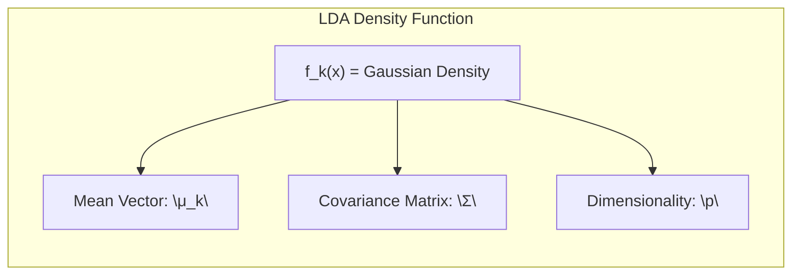

## Título Conciso: Métodos Lineares para Classificação e Seleção de Variáveis

```mermaid
graph LR
    subgraph "Linear Classification Methods"
        direction TB
        A["Input Data: \"x\" (Features)"]
        B["Indicator Regression"]
        C["Linear Discriminant Analysis (LDA)"]
        D["Logistic Regression"]
        E["Separating Hyperplanes"]
        A --> B
        A --> C
        A --> D
        A --> E
        style A fill:#f9f,stroke:#333,stroke-width:2px
        style B,C,D,E fill:#ccf,stroke:#333,stroke-width:1px
    end
    subgraph "Variable Selection & Regularization"
        direction TB
        F["Feature Set Reduction"]
        G["L1 Regularization (Lasso)"]
        H["L2 Regularization (Ridge)"]
        I["Elastic Net"]
        F --> G
        F --> H
        F --> I
        style F fill:#ffc,stroke:#333,stroke-width:2px
        style G,H,I fill:#ffc,stroke:#333,stroke-width:1px
    end
    B --> F
    C --> F
    D --> F
    E --> F
```

### Introdução

Este capítulo aborda o problema de classificação, focando em **métodos lineares** para essa tarefa. A classificação envolve a atribuição de um valor discreto (classe) a uma entrada, com base em suas características [^4.1]. Podemos sempre dividir o espaço de entrada em regiões, cada uma associada a uma classe, e as fronteiras entre essas regiões podem ser suaves ou irregulares, dependendo da função de predição utilizada. Uma classe importante de métodos gera **fronteiras de decisão lineares**, e é nelas que focaremos nossa atenção [^4.1].

Existem diversas abordagens para encontrar tais fronteiras de decisão lineares. Uma das formas é ajustar modelos de regressão linear para as **variáveis indicadoras de classe**, atribuindo a classe correspondente ao maior valor predito. Supondo *K* classes rotuladas de 1 a *K*, modelamos a variável indicadora *k* como $f_k(x) = \beta_{k0} + \beta_k^T x$. A fronteira de decisão entre as classes *k* e *l* é definida pelos pontos onde $f_k(x) = f_l(x)$, que é um conjunto afim ou hiperplano, dado por $\{x: (\beta_{k0} - \beta_{l0}) + (\beta_k - \beta_l)^T x = 0\}$ [^4.1].

> 💡 **Exemplo Numérico:**
>
> Considere um problema de classificação com três classes e duas variáveis preditoras ($x_1$ e $x_2$). Ajustamos três modelos de regressão linear, um para cada classe. As funções resultantes são:
>
> $f_1(x) = 1 + 2x_1 - x_2$
> $f_2(x) = -1 + x_1 + 2x_2$
> $f_3(x) = 0 - x_1 - x_2$
>
> Para classificar um novo ponto, digamos $x = (1, 1)$, calculamos:
>
> $f_1(1, 1) = 1 + 2(1) - 1 = 2$
> $f_2(1, 1) = -1 + 1 + 2(1) = 2$
> $f_3(1, 1) = 0 - 1 - 1 = -2$
>
> Como $f_1(1,1) = f_2(1,1)$ e são os maiores valores, o ponto está na fronteira de decisão entre as classes 1 e 2, e pode ser atribuído a qualquer uma das classes.
>
> Para classificar o ponto $x=(2, -1)$:
>
> $f_1(2, -1) = 1 + 2(2) - (-1) = 6$
> $f_2(2, -1) = -1 + 2 + 2(-1) = -1$
> $f_3(2, -1) = 0 - 2 - (-1) = -1$
>
> Neste caso, como $f_1(2,-1) = 6$ é o maior valor, o ponto seria classificado como pertencente à classe 1.
>
> A fronteira de decisão entre as classes 1 e 2 seria definida por $f_1(x) = f_2(x)$:
> $1 + 2x_1 - x_2 = -1 + x_1 + 2x_2$
> $2 + x_1 - 3x_2 = 0$
> $x_2 = \frac{2+x_1}{3}$
>
> Esta é a equação de uma linha reta, demonstrando que a fronteira de decisão é linear.

Outra abordagem consiste em modelar diretamente as **funções discriminantes** $\delta_k(x)$ para cada classe, classificando uma entrada *x* para a classe com o maior valor da função discriminante [^4.1]. Métodos que modelam as **probabilidades a posteriori** $Pr(G = k | X = x)$ também podem levar a fronteiras de decisão lineares. De fato, basta que alguma transformação monotônica de $\delta_k(x)$ ou $Pr(G = k | X = x)$ seja linear em *x* para que as fronteiras de decisão sejam lineares. Por exemplo, na classificação com duas classes, um modelo comum para as probabilidades a posteriori é dado por:
$$Pr(G = 1|X = x) = \frac{exp(\beta_0 + \beta^T x)}{1 + exp(\beta_0 + \beta^T x)},$$
$$Pr(G = 2|X = x) = \frac{1}{1 + exp(\beta_0 + \beta^T x)}.$$
Neste caso, a **transformação logit**, $\log[p/(1-p)]$, resulta em:
$$\log \frac{Pr(G = 1|X = x)}{Pr(G = 2|X = x)} = \beta_0 + \beta^T x.$$
A fronteira de decisão corresponde ao conjunto de pontos para os quais o log-odds é zero, que é o hiperplano $\{x: \beta_0 + \beta^T x = 0\}$ [^4.1].

Exploraremos neste capítulo dois métodos populares que geram logits lineares: **Linear Discriminant Analysis (LDA)** e **Regressão Logística Linear**. Apesar de suas derivações diferentes, a diferença crucial reside na forma como a função linear é ajustada aos dados de treinamento. Além disso, discutiremos métodos que modelam explicitamente as fronteiras entre as classes como lineares, usando o conceito de **hiperplanos separadores**[^4.1].

### Conceitos Fundamentais

**Conceito 1: O Problema de Classificação e Métodos Lineares**

O problema de classificação busca atribuir uma observação *x* a uma entre um número finito de classes *G*. Formalmente, temos um espaço de entrada *X* e um conjunto de saída *G* com *K* classes,  $G = \{1, 2, \ldots, K\}$. O objetivo é construir um preditor $G(x)$ que mapeie *x* para a classe correta. Os métodos lineares, neste contexto, utilizam funções lineares para definir fronteiras de decisão no espaço de entrada [^4.1]. Essas fronteiras dividem o espaço em regiões associadas a cada classe.

```mermaid
graph LR
    subgraph "Classification Problem"
        direction TB
        A["Input Space \"X\""]
        B["Output Space \"G\" = {1, 2, ..., K}"]
        C["Linear Classifier \"G(x)\""]
        A --> C
        B --> C
    end
    subgraph "Decision Boundary"
      D["Linear Decision Boundary"]
      C --> D
   end
   style A fill:#ccf,stroke:#333,stroke-width:1px
   style B fill:#ccf,stroke:#333,stroke-width:1px
   style C fill:#f9f,stroke:#333,stroke-width:2px
   style D fill:#ccf,stroke:#333,stroke-width:1px
```


A natureza linear dessas fronteiras implica que as decisões são baseadas em combinações lineares das características de entrada. Embora essa abordagem seja limitada em comparação com modelos não lineares, ela possui vantagens como simplicidade, interpretabilidade e eficiência computacional. A escolha por métodos lineares geralmente envolve um *trade-off* entre **viés** e **variância**. Modelos lineares podem ter um alto viés se as verdadeiras fronteiras de decisão forem complexas, mas tendem a ter baixa variância.

**Lemma 1:** *Em problemas de classificação com duas classes, a fronteira de decisão gerada por um modelo linear pode ser vista como um hiperplano. A forma desse hiperplano depende dos parâmetros do modelo, que são ajustados utilizando um conjunto de dados de treinamento.*

A prova desse lemma decorre da formulação matemática de um modelo linear de classificação: seja $f(x) = \beta_0 + \beta^T x$ a função discriminante, onde $x$ representa o vetor de atributos, e $\beta_0$ e $\beta$ são os parâmetros do modelo. A fronteira de decisão é definida pelos pontos onde $f(x) = 0$, ou seja, $\beta_0 + \beta^T x = 0$. Essa equação descreve um hiperplano no espaço de entrada. Portanto, a decisão de classe é baseada na posição de *x* em relação a este hiperplano. A estrutura linear do hiperplano surge diretamente da forma funcional linear do modelo. A adaptação do hiperplano se dá através do ajuste dos parâmetros $\beta_0$ e $\beta$ com base no conjunto de dados de treino. $\blacksquare$

**Conceito 2: Linear Discriminant Analysis (LDA)**

A Análise Discriminante Linear (LDA) é um método de classificação que assume que as classes seguem distribuições Gaussianas com uma matriz de covariância comum ($\Sigma$). Formalmente, a densidade condicional de *X* na classe *G* = *k* é dada por:
$$f_k(x) = \frac{1}{(2\pi)^{p/2}|\Sigma|^{1/2}}exp\left(-\frac{1}{2}(x-\mu_k)^T\Sigma^{-1}(x-\mu_k)\right),$$
onde $\mu_k$ é o vetor de médias da classe *k* e *p* é a dimensionalidade de *x*.




Ao comparar duas classes, *k* e *l*, é suficiente examinar o log-ratio das probabilidades posteriores:
$$log \frac{Pr(G=k|X=x)}{Pr(G=l|X=x)} = log \frac{f_k(x)}{f_l(x)} + log \frac{\pi_k}{\pi_l} = log \frac{\pi_k}{\pi_l} - \frac{1}{2} (\mu_k - \mu_l)^T \Sigma^{-1} (\mu_k - \mu_l) + x^T \Sigma^{-1} (\mu_k - \mu_l).$$
Essa equação é linear em *x* devido à premissa da matriz de covariância comum, resultando em fronteiras de decisão lineares [^4.3].

> 💡 **Exemplo Numérico:**
>
> Considere um problema de classificação com duas classes e duas variáveis preditoras ($x_1$ e $x_2$). Suponha que as médias das classes são $\mu_1 = [1, 1]^T$ e $\mu_2 = [3, 3]^T$, e que a matriz de covariância comum é $\Sigma = \begin{bmatrix} 1 & 0.5 \\ 0.5 & 1 \end{bmatrix}$. As probabilidades a priori são $\pi_1 = 0.4$ e $\pi_2 = 0.6$.
>
> Calculamos $\Sigma^{-1} = \frac{1}{0.75} \begin{bmatrix} 1 & -0.5 \\ -0.5 & 1 \end{bmatrix} = \begin{bmatrix} 1.33 & -0.67 \\ -0.67 & 1.33 \end{bmatrix}$.
>
> A função discriminante para a classe 1 é:
> $\delta_1(x) = x^T \Sigma^{-1} \mu_1 - \frac{1}{2} \mu_1^T \Sigma^{-1} \mu_1 + log(\pi_1)$.
> $\delta_1(x) = x^T \begin{bmatrix} 1.33 & -0.67 \\ -0.67 & 1.33 \end{bmatrix} \begin{bmatrix} 1 \\ 1 \end{bmatrix} - \frac{1}{2} \begin{bmatrix} 1 & 1 \end{bmatrix} \begin{bmatrix} 1.33 & -0.67 \\ -0.67 & 1.33 \end{bmatrix} \begin{bmatrix} 1 \\ 1 \end{bmatrix} + log(0.4)$.
> $\delta_1(x) =  x^T \begin{bmatrix} 0.66 \\ 0.66 \end{bmatrix} - \frac{1}{2} \begin{bmatrix} 1 & 1 \end{bmatrix} \begin{bmatrix} 0.66 \\ 0.66 \end{bmatrix} + log(0.4)$
> $\delta_1(x) = 0.66x_1 + 0.66x_2 - 0.66 + log(0.4)$
>
> Similarmente, para classe 2:
> $\delta_2(x) = x^T \Sigma^{-1} \mu_2 - \frac{1}{2} \mu_2^T \Sigma^{-1} \mu_2 + log(\pi_2)$.
> $\delta_2(x) =  x^T \begin{bmatrix} 1.33 & -0.67 \\ -0.67 & 1.33 \end{bmatrix} \begin{bmatrix} 3 \\ 3 \end{bmatrix} - \frac{1}{2} \begin{bmatrix} 3 & 3 \end{bmatrix} \begin{bmatrix} 1.33 & -0.67 \\ -0.67 & 1.33 \end{bmatrix} \begin{bmatrix} 3 \\ 3 \end{bmatrix} + log(0.6)$
> $\delta_2(x) =  x^T \begin{bmatrix} 2 \\ 2 \end{bmatrix} - \frac{1}{2} \begin{bmatrix} 3 & 3 \end{bmatrix} \begin{bmatrix} 2 \\ 2 \end{bmatrix} + log(0.6)$
> $\delta_2(x) = 2x_1 + 2x_2 - 6 + log(0.6)$
>
> A fronteira de decisão é definida por $\delta_1(x) = \delta_2(x)$:
> $0.66x_1 + 0.66x_2 - 0.66 + log(0.4) = 2x_1 + 2x_2 - 6 + log(0.6)$
>  $-1.34x_1 - 1.34x_2 + 5.34 - log(0.4) + log(0.6) = 0$
>  $-1.34x_1 - 1.34x_2 + 5.34 + 0.916 - 0.511 = 0$
>  $1.34x_1 + 1.34x_2 = 5.745$
> $x_1 + x_2 = 4.29$
>
> Esta é a equação de uma linha reta, confirmando que a fronteira de decisão é linear.

**Corolário 1:** *A função discriminante linear da LDA, expressa como $\delta_k(x) = x^T \Sigma^{-1} \mu_k - \frac{1}{2} \mu_k^T \Sigma^{-1} \mu_k + log(\pi_k)$, pode ser interpretada como uma projeção do ponto *x* para um subespaço, onde as classes estão melhor separadas. A matriz de covariância comum $\Sigma$ afeta essa projeção, e a diferença nas médias $\mu_k$ e $\mu_l$ define a direção de separação das classes.*

A prova desse corolário pode ser inferida a partir da análise da fórmula do log-odds em LDA. A função discriminante linear $\delta_k(x)$ tem a forma de uma combinação linear das variáveis de entrada, onde os coeficientes são definidos pelas médias das classes ($\mu_k$) e pela matriz de covariância comum ($\Sigma$). A matriz $\Sigma^{-1}$ é uma transformação linear que esférica os dados, removendo as correlações e permitindo que a separação de classes ocorra de forma mais eficiente. A projeção, então, ocorre no subespaço definido pelos autovetores da matriz de covariância $\Sigma$. Este corolário estabelece a ligação entre a função discriminante linear e o conceito de projeção em um espaço que otimiza a separação entre classes. $\blacksquare$

**Conceito 3: Logistic Regression**

A Regressão Logística é um método probabilístico que modela diretamente as probabilidades posteriores das classes através de funções lineares transformadas pela função logística. Para o caso de duas classes, a probabilidade de uma observação *x* pertencer à classe 1 é dada por:
$$Pr(G=1|X=x) = \frac{exp(\beta_0 + \beta^T x)}{1+exp(\beta_0 + \beta^T x)},$$
onde $\beta_0$ e $\beta$ são os parâmetros do modelo [^4.4]. A transformação logit do odds-ratio é linear em *x*:
$$\log \frac{Pr(G=1|X=x)}{Pr(G=2|X=x)} = \beta_0 + \beta^T x.$$
```mermaid
graph LR
    subgraph "Logistic Regression Probability"
      direction TB
        A["P(G=1|X=x) = \"exp(β₀ + βᵀx) / (1 + exp(β₀ + βᵀx))\""]
        B["Logit Transformation: log( P(G=1|X=x) / P(G=2|X=x) ) = \"β₀ + βᵀx\""]
         A --> B
    end
```

Os parâmetros do modelo são geralmente estimados por **máxima verossimilhança**, que busca encontrar os valores de $\beta_0$ e $\beta$ que maximizam a probabilidade dos dados observados, dada a forma funcional do modelo.

> ⚠️ **Nota Importante**: Na prática, a escolha entre LDA e Regressão Logística pode depender de diversos fatores, incluindo a validade das premissas de Gaussianidade e a necessidade de interpretabilidade do modelo.

> ❗ **Ponto de Atenção**: Em situações com classes desbalanceadas, é importante considerar o uso de técnicas de balanceamento ou ajustes nas probabilidades de classes na Regressão Logística para evitar resultados enviesados.

> ✔️ **Destaque**:  Embora LDA e Regressão Logística apresentem derivações distintas, em cenários com duas classes as estimativas de parâmetros em LDA e em regressão logística podem estar relacionadas sob algumas condições.

### Regressão Linear e Mínimos Quadrados para Classificação

```mermaid
graph LR
    subgraph "Indicator Regression for Classification"
        direction TB
        A["Encode Classes: \"Y_k\" (Indicator Variables)"]
        B["Design Matrix: \"X\""]
        C["Estimate Coefficients: \"B\" = (XᵀX)⁻¹XᵀY"]
        D["Prediction: f(x) = \"(1, xᵀ)B\""]
        E["Classification: argmax_k f_k(x)"]
        A --> B
        B --> C
        C --> D
        D --> E
    end
```

A regressão linear pode ser adaptada para problemas de classificação através do uso de uma **matriz de indicadores** [^4.2]. Para um problema com *K* classes, cada classe é representada por um indicador binário $Y_k$, onde $Y_k=1$ se a observação pertence à classe *k* e $Y_k=0$ caso contrário. Essas variáveis são agrupadas em um vetor $Y = (Y_1, \ldots, Y_K)$, e as *N* instâncias de treinamento formam uma matriz de resposta $N \times K$, denotada por $\mathbf{Y}$.

Ajustamos um modelo de regressão linear para cada coluna da matriz $\mathbf{Y}$ simultaneamente, utilizando uma matriz de design $\mathbf{X}$ com as *p* variáveis de entrada mais uma coluna de 1's para o intercepto. O ajuste é dado por:
$$ \hat{\mathbf{Y}} = \mathbf{X}(\mathbf{X}^T\mathbf{X})^{-1}\mathbf{X}^T \mathbf{Y}. $$
As estimativas dos coeficientes são armazenadas em uma matriz $(p+1) \times K$, denotada por $\mathbf{B} = (\mathbf{X}^T\mathbf{X})^{-1}\mathbf{X}^T\mathbf{Y}$. Para classificar uma nova observação com entrada *x*, primeiro computamos o vetor de saídas ajustadas $f(x) = (1, x^T)\mathbf{B}$. Em seguida, classificamos *x* para a classe correspondente ao maior valor predito:
$$\hat{G}(x) = argmax_k f_k(x)$$ [^4.2].

> 💡 **Exemplo Numérico:**
>
> Considere um problema de classificação com 3 classes e 2 features. Temos 5 amostras de treinamento:
>
> | Amostra | Feature 1 ($x_1$) | Feature 2 ($x_2$) | Classe |
> |---|---|---|---|
> | 1 | 1 | 2 | 1 |
> | 2 | 2 | 1 | 2 |
> | 3 | 2 | 3 | 1 |
> | 4 | 3 | 2 | 3 |
> | 5 | 4 | 3 | 2 |
>
> Primeiro, criamos a matriz de design $\mathbf{X}$ e a matriz de indicadores $\mathbf{Y}$:
>
> $\mathbf{X} = \begin{bmatrix} 1 & 1 & 2 \\ 1 & 2 & 1 \\ 1 & 2 & 3 \\ 1 & 3 & 2 \\ 1 & 4 & 3 \end{bmatrix}$
>
> $\mathbf{Y} = \begin{bmatrix} 1 & 0 & 0 \\ 0 & 1 & 0 \\ 1 & 0 & 0 \\ 0 & 0 & 1 \\ 0 & 1 & 0 \end{bmatrix}$
>
> Calculamos $\mathbf{X}^T\mathbf{X}$:
>
> $\mathbf{X}^T\mathbf{X} = \begin{bmatrix} 5 & 12 & 11 \\ 12 & 34 & 29 \\ 11 & 29 & 28 \end{bmatrix}$
>
> Calculamos $(\mathbf{X}^T\mathbf{X})^{-1}$:
>
> $(\mathbf{X}^T\mathbf{X})^{-1} = \begin{bmatrix} 4.5 & -1.75 & -1.25 \\ -1.75 & 0.75 & 0.5 \\ -1.25 & 0.5 & 0.75 \end{bmatrix}$
>
> Calculamos $\mathbf{X}^T\mathbf{Y}$:
>
> $\mathbf{X}^T\mathbf{Y} = \begin{bmatrix} 2 & 2 & 1 \\ 5 & 7 & 3 \\ 8 & 5 & 2 \end{bmatrix}$
>
> Calculamos $\mathbf{B} = (\mathbf{X}^T\mathbf{X})^{-1}\mathbf{X}^T\mathbf{Y}$:
>
> $\mathbf{B} = \begin{bmatrix} 4.5 & -1.75 & -1.25 \\ -1.75 & 0.75 & 0.5 \\ -1.25 & 0.5 & 0.75 \end{bmatrix} \begin{bmatrix} 2 & 2 & 1 \\ 5 & 7 & 3 \\ 8 & 5 & 2 \end{bmatrix} = \begin{bmatrix} 0.25 & -1.75 & 0.25 \\ 0.75 & 1.25 & 0.25 \\ -0.25 & 0.75 & 0.75 \end{bmatrix}$
>
>
> Para classificar um novo ponto $x = (2, 2)$, formamos o vetor $(1, 2, 2)$ e calculamos:
>
> $f(x) = (1, 2, 2)\mathbf{B} = (1, 2, 2) \begin{bmatrix} 0.25 & -1.75 & 0.25 \\ 0.75 & 1.25 & 0.25 \\ -0.25 & 0.75 & 0.75 \end{bmatrix} = [1.5, 1.75, 1.75]$
>
> Como os valores para as classes 2 e 3 são os maiores e iguais (1.75), o ponto estaria na fronteira de decisão entre as classes 2 e 3.

Uma interpretação para esta abordagem é que a regressão linear estima a expectativa condicional de cada variável indicadora, $E(Y_k|X=x) = Pr(G=k|X=x)$ [^4.2]. No entanto, a regressão linear não garante que os valores preditos estejam no intervalo [0,1] ou que sua soma seja igual a 1. Apesar dessas limitações, na prática essa abordagem pode apresentar resultados similares a outros métodos lineares de classificação. Essa limitação é uma consequência da natureza rígida da regressão linear, especialmente se fizermos predições fora do espaço dos dados de treino.

**Lemma 2:** *Em certas condições, a regressão linear de uma matriz de indicadores pode levar às mesmas fronteiras de decisão de métodos como LDA. A função discriminante resultante da regressão linear pode ser expressa como uma combinação linear dos atributos, e essa combinação é similar àquela obtida na LDA sob algumas premissas de distribuição dos dados de entrada.*

A prova deste lemma se baseia na análise da função discriminante resultante do ajuste por mínimos quadrados. Em cenários com duas classes, onde as variáveis de resposta são codificadas como -1 e +1, o vetor de coeficientes resultante da regressão linear é proporcional à direção definida na LDA. Essa proporcionalidade surge da estrutura da solução por mínimos quadrados e das suposições subjacentes à LDA, especialmente quando se considera uma matriz de covariância comum entre classes. Consequentemente, a fronteira de decisão em ambos os métodos se torna um hiperplano. $\blacksquare$

**Corolário 2:** *A equivalência da regressão linear com métodos discriminantes lineares, sob certas condições, fornece uma justificativa adicional para a aplicação da regressão como um método de classificação. No entanto, essa equivalência pode não se manter em situações com mais de duas classes ou quando as premissas de distribuição dos dados não são satisfeitas.*

O corolário segue do Lemma 2, e enfatiza a necessidade de cautela ao aplicar a regressão de indicadores em problemas de classificação. Embora a regressão seja intuitiva e simples, a equivalência com métodos como LDA depende de certas premissas sobre os dados, e portanto sua aplicação deve ser avaliada cuidadosamente. $\blacksquare$

Em alguns cenários, a regressão logística pode fornecer estimativas mais estáveis de probabilidade, enquanto a regressão de indicadores pode levar a extrapolações fora de [0,1].

No entanto, há situações em que a regressão de indicadores é suficiente e até mesmo vantajosa quando o objetivo principal é a fronteira de decisão linear.

### Métodos de Seleção de Variáveis e Regularização em Classificação

```mermaid
graph LR
    subgraph "Regularization Techniques"
       direction TB
       A["Cost Function: \"-log-likelihood\""]
       B["L1 Penalty (Lasso): \"λ ∑|β_j| \""]
       C["L2 Penalty (Ridge): \"λ ∑β_j² \""]
       D["Elastic Net Penalty: \"λ₁ ∑|β_j| + λ₂ ∑β_j² \""]
       A --> B
       A --> C
       A --> D
    end
```

Em problemas de classificação, o uso de muitas variáveis pode levar a modelos complexos, com alto risco de **sobreajuste**. Métodos de seleção de variáveis e regularização são cruciais para lidar com essa questão [^4.5]. A regularização adiciona um termo de penalidade à função de custo, controlando a magnitude dos coeficientes do modelo e promovendo a generalização.

Em modelos de classificação, como na Regressão Logística, a função de custo é dada pela log-verossimilhança. Para adicionar regularização, combinamos a log-verossimilhança com um termo de penalidade que depende dos coeficientes do modelo.

A **regularização L1 (Lasso)** penaliza a soma dos valores absolutos dos coeficientes:
$$ \text{Custo} = - \sum_{i=1}^N \left[ y_i \log p(x_i) + (1-y_i) \log (1 - p(x_i)) \right] + \lambda \sum_{j=1}^p |\beta_j|. $$
Esta penalidade induz a **esparsidade**, ou seja, muitos coeficientes são reduzidos a zero, selecionando um subconjunto de variáveis mais relevantes para o problema [^4.4.4].

> 💡 **Exemplo Numérico:**
>
> Considere um modelo de regressão logística com duas variáveis, $x_1$ e $x_2$, e a função de custo com penalidade L1:
>
> $ \text{Custo} = - \sum_{i=1}^N \left[ y_i \log p(x_i) + (1-y_i) \log (1 - p(x_i)) \right] + \lambda (|\beta_1| + |\beta_2|) $
>
> Suponha que, sem regularização, os coeficientes estimados sejam $\beta_1 = 2$ e $\beta_2 = -3$. Se aplicarmos a regularização L1 com $\lambda = 1$, a função de custo será penalizada por $|2| + |-3| = 5$. O algoritmo de otimização irá procurar por coeficientes menores. Se aumentarmos $\lambda$ para 3, a penalidade será ainda maior, e o modelo tenderá a zerar um ou mais coeficientes para minimizar o custo total. Por exemplo, poderíamos ter $\beta_1 = 0.5$ e $\beta_2 = 0$, com a penalidade reduzida para $|0.5| + |0| = 0.5$. O efeito da regularização L1 é forçar alguns coeficientes a serem exatamente zero, realizando seleção de variáveis.

A **regularização L2 (Ridge)** penaliza a soma dos quadrados dos coeficientes:
$$ \text{Custo} = - \sum_{i=1}^N \left[ y_i \log p(x_i) + (1-y_i) \log (1 - p(x_i)) \right] + \lambda \sum_{j=1}^p \beta_j^2. $$
Esta penalidade promove a redução da magnitude dos coeficientes, reduzindo a variância do modelo, mas sem induzir esparsidade.

> 💡 **Exemplo Numérico:**
>
> Usando o mesmo cenário anterior, mas com regularização L2:
>
> $ \text{Custo} = - \sum_{i=1}^N \left[ y_i \log p(x_i) + (1-y_i) \log (1 - p(x_i)) \right] + \lambda (\beta_1^2 + \beta_2^2) $
>
> Com $\beta_1 = 2$ e $\beta_2 = -3$ sem regularização, se usarmos $\lambda = 1$, a penalidade será $2^2 + (-3)^2 = 13$. O modelo buscará reduzir a magnitude dos coeficientes, mas sem zerá-los. Por exemplo, com $\lambda=1$, os coeficientes podem ser reduzidos para $\beta_1 = 1.5$ e $\beta_2 = -2.5$, resultando em uma penalidade de $1.5^2 + (-2.5)^2 = 8.5$. A regularização L2 reduz a magnitude dos coeficientes, mas não os zera, evitando a seleção de variáveis.

A **Elastic Net**, combina as penalidades L1 e L2, aproveitando as vantagens de ambas as abordagens. A função de custo é dada por:
$$ \text{Custo} = - \sum_{i=1}^N \left[ y_i \log p(x_i) + (1-y_i) \log (1 - p(x_i)) \right] + \lambda_1 \sum_{j=1}^p |\beta_j| + \lambda_2 \sum_{j=1}^p \beta_j^2. $$
Os parâmetros $\lambda$, $\lambda_1$ e $\lambda_2$ controlam a intensidade da regularização. Em geral, esses parâmetros são otimizados por validação cruzada ou outros métodos de seleção de modelos.

**Lemma 3:** *A penalização L1 em modelos de classificação logística tende a gerar soluções esparsas, onde a maioria dos coeficientes associados às variáveis de entrada são exatamente zero. Isso ocorre devido à natureza da penalidade L1 que, ao contrário da L2, não é diferenciável na origem, levando a uma solução que frequentemente se encontra em cantos do espaço de parâmetros.*

**Prova do Lemma 3:** Para provar que a penalização L1 leva à esparsidade, consideremos o problema de otimização:
$$\min_{\beta} \left[ -\ell(\beta) + \lambda \|\beta\|_1 \right]$$
onde $\ell(\beta)$ representa o log-likelihood do modelo e $\|\beta\|_1 = \sum_{j=1}^p |\beta_j|$. A penalização L1 é não-diferenciável na origem, o que significa que os coeficientes podem ser levados exatamente a zero quando a penalidade domina. O ponto em que a penalidade L1 se torna determinante é quando a derivada da função de