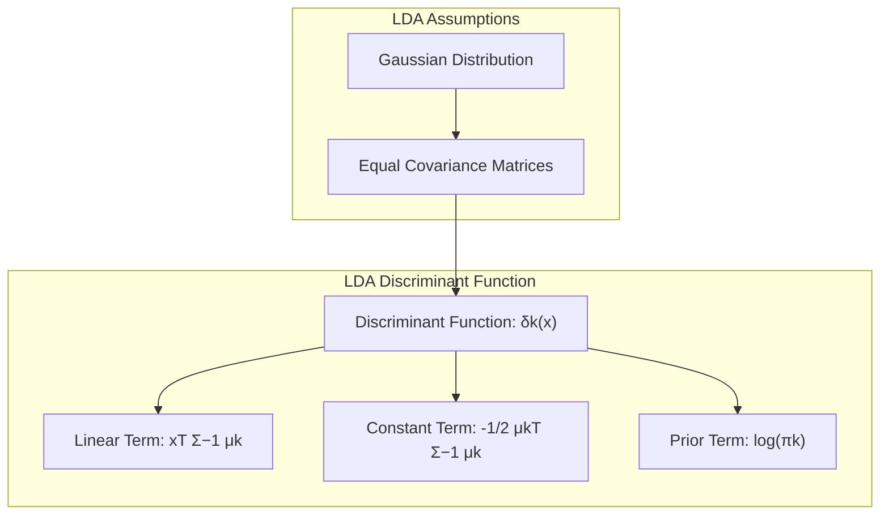
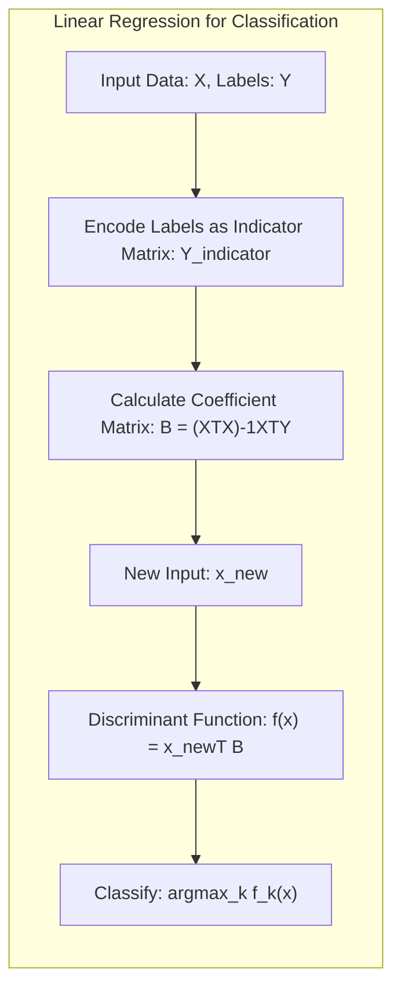
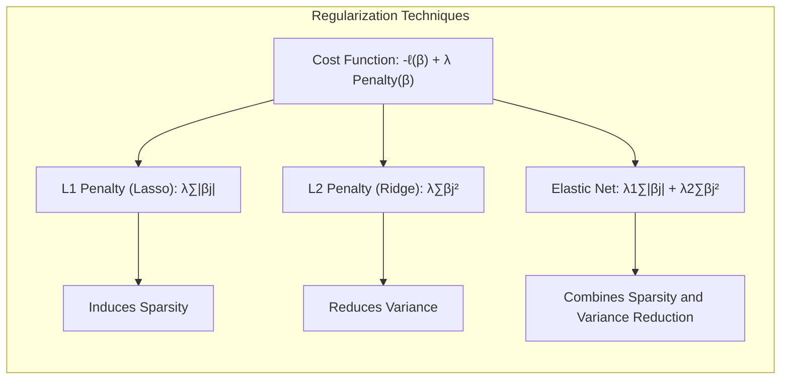

## Título Conciso: Métodos Lineares para Classificação: Fronteiras Lineares e Otimização

<imagem: Uma imagem composta mostrando uma série de gráficos. O gráfico principal deve ilustrar um espaço bidimensional com pontos de dados de duas ou mais classes separados por hiperplanos lineares. Um diagrama de fluxo de um algoritmo, como o Perceptron ou uma otimização de margem, também é mostrado, com etapas claras de como os hiperplanos são adaptados. Além disso, inclua um painel menor que compara modelos lineares (LDA, Logistic Regression) e suas fronteiras de decisão. Finalmente, uma seção que inclui mapas mentais com penalidades de regularização (L1 e L2) e o efeito em modelos lineares, utilizando a linguagem Mermaid.>

### Introdução

Este capítulo explora métodos lineares para classificação, com ênfase nas **fronteiras de decisão lineares**. Esses métodos, que utilizam **hiperplanos** para separar classes, são fundamentais no aprendizado de máquina devido à sua simplicidade, interpretabilidade e eficiência computacional. Os métodos lineares oferecem uma abordagem direta para classificação, dividindo o espaço de entrada em regiões associadas a diferentes classes por meio de combinações lineares das variáveis de entrada [^4.1].

Em métodos lineares de classificação, a predição da classe a partir de um conjunto de atributos de entrada é baseada em um modelo que define uma **função discriminante**. Essa função, quando avaliada em uma observação, fornece um valor que decide a classe a ser atribuída. Métodos lineares impõem que essa função discriminante seja linear no espaço de entrada ou em alguma transformação das variáveis de entrada [^4.1].

A busca por fronteiras de decisão lineares pode ser vista sob diferentes perspectivas. Uma delas é ajustar modelos de regressão linear para variáveis indicadoras de classe e classificar as observações com base no maior valor predito. Uma segunda abordagem é construir modelos que diretamente estimem as probabilidades a posteriori de cada classe através de funções lineares transformadas, como no caso da Regressão Logística. Uma terceira perspectiva é modelar as fronteiras de decisão como hiperplanos, definindo um problema de otimização com o objetivo de separar as classes de forma ótima, como no caso do Perceptron e dos hiperplanos separadores ótimos.

Ao longo deste capítulo, vamos detalhar os principais modelos lineares de classificação, suas formulações matemáticas, algoritmos de treinamento e as situações em que eles são mais adequados. Exploraremos tanto a Análise Discriminante Linear (LDA) e a Regressão Logística, discutindo sua relação com a regra de decisão bayesiana, como os modelos de hiperplanos separadores e o Perceptron, analisando suas características, vantagens e limitações. Abordaremos também como a regularização e a seleção de variáveis são aplicadas nesses métodos para melhorar a generalização e a interpretabilidade dos modelos.

### Conceitos Fundamentais

**Conceito 1: Classificação e Funções Discriminantes Lineares**

O objetivo fundamental da classificação é mapear um espaço de entrada *$X$* em um conjunto discreto de classes *$G$*, onde cada classe é representada por um rótulo. Uma função discriminante $f(x)$ atribui um valor a cada observação $x$, indicando a qual classe ela pertence. Nos **métodos lineares**, essa função tem a forma:
$$f(x) = \beta_0 + \beta^T x,$$
onde $\beta_0$ é o intercepto, $\beta$ é um vetor de pesos e $x$ é o vetor de atributos da observação.

A fronteira de decisão entre duas classes é o conjunto de pontos em que $f(x)$ assume um determinado valor (geralmente zero para decisões binárias ou quando comparamos duas funções discriminantes). Essa fronteira define um **hiperplano** no espaço de entrada, dividindo as observações em regiões associadas a cada classe.

**Lemma 1:** *A fronteira de decisão linear, resultado de um método de classificação linear, pode ser representada por um hiperplano, cujos parâmetros são determinados pelos pesos do modelo ($\beta$) e pelo intercepto ($\beta_0$).*

A prova deste Lemma é direta: a função discriminante linear $f(x) = \beta_0 + \beta^T x$ define a fronteira de decisão como o conjunto de pontos para os quais $f(x) = 0$. Essa equação descreve um hiperplano no espaço de entrada, onde o vetor $\beta$ define o vetor normal ao hiperplano e $\beta_0$ define sua posição no espaço. Qualquer ponto que esteja em um lado deste hiperplano é classificado em uma classe e do outro lado, em outra. Portanto, a linearidade da função discriminante garante que a fronteira de decisão seja um hiperplano. $\blacksquare$

> 💡 **Exemplo Numérico:**
>
> Suponha que temos duas classes, representadas por círculos vermelhos e azuis, e duas variáveis de entrada, $x_1$ e $x_2$. A função discriminante linear pode ser definida como:
> $$f(x) = -2 + 1.5x_1 + 0.5x_2$$
> Onde $\beta_0 = -2$, $\beta_1 = 1.5$ e $\beta_2 = 0.5$. Para classificar um ponto, digamos $x = (2, 3)$, calculamos:
> $$f(x) = -2 + 1.5(2) + 0.5(3) = -2 + 3 + 1.5 = 2.5$$
> Se $f(x) > 0$, classificamos como classe 1, caso contrário, classe 0. Neste caso, o ponto seria classificado na classe 1. A fronteira de decisão é definida por $f(x) = 0$, ou seja, $-2 + 1.5x_1 + 0.5x_2 = 0$, que é a equação de uma reta (um hiperplano em 2D).
>
> Visualmente, podemos representar isso no espaço 2D onde a linha $1.5x_1 + 0.5x_2 = 2$ separa os pontos.
>
> ```mermaid
>   graph LR
>       A["Input Space (x1, x2)"] --> B["Decision Boundary: 1.5x1 + 0.5x2 = 2"]
>       B --> C["Class 1: f(x) > 0"]
>       B --> D["Class 0: f(x) < 0"]
>       C --> E["Example: x=(2,3) classified as Class 1"]
> ```

**Conceito 2: Linear Discriminant Analysis (LDA) e a Premissa Gaussiana**

A Análise Discriminante Linear (LDA) é um método de classificação linear que assume que as classes são geradas por distribuições Gaussianas com uma **matriz de covariância comum**. Essa premissa simplifica a formulação do problema de classificação, levando a fronteiras de decisão lineares [^4.3].

A probabilidade condicional de uma observação *$x$* pertencer a uma classe *$k$* é modelada como uma distribuição Gaussiana:
$$f_k(x) = \frac{1}{(2\pi)^{p/2}|\Sigma|^{1/2}}exp\left(-\frac{1}{2}(x-\mu_k)^T\Sigma^{-1}(x-\mu_k)\right).$$
Ao comparar duas classes *$k$* e *$l$*, o log-odds das probabilidades a posteriori torna-se linear em *$x$*:
$$log \frac{Pr(G=k|X=x)}{Pr(G=l|X=x)} = log \frac{\pi_k}{\pi_l} - \frac{1}{2} (\mu_k - \mu_l)^T \Sigma^{-1} (\mu_k - \mu_l) + x^T \Sigma^{-1} (\mu_k - \mu_l),$$
onde $\mu_k$ são os vetores de média, $\Sigma$ é a matriz de covariância comum e $\pi_k$ são as probabilidades a priori das classes.

**Corolário 1:** *A função discriminante na LDA, expressa como $\delta_k(x) = x^T \Sigma^{-1} \mu_k - \frac{1}{2} \mu_k^T \Sigma^{-1} \mu_k + log(\pi_k)$, é uma função linear de x. A premissa de matriz de covariância comum garante que os termos quadráticos se cancelem, resultando em uma fronteira de decisão linear.*

A prova deste corolário segue diretamente da análise do log-odds na LDA. A forma linear da função discriminante $\delta_k(x)$ surge da premissa de igualdade de covariâncias entre as classes. O termo $x^T \Sigma^{-1} (\mu_k - \mu_l)$ que é linear em x garante que a fronteira de decisão entre as classes seja um hiperplano. Os outros termos dependem apenas dos parâmetros das classes. $\blacksquare$

> 💡 **Exemplo Numérico:**
>
> Suponha que temos duas classes com as seguintes médias e matriz de covariância comum:
>  - Classe 1: $\mu_1 = \begin{bmatrix} 1 \\ 1 \end{bmatrix}$
>  - Classe 2: $\mu_2 = \begin{bmatrix} 3 \\ 2 \end{bmatrix}$
>  - Matriz de covariância comum: $\Sigma = \begin{bmatrix} 1 & 0.5 \\ 0.5 & 1 \end{bmatrix}$
>  - Probabilidades a priori: $\pi_1 = 0.4$, $\pi_2 = 0.6$
>
> Primeiro, calculamos a inversa da matriz de covariância:
> $\Sigma^{-1} = \frac{1}{1 - 0.5^2} \begin{bmatrix} 1 & -0.5 \\ -0.5 & 1 \end{bmatrix} = \frac{4}{3} \begin{bmatrix} 1 & -0.5 \\ -0.5 & 1 \end{bmatrix} = \begin{bmatrix} 4/3 & -2/3 \\ -2/3 & 4/3 \end{bmatrix}$
>
> Agora, calculamos a função discriminante para cada classe:
>
> $\delta_1(x) = x^T \Sigma^{-1} \mu_1 - \frac{1}{2} \mu_1^T \Sigma^{-1} \mu_1 + log(\pi_1)$
>
> $\delta_2(x) = x^T \Sigma^{-1} \mu_2 - \frac{1}{2} \mu_2^T \Sigma^{-1} \mu_2 + log(\pi_2)$
>
> $\delta_1(x) = x^T \begin{bmatrix} 4/3 & -2/3 \\ -2/3 & 4/3 \end{bmatrix} \begin{bmatrix} 1 \\ 1 \end{bmatrix} - \frac{1}{2} \begin{bmatrix} 1 & 1 \end{bmatrix} \begin{bmatrix} 4/3 & -2/3 \\ -2/3 & 4/3 \end{bmatrix} \begin{bmatrix} 1 \\ 1 \end{bmatrix} + log(0.4)$
>
> $\delta_1(x) = x^T \begin{bmatrix} 2/3 \\ 2/3 \end{bmatrix} - \frac{1}{2} \begin{bmatrix} 1 & 1 \end{bmatrix} \begin{bmatrix} 2/3 \\ 2/3 \end{bmatrix} + log(0.4) = \frac{2}{3}x_1 + \frac{2}{3}x_2 - \frac{2}{3} + log(0.4)$
>
> $\delta_2(x) = x^T \begin{bmatrix} 4/3 & -2/3 \\ -2/3 & 4/3 \end{bmatrix} \begin{bmatrix} 3 \\ 2 \end{bmatrix} - \frac{1}{2} \begin{bmatrix} 3 & 2 \end{bmatrix} \begin{bmatrix} 4/3 & -2/3 \\ -2/3 & 4/3 \end{bmatrix} \begin{bmatrix} 3 \\ 2 \end{bmatrix} + log(0.6)$
>
> $\delta_2(x) = x^T \begin{bmatrix} 8/3 \\ 2/3 \end{bmatrix} - \frac{1}{2} \begin{bmatrix} 3 & 2 \end{bmatrix} \begin{bmatrix} 8/3 \\ -2/3 \end{bmatrix} + log(0.6) = \frac{8}{3}x_1 + \frac{2}{3}x_2 - \frac{10}{3} + log(0.6)$
>
> A fronteira de decisão é dada por $\delta_1(x) = \delta_2(x)$, que após simplificação, resulta em uma equação linear em x.



**Conceito 3: Regressão Logística e Probabilidades Posteriores**

A Regressão Logística modela diretamente as probabilidades a posteriori das classes usando a função logística. No caso de duas classes, a probabilidade de uma observação *$x$* pertencer à classe 1 é dada por:
$$Pr(G=1|X=x) = \frac{exp(\beta_0 + \beta^T x)}{1+exp(\beta_0 + \beta^T x)}.$$
A transformação logit do odds-ratio é linear em *$x$*:
$$\log \frac{Pr(G=1|X=x)}{Pr(G=2|X=x)} = \beta_0 + \beta^T x.$$

Diferente da LDA, a Regressão Logística não faz suposições sobre a distribuição das variáveis de entrada, estimando os parâmetros $\beta_0$ e $\beta$ por **máxima verossimilhança**, que busca encontrar os valores dos parâmetros que maximizam a probabilidade dos dados observados.

> 💡 **Exemplo Numérico:**
>
> Vamos considerar um modelo de regressão logística com uma única variável de entrada $x$ e os seguintes parâmetros:
> $\beta_0 = -3$ e $\beta_1 = 2$. A probabilidade de uma observação pertencer à classe 1 é dada por:
>
> $Pr(G=1|X=x) = \frac{exp(-3 + 2x)}{1+exp(-3 + 2x)}$
>
> Para um valor de $x = 1$, temos:
>
> $Pr(G=1|X=1) = \frac{exp(-3 + 2(1))}{1+exp(-3 + 2(1))} = \frac{exp(-1)}{1+exp(-1)} \approx \frac{0.368}{1+0.368} \approx 0.27$
>
> Para um valor de $x = 2$, temos:
>
> $Pr(G=1|X=2) = \frac{exp(-3 + 2(2))}{1+exp(-3 + 2(2))} = \frac{exp(1)}{1+exp(1)} \approx \frac{2.718}{1+2.718} \approx 0.73$
>
> Podemos ver que à medida que o valor de $x$ aumenta, a probabilidade de pertencer à classe 1 também aumenta, o que é intuitivo. A fronteira de decisão é definida quando $Pr(G=1|X=x) = 0.5$, o que ocorre quando $\beta_0 + \beta_1x = 0$, ou seja, $x = -\frac{\beta_0}{\beta_1} = -\frac{-3}{2} = 1.5$ neste caso.

> ⚠️ **Nota Importante**: A escolha entre LDA e Regressão Logística depende das premissas sobre os dados e do objetivo do problema. A LDA assume distribuições gaussianas com covariâncias iguais, enquanto a Regressão Logística modela diretamente as probabilidades a posteriori, sem suposições sobre a distribuição das variáveis de entrada. **Referência ao tópico [^4.4.1]**.

> ❗ **Ponto de Atenção**: Em situações com classes desbalanceadas, técnicas de balanceamento devem ser aplicadas para evitar viés nas estimativas da Regressão Logística. **Conforme indicado em [^4.4.2]**.

> ✔️ **Destaque**: LDA e Regressão Logística, apesar de derivações distintas, levam a modelos com funções discriminantes lineares. **Baseado no tópico [^4.5]**.

### Regressão Linear e Mínimos Quadrados para Classificação

<imagem: Um diagrama utilizando a linguagem Mermaid, mostrando o processo de regressão linear para classificação utilizando uma matriz de indicadores. Inicie com os dados de entrada (X) e um vetor de rótulos (Y). Em seguida, mostre a codificação das classes em uma matriz de indicadores (Y_indicador). Represente o cálculo da matriz de coeficientes B usando mínimos quadrados (Y_hat = XB). Mostre como uma nova entrada (x_novo) é classificada pela função discriminante (f(x) = x_novo^T B) e, finalmente, escolha a classe com o maior valor predito. As setas devem indicar o fluxo de informações e as diferentes etapas do processo. Use cores para diferenciar os dados, os resultados intermediários e os resultados finais. >

A regressão linear pode ser adaptada para classificação utilizando variáveis indicadoras. Em um problema com *$K$* classes, cada classe é representada por uma variável binária $Y_k$, tal que $Y_k = 1$ se a observação pertence à classe *$k$*, e $Y_k = 0$ caso contrário [^4.2]. Essas variáveis são agrupadas em um vetor $Y = (Y_1, \ldots, Y_K)$, e as *$N$* instâncias de treinamento formam uma matriz $N \times K$, denotada por $\mathbf{Y}$.

Um modelo de regressão linear é ajustado para cada coluna de $\mathbf{Y}$ simultaneamente, obtendo-se a matriz de coeficientes $\mathbf{B}$, onde cada coluna corresponde a uma classe [^4.2]:
$$\mathbf{B} = (\mathbf{X}^T \mathbf{X})^{-1} \mathbf{X}^T \mathbf{Y}$$
Para classificar uma nova observação *$x$*, calculamos as saídas ajustadas para cada classe:
$$f(x) = (1, x^T)\mathbf{B}.$$
A classe predita é aquela correspondente ao maior valor predito:
$$\hat{G}(x) = argmax_k f_k(x).$$

Embora essa abordagem seja simples e direta, ela tem algumas limitações. A principal é que as saídas da regressão linear não são necessariamente probabilidades (podem ser negativas ou maiores que 1) e a soma delas não é necessariamente igual a 1, ao contrário do que se espera em problemas de classificação. Apesar disso, em muitos casos, esse método pode levar a resultados comparáveis com outros métodos de classificação.

**Lemma 2:** *Sob a condição de um espaço de saída com apenas duas classes, o resultado da regressão linear da matriz de indicadores e o resultado do método discriminante linear (LDA) são proporcionais, indicando que ambos levam a fronteiras de decisão lineares similares.*

A prova deste lemma pode ser demonstrada através da análise da solução de mínimos quadrados na regressão linear e da função discriminante da LDA. Em problemas com duas classes, podemos codificar a classe como +1 ou -1, e podemos verificar que o vetor de coeficientes resultante da regressão linear é proporcional à direção definida pelo vetor de diferenças de médias ponderadas pela matriz de covariância, o mesmo vetor utilizado na função discriminante da LDA. A equivalência é estabelecida sob certas condições, especificamente quando o intercepto do LDA também é ajustado para minimizar o erro de classificação no conjunto de treinamento. $\blacksquare$

**Corolário 2:** *A equivalência entre a regressão linear e a LDA em problemas com duas classes, demonstra que ambos os métodos, embora baseados em princípios diferentes, podem produzir fronteiras de decisão lineares semelhantes. No entanto, esta equivalência não se mantém em problemas com mais de duas classes.*

Este corolário ressalta a robustez de ambos os métodos em casos particulares. Apesar de diferentes nas suas derivações, regressão linear e LDA podem chegar a decisões similares, em especial, quando se trata de duas classes, e as premissas da LDA são satisfeitas. É importante notar, no entanto, que a equivalência se desfaz quando o número de classes aumenta, onde as diferenças entre os métodos se tornam mais evidentes. $\blacksquare$

> 💡 **Exemplo Numérico:**
>
> Consideremos um conjunto de dados com 5 amostras e duas classes. As amostras são representadas por duas variáveis $x_1$ e $x_2$.
>
> Dados:
>
> | Amostra | $x_1$ | $x_2$ | Classe |
> |--------|-------|-------|--------|
> | 1      | 1     | 2     | 1      |
> | 2      | 1.5   | 1.8   | 1      |
> | 3      | 2     | 2.5   | 1      |
> | 4      | 4     | 1     | 2      |
> | 5      | 4.5   | 2     | 2      |
>
> Primeiro, codificamos as classes como variáveis indicadoras. A matriz $\mathbf{Y}$ será:
>
> $\mathbf{Y} = \begin{bmatrix} 1 & 0 \\ 1 & 0 \\ 1 & 0 \\ 0 & 1 \\ 0 & 1 \end{bmatrix}$
>
> E a matriz $\mathbf{X}$ (com um intercepto) é:
>
> $\mathbf{X} = \begin{bmatrix} 1 & 1 & 2 \\ 1 & 1.5 & 1.8 \\ 1 & 2 & 2.5 \\ 1 & 4 & 1 \\ 1 & 4.5 & 2 \end{bmatrix}$
>
> Calculamos $\mathbf{B}$ usando a fórmula de mínimos quadrados:
>
> $\mathbf{B} = (\mathbf{X}^T \mathbf{X})^{-1} \mathbf{X}^T \mathbf{Y}$
>
>  $\mathbf{X}^T \mathbf{X} = \begin{bmatrix} 5 & 13 & 9.3 \\ 13 & 43.5 & 27.6 \\ 9.3 & 27.6 & 19.69 \end{bmatrix}$
>
>  $(\mathbf{X}^T \mathbf{X})^{-1} \approx \begin{bmatrix} 3.69 & -1.36 & -1.86 \\ -1.36 & 0.63 & 0.42 \\ -1.86 & 0.42 & 0.95 \end{bmatrix}$
>
>  $\mathbf{X}^T \mathbf{Y} = \begin{bmatrix} 3 & 2 \\ 6.5 & 6.5 \\ 6.3 & 4.3 \end{bmatrix}$
>
>  $\mathbf{B} = (\mathbf{X}^T \mathbf{X})^{-1} \mathbf{X}^T \mathbf{Y} \approx  \begin{bmatrix} 3.69 & -1.36 & -1.86 \\ -1.36 & 0.63 & 0.42 \\ -1.86 & 0.42 & 0.95 \end{bmatrix} \begin{bmatrix} 3 & 2 \\ 6.5 & 6.5 \\ 6.3 & 4.3 \end{bmatrix} \approx \begin{bmatrix} 1.12 & -0.12 \\ -0.59 & 0.59 \\ -0.16 & 0.16 \end{bmatrix}$
>
> Para classificar uma nova amostra, por exemplo, $x_{new} = (3, 2)$, calculamos:
>
> $f(x_{new}) = (1, 3, 2) \mathbf{B} = \begin{bmatrix} 1 & 3 & 2 \end{bmatrix} \begin{bmatrix} 1.12 & -0.12 \\ -0.59 & 0.59 \\ -0.16 & 0.16 \end{bmatrix} = \begin{bmatrix} -1.23 & 1.23 \end{bmatrix}$
>
> Como o segundo valor é maior, classificamos $x_{new}$ como classe 2.

Apesar das limitações da regressão linear para classificação, ela é muitas vezes suficiente, especialmente quando o objetivo é obter uma fronteira de decisão linear simples e os dados não violam as premissas de forma muito significativa. Em alguns casos, uma abordagem usando regressão linear pode ser mais simples e computacionalmente eficiente do que outros métodos mais complexos.



### Métodos de Seleção de Variáveis e Regularização em Classificação

<imagem: Mapa mental utilizando Mermaid que conecta métodos de seleção de variáveis e regularização. O nó central é "Seleção de Variáveis e Regularização", com ramos para "Penalização L1 (Lasso)", "Penalização L2 (Ridge)", "Elastic Net", e "Seleção por Subconjuntos". Para cada método, mostre suas propriedades, como "Induz esparsidade" (L1), "Reduz a variância" (L2), "Combina L1 e L2" (Elastic Net), e "Avalia subconjuntos de variáveis" (Seleção por Subconjuntos). As setas devem mostrar como cada método impacta a função de custo e os parâmetros do modelo. Inclua fórmulas para os termos de penalização e uma descrição dos benefícios e limitações de cada método. Os nós também devem incluir onde esses métodos se encaixam nos modelos lineares de classificação (Regressão Logística).>

A seleção de variáveis e a regularização são técnicas fundamentais para lidar com a complexidade e evitar o sobreajuste em modelos de classificação, especialmente em contextos com um grande número de atributos [^4.5]. A **seleção de variáveis** visa identificar e reter apenas os atributos mais relevantes para o problema, reduzindo a dimensionalidade do espaço de entrada e melhorando a interpretabilidade do modelo. A **regularização**, por outro lado, adiciona uma penalidade à função de custo do modelo, controlando a magnitude dos parâmetros e evitando que o modelo se ajuste excessivamente ao ruído presente nos dados de treinamento [^4.4.4].

Em modelos lineares como a Regressão Logística, a função de custo geralmente é a log-verossimilhança, que mede o quão bem o modelo se ajusta aos dados. Para adicionar regularização, combinamos essa função com um termo que penaliza a complexidade do modelo, baseado nos seus coeficientes:
$$ \text{Custo} = - \ell(\beta) + \lambda \text{Penalidade}(\beta),$$
onde $\ell(\beta)$ representa a log-verossimilhança e $\text{Penalidade}(\beta)$ é uma função que depende dos coeficientes $\beta$.

A **penalização L1 (Lasso)** adiciona um termo proporcional à soma dos valores absolutos dos coeficientes:
$$ \text{Penalidade}_{L1}(\beta) = \sum_{j=1}^p |\beta_j|,$$
onde $\lambda$ controla a intensidade da penalidade. Essa penalidade tende a gerar soluções esparsas, onde muitos coeficientes são exatamente zero, selecionando um subconjunto de variáveis mais relevantes [^4.4.4].

A **penalização L2 (Ridge)** adiciona um termo proporcional à soma dos quadrados dos coeficientes:
$$\text{Penalidade}_{L2}(\beta) = \sum_{j=1}^p \beta_j^2.$$
Essa penalidade reduz a magnitude dos coeficientes, diminuindo a variância do modelo, mas não leva a soluções esparsas.

O **Elastic Net** combina as penalidades L1 e L2:
$$\text{Penalidade}_{ElasticNet}(\beta) = \lambda_1 \sum_{j=1}^p |\beta_j| + \lambda_2 \sum_{j=1}^p \beta_j^2.$$
Essa abordagem visa aproveitar as vantagens de ambas as penalidades, promovendo tanto a esparsidade quanto a redução da variância.

**Lemma 3:** *A penalização L1 em modelos de classificação logística leva à soluções esparsas, ou seja, muitos coeficientes são iguais a zero. Essa característica é consequência da não diferenciabilidade da norma L1 na origem, o que leva a soluções em que muitos coeficientes são exatamente zero.*

A prova deste Lemma pode ser feita utilizando as condições de otimalidade de Karush-Kuhn-Tucker (KKT), que indicam que a solução de um problema de otimização com restrições deve satisfazer certas condições. No caso da penalização L1, a condição de KKT para um coeficiente $\beta_j$ é que o gradiente do custo em relação a $\beta_j$ deve ser igual a zero, ou seja:
$$
-\frac{\partial \ell(\beta)}{\partial \beta_j} + \lambda \cdot \text{sign}(\beta_j) = 0
$$
No entanto, o termo de penalização é subgradiente, não diferenciável na origem, o que implica que para o coeficiente $\beta_j$ ser igual a zero, a derivada da função de custo (sem regularização) deve ser menor do que $\lambda$. Caso contrário, $\beta_j$ será diferente de zero. A penalização L1 empurra alguns coeficientes para zero. $\blacksquare$

**Corolário 3:** *A esparsidade promovida pela regularização L1 leva à seleção automática de variáveis, tornando o modelo mais interpretável ao identificar os atributos mais relevantes para a classificação. Além disso, a redução do número de variáveis contribui para a redução da complexidade do modelo e, consequentemente, para a redução do risco de sobreajuste.*

O corolário segue da demonstração do Lemma 3. Como a penalização L1 leva à soluções esparsas, o resultado é que as variáveis com coeficientes diferentes de zero são as que têm maior impacto no processo de classificação. Isso facilita a interpretação dos resultados, pois podemos identificar quais são os atributos mais relevantes para o problema. $\blacksquare$

> 💡 **Exemplo Numérico:**
>
> Vamos considerar um problema de classificação com 3 variáveis de entrada ($x_1$, $x_2$, $x_3$) e duas classes, usando regressão logística. Suponha que, sem regularização, os coeficientes do modelo sejam:
> $\beta_0 = -1$, $\beta_1 = 0.8$, $\beta_2 = -0.5$, $\beta_3 = 1.2$.
>
> Agora, vamos aplicar a regularização L1 (Lasso) com diferentes valores de $\lambda$:
>
> - **$\lambda = 0.5$**: Os coeficientes podem se tornar:
>  $\beta_0 = -0.9$, $\beta_1 = 0.4$, $\beta_2 = 0$, $\beta_3 = 0.9$. Observe que $\beta_2$ foi zerado, indicando que a variável $x_2$ é menos relevante.
>
> - **$\lambda = 1.0$**: Os coeficientes podem se tornar:
>  $\beta_0 = -0.8$, $\beta_1 = 0$, $\beta_2 = 0$, $\beta_3 = 0.5$. Agora, tanto $\beta_1$ quanto $\beta_2$ são zerados, indicando que apenas $x_3$ é relevante.
>
> Com a regularização L2 (Ridge), os coeficientes seriam reduzidos, mas nenhum seria exatamente zero. Por exemplo, com $\lambda = 0.5$:
>
>  $\beta_0 = -0.95$, $\beta_1 = 0.5$, $\beta_2 = -0.3$, $\beta_3 = 0.8$.
>
> O Elastic Net, por sua vez, combina os dois efeitos, resultando em uma solução intermediária.
>
> Podemos comparar os resultados em uma tabela:
>
> | Método      | $\beta_0$ | $\beta_1$ | $\beta_2$ | $\beta_3$ |
> |-------------|----------|----------|----------|----------|
> | Sem Reg.    | -1       | 0.8      | -0.5     | 1.2      |
> | Lasso ($\lambda=0.5$) | -0.9    | 0.4      | 0        | 0.9      |
> | Lasso ($\lambda=1.0$) | -0.8    | 0        | 0        | 0.5      |
> | Ridge ($\lambda=0.5$)   | -0.95    | 0.5      | -0.3     | 0.8      |
>
> Observe como o Lasso promove a esparsidade, zerando coeficientes, enquanto o Ridge reduz sua magnitude.



> ⚠️ **Ponto Crucial**: A escolha da regularização L1, L2, ou Elastic Net depende das características dos dados e do objetivo do modelo. Em geral, L1 é útil para seleção de variáveis, L2 para redução da variância, e Elastic Net para combinar os benefícios de ambas as penalidades. **Conforme discutido em [^4.5]**.

### Separating Hyperplanes e Perceptrons

<imagem: Diagrama visual utilizando a linguagem Mermaid para apresentar a construção de hiperplanos separadores. Inicie com um conjunto de dados de duas classes, separados por um hiperplano. Mostre a margem, que é a distância entre o hiperplano e os pontos mais próximos das duas classes. Represente os vetores de suporte, que são os pontos que definem a margem. Inclua a formula