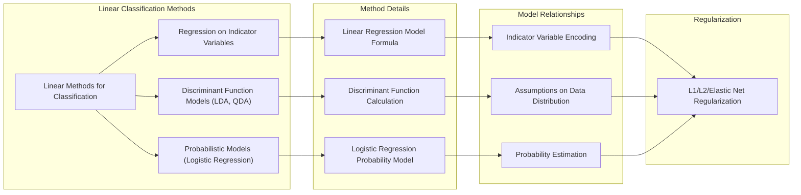
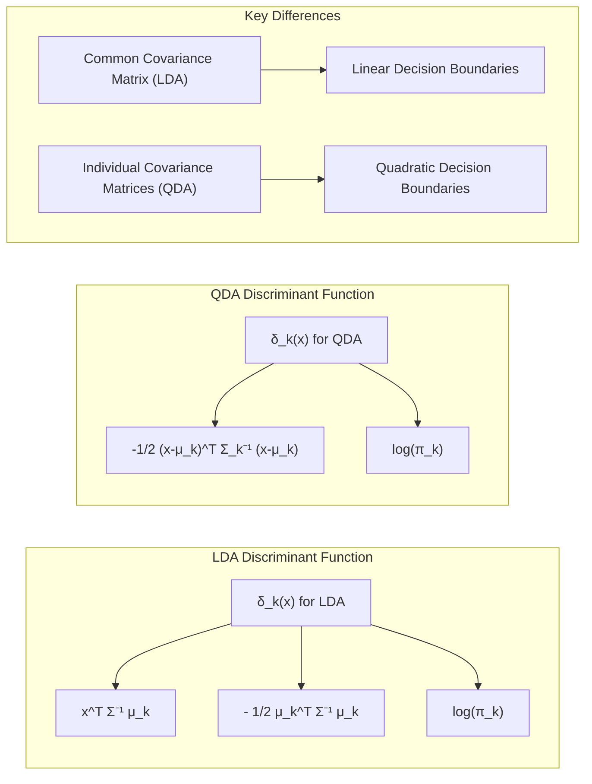
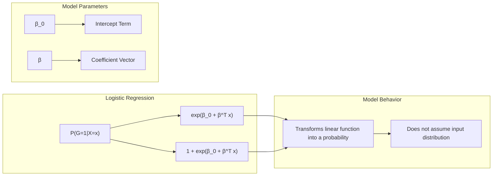
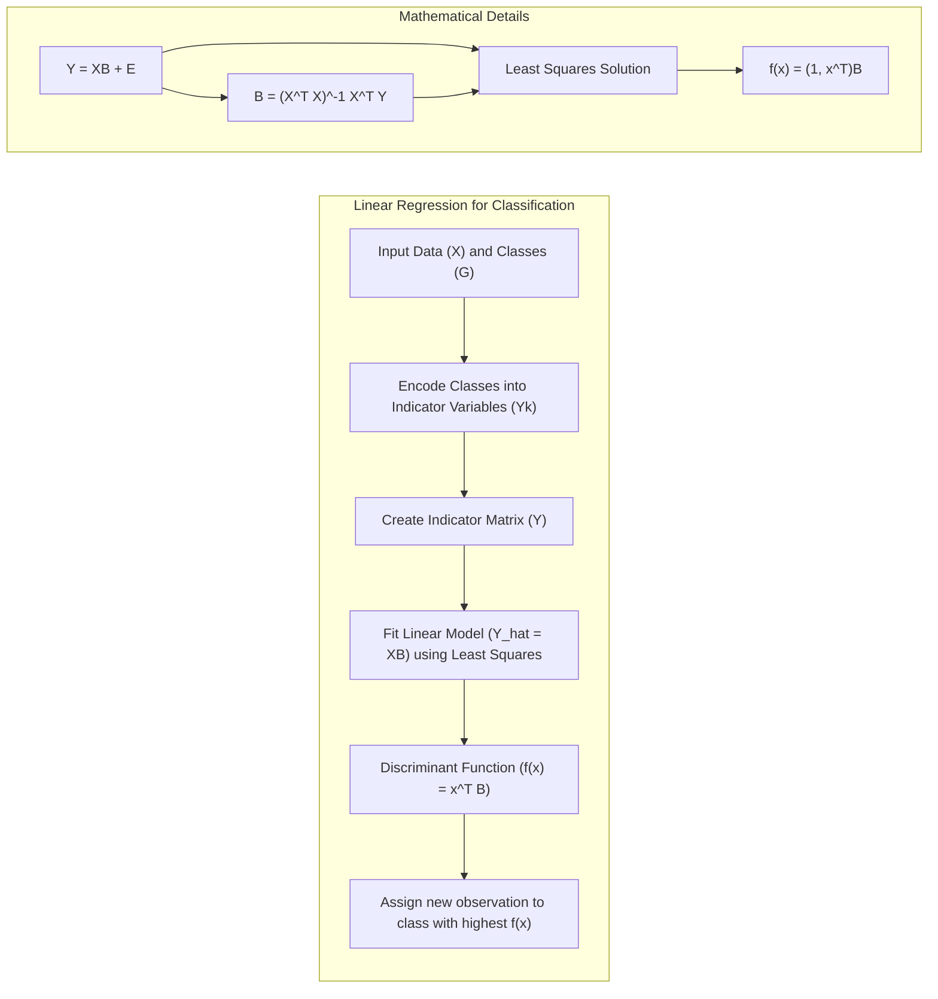
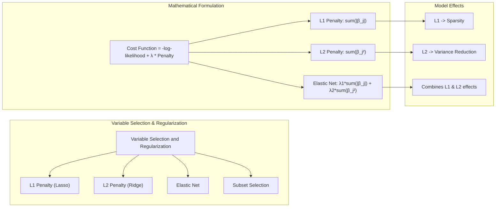
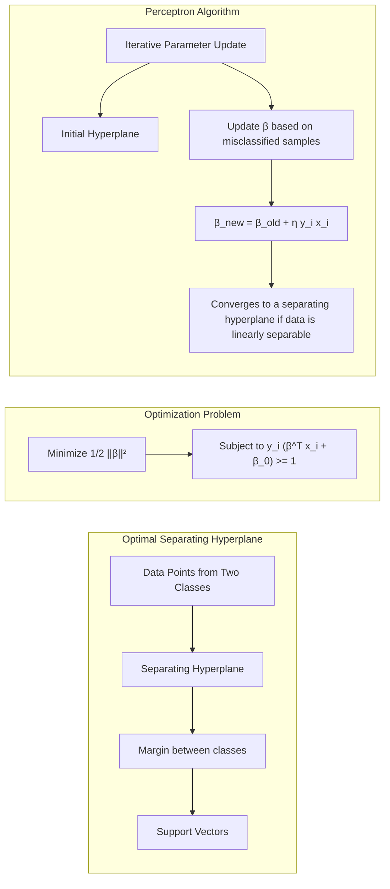

## Título Conciso: Métodos Lineares para Classificação: Regressão, Discriminantes e Probabilidades

### Introdução

Este capítulo foca em métodos lineares para classificação, explorando três abordagens principais: **Regressão Linear em Variáveis Indicadoras**, **Modelos de Funções Discriminantes** e **Modelos Probabilísticos**. Cada uma dessas abordagens oferece uma maneira distinta de construir fronteiras de decisão lineares, utilizando combinações lineares dos atributos de entrada para atribuir amostras a diferentes classes [^4.1].

A **Regressão Linear em Variáveis Indicadoras** utiliza a regressão linear para modelar variáveis binárias que indicam a quais classes cada observação pertence, atribuindo a classe com o maior valor predito. Essa abordagem é simples e intuitiva, mas tem limitações em termos de garantir que os valores preditos se comportem como probabilidades. Já os **Modelos de Funções Discriminantes**, como a Análise Discriminante Linear (LDA) e Análise Discriminante Quadrática (QDA), definem funções que determinam a classe de uma observação com base em sua pontuação discriminante. Esses modelos fazem premissas sobre a distribuição dos dados, como a normalidade. Os **Modelos Probabilísticos**, como a Regressão Logística, modelam diretamente as probabilidades a posteriori das classes, usando funções lineares transformadas, como a função logística, e não impõem premissas sobre a distribuição das variáveis de entrada.

Ao longo deste capítulo, vamos detalhar cada um desses métodos, suas formulações matemáticas, algoritmos de ajuste e os cenários em que são mais apropriados. Vamos discutir como as premissas de cada abordagem influenciam as decisões de classificação e como a regularização pode ser utilizada para melhorar a generalização dos modelos. Vamos também explorar as conexões entre essas três abordagens, mostrando como diferentes formas de modelagem linear podem levar a resultados similares ou complementares.

### Conceitos Fundamentais

**Conceito 1: O Problema de Classificação e Abordagens Lineares**

O problema de classificação busca atribuir uma observação $x$ a uma de *K* classes distintas, ou seja, um rótulo discreto $G$ a partir de um espaço de atributos $X$. Os métodos lineares abordam esse problema através da construção de funções discriminantes lineares, que dividem o espaço de entrada em regiões associadas a cada classe, ou modelando diretamente as probabilidades das classes utilizando funções lineares.

As abordagens lineares se caracterizam pela simplicidade, facilidade de interpretação e eficiência computacional. No entanto, essa abordagem pode não ser adequada para problemas com fronteiras de decisão complexas. A escolha entre diferentes métodos lineares depende das premissas sobre a distribuição dos dados, do objetivo do problema (classificação ou estimação de probabilidades) e da necessidade de interpretabilidade.

**Lemma 1:** *Modelos lineares de classificação produzem fronteiras de decisão lineares, e.g., hiperplanos no espaço de atributos, independentemente de serem modelos de regressão com variáveis indicadoras, modelos de funções discriminantes ou modelos probabilísticos baseados em transformação linear.*

A prova deste lemma pode ser feita através da análise das diferentes formulações. Em todos os casos, a decisão de classe é baseada em uma função linear, que separa as classes. Na regressão com variáveis indicadoras, a classe é definida pelo maior valor de uma combinação linear das variáveis. Nos modelos discriminantes, a fronteira de decisão é dada por onde duas funções discriminantes lineares são iguais. Nos modelos probabilísticos, a fronteira de decisão também é obtida por uma função linear, como o log-odds, que é linear em termos dos atributos. Portanto, todos os modelos lineares levam a hiperplanos. $\blacksquare$

**Conceito 2: Modelos de Funções Discriminantes: LDA e QDA**

Os modelos de funções discriminantes, como a Análise Discriminante Linear (LDA) e a Análise Discriminante Quadrática (QDA), são métodos de classificação que buscam construir funções discriminantes $\delta_k(x)$ para cada classe *k*, de modo que a observação $x$ seja atribuída à classe que maximiza $\delta_k(x)$. A LDA assume que as classes têm distribuições Gaussianas com uma mesma matriz de covariância ($\Sigma$), enquanto que o QDA não faz essa premissa.

No LDA, a função discriminante é dada por:
$$\delta_k(x) = x^T \Sigma^{-1} \mu_k - \frac{1}{2} \mu_k^T \Sigma^{-1} \mu_k + \log(\pi_k),$$
que é uma função linear de $x$, onde $\mu_k$ é a média da classe *k*, $\pi_k$ é a probabilidade a priori da classe *k* e $\Sigma$ é a matriz de covariância comum. Em contraste, no QDA, as funções discriminantes são quadráticas em *x* devido à ausência da premissa de covariância comum:
$$\delta_k(x) = -\frac{1}{2}(x-\mu_k)^T\Sigma_k^{-1}(x-\mu_k) + \log(\pi_k).$$

> 💡 **Exemplo Numérico:**
>
> Vamos considerar um exemplo simplificado com duas classes e duas características. Suponha que temos as seguintes médias e matriz de covariância para LDA:
>
> - Classe 1: $\mu_1 = [1, 1]^T$
> - Classe 2: $\mu_2 = [3, 3]^T$
> - Matriz de covariância comum: $\Sigma = \begin{bmatrix} 1 & 0.5 \\ 0.5 & 1 \end{bmatrix}$
> - Probabilidades a priori: $\pi_1 = 0.6$, $\pi_2 = 0.4$
>
> Para calcular a função discriminante para um ponto $x = [2, 2]^T$, primeiro precisamos calcular $\Sigma^{-1}$:
>
> $\Sigma^{-1} = \frac{1}{(1*1 - 0.5*0.5)} \begin{bmatrix} 1 & -0.5 \\ -0.5 & 1 \end{bmatrix} = \frac{1}{0.75} \begin{bmatrix} 1 & -0.5 \\ -0.5 & 1 \end{bmatrix} = \begin{bmatrix} 1.33 & -0.67 \\ -0.67 & 1.33 \end{bmatrix}$
>
> Agora, calculemos $\delta_1(x)$ e $\delta_2(x)$:
>
> $\delta_1(x) = \begin{bmatrix} 2 & 2 \end{bmatrix} \begin{bmatrix} 1.33 & -0.67 \\ -0.67 & 1.33 \end{bmatrix} \begin{bmatrix} 1 \\ 1 \end{bmatrix} - \frac{1}{2} \begin{bmatrix} 1 & 1 \end{bmatrix} \begin{bmatrix} 1.33 & -0.67 \\ -0.67 & 1.33 \end{bmatrix} \begin{bmatrix} 1 \\ 1 \end{bmatrix} + \log(0.6)$
>
> $\delta_1(x) = \begin{bmatrix} 2 & 2 \end{bmatrix} \begin{bmatrix} 0.66 \\ 0.66 \end{bmatrix} - \frac{1}{2} \begin{bmatrix} 1 & 1 \end{bmatrix} \begin{bmatrix} 0.66 \\ 0.66 \end{bmatrix} + \log(0.6)$
>
> $\delta_1(x) = 2.64 - 0.66 + (-0.51) = 1.47$
>
> $\delta_2(x) = \begin{bmatrix} 2 & 2 \end{bmatrix} \begin{bmatrix} 1.33 & -0.67 \\ -0.67 & 1.33 \end{bmatrix} \begin{bmatrix} 3 \\ 3 \end{bmatrix} - \frac{1}{2} \begin{bmatrix} 3 & 3 \end{bmatrix} \begin{bmatrix} 1.33 & -0.67 \\ -0.67 & 1.33 \end{bmatrix} \begin{bmatrix} 3 \\ 3 \end{bmatrix} + \log(0.4)$
>
> $\delta_2(x) = \begin{bmatrix} 2 & 2 \end{bmatrix} \begin{bmatrix} 1.98 \\ 1.98 \end{bmatrix} - \frac{1}{2} \begin{bmatrix} 3 & 3 \end{bmatrix} \begin{bmatrix} 1.98 \\ 1.98 \end{bmatrix} + \log(0.4)$
>
> $\delta_2(x) = 7.92 - 5.94 + (-0.92) = 1.06$
>
> Como $\delta_1(x) > \delta_2(x)$, o ponto $x$ seria classificado como pertencente à classe 1.

**Corolário 1:** *Enquanto a LDA gera funções discriminantes lineares devido à premissa de covariância comum, o QDA gera funções discriminantes quadráticas devido à estimação de diferentes matrizes de covariância para cada classe, resultando em fronteiras de decisão lineares e não lineares, respectivamente.*

A prova deste corolário pode ser feita através da comparação das funções discriminantes dos dois métodos. No LDA, a premissa de igualdade das matrizes de covariância entre as classes leva ao cancelamento dos termos quadráticos na equação, resultando em um função discriminante linear. No QDA, ao assumir matrizes de covariância distintas, os termos quadráticos não se cancelam, levando a funções quadráticas. $\blacksquare$

**Conceito 3: Modelos Probabilísticos: Regressão Logística**

A Regressão Logística é um modelo probabilístico que modela diretamente a probabilidade posterior de uma observação *x* pertencer a uma classe *k* por meio de uma função linear transformada pela função logística (sigmoide). Para o caso binário (duas classes), a probabilidade de *x* pertencer à classe 1 é dada por:
$$P(G=1|X=x) = \frac{\exp(\beta_0 + \beta^T x)}{1+\exp(\beta_0 + \beta^T x)},$$
onde $\beta_0$ e $\beta$ são os parâmetros do modelo.

A Regressão Logística não faz suposições sobre a distribuição das variáveis de entrada, diferentemente do LDA. Os parâmetros são geralmente estimados por máxima verossimilhança, ou seja, os parâmetros que maximizam a probabilidade dos dados observados dada a forma funcional do modelo.

> ⚠️ **Nota Importante**:  A Regressão Logística modela diretamente as probabilidades posteriores, enquanto o LDA deriva as probabilidades a partir de suposições sobre as distribuições das variáveis de entrada. A escolha entre eles depende do objetivo da modelagem e das características dos dados. **Referência ao tópico [^4.5]**.

> ❗ **Ponto de Atenção**: Em situações com classes desbalanceadas, é crucial usar técnicas de balanceamento para evitar vieses nas estimativas da Regressão Logística. **Conforme indicado em [^4.4.2]**.

> ✔️ **Destaque**: LDA, QDA e Regressão Logística, embora distintos em suas formulações, representam abordagens importantes para classificação linear, cada um com suas particularidades e aplicabilidades. **Baseado nos tópicos [^4.3] e [^4.4]**.

### Regressão Linear e Mínimos Quadrados para Classificação

A regressão linear pode ser usada para classificação através da codificação das classes em variáveis indicadoras. Se o problema de classificação tem *K* classes, para cada amostra *i* é definido um vetor $y_i$, de tamanho *K*, onde $y_{ik} = 1$ se a amostra *i* pertence à classe *k*, e $y_{ik} = 0$ caso contrário. A matriz de indicadores $\mathbf{Y}$ é uma matriz $N \times K$, onde $N$ é o número de amostras. Em seguida, ajustamos um modelo de regressão linear para cada coluna de $\mathbf{Y}$ através da equação:
$$\mathbf{Y} = \mathbf{X}\mathbf{B} + \mathbf{E},$$
onde $\mathbf{X}$ é a matriz de design com as variáveis de entrada, $\mathbf{B}$ é a matriz de coeficientes e $\mathbf{E}$ é a matriz de erros. A solução de mínimos quadrados para $\mathbf{B}$ é:
$$\mathbf{B} = (\mathbf{X}^T\mathbf{X})^{-1}\mathbf{X}^T\mathbf{Y}.$$

Para classificar uma nova observação $x$, computamos os valores preditos para cada classe através da equação:
$$f(x) = (1, x^T)\mathbf{B}.$$
A classe predita é aquela correspondente ao maior valor predito:
$$\hat{G}(x) = \arg\max_k f_k(x).$$

Embora esse método seja simples e intuitivo, ele tem algumas limitações. A regressão linear não garante que os valores preditos estejam no intervalo [0,1] ou que a soma dos valores preditos para uma mesma observação seja igual a 1. Além disso, esse método é muito sensível a outliers e pode não produzir bons resultados em casos em que as classes não são bem separadas.

> 💡 **Exemplo Numérico:**
>
> Considere um problema de classificação binária com 3 amostras e 2 atributos. Os dados são:
>
> - Amostra 1: $x_1 = [1, 2]^T$, Classe 1
> - Amostra 2: $x_2 = [2, 1]^T$, Classe 1
> - Amostra 3: $x_3 = [3, 4]^T$, Classe 2
>
> Primeiro, criamos a matriz de design $\mathbf{X}$ (adicionando uma coluna de 1s para o intercepto) e a matriz de indicadores $\mathbf{Y}$:
>
> $\mathbf{X} = \begin{bmatrix} 1 & 1 & 2 \\ 1 & 2 & 1 \\ 1 & 3 & 4 \end{bmatrix}$
>
> $\mathbf{Y} = \begin{bmatrix} 1 & 0 \\ 1 & 0 \\ 0 & 1 \end{bmatrix}$
>
> Agora, calculamos $\mathbf{B} = (\mathbf{X}^T\mathbf{X})^{-1}\mathbf{X}^T\mathbf{Y}$.
>
> $\mathbf{X}^T\mathbf{X} = \begin{bmatrix} 3 & 6 & 7 \\ 6 & 14 & 16 \\ 7 & 16 & 21 \end{bmatrix}$
>
> $(\mathbf{X}^T\mathbf{X})^{-1} = \begin{bmatrix} 5.33 & -2.67 & 0.67 \\ -2.67 & 1.67 & -0.33 \\ 0.67 & -0.33 & 0.07 \end{bmatrix}$
>
> $\mathbf{X}^T\mathbf{Y} = \begin{bmatrix} 2 & 1 \\ 3 & 2 \\ 7 & 4 \end{bmatrix}$
>
> $\mathbf{B} = (\mathbf{X}^T\mathbf{X})^{-1}\mathbf{X}^T\mathbf{Y} = \begin{bmatrix} 5.33 & -2.67 & 0.67 \\ -2.67 & 1.67 & -0.33 \\ 0.67 & -0.33 & 0.07 \end{bmatrix} \begin{bmatrix} 2 & 1 \\ 3 & 2 \\ 7 & 4 \end{bmatrix} = \begin{bmatrix} 1.67 & 0.33 \\ -0.67 & 0.33 \\ 0.07 & -0.07 \end{bmatrix}$
>
> Para classificar um novo ponto $x_{new} = [2, 3]^T$, adicionamos o intercepto e calculamos $f(x)$:
>
> $f(x_{new}) = \begin{bmatrix} 1 & 2 & 3 \end{bmatrix} \begin{bmatrix} 1.67 & 0.33 \\ -0.67 & 0.33 \\ 0.07 & -0.07 \end{bmatrix} = \begin{bmatrix} 0.43 & 0.43 \end{bmatrix}$
>
> Como $f_1(x_{new}) > f_2(x_{new})$, a nova observação seria classificada como Classe 1.

**Lemma 2:** *A fronteira de decisão obtida pela regressão linear de variáveis indicadoras, em problemas de classificação binária com codificação -1 e 1, é proporcional à obtida pela Análise Discriminante Linear (LDA) com a mesma codificação, indicando que ambos os modelos geram separações lineares equivalentes em alguns casos.*

A prova deste Lemma reside na comparação das soluções obtidas pelos dois métodos. Na regressão linear com codificação -1 e 1, a solução de mínimos quadrados para o vetor de coeficientes é proporcional ao vetor de diferença das médias das classes ponderado pela inversa da matriz de covariância, que é o mesmo vetor definido para a função discriminante na LDA. Essa proporcionalidade indica que os dois métodos produzem a mesma fronteira de decisão linear. $\blacksquare$

**Corolário 2:** *A equivalência entre a regressão linear em variáveis indicadoras e o LDA em problemas de classificação binária, sob certas premissas, demonstra que ambos os métodos exploram conceitos similares para definir fronteiras de decisão lineares, apesar de serem derivados de formulações distintas.*

O corolário segue diretamente do Lemma 2, e demonstra que os dois modelos, embora baseados em princípios diferentes, conseguem chegar a decisões similares, em especial para o cenário binário com uma codificação específica. $\blacksquare$

Em alguns cenários, como os de dados bem separados, a regressão linear pode ser suficiente e até mesmo vantajosa quando o objetivo principal é encontrar uma fronteira de decisão linear, sem necessidade de uma interpretação probabilística.

### Métodos de Seleção de Variáveis e Regularização em Classificação

A seleção de variáveis e a regularização são técnicas cruciais para lidar com a complexidade e evitar o sobreajuste em modelos de classificação linear, especialmente quando o número de atributos é grande [^4.5]. A **seleção de variáveis** visa escolher um subconjunto dos atributos que são mais relevantes para a classificação, reduzindo a dimensionalidade do espaço de entrada e melhorando a interpretabilidade do modelo. A **regularização** adiciona uma penalidade à função de custo, controlando a magnitude dos parâmetros do modelo e reduzindo o risco de sobreajuste.

A função de custo geral para modelos lineares de classificação com regularização é da forma:
$$\text{Custo} = -\ell(\beta) + \lambda \cdot \text{Penalidade}(\beta),$$
onde $\ell(\beta)$ é a log-verossimilhança, $\beta$ é o vetor de parâmetros e $\text{Penalidade}(\beta)$ é o termo de penalização, e $\lambda$ é um hiperparâmetro que controla a intensidade da regularização.

A **penalização L1 (Lasso)** usa a norma L1 dos coeficientes:
$$\text{Penalidade}_{L1}(\beta) = \sum_{j=1}^p |\beta_j|.$$
Essa penalidade tem o efeito de induzir a esparsidade, levando a modelos onde muitos coeficientes são iguais a zero, selecionando automaticamente um subconjunto de variáveis mais relevantes.

A **penalização L2 (Ridge)** usa a norma L2 dos coeficientes:
$$\text{Penalidade}_{L2}(\beta) = \sum_{j=1}^p \beta_j^2.$$
Essa penalidade reduz a magnitude dos coeficientes, diminuindo a variância do modelo, mas geralmente não leva a soluções esparsas.

O **Elastic Net** combina as penalidades L1 e L2:
$$\text{Penalidade}_{ElasticNet}(\beta) = \lambda_1 \sum_{j=1}^p |\beta_j| + \lambda_2 \sum_{j=1}^p \beta_j^2.$$
Essa abordagem visa combinar os benefícios de ambas as penalidades, induzindo a esparsidade e reduzindo a variância.

> 💡 **Exemplo Numérico:**
>
> Suponha que temos um problema de regressão logística com 3 atributos ($x_1, x_2, x_3$) e os seguintes coeficientes obtidos por máxima verossimilhança sem regularização: $\beta = [0.8, -1.2, 0.5]$. Vamos calcular as penalidades para diferentes métodos com $\lambda = 0.1$.
>
> **Lasso (L1):**
>
> $\text{Penalidade}_{L1}(\beta) = |0.8| + |-1.2| + |0.5| = 2.5$
>
> $\text{Custo}_{L1} = -\ell(\beta) + 0.1 * 2.5 = -\ell(\beta) + 0.25$
>
> **Ridge (L2):**
>
> $\text{Penalidade}_{L2}(\beta) = 0.8^2 + (-1.2)^2 + 0.5^2 = 0.64 + 1.44 + 0.25 = 2.33$
>
> $\text{Custo}_{L2} = -\ell(\beta) + 0.1 * 2.33 = -\ell(\beta) + 0.233$
>
> **Elastic Net (com $\lambda_1 = 0.05$ e $\lambda_2 = 0.05$):**
>
> $\text{Penalidade}_{ElasticNet}(\beta) = 0.05 * 2.5 + 0.05 * 2.33 = 0.125 + 0.1165 = 0.2415$
>
> $\text{Custo}_{ElasticNet} = -\ell(\beta) + 0.2415$
>
> A regularização L1 penaliza mais fortemente os coeficientes, induzindo esparsidade. Ridge penaliza menos, encolhendo os coeficientes. Elastic Net combina os dois efeitos. Em termos de custo, a penalização é adicionada ao custo original, afetando o processo de otimização.
>
> Suponha que, após aplicar a regularização, os coeficientes se tornem:
>
> - Lasso: $\beta_{L1} = [0.5, -0.8, 0]$
> - Ridge: $\beta_{L2} = [0.7, -1.1, 0.4]$
> - Elastic Net: $\beta_{EN} = [0.6, -0.9, 0.2]$
>
> O Lasso zerou o coeficiente de $x_3$, indicando que este atributo pode não ser relevante para o modelo. Ridge e Elastic Net encolheram os coeficientes, mas não os zeraram.

**Lemma 3:** *A penalização L1, aplicada a modelos lineares de classificação, produz uma solução com um número menor de coeficientes diferentes de zero em comparação com a penalização L2 ou a ausência de regularização, facilitando a seleção de variáveis.*

A prova deste Lemma se baseia nas propriedades da norma L1. A norma L1 não é diferenciável na origem, o que leva a um “empurrão” dos coeficientes para zero durante o processo de otimização, ao contrário da norma L2, que é diferenciável em toda a sua extensão. O efeito é que a penalização L1 tende a favorecer soluções esparsas, enquanto que a L2 tende a “encolher” todos os coeficientes uniformemente. $\blacksquare$

**Corolário 3:** *Modelos lineares de classificação, com a aplicação da regularização L1, oferecem uma forma eficaz de seleção de variáveis, selecionando automaticamente os atributos mais importantes para a classificação e reduzindo a complexidade do modelo.*

Este corolário segue diretamente do Lemma 3, indicando que a penalização L1 não apenas reduz o risco de sobreajuste, mas também aumenta a interpretabilidade do modelo, ao focar apenas nos atributos mais relevantes. $\blacksquare$

> ⚠️ **Ponto Crucial**: A escolha do tipo de regularização (L1, L2 ou Elastic Net) depende do objetivo do modelo e das características dos dados. L1 é apropriada para seleção de variáveis, enquanto que L2 é mais apropriada para problemas que necessitam de redução da variância. **Conforme discutido em [^4.5]**.

### Separating Hyperplanes e Perceptrons

A abordagem de **hiperplanos separadores** visa encontrar uma fronteira linear que não apenas separa as classes, mas também maximiza a margem entre elas, onde a margem é definida como a menor distância entre o hiperplano e as amostras mais próximas de cada classe, chamadas de **vetores de suporte** [^4.5.2]. Essa abordagem é fundamental em métodos como as **Support Vector Machines (SVM)**.

O problema de otimização para encontrar o hiperplano separador ótimo pode ser expresso como:
$$
\begin{aligned}
    \max_{\beta,\beta_0} \quad & M \\
    \text{s.t.} \quad & y_i (\beta^T x_i + \beta_0) \geq M, \quad \forall i = 1, \ldots, N,
\end{aligned}
$$
onde $M$ é a largura da margem, $\beta$ é o vetor normal ao hiperplano, $\beta_0$ é o intercepto e $y_i$ é o rótulo da classe da observação $x_i$. Ao fixar a margem em 1, podemos transformar o problema em:
$$
\begin{aligned}
  \min_{\beta,\beta_0} \quad & \frac{1}{2} ||\beta||^2 \\
  \text{s.t.} \quad & y_i (\beta^T x_i + \beta_0) \geq 1, \quad \forall i = 1, \ldots, N,
\end{aligned}
$$
A solução deste problema é dada por uma combinação linear dos vetores de suporte.

O **Perceptron de Rosenblatt**, é um algoritmo iterativo que busca um hiperplano separador, mas ao contrário da abordagem da margem máxima, o Perceptron busca um hiperplano que apenas separa as classes, não necessariamente com a maior margem [^4.5.1]. O algoritmo começa com um hiperplano aleatório, e em cada iteração, ele atualiza os parâmetros ($\beta$) com base nas amostras que são mal classificadas. A atualização é feita da seguinte forma:
$$\beta^{new} = \beta^{old} + \eta y_i x_i,$$
onde $\eta$ é a taxa de aprendizado, $y_i$ é o rótulo da classe e $x_i$ são os atributos da observação mal classificada.

> 💡 **Exemplo Numérico:**
>
> Vamos ilustrar o algoritmo do Perceptron com um exemplo simplificado de duas classes e duas features.
>
> Dados:
> - Classe 1 (y=1): $x_1 = [1, 2]^T$, $x_2 = [2, 1]^T$
> - Classe 2 (y=-1): $x_3 = [3, 4]^T$, $x_4 = [4, 3]^T$
>
> Inicialização: $\beta = [0.1, 0.1]^T$, $\beta_0 = 0.1$, taxa de aprendizado $\eta = 0.1$.
>
> **Iteração 1:**
>
> -  Amostra $x_1$: $y_1(\beta^T x_1 + \beta_0) = 1 * (0.1 * 1 + 0.1 * 2 + 0.1) = 0.4 > 0$. Classificada corretamente.
> -  Amostra $x_2$: $y_2(\beta^T x_2 + \beta_0) = 1 * (0.1 * 2 + 0.1 * 1 + 0.1) = 0.4 > 0$. Classificada corretamente.
> -  Amostra $x_3$: $y_3(\beta^T x_3 + \beta_0) = -1 * (0.1 * 3 + 0.1 * 4 + 0.1) = -0.8 < 0$. Classificada corretamente.
> -  Amostra $x_4$: $y_4(\beta^T x_4 + \beta_0) = -1 * (0.1 * 4 + 0.1 * 3 + 0.1) = -0.8 < 0$. Classificada corretamente.
>
> Como todas as amostras foram classificadas corretamente, não há atualização nesta iteração.
>
> Vamos supor que na iteração seguinte, os parâmetros sejam: $\beta = [0.2, -0.1]^T$ e $\beta_0 = 0.2$
>
> **Iteração 2:**
>
> -  Amostra $x_1$: $y_1(\beta^T x_1 + \beta_0) = 1 * (0.2 * 1 - 0.1 * 2 + 0.2) = 0.2 > 0$. Classificada corretamente