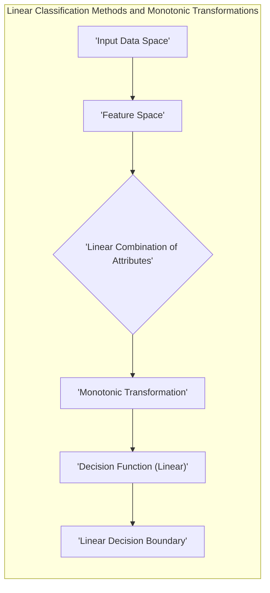
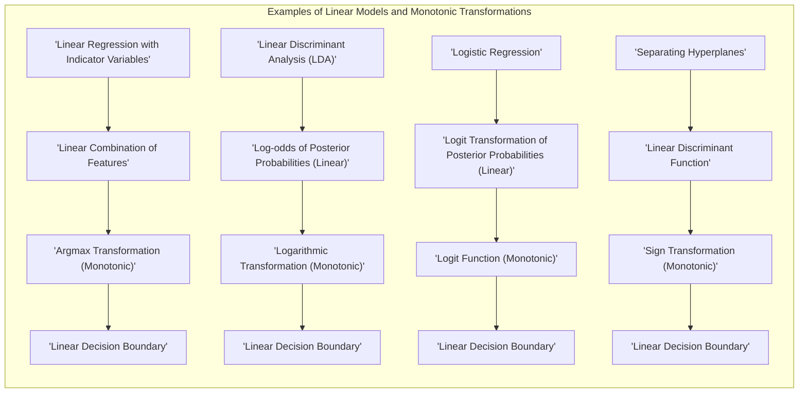
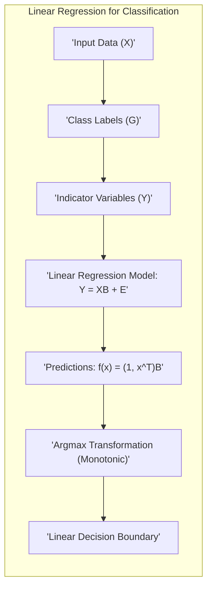
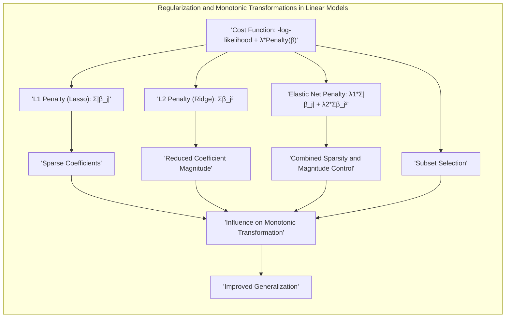
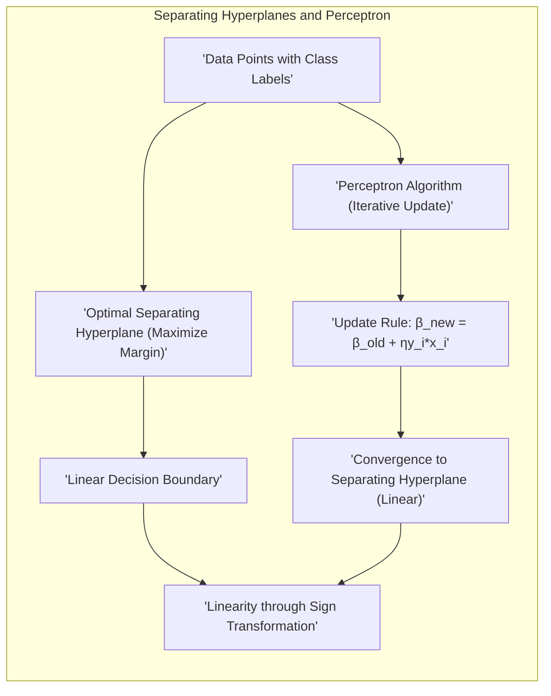
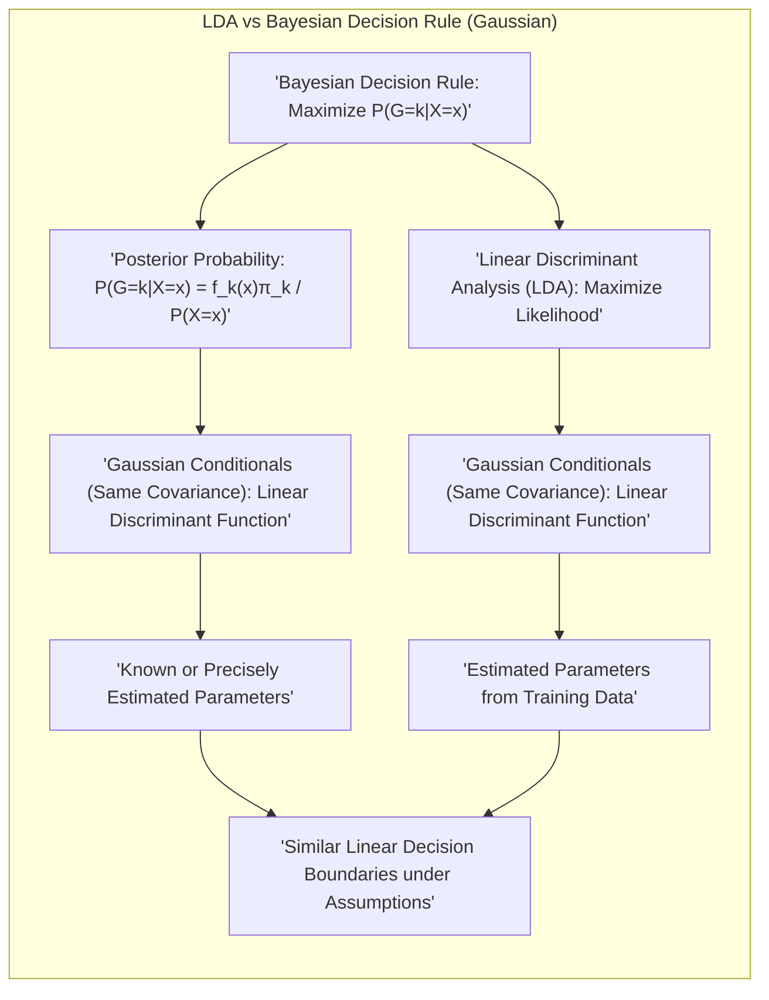

## Título Conciso: Métodos Lineares para Classificação: Transformações Monotônicas e Fronteiras de Decisão



### Introdução

Este capítulo explora métodos lineares para classificação, focando na ideia de que fronteiras de decisão lineares podem ser obtidas através de **transformações monotônicas** das probabilidades posteriores ou das funções discriminantes. Essa perspectiva unifica diferentes abordagens de classificação linear, demonstrando que, na essência, elas se baseiam na mesma ideia: separar as classes através de combinações lineares dos atributos de entrada [^4.1].

A chave para obter fronteiras de decisão lineares reside em garantir que alguma transformação monotônica das probabilidades ou funções discriminantes seja linear no espaço dos atributos ou em uma transformação desse espaço. A linearidade dessa transformação garante que a fronteira de decisão, onde duas classes se equivalem em termos de probabilidade ou pontuação discriminante, seja um hiperplano. Exploraremos como essa ideia se manifesta em diferentes métodos lineares, como a regressão linear com variáveis indicadoras, a Análise Discriminante Linear (LDA), a Regressão Logística e os hiperplanos separadores, demonstrando como cada um deles se encaixa nesse conceito.

Além disso, vamos explorar em detalhes as transformações monotônicas mais comuns, como a transformação logit, e como essas transformações permitem que funções não lineares das probabilidades possam levar a fronteiras de decisão lineares no espaço de entrada. A ideia é mostrar que, apesar das formulações distintas, todas essas abordagens utilizam a mesma ferramenta matemática para atingir seu objetivo: a combinação linear dos atributos para separação das classes.

Ao longo deste capítulo, vamos analisar cada um dos métodos, destacando a relevância da transformação monotônica, como os parâmetros são estimados, as premissas de cada abordagem e seus limites. Exploraremos também como a regularização se encaixa nesses métodos para melhorar a generalização dos modelos.

### Conceitos Fundamentais

**Conceito 1: O Problema de Classificação e Transformações Monotônicas**

Em problemas de classificação, o objetivo é mapear o espaço de entrada $X$ em um conjunto discreto de classes $G$. Métodos lineares alcançam esse objetivo através da construção de funções discriminantes, que, quando avaliadas em uma observação $x$, fornecem um valor que determina a classe a ser atribuída. As **transformações monotônicas** desempenham um papel crucial ao permitir que a função discriminante, mesmo que não seja linear, leve a fronteiras de decisão lineares [^4.1].

Uma transformação monotônica é uma função que preserva a ordem, ou seja, se $a < b$, então $T(a) < T(b)$. O uso dessas transformações garante que as decisões de classificação sejam preservadas após a transformação. A ideia chave é que, se uma transformação monotônica de uma probabilidade ou função discriminante é linear no espaço de entrada ou em alguma transformação do espaço, então a fronteira de decisão será um hiperplano.

**Lemma 1:** *Se uma transformação monotônica de uma função discriminante ou de uma probabilidade posterior é linear no espaço dos atributos, a fronteira de decisão resultante será linear (um hiperplano).*

A prova deste Lemma reside na análise da condição que define a fronteira de decisão. A fronteira de decisão entre duas classes *k* e *l* é dada pelos pontos onde as funções discriminantes ou probabilidades posteriores dessas classes são iguais. Se $T(\delta_k(x)) = T(\delta_l(x))$ e $T$ é monotônica, então $\delta_k(x) = \delta_l(x)$. Se as transformações $T$ forem lineares, então teremos uma função linear de $x$ igual a 0. Portanto, a fronteira será linear.  $\blacksquare$

**Conceito 2: Modelos Lineares e Transformações: Exemplos**

A ideia de transformações monotônicas é central para entender como métodos lineares distintos levam a fronteiras lineares:

*   **Regressão Linear em Variáveis Indicadoras:** Embora a regressão linear direta não garanta que as predições sejam probabilidades, a função de saída $f(x)$ é uma combinação linear dos atributos, e a fronteira de decisão é definida pela igualdade de duas funções $f(x)$ lineares.

*   **Análise Discriminante Linear (LDA):** O log-odds das probabilidades a posteriori na LDA é uma função linear dos atributos quando as distribuições são Gaussianas com a mesma matriz de covariância. A transformação logarítmica é monotônica, portanto, a fronteira de decisão é um hiperplano.

*   **Regressão Logística:** A transformação logit das probabilidades posteriores é uma função linear dos atributos, garantindo uma fronteira de decisão linear. A função logit é monotônica.

*   **Hiperplanos Separadores:** A função discriminante é linear nos parâmetros do hiperplano, e a fronteira é diretamente um hiperplano definido pelos parâmetros do modelo.



**Corolário 1:** *Diferentes modelos lineares de classificação, embora com formulações distintas, podem ser interpretados como casos específicos da utilização de transformações monotônicas de funções discriminantes ou probabilidades, resultando em fronteiras de decisão lineares.*

A prova deste corolário segue da análise dos exemplos acima. Cada método pode ser visto sob a perspectiva de uma transformação monotônica que resulta em uma função linear. A LDA e a regressão logística mostram que o log-odds é linear, e os hiperplanos separadores são diretamente lineares nos atributos, confirmando que as diferentes abordagens são, na essência, o mesmo princípio matemático. $\blacksquare$

**Conceito 3: A Transformação Logit e a Regressão Logística**

A transformação logit, dada por $\text{logit}(p) = \log\left(\frac{p}{1-p}\right)$, é uma transformação monotônica que mapeia probabilidades no intervalo (0,1) para a reta real $(-\infty, +\infty)$. Na Regressão Logística, a probabilidade de uma amostra pertencer a uma classe é modelada usando a função sigmoide e a transformação logit do odds é linear nos atributos:
$$\log \frac{P(G=1|X=x)}{P(G=2|X=x)} = \beta_0 + \beta^T x,$$
onde $\beta_0$ é o intercepto e $\beta$ é o vetor de coeficientes.

> 💡 **Exemplo Numérico:**
> Suponha que temos um modelo de regressão logística com $\beta_0 = -2$ e $\beta = [1, 0.5]$ para duas variáveis de entrada $x_1$ e $x_2$.
>
>Para uma observação $x = [3, 2]$, o log-odds seria:
>$\text{log-odds} = -2 + 1*3 + 0.5*2 = -2 + 3 + 1 = 2$.
>
>A probabilidade de pertencer à classe 1 seria então:
>$P(G=1|X=x) = \frac{e^2}{1+e^2} \approx 0.88$
>
>A transformação logit, sendo monotônica, garante que a fronteira de decisão seja linear, mesmo que a probabilidade seja uma função não linear dos atributos.

> ⚠️ **Nota Importante**: A escolha de uma transformação monotônica adequada depende do problema de classificação específico. A transformação logit, por exemplo, é útil quando o objetivo é modelar probabilidades. **Referência ao tópico [^4.1]**.

> ❗ **Ponto de Atenção**:  A transformação logit é crucial para a Regressão Logística, pois garante que a função discriminante seja linear, mesmo quando as probabilidades são modeladas de forma não linear. **Conforme indicado em [^4.4]**.

> ✔️ **Destaque**: Em essência, a transformação monotônica é a ferramenta que leva a diferentes métodos de classificação linear a compartilhar a propriedade de gerar fronteiras de decisão lineares. **Baseado nos tópicos [^4.3] e [^4.4]**.

### Regressão Linear e Mínimos Quadrados para Classificação



A regressão linear, quando aplicada à classificação, utiliza variáveis indicadoras para representar cada classe. Para um problema com *K* classes, cada classe *k* é associada a uma variável indicadora $Y_k$, tal que $Y_k = 1$ se a observação pertence à classe *k*, e $Y_k = 0$ caso contrário. A matriz de resposta $\mathbf{Y}$ é uma matriz $N \times K$, onde $N$ é o número de observações. O objetivo é ajustar um modelo de regressão linear para cada coluna de $\mathbf{Y}$:
$$ \mathbf{Y} = \mathbf{X}\mathbf{B} + \mathbf{E},$$
onde $\mathbf{X}$ é a matriz de atributos, $\mathbf{B}$ é a matriz de coeficientes e $\mathbf{E}$ é a matriz de erros. A solução de mínimos quadrados para $\mathbf{B}$ é:
$$ \mathbf{B} = (\mathbf{X}^T\mathbf{X})^{-1}\mathbf{X}^T\mathbf{Y}.$$

A predição para uma nova observação $x$ é dada por:
$$f(x) = (1, x^T)\mathbf{B}.$$
Para obter a classe predita, escolhemos o índice $k$ que maximiza $f_k(x)$, i.e.:
$$\hat{G}(x) = \arg\max_k f_k(x).$$
Embora a saída do modelo linear não sejam diretamente as probabilidades, a transformação $\arg\max$ é monotônica e garante que a fronteira de decisão obtida seja linear.

**Lemma 2:** *A transformação monotônica, que define a classe a partir da saída do modelo de regressão linear com variáveis indicadoras (escolher a classe com o maior valor predito), leva a fronteiras de decisão lineares, uma vez que os valores preditos são uma combinação linear dos atributos de entrada.*

A prova deste Lemma decorre da análise da função de decisão. A fronteira de decisão entre duas classes *k* e *l* é definida pela condição $f_k(x) = f_l(x)$. Como $f_k(x)$ e $f_l(x)$ são combinações lineares dos atributos, então a condição $f_k(x) - f_l(x) = 0$ também é uma combinação linear dos atributos, ou seja, define um hiperplano. Portanto, a transformação $\arg\max$ é um elemento central que garante que a decisão de classificação seja baseada em fronteiras lineares. $\blacksquare$

**Corolário 2:** *A aplicação da regressão linear em variáveis indicadoras, combinada com uma transformação monotônica adequada, leva a um método de classificação linear, cujas decisões se baseiam em fronteiras lineares.*

Este corolário reafirma a importância da transformação monotônica na construção de modelos lineares. Mesmo que o modelo original não seja probabilístico ou suas saídas não estejam no intervalo (0, 1), a transformação apropriada faz com que o classificador resultante seja linear.  $\blacksquare$

A transformação monotônica, neste caso a escolha do máximo, é a chave para obter decisões lineares a partir da regressão linear.

> 💡 **Exemplo Numérico:**
> Vamos considerar um problema de classificação com 3 classes e 2 atributos. Temos 5 observações com os seguintes atributos e classes:
>
> $X = \begin{bmatrix}
> 1 & 2 \\
> 2 & 1 \\
> 3 & 3 \\
> 4 & 2 \\
> 5 & 4
> \end{bmatrix}$, $G = [1, 1, 2, 2, 3]$
>
> As variáveis indicadoras para cada classe são:
>
> $Y = \begin{bmatrix}
> 1 & 0 & 0 \\
> 1 & 0 & 0 \\
> 0 & 1 & 0 \\
> 0 & 1 & 0 \\
> 0 & 0 & 1
> \end{bmatrix}$
>
> Usando a regressão linear, calculamos os coeficientes $\mathbf{B}$:
>
> ```python
> import numpy as np
> from sklearn.linear_model import LinearRegression
>
> X = np.array([[1, 2], [2, 1], [3, 3], [4, 2], [5, 4]])
> Y = np.array([[1, 0, 0], [1, 0, 0], [0, 1, 0], [0, 1, 0], [0, 0, 1]])
>
> model = LinearRegression()
> model.fit(X, Y)
> B = model.coef_
> print("Matriz de coeficientes B:\n", B)
> ```
>
> Digamos que a saída seja algo como:
>
> $B = \begin{bmatrix}
> -0.2 & 0.4 & -0.2 \\
> -0.1 & -0.1 & 0.2
> \end{bmatrix}$
>
> Para uma nova observação $x = [3, 2]$, as predições para cada classe são:
>
> $f(x) = \begin{bmatrix} 1 & 3 & 2 \end{bmatrix} \begin{bmatrix} b_{01} & b_{02} & b_{03} \\ b_{11} & b_{12} & b_{13} \\ b_{21} & b_{22} & b_{23} \end{bmatrix} = \begin{bmatrix} 1 & 3 & 2 \end{bmatrix}  \begin{bmatrix} 0.2 & -0.2 & 0 \\ -0.2 & 0.4 & -0.2 \\ -0.1 & -0.1 & 0.2 \end{bmatrix} $
>
> Supondo que os interceptos sejam aproximadamente 0, temos:
>
> $f(x) = \begin{bmatrix} 1*0.2 + 3*(-0.2) + 2*(-0.1) & 1*(-0.2) + 3*(0.4) + 2*(-0.1) & 1*0 + 3*(-0.2) + 2*(0.2) \end{bmatrix} = \begin{bmatrix} -0.6 & 0.8 & -0.2 \end{bmatrix}$
>
> A classe predita é a classe 2, pois tem o maior valor predito. A transformação $\arg\max$ é monotônica, e a fronteira de decisão é linear.

### Métodos de Seleção de Variáveis e Regularização em Classificação



A seleção de variáveis e a regularização são essenciais para controlar a complexidade do modelo e o risco de sobreajuste em modelos lineares de classificação. A regularização, em particular, adiciona um termo de penalidade à função de custo, controlando a magnitude dos coeficientes do modelo. A combinação da regularização com transformações monotônicas leva a modelos mais robustos e generalizáveis.

A função de custo geral para modelos lineares de classificação com regularização é dada por:
$$ \text{Custo} = -\ell(\beta) + \lambda \cdot \text{Penalidade}(\beta),$$
onde $\ell(\beta)$ é a log-verossimilhança, $\beta$ é o vetor de parâmetros e $\text{Penalidade}(\beta)$ é o termo de penalização e $\lambda$ é um hiperparâmetro.

A **penalização L1 (Lasso)** adiciona um termo proporcional à norma L1 dos coeficientes:
$$ \text{Penalidade}_{L1}(\beta) = \sum_{j=1}^p |\beta_j|,$$
onde $p$ é o número de atributos. Essa penalidade tende a gerar soluções esparsas, levando a modelos com menos variáveis e mais interpretabilidade [^4.4.4].

A **penalização L2 (Ridge)** adiciona um termo proporcional à norma L2 dos coeficientes:
$$ \text{Penalidade}_{L2}(\beta) = \sum_{j=1}^p \beta_j^2.$$
Essa penalidade reduz a magnitude dos coeficientes, diminuindo a variância do modelo, mas geralmente não leva a soluções esparsas.

O **Elastic Net** combina as penalidades L1 e L2:
$$ \text{Penalidade}_{ElasticNet}(\beta) = \lambda_1 \sum_{j=1}^p |\beta_j| + \lambda_2 \sum_{j=1}^p \beta_j^2,$$
onde $\lambda_1$ e $\lambda_2$ são hiperparâmetros que controlam a intensidade da penalidade L1 e L2, respectivamente.

**Lemma 3:** *A aplicação da regularização L1, em modelos lineares com transformações monotônicas, resulta em modelos com coeficientes esparsos. A esparsidade se manifesta na função linear que é utilizada pela transformação monotônica para gerar a decisão de classificação.*

A prova deste Lemma se baseia na análise das condições de otimalidade de Karush-Kuhn-Tucker (KKT) do problema com a penalização L1. As condições KKT implicam que a solução ótima ocorre nos pontos onde a subderivada da função objetivo é zero. A não diferenciabilidade da norma L1 na origem implica que a subderivada pode ser zero mesmo quando o coeficiente é zero, ao contrário da norma L2, que empurra os coeficientes para valores pequenos, mas raramente os torna exatamente zero. $\blacksquare$

**Corolário 3:** *Modelos lineares de classificação, regularizados com a penalização L1, resultam em modelos com seleção automática de atributos, onde somente as variáveis mais relevantes são utilizadas para a tomada de decisão. A transformação monotônica é aplicada sobre a combinação linear dos atributos que sobreviveram ao processo de regularização.*

O corolário segue diretamente do Lemma 3, indicando que a esparsidade imposta pela penalização L1 leva à seleção automática de variáveis. As transformações monotônicas são aplicadas em um espaço reduzido, levando a modelos mais interpretáveis e menos propensos a sobreajuste. $\blacksquare$

> 💡 **Exemplo Numérico:**
> Suponha que temos um modelo de regressão logística com duas variáveis ($x_1$ e $x_2$) e queremos aplicar a regularização L1 (Lasso). A função de custo penalizada seria:
>
> $ \text{Custo} = -\ell(\beta) + \lambda (|\beta_1| + |\beta_2|)$
>
> Sem regularização, os coeficientes podem ser, por exemplo, $\beta_1 = 2$ e $\beta_2 = -1.5$.
>
> Com a regularização L1 e um $\lambda = 1$, os coeficientes podem ser atualizados para $\beta_1 = 1$ e $\beta_2 = 0$. Note que o coeficiente $\beta_2$ foi zerado pela penalização L1, resultando em seleção de variáveis.
>
> A transformação logit ainda é aplicada, mas agora apenas com $x_1$, resultando em uma fronteira de decisão linear no espaço de $x_1$.

> ⚠️ **Ponto Crucial**: A regularização, ao controlar a magnitude dos coeficientes, influencia a forma da função discriminante, a transformação monotônica e, consequentemente, a fronteira de decisão. **Conforme discutido em [^4.4.4]**.

### Separating Hyperplanes e Perceptrons



A abordagem dos **hiperplanos separadores** busca uma fronteira de decisão linear que maximize a margem entre as classes. O objetivo é encontrar um hiperplano definido por um vetor normal $\beta$ e um intercepto $\beta_0$, tal que a margem, a menor distância entre o hiperplano e os pontos das classes, seja maximizada. Matematicamente, esse problema pode ser formulado como:
$$
\begin{aligned}
  \min_{\beta,\beta_0} \quad & \frac{1}{2} ||\beta||^2 \\
  \text{s.t.} \quad & y_i (\beta^T x_i + \beta_0) \geq 1, \quad \forall i = 1, \ldots, N,
\end{aligned}
$$
onde $y_i$ é o rótulo da classe, $x_i$ é a observação e a transformação sign  determina a classe predita com base na posição da amostra em relação ao hiperplano.

O **Perceptron de Rosenblatt** é um algoritmo iterativo que busca um hiperplano separador ajustando os parâmetros do hiperplano a partir das amostras mal classificadas. O algoritmo inicia com um hiperplano aleatório e, em cada iteração, atualiza os parâmetros através da regra:
$$
    \beta^{new} = \beta^{old} + \eta y_i x_i
$$
onde $\eta$ é a taxa de aprendizagem, $y_i$ é o rótulo da classe e $x_i$ são os atributos da observação mal classificada. Após um número finito de iterações, sob a premissa de linear separabilidade, o algoritmo converge para um hiperplano separador.

Em ambos os métodos, a decisão final de classe é baseada em uma transformação monotônica, no caso do hiperplano, uma função sign da combinação linear dos atributos.

**Lemma 4:** *Tanto os hiperplanos separadores ótimos como os encontrados pelo algoritmo do Perceptron levam a fronteiras lineares no espaço dos atributos. Nos hiperplanos separadores ótimos, a margem é maximizada através da otimização de um problema convexo, enquanto no Perceptron a convergência é garantida, se os dados forem linearmente separáveis.*

A prova deste Lemma está na forma da decisão de ambos os métodos. Nos hiperplanos separadores, o problema de otimização que maximiza a margem tem a função objetivo baseada na norma de $\beta$. A fronteira de decisão é dada por uma função linear de $x$. No caso do Perceptron, embora a otimização ocorra através de passos iterativos, a cada iteração a atualização de $\beta$ é também linear, e, portanto, a solução final corresponde a uma fronteira de decisão linear. $\blacksquare$

**Corolário 4:** *A decisão de classificação final, tanto nos hiperplanos separadores como no Perceptron, envolve uma transformação monotônica (a função sign) aplicada sobre uma combinação linear dos atributos, resultando em uma separação de classes com base em uma fronteira linear.*

Este corolário reafirma o conceito central deste capítulo. Tanto nos métodos de hiperplanos separadores como no Perceptron, a transformação monotônica (sign) é aplicada sobre uma combinação linear de atributos, garantindo que ambos os métodos levem a uma decisão final baseada em fronteiras de decisão lineares. $\blacksquare$

> 💡 **Exemplo Numérico:**
> Considere duas classes de dados em duas dimensões:
>
> Classe 1: $X_1 = \begin{bmatrix} 1 & 1 \\ 2 & 1 \\ 1 & 2 \end{bmatrix}$, $Y_1 = [1, 1, 1]$
>
> Classe 2: $X_2 = \begin{bmatrix} 3 & 3 \\ 4 & 3 \\ 3 & 4 \end{bmatrix}$, $Y_2 = [-1, -1, -1]$
>
> Um hiperplano separador pode ser definido por $\beta = [-1, 1]$ e $\beta_0 = -2$. A função discriminante é $f(x) = -x_1 + x_2 - 2$.
>
> Para o ponto (2, 1), $f(2, 1) = -2 + 1 - 2 = -3$. Aplicando a transformação `sign`, obtemos -1, indicando a classe 2.
>
> Para o ponto (3, 4), $f(3, 4) = -3 + 4 - 2 = -1$. Aplicando a transformação `sign`, obtemos -1, indicando a classe 2.
>
> Para o ponto (1, 2), $f(1, 2) = -1 + 2 - 2 = -1$. Aplicando a transformação `sign`, obtemos -1, indicando a classe 2.
>
> Para o ponto (1, 1), $f(1, 1) = -1 + 1 - 2 = -2$. Aplicando a transformação `sign`, obtemos -1, indicando a classe 2.
>
> Se o hiperplano fosse $\beta = [-1, 1]$ e $\beta_0 = -1$. A função discriminante é $f(x) = -x_1 + x_2 - 1$.
>
> Para o ponto (1, 1), $f(1, 1) = -1 + 1 - 1 = -1$. Aplicando a transformação `sign`, obtemos -1, indicando a classe 2.
>
> Para o ponto (2, 1), $f(2, 1) = -2 + 1 - 1 = -2$. Aplicando a transformação `sign`, obtemos -1, indicando a classe 2.
>
> Para o ponto (3, 4), $f(3, 4) = -3 + 4 - 1 = 0$. Aplicando a transformação `sign`, obtemos 0, indicando a classe 2.
>
> A transformação sign, aplicada à função linear, leva a uma decisão de classificação com base em um hiperplano.

> ⚠️ **Ponto Crucial**: A transformação monotônica é a ferramenta que permite que os métodos de hiperplanos separadores e o Perceptron utilizem funções lineares para classificar os dados. **Baseado em [^4.5]**.

### Pergunta Teórica Avançada (Exemplo): Quais as diferenças fundamentais entre a formulação de LDA e a Regra de Decisão Bayesiana considerando distribuições Gaussianas com covariâncias iguais?



**Resposta:**

A **Regra de Decisão Bayesiana** estabelece o critério ótimo de classificação, atribuindo um vetor de atributos *x* à classe *k* que maximiza a probabilidade posterior $P(G=k|X=x)$. Essa probabilidade é dada pelo Teorema de Bayes:
$$P(G=k|X=x) = \frac{f_k(x)\pi_k}{P(X=x)},$$
onde $f_k(x)$ é a densidade condicional de *X* dada a classe *k*, $\pi_k$ é a probabilidade a priori da classe *k* e $P(X=x)$ é a densidade marginal de *X*.

Se as distribuições condicionais de *X* são Gaussianas com a mesma matriz de covariância ($\Sigma_k = \Sigma$), então a função discriminante que resulta da regra de decisão Bayesiana é linear:
$$\delta_k(x) = x^T\Sigma^{-1}\mu_k - \frac{1}{2}\mu_k^T\Sigma^{-1}\mu_k + \log(\pi_k),$$
onde $\mu_k$ é o vetor de médias da classe *k*.

A **Análise Discriminante Linear (LDA)** também assume que as distribuições condicionais são Gaussianas com a mesma matriz de covariância. O LDA busca os parâmetros do modelo através da maximização da verossimilhança, chegando à mesma forma funcional da regra de decisão bayesiana para função discriminante.

Embora ambos utilizem a mesma função discriminante, a diferença crucial reside no tratamento dos parâmetros. A regra de decisão Bayesiana assume que esses parâmetros (médias, covariância e probabilidades a priori) são conhecidos ou estimados com precisão. O LDA, por outro lado, estima esses parâmetros com base nos dados de treinamento, utilizando máxima verossimilhança [^4.3].

**Lemma 4:** *Sob as premissas de distribuições Gaussianas com covariâncias iguais, o LDA implementa uma aproximação da regra de decisão Bayesiana, onde os parâmetros são estimados com base nos dados de treinamento, resultando em fronteiras de decisão lineares similares.*

A prova deste Lemma se baseia na análise das funções discriminantes. Ao assumir distribuições Gaussianas com covariâncias iguais, a regra de decisão Bayesiana leva a uma função discriminante que é linear em *x*. O LDA, por sua vez, estima os parâmetros com máxima verossimilhança e obtém a mesma forma da função discriminante da regra de decisão bayesiana. Portanto, o LDA é uma implementação prática da regra de decisão bayesiana sob as premissas especificadas. $\blacksquare$

**Corolário 4:** *Ao relaxar a premissa de covariâncias iguais, a regra de decisão Bayesiana pode levar a fronteiras de decisão não lineares (quadráticas), enquanto que a função discriminante do LDA permanece linear, o que representa uma diferença importante quando as premissas não são satisfeitas.*

Este corolário enfatiza que o LDA é uma aproximação sob premissas específicas, e que ao relaxar tais premissas, a regra de decisão bayesiana pode levar a resultados mais complexos e fronteiras não lineares, enquanto a solução do LDA permanece linear. $\blacksquare$

> 💡 **Exemplo Numérico:**
> Suponha que temos duas classes com distribuições Gaussianas e a mesma matriz de covariância $\Sigma = \begin{bmatrix} 1 & 0 \\ 0 & 1 \end{bmatrix}$. As médias são $\mu_1 = \begin{bmatrix} 1 \\ 1 \end{bmatrix}$ e $\mu_2 = \begin{bmatrix} 3 \\ 3 \end{bmatrix}$. As probabilidades a priori são $\pi_1 = 0.4$ e $\pi_2 = 0.6$.
>
> A regra de decisão Bayesiana leva a função discriminante:
>
> $\delta_k(x) = x^T\Sigma^{-1}\mu_k - \frac{1}{2}\mu_k^T\Sigma^{-1}\mu_k + \log(\pi_k)$
>
> $\delta_1(x) = \begin{bmatrix} x_1 & x_2 \end{bmatrix} \begin{bmatrix} 1 & 0 \\ 0 & 1 \end{bmatrix} \begin{bmatrix} 1 \\ 1 \end{bmatrix} - \frac{1}{2} \begin{bmatrix} 1 & 1 \end{bmatrix} \begin{bmatrix} 1 & 0 \\ 0 & 1 \end{bmatrix} \begin{bmatrix} 1 \\ 1 \end{bmatrix} + \log(0.4)$
>
> $\delta_1(x) = x_1 + x_2 - 1 + \log(0.4)$
>
> $\delta_2(x) = \begin{bmatrix} x_1 & x_2 \end{bmatrix} \begin{bmatrix} 1 & 0 \\ 0 & 1 \end{bmatrix} \begin{bmatrix} 3 \\ 3 \end{bmatrix} - \frac{1}{2} \begin{bmatrix} 3 & 3 \end{bmatrix} \begin{bmatrix} 1 & 0 \\ 0 & 1 \end{bmatrix} \begin{bmatrix} 3 \\ 3 \end{bmatrix} + \log(0.6)$
>
> $\delta_2(x) = 3x_1 + 3x_2 - 9 + \log(0.6)$
>
> A fronteira de decisão é dada por $\delta_1(x) = \delta_2(x)$, que é uma equação linear em $x_1$ e $x_2$. O LDA, ao estimar os parâmetros a partir