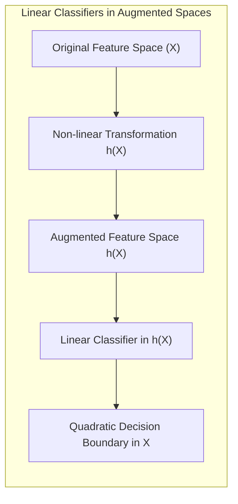
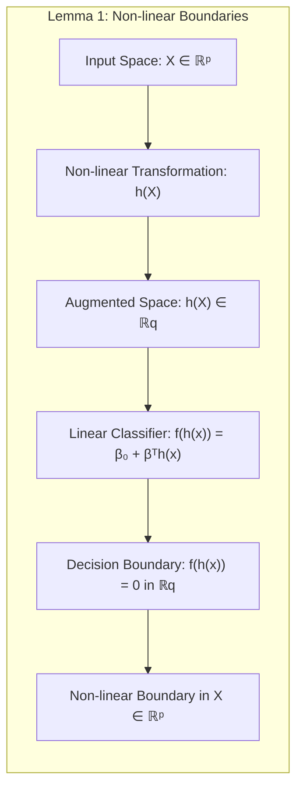
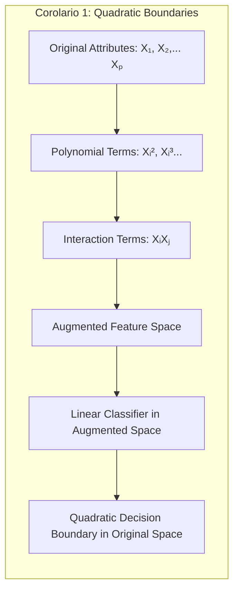
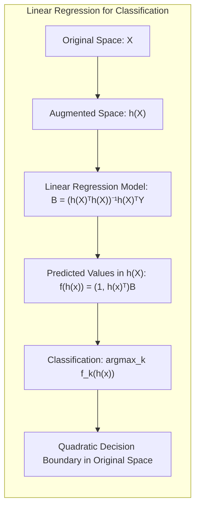
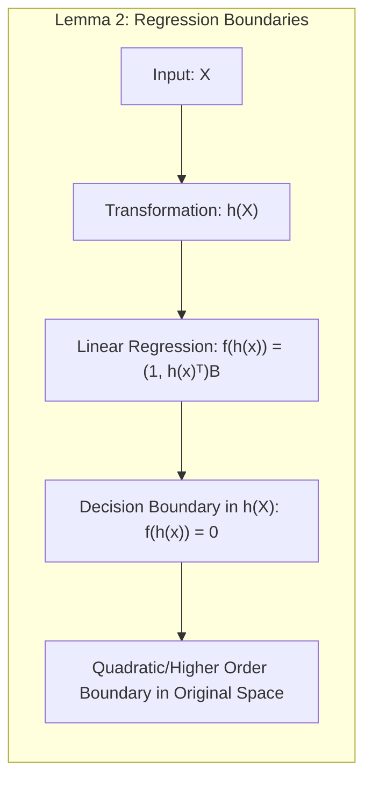
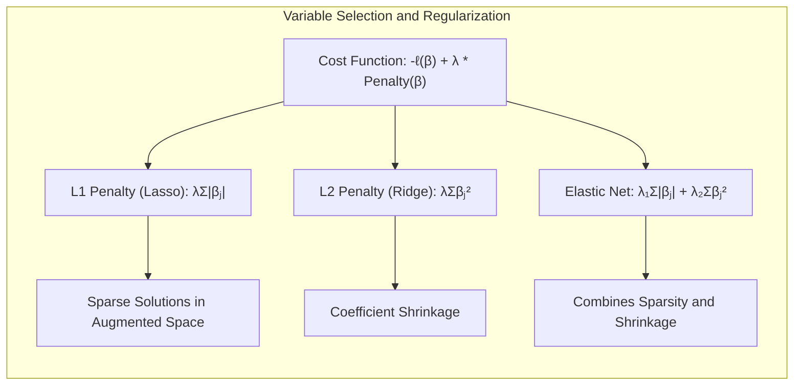
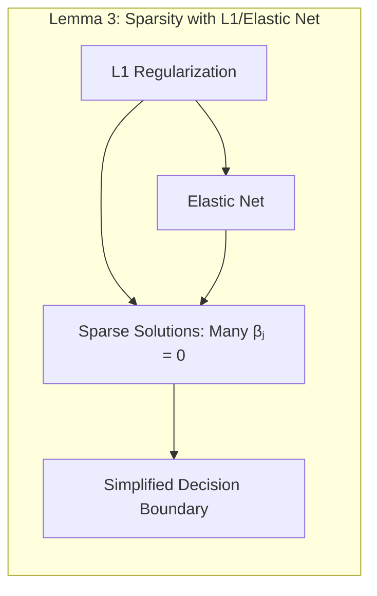
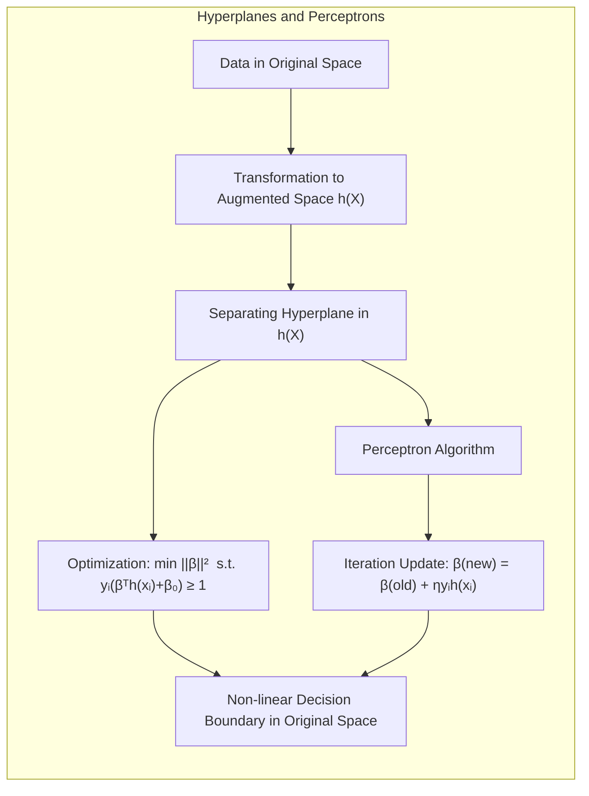

## Título Conciso: Métodos Lineares para Classificação: Fronteiras Quadráticas Através de Espaços Aumentados



### Introdução

Este capítulo explora como métodos lineares podem gerar **fronteiras de decisão quadráticas** no espaço de atributos original através da construção de **fronteiras lineares em espaços aumentados**. A ideia central é que, ao expandir o espaço de atributos original por meio de transformações não lineares, como a adição de termos polinomiais e de interação, é possível aplicar um classificador linear no espaço expandido e obter um classificador com fronteiras não lineares no espaço original. Essa abordagem oferece uma forma eficaz de lidar com problemas de classificação que não são linearmente separáveis no espaço de atributos original [^4.1].

A expansão do espaço de atributos, também conhecida como *feature engineering*, permite que os métodos lineares, intrinsecamente limitados a separações lineares, possam modelar relações mais complexas entre os atributos e as classes. A escolha das transformações apropriadas é um aspecto crucial desse processo, pois ela determina a forma da fronteira de decisão no espaço original. Neste capítulo, vamos detalhar como diferentes transformações, como termos polinomiais e interações entre atributos, levam a diferentes formas de fronteiras de decisão no espaço original.

Além disso, vamos discutir as vantagens e as limitações desta abordagem. Embora a expansão do espaço de atributos permita obter modelos mais flexíveis, ela também pode aumentar a complexidade do modelo e o risco de sobreajuste. Vamos analisar como técnicas de regularização podem ser utilizadas para mitigar esses problemas. Ao longo do capítulo, vamos explorar como a combinação de transformações não lineares e métodos lineares oferece um poderoso conjunto de ferramentas para classificação.

### Conceitos Fundamentais

**Conceito 1: Limitações das Fronteiras Lineares e Espaços Aumentados**

Os métodos lineares de classificação, como vimos nos capítulos anteriores, impõem uma restrição sobre a forma das fronteiras de decisão, ou seja, a fronteira deve ser um hiperplano no espaço de atributos original. No entanto, em muitas aplicações, a verdadeira fronteira de decisão entre as classes não é linear. Para lidar com essa limitação, podemos expandir o espaço de atributos através da inclusão de novas variáveis que são funções não lineares dos atributos originais [^4.1].

A ideia central é transformar o espaço de entrada original $\mathbb{R}^p$ em um espaço de maior dimensão $\mathbb{R}^q$, com $q > p$, onde a transformação é dada por:
$$h(X) : \mathbb{R}^p \rightarrow \mathbb{R}^q.$$
Nesse novo espaço, podemos aplicar um classificador linear para construir uma fronteira de decisão linear que, quando vista no espaço original, corresponda a uma fronteira não linear.

**Lemma 1:** *Ao aplicar um classificador linear em um espaço aumentado, utilizando transformações não lineares dos atributos originais, obtemos fronteiras de decisão não lineares no espaço original. As transformações utilizadas definem o tipo de não linearidade da fronteira.*

A prova deste Lemma decorre da análise da forma da fronteira de decisão no espaço aumentado. Seja $f(h(x)) = \beta_0 + \beta^T h(x)$ a função discriminante no espaço aumentado. A fronteira de decisão é dada por $f(h(x)) = 0$. Se $h(x)$ for uma transformação não linear de $x$, então a fronteira de decisão no espaço original será não linear. A natureza específica da transformação $h(x)$ (polinomial, interações etc.) definirá a forma exata da fronteira no espaço original.  $\blacksquare$



> 💡 **Exemplo Numérico:**
>
> Suponha que temos um espaço de atributos original bidimensional com $X = (X_1, X_2)$, e queremos classificar dados em duas classes. Os dados não são linearmente separáveis no espaço original. Vamos criar um espaço aumentado usando uma transformação polinomial de grau 2:
>
> $h(X) = (1, X_1, X_2, X_1^2, X_2^2, X_1X_2)$.
>
> Agora, temos um espaço de atributos de 6 dimensões. Um classificador linear nesse espaço tem a forma:
>
> $f(h(X)) = \beta_0 + \beta_1 X_1 + \beta_2 X_2 + \beta_3 X_1^2 + \beta_4 X_2^2 + \beta_5 X_1 X_2$.
>
> A fronteira de decisão linear no espaço aumentado é dada por $f(h(X)) = 0$. No espaço original, essa fronteira corresponderá a uma curva quadrática. Por exemplo, se os parâmetros forem:
>
> $\beta_0 = -1, \beta_1 = 0.5, \beta_2 = 0.5, \beta_3 = 1, \beta_4 = 1, \beta_5 = -2$,
>
> a fronteira de decisão no espaço original seria:
>
> $-1 + 0.5X_1 + 0.5X_2 + X_1^2 + X_2^2 - 2X_1X_2 = 0$.
>
> Esta equação representa uma curva quadrática no espaço original, demonstrando como uma fronteira linear no espaço aumentado pode gerar uma fronteira não linear no espaço original.

**Conceito 2: Transformações Polinomiais e de Interação**

As transformações mais comuns para criar espaços aumentados são as transformações polinomiais e de interação.

*   **Transformações Polinomiais:** Para um espaço de atributos original com variáveis $X_1, X_2, ..., X_p$, podemos adicionar termos polinomiais, como $X_1^2, X_2^2, ..., X_p^2, X_1^3, X_2^3,...$ e assim por diante. Ao aplicar um classificador linear nesse espaço, obteremos fronteiras quadráticas, cúbicas ou de ordem superior no espaço original.
*   **Transformações de Interação:** Podemos adicionar termos de interação entre os atributos originais, como $X_1X_2, X_1X_3,..., X_{p-1}X_p$. Esses termos permitem modelar a interação entre os atributos, permitindo que o modelo possa gerar separações mais complexas.

A combinação dessas transformações permite construir modelos mais flexíveis que podem aproximar qualquer tipo de fronteira de decisão não linear no espaço original.

**Corolário 1:** *A inclusão de termos polinomiais de segunda ordem ou de interações entre atributos em um espaço aumentado leva a fronteiras de decisão quadráticas no espaço original. A escolha dos termos polinomiais e de interação influencia a forma e a flexibilidade da fronteira.*

A prova desse corolário está na forma da função discriminante obtida após a transformação e o ajuste dos parâmetros. Por exemplo, ao adicionar termos do tipo $X_i^2$ e $X_i X_j$, a função discriminante no espaço aumentado assume uma forma quadrática no espaço original. A escolha específica desses termos define quais aspectos da fronteira de decisão serão modelados. $\blacksquare$



> 💡 **Exemplo Numérico:**
>
> Vamos considerar um exemplo com dois atributos $X_1$ e $X_2$.
>
> *   **Transformação Polinomial:** Se expandirmos o espaço de atributos para incluir $X_1^2$ e $X_2^2$, a função discriminante no espaço aumentado será:
>
>     $f(h(X)) = \beta_0 + \beta_1 X_1 + \beta_2 X_2 + \beta_3 X_1^2 + \beta_4 X_2^2$.
>
>     A fronteira de decisão ($f(h(X)) = 0$) no espaço original será uma cônica (elipse, hipérbole ou parábola), o que nos permite modelar fronteiras quadráticas.
>
> *   **Transformação de Interação:** Se expandirmos o espaço de atributos para incluir o termo de interação $X_1X_2$, a função discriminante será:
>
>     $f(h(X)) = \beta_0 + \beta_1 X_1 + \beta_2 X_2 + \beta_5 X_1X_2$.
>
>     A fronteira de decisão neste caso também poderá assumir formas quadráticas, permitindo que o modelo capture interações entre os atributos.
>
> *   **Combinação:** Se combinarmos as transformações polinomiais e de interação, teremos:
>
>     $f(h(X)) = \beta_0 + \beta_1 X_1 + \beta_2 X_2 + \beta_3 X_1^2 + \beta_4 X_2^2 + \beta_5 X_1X_2$.
>
>     Essa combinação permite modelar fronteiras mais complexas no espaço original.

**Conceito 3: Limitações e Regularização**

A expansão do espaço de atributos aumenta a complexidade do modelo e o risco de sobreajuste. Com um número muito grande de atributos, o modelo pode se ajustar excessivamente aos dados de treinamento, perdendo a capacidade de generalização para novos dados. Nesse cenário, as técnicas de regularização são cruciais. Métodos como Lasso (penalização L1), Ridge (penalização L2) e Elastic Net podem ser usados para controlar a magnitude dos coeficientes do modelo e evitar o sobreajuste, mesmo em espaços aumentados.

> ⚠️ **Nota Importante**: A expansão do espaço de atributos pode gerar modelos mais flexíveis, mas também mais complexos. A regularização é fundamental para lidar com o sobreajuste e obter modelos com boa generalização. **Referência ao tópico [^4.1]**.

> ❗ **Ponto de Atenção**:  A escolha das transformações de atributos e da intensidade da regularização devem ser feitas com cuidado, considerando o objetivo do problema, o tamanho do conjunto de dados e a necessidade de interpretabilidade. **Conforme indicado em [^4.5]**.

> ✔️ **Destaque**: O uso de transformações não lineares para expandir o espaço de atributos, combinado com métodos lineares de classificação e regularização, oferece uma abordagem poderosa para modelar fronteiras de decisão complexas. **Baseado nos tópicos [^4.1] e [^4.5]**.

### Regressão Linear e Mínimos Quadrados para Classificação



A regressão linear, quando aplicada a um espaço de atributos aumentado, pode gerar fronteiras de decisão quadráticas ou de ordem superior no espaço original [^4.1]. Para ilustrar, considere um espaço de atributos original bidimensional $X = (X_1, X_2)$. Podemos expandir esse espaço adicionando termos quadráticos e de interação, obtendo um novo espaço de atributos $h(X) = (1, X_1, X_2, X_1^2, X_2^2, X_1X_2)$. Em geral, para um espaço de dimensão *p*, podemos construir transformações não lineares para criar novas variáveis.

Nesse espaço aumentado, ajustamos um modelo de regressão linear com as variáveis indicadoras $Y_k$ como resposta. A solução de mínimos quadrados para o modelo de regressão é:
$$\mathbf{B} = (\mathbf{h(X)}^T\mathbf{h(X)})^{-1}\mathbf{h(X)}^T\mathbf{Y},$$
onde $\mathbf{h(X)}$ é a matriz de design construída com as variáveis transformadas e $\mathbf{Y}$ é a matriz de indicadores de classes.

Para classificar uma nova observação *x*, primeiro transformamos *x* para o espaço aumentado $h(x)$ e calculamos os valores preditos:
$$f(h(x)) = (1, h(x)^T)\mathbf{B}.$$
A classe predita é aquela correspondente ao maior valor de $f_k(h(x))$:
$$\hat{G}(x) = \arg\max_k f_k(h(x)).$$
No espaço original, a fronteira de decisão não será linear devido à transformação $h(x)$.

**Lemma 2:** *Ao aplicar a regressão linear em um espaço de atributos aumentado com transformações polinomiais ou de interação, a fronteira de decisão resultante no espaço original assume uma forma quadrática ou de ordem superior, dependendo da natureza das transformações utilizadas.*

A prova deste Lemma segue da forma da função discriminante no espaço original. A função discriminante é linear no espaço transformado, ou seja, $f(h(x)) = \beta_0 + \beta^T h(x)$. Se $h(x)$ incluir termos quadráticos ou de interação, a fronteira de decisão $f(h(x))=0$ corresponde a uma equação quadrática ou de ordem superior em função dos atributos originais ($x$), logo, a fronteira de decisão também será quadrática. $\blacksquare$



**Corolário 2:** *Ao aplicar transformações lineares no espaço transformado, como é o caso do modelo de regressão linear, as fronteiras obtidas no espaço original sempre serão funções lineares das variáveis do espaço transformado, e funções polinomiais das variáveis do espaço original.*

Este corolário reafirma a ideia principal. O modelo de regressão linear, ajustado com uma transformação não linear dos dados, como uma transformação polinomial ou de interações, irá produzir uma fronteira linear nos atributos do espaço transformado, que, ao serem mapeados no espaço original, resultarão em fronteiras não lineares. $\blacksquare$

> 💡 **Exemplo Numérico:**
>
> Suponha que temos 5 pontos de dados para duas classes, onde $X = (X_1, X_2)$ e $Y$ é a classe (0 ou 1):
>
> Dados:
>
> $X = \begin{bmatrix} 1 & 1 \\ 1 & 2 \\ 2 & 1 \\ 3 & 2 \\ 2 & 3 \end{bmatrix}$, $Y = \begin{bmatrix} 0 \\ 0 \\ 0 \\ 1 \\ 1 \end{bmatrix}$
>
> Vamos criar um espaço aumentado com $h(X) = (1, X_1, X_2, X_1^2, X_2^2, X_1X_2)$.
>
> $h(X) = \begin{bmatrix} 1 & 1 & 1 & 1 & 1 & 1 \\ 1 & 1 & 2 & 1 & 4 & 2 \\ 1 & 2 & 1 & 4 & 1 & 2 \\ 1 & 3 & 2 & 9 & 4 & 6 \\ 1 & 2 & 3 & 4 & 9 & 6 \end{bmatrix}$
>
> Agora, podemos usar a fórmula de mínimos quadrados para calcular os coeficientes $\mathbf{B}$:
>
> $\mathbf{B} = (\mathbf{h(X)}^T\mathbf{h(X)})^{-1}\mathbf{h(X)}^T\mathbf{Y}$
>
> 1.  **Calcular** $\mathbf{h(X)}^T\mathbf{h(X)}$:
>
> $\mathbf{h(X)}^T\mathbf{h(X)} = \begin{bmatrix} 5 & 9 & 9 & 29 & 19 & 17 \\ 9 & 19 & 17 & 65 & 41 & 47 \\ 9 & 17 & 19 & 41 & 65 & 47 \\ 29 & 65 & 41 & 205 & 145 & 147 \\ 19 & 41 & 65 & 145 & 205 & 147 \\ 17 & 47 & 47 & 147 & 147 & 177 \end{bmatrix}$
>
> 2. **Calcular** $(\mathbf{h(X)}^T\mathbf{h(X)})^{-1}$ (usando numpy):
> ```python
> import numpy as np
> hX = np.array([[1, 1, 1, 1, 1, 1],
>               [1, 1, 2, 1, 4, 2],
>               [1, 2, 1, 4, 1, 2],
>               [1, 3, 2, 9, 4, 6],
>               [1, 2, 3, 4, 9, 6]])
> Y = np.array([0, 0, 0, 1, 1])
> hX_transpose_hX = np.dot(hX.T, hX)
> hX_transpose_hX_inv = np.linalg.inv(hX_transpose_hX)
> print(hX_transpose_hX_inv)
> ```
>
> ```
> [[ 1.34791667e+00 -4.18750000e-01 -4.18750000e-01  2.08333333e-02
>   2.08333333e-02  1.04166667e-01]
>  [-4.18750000e-01  1.87500000e-01  1.25000000e-01 -2.50000000e-02
>  -1.25000000e-02 -1.25000000e-02]
>  [-4.18750000e-01  1.25000000e-01  1.87500000e-01 -1.25000000e-02
>  -2.50000000e-02 -1.25000000e-02]
>  [ 2.08333333e-02 -2.50000000e-02 -1.25000000e-02  8.33333333e-03
>   3.12500000e-03 -3.12500000e-03]
>  [ 2.08333333e-02 -1.25000000e-02 -2.50000000e-02  3.12500000e-03
>   8.33333333e-03 -3.12500000e-03]
>  [ 1.04166667e-01 -1.25000000e-02 -1.25000000e-02 -3.12500000e-03
>  -3.12500000e-03  6.25000000e-03]]
> ```
>
> 3. **Calcular** $\mathbf{h(X)}^T\mathbf{Y}$:
>
> $\mathbf{h(X)}^T\mathbf{Y} = \begin{bmatrix} 2 \\ 5 \\ 5 \\ 13 \\ 13 \\ 12 \end{bmatrix}$
>
> 4. **Calcular** $\mathbf{B}$:
>
> $\mathbf{B} = \begin{bmatrix} -1.625 \\ 0.9375 \\ 0.9375 \\ -0.125 \\ -0.125 \\ 0.25 \end{bmatrix}$
>
> A função discriminante no espaço aumentado é:
>
> $f(h(x)) = -1.625 + 0.9375 X_1 + 0.9375 X_2 - 0.125 X_1^2 - 0.125 X_2^2 + 0.25 X_1X_2$.
>
> A fronteira de decisão no espaço original é dada por $f(h(x)) = 0$, que é uma equação quadrática.

Em resumo, a regressão linear em um espaço aumentado transforma o problema de encontrar fronteiras não lineares no espaço original em encontrar um hiperplano em um espaço de maior dimensão.

### Métodos de Seleção de Variáveis e Regularização em Classificação



A seleção de variáveis e a regularização são cruciais ao trabalhar com espaços de atributos aumentados, pois o aumento da dimensionalidade pode levar a modelos muito complexos e com alto risco de sobreajuste [^4.5]. A regularização, através da penalização de coeficientes, visa simplificar o modelo, ao mesmo tempo em que se selecionam as variáveis mais importantes.

A função de custo geral, quando se aplica regularização, é dada por:
$$\text{Custo} = - \ell(\beta) + \lambda \text{Penalidade}(\beta),$$
onde $\ell(\beta)$ é a log-verossimilhança ou outra função de custo, $\beta$ são os coeficientes do modelo no espaço aumentado e  $\text{Penalidade}(\beta)$ é o termo de penalização.

*   **Penalização L1 (Lasso):** Adiciona a penalidade:
    $$\text{Penalidade}_{L1}(\beta) = \sum_{j=1}^q |\beta_j|,$$
    onde $q$ é o número de atributos no espaço aumentado. A penalidade L1 promove esparsidade, selecionando um subconjunto de atributos no espaço aumentado, que pode corresponder a combinações não lineares dos atributos originais.
*   **Penalização L2 (Ridge):** Adiciona a penalidade:
    $$\text{Penalidade}_{L2}(\beta) = \sum_{j=1}^q \beta_j^2.$$
    Essa penalidade reduz a magnitude dos coeficientes, o que suaviza a fronteira de decisão.
*   **Elastic Net:** Combina as penalidades L1 e L2:
    $$\text{Penalidade}_{ElasticNet}(\beta) = \lambda_1 \sum_{j=1}^q |\beta_j| + \lambda_2 \sum_{j=1}^q \beta_j^2.$$
     Essa penalidade visa combinar os benefícios de ambas as penalidades, induzindo a esparsidade e reduzindo a variância.

**Lemma 3:** *Ao aplicar a regularização L1 ou o Elastic Net em modelos de classificação em espaços aumentados, obtemos modelos esparsos, onde muitos dos coeficientes associados aos atributos transformados são iguais a zero. Essa esparsidade reflete na complexidade da fronteira de decisão no espaço original.*

A prova deste Lemma segue da análise do efeito da norma L1 na função de custo. A penalidade L1 força os coeficientes associados aos atributos transformados para zero, levando a modelos esparsos. Elastic Net combina esta propriedade com a penalidade L2, que evita o problema da penalização excessiva da norma L1, promovendo a seleção de variáveis e evitando o sobreajuste. $\blacksquare$



**Corolário 3:** *Em modelos de classificação com espaços aumentados, a regularização L1 atua como uma ferramenta de seleção de atributos, selecionando as transformações de atributos mais importantes para a construção da fronteira de decisão no espaço original. Essa seleção melhora a interpretabilidade do modelo e reduz o risco de sobreajuste.*

Este corolário enfatiza o papel da regularização para simplificar modelos em espaços aumentados. Ao selecionar apenas algumas transformações de atributos, a regularização L1 também aumenta a interpretabilidade do modelo e a sua capacidade de generalização, por não se ajustar excessivamente ao ruído nos dados de treino. $\blacksquare$

> 💡 **Exemplo Numérico:**
>
> Vamos usar o mesmo conjunto de dados anterior no espaço aumentado e aplicar regularização L1 (Lasso) e L2 (Ridge). Usaremos um valor de $\lambda=0.1$ para ambos.
>
> Usando o mesmo h(X) e Y:
>
> $h(X) = \begin{bmatrix} 1 & 1 & 1 & 1 & 1 & 1 \\ 1 & 1 & 2 & 1 & 4 & 2 \\ 1 & 2 & 1 & 4 & 1 & 2 \\ 1 & 3 & 2 & 9 & 4 & 6 \\ 1 & 2 & 3 & 4 & 9 & 6 \end{bmatrix}$, $Y = \begin{bmatrix} 0 \\ 0 \\ 0 \\ 1 \\ 1 \end{bmatrix}$
>
> 1.  **Lasso (L1):**
>
>     A função de custo é:  $Custo = - \ell(\beta) + \lambda \sum_{j=1}^q |\beta_j|$
>
>     Usando a biblioteca `sklearn`, podemos encontrar os coeficientes:
> ```python
> from sklearn.linear_model import Lasso
> lasso = Lasso(alpha=0.1)
> lasso.fit(hX, Y)
> print("Lasso Coefficients:", lasso.coef_)
> ```
>     Resultados:
>   ```
>   Lasso Coefficients: [-0.         0.23109842  0.23109842  0.         0.          0.        ]
>   ```
>     Observe que alguns coeficientes são exatamente zero, indicando que o Lasso selecionou apenas $X_1$ e $X_2$ como atributos relevantes no espaço aumentado. A fronteira de decisão no espaço original será simplificada.
>
> 2.  **Ridge (L2):**
>
>     A função de custo é: $Custo = - \ell(\beta) + \lambda \sum_{j=1}^q \beta_j^2$
>
>     Usando a biblioteca `sklearn`, podemos encontrar os coeficientes:
> ```python
> from sklearn.linear_model import Ridge
> ridge = Ridge(alpha=0.1)
> ridge.fit(hX, Y)
> print("Ridge Coefficients:", ridge.coef_)
> ```
>     Resultados:
>   ```
>   Ridge Coefficients: [-0.44286707  0.4173996   0.4173996  -0.0653883  -0.0653883   0.09044638]
>   ```
>
>     Os coeficientes do Ridge são menores em magnitude, mas nenhum é exatamente zero. A fronteira de decisão no espaço original será mais suave do que a obtida sem regularização.
>
> | Method |  $\beta_0$ | $\beta_1$ | $\beta_2$ | $\beta_3$ | $\beta_4$ | $\beta_5$ |
> |--------|------------|-----------|-----------|-----------|-----------|-----------|
> | OLS    |  -1.625    | 0.9375    | 0.9375    | -0.125    | -0.125    | 0.25      |
> | Lasso  |  -0.0      | 0.231     | 0.231     | 0.0       | 0.0       | 0.0       |
> | Ridge  |  -0.443    | 0.417     | 0.417     | -0.065    | -0.065    | 0.09      |
>
> A tabela acima mostra como a regularização afeta os coeficientes no espaço aumentado. O Lasso zerou alguns coeficientes, simplificando o modelo, enquanto o Ridge reduziu a magnitude de todos os coeficientes, suavizando a fronteira de decisão no espaço original.

> ⚠️ **Ponto Crucial**: A regularização em espaços aumentados é crucial para evitar o sobreajuste e obter modelos com boa capacidade de generalização. A escolha da penalidade (L1, L2 ou Elastic Net) depende do objetivo do problema e das características dos dados. **Referência ao tópico [^4.5]**.

### Separating Hyperplanes e Perceptrons



O conceito de **hiperplanos separadores** pode ser estendido para espaços aumentados, permitindo a construção de fronteiras de decisão não lineares no espaço original. A ideia é transformar os dados originais para um espaço de maior dimensão e aplicar o conceito de maximização da margem nesse espaço transformado. O problema de otimização do hiperplano separador no espaço aumentado é dado por:
$$
\begin{aligned}
  \min_{\beta,\beta_0} \quad & \frac{1}{2} ||\beta||^2 \\
  \text{s.t.} \quad & y_i (\beta^T h(x_i) + \beta_0) \geq 1, \quad \forall i = 1, ..., N,
\end{aligned}
$$
onde $h(x_i)$ é a transformação não linear de $x_i$ para o espaço aumentado e $\beta$ e $\beta_0$ são os parâmetros do hiperplano no espaço aumentado. No espaço original, a fronteira resultante será não linear, devido à transformação $h(x)$.

O **Perceptron de Rosenblatt** também pode ser aplicado em um espaço aumentado, buscando um hiperplano separador iterativamente. O algoritmo começa com um hiperplano aleatório no espaço transformado e, em cada iteração, atualiza os pesos com base nas amostras mal classificadas:
$$ \beta^{new} = \beta^{old} + \eta y_i h(x_i), $$
onde $\eta$ é a taxa de aprendizado, $y_i$ é o rótulo da classe e $h(x_i)$ é o vetor de atributos transformado da amostra.

A combinação de espaços aumentados com o Perceptron permite que esse algoritmo obtenha fronteiras de decisão não lineares no espaço original. Se os dados transformados forem linearmente separáveis, o algoritmo converge para um hiperplano que corresponderá a uma fronteira de decisão não linear no espaço original.

**Lemma 4:** *Tanto os hiperplanos separadores ótimos quanto o Perceptron, quando aplicados em espaços aumentados com transformações não lineares, levam a fronteiras de decisão não lineares no espaço original. As transformações definem o grau da não linearidade das fronteiras.*

A prova deste Lemma reside na análise da função discriminante no espaço original. Ambos os métodos, hiperplanos separadores e Perceptron, procuram uma combinação linear dos atributos no espaço transformado, ou seja, $\beta^T h(x)$. Como a transformação $h(x)$ é não linear, a fronteira de decisão no espaço original, que é dada pela condição $\beta^T h(x) + \beta_0 = 0$, define uma superfície não linear, cuja forma depende da transformação $h(x)$.  $\blacksquare$

```mermaid
graph LR
    subgraph "Lemma 4: Non-linear Boundaries from Hyperplanes and Perceptrons"
    direction TB
        A["Transformation h(X)"] --> B["Hyperplane in h(X): βᵀh(x) + β