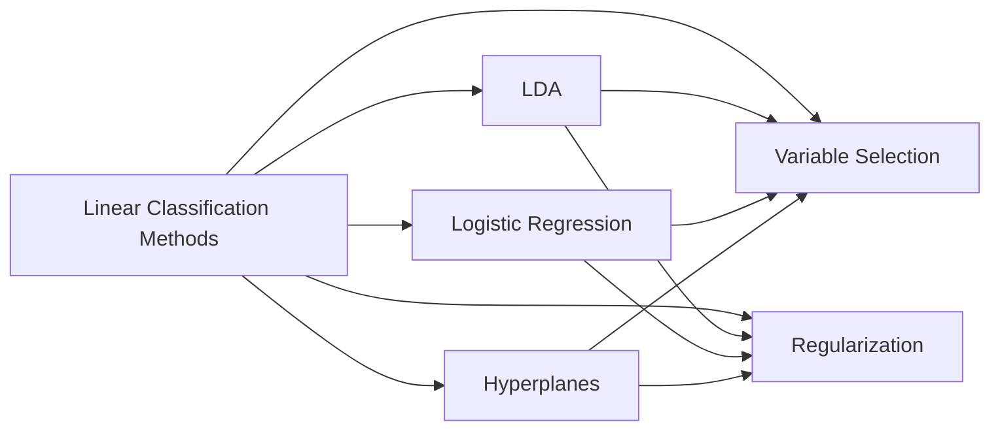
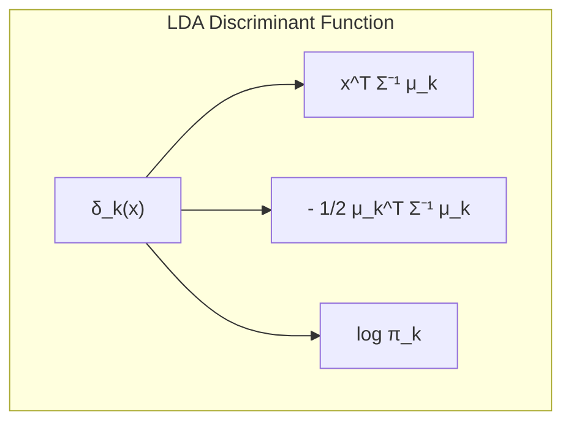
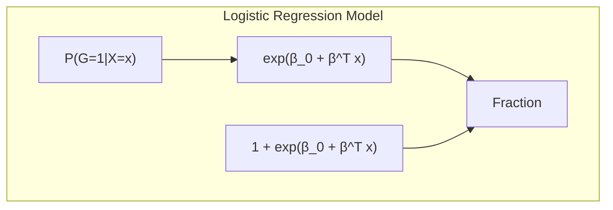
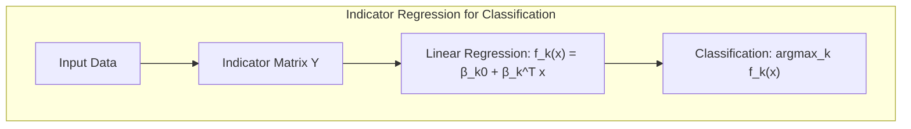
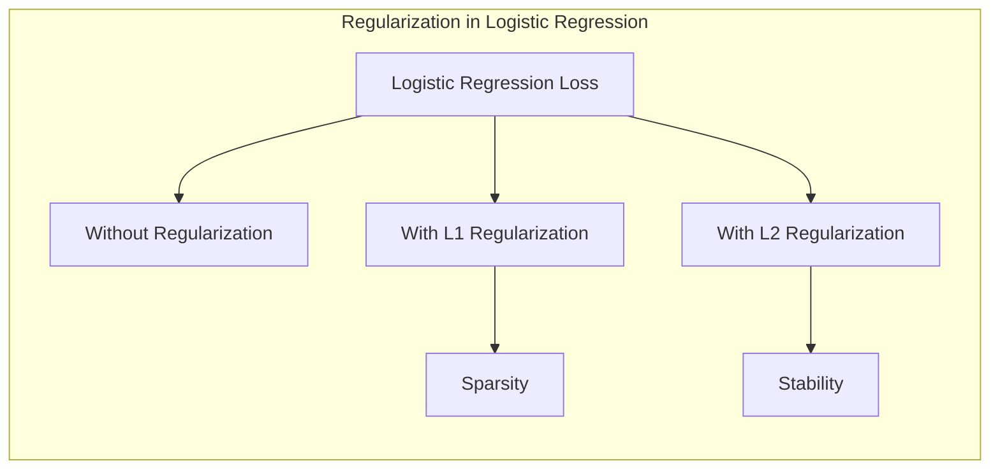
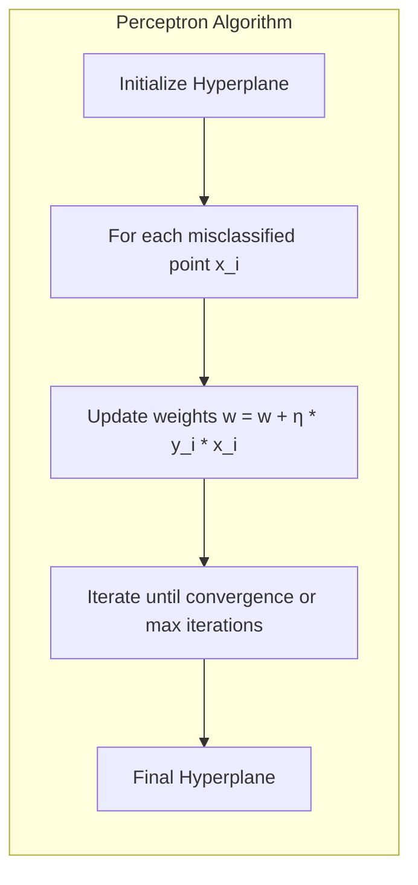

## Título Conciso: Classificação Linear, Seleção de Variáveis e Regularização



### Introdução

A classificação é um problema central em aprendizado de máquina e estatística, onde o objetivo é atribuir uma classe ou categoria a uma dada entrada. Métodos lineares de classificação são uma classe fundamental de algoritmos que utilizam fronteiras de decisão lineares para separar as classes [^4.1]. Esses métodos, apesar de sua simplicidade, são amplamente utilizados devido à sua eficiência computacional, interpretabilidade e bom desempenho em muitos cenários práticos. Ao longo deste capítulo, exploraremos várias técnicas para construir modelos de classificação linear, com foco em métodos estatísticos e de aprendizado de máquina que utilizam **Linear Discriminant Analysis (LDA)**, **Logistic Regression**, e **hiperplanos separadores**, bem como técnicas de seleção de variáveis e regularização para melhorar a generalização e robustez desses modelos [^4.1]. Abordaremos desde a regressão linear em matrizes de indicadores [^4.2] até a aplicação de técnicas de regularização L1 [^4.4.4], sempre buscando aprofundar tanto a teoria quanto os algoritmos.

### Conceitos Fundamentais

**Conceito 1: O Problema de Classificação e Métodos Lineares**

O problema de classificação consiste em, dado um conjunto de dados de entrada $x \in \mathbb{R}^p$, atribuir a este um rótulo de classe $G$ pertencente a um conjunto discreto de classes $G=\{1, 2, \ldots, K\}$. Métodos lineares de classificação assumem que as fronteiras de decisão entre as classes podem ser representadas por **hiperplanos** [^4.1]. Isto significa que cada classe é delimitada por uma combinação linear das variáveis de entrada. Uma função discriminante linear $f(x) = \beta_0 + \beta^Tx$ é utilizada para modelar a decisão de classe, onde $\beta_0$ é o intercepto e $\beta$ são os coeficientes. O uso de modelos lineares pode introduzir viés, mas geralmente apresentam uma variância menor em comparação com modelos não-lineares mais complexos. Em situações onde as classes são bem separadas por uma fronteira linear, essa abordagem linear é bastante eficaz. Por exemplo, ao modelar um problema de classificação binária, podemos ter uma função $f(x)$ onde, se $f(x) > 0$, atribuímos o rótulo $G=1$ e, caso contrário, atribuímos $G=2$ [^4.1].

> 💡 **Exemplo Numérico:**
>
> Considere um problema de classificação binária com duas variáveis de entrada $x_1$ e $x_2$. Suponha que após o treinamento de um modelo linear, obtivemos a função discriminante: $f(x) = -1 + 2x_1 + 1x_2$.
>
> Para um ponto de dados $x = (1, 2)$, temos $f(1, 2) = -1 + 2(1) + 1(2) = 3$. Como $f(x) > 0$, este ponto seria classificado como pertencente à classe 1.
>
> Para outro ponto $x = (0, 0)$, temos $f(0, 0) = -1 + 2(0) + 1(0) = -1$. Como $f(x) < 0$, este ponto seria classificado como pertencente à classe 2.
>
> A fronteira de decisão é o hiperplano (neste caso, uma linha) definido por $f(x) = 0$, ou seja, $-1 + 2x_1 + 1x_2 = 0$, que pode ser reescrito como $x_2 = 1 - 2x_1$.
>
> ```mermaid
>  graph LR
>      A["x=(1,2), f(x)=3"] -->|Class 1| C
>      B["x=(0,0), f(x)=-1"] -->|Class 2| D
>      C["Class 1"]
>      D["Class 2"]
>      E["Decision Boundary: x2 = 1 - 2x1"]
>      E --> F["Points above boundary are class 1"]
>      E --> G["Points below boundary are class 2"]
> ```

**Lemma 1:** *A fronteira de decisão entre duas classes usando uma função discriminante linear é sempre um hiperplano*. A prova consiste em mostrar que o conjunto de pontos $x$ onde $f_k(x) = f_l(x)$ (funções discriminantes das classes $k$ e $l$) resulta em uma equação linear que define um hiperplano [^4.1]. Ou seja, dado $f_k(x) = \beta_{k0} + \beta_k^T x$ e $f_l(x) = \beta_{l0} + \beta_l^T x$, a igualdade $\beta_{k0} + \beta_k^T x = \beta_{l0} + \beta_l^T x$ pode ser reescrita como $(\beta_{k0} - \beta_{l0}) + (\beta_k - \beta_l)^T x = 0$, que é a equação de um hiperplano. $\blacksquare$

**Conceito 2: Linear Discriminant Analysis (LDA)**

**LDA** é um método clássico para classificação que assume que cada classe segue uma distribuição gaussiana multivariada com a mesma matriz de covariância $\Sigma$ [^4.3]. A função discriminante para cada classe $k$ é dada por:

$$
\delta_k(x) = x^T \Sigma^{-1} \mu_k - \frac{1}{2} \mu_k^T \Sigma^{-1} \mu_k + \log \pi_k
$$

onde $\mu_k$ é o vetor de médias para a classe $k$ e $\pi_k$ é a probabilidade a priori da classe $k$ [^4.3]. A decisão de classe é dada por $\hat{G}(x) = \arg\max_k \delta_k(x)$. A igualdade de matrizes de covariância garante que as fronteiras de decisão entre as classes sejam lineares, o que é uma propriedade fundamental do LDA [^4.3]. A suposição de normalidade dos dados é uma limitação do LDA, mas na prática, ele frequentemente funciona bem, mesmo quando essa suposição não é estritamente válida.



> 💡 **Exemplo Numérico:**
>
> Suponha que temos duas classes, $G=1$ e $G=2$, com as seguintes características:
> - $\mu_1 = [2, 2]^T$ (média da classe 1)
> - $\mu_2 = [4, 4]^T$ (média da classe 2)
> - $\Sigma = \begin{bmatrix} 1 & 0.5 \\ 0.5 & 1 \end{bmatrix}$ (matriz de covariância comum)
> - $\pi_1 = 0.6$ (probabilidade a priori da classe 1)
> - $\pi_2 = 0.4$ (probabilidade a priori da classe 2)
>
> Para um ponto de dado $x = [3, 3]^T$, calculamos as funções discriminantes:
>
> 1.  $\Sigma^{-1} = \frac{1}{0.75} \begin{bmatrix} 1 & -0.5 \\ -0.5 & 1 \end{bmatrix} = \begin{bmatrix} 1.33 & -0.67 \\ -0.67 & 1.33 \end{bmatrix}$
>
> 2.  $\delta_1(x) = x^T \Sigma^{-1} \mu_1 - \frac{1}{2} \mu_1^T \Sigma^{-1} \mu_1 + \log \pi_1 = [3,3] \begin{bmatrix} 1.33 & -0.67 \\ -0.67 & 1.33 \end{bmatrix} \begin{bmatrix} 2 \\ 2 \end{bmatrix} - \frac{1}{2} [2,2] \begin{bmatrix} 1.33 & -0.67 \\ -0.67 & 1.33 \end{bmatrix} \begin{bmatrix} 2 \\ 2 \end{bmatrix} + \log(0.6) = 4 - 4 + \log(0.6) = -0.51$
>
> 3.  $\delta_2(x) = x^T \Sigma^{-1} \mu_2 - \frac{1}{2} \mu_2^T \Sigma^{-1} \mu_2 + \log \pi_2 = [3,3] \begin{bmatrix} 1.33 & -0.67 \\ -0.67 & 1.33 \end{bmatrix} \begin{bmatrix} 4 \\ 4 \end{bmatrix} - \frac{1}{2} [4,4] \begin{bmatrix} 1.33 & -0.67 \\ -0.67 & 1.33 \end{bmatrix} \begin{bmatrix} 4 \\ 4 \end{bmatrix} + \log(0.4) = 16 - 16 + \log(0.4) = -0.92$
>
> Como $\delta_1(x) > \delta_2(x)$, o ponto $x = [3, 3]^T$ seria classificado como pertencente à classe 1.

**Corolário 1:** *A fronteira de decisão entre classes no LDA é um hiperplano.* Isto decorre da forma linear das funções discriminantes $\delta_k(x)$, pois ao igualar as funções de duas classes $k$ e $l$, temos: $\delta_k(x) = \delta_l(x)$, que leva a uma equação linear em $x$, definindo um hiperplano [^4.3.1].

**Conceito 3: Logistic Regression**

**Logistic Regression** é outro método popular de classificação linear que modela a probabilidade de uma classe usando a função logística [^4.4]. Para o caso de duas classes, a probabilidade de pertencer à classe 1 é modelada como:

$$
P(G=1|X=x) = \frac{e^{\beta_0 + \beta^T x}}{1 + e^{\beta_0 + \beta^T x}}
$$

O logit (log-odds) dessa probabilidade é uma função linear de $x$:

$$
\log \left(\frac{P(G=1|X=x)}{1 - P(G=1|X=x)}\right) = \beta_0 + \beta^T x
$$

Os parâmetros $\beta_0$ e $\beta$ são estimados maximizando a verossimilhança dos dados de treinamento [^4.4.1].  A logistic regression não assume distribuição gaussiana para os dados de entrada, sendo mais flexível que o LDA em relação a essa suposição [^4.4.2]. A principal diferença entre LDA e Logistic Regression reside na maneira como os coeficientes são estimados: LDA usa momentos dos dados (médias e covariâncias) enquanto a regressão logística utiliza maximização da verossimilhança [^4.4.1]. Em cenários onde as classes são linearmente separáveis, ambas as abordagens podem apresentar desempenhos similares, conforme observado em [^4.5].



> 💡 **Exemplo Numérico:**
>
> Considere um modelo de regressão logística com $\beta_0 = -2$, $\beta_1 = 1$ e $\beta_2 = 0.5$. A probabilidade de um ponto $x = [x_1, x_2]^T$ pertencer à classe 1 é dada por:
>
> $P(G=1|X=x) = \frac{e^{-2 + x_1 + 0.5x_2}}{1 + e^{-2 + x_1 + 0.5x_2}}$
>
> Para o ponto $x = [3, 2]$, temos:
>
> $P(G=1|X=[3,2]) = \frac{e^{-2 + 3 + 0.5(2)}}{1 + e^{-2 + 3 + 0.5(2)}} = \frac{e^{2}}{1 + e^{2}} \approx 0.88$
>
> Portanto, há uma probabilidade de aproximadamente 88% de que este ponto pertença à classe 1.
>
> Para o ponto $x = [0, 0]$, temos:
>
> $P(G=1|X=[0,0]) = \frac{e^{-2 + 0 + 0.5(0)}}{1 + e^{-2 + 0 + 0.5(0)}} = \frac{e^{-2}}{1 + e^{-2}} \approx 0.12$
>
> Neste caso, a probabilidade de pertencer à classe 1 é de apenas 12%, sendo mais provável que pertença à classe 2.
>
> A fronteira de decisão (onde a probabilidade é 0.5) é definida por $-2 + x_1 + 0.5x_2 = 0$, ou seja $x_2 = 4 - 2x_1$.
>
> ```mermaid
> graph LR
> A["x=[3,2], P(G=1|X)=0.88"] -->|High Probability of Class 1| C
> B["x=[0,0], P(G=1|X)=0.12"] -->|Low Probability of Class 1| D
> C["Class 1"]
> D["Class 2"]
> E["Decision Boundary: x2 = 4 - 2x1"]
> E --> F["Points above boundary are more likely class 1"]
> E --> G["Points below boundary are more likely class 2"]
> ```

> ⚠️ **Nota Importante**: A logistic regression é uma abordagem mais flexível que o LDA, já que não assume distribuições gaussianas para os dados de entrada. [^4.4.1]

> ❗ **Ponto de Atenção**: Em problemas com classes desbalanceadas, é crucial ajustar as penalidades ou usar outras técnicas para evitar o viés do modelo em direção à classe majoritária [^4.4.2].

> ✔️ **Destaque**: Tanto LDA quanto Logistic Regression resultam em fronteiras de decisão lineares, porém os métodos de estimação de parâmetros são distintos, e cada um pode ser mais adequado dependendo dos dados e do problema [^4.5].

### Regressão Linear e Mínimos Quadrados para Classificação



A **regressão linear** pode ser adaptada para problemas de classificação através do uso de uma **matriz de indicadores** [^4.2]. Nesta abordagem, cada classe $k$ é representada por um vetor indicador $Y_k$, onde $Y_k = 1$ se a observação pertence à classe $k$, e $Y_k = 0$ caso contrário [^4.2]. Assim, para um problema com $K$ classes, teremos uma matriz resposta $Y$ de dimensão $N \times K$, onde $N$ é o número de observações. A regressão linear é então aplicada a cada coluna de $Y$, obtendo-se uma função $f_k(x) = \beta_{k0} + \beta_k^T x$ para cada classe. A observação $x$ é então classificada para a classe $k$ que apresentar o maior valor de $f_k(x)$ [^4.2].

Este método, embora simples, tem algumas limitações. Uma delas é que as estimativas $f_k(x)$ podem ser negativas ou maiores que 1, o que dificulta a interpretação como probabilidades. Além disso, quando as classes são sobrepostas ou apresentam estruturas complexas, a regressão linear pode ter um desempenho inferior aos métodos que modelam explicitamente a distribuição de classes [^4.2]. Outra limitação notável é o "masking problem" que ocorre quando uma classe intermediária é completamente ignorada durante a classificação, levando a uma má representação das classes pelos métodos [^4.2].

Apesar dessas limitações, a regressão de indicadores pode ser útil em certos cenários onde o objetivo principal é encontrar uma fronteira de decisão linear e a interpretabilidade das probabilidades não é essencial. Além disso, sob certas condições, as projeções nos hiperplanos de decisão gerados por regressão linear e discriminantes lineares podem ser equivalentes [^4.3], conforme detalhado em [^4.2].

> 💡 **Exemplo Numérico:**
>
> Considere um problema de classificação com três classes e duas variáveis de entrada. Temos as seguintes observações e seus rótulos:
>
> | Observação (x1, x2) | Classe |
> |--------------------|--------|
> | (1, 1)             | 1      |
> | (2, 1)             | 1      |
> | (1, 2)             | 2      |
> | (2, 2)             | 2      |
> | (3, 1)             | 3      |
> | (3, 2)             | 3      |
>
> A matriz de indicadores $Y$ será:
>
> | Classe 1 | Classe 2 | Classe 3 |
> |----------|----------|----------|
> | 1        | 0        | 0        |
> | 1        | 0        | 0        |
> | 0        | 1        | 0        |
> | 0        | 1        | 0        |
> | 0        | 0        | 1        |
> | 0        | 0        | 1        |
>
> Aplicando a regressão linear para cada coluna da matriz $Y$, podemos obter as funções de decisão para cada classe:
>
> $f_1(x) = \beta_{10} + \beta_{11}x_1 + \beta_{12}x_2$
> $f_2(x) = \beta_{20} + \beta_{21}x_1 + \beta_{22}x_2$
> $f_3(x) = \beta_{30} + \beta_{31}x_1 + \beta_{32}x_2$
>
> Suponha que, após a regressão, obtemos:
>
> $f_1(x) = 0.8 - 0.2x_1 + 0.1x_2$
> $f_2(x) = -0.1 + 0.1x_1 + 0.7x_2$
> $f_3(x) = -0.2 + 0.5x_1 - 0.3x_2$
>
> Para classificar um novo ponto $x = (2, 1.5)$, calculamos os valores das funções:
>
> $f_1(2, 1.5) = 0.8 - 0.2(2) + 0.1(1.5) = 0.55$
> $f_2(2, 1.5) = -0.1 + 0.1(2) + 0.7(1.5) = 1.15$
> $f_3(2, 1.5) = -0.2 + 0.5(2) - 0.3(1.5) = 0.35$
>
> Como $f_2(2, 1.5)$ é o maior valor, o ponto $x = (2, 1.5)$ seria classificado como pertencente à classe 2.

**Lemma 2:** *Em um problema de classificação com duas classes, a direção dos coeficientes obtida por regressão linear em uma codificação 1/-1 é proporcional à direção da função discriminante do LDA.* Isto pode ser demonstrado mostrando que os coeficientes da regressão linear e os coeficientes do LDA são colineares [^4.2]. $\blacksquare$

**Corolário 2:** *Quando as classes são equiprováveis e a matriz de covariância é esférica ($\Sigma = \sigma^2 I$), a regressão linear de indicadores e o LDA retornam a mesma fronteira de decisão.* Sob essas condições, as estimativas do LDA e da regressão linear são alinhadas, resultando na mesma separação das classes [^4.3].

Em relação às limitações, conforme apontado em [^4.4], a regressão logística pode fornecer estimativas de probabilidade mais estáveis, enquanto a regressão de indicadores pode levar a extrapolações fora do intervalo [0,1]. Entretanto, há situações em que a regressão de indicadores, de acordo com [^4.2], é suficiente e até mesmo vantajosa quando o objetivo principal é a fronteira de decisão linear.

### Métodos de Seleção de Variáveis e Regularização em Classificação



**Seleção de variáveis** e **regularização** são técnicas cruciais para melhorar o desempenho e a interpretabilidade de modelos de classificação [^4.5]. Em problemas com um número elevado de variáveis ($p$), muitas podem ser irrelevantes ou redundantes, levando a modelos complexos e com alto risco de *overfitting*.  A **regularização** adiciona um termo de penalidade à função de custo do modelo, que força os coeficientes a serem menores ou a se tornarem zero, reduzindo a complexidade do modelo e melhorando a capacidade de generalização [^4.5].

Na **regressão logística**, a regularização pode ser introduzida na função de verossimilhança, como ilustrado abaixo:

$$
\text{max}_{\beta_0, \beta} \left[ \sum_{i=1}^N \left( y_i (\beta_0 + \beta^T x_i) - \log(1 + e^{\beta_0 + \beta^T x_i}) \right) - \lambda \sum_{j=1}^p |\beta_j| \right]
$$

Aqui, $\lambda$ é o parâmetro de regularização e o termo $\sum_{j=1}^p |\beta_j|$ é a penalidade **L1** (lasso), que induz esparsidade nos coeficientes, ou seja, faz com que alguns coeficientes sejam exatamente zero, realizando seleção de variáveis [^4.4.4]. A penalidade **L2** (ridge), que penaliza a soma dos quadrados dos coeficientes, também pode ser usada para estabilizar o modelo e reduzir a variância:

$$
\text{max}_{\beta_0, \beta} \left[ \sum_{i=1}^N \left( y_i (\beta_0 + \beta^T x_i) - \log(1 + e^{\beta_0 + \beta^T x_i}) \right) - \lambda \sum_{j=1}^p \beta_j^2 \right]
$$

A escolha entre L1 e L2, ou uma combinação das duas (Elastic Net), depende da aplicação e das propriedades desejadas do modelo [^4.5].

> 💡 **Exemplo Numérico:**
>
> Suponha que temos um modelo de regressão logística com 5 variáveis ($x_1, x_2, x_3, x_4, x_5$). Após o treinamento sem regularização, obtivemos os seguintes coeficientes:
>
> $\beta = [1.5, -0.8, 2.2, 0.5, -1.1]^T$.
>
> Agora, aplicamos a regularização L1 (Lasso) com $\lambda = 0.8$. Após o treinamento com regularização L1, os coeficientes podem se tornar:
>
> $\beta_{L1} = [1.0, 0.0, 1.5, 0.0, -0.6]^T$.
>
> Observe que os coeficientes $\beta_2$ e $\beta_4$ foram reduzidos a zero, indicando que as variáveis $x_2$ e $x_4$ foram consideradas menos relevantes pelo modelo regularizado.
>
> Se aplicarmos a regularização L2 (Ridge) com $\lambda = 0.8$, os coeficientes podem se tornar:
>
> $\beta_{L2} = [1.2, -0.6, 1.8, 0.4, -0.9]^T$.
>
> Note que os coeficientes foram reduzidos em magnitude, mas nenhum se tornou exatamente zero.
>
> Agora, vamos comparar o efeito da regularização L1 e L2 em um modelo real usando Python com `scikit-learn`.
>
> ```python
> import numpy as np
> import pandas as pd
> from sklearn.model_selection import train_test_split
> from sklearn.linear_model import LogisticRegression
> from sklearn.metrics import accuracy_score
> from sklearn.preprocessing import StandardScaler
>
> # Generate synthetic data for demonstration
> np.random.seed(42)
> n_samples = 200
> n_features = 10
> X = np.random.randn(n_samples, n_features)
> y = np.random.randint(0, 2, n_samples)
>
> # Split data
> X_train, X_test, y_train, y_test = train_test_split(X, y, test_size=0.3, random_state=42)
>
> # Standardize data
> scaler = StandardScaler()
> X_train_scaled = scaler.fit_transform(X_train)
> X_test_scaled = scaler.transform(X_test)
>
> # Logistic Regression without regularization
> model_no_reg = LogisticRegression(penalty=None, solver='lbfgs', random_state=42)
> model_no_reg.fit(X_train_scaled, y_train)
> y_pred_no_reg = model_no_reg.predict(X_test_scaled)
> acc_no_reg = accuracy_score(y_test, y_pred_no_reg)
>
> # Logistic Regression with L1 regularization
> model_l1 = LogisticRegression(penalty='l1', solver='liblinear', C=0.5, random_state=42)
> model_l1.fit(X_train_scaled, y_train)
> y_pred_l1 = model_l1.predict(X_test_scaled)
> acc_l1 = accuracy_score(y_test, y_pred_l1)
>
> # Logistic Regression with L2 regularization
> model_l2 = LogisticRegression(penalty='l2', solver='lbfgs', C=0.5, random_state=42)
> model_l2.fit(X_train_scaled, y_train)
> y_pred_l2 = model_l2.predict(X_test_scaled)
> acc_l2 = accuracy_score(y_test, y_pred_l2)
>
> # Results
> print(f"Accuracy without regularization: {acc_no_reg:.3f}")
> print(f"Accuracy with L1 regularization: {acc_l1:.3f}")
> print(f"Accuracy with L2 regularization: {acc_l2:.3f}")
>
> # Show coefficients
> coef_no_reg = model_no_reg.coef_[0]
> coef_l1 = model_l1.coef_[0]
> coef_l2 = model_l2.coef_[0]
>
> coef_df = pd.DataFrame({'No Reg': coef_no_reg, 'L1': coef_l1, 'L2': coef_l2})
> print("\nCoefficients:")
> print(coef_df)
>
> ```
>
> Este código gera dados sintéticos, treina modelos de regressão logística com e sem regularização L1 e L2, e compara a acurácia e os coeficientes resultantes.
>
> Os resultados mostrarão como a regularização L1 pode zerar alguns coeficientes, enquanto a regularização L2 reduz a magnitude de todos os coeficientes.

**Lemma 3:** *A penalidade L1 em regressão logística promove esparsidade nos coeficientes.* Isso ocorre devido à natureza da penalidade L1, que impõe uma taxa constante de decréscimo nos coeficientes conforme $\lambda$ aumenta, fazendo com que muitos coeficientes cheguem a zero [^4.4.4].

**Prova do Lemma 3:** A penalidade L1 adiciona um termo $|\beta_j|$ à função de custo. A derivada deste termo é $\pm 1$ dependendo do sinal do coeficiente. Para um coeficiente não nulo, a otimização faz com que o coeficiente reduza até que chegue a zero, dado que a penalidade L1 tem um comportamento linear na vizinhança de $\beta_j=0$, diferentemente de uma penalidade L2 (que reduz os coeficientes continuamente, sem zerá-los). A penalidade L1 força a solução a se encontrar em pontos esparsos no espaço de parâmetros, zerando os coeficientes menos relevantes [^4.4.3]. $\blacksquare$

**Corolário 3:** *A esparsidade induzida pela penalidade L1 facilita a interpretabilidade do modelo, pois apenas as variáveis mais relevantes permanecem no modelo final.* Isso ocorre porque os coeficientes de variáveis irrelevantes são forçados a zero, simplificando a análise e a compreensão dos fatores preditivos [^4.4.5].

> ⚠️ **Ponto Crucial**: As penalidades L1 e L2 podem ser combinadas no **Elastic Net** para tirar proveito da seleção de variáveis da L1 e da estabilidade da L2, conforme discutido em [^4.5].

### Separating Hyperplanes e Perceptrons



A ideia de **hiperplanos separadores** surge do conceito de tentar encontrar uma fronteira linear que separe as classes da maneira mais eficaz possível [^4.5.2]. O objetivo é não apenas separar as classes, mas também maximizar a margem de separação, ou seja, a distância entre o hiperplano e os pontos mais próximos de cada classe.  Esta abordagem leva ao problema de encontrar um hiperplano ótimo que maximize esta margem, usando uma formulação que pode ser resolvida através da otimização de uma função dual de Wolfe [^4.5.2].

O algoritmo do **Perceptron**, proposto por Rosenblatt, é um algoritmo iterativo que busca encontrar um hiperplano separador [^4.5.1]. O algoritmo começa com um hiperplano aleatório e, iterativamente, ajusta os parâmetros do hiperplano com base nas amostras de treinamento que são classificadas incorretamente. Se os dados forem linearmente separáveis, o algoritmo do Perceptron garante convergência para uma solução que separa as classes. No entanto, se os dados não forem linearmente separáveis, o algoritmo não convergirá. A solução final depende da inicialização e pode não ser única [^4.5.1]. A formulação do perceptron pode ser vista como um caso específico da otimização de uma função de custo que busca minimizar a distância de amostras classificadas incorretamente ao hiperplano.

> 💡 **Exemplo Numérico:**
>
> Vamos ilustrar o funcionamento do perceptron com um exemplo simplificado. Suponha que temos os seguintes dados e seus rótulos:
>
> | Observação (x1, x2) | Classe (y) |
> |--------------------|------------|
> | (1, 1)             | 1          |
> | (2, 2)             | 1          |
> | (1, 3)             | -1         |
> | (2, 1)             | -1         |
>
> Inicializamos o vetor de pesos $w = [0, 0, 0]^T$ (incluindo o bias). A função de decisão é $f(x) = w_0 + w_1x_1 + w_2x_2$.
>
> **Iteração 1:**
>
> - Ponto (1, 1): $f(1,1) = 0 + 0(1) + 0(1) = 0$. Classificado incorretamente (deveria ser 1).
> - Atualização dos pesos: $w = w + \eta * y * [1, x_1, x_2] = [0, 0, 0] + 1 * 1 * [1, 1, 1] = [1, 1, 1]$ (assumindo $\eta = 1$).
>
> **Iteração 2:**
>
> - Ponto (2, 2): $f(2,2) = 1 + 1(2) + 1(2) = 5$. Classificado corretamente.
> - Ponto (1, 3): $f(1,3) = 1 + 1(1) + 1(3) = 5$. Classificado incorretamente (deveria ser -1).
> - Atualização dos pesos: $w = [1, 1, 1] + 1 * (-1) * [1, 1, 3] = [0, 0, -2]$.
>
> **Iteração 3:**
>
> - Ponto (2, 1): $f(2,1) = 0 + 0(2) - 2(1) = -2$. Classificado corretamente.
> - Ponto