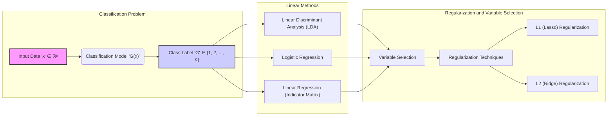
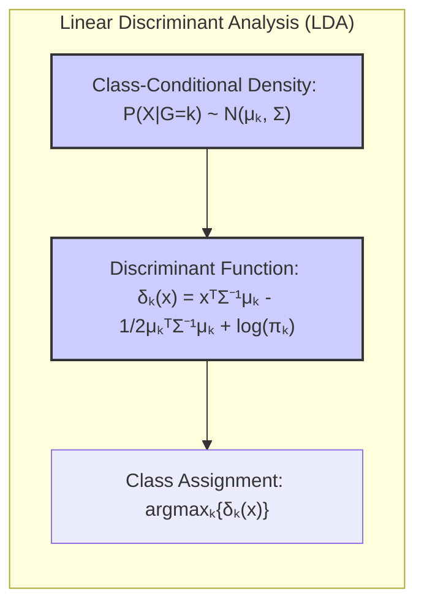
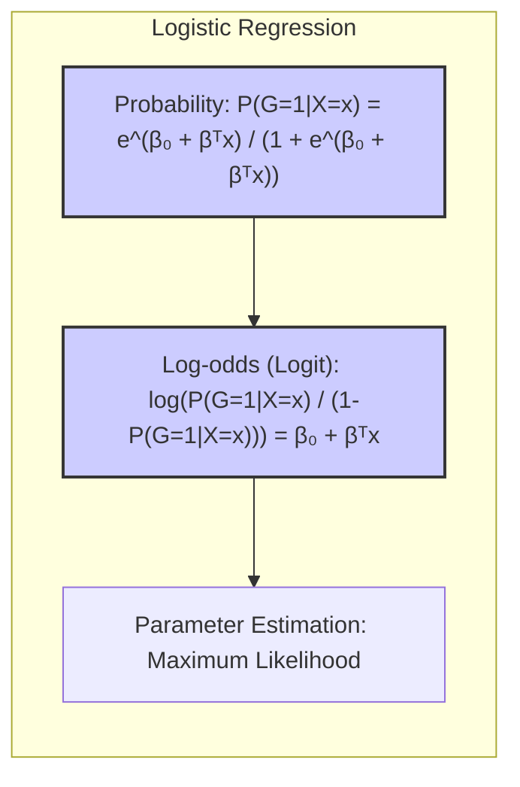
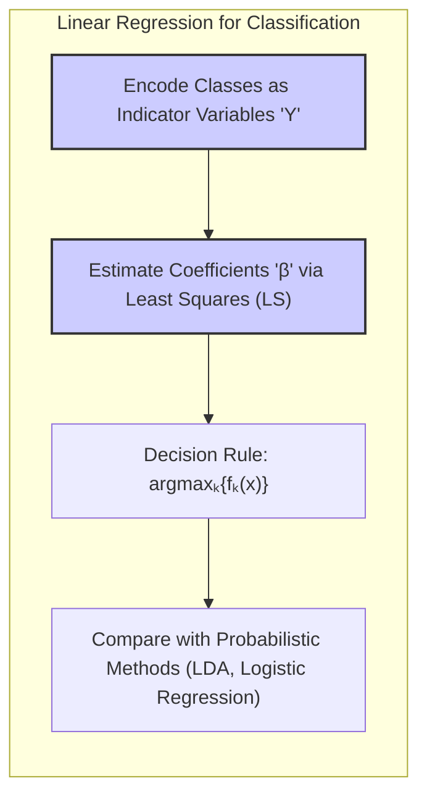
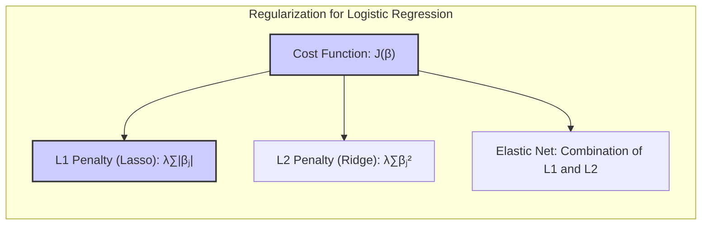
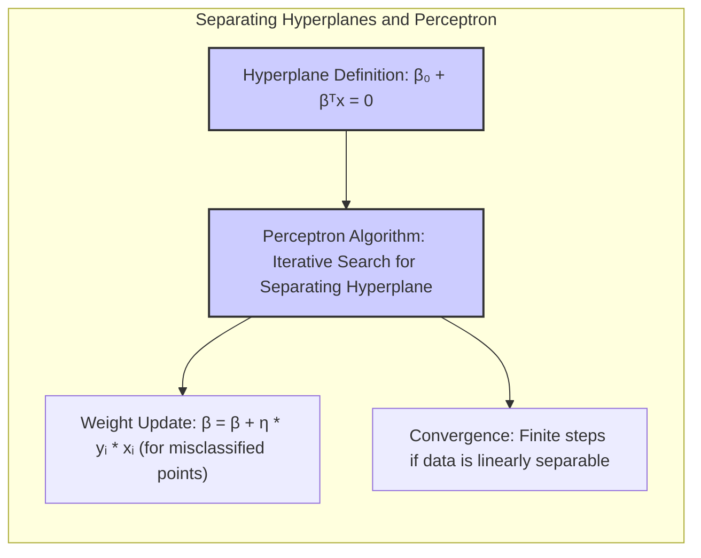

## Título Conciso: Classificação Linear, Seleção de Variáveis e Regularização



### Introdução

A classificação, como um problema central em aprendizado de máquina, envolve a atribuição de rótulos a um conjunto de dados de entrada. Métodos lineares são frequentemente utilizados por sua simplicidade, eficiência computacional e interpretabilidade. Neste capítulo, vamos explorar o uso de **modelos lineares para classificação**, começando pela **regressão linear** aplicada a **matrizes de indicadores**, que codificam as classes de forma numérica [^4.2]. Além disso, vamos analisar outras abordagens fundamentais como **Linear Discriminant Analysis (LDA)** e **Logistic Regression**, que também geram fronteiras de decisão lineares, mas com diferentes bases teóricas e suposições [^4.1]. Abordaremos também o uso de **hiperplanos separadores**, **seleção de variáveis** e técnicas de **regularização**, que desempenham um papel crucial para aumentar a robustez e o desempenho dos modelos de classificação [^4.4.4], [^4.5.2]. O objetivo deste capítulo é apresentar uma análise detalhada desses métodos, explorando tanto os fundamentos teóricos quanto suas aplicações práticas.

### Conceitos Fundamentais

**Conceito 1: O Problema de Classificação e Abordagens Lineares**

O problema de classificação tem como objetivo construir um modelo preditivo $G(x)$ que mapeie um vetor de entrada $x \in \mathbb{R}^p$ para um rótulo de classe $G$, pertencente a um conjunto discreto $G = \{1, 2, \ldots, K\}$ [^4.1]. Métodos lineares para classificação assumem que as fronteiras de decisão entre as classes são lineares, ou seja, podem ser representadas por hiperplanos no espaço de entrada [^4.1]. Essa suposição simplifica o problema e permite a criação de modelos que podem ser facilmente interpretados e computacionalmente eficientes. Uma função discriminante linear é dada por $f(x) = \beta_0 + \beta^T x$, onde $\beta_0$ é o termo de intercepto e $\beta$ é o vetor de coeficientes que definem a orientação do hiperplano [^4.1]. A classificação é feita atribuindo $x$ à classe com o maior valor da função discriminante linear correspondente. Embora essa abordagem tenha suas limitações (como a incapacidade de modelar fronteiras não-lineares), ela oferece um ponto de partida sólido para muitos problemas de classificação.

> 💡 **Exemplo Numérico:**
> Imagine um problema de classificação binária com duas classes, onde temos duas features ($x_1$ e $x_2$). A função discriminante linear pode ser $f(x) = 1 + 2x_1 - 1.5x_2$. Se tivermos um ponto $x = [2, 3]$, então $f(x) = 1 + 2*2 - 1.5*3 = 1 + 4 - 4.5 = 0.5$. Se tivermos um outro ponto $x = [0, 1]$, então $f(x) = 1 + 2*0 - 1.5*1 = 1 - 1.5 = -0.5$. Podemos usar um limiar (por exemplo, 0) para classificar, com valores acima do limiar atribuídos a uma classe e valores abaixo à outra. Neste caso, o primeiro ponto seria classificado em uma classe e o segundo na outra. O hiperplano de decisão é a reta $1 + 2x_1 - 1.5x_2 = 0$, que separa as duas classes.

**Lemma 1:** *A fronteira de decisão linear entre duas classes é um hiperplano.* A prova reside no fato de que a igualdade das funções discriminantes de duas classes $f_k(x) = f_l(x)$ gera uma equação linear em $x$, que define um hiperplano [^4.1]. Em outras palavras, o conjunto de pontos $x$ para os quais as funções discriminantes de duas classes são iguais formam uma estrutura geométrica plana.

**Conceito 2: Linear Discriminant Analysis (LDA)**

**LDA (Linear Discriminant Analysis)** é um método de classificação que se baseia na modelagem das distribuições condicionais das classes como Gaussianas multivariadas com a mesma matriz de covariância $\Sigma$ [^4.3]. A função discriminante linear para cada classe $k$ é dada por:

$$
\delta_k(x) = x^T \Sigma^{-1} \mu_k - \frac{1}{2} \mu_k^T \Sigma^{-1} \mu_k + \log \pi_k
$$

onde $\mu_k$ é o vetor de médias da classe $k$ e $\pi_k$ é a probabilidade a priori da classe. As funções discriminantes lineares resultam de suposições sobre a distribuição dos dados e a busca por fronteiras de decisão que separam as classes com o menor risco de erro [^4.3]. O LDA é frequentemente usado quando se tem uma boa separação das classes e a suposição de normalidade multivariada é razoável, apesar de se mostrar robusto em diversos contextos, mesmo quando essa suposição é violada.



> 💡 **Exemplo Numérico:**
> Considere duas classes, com as seguintes médias e matriz de covariância (compartilhada):
>
> $\mu_1 = \begin{bmatrix} 1 \\ 1 \end{bmatrix}$, $\mu_2 = \begin{bmatrix} 3 \\ 2 \end{bmatrix}$, $\Sigma = \begin{bmatrix} 1 & 0.5 \\ 0.5 & 1 \end{bmatrix}$
>
> Assumindo probabilidades a priori iguais ($\pi_1 = \pi_2 = 0.5$), podemos calcular as funções discriminantes para cada classe. Primeiro, calculamos a inversa de $\Sigma$:
>
> $\Sigma^{-1} = \frac{1}{0.75} \begin{bmatrix} 1 & -0.5 \\ -0.5 & 1 \end{bmatrix} = \begin{bmatrix} 1.33 & -0.67 \\ -0.67 & 1.33 \end{bmatrix}$
>
> Agora, para um ponto $x = [2, 1.5]$, calculamos $\delta_1(x)$ e $\delta_2(x)$:
>
> $\delta_1(x) = \begin{bmatrix} 2 & 1.5 \end{bmatrix} \begin{bmatrix} 1.33 & -0.67 \\ -0.67 & 1.33 \end{bmatrix} \begin{bmatrix} 1 \\ 1 \end{bmatrix} - \frac{1}{2} \begin{bmatrix} 1 & 1 \end{bmatrix} \begin{bmatrix} 1.33 & -0.67 \\ -0.67 & 1.33 \end{bmatrix} \begin{bmatrix} 1 \\ 1 \end{bmatrix} + \log(0.5)$
>
> $\delta_1(x) = \begin{bmatrix} 2 & 1.5 \end{bmatrix} \begin{bmatrix} 0.66 \\ 0.66 \end{bmatrix} - \frac{1}{2} \begin{bmatrix} 1 & 1 \end{bmatrix} \begin{bmatrix} 0.66 \\ 0.66 \end{bmatrix} + \log(0.5) = 2.31 - 0.66 + \log(0.5) = 1.65 -0.69 = 0.96$
>
> $\delta_2(x) = \begin{bmatrix} 2 & 1.5 \end{bmatrix} \begin{bmatrix} 1.33 & -0.67 \\ -0.67 & 1.33 \end{bmatrix} \begin{bmatrix} 3 \\ 2 \end{bmatrix} - \frac{1}{2} \begin{bmatrix} 3 & 2 \end{bmatrix} \begin{bmatrix} 1.33 & -0.67 \\ -0.67 & 1.33 \end{bmatrix} \begin{bmatrix} 3 \\ 2 \end{bmatrix} + \log(0.5)$
>
> $\delta_2(x) = \begin{bmatrix} 2 & 1.5 \end{bmatrix} \begin{bmatrix} 2.65 \\ 1.33 \end{bmatrix} - \frac{1}{2} \begin{bmatrix} 3 & 2 \end{bmatrix} \begin{bmatrix} 1.33 \\ 0.66 \end{bmatrix} + \log(0.5) = 7.30 - 2.66 + \log(0.5) = 4.64 -0.69 = 3.95$
>
> Como $\delta_2(x) > \delta_1(x)$, o ponto $x$ seria classificado na classe 2.

**Corolário 1:** *As fronteiras de decisão do LDA são lineares (hiperplanos).* Isso decorre diretamente da forma linear das funções discriminantes $\delta_k(x)$, onde a igualdade de $\delta_k(x)$ e $\delta_l(x)$ resulta em uma equação linear em $x$, definindo assim um hiperplano separador [^4.3.1].

**Conceito 3: Regressão Logística**

**Logistic Regression** é uma técnica que modela a probabilidade de uma observação pertencer a uma classe usando uma função logística [^4.4]. No caso de duas classes, a probabilidade $P(G=1|X=x)$ é modelada como:

$$
P(G=1|X=x) = \frac{e^{\beta_0 + \beta^T x}}{1 + e^{\beta_0 + \beta^T x}}
$$

O log-odds (logit) dessa probabilidade é uma função linear de $x$, ou seja, $\log(\frac{P(G=1|X=x)}{1-P(G=1|X=x)}) = \beta_0 + \beta^T x$ [^4.4]. O método estima os coeficientes $\beta_0$ e $\beta$ através da maximização da função de verossimilhança dos dados de treinamento [^4.4.1]. A Regressão Logística, ao contrário do LDA, não faz suposições sobre a distribuição dos dados de entrada, o que a torna mais flexível em muitas situações práticas [^4.4.2].



> 💡 **Exemplo Numérico:**
> Suponha que, após treinar um modelo de regressão logística, obtivemos os coeficientes $\beta_0 = -1$ e $\beta = \begin{bmatrix} 0.5 \\ 1 \end{bmatrix}$. Para um ponto $x = [2, 1]$, a probabilidade de pertencer à classe 1 é:
>
> $P(G=1|X=x) = \frac{e^{-1 + 0.5*2 + 1*1}}{1 + e^{-1 + 0.5*2 + 1*1}} = \frac{e^{1}}{1 + e^{1}} = \frac{2.718}{1 + 2.718} \approx 0.731$.
>
> Portanto, a probabilidade do ponto $x$ pertencer à classe 1 é de aproximadamente 73.1%. Para classificar, usaríamos um limiar (por exemplo, 0.5). Neste caso, o ponto seria classificado como classe 1.

> ⚠️ **Nota Importante**: A regressão logística modela diretamente as probabilidades das classes, enquanto o LDA modela as distribuições das classes [^4.4.1].

> ❗ **Ponto de Atenção**: Em datasets com classes desbalanceadas, é fundamental usar técnicas de rebalanceamento ou ajustar as penalidades para evitar o viés do modelo em direção à classe majoritária [^4.4.2].

> ✔️ **Destaque**: Tanto LDA quanto a regressão logística resultam em fronteiras de decisão lineares, mas a estimativa dos parâmetros é realizada de formas distintas, uma utilizando momentos dos dados e a outra utilizando a maximização da verossimilhança [^4.5].

### Regressão Linear e Mínimos Quadrados para Classificação



A regressão linear, apesar de ser tradicionalmente usada para problemas de regressão, pode ser adaptada para problemas de classificação através do uso de uma **matriz de indicadores** [^4.2]. Para um problema com $K$ classes, cada observação $x_i$ é associada a um vetor indicador $Y_i$ de dimensão $K$. Se $x_i$ pertence à classe $k$, o elemento $Y_{ik}$ será igual a 1 e os demais serão 0. Isso gera uma matriz de respostas $Y$ com dimensão $N \times K$, onde $N$ é o número de observações. Cada coluna da matriz $Y$ corresponde a uma das $K$ classes, contendo valores 0 ou 1 [^4.2].

Em seguida, um modelo de regressão linear é ajustado a cada uma das $K$ colunas de $Y$ simultaneamente. O modelo estimado para cada classe $k$ é dado por $f_k(x) = \beta_{k0} + \beta_k^T x$. Uma nova observação $x$ é classificada na classe $k$ que apresentar o maior valor de $f_k(x)$. Em outras palavras, o classificador escolhe a classe com a maior resposta ajustada pela regressão linear: $\hat{G}(x) = \arg\max_k f_k(x)$ [^4.2].

> 💡 **Exemplo Numérico:**
>
> Suponha que temos três classes e 4 observações com duas features ($x_1, x_2$). A matriz de design $X$ e a matriz de indicadores $Y$ são:
>
> $X = \begin{bmatrix} 1 & 2 \\ 2 & 1 \\ 3 & 3 \\ 4 & 2 \end{bmatrix}$ , $Y = \begin{bmatrix} 1 & 0 & 0 \\ 0 & 1 & 0 \\ 0 & 0 & 1 \\ 1 & 0 & 0 \end{bmatrix}$
>
> Para cada classe, ajustamos um modelo de regressão linear. Usando o método dos mínimos quadrados $\hat{\beta} = (X^TX)^{-1}X^TY$, podemos calcular os coeficientes.
>
> $X^TX = \begin{bmatrix} 1 & 2 & 3 & 4 \\ 2 & 1 & 3 & 2 \end{bmatrix} \begin{bmatrix} 1 & 2 \\ 2 & 1 \\ 3 & 3 \\ 4 & 2 \end{bmatrix} = \begin{bmatrix} 30 & 23 \\ 23 & 18 \end{bmatrix}$
>
> $(X^TX)^{-1} = \frac{1}{30*18 - 23*23}\begin{bmatrix} 18 & -23 \\ -23 & 30 \end{bmatrix} = \frac{1}{29}\begin{bmatrix} 18 & -23 \\ -23 & 30 \end{bmatrix}$
>
> $X^TY = \begin{bmatrix} 1 & 2 & 3 & 4 \\ 2 & 1 & 3 & 2 \end{bmatrix} \begin{bmatrix} 1 & 0 & 0 \\ 0 & 1 & 0 \\ 0 & 0 & 1 \\ 1 & 0 & 0 \end{bmatrix} = \begin{bmatrix} 5 & 2 & 3 \\ 4 & 1 & 3 \end{bmatrix}$
>
> $\hat{\beta} = (X^TX)^{-1}X^TY = \frac{1}{29}\begin{bmatrix} 18 & -23 \\ -23 & 30 \end{bmatrix} \begin{bmatrix} 5 & 2 & 3 \\ 4 & 1 & 3 \end{bmatrix} = \frac{1}{29} \begin{bmatrix} -2 & 13 & -15 \\ 5 & -16 & 21 \end{bmatrix} = \begin{bmatrix} -0.069 & 0.448 & -0.517 \\ 0.172 & -0.552 & 0.724 \end{bmatrix}$
>
>  Adicionando um intercepto $\beta_{k0}$, podemos usar $\hat{\beta}$ para fazer previsões. Para um novo ponto $x = [3, 2]$, as previsões seriam:
>
> $\hat{f_1}(x) = \beta_{10} + \beta_{11}*3 + \beta_{12}*2$
> $\hat{f_2}(x) = \beta_{20} + \beta_{21}*3 + \beta_{22}*2$
> $\hat{f_3}(x) = \beta_{30} + \beta_{31}*3 + \beta_{32}*2$
>
> A classe prevista seria a que tem o maior valor de $\hat{f_k}(x)$.

Apesar da simplicidade dessa abordagem, ela tem algumas limitações importantes. Primeiro, a regressão linear pode produzir estimativas $f_k(x)$ que estão fora do intervalo $[0, 1]$, o que dificulta a interpretação das mesmas como probabilidades [^4.2]. Segundo, em cenários onde as classes não são linearmente separáveis ou apresentam sobreposição, essa abordagem pode ter um desempenho inferior quando comparada com métodos que modelam a distribuição das classes de forma mais explícita, conforme detalhado em [^4.3]. O problema do "masking" também surge, onde classes intermediárias podem ser completamente ignoradas, como exemplificado em [^4.2].

A regressão de indicadores, apesar dessas limitações, pode ser útil quando o objetivo principal é a fronteira de decisão linear e as classes podem ser razoavelmente separadas por um hiperplano. Ela também pode servir como uma aproximação inicial em problemas de classificação, com a vantagem de sua simplicidade computacional [^4.2].

**Lemma 2:** *Sob a codificação 1/-1 para classes binárias, a direção do vetor de coeficientes obtido via regressão linear (método dos mínimos quadrados) é proporcional à direção do discriminante do LDA.* Este resultado demonstra a conexão teórica entre a regressão linear em matriz de indicadores e o LDA quando as classes são codificadas de forma adequada. [^4.2]

**Corolário 2:** *Em condições específicas, como igualdade de número de observações nas classes e covariância esférica, a regressão de indicadores e o LDA levam à mesma regra de decisão.* Essas condições, embora simplificadoras, mostram uma concordância entre os dois métodos em cenários mais idealizados [^4.3].

É importante notar que, conforme discutido em [^4.4], a regressão logística pode fornecer estimativas de probabilidades mais estáveis, enquanto a regressão de indicadores pode gerar valores que extrapolam o intervalo [0,1]. No entanto, em cenários onde o objetivo é apenas encontrar uma fronteira de decisão linear, a regressão de indicadores pode ser uma alternativa suficiente, conforme em [^4.2].

### Métodos de Seleção de Variáveis e Regularização em Classificação



**Seleção de variáveis** e **regularização** são métodos essenciais para construir modelos de classificação mais robustos, especialmente em contextos com muitas variáveis preditoras [^4.5]. Em problemas de classificação, o uso excessivo de variáveis pode levar ao *overfitting*, comprometendo a capacidade de generalização do modelo para novos dados. A **regularização** impõe restrições sobre os coeficientes do modelo, buscando reduzir a sua complexidade e melhorar o desempenho [^4.4.4].

Na **regressão logística**, a regularização pode ser introduzida como um termo de penalidade na função de custo:

$$
\max_{\beta_0, \beta} \left[ \sum_{i=1}^N \left( y_i (\beta_0 + \beta^T x_i) - \log(1 + e^{\beta_0 + \beta^T x_i}) \right) - \lambda P(\beta) \right]
$$

Onde $P(\beta)$ é o termo de penalidade, e $\lambda$ é o parâmetro de regularização. A penalidade **L1 (Lasso)** é dada por $P(\beta) = \sum_{j=1}^p |\beta_j|$, que induz a esparsidade do modelo, zerando coeficientes de variáveis menos relevantes e promovendo a seleção de variáveis [^4.4.4]. A penalidade **L2 (Ridge)** é dada por $P(\beta) = \sum_{j=1}^p \beta_j^2$, que reduz a magnitude dos coeficientes, favorecendo soluções mais estáveis e com menor variância [^4.5]. A escolha entre L1, L2 ou uma combinação das duas (Elastic Net) depende da aplicação e das propriedades desejadas do modelo.

> 💡 **Exemplo Numérico:**
>
> Vamos supor que estamos treinando uma regressão logística com duas features e estamos usando a regularização L1 (Lasso). A função de custo com a penalidade L1 é:
>
> $J(\beta) = -\frac{1}{N} \sum_{i=1}^N \left[ y_i \log(p_i) + (1 - y_i) \log(1 - p_i) \right] + \lambda (|\beta_1| + |\beta_2|)$
>
> Onde $p_i$ é a probabilidade prevista para a observação $i$.
>
> Suponha que após a otimização, com $\lambda = 0.1$, obtivemos os seguintes coeficientes: $\beta_0 = -0.5, \beta_1 = 0.8, \beta_2 = 0.2$.
>
> Agora, se aumentarmos $\lambda$ para 0.5, a penalidade L1 se torna mais forte, resultando em uma solução mais esparsa. Após a otimização, podemos obter: $\beta_0 = -0.3, \beta_1 = 0.4, \beta_2 = 0.0$. Observe que $\beta_2$ foi zerado, indicando que a segunda feature se tornou menos relevante.
>
> Se usarmos a regularização L2 (Ridge) com $\lambda=0.1$, poderíamos obter algo como $\beta_0 = -0.4, \beta_1 = 0.7, \beta_2 = 0.3$.
>
> A regularização L2 tende a reduzir os valores dos coeficientes sem zerá-los completamente, enquanto a L1 pode zerar alguns coeficientes.
>
> | Método       | $\beta_0$ | $\beta_1$ | $\beta_2$ |
> |--------------|-----------|-----------|-----------|
> | Sem Reg.     | -0.5      | 0.9      | 0.3       |
> | Lasso ($\lambda=0.1$)   | -0.5      | 0.8      | 0.2      |
> | Lasso ($\lambda=0.5$)   | -0.3      | 0.4      | 0.0      |
> | Ridge ($\lambda=0.1$)   | -0.4      | 0.7      | 0.3      |

**Lemma 3:** *A penalidade L1 na regressão logística resulta em coeficientes esparsos.* A penalidade L1 adiciona um termo que é proporcional à soma dos valores absolutos dos coeficientes, levando ao "zeramento" de muitos coeficientes durante o processo de otimização. [^4.4.4]

**Prova do Lemma 3:** A minimização da função de custo com a penalidade L1 leva os coeficientes para zero sempre que a derivada da função objetivo em relação a esses coeficientes for menor que o parâmetro de regularização $\lambda$. Devido à natureza da penalidade L1, que possui uma derivada constante (em valor absoluto), ao contrário da penalidade L2 (cuja derivada é proporcional ao coeficiente), a penalidade L1 força alguns coeficientes a serem exatamente iguais a zero, promovendo a esparsidade do modelo. [^4.4.3] $\blacksquare$

**Corolário 3:** *A esparsidade induzida pela penalidade L1 leva à seleção de variáveis, resultando em modelos mais interpretáveis e com melhor generalização.* A remoção de variáveis irrelevantes simplifica o modelo e reduz o risco de overfitting, melhorando o desempenho em novos dados [^4.4.5].

> ⚠️ **Ponto Crucial**: A escolha entre penalidade L1 e L2 impacta diretamente na natureza da solução, com L1 gerando modelos esparsos e L2 gerando modelos mais estáveis e com menor variância. A combinação de ambas, Elastic Net, oferece flexibilidade para explorar diferentes trade-offs [^4.5].

### Separating Hyperplanes e Perceptrons



O conceito de **hiperplanos separadores** emerge da busca por uma fronteira linear que maximize a separação entre diferentes classes, ou seja, que não apenas separe as classes, mas também maximize a distância entre o hiperplano e as observações mais próximas de cada classe [^4.5.2]. Um hiperplano separador é definido por $\beta_0 + \beta^T x = 0$, onde $\beta$ define a orientação do hiperplano e $\beta_0$ define o deslocamento em relação à origem.

O **Perceptron**, um algoritmo clássico em aprendizado de máquina, busca encontrar um hiperplano separador de forma iterativa [^4.5.1]. O algoritmo começa com uma estimativa inicial do hiperplano e, para cada observação classificada incorretamente, ajusta os parâmetros $\beta_0$ e $\beta$ para se aproximar de uma solução que separe as classes. Se os dados forem linearmente separáveis, o algoritmo do Perceptron converge para uma solução em um número finito de passos [^4.5.1]. No entanto, se os dados não forem linearmente separáveis, o algoritmo pode oscilar e não convergir. Além disso, em casos separáveis, a solução final pode não ser única e pode depender da inicialização.

> 💡 **Exemplo Numérico:**
> Suponha que temos dados em duas dimensões e queremos usar o Perceptron para encontrar um hiperplano separador. Inicializamos os pesos como $\beta_0 = 0$, $\beta = [0.1, -0.2]$.
>
> Temos os seguintes pontos e classes:
>
> $x_1 = [1, 1], y_1 = 1$
> $x_2 = [2, 0], y_2 = 1$
> $x_3 = [0, 2], y_3 = -1$
> $x_4 = [0, 0], y_4 = -1$
>
> Para cada ponto, calculamos $\hat{y} = \beta_0 + \beta^T x$.
>
> Para $x_1$: $\hat{y_1} = 0 + 0.1 * 1 - 0.2 * 1 = -0.1$. A classe prevista é -1 (já que é negativo). Como a classe real é 1, temos um erro. Atualizamos os pesos:
>
> $\beta_0 = \beta_0 + \eta * y_1 = 0 + 0.1 * 1 = 0.1$ (onde $\eta$ é a taxa de aprendizado, vamos usar $\eta = 0.1$)
> $\beta = \beta + \eta * y_1 * x_1 = [0.1, -0.2] + 0.1 * 1 * [1, 1] = [0.2, -0.1]$
>
> Agora, $\beta_0 = 0.1$, $\beta = [0.2, -0.1]$.
>
> Repetimos esse processo para os outros pontos e iteramos até que não haja mais erros.
>
>  Vamos a segunda iteração:
>
> Para $x_1$: $\hat{y_1} = 0.1 + 0.2 * 1 - 0.1 * 1 = 0.2$. A classe prevista é 1. Sem erro.
> Para $x_2$: $\hat{y_2} = 0.1 + 0.2 * 2 - 0.1 * 0 = 0.5$. A classe prevista é 1. Sem erro.
> Para $x_3$: $\hat{y_3} = 0.1 + 0.2 * 0 - 0.1 * 2 = -0.1$. A classe prevista é -1. Sem erro.
> Para $x_4$: $\hat{y_4} = 0.1 + 0.2 * 0 - 0.1 * 0 = 0.1$. A classe prevista é 1. Erro.
>
> Atualizamos os pesos:
>
> $\beta_0 = \beta_0 + \eta * y_4 = 0.1 + 0.1 * -1 = 0$
> $\beta = \beta + \eta * y_4 * x_4 = [0.2, -0.1] + 0.1 * -1 * [0, 0] = [0.2, -0.1]$
>
> Agora, $\beta_0 = 0$, $\beta = [0.2, -0.1]$.
>
> Este processo é repetido até que o algoritmo convirja.

**Teorema:** *Se um conjunto de dados é linearmente separável, o algoritmo do Perceptron irá convergir para um hiperplano separador em um número finito de iterações.* Esse teorema é fundamental para a compreensão da garantia de convergência do algoritmo em condições ideais, mas não garante convergência em dados não linearmente separáveis [^4.5.1].

### Pergunta Teórica Avançada: Quais as diferenças fundamentais entre a formulação de LDA e a Regra de Decisão Bayesiana considerando distribuições Gaussianas com covariâncias iguais?

```mermaid
graph LR
    subgraph "Comparison: LDA vs. Bayesian Decision Rule"
        direction TB
        A["Bayesian Decision Rule: Maximize P(G=k|X=x)"]
        B["LDA Discriminant: δₖ(x) = xᵀΣ⁻¹μₖ - 1/2μₖᵀΣ⁻¹μₖ + log(πₖ)"]
        C["Gaussian Assumption: P(X|G=k) ~ N(μₖ, Σ) (same Σ for all classes)"]
        D["Equivalence: Under Gaussian Assumption with equal covariances, LDA = Bayesian"]
    end
    A --> C
    B --> C
    C --> D
     style A fill:#ccf,stroke:#333,stroke-width:2px
    style B fill:#ccf,stroke