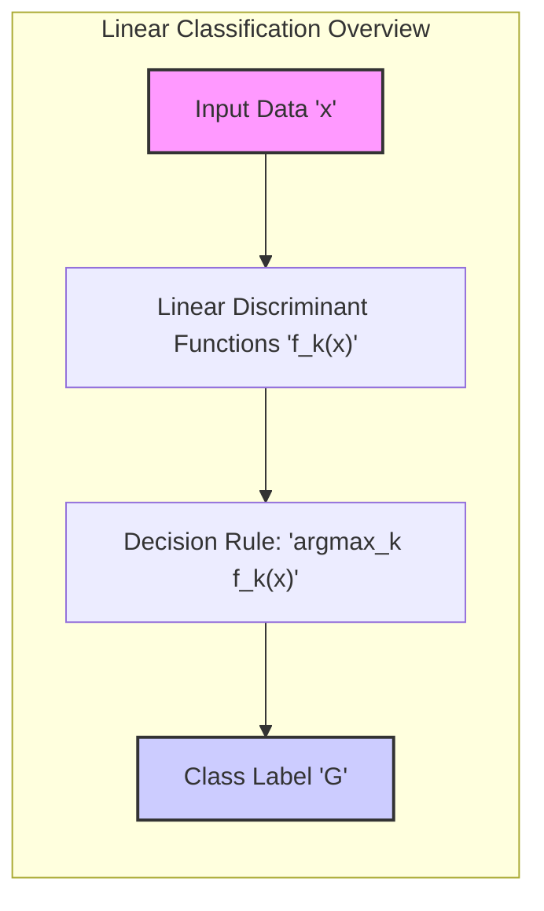
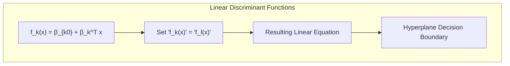
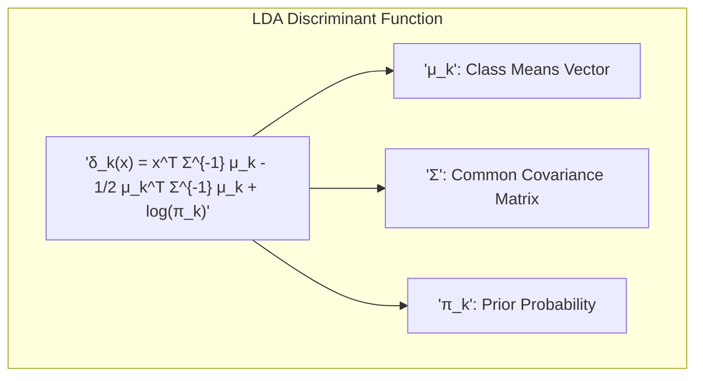
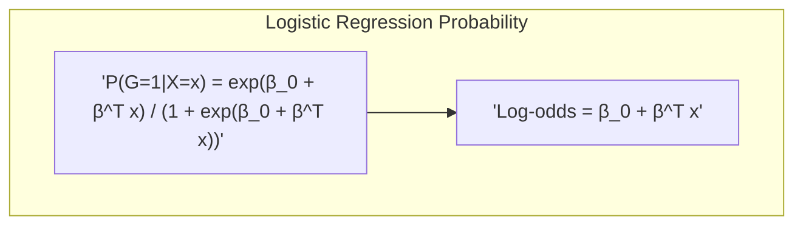
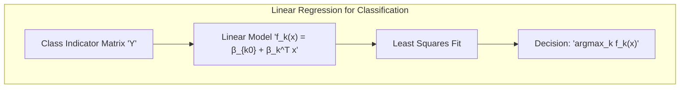
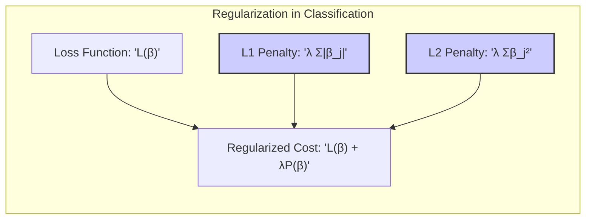
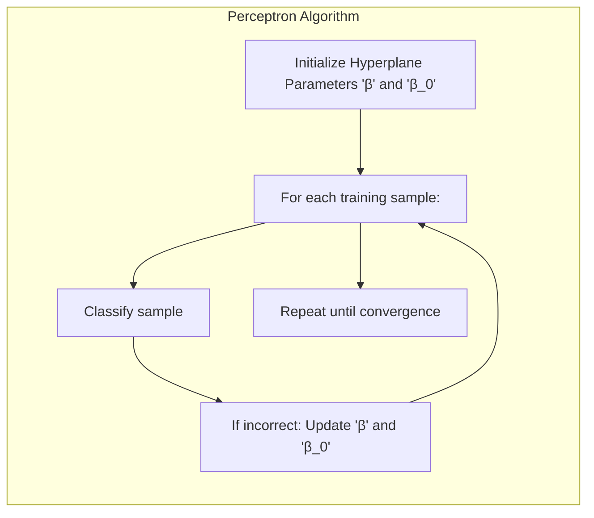
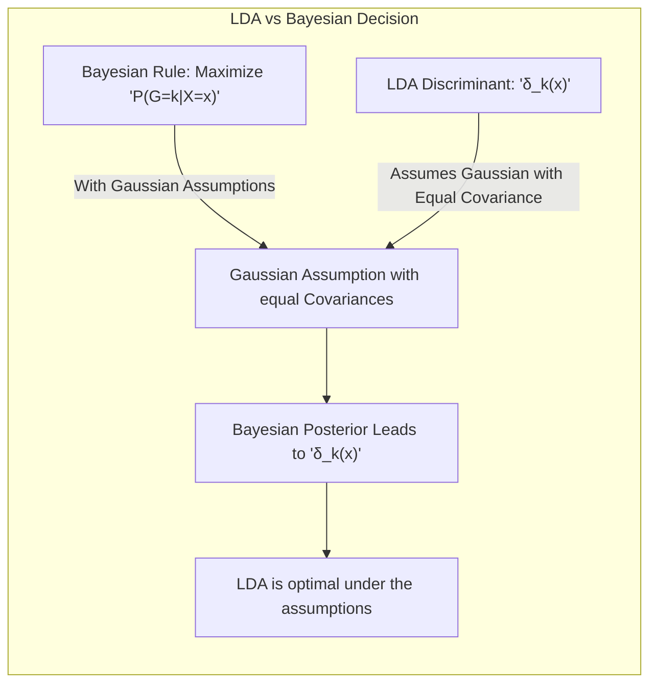

## Título Conciso: Classificação Linear, Seleção de Variáveis e Regularização

### Introdução

O objetivo fundamental da classificação é construir modelos que atribuam rótulos de classe a dados de entrada. Métodos lineares de classificação, baseados na ideia de delimitar regiões de decisão através de hiperplanos, são amplamente usados devido à sua simplicidade, eficiência e interpretabilidade [^4.1]. Neste capítulo, focaremos em métodos como **Linear Discriminant Analysis (LDA)** e **Logistic Regression**, que utilizam funções lineares para modelar a probabilidade ou a função discriminante das classes [^4.3], [^4.4]. Discutiremos também o conceito de **regressão linear** em **matrizes de indicadores**, uma abordagem alternativa para classificação que utiliza funções lineares ajustadas via mínimos quadrados [^4.2]. Além disso, exploraremos a ideia de **hiperplanos separadores** e a aplicação de técnicas de **seleção de variáveis e regularização**, que são cruciais para o desempenho e a generalização dos modelos [^4.5.2], [^4.4.4]. O foco principal será na **regra de decisão** utilizada para classificar novas observações com base nas funções discriminantes ou probabilidades estimadas, especialmente a decisão de classificar para a classe com o maior valor ajustado.

### Conceitos Fundamentais

**Conceito 1: O Problema de Classificação e Funções Discriminantes Lineares**

Em um problema de classificação, o objetivo é atribuir um rótulo de classe $G$ a uma dada entrada $x$, onde $G$ pertence a um conjunto discreto de classes $G=\{1,2,\ldots,K\}$ [^4.1]. Métodos lineares de classificação utilizam funções discriminantes lineares para delimitar as regiões de decisão, assumindo que as fronteiras entre as classes podem ser representadas por hiperplanos. Uma função discriminante linear para a classe $k$ é dada por $f_k(x) = \beta_{k0} + \beta_k^T x$, onde $\beta_{k0}$ é o intercepto e $\beta_k$ é o vetor de coeficientes para a classe $k$ [^4.1]. A decisão sobre a classe é então feita comparando os valores dessas funções para diferentes classes, atribuindo a observação $x$ à classe com o maior valor da função discriminante. A regra de decisão é, portanto, central nos métodos de classificação lineares.

> 💡 **Exemplo Numérico:**
>
> Suponha que temos um problema de classificação com duas classes e duas variáveis preditoras. As funções discriminantes para as classes 1 e 2 são:
>
> $f_1(x) = 2 + 1x_1 - 0.5x_2$
>
> $f_2(x) = -1 + 0.5x_1 + 1x_2$
>
> Para uma nova observação $x = [3, 2]$, calculamos:
>
> $f_1(x) = 2 + 1(3) - 0.5(2) = 2 + 3 - 1 = 4$
>
> $f_2(x) = -1 + 0.5(3) + 1(2) = -1 + 1.5 + 2 = 2.5$
>
> Como $f_1(x) > f_2(x)$, classificamos $x$ na classe 1. Este exemplo ilustra como a regra de decisão "maior valor" é aplicada usando funções discriminantes lineares.

**Lemma 1:** *A fronteira de decisão entre duas classes utilizando funções discriminantes lineares é um hiperplano.* Isso decorre do fato de que igualar as funções discriminantes de duas classes, $f_k(x) = f_l(x)$, resulta em uma equação linear em $x$, que define um hiperplano [^4.1]. Essa estrutura geométrica é a base dos métodos de classificação lineares.

**Conceito 2: Linear Discriminant Analysis (LDA) e a Regra de Decisão**

O **LDA** assume que as distribuições das classes são Gaussianas multivariadas com a mesma matriz de covariância $\Sigma$ [^4.3]. A função discriminante linear do LDA para uma classe $k$ é dada por:

$$
\delta_k(x) = x^T \Sigma^{-1} \mu_k - \frac{1}{2} \mu_k^T \Sigma^{-1} \mu_k + \log \pi_k
$$

onde $\mu_k$ é o vetor de médias da classe $k$ e $\pi_k$ é a probabilidade a priori da classe. A regra de decisão no LDA consiste em classificar uma nova observação $x$ para a classe que maximiza a função discriminante $\delta_k(x)$: $\hat{G}(x) = \arg\max_k \delta_k(x)$ [^4.3]. Essa regra de decisão é baseada na maximização da probabilidade posterior sob as suposições gaussianas e de covariâncias iguais.

> 💡 **Exemplo Numérico:**
>
> Considere um problema de classificação com duas classes e duas variáveis preditoras. Suponha que as médias das classes são $\mu_1 = [1, 1]$ e $\mu_2 = [3, 3]$, e a matriz de covariância comum é $\Sigma = \begin{bmatrix} 1 & 0.5 \\ 0.5 & 1 \end{bmatrix}$. As probabilidades a priori são $\pi_1 = 0.4$ e $\pi_2 = 0.6$.
>
> Primeiro, calculamos a inversa da matriz de covariância:
> $\Sigma^{-1} = \frac{1}{0.75} \begin{bmatrix} 1 & -0.5 \\ -0.5 & 1 \end{bmatrix} = \begin{bmatrix} 1.33 & -0.67 \\ -0.67 & 1.33 \end{bmatrix}$
>
> Para uma nova observação $x = [2, 2]$, calculamos as funções discriminantes:
>
> $\delta_1(x) =  \begin{bmatrix} 2 & 2 \end{bmatrix} \begin{bmatrix} 1.33 & -0.67 \\ -0.67 & 1.33 \end{bmatrix} \begin{bmatrix} 1 \\ 1 \end{bmatrix} - \frac{1}{2} \begin{bmatrix} 1 & 1 \end{bmatrix} \begin{bmatrix} 1.33 & -0.67 \\ -0.67 & 1.33 \end{bmatrix} \begin{bmatrix} 1 \\ 1 \end{bmatrix} + \log(0.4) \approx 0.66 - 0.66 -0.92 = -0.92$
>
> $\delta_2(x) =  \begin{bmatrix} 2 & 2 \end{bmatrix} \begin{bmatrix} 1.33 & -0.67 \\ -0.67 & 1.33 \end{bmatrix} \begin{bmatrix} 3 \\ 3 \end{bmatrix} - \frac{1}{2} \begin{bmatrix} 3 & 3 \end{bmatrix} \begin{bmatrix} 1.33 & -0.67 \\ -0.67 & 1.33 \end{bmatrix} \begin{bmatrix} 3 \\ 3 \end{bmatrix} + \log(0.6) \approx  7.98 - 7.98 -0.51= -0.51$
>
> Como $\delta_2(x) > \delta_1(x)$, classificamos $x$ na classe 2. Este exemplo ilustra o cálculo das funções discriminantes do LDA e a regra de decisão baseada na maximização dessas funções.

**Corolário 1:** *A regra de decisão do LDA leva a fronteiras de decisão lineares.* Isso é uma consequência direta da forma linear das funções discriminantes $\delta_k(x)$, onde a igualdade entre duas funções leva a uma equação linear [^4.3.1].

**Conceito 3: Regressão Logística e a Decisão por Máxima Probabilidade**

Na **Logistic Regression**, a probabilidade de uma observação $x$ pertencer à classe 1 em um problema binário é modelada como:

$$
P(G=1|X=x) = \frac{e^{\beta_0 + \beta^T x}}{1 + e^{\beta_0 + \beta^T x}}
$$

O log-odds (logit) desta probabilidade é uma função linear de $x$. Os parâmetros são estimados por maximização da verossimilhança [^4.4.1]. A regra de decisão na Regressão Logística consiste em classificar $x$ na classe com maior probabilidade, ou seja, na classe 1 se $P(G=1|X=x) > 0.5$ ou, equivalentemente, se $\beta_0 + \beta^T x > 0$ e na classe 0 caso contrário. Essa regra de decisão também é fundamentalmente baseada em uma função linear, e sua decisão é equivalente a usar a função discriminante linear $\beta_0 + \beta^T x$.

> 💡 **Exemplo Numérico:**
>
> Suponha que temos um modelo de regressão logística com $\beta_0 = -2$, $\beta_1 = 1$ e $\beta_2 = 0.5$. Para uma nova observação $x = [3, 2]$, calculamos:
>
> $\beta_0 + \beta^T x = -2 + 1(3) + 0.5(2) = -2 + 3 + 1 = 2$
>
> $P(G=1|X=x) = \frac{e^2}{1 + e^2} \approx \frac{7.39}{1 + 7.39} \approx 0.88$
>
> Como $P(G=1|X=x) > 0.5$ (ou equivalentemente, $\beta_0 + \beta^T x > 0$), classificamos $x$ na classe 1. Este exemplo ilustra como a probabilidade é calculada e como a regra de decisão é aplicada na regressão logística.

> ⚠️ **Nota Importante**: Tanto o LDA quanto a Regressão Logística utilizam regras de decisão baseadas em funções lineares, embora os métodos para estimar os parâmetros sejam diferentes [^4.5].

> ❗ **Ponto de Atenção**: A escolha do método de classificação (LDA ou regressão logística) pode depender das suposições sobre a distribuição dos dados e do problema em questão [^4.4.2].

> ✔️ **Destaque**: A regra de decisão de classificar para a classe com o maior valor ajustado é uma característica comum aos métodos lineares de classificação.

### Regressão Linear e Mínimos Quadrados para Classificação

A **regressão linear** pode ser aplicada a problemas de classificação usando uma **matriz de indicadores**, onde cada classe é codificada por um vetor binário. Para um problema com $K$ classes, a matriz de resposta $Y$ tem dimensão $N \times K$, onde cada linha corresponde a uma observação e cada coluna indica uma classe. Se uma observação $x_i$ pertence à classe $k$, o elemento $Y_{ik}$ será 1, e todos os outros elementos na mesma linha serão 0 [^4.2].

O modelo de regressão linear é ajustado a cada coluna de $Y$ simultaneamente: $f_k(x) = \beta_{k0} + \beta_k^T x$. Após o ajuste, uma nova observação $x$ é classificada na classe $k$ que maximiza o valor da função ajustada $f_k(x)$: $\hat{G}(x) = \arg\max_k f_k(x)$ [^4.2]. Esta regra de decisão é uma característica comum dos métodos de classificação linear.

> 💡 **Exemplo Numérico:**
>
> Considere um problema de classificação com 3 classes e 2 variáveis preditoras. Temos 5 observações e a matriz de indicadores $Y$ e a matriz de preditores $X$ são:
>
> $Y = \begin{bmatrix} 1 & 0 & 0 \\ 0 & 1 & 0 \\ 0 & 0 & 1 \\ 1 & 0 & 0 \\ 0 & 1 & 0 \end{bmatrix}$ e $X = \begin{bmatrix} 1 & 2 \\ 2 & 1 \\ 3 & 3 \\ 4 & 2 \\ 5 & 1 \end{bmatrix}$
>
> Adicionamos uma coluna de 1s para o intercepto: $X_b = \begin{bmatrix} 1 & 1 & 2 \\ 1 & 2 & 1 \\ 1 & 3 & 3 \\ 1 & 4 & 2 \\ 1 & 5 & 1 \end{bmatrix}$
>
> Usamos a fórmula de mínimos quadrados $\hat{\beta} = (X_b^T X_b)^{-1} X_b^T Y$ para estimar os coeficientes. Vamos calcular para a primeira coluna de Y (classe 1):
>
> $X_b^T X_b = \begin{bmatrix} 5 & 15 & 9 \\ 15 & 55 & 33 \\ 9 & 33 & 29 \end{bmatrix}$
>
> $(X_b^T X_b)^{-1} \approx \begin{bmatrix} 1.09 & -0.25 & -0.22 \\ -0.25 & 0.07 & 0.02 \\ -0.22 & 0.02 & 0.11 \end{bmatrix}$
>
> $X_b^T Y_1 = \begin{bmatrix} 2 \\ 5 \\ 6 \end{bmatrix}$
>
> $\hat{\beta_1} = (X_b^T X_b)^{-1} X_b^T Y_1 \approx \begin{bmatrix} 1.09 & -0.25 & -0.22 \\ -0.25 & 0.07 & 0.02 \\ -0.22 & 0.02 & 0.11 \end{bmatrix} \begin{bmatrix} 2 \\ 5 \\ 6 \end{bmatrix} \approx \begin{bmatrix} 0.15 \\ 0.01 \\ -0.18 \end{bmatrix}$
>
> Similarmente, calculamos $\hat{\beta_2}$ e $\hat{\beta_3}$ para as classes 2 e 3. Para uma nova observação $x = [2, 2]$, calculamos os valores ajustados:
>
> $f_1(x) = 0.15 + 0.01(2) - 0.18(2) = -0.19$
>
> Calculamos $f_2(x)$ e $f_3(x)$ similarmente, e classificamos $x$ na classe com o maior valor ajustado. Este exemplo ilustra como a regressão linear é aplicada usando uma matriz de indicadores e como a regra de decisão é utilizada.

Apesar de sua simplicidade, a regressão linear aplicada a matrizes de indicadores possui algumas limitações: as estimativas $f_k(x)$ podem estar fora do intervalo [0,1] e o "masking problem" [^4.2] pode levar à classificação incorreta de amostras que pertencem a classes intermediárias.

Apesar destas limitações, o método serve como um exemplo prático de como utilizar uma função linear para a tomada de decisão em problemas de classificação e ilustra um método de estimação de parâmetros por mínimos quadrados.

**Lemma 2:** *A classificação baseada na regressão linear de indicadores, utilizando uma codificação 1/-1, leva à mesma direção de decisão que o LDA para duas classes, quando os intercepts são apropriadamente ajustados*. Isso demonstra uma conexão teórica entre métodos aparentemente distintos de classificação linear [^4.2].

**Corolário 2:** *Em situações em que as classes são equiprováveis e a covariância é esférica, a classificação com regressão linear de indicadores e a classificação com LDA levam à mesma decisão de classe, dado que as direções dos hiperplanos são proporcionais.*  Isso evidencia que em condições ideais, os métodos são equivalentes [^4.3].

É importante notar que, enquanto a regressão logística fornece probabilidades, a regressão de indicadores produz valores que não estão necessariamente entre 0 e 1 [^4.4]. No entanto, a regra de decisão de atribuir à classe com o maior valor ajustado é uma característica comum [^4.2].

### Métodos de Seleção de Variáveis e Regularização em Classificação

**Seleção de variáveis** e **regularização** são técnicas importantes para melhorar a capacidade de generalização e reduzir a complexidade de modelos de classificação [^4.5]. Em problemas com muitas variáveis preditoras, muitas podem ser irrelevantes ou redundantes, o que pode levar ao *overfitting*. A regularização, por sua vez, adiciona um termo de penalidade à função de custo, o que força os coeficientes do modelo a terem magnitudes menores ou mesmo a se tornarem zero, reduzindo a complexidade do modelo [^4.4.4].

Na **regressão logística**, a função de custo regularizada pode ser escrita como:

$$
\max_{\beta_0, \beta} \left[ \sum_{i=1}^N \left( y_i (\beta_0 + \beta^T x_i) - \log(1 + e^{\beta_0 + \beta^T x_i}) \right) - \lambda P(\beta) \right]
$$

onde $P(\beta)$ é a penalidade e $\lambda$ é o parâmetro de regularização. A penalidade **L1 (Lasso)** é dada por $P(\beta) = \sum_{j=1}^p |\beta_j|$, que leva à esparsidade dos coeficientes, realizando seleção de variáveis [^4.4.4]. A penalidade **L2 (Ridge)** é dada por $P(\beta) = \sum_{j=1}^p \beta_j^2$, que estabiliza o modelo e reduz a variância [^4.5]. A escolha entre L1 e L2, ou uma combinação das duas (Elastic Net), impacta diretamente no tipo de solução e nas características do modelo resultante [^4.5].

> 💡 **Exemplo Numérico:**
>
> Suponha que temos um modelo de regressão logística com 3 variáveis preditoras e queremos aplicar regularização. A função de custo regularizada para o Lasso é:
>
> $J(\beta) = -\frac{1}{N} \sum_{i=1}^N [y_i \log(\sigma(\beta^T x_i)) + (1 - y_i) \log(1 - \sigma(\beta^T x_i))] + \lambda (|\beta_1| + |\beta_2| + |\beta_3|)$
>
> onde $\sigma(z) = \frac{1}{1 + e^{-z}}$ é a função sigmoide.
>
> Vamos comparar os coeficientes para diferentes valores de $\lambda$:
>
> **Sem regularização ($\lambda=0$):** $\beta = [0.8, -0.5, 0.3]$
>
> **Com regularização L1 (Lasso, $\lambda=0.5$):** $\beta = [0.4, 0, 0]$
>
> **Com regularização L2 (Ridge, $\lambda=0.5$):** $\beta = [0.6, -0.3, 0.2]$
>
> Observe que o Lasso zerou os coeficientes de $x_2$ e $x_3$, realizando seleção de variáveis, enquanto o Ridge reduziu a magnitude dos coeficientes, mas não os zerou.
>
> | Método        | $\beta_1$ | $\beta_2$ | $\beta_3$ |
> |---------------|-----------|-----------|-----------|
> | Sem Regularização | 0.8       | -0.5      | 0.3       |
> | Lasso ($\lambda=0.5$)       | 0.4       | 0        | 0         |
> | Ridge ($\lambda=0.5$)       | 0.6       | -0.3      | 0.2       |
>
> Este exemplo demonstra como a regularização L1 e L2 afetam os coeficientes do modelo.

**Lemma 3:** *A penalidade L1 na regressão logística promove a esparsidade dos coeficientes, zerando aqueles correspondentes a variáveis menos relevantes.* Isso ocorre devido à natureza da penalidade L1, que tem derivada constante, induzindo à convergência de alguns coeficientes para exatamente zero [^4.4.4].

**Prova do Lemma 3:** A penalidade L1 adiciona um termo linear (em módulo) à função de custo. Durante a minimização da função de custo, esse termo força os coeficientes menos relevantes a se tornarem exatamente zero, resultando na seleção de variáveis [^4.4.3]. A natureza da penalidade L1, que possui uma derivada constante, é fundamental para esse comportamento [^4.4.4]. $\blacksquare$

**Corolário 3:** *Modelos esparsos, obtidos com regularização L1, melhoram a interpretabilidade, pois apenas as variáveis mais importantes permanecem no modelo final.* A seleção de variáveis por meio da regularização simplifica o modelo e pode melhorar a capacidade de generalização para novos dados [^4.4.5].

> ⚠️ **Ponto Crucial**: A regularização L1 e L2 influenciam a complexidade do modelo e a natureza da solução, com L1 promovendo esparsidade e L2 favorecendo soluções mais estáveis e menos propensas a *overfitting* [^4.5].

### Separating Hyperplanes e Perceptrons

A ideia de **hiperplanos separadores** visa encontrar uma fronteira linear que não apenas separe as classes, mas também maximize a margem de separação [^4.5.2]. O objetivo é encontrar um hiperplano ótimo que minimize a distância entre o hiperplano e as amostras mais próximas de cada classe. A margem é definida como a distância mínima entre o hiperplano e as observações mais próximas, e sua maximização leva a modelos mais robustos.

O **Perceptron**, um algoritmo clássico de aprendizado, busca um hiperplano separador através de um processo iterativo [^4.5.1]. O algoritmo ajusta os parâmetros do hiperplano (vetor de coeficientes $\beta$ e intercepto $\beta_0$) com base nas classificações incorretas no conjunto de treinamento. Se os dados forem linearmente separáveis, o algoritmo do Perceptron converge para um hiperplano que separa as classes. No entanto, se os dados não forem linearmente separáveis, o algoritmo não garante convergência e pode oscilar indefinidamente [^4.5.1].

> 💡 **Exemplo Numérico:**
>
> Suponha que temos duas classes linearmente separáveis em duas dimensões. Inicializamos o hiperplano com $\beta = [0, 0]$ e $\beta_0 = 0$. O Perceptron itera sobre os dados, atualizando os coeficientes quando uma amostra é classificada incorretamente.
>
> Dados:
> Classe 1: $x_1 = [1, 1]$, $x_2 = [2, 0]$
> Classe 2: $x_3 = [0, 0]$, $x_4 = [0, 1]$
>
> **Iteração 1:**
> $x_1$: $\beta^T x_1 + \beta_0 = 0$, classificado incorretamente (esperado > 0). Atualizamos: $\beta = \beta + x_1 = [1, 1]$, $\beta_0 = \beta_0 + 1 = 1$
>
> **Iteração 2:**
> $x_2$: $\beta^T x_2 + \beta_0 = 3$, classificado corretamente.
> $x_3$: $\beta^T x_3 + \beta_0 = 1$, classificado incorretamente (esperado < 0). Atualizamos: $\beta = \beta - x_3 = [1, 1]$, $\beta_0 = \beta_0 - 1 = 0$
>
> O processo continua até que todas as amostras sejam classificadas corretamente. Este exemplo ilustra como o algoritmo do Perceptron ajusta iterativamente o hiperplano separador.

**Teorema:** *Para dados linearmente separáveis, o algoritmo do Perceptron converge para uma solução separadora em um número finito de iterações.* Essa garantia de convergência é fundamental para a compreensão do algoritmo, embora na prática, os dados raramente sejam perfeitamente separáveis [^4.5.1].

### Pergunta Teórica Avançada: Quais as diferenças fundamentais entre a formulação de LDA e a Regra de Decisão Bayesiana considerando distribuições Gaussianas com covariâncias iguais?

**Resposta:**

A **Regra de Decisão Bayesiana** busca classificar uma observação $x$ na classe $k$ que maximiza a probabilidade posterior $P(G=k|X=x)$ [^4.3]. Quando as distribuições das classes são Gaussianas multivariadas com a mesma matriz de covariância $\Sigma$, a probabilidade posterior é dada por:

$$
P(G=k|X=x) = \frac{\phi(x|\mu_k, \Sigma) \pi_k}{\sum_{l=1}^K \phi(x|\mu_l, \Sigma) \pi_l}
$$

onde $\phi(x|\mu_k, \Sigma)$ é a função densidade gaussiana para a classe $k$, $\mu_k$ é a média da classe $k$ e $\pi_k$ é a probabilidade a priori da classe. A decisão Bayesiana atribui uma observação à classe com a maior probabilidade posterior. O LDA, por sua vez, utiliza funções discriminantes lineares derivadas diretamente da suposição de distribuição gaussiana com covariâncias iguais:

$$
\delta_k(x) = x^T \Sigma^{-1} \mu_k - \frac{1}{2} \mu_k^T \Sigma^{-1} \mu_k + \log \pi_k
$$

**Lemma 4:** *Sob a suposição de distribuições Gaussianas com covariâncias iguais, a regra de decisão Bayesiana e o LDA são equivalentes, levando à mesma fronteira de decisão.* Isso é demonstrado mostrando que o log da razão das probabilidades posteriores na regra de decisão Bayesiana resulta na mesma função discriminante linear utilizada no LDA. [^4.3]

**Corolário 4:** *A remoção da suposição de igualdade de covariâncias no QDA leva a funções discriminantes quadráticas e não mais a um hiperplano*. Em outras palavras, o QDA relaxa a suposição do LDA e, por consequência, gera fronteiras de decisão mais flexíveis que as lineares [^4.3.1].

> ⚠️ **Ponto Crucial**: A principal diferença reside na restrição do LDA de ter covariâncias iguais em todas as classes. A regra de decisão Bayesiana, sem essa restrição, leva ao QDA (Quadratic Discriminant Analysis), que possui funções discriminantes quadráticas e fronteiras de decisão não lineares [^4.3.3].

### Conclusão

Neste capítulo, exploramos em profundidade os métodos de classificação linear, com foco na regra de decisão de classificar uma observação para a classe com o maior valor ajustado. Analisamos a regressão linear de indicadores, o LDA, a regressão logística e a busca por hiperplanos separadores, destacando como cada um desses métodos utiliza funções lineares para tomar decisões de classificação. Exploramos a importância da seleção de variáveis e da regularização para a construção de modelos mais robustos e generalizáveis. A comparação entre LDA e a regra de decisão Bayesiana sob distribuições Gaussianas com covariâncias iguais também proporcionou um entendimento mais profundo das nuances teóricas desses métodos. O conhecimento detalhado desses métodos é fundamental para qualquer profissional que trabalhe com estatística e aprendizado de máquina, especialmente quando se trata de escolher o método mais apropriado para cada problema.

### Footnotes

[^4.1]: *In this chapter we revisit the classification problem and focus on linear methods for classification...There are several different ways in which linear decision boundaries can be found.*

[^4.2]: *In Chapter 2 we fit linear regression models to the class indicator variables, and classify to the largest fit...Linear inequalities in this space are quadratic inequalities in the original space.*

[^4.3]: *Decision theory for classification (Section 2.4) tells us that we need to know the class posteriors Pr(G|X) for optimal classification. Suppose fk(x) is the class-conditional density of X in class G = k, and let πκ be the prior probability of class k... Linear discriminant analysis (LDA) arises in the special case when we assume that the classes have a common covariance matrix Σk = Σ.*

[^4.3.1]: *The decision boundary between each pair of classes k and l is described by a quadratic equation {x: δκ(x) = δ(x)}.*

[^4.3.3]: *In the special case when we assume that the classes have a common covariance matrix...When the classes are really Gaussian, then LDA is optimal*

[^4.4]: *The logistic regression model arises from the desire to model the posterior probabilities of the K classes via linear functions in x, while at the same time ensuring that they sum to one and remain in [0,1].*

[^4.4.1]: *Logistic regression models are usually fit by maximum likelihood... The logistic regression model is more general, in that it makes less assumptions.*

[^4.4.2]: *It is convenient to code the two-class gi via a 0/1 response Yi, where yi = 1 when gi = 1, and yi = 0 when gi = 2... Typically many models are fit in a search for a parsimonious model involving a subset of the variables.*

[^4.4.3]: *To maximize the log-likelihood, we set its derivatives to zero. These score equations are...To solve the score equations (4.21), we use the Newton-Raphson algorithm...*

[^4.4.4]: *The L1 penalty used in the lasso (Section 3.4.2) can be used for variable selection and shrinkage with any linear regression model...As with the lasso, we typically do not penalize the intercept term.*

[^4.5]: *Here we present an analysis of binary data to illustrate the traditional statistical use of the logistic regression model... With two classes there is a simple correspondence between linear discriminant analysis and classification by linear least squares, as in (4.5).*

[^4.5.1]: *The perceptron learning algorithm tries to find a separating hyperplane by minimizing the distance of misclassified points to the decision boundary.*

[^4.5.2]: *The optimal separating hyperplane separates the two classes and maximizes the distance to the closest point from either class... In light of (4.40), the constraints define an empty slab or margin around the linear decision boundary...*
