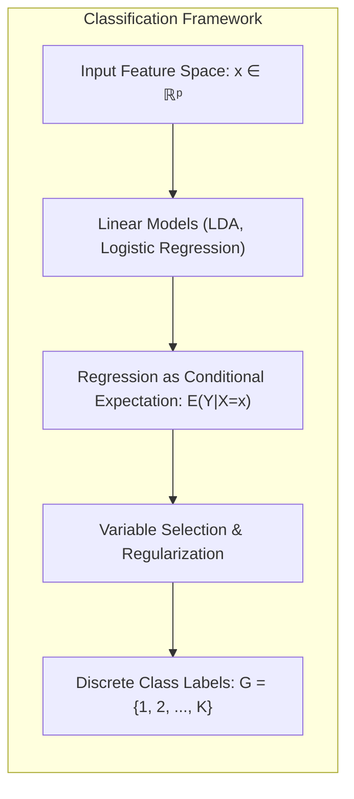
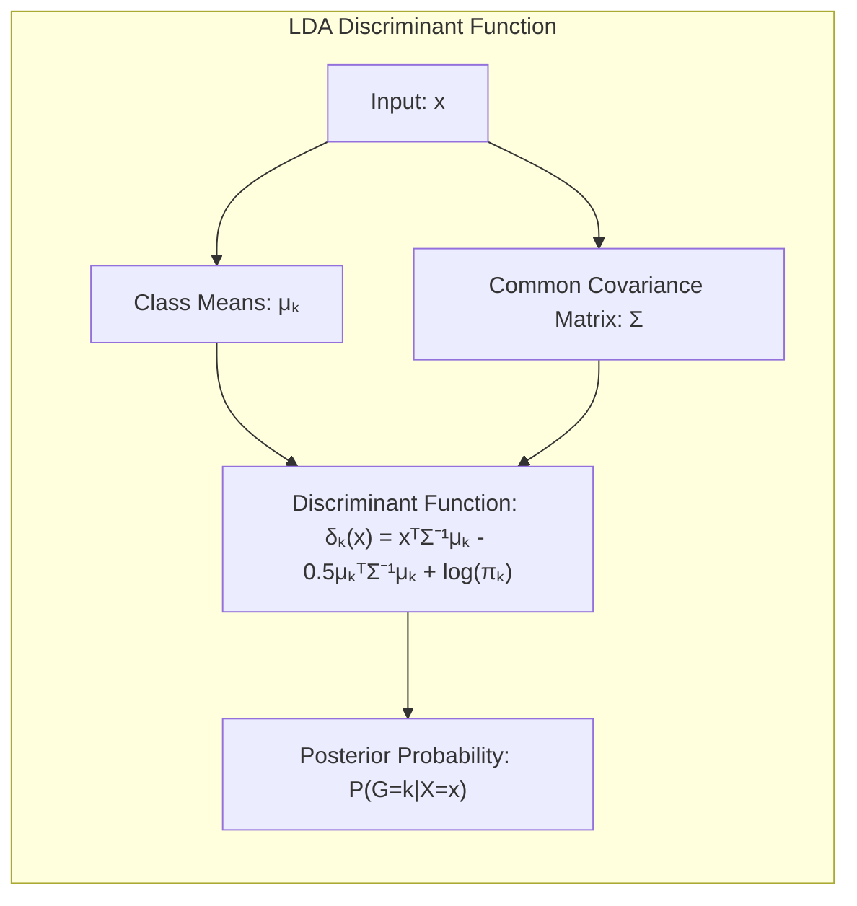
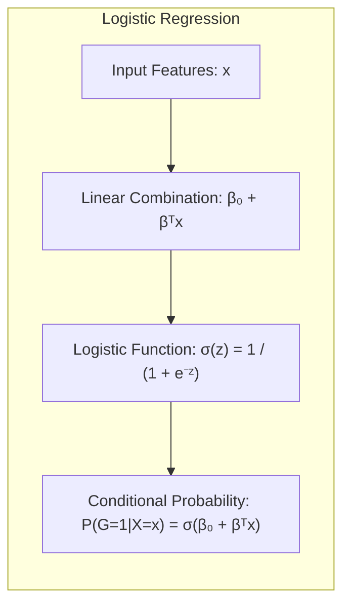
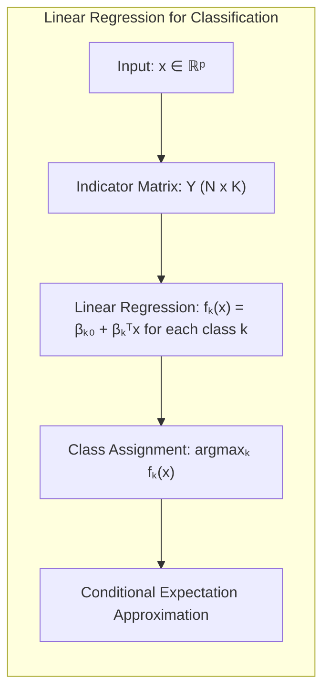
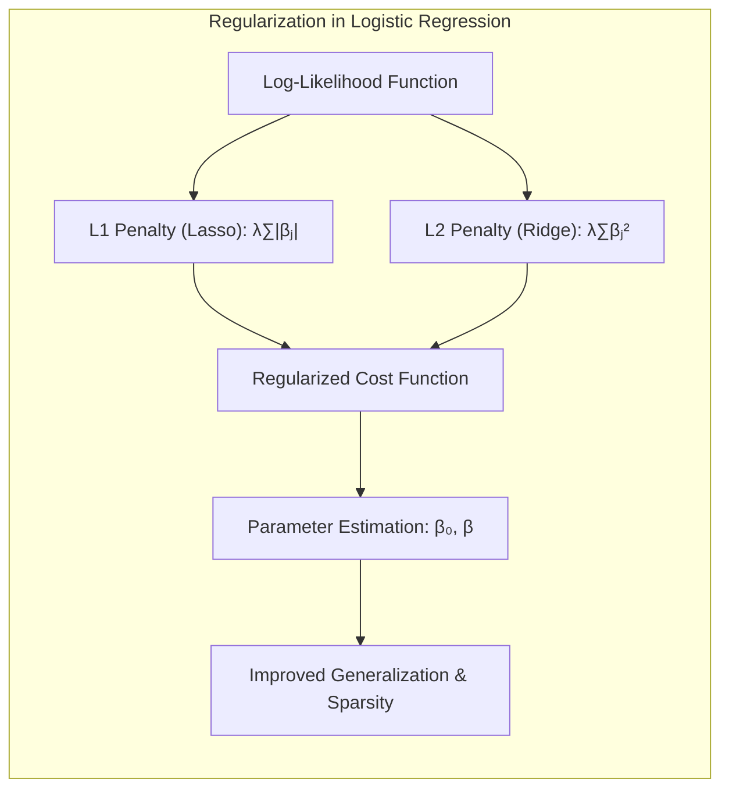
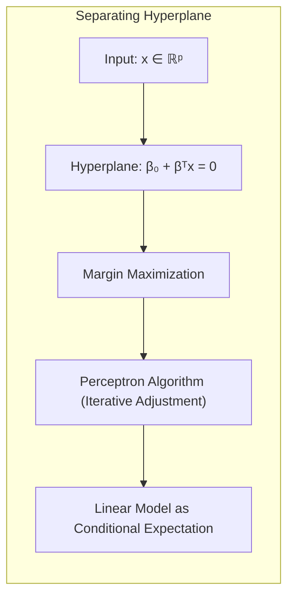
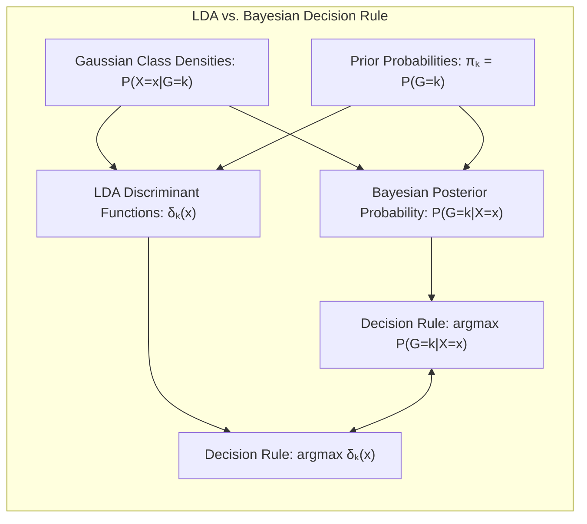

## Título Conciso: Classificação Linear, Seleção de Variáveis e Regularização



### Introdução

Este capítulo explora a fundo a aplicação de modelos lineares para classificação, enfatizando uma perspectiva estatística que interpreta a **regressão linear** como uma estimativa da **expectativa condicional**. Métodos lineares, tais como **Linear Discriminant Analysis (LDA)** e **Logistic Regression**, serão analisados no contexto da regressão, com foco em como a regressão linear se encaixa na estrutura de classificação, particularmente através da regressão em matrizes de indicadores [^4.2]. Além disso, abordaremos técnicas de **seleção de variáveis e regularização**, que desempenham um papel essencial na construção de modelos mais robustos e interpretáveis [^4.4.4], [^4.5]. A discussão sobre a relação entre **hiperplanos separadores** e métodos de regressão também será um ponto central [^4.5.2]. A intenção deste capítulo é fornecer uma visão abrangente e aprofundada de como a regressão linear, como uma ferramenta de modelagem estatística, pode ser utilizada e interpretada no contexto de classificação.

### Conceitos Fundamentais

**Conceito 1: Classificação e a Estimativa da Expectativa Condicional**

O problema de classificação consiste em atribuir um rótulo de classe $G$ a uma entrada $x \in \mathbb{R}^p$, onde $G$ pertence a um conjunto discreto de classes $G = \{1, 2, \ldots, K\}$ [^4.1]. Em uma perspectiva estatística, a regressão linear pode ser vista como uma forma de estimar a expectativa condicional da variável resposta, $E(Y|X=x)$. No contexto da classificação, esta perspectiva implica que a regressão busca modelar a probabilidade de uma observação pertencer a uma determinada classe, que é uma forma de expectativa condicional [^4.2]. A função linear $f(x) = \beta_0 + \beta^T x$ serve como uma aproximação para esta expectativa, e a regra de decisão é baseada na classe que apresentar a maior expectativa condicional.

> 💡 **Exemplo Numérico:**
>
> Considere um problema de classificação binária onde queremos prever se um cliente irá comprar um produto (classe 1) ou não (classe 0) com base em seu histórico de compras (feature $x$). Suponha que após aplicar regressão linear em uma matriz de indicadores (onde a classe 1 é representada por 1 e a classe 0 por 0), obtivemos a função: $f(x) = 0.2 + 0.8x$. Se um novo cliente tem um histórico de compras $x=0.7$, então $f(0.7) = 0.2 + 0.8 * 0.7 = 0.76$. Como este valor é mais próximo de 1 do que de 0, o modelo preveria que o cliente tem uma probabilidade maior de comprar o produto. Este valor, 0.76, pode ser interpretado como uma estimativa da expectativa condicional de compra dado o histórico do cliente.

**Lemma 1:** *Em um problema de classificação, a função de regressão linear aplicada a uma matriz de indicadores pode ser interpretada como uma estimativa da expectativa condicional da variável indicadora de classe.* Essa interpretação é fundamental para entender como a regressão linear se conecta com a classificação. A prova é obtida mostrando que o valor esperado da variável indicadora corresponde à probabilidade condicional da classe.

**Conceito 2: Linear Discriminant Analysis (LDA) e Expectativas Condicionais**

No **LDA**, as funções discriminantes lineares, $\delta_k(x)$, são derivadas da suposição de que cada classe segue uma distribuição Gaussiana multivariada com a mesma matriz de covariância $\Sigma$ [^4.3]. As funções discriminantes podem ser interpretadas como uma forma de modelar as probabilidades posteriores $P(G=k|X=x)$. Embora o LDA seja construído através da maximização da verossimilhança conjunta sob a suposição Gaussiana, ele também pode ser visto como uma forma de estimar a expectativa condicional da classe em termos de suas projeções lineares no espaço de atributos [^4.3].



> 💡 **Exemplo Numérico:**
>
> Suponha que temos duas classes, A e B, com médias $\mu_A = [1, 1]$ e $\mu_B = [2, 2]$, respectivamente, e uma matriz de covariância comum $\Sigma = [[0.5, 0], [0, 0.5]]$. O LDA calcula as funções discriminantes, que podem ser expressas como:
>
> $\delta_A(x) = x^T \Sigma^{-1} \mu_A - \frac{1}{2} \mu_A^T \Sigma^{-1} \mu_A + \log(\pi_A)$
> $\delta_B(x) = x^T \Sigma^{-1} \mu_B - \frac{1}{2} \mu_B^T \Sigma^{-1} \mu_B + \log(\pi_B)$
>
> onde $\pi_A$ e $\pi_B$ são as probabilidades a priori das classes. Se $\pi_A = \pi_B = 0.5$, e dado um novo ponto $x = [1.5, 1.5]$, podemos calcular:
>
> $\Sigma^{-1} = [[2, 0], [0, 2]]$
>
> $\delta_A(x) = [1.5, 1.5] \cdot [[2, 0], [0, 2]] \cdot [1, 1] - \frac{1}{2} [1, 1] \cdot [[2, 0], [0, 2]] \cdot [1, 1] = 6 - 2 = 4$
>
> $\delta_B(x) = [1.5, 1.5] \cdot [[2, 0], [0, 2]] \cdot [2, 2] - \frac{1}{2} [2, 2] \cdot [[2, 0], [0, 2]] \cdot [2, 2] = 12 - 8 = 4$
>
> Como $\delta_A(x) = \delta_B(x)$, o LDA classificaria o ponto $x$ como estando no limiar entre as classes (neste caso, a decisão seria mais complexa, pois o ponto está exatamente na fronteira). A função discriminante do LDA pode ser vista como uma estimativa da expectativa condicional da classe, sob a suposição gaussiana.

**Corolário 1:** *A função discriminante do LDA pode ser relacionada com a estimativa da expectativa condicional das classes sob a suposição gaussiana.* Isso deriva do fato de que a função discriminante maximiza a probabilidade posterior, e sob certas condições, pode ser interpretada como uma estimativa da expectativa condicional da classe.

**Conceito 3: Regressão Logística e a Modelagem da Probabilidade Condicional**

A **Logistic Regression** modela a probabilidade condicional de uma observação pertencer a uma classe através da função logística [^4.4]. Para o caso de duas classes, a probabilidade $P(G=1|X=x)$ é modelada como:

$$
P(G=1|X=x) = \frac{e^{\beta_0 + \beta^T x}}{1 + e^{\beta_0 + \beta^T x}}
$$

Neste caso, o log-odds (logit) é uma função linear de $x$. A Regressão Logística estima os parâmetros $\beta_0$ e $\beta$ por maximização da verossimilhança. Ao contrário do LDA, a Regressão Logística modela diretamente a probabilidade condicional da classe, em vez de derivá-la de distribuições gaussianas [^4.4.1]. O método busca diretamente estimar a expectativa condicional da variável resposta, codificada de forma binária.



> 💡 **Exemplo Numérico:**
>
> Suponha que temos um modelo de regressão logística com $\beta_0 = -2$ e $\beta = [1, 0.5]$ para duas features $x_1$ e $x_2$. Para um novo ponto $x = [2, 1]$, a probabilidade de pertencer à classe 1 seria:
>
> $P(G=1|X=x) = \frac{e^{-2 + (1*2) + (0.5*1)}}{1 + e^{-2 + (1*2) + (0.5*1)}} = \frac{e^{0.5}}{1 + e^{0.5}} \approx \frac{1.648}{1 + 1.648} \approx 0.622$
>
> Isso significa que, de acordo com o modelo de regressão logística, o ponto $x=[2, 1]$ tem aproximadamente 62.2% de probabilidade de pertencer à classe 1. A regressão logística modela diretamente essa probabilidade condicional, que também é uma forma de estimar a expectativa condicional da variável de classe.

> ⚠️ **Nota Importante**: Enquanto o LDA faz suposições sobre a distribuição das classes, a regressão logística modela diretamente a probabilidade condicional, o que a torna uma abordagem mais flexível [^4.4.1], [^4.4.2].

> ❗ **Ponto de Atenção**: Em problemas com classes desbalanceadas, métodos de reponderação ou sobreamostragem podem ser necessários para que a regressão logística forneça estimativas imparciais da probabilidade condicional [^4.4.2].

> ✔️ **Destaque**: A regressão logística, ao modelar a probabilidade condicional, também pode ser interpretada como uma estimativa da expectativa condicional da classe sob uma transformação da variável resposta.

### Regressão Linear e Mínimos Quadrados para Classificação



Na aplicação da **regressão linear para classificação**, cada classe $k$ é representada por um vetor indicador $Y_k$, onde $Y_{ik} = 1$ se a observação $i$ pertence à classe $k$, e $Y_{ik} = 0$ caso contrário [^4.2]. Assim, para $K$ classes, teremos uma matriz de respostas $Y$ com dimensão $N \times K$. A regressão linear é aplicada a cada coluna de $Y$, resultando em uma função de regressão para cada classe: $f_k(x) = \beta_{k0} + \beta_k^T x$. A classificação é então feita atribuindo $x$ à classe $k$ que maximiza $f_k(x)$, que, sob a perspectiva estatística, é a classe que maximiza a estimativa da expectativa condicional da variável indicadora.

> 💡 **Exemplo Numérico:**
>
> Suponha que temos 3 classes e 2 features. A matriz de indicadores $Y$ para 5 amostras poderia ser:
>
> ```
> Y = [[1, 0, 0],  # Classe 1
>      [0, 1, 0],  # Classe 2
>      [0, 0, 1],  # Classe 3
>      [1, 0, 0],  # Classe 1
>      [0, 1, 0]]  # Classe 2
> ```
>
> A matriz de features $X$ poderia ser:
> ```
> X = [[1, 2],
>      [2, 3],
>      [3, 1],
>      [1.5, 2.5],
>      [2.5, 3.5]]
> ```
>
> Aplicamos regressão linear para cada coluna de $Y$. Suponha que os coeficientes estimados para cada classe sejam:
>
> $\beta_1 = [0.1, 0.2, 0.3]$ (classe 1)
> $\beta_2 = [0.2, 0.3, 0.1]$ (classe 2)
> $\beta_3 = [0.3, 0.1, 0.2]$ (classe 3)
>
> Para um novo ponto $x = [2, 2]$, calculamos:
>
> $f_1(x) = 0.1 + 0.2 * 2 + 0.3 * 2 = 1.1$
> $f_2(x) = 0.2 + 0.3 * 2 + 0.1 * 2 = 1.0$
> $f_3(x) = 0.3 + 0.1 * 2 + 0.2 * 2 = 0.9$
>
>  O ponto $x$ seria classificado na classe 1, pois $f_1(x)$ é o maior valor. Esta função linear é usada como uma aproximação da expectativa condicional da classe.

Apesar de sua simplicidade, essa abordagem apresenta algumas limitações. As estimativas $f_k(x)$ podem não estar entre 0 e 1, dificultando a interpretação como probabilidades. Além disso, o método pode não ser eficaz em cenários com classes sobrepostas ou distribuições complexas, já que o método busca uma aproximação linear da expectativa condicional [^4.2]. O problema do "masking" também surge, onde a regressão linear não consegue capturar adequadamente a estrutura dos dados [^4.2].

A regressão de indicadores, vista como um método para estimar a expectativa condicional, pode ser útil quando o objetivo principal é uma fronteira de decisão linear e a interpretação probabilística não é essencial [^4.2]. Além disso, sob certas condições, a regressão de indicadores e o LDA podem apresentar soluções equivalentes [^4.3].

**Lemma 2:** *Quando se codifica as classes com valores 1 e -1 em um problema de classificação binária, a direção dos coeficientes da regressão linear é proporcional à direção do discriminante do LDA. Essa proporcionalidade é uma manifestação da relação entre a regressão linear como estimativa da expectativa condicional e a derivação da fronteira de decisão do LDA.*  Este lema demonstra uma conexão teórica entre regressão linear e métodos discriminantes [^4.2].

**Corolário 2:** *A regra de decisão da regressão linear de indicadores coincide com a regra de decisão do LDA quando os dados são distribuídos de forma Gaussiana e as classes possuem a mesma probabilidade a priori e covariância esférica.* Esta condição ilustra um caso específico onde os métodos se equivalem, reforçando a visão da regressão linear como uma forma de estimar a expectativa condicional das classes [^4.3].

É importante observar que a regressão logística, por sua vez, modela diretamente a probabilidade condicional, enquanto a regressão de indicadores aproxima a expectativa condicional por meio de uma função linear. A regressão logística pode ser vista como uma estimativa mais direta da probabilidade condicional, enquanto a regressão linear em indicadores pode ser interpretada como uma aproximação da expectativa condicional das variáveis indicadoras.

### Métodos de Seleção de Variáveis e Regularização em Classificação



**Seleção de variáveis** e **regularização** são técnicas que visam melhorar a capacidade de generalização dos modelos de classificação, reduzindo a complexidade e o risco de overfitting [^4.5].  A **regularização** adiciona termos de penalidade à função de custo, restringindo os valores dos coeficientes do modelo e, consequentemente, a complexidade do modelo.

Na **regressão logística**, a função de verossimilhança é modificada com a adição de um termo de penalidade:

$$
\max_{\beta_0, \beta} \left[ \sum_{i=1}^N \left( y_i (\beta_0 + \beta^T x_i) - \log(1 + e^{\beta_0 + \beta^T x_i}) \right) - \lambda P(\beta) \right]
$$

Onde $P(\beta)$ é a penalidade e $\lambda$ é o parâmetro de regularização. A penalidade **L1 (Lasso)**, dada por $P(\beta) = \sum_{j=1}^p |\beta_j|$, promove esparsidade, selecionando variáveis relevantes e "zerando" os coeficientes de variáveis menos importantes [^4.4.4]. A penalidade **L2 (Ridge)**, dada por $P(\beta) = \sum_{j=1}^p \beta_j^2$, reduz a magnitude dos coeficientes e estabiliza o modelo, reduzindo a variância [^4.5]. Essas penalidades podem ser vistas como um viés que melhora a qualidade da estimativa da expectativa condicional, controlando o overfitting do modelo.

> 💡 **Exemplo Numérico:**
>
> Suponha que temos um modelo de regressão logística com duas features, $x_1$ e $x_2$, e que, sem regularização, os coeficientes estimados sejam $\beta_0 = -1$, $\beta_1 = 3$ e $\beta_2 = -2$.
>
> **Regularização L1 (Lasso):** Se aplicarmos a regularização L1 com $\lambda = 0.5$, a função de custo se torna:
>
> $\text{Custo} =  -\sum_{i=1}^N \left( y_i (\beta_0 + \beta^T x_i) - \log(1 + e^{\beta_0 + \beta^T x_i}) \right) + 0.5(|\beta_1| + |\beta_2|)$
>
>  A otimização desta função de custo com regularização L1 pode levar a um novo conjunto de coeficientes, por exemplo, $\beta_0 = -0.8$, $\beta_1 = 2.0$ e $\beta_2 = 0$. Observe que $\beta_2$ foi zerado, indicando que a feature $x_2$ foi considerada menos relevante pelo modelo. Isso promove a esparsidade e simplifica o modelo.
>
> **Regularização L2 (Ridge):** Se aplicarmos a regularização L2 com $\lambda = 0.5$, a função de custo se torna:
>
> $\text{Custo} =  -\sum_{i=1}^N \left( y_i (\beta_0 + \beta^T x_i) - \log(1 + e^{\beta_0 + \beta^T x_i}) \right) + 0.5(\beta_1^2 + \beta_2^2)$
>
> A otimização com regularização L2 pode levar a coeficientes como $\beta_0 = -0.9$, $\beta_1 = 2.5$ e $\beta_2 = -1.5$. Observe que os coeficientes são reduzidos em magnitude em relação ao modelo sem regularização, mas ambos permanecem diferentes de zero. Isso ajuda a reduzir a variância do modelo e aumentar sua estabilidade.
>
> A regularização, seja L1 ou L2, impacta a estimativa da expectativa condicional ao modificar a função de custo e, consequentemente, os coeficientes do modelo.

**Lemma 3:** *A regularização L1 na regressão logística promove a esparsidade dos coeficientes, zerando muitos deles, o que pode ser visto como uma maneira de simplificar a estimativa da expectativa condicional, reduzindo o número de variáveis envolvidas no modelo.* Essa propriedade é uma consequência direta da derivada da penalidade L1 [^4.4.4].

**Prova do Lemma 3:** A penalidade L1 adiciona um termo que é proporcional ao valor absoluto dos coeficientes. A otimização da função de custo com a penalidade L1 faz com que coeficientes menos relevantes tornem-se exatamente zero, simplificando o modelo final [^4.4.3]. $\blacksquare$

**Corolário 3:** *Modelos esparsos, gerados pela regularização L1, levam a uma melhor interpretabilidade e generalização, pois a estimativa da expectativa condicional é baseada em um conjunto menor de variáveis.* Isso ocorre porque apenas as variáveis mais importantes são mantidas no modelo [^4.4.5].

> ⚠️ **Ponto Crucial**: A regularização L1 e L2, ao penalizarem os coeficientes, afetam a estimativa da expectativa condicional, controlando a complexidade do modelo e prevenindo o overfitting [^4.5].

### Separating Hyperplanes e Perceptrons



A ideia de **hiperplanos separadores** surge da busca por uma fronteira linear que maximize a separação entre classes, ou seja, que separe as classes da melhor forma possível e que também seja robusta em relação a pequenas perturbações [^4.5.2]. O hiperplano é definido pela equação $\beta_0 + \beta^T x = 0$, e o objetivo é encontrar os parâmetros $\beta_0$ e $\beta$ que maximizem a margem, que é a distância entre o hiperplano e as amostras mais próximas de cada classe.

O algoritmo do **Perceptron** é um método iterativo para encontrar um hiperplano separador [^4.5.1]. A cada iteração, o algoritmo ajusta os parâmetros do hiperplano com base nas classificações incorretas, buscando uma solução que minimize a distância entre as amostras e a fronteira de decisão. Se os dados forem linearmente separáveis, o algoritmo converge para uma solução em um número finito de passos, que corresponde a um modelo linear que estima uma forma de expectativa condicional.

> 💡 **Exemplo Numérico:**
>
> Suponha que temos duas classes representadas por pontos no plano 2D. Classe 1: $(1,1), (2,1), (2,2)$ e Classe 2: $(3,3), (4,3), (4,4)$. Inicializamos o hiperplano com $\beta = [0.5, 0.5]$ e $\beta_0 = -2$.
>
> 1. **Iteração 1:**
>    - Ponto (1,1): $0.5*1 + 0.5*1 - 2 = -1$ (classificado incorretamente, pois está na classe 1, mas o resultado é negativo)
>    - Atualizamos $\beta = \beta + \alpha * x = [0.5, 0.5] + 0.1 * [1, 1] = [0.6, 0.6]$ e $\beta_0 = \beta_0 + \alpha = -2 + 0.1 = -1.9$.
>    - O hiperplano agora é definido por $0.6x_1 + 0.6x_2 - 1.9 = 0$.
>
> 2. **Iteração 2:**
>    - Repetimos o processo para todos os pontos, ajustando o hiperplano a cada classificação incorreta, até que todos os pontos sejam classificados corretamente.
>
> O algoritmo do Perceptron itera sobre os pontos, ajustando os parâmetros até encontrar um hiperplano que separa linearmente os dados. Este hiperplano é um modelo linear que estima a expectativa condicional da classe.

**Teorema:** *Se o conjunto de dados de treinamento é linearmente separável, o algoritmo do Perceptron converge para um hiperplano separador em um número finito de passos.* A prova formal deste resultado garante que, sob condições ideais, o algoritmo seja capaz de encontrar um modelo linear adequado [^4.5.1].

### Pergunta Teórica Avançada: Quais as diferenças fundamentais entre a formulação de LDA e a Regra de Decisão Bayesiana considerando distribuições Gaussianas com covariâncias iguais?

**Resposta:**

A **Regra de Decisão Bayesiana** busca classificar uma observação $x$ na classe $k$ que maximiza a probabilidade posterior $P(G=k|X=x)$ [^4.3]. Quando as classes seguem distribuições Gaussianas com a mesma matriz de covariância $\Sigma$, podemos usar o Teorema de Bayes para derivar as probabilidades posteriores:

$$
P(G=k|X=x) = \frac{P(X=x|G=k)P(G=k)}{P(X=x)}
$$

Onde $P(X=x|G=k)$ é a densidade gaussiana da classe $k$, e $P(G=k)=\pi_k$ é a probabilidade a priori da classe. A decisão é tomada atribuindo $x$ à classe que maximiza essa probabilidade. O LDA, por outro lado, deriva suas funções discriminantes lineares através de uma análise direta das densidades gaussianas e da suposição de covariâncias iguais, buscando maximizar a separação entre as classes no espaço de características [^4.3]. Embora ambos os métodos compartilhem a mesma suposição de normalidade, a forma como a decisão de classificação é implementada é distinta.



**Lemma 4:** *Sob a suposição de distribuições Gaussianas com a mesma matriz de covariância, a regra de decisão Bayesiana e o LDA são equivalentes, resultando na mesma fronteira de decisão linear. A equivalência é demonstrada mostrando que a maximização da probabilidade posterior na regra Bayesiana leva à mesma forma funcional da função discriminante do LDA. Ambas as abordagens são, neste caso, formas de estimar a expectativa condicional das classes, com resultados equivalentes.* [^4.3]

**Corolário 4:** *A violação da suposição de igualdade de covariância no LDA leva à abordagem QDA (Quadratic Discriminant Analysis), que relaxa essa restrição e leva a fronteiras de decisão quadráticas. O QDA pode ser interpretado como uma estimativa da expectativa condicional mais flexível, já que permite que a forma da função de decisão seja mais complexa.* [^4.3.1], [^4.3.3]

> ⚠️ **Ponto Crucial**: A diferença fundamental reside na abordagem. A regra de decisão Bayesiana tenta otimizar diretamente a probabilidade posterior, enquanto o LDA deriva sua regra de uma modelagem das densidades gaussianas, com uma restrição adicional sobre as matrizes de covariância [^4.3].

### Conclusão

Neste capítulo, exploramos a fundo a visão estatística que interpreta a regressão linear como uma estimativa da expectativa condicional. Vimos como essa perspectiva se conecta com métodos de classificação linear como LDA e regressão logística e a aplicação da regressão em matrizes de indicadores. Abordamos também a importância da seleção de variáveis e da regularização, que são cruciais para construir modelos robustos que generalizam bem para novos dados. A discussão sobre hiperplanos separadores e o algoritmo do Perceptron também reforçou a importância das fronteiras de decisão lineares. A análise da relação entre LDA e a regra de decisão Bayesiana sob distribuições Gaussianas com covariâncias iguais também forneceu um entendimento mais profundo sobre as nuances teóricas desses métodos. Através deste capítulo, buscamos oferecer uma base sólida para a aplicação e interpretação de modelos lineares em problemas de classificação.

### Footnotes

[^4.1]: *In this chapter we revisit the classification problem and focus on linear methods for classification...There are several different ways in which linear decision boundaries can be found.* *(Trecho de Linear Methods for Classification)*

[^4.2]: *In Chapter 2 we fit linear regression models to the class indicator variables, and classify to the largest fit...Linear inequalities in this space are quadratic inequalities in the original space.* *(Trecho de Linear Methods for Classification)*

[^4.3]: *Decision theory for classification (Section 2.4) tells us that we need to know the class posteriors Pr(G|X) for optimal classification. Suppose fk(x) is the class-conditional density of X in class G = k, and let πκ be the prior probability of class k... Linear discriminant analysis (LDA) arises in the special case when we assume that the classes have a common covariance matrix Σk = Σ.* *(Trecho de Linear Methods for Classification)*

[^4.3.1]: *The decision boundary between each pair of classes k and l is described by a quadratic equation {x: δκ(x) = δ(x)}.* *(Trecho de Linear Methods for Classification)*

[^4.3.3]: *In the special case when we assume that the classes have a common covariance matrix...When the classes are really Gaussian, then LDA is optimal* *(Trecho de Linear Methods for Classification)*

[^4.4]: *The logistic regression model arises from the desire to model the posterior probabilities of the K classes via linear functions in x, while at the same time ensuring that they sum to one and remain in [0,1].* *(Trecho de Linear Methods for Classification)*

[^4.4.1]: *Logistic regression models are usually fit by maximum likelihood... The logistic regression model is more general, in that it makes less assumptions.* *(Trecho de Linear Methods for Classification)*

[^4.4.2]: *It is convenient to code the two-class gi via a 0/1 response Yi, where yi = 1 when gi = 1, and yi = 0 when gi = 2... Typically many models are fit in a search for a parsimonious model involving a subset of the variables.* *(Trecho de Linear Methods for Classification)*

[^4.4.3]: *To maximize the log-likelihood, we set its derivatives to zero. These score equations are...To solve the score equations (4.21), we use the Newton-Raphson algorithm...* *(Trecho de Linear Methods for Classification)*

[^4.4.4]: *The L1 penalty used in the lasso (Section 3.4.2) can be used for variable selection and shrinkage with any linear regression model...As with the lasso, we typically do not penalize the intercept term.* *(Trecho de Linear Methods for Classification)*

[^4.5]: *Here we present an analysis of binary data to illustrate the traditional statistical use of the logistic regression model... With two classes there is a simple correspondence between linear discriminant analysis and classification by linear least squares, as in (4.5).* *(Trecho de Linear Methods for Classification)*

[^4.5.1]: *The perceptron learning algorithm tries to find a separating hyperplane by minimizing the distance of misclassified points to the decision boundary.* *(Trecho de Linear Methods for Classification)*

[^4.5.2]: *The optimal separating hyperplane separates the two classes and maximizes the distance to the closest point from either class... In light of (4.40), the constraints define an empty slab or margin around the linear decision boundary...* *(Trecho de Linear Methods for Classification)*
