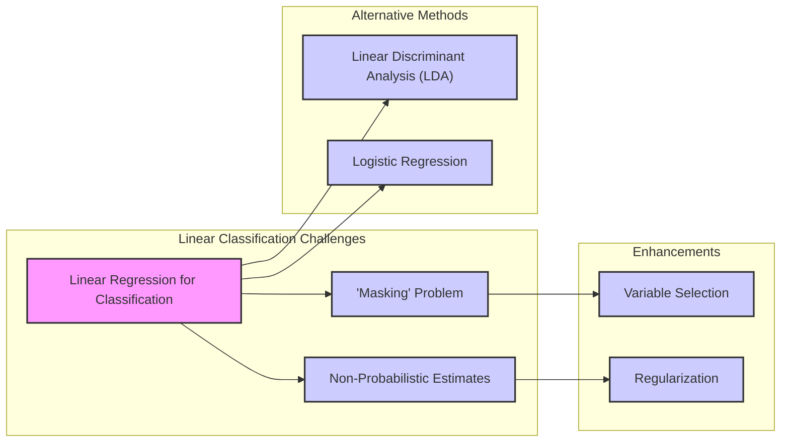
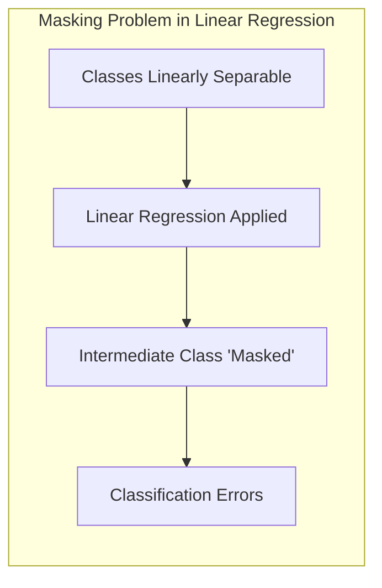
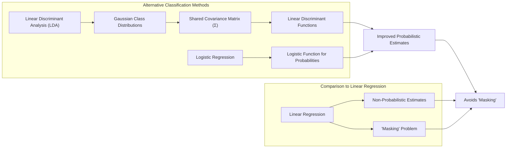
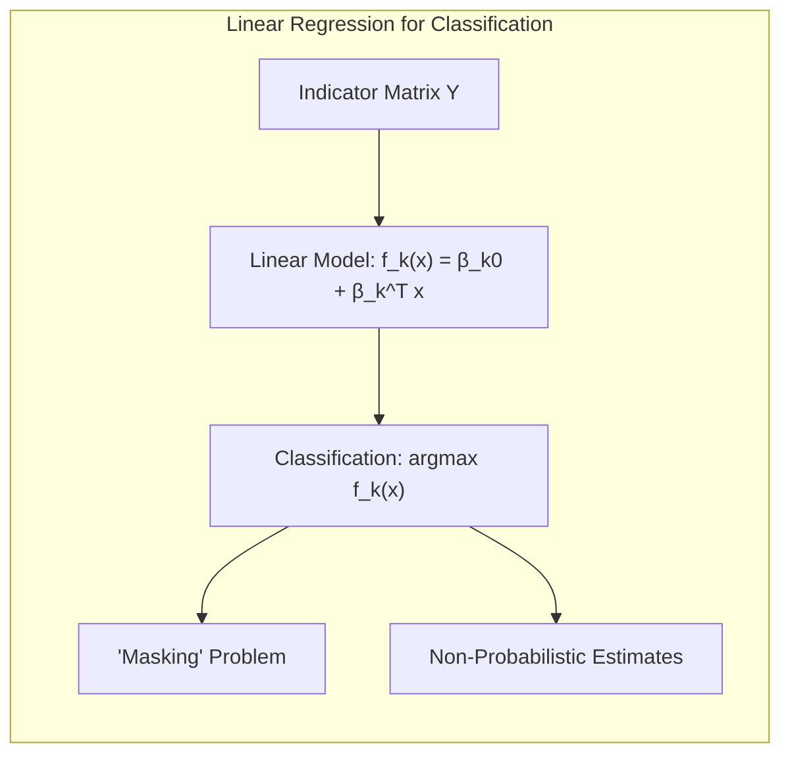
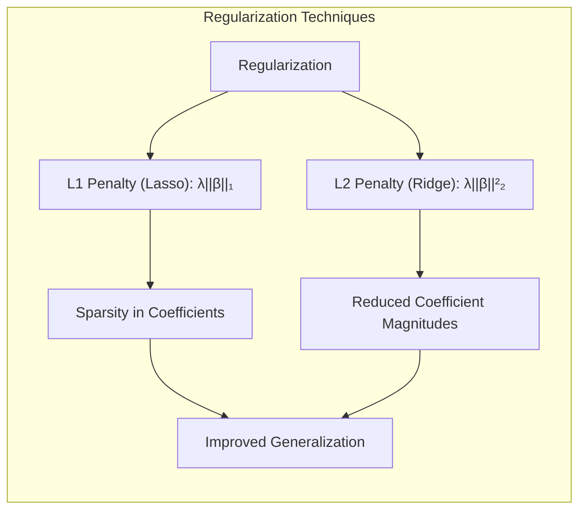
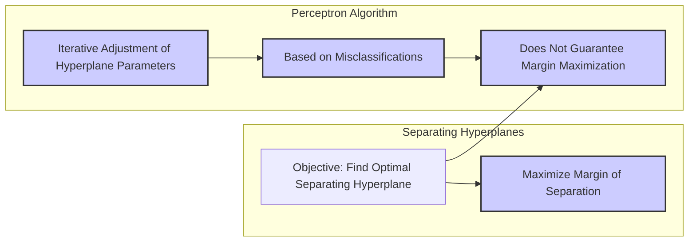
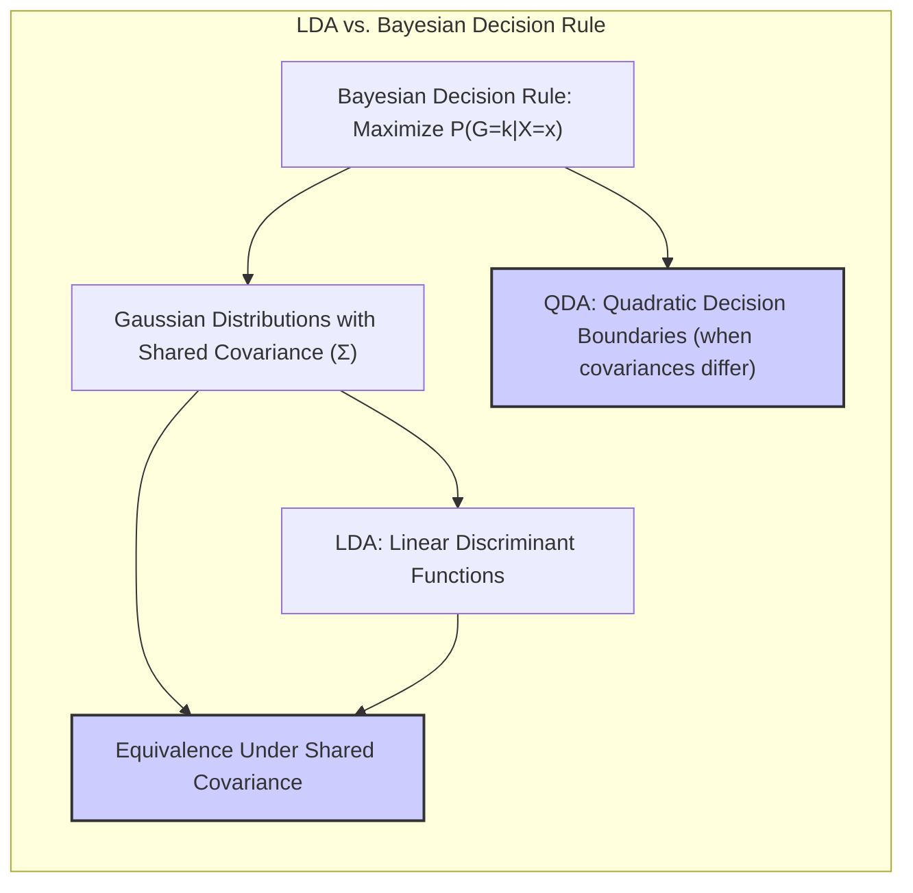

## Título Conciso: Classificação Linear, Seleção de Variáveis e Regularização



### Introdução

A aplicação de métodos lineares para classificação, embora eficaz em muitos contextos, apresenta limitações que precisam ser consideradas. Neste capítulo, exploraremos em detalhes as desvantagens associadas à regressão linear de indicadores, particularmente o problema do **"masking" de classes** quando o número de classes ($K$) é elevado [^4.2]. Além disso, analisaremos como as estimativas obtidas por regressão linear não são inerentemente restringidas ao intervalo $[0,1]$, o que dificulta sua interpretação como probabilidades [^4.2]. Compararemos essas limitações com as abordagens de **Linear Discriminant Analysis (LDA)** e **Logistic Regression**, que modelam as probabilidades das classes de forma mais direta [^4.3], [^4.4]. Discutiremos também o papel da **seleção de variáveis e regularização** para mitigar problemas de *overfitting* e melhorar a robustez dos modelos [^4.4.4], [^4.5]. A intenção deste capítulo é fornecer uma análise aprofundada das limitações da regressão linear para classificação, destacando a importância de escolher o método mais adequado para cada problema.

### Conceitos Fundamentais

**Conceito 1: Limitações da Regressão Linear em Classificação Multiclasse**

A regressão linear aplicada à matriz de indicadores busca ajustar uma função linear $f_k(x) = \beta_{k0} + \beta_k^T x$ para cada classe $k$, e a classificação é feita atribuindo $x$ à classe que maximiza $f_k(x)$ [^4.2]. Embora simples, essa abordagem apresenta limitações significativas, especialmente em problemas multiclasse. Uma dessas limitações é que os valores de $f_k(x)$ não são probabilidades, ou seja, podem assumir valores negativos ou maiores que 1, o que dificulta a interpretação [^4.2]. Além disso, a regressão linear pode sofrer do "masking problem", onde uma classe intermediária pode ser completamente ignorada na decisão final.

> 💡 **Exemplo Numérico:**
>
> Suponha que temos três classes (K=3) e um único preditor (x). Após ajustar três modelos de regressão linear, um para cada classe, obtemos as seguintes funções:
>
> $f_1(x) = -0.5 + 0.2x$
> $f_2(x) = 0.1 + 0.1x$
> $f_3(x) = 0.6 + 0.3x$
>
> Para um novo ponto $x=2$, temos:
>
> $f_1(2) = -0.5 + 0.2 * 2 = -0.1$
> $f_2(2) = 0.1 + 0.1 * 2 = 0.3$
> $f_3(2) = 0.6 + 0.3 * 2 = 1.2$
>
> A regressão linear classificaria $x=2$ como pertencente à classe 3, pois $f_3(2)$ é o maior. Note que $f_1(2)$ é negativo e $f_3(2)$ é maior que 1, o que não faz sentido em termos de probabilidade. Além disso, dependendo da distribuição dos dados, a classe 2 pode ser "mascarada" por ter valores de função sempre menores que as outras classes.

**Lemma 1:** *As estimativas obtidas por regressão linear, ao contrário das probabilidades, não são naturalmente restringidas ao intervalo [0,1].* Este lema destaca uma limitação da regressão linear como classificador, que pode resultar em valores fora do intervalo esperado para probabilidades.

**Conceito 2: O Problema do "Masking" em Regressão Linear**



O **"masking problem"** ocorre quando a regressão linear não consegue capturar adequadamente a relação entre as classes, especialmente em situações onde o número de classes $K$ é grande e as classes intermediárias ficam "mascaradas" pelas classes extremas. Em outras palavras, em certos cenários, o modelo de regressão linear pode atribuir a observações de uma classe intermediária um valor preditivo menor que de outras classes, levando a classificações incorretas [^4.2]. Isso é particularmente problemático em problemas onde as classes são linearmente separáveis, mas a regressão linear não consegue modelar a relação adequadamente.

> 💡 **Exemplo Numérico:**
>
> Considere um problema de classificação com 3 classes, onde os dados podem ser representados em um espaço 2D. As classes estão dispostas de forma que a classe 2 está "entre" as classes 1 e 3. Ao aplicar regressão linear, as funções ajustadas para as classes 1 e 3 podem ter inclinações que fazem com que, para muitos pontos, a função da classe 2 sempre tenha valores menores que as outras duas, mesmo se o ponto pertencer à classe 2. Isso faz com que a classe 2 seja "mascarada" e nunca seja selecionada.

**Corolário 1:** *Em problemas com múltiplas classes, a regressão linear pode apresentar o problema de "masking", onde classes intermediárias podem ser completamente ignoradas durante o processo de classificação, levando a erros sistemáticos.* Este corolário destaca a natureza problemática da regressão linear em cenários multiclasse específicos.

**Conceito 3: LDA e Regressão Logística como Alternativas à Regressão Linear**



O **LDA** e a **Regressão Logística** oferecem abordagens alternativas à regressão linear em problemas de classificação. O LDA modela as distribuições condicionais das classes como Gaussianas multivariadas, com a mesma matriz de covariância $\Sigma$, o que leva a funções discriminantes lineares baseadas na maximização da probabilidade posterior [^4.3]. A Regressão Logística, por sua vez, modela diretamente a probabilidade de uma observação pertencer a uma classe, utilizando uma função logística [^4.4]. Ambos os métodos geram fronteiras de decisão lineares, mas fornecem estimativas de probabilidade mais bem calibradas do que a regressão linear e evitam o "masking" de classes [^4.3], [^4.4].

> ⚠️ **Nota Importante**: LDA e Regressão Logística, ao contrário da regressão linear, tentam modelar diretamente as probabilidades ou as funções discriminantes das classes, o que resulta em estimativas mais adequadas para classificação [^4.3], [^4.4].

> ❗ **Ponto de Atenção**: A escolha do método de classificação (regressão linear, LDA ou regressão logística) depende da natureza dos dados e do problema em questão. Em problemas multiclasse com possíveis problemas de "masking", LDA e regressão logística podem ser melhores escolhas [^4.2].

> ✔️ **Destaque**: Uma das principais limitações da regressão linear é que as estimativas podem não estar no intervalo [0, 1], o que dificulta a interpretação como probabilidades e torna seu uso menos intuitivo [^4.2].

### Regressão Linear e Mínimos Quadrados para Classificação



A **regressão linear**, aplicada a uma **matriz de indicadores** para classificação, busca ajustar um modelo linear $f_k(x) = \beta_{k0} + \beta_k^T x$ a cada coluna da matriz $Y$, que codifica as classes [^4.2]. A decisão é então tomada classificando a observação $x$ na classe $k$ que maximiza a função ajustada $f_k(x)$. Uma das principais limitações dessa abordagem é o "masking problem", que ocorre quando uma classe intermediária não é adequadamente representada pela regressão linear.

Este problema surge porque a regressão linear ajusta uma função para cada classe independentemente, sem garantir que as estimativas resultantes se comportem como probabilidades. Como consequência, as estimativas $f_k(x)$ podem estar fora do intervalo $[0,1]$, e a relação entre as classes pode ser mascarada, especialmente quando $K$ é grande e as classes estão bem separadas mas não de forma linear [^4.2].

O "masking problem" torna a regressão linear menos confiável em problemas de classificação multiclasse, onde é crucial que todas as classes sejam adequadamente consideradas na decisão final. Em contraste, métodos como o LDA e a regressão logística modelam as probabilidades de classe de forma mais direta e são menos suscetíveis a esse problema, conforme detalhado em [^4.3] e [^4.4].

**Lemma 2:** *A regressão linear de indicadores, em problemas multiclasse, pode não produzir uma representação adequada da relação entre as classes, levando ao "masking problem", onde classes intermediárias podem ser ignoradas.* A prova é dada pela observação empírica em cenários específicos, onde uma classe intermediária apresenta funções lineares ajustadas com menores valores, sendo, portanto, sempre preterida na decisão de classe [^4.2].

**Corolário 2:** *Em problemas onde a classes são distribuídas de forma que classes intermediárias são mascaradas, o LDA e a regressão logística são opções mais adequadas pois buscam modelar a probabilidade das classes.* Isso destaca uma das limitações da regressão linear como classificador em certos contextos.

> 💡 **Exemplo Numérico:**
>
> Vamos usar um exemplo com 3 classes e 2 preditores para ilustrar o conceito de "masking". Suponha que temos os seguintes dados:
>
> Classe 1: $X_1 = [[1, 1], [1, 2], [2, 1]]$
> Classe 2: $X_2 = [[2, 2], [2, 3], [3, 2]]$
> Classe 3: $X_3 = [[3, 3], [3, 4], [4, 3]]$
>
> E as classes são representadas como:
>
> $Y = [[1, 0, 0], [1, 0, 0], [1, 0, 0], [0, 1, 0], [0, 1, 0], [0, 1, 0], [0, 0, 1], [0, 0, 1], [0, 0, 1]]$
>
> Aplicando regressão linear para cada classe:
>
> ```python
> import numpy as np
> from sklearn.linear_model import LinearRegression
>
> X = np.concatenate((X1, X2, X3))
> Y = np.array([[1, 0, 0], [1, 0, 0], [1, 0, 0], [0, 1, 0], [0, 1, 0], [0, 1, 0], [0, 0, 1], [0, 0, 1], [0, 0, 1]])
>
> models = []
> for k in range(3):
>    model = LinearRegression()
>    model.fit(X, Y[:, k])
>    models.append(model)
>
> # Para um novo ponto x = [2.5, 2.5]
> x_new = np.array([2.5, 2.5]).reshape(1, -1)
> f_values = [model.predict(x_new)[0] for model in models]
> print(f"Valores das funções para x_new: {f_values}")
> ```
>
> Os valores $f_k(x)$ obtidos podem mostrar que a classe intermediária (classe 2) tem valores consistentemente menores que as classes 1 e 3, resultando no problema de "masking". Este exemplo ilustra que as estimativas obtidas pela regressão linear não necessariamente refletem a probabilidade de pertinência a uma classe e podem levar a classificações incorretas.

A regressão linear de indicadores, embora possua a vantagem de ser simples de implementar e entender, tem limitações significativas em problemas de classificação multiclasse. A sua interpretação estatística, como uma forma de estimar expectativas condicionais, não é suficiente para mitigar problemas como o "masking", que levam à classificação incorreta de amostras.

### Métodos de Seleção de Variáveis e Regularização em Classificação



**Seleção de variáveis** e **regularização** são métodos cruciais para mitigar os problemas de *overfitting* e melhorar a generalização dos modelos de classificação. Estas técnicas podem ser aplicadas a modelos como a regressão logística, onde a função de custo é modificada com a adição de termos de penalidade.

Na **regressão logística**, a função de custo regularizada pode ser escrita como:

$$
\max_{\beta_0, \beta} \left[ \sum_{i=1}^N \left( y_i (\beta_0 + \beta^T x_i) - \log(1 + e^{\beta_0 + \beta^T x_i}) \right) - \lambda P(\beta) \right]
$$

onde $P(\beta)$ é o termo de penalidade e $\lambda$ é o parâmetro de regularização. A penalidade **L1** (Lasso) impõe a esparsidade nos coeficientes, selecionando as variáveis mais importantes e eliminando as menos relevantes, enquanto a penalidade **L2** (Ridge) reduz a magnitude de todos os coeficientes, estabilizando o modelo [^4.4.4].

> 💡 **Exemplo Numérico:**
>
> Suponha que temos um modelo de regressão logística com dois preditores, $x_1$ e $x_2$. Sem regularização, os coeficientes estimados são $\beta_1 = 2.5$ e $\beta_2 = -1.8$. Aplicando regularização L1 com $\lambda = 0.5$, poderíamos obter $\beta_1 = 1.2$ e $\beta_2 = 0$, indicando que o preditor $x_2$ foi eliminado. Aplicando regularização L2 com $\lambda = 0.5$, poderíamos obter $\beta_1 = 1.8$ e $\beta_2 = -1.2$, mostrando uma redução na magnitude dos coeficientes.
>
> ```python
> import numpy as np
> from sklearn.linear_model import LogisticRegression
> from sklearn.preprocessing import StandardScaler
> from sklearn.pipeline import Pipeline
>
> # Dados de exemplo
> X = np.array([[1, 2], [2, 3], [3, 1], [4, 3], [5, 2], [6, 1]])
> y = np.array([0, 0, 0, 1, 1, 1])
>
> # Regressão logística sem regularização
> model_no_reg = LogisticRegression(penalty=None)
> model_no_reg.fit(X, y)
> print(f"Coeficientes sem regularização: {model_no_reg.coef_}")
>
> # Regressão logística com regularização L1 (Lasso)
> model_l1 = LogisticRegression(penalty='l1', C=0.5, solver='liblinear') # C = 1/lambda
> model_l1.fit(X, y)
> print(f"Coeficientes com regularização L1: {model_l1.coef_}")
>
> # Regressão logística com regularização L2 (Ridge)
> model_l2 = LogisticRegression(penalty='l2', C=0.5) # C = 1/lambda
> model_l2.fit(X, y)
> print(f"Coeficientes com regularização L2: {model_l2.coef_}")
> ```
>
> Este exemplo mostra como a regularização L1 leva à esparsidade, zerando um dos coeficientes, e a regularização L2 reduz a magnitude de ambos os coeficientes.

A aplicação de regularização é particularmente importante quando o número de classes $K$ é grande, pois reduz a chance de o modelo se ajustar a ruídos nos dados, levando a um melhor desempenho na generalização. A escolha entre as penalidades L1, L2, ou uma combinação das duas (Elastic Net) depende do problema específico e do equilíbrio desejado entre esparsidade e estabilidade do modelo.

**Lemma 3:** *A penalidade L1 (Lasso) em modelos de classificação promove esparsidade, o que reduz a complexidade e o risco de overfitting.* Essa esparsidade resulta em modelos mais fáceis de interpretar e que generalizam melhor para novos dados. [^4.4.4]

**Prova do Lemma 3:** A penalidade L1 impõe uma taxa constante de decréscimo nos coeficientes, forçando alguns a se tornarem zero, o que resulta em modelos esparsos e simplificados. A derivada do termo L1 é constante e não depende do valor do coeficiente, o que leva ao zeramento daqueles com menos impacto na função objetivo. [^4.4.3] $\blacksquare$

**Corolário 3:** *A regularização, ao promover a seleção de variáveis e reduzir a complexidade do modelo, ajuda a mitigar os problemas de overfitting e o "masking problem" em modelos lineares de classificação.* Isso ocorre porque a regularização força o modelo a considerar apenas os padrões mais relevantes nos dados.

> ⚠️ **Ponto Crucial**: A regularização, seja L1 ou L2, é uma ferramenta essencial para melhorar a generalização e estabilidade dos modelos de classificação, e para evitar problemas como overfitting e "masking", especialmente em cenários com grande número de classes [^4.5].

### Separating Hyperplanes e Perceptrons



A ideia de **hiperplanos separadores** busca encontrar uma fronteira linear que maximize a separação entre classes, buscando uma solução que não apenas separe as classes, mas que também seja robusta, maximizando a distância entre o hiperplano e as amostras mais próximas de cada classe [^4.5.2]. Essa abordagem é fundamental em métodos como as máquinas de vetores de suporte (SVM), onde o objetivo é encontrar um hiperplano ótimo que maximize a margem de separação.

O algoritmo do **Perceptron**, embora seja uma abordagem mais simples, busca um hiperplano separador de forma iterativa [^4.5.1]. O Perceptron ajusta os parâmetros do hiperplano com base nas classificações incorretas, mas não garante a maximização da margem. Em situações onde o número de classes é grande, é possível que o Perceptron não seja capaz de encontrar uma solução que evite o "masking" adequadamente [^4.5.1].

**Teorema:** *O algoritmo do Perceptron converge para um hiperplano separador em um número finito de passos somente se o conjunto de dados for linearmente separável.* Se os dados não são linearmente separáveis, o algoritmo pode não convergir e apresentar um comportamento oscilatório. Além disso, o Perceptron não garante a maximização da margem de separação, o que pode levar a soluções subótimas em comparação com métodos que consideram a margem explicitamente [^4.5.1].

> 💡 **Exemplo Numérico:**
>
> Imagine um problema de classificação binária com duas classes. Os dados são:
>
> Classe 1:  $X_1 = [[1, 1], [2, 1], [1, 2]]$
> Classe 2:  $X_2 = [[3, 3], [4, 3], [3, 4]]$
>
> O Perceptron inicializa um hiperplano aleatório e o atualiza iterativamente, com base em classificações erradas. O hiperplano é dado por $w^T x + b = 0$. Suponha que inicialmente $w = [0.5, 0.5]$ e $b = -2$.
>
> - Ponto [1,1]: $0.5*1 + 0.5*1 -2 = -1 < 0$ (classificado corretamente como classe 1).
> - Ponto [3,3]: $0.5*3 + 0.5*3 -2 = 1 > 0$ (classificado corretamente como classe 2).
>
> Se o ponto [2,1] for classificado incorretamente, o Perceptron ajustará os pesos $w$ e $b$ para corrigir a classificação. O Perceptron tenta encontrar um hiperplano que separe as classes, mas não necessariamente o que maximiza a margem de separação. O SVM, por outro lado, busca o hiperplano que maximize essa margem.

### Pergunta Teórica Avançada: Quais as diferenças fundamentais entre a formulação de LDA e a Regra de Decisão Bayesiana considerando distribuições Gaussianas com covariâncias iguais?



**Resposta:**

A **Regra de Decisão Bayesiana** atribui uma observação $x$ à classe $k$ que maximize a probabilidade posterior $P(G=k|X=x)$, dada por:

$$
P(G=k|X=x) = \frac{P(X=x|G=k)P(G=k)}{P(X=x)}
$$

Sob a suposição de que as classes seguem distribuições Gaussianas com a mesma matriz de covariância $\Sigma$, a probabilidade posterior é obtida através do Teorema de Bayes. Já o **LDA** modela as funções discriminantes lineares diretamente com base nessas suposições, buscando uma solução que maximize a separação entre as classes [^4.3].

**Lemma 4:** *Sob a suposição de que os dados seguem distribuições Gaussianas com a mesma matriz de covariância, a regra de decisão Bayesiana e a função discriminante do LDA são equivalentes, ou seja, levam à mesma fronteira de decisão linear.* Esta equivalência é obtida ao mostrar que a maximização da probabilidade posterior na regra de decisão Bayesiana leva à mesma forma funcional da função discriminante do LDA. [^4.3]

**Corolário 4:** *Quando a suposição de covariâncias iguais é relaxada, a regra de decisão Bayesiana leva ao Quadratic Discriminant Analysis (QDA), que permite fronteiras de decisão quadráticas e é mais flexível que o LDA.* Esta diferença reflete a importância das suposições sobre as distribuições dos dados na escolha de um método de classificação. A diferença entre o LDA e a regra Bayesiana surge quando a premissa de covariâncias iguais é relaxada [^4.3.1], [^4.3.3].

> 💡 **Exemplo Numérico:**
>
> Suponha que temos duas classes, cada uma seguindo uma distribuição Gaussiana com média $\mu_k$ e a mesma matriz de covariância $\Sigma$. A regra de decisão Bayesiana atribui um ponto $x$ à classe $k$ que maximiza:
>
> $P(G=k|X=x) \propto \exp(-\frac{1}{2}(x-\mu_k)^T \Sigma^{-1} (x-\mu_k))P(G=k)$
>
> O LDA assume que as classes têm a mesma matriz de covariância e, portanto, simplifica a função discriminante para:
>
> $\delta_k(x) = x^T \Sigma^{-1} \mu_k - \frac{1}{2} \mu_k^T \Sigma^{-1} \mu_k + \log P(G=k)$
>
> A equivalência surge porque ambas as abordagens levam a uma fronteira de decisão linear. Se as matrizes de covariância fossem diferentes, a regra de decisão Bayesiana levaria a fronteiras quadráticas (QDA).

> ⚠️ **Ponto Crucial**: A principal diferença entre a regra de decisão Bayesiana e o LDA reside na forma como os parâmetros são estimados e como a suposição de covariâncias iguais é tratada. O LDA impõe essa restrição para garantir fronteiras de decisão lineares, enquanto a regra Bayesiana sem essa restrição leva a soluções mais gerais (QDA) [^4.3.1], [^4.3.3].

### Conclusão

Neste capítulo, exploramos as limitações da regressão linear para classificação, destacando o problema do "masking" quando o número de classes é grande e a falta de restrição das estimativas no intervalo [0,1]. Discutimos como o LDA e a regressão logística fornecem alternativas que modelam as probabilidades de classe de forma mais direta. Analisamos o papel crucial da seleção de variáveis e regularização para mitigar problemas de *overfitting*. A análise da relação entre LDA e a regra de decisão Bayesiana sob distribuições Gaussianas com covariâncias iguais revelou a importância das suposições sobre os dados na escolha do modelo apropriado. Ao longo do capítulo, enfatizamos a necessidade de avaliar cuidadosamente as limitações dos métodos de classificação linear e de selecionar abordagens que sejam adequadas para cada problema específico.

### Footnotes

[^4.1]: *In this chapter we revisit the classification problem and focus on linear methods for classification...There are several different ways in which linear decision boundaries can be found.*

[^4.2]: *In Chapter 2 we fit linear regression models to the class indicator variables, and classify to the largest fit...Linear inequalities in this space are quadratic inequalities in the original space.*

[^4.3]: *Decision theory for classification (Section 2.4) tells us that we need to know the class posteriors Pr(G|X) for optimal classification. Suppose fk(x) is the class-conditional density of X in class G = k, and let πκ be the prior probability of class k... Linear discriminant analysis (LDA) arises in the special case when we assume that the classes have a common covariance matrix Σk = Σ.*

[^4.3.1]: *The decision boundary between each pair of classes k and l is described by a quadratic equation {x: δκ(x) = δ(x)}.*

[^4.3.3]: *In the special case when we assume that the classes have a common covariance matrix...When the classes are really Gaussian, then LDA is optimal*

[^4.4]: *The logistic regression model arises from the desire to model the posterior probabilities of the K classes via linear functions in x, while at the same time ensuring that they sum to one and remain in [0,1].*

[^4.4.1]: *Logistic regression models are usually fit by maximum likelihood... The logistic regression model is more general, in that it makes less assumptions.*

[^4.4.2]: *It is convenient to code the two-class gi via a 0/1 response Yi, where yi = 1 when gi = 1, and yi = 0 when gi = 2... Typically many models are fit in a search for a parsimonious model involving a subset of the variables.*

[^4.4.3]: *To maximize the log-likelihood, we set its derivatives to zero. These score equations are...To solve the score equations (4.21), we use the Newton-Raphson algorithm...*

[^4.4.4]: *The L1 penalty used in the lasso (Section 3.4.2) can be used for variable selection and shrinkage with any linear regression model...As with the lasso, we typically do not penalize the intercept term.*

[^4.5]: *Here we present an analysis of binary data to illustrate the traditional statistical use of the logistic regression model... With two classes there is a simple correspondence between linear discriminant analysis and classification by linear least squares, as in (4.5).*

[^4.5.1]: *The perceptron learning algorithm tries to find a separating hyperplane by minimizing the distance of misclassified points to the decision boundary.*

[^4.5.2]: *The optimal separating hyperplane separates the two classes and maximizes the distance to the closest point from either class... In light of (4.40), the constraints define an empty slab or margin around the linear decision boundary...*
