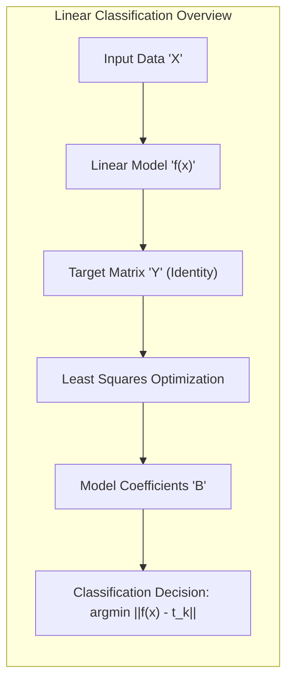
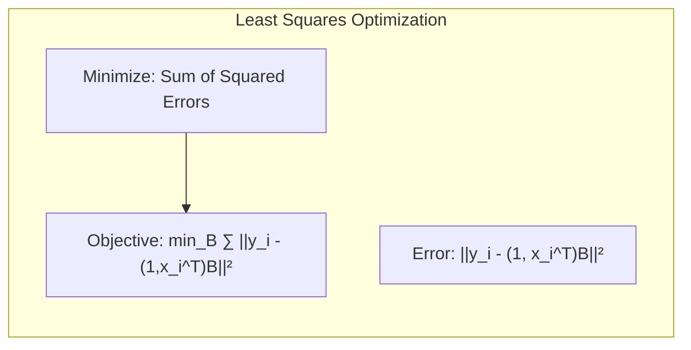
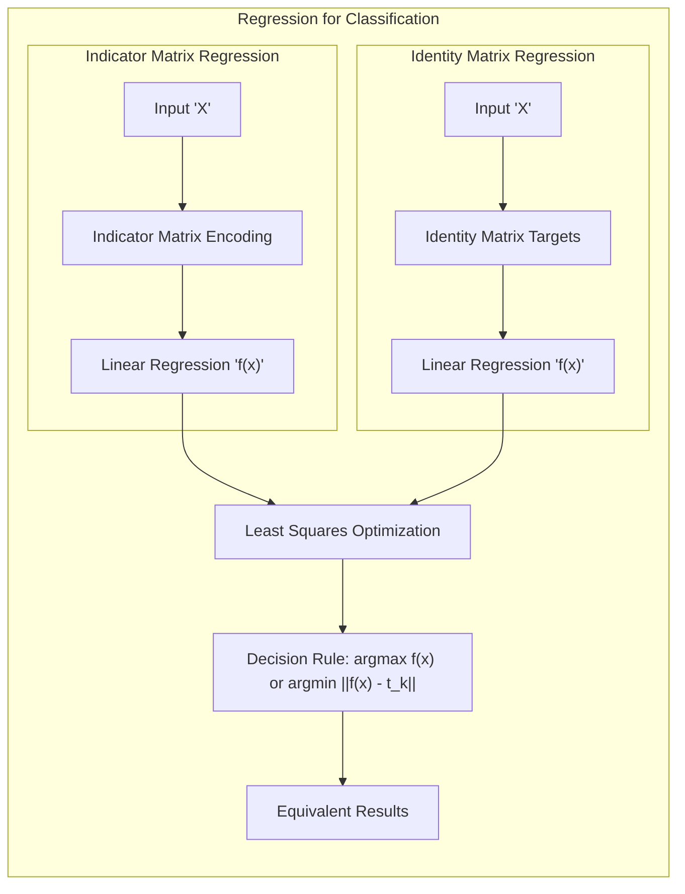
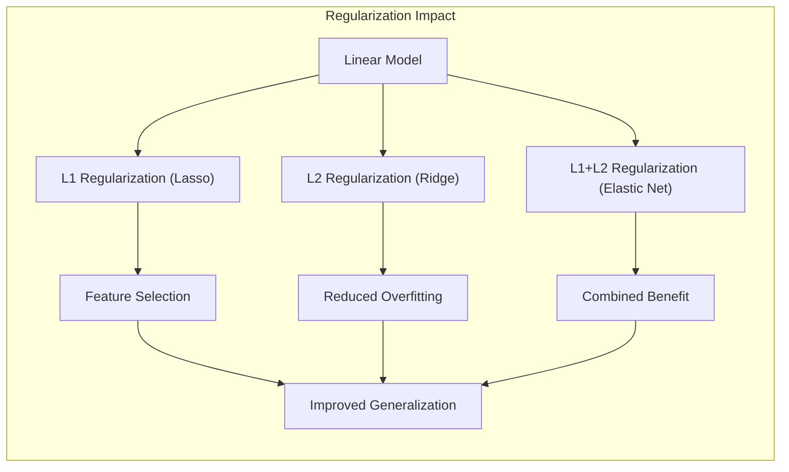
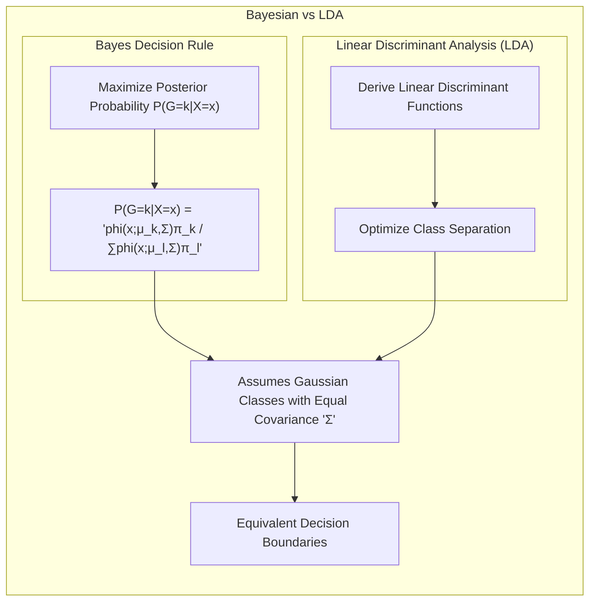

## Título Conciso: Classificação Linear, Seleção de Variáveis e Regularização

### Introdução

Este capítulo explora uma visão simplificada e alternativa para entender a regressão linear aplicada à classificação, focando no uso de uma **matriz identidade como alvo** e no ajuste por **mínimos quadrados** [^4.2].  Esta perspectiva nos permite visualizar a classificação como um processo de aproximação de vetores, onde cada classe é representada por um vetor único. Além disso, analisaremos as limitações dessa abordagem, especialmente o problema de **"masking" de classes** e a falta de restrições nas estimativas para estarem entre 0 e 1 [^4.2]. Compararemos este método com outras abordagens, tais como **Linear Discriminant Analysis (LDA)** e **Logistic Regression**, que oferecem abordagens mais diretas para modelar as probabilidades das classes [^4.3], [^4.4]. Discutiremos também técnicas de **seleção de variáveis e regularização** para melhorar a robustez e a interpretabilidade dos modelos [^4.4.4], [^4.5]. O objetivo deste capítulo é fornecer uma visão concisa e abrangente dessa perspectiva alternativa sobre a regressão linear na classificação.

### Conceitos Fundamentais

**Conceito 1: Classificação com Matriz Identidade como Alvo**

Uma abordagem alternativa para a regressão linear na classificação consiste em definir *targets* (alvos) para cada classe usando uma matriz identidade $K \times K$, onde $K$ é o número de classes [^4.2]. Assim, a $k$-ésima coluna da matriz identidade, $t_k$, representa o target para a classe $k$.  O objetivo passa a ser ajustar um modelo linear para cada observação $x_i$, de forma que a saída do modelo, $f(x_i)$, seja o mais próximo possível do target $t_k$ correspondente à classe da observação $x_i$. Esse ajuste é realizado por meio da minimização da soma dos erros quadráticos, o método dos mínimos quadrados [^4.2]. A classificação é então feita atribuindo $x$ à classe cujo target é o mais próximo do vetor de saídas $f(x)$, medido em termos da norma euclidiana.

> 💡 **Exemplo Numérico:**
> Suponha que temos 3 classes ($K=3$). A matriz identidade $3 \times 3$ seria:
>
> $$
> I_3 = \begin{bmatrix}
> 1 & 0 & 0 \\
> 0 & 1 & 0 \\
> 0 & 0 & 1
> \end{bmatrix}
> $$
>
> Os targets para cada classe seriam:
>
> - Classe 1: $t_1 = \begin{bmatrix} 1 \\ 0 \\ 0 \end{bmatrix}$
> - Classe 2: $t_2 = \begin{bmatrix} 0 \\ 1 \\ 0 \end{bmatrix}$
> - Classe 3: $t_3 = \begin{bmatrix} 0 \\ 0 \\ 1 \end{bmatrix}$
>
> Se o modelo linear produz uma saída $f(x) = \begin{bmatrix} 0.1 \\ 0.8 \\ 0.2 \end{bmatrix}$ para uma observação $x$, calcularíamos as distâncias euclidianas aos targets:
>
> - $||f(x) - t_1|| = \sqrt{(0.1-1)^2 + (0.8-0)^2 + (0.2-0)^2} = \sqrt{0.81 + 0.64 + 0.04} \approx 1.20$
> - $||f(x) - t_2|| = \sqrt{(0.1-0)^2 + (0.8-1)^2 + (0.2-0)^2} = \sqrt{0.01 + 0.04 + 0.04} \approx 0.30$
> - $||f(x) - t_3|| = \sqrt{(0.1-0)^2 + (0.8-0)^2 + (0.2-1)^2} = \sqrt{0.01 + 0.64 + 0.64} \approx 1.14$
>
> Classificaríamos $x$ como pertencente à Classe 2, pois a distância a $t_2$ é a menor.

**Lemma 1:** *O ajuste por mínimos quadrados com targets definidos por matriz identidade é equivalente à regressão linear com matriz de indicadores.*

**Conceito 2: Ajuste por Mínimos Quadrados e a Regra de Decisão**

O ajuste por mínimos quadrados busca minimizar a soma dos quadrados das diferenças entre as saídas do modelo e os *targets*. Matematicamente, isso é expresso como:

onde $y_i$ é o vetor *target* correspondente à classe de $x_i$, $B$ é a matriz de coeficientes e $f(x) = (1,x^T)B$ é o vetor de saídas do modelo. Após o ajuste, a regra de decisão é dada por:

$$
\hat{G}(x) = \arg \min_k ||f(x) - t_k||^2
$$

que atribui $x$ à classe cujo vetor *target* é o mais próximo da saída do modelo [^4.2]. Essa regra de decisão é equivalente àquela utilizada na regressão linear com matriz de indicadores, onde se classifica $x$ para a classe com o maior valor da função ajustada [^4.2].

> 💡 **Exemplo Numérico:**
>
> Vamos supor que temos duas classes e duas observações, $x_1 = [2, 3]$ e $x_2 = [1, 1]$. As classes correspondentes são $y_1 = [1, 0]$ (Classe 1) e $y_2 = [0, 1]$ (Classe 2), usando a matriz identidade como target. Precisamos adicionar um intercepto, então as entradas são $x_1 = [1, 2, 3]$ e $x_2 = [1, 1, 1]$.
>
> A matriz de entradas $X$ e a matriz de targets $Y$ são:
>
> $$
> X = \begin{bmatrix} 1 & 2 & 3 \\ 1 & 1 & 1 \end{bmatrix}, \quad Y = \begin{bmatrix} 1 & 0 \\ 0 & 1 \end{bmatrix}
> $$
>
> A matriz de coeficientes $B$ é calculada por $B = (X^T X)^{-1} X^T Y$.
>
> **Passo 1:** Calcular $X^T X$
>
> $$
> X^T X = \begin{bmatrix} 1 & 1 \\ 2 & 1 \\ 3 & 1 \end{bmatrix} \begin{bmatrix} 1 & 2 & 3 \\ 1 & 1 & 1 \end{bmatrix} = \begin{bmatrix} 2 & 3 & 4 \\ 3 & 5 & 7 \\ 4 & 7 & 10 \end{bmatrix}
> $$
>
> **Passo 2:** Calcular $(X^T X)^{-1}$
>
> $$
> (X^T X)^{-1} = \begin{bmatrix} 5.5 & -3 & 0.5 \\ -3 & 2 & 1 \\ 0.5 & 1 & -0.5 \end{bmatrix}
> $$
>
> **Passo 3:** Calcular $X^T Y$
>
> $$
> X^T Y = \begin{bmatrix} 1 & 1 \\ 2 & 1 \\ 3 & 1 \end{bmatrix} \begin{bmatrix} 1 & 0 \\ 0 & 1 \end{bmatrix} = \begin{bmatrix} 1 & 1 \\ 2 & 1 \\ 3 & 1 \end{bmatrix}
> $$
>
> **Passo 4:** Calcular $B = (X^T X)^{-1} X^T Y$
>
> $$
> B = \begin{bmatrix} 5.5 & -3 & 0.5 \\ -3 & 2 & 1 \\ 0.5 & 1 & -0.5 \end{bmatrix} \begin{bmatrix} 1 & 1 \\ 2 & 1 \\ 3 & 1 \end{bmatrix} = \begin{bmatrix} 0.5 & 3 \\ 1 & -2 \\ -0.5 & 1 \end{bmatrix}
> $$
>
> Agora, para uma nova observação, por exemplo, $x_{new} = [2, 2]$, adicionamos o intercepto, $x_{new} = [1, 2, 2]$. A saída do modelo é $f(x_{new}) = x_{new}^T B$:
>
> $$
> f(x_{new}) = \begin{bmatrix} 1 & 2 & 2 \end{bmatrix} \begin{bmatrix} 0.5 & 3 \\ 1 & -2 \\ -0.5 & 1 \end{bmatrix} = \begin{bmatrix} 1.5 & 1 \end{bmatrix}
> $$
>
> As distâncias para os targets são:
>
> - $||f(x_{new}) - t_1|| = ||[1.5, 1] - [1, 0]|| = \sqrt{(1.5-1)^2 + (1-0)^2} = \sqrt{0.25 + 1} \approx 1.12$
> - $||f(x_{new}) - t_2|| = ||[1.5, 1] - [0, 1]|| = \sqrt{(1.5-0)^2 + (1-1)^2} = \sqrt{2.25 + 0} \approx 1.5$
>
> Classificaríamos $x_{new}$ como pertencente à Classe 1, pois a distância a $t_1$ é a menor.

**Corolário 1:** *A regra de decisão baseada na matriz identidade como alvo é equivalente à regra de decisão da regressão linear com matriz de indicadores, sob o critério de mínimos quadrados.*

**Conceito 3: Limitações da Abordagem e a Necessidade de Alternativas**

Apesar da simplicidade dessa abordagem, ela compartilha as mesmas limitações da regressão linear com matrizes de indicadores, tais como o problema do **"masking"** e a falta de restrição das estimativas para estarem no intervalo [0,1] [^4.2]. Essas limitações motivam o uso de métodos como LDA e Regressão Logística, que modelam a probabilidade das classes de forma mais direta [^4.3], [^4.4].

> ⚠️ **Nota Importante**: Embora a matriz identidade simplifique a formulação do problema, ela não resolve as limitações inerentes à regressão linear como classificador [^4.2].

> ❗ **Ponto de Atenção**: O ajuste por mínimos quadrados, embora computacionalmente eficiente, não garante que as estimativas da função de decisão se comportem como probabilidades [^4.2].

> ✔️ **Destaque**: Apesar de utilizar uma formulação diferente, a abordagem com a matriz identidade como alvo leva aos mesmos resultados que a regressão linear com matriz de indicadores.

### Regressão Linear e Mínimos Quadrados para Classificação

Na abordagem da regressão linear para classificação, utilizando a matriz identidade como alvo, o objetivo passa a ser encontrar os coeficientes que melhor aproximam o vetor de saídas $f(x)$ do *target* apropriado $t_k$. Cada classe $k$ tem seu vetor alvo $t_k$ que corresponde à coluna $k$ da matriz identidade de dimensão $K \times K$. Os coeficientes $\beta$ são estimados usando o método dos mínimos quadrados, que busca minimizar a soma dos erros quadráticos:

$$
\min_B \sum_{i=1}^N ||y_i - (1, x_i^T)B ||^2
$$

onde $y_i$ é o *target* para a observação $x_i$,  $(1, x_i^T)$ é o vetor de entrada com intercepto adicionado, e $B$ é a matriz de coeficientes a serem estimados. A classificação é então realizada atribuindo uma nova observação $x$ à classe $k$ cujo vetor *target* $t_k$ é o mais próximo de $f(x)$, ou seja:

$$
\hat{G}(x) = \arg \min_k ||f(x) - t_k ||^2
$$

Essa abordagem, embora conceitualmente diferente da regressão com matriz de indicadores, leva exatamente à mesma solução e aos mesmos problemas (como o "masking problem" e a falta de garantia de que as estimativas estejam no intervalo [0,1]) quando se busca estimar as respostas usando a regra da máxima resposta [^4.2]. É uma alternativa que fornece uma visão simplificada do problema, facilitando a compreensão do método dos mínimos quadrados em classificação.

**Lemma 2:** *O vetor de coeficientes obtido pela minimização dos erros quadrados entre o target da matriz identidade e a estimativa da regressão linear é equivalente ao vetor de coeficientes obtido pela regressão da matriz de indicadores usando o mesmo método.*

**Corolário 2:** *A regra de decisão de classificar para a classe com o target mais próximo é equivalente à regra de decisão da regressão de indicadores, que classifica para a classe com a maior saída ajustada.*

A abordagem com matriz identidade como target, vista como uma forma simplificada de regressão, compartilha as mesmas limitações que a regressão linear com matriz de indicadores, como o problema do masking e a falta de calibração probabilística. Métodos como LDA e Regressão Logística, ao modelarem probabilidades ou densidades, oferecem uma base teórica mais sólida para problemas de classificação [^4.3], [^4.4].

### Métodos de Seleção de Variáveis e Regularização em Classificação

**Seleção de variáveis** e **regularização** são técnicas fundamentais para melhorar o desempenho de modelos lineares de classificação e mitigar os problemas de *overfitting*.  Em cenários com muitas variáveis preditoras, a regularização introduz um termo de penalidade na função de custo, que restringe a magnitude dos coeficientes do modelo e, consequentemente, sua complexidade [^4.5].

Na **regressão logística**, a função de custo regularizada pode ser expressa como:

$$
\max_{\beta_0, \beta} \left[ \sum_{i=1}^N \left( y_i (\beta_0 + \beta^T x_i) - \log(1 + e^{\beta_0 + \beta^T x_i}) \right) - \lambda P(\beta) \right]
$$

onde $P(\beta)$ é o termo de penalidade e $\lambda$ é o parâmetro de regularização. A penalidade **L1** (Lasso) é dada por $P(\beta) = \sum_{j=1}^p |\beta_j|$, que promove a esparsidade dos coeficientes, selecionando as variáveis mais relevantes e "zerando" as menos importantes [^4.4.4]. A penalidade **L2** (Ridge) é dada por $P(\beta) = \sum_{j=1}^p \beta_j^2$, que reduz a magnitude de todos os coeficientes, estabilizando o modelo e reduzindo o risco de *overfitting* [^4.5].

> 💡 **Exemplo Numérico:**
> Vamos considerar um problema de regressão logística com duas variáveis preditoras, $x_1$ e $x_2$, e um intercepto. A função de custo regularizada com penalidade L1 (Lasso) é:
>
> $$
> \max_{\beta_0, \beta_1, \beta_2} \left[ \sum_{i=1}^N \left( y_i (\beta_0 + \beta_1 x_{i1} + \beta_2 x_{i2}) - \log(1 + e^{\beta_0 + \beta_1 x_{i1} + \beta_2 x_{i2}}) \right) - \lambda (|\beta_1| + |\beta_2|) \right]
> $$
>
> Suponha que, após o ajuste do modelo com um $\lambda$ específico, obtivemos os seguintes coeficientes: $\beta_0 = 0.5$, $\beta_1 = 2.0$ e $\beta_2 = 0.1$. Se aumentarmos o valor de $\lambda$, a penalidade L1 forçará alguns coeficientes a se aproximarem de zero.
>
> Por exemplo, com um $\lambda$ maior, poderíamos obter: $\beta_0 = 0.6$, $\beta_1 = 1.0$ e $\beta_2 = 0.0$. O coeficiente $\beta_2$ foi zerado, indicando que a variável $x_2$ é menos importante para o modelo.
>
> Agora, para a penalidade L2 (Ridge), a função de custo regularizada é:
>
> $$
> \max_{\beta_0, \beta_1, \beta_2} \left[ \sum_{i=1}^N \left( y_i (\beta_0 + \beta_1 x_{i1} + \beta_2 x_{i2}) - \log(1 + e^{\beta_0 + \beta_1 x_{i1} + \beta_2 x_{i2}}) \right) - \lambda (\beta_1^2 + \beta_2^2) \right]
> $$
>
>  Com penalidade L2, ao aumentar $\lambda$, os coeficientes diminuem de magnitude, mas dificilmente se tornam exatamente zero. Usando os mesmos coeficientes iniciais ($\beta_0 = 0.5$, $\beta_1 = 2.0$ e $\beta_2 = 0.1$), um $\lambda$ maior poderia levar a: $\beta_0 = 0.55$, $\beta_1 = 1.2$ e $\beta_2 = 0.05$.
>
> A penalidade L1 promove a esparsidade, enquanto a penalidade L2 reduz a magnitude dos coeficientes, tornando o modelo mais estável.

A regularização é essencial para construir modelos mais robustos que generalizem bem para novos dados, e a escolha entre L1, L2 ou uma combinação de ambas (Elastic Net) depende do problema específico.

**Lemma 3:** *A aplicação da penalidade L1 em modelos de classificação, tais como a regressão logística, leva à esparsidade dos coeficientes, selecionando as variáveis mais relevantes.*

**Prova do Lemma 3:** A penalidade L1 adiciona um termo linear em módulo na função de custo, o que faz com que os coeficientes menos relevantes se tornem exatamente zero durante a otimização. A derivada do termo L1 tem um valor constante em módulo, o que permite que coeficientes pequenos sejam zerados por completo [^4.4.3], [^4.4.4]. $\blacksquare$

**Corolário 3:** *Modelos esparsos, resultantes da aplicação da regularização L1, apresentam uma melhor generalização e são menos suscetíveis ao problema de overfitting.*

> ⚠️ **Ponto Crucial**: A regularização, seja L1 ou L2, é fundamental para controlar a complexidade dos modelos lineares de classificação e melhorar sua capacidade de generalização, além de mitigar o risco de overfitting e problemas como o "masking" [^4.5].

### Separating Hyperplanes e Perceptrons

A ideia de **hiperplanos separadores** surge da busca por uma fronteira linear que maximize a separação entre as classes, buscando, simultaneamente, minimizar o erro de classificação e garantir a robustez do modelo. O objetivo não é apenas separar as classes, mas também maximizar a distância entre o hiperplano e as amostras mais próximas de cada classe, o que é definido como margem [^4.5.2].

O algoritmo do **Perceptron**, é um método iterativo que busca um hiperplano separador com base nas amostras classificadas incorretamente no conjunto de treinamento [^4.5.1]. O Perceptron é uma abordagem relativamente simples, mas pode não garantir a maximização da margem e nem a convergência para dados que não são linearmente separáveis [^4.5.1].  A busca por hiperplanos separadores pode ser vista como um problema de otimização, onde o objetivo é minimizar a distância das amostras ao hiperplano de separação.

> 💡 **Exemplo Numérico:**
>
> Considere um problema de classificação binária com duas variáveis preditoras, $x_1$ e $x_2$. Temos duas classes, que representaremos por -1 e 1. Suponha que o hiperplano inicial seja dado por $w_0 + w_1 x_1 + w_2 x_2 = 0$, onde $w = [w_0, w_1, w_2]$.
>
> Inicialmente, os pesos podem ser definidos aleatoriamente, por exemplo, $w = [0.1, 0.2, -0.3]$. O algoritmo do Perceptron itera sobre os dados de treinamento e, para cada amostra classificada incorretamente, atualiza os pesos usando a regra:
>
> $$
> w_{new} = w_{old} + \eta y_i x_i
> $$
>
> onde $\eta$ é a taxa de aprendizagem, $y_i$ é a classe verdadeira da amostra $x_i$, e $x_i$ é o vetor de entrada com o intercepto adicionado.
>
> Suponha que tenhamos a amostra $x = [1, 2]$ que pertence à classe 1. O modelo inicialmente classifica essa amostra incorretamente.
>
> 1. **Classificação Inicial:** Calculamos o valor da função de decisão: $0.1 + 0.2*1 - 0.3*2 = -0.3$. Como o resultado é negativo, o modelo classifica $x$ como classe -1, o que é incorreto.
> 2. **Atualização dos Pesos:** Usando uma taxa de aprendizagem de $\eta = 0.1$, atualizamos os pesos:
> $$
> w_{new} = [0.1, 0.2, -0.3] + 0.1 * 1 * [1, 1, 2] = [0.2, 0.3, -0.1]
> $$
> 3. **Próxima Iteração:** O algoritmo continua iterando sobre os dados de treinamento, ajustando os pesos até que todos os pontos sejam classificados corretamente (se os dados forem linearmente separáveis).
>
> Este processo iterativo busca um hiperplano que separe as classes, ajustando os pesos a cada erro de classificação.

**Teorema:** *O algoritmo do Perceptron converge para uma solução separadora em um número finito de iterações, desde que o conjunto de dados de treinamento seja linearmente separável*.

### Pergunta Teórica Avançada: Quais as diferenças fundamentais entre a formulação de LDA e a Regra de Decisão Bayesiana considerando distribuições Gaussianas com covariâncias iguais?

**Resposta:**

A **Regra de Decisão Bayesiana** busca classificar uma observação $x$ na classe $k$ que maximize a probabilidade posterior $P(G=k|X=x)$ [^4.3]. Quando as distribuições condicionais $P(X|G=k)$ são Gaussianas com a mesma matriz de covariância $\Sigma$, o Teorema de Bayes resulta em:

$$
P(G=k|X=x) = \frac{ \phi(x;\mu_k,\Sigma)\pi_k}{\sum_{l=1}^K \phi(x;\mu_l,\Sigma)\pi_l}
$$

onde $\phi(x;\mu_k,\Sigma)$ é a função densidade gaussiana, $\mu_k$ é a média da classe $k$ e $\pi_k$ é a probabilidade a priori da classe. O **LDA**, por sua vez, deriva suas funções discriminantes lineares diretamente dessas suposições, buscando otimizar a separação entre as classes no espaço de características [^4.3].

> 💡 **Exemplo Numérico:**
>
> Suponha um problema com duas classes, onde as distribuições de cada classe são Gaussianas com médias $\mu_1 = [1, 1]$ e $\mu_2 = [3, 3]$, e uma matriz de covariância comum $\Sigma = \begin{bmatrix} 1 & 0 \\ 0 & 1 \end{bmatrix}$. As probabilidades a priori são $\pi_1 = 0.4$ e $\pi_2 = 0.6$.
>
> Um ponto de teste é $x = [2, 2]$.
>
> 1. **Regra de Decisão Bayesiana:**
>    - Calculamos a densidade gaussiana para cada classe:
>    $$
>    \phi(x;\mu_k,\Sigma) = \frac{1}{(2\pi)^{p/2}|\Sigma|^{1/2}} \exp\left(-\frac{1}{2}(x-\mu_k)^T\Sigma^{-1}(x-\mu_k)\right)
>    $$
>    - Para a classe 1:
>    $$
>    \phi(x;\mu_1,\Sigma) = \frac{1}{2\pi} \exp\left(-\frac{1}{2}([2,2]-[1,1])^T \begin{bmatrix} 1 & 0 \\ 0 & 1 \end{bmatrix}^{-1} [2,2]-[1,1])\right) \approx \frac{1}{2\pi} \exp(-1) \approx 0.058
>    $$
>    - Para a classe 2:
>    $$
>    \phi(x;\mu_2,\Sigma) = \frac{1}{2\pi} \exp\left(-\frac{1}{2}([2,2]-[3,3])^T \begin{bmatrix} 1 & 0 \\ 0 & 1 \end{bmatrix}^{-1} [2,2]-[3,3])\right) \approx \frac{1}{2\pi} \exp(-1) \approx 0.058
>    $$
>    - Calculamos as probabilidades posteriores:
>    $$
>    P(G=1|X=x) = \frac{0.058 * 0.4}{0.058 * 0.4 + 0.058 * 0.6} = 0.4
>    $$
>    $$
>    P(G=2|X=x) = \frac{0.058 * 0.6}{0.058 * 0.4 + 0.058 * 0.6} = 0.6
>    $$
>    - Classificamos $x$ como pertencente à Classe 2, pois $P(G=2|X=x) > P(G=1|X=x)$.
>
> 2. **LDA:**
>   - LDA usa funções discriminantes lineares que são equivalentes às probabilidades posteriores quando as covariâncias são iguais. O LDA levaria à mesma decisão, classificando $x$ como Classe 2.

**Lemma 4:** *Sob a suposição de que as classes seguem distribuições Gaussianas com a mesma matriz de covariância, a regra de decisão Bayesiana e as funções discriminantes do LDA levam à mesma fronteira de decisão linear.*

**Corolário 4:** *A remoção da restrição de igualdade de covariâncias no QDA leva a fronteiras de decisão quadráticas (QDA) e não mais a um hiperplano.*

> ⚠️ **Ponto Crucial**: A principal diferença está na forma de modelagem. A regra de decisão Bayesiana busca otimizar a probabilidade posterior, enquanto o LDA deriva sua regra a partir da modelagem da distribuição gaussiana, assumindo a igualdade das matrizes de covariância [^4.3].

### Conclusão

Neste capítulo, exploramos a aplicação da regressão linear na classificação, com foco na visão simplificada que utiliza a matriz identidade como alvo e o ajuste por mínimos quadrados. Vimos como essa abordagem se conecta com a regressão linear em matrizes de indicadores e quais são suas limitações, particularmente o problema do "masking" e a falta de calibração probabilística. Analisamos também a importância da seleção de variáveis e da regularização para melhorar o desempenho dos modelos. A comparação entre LDA e a regra de decisão Bayesiana, sob a suposição de distribuições Gaussianas com covariâncias iguais, forneceu um entendimento mais aprofundado das nuances desses métodos. Ao longo deste capítulo, procuramos oferecer uma base sólida para a compreensão e aplicação de modelos lineares em classificação, reconhecendo tanto suas vantagens quanto suas limitações.

### Footnotes

[^4.1]: *In this chapter we revisit the classification problem and focus on linear methods for classification...There are several different ways in which linear decision boundaries can be found.*

[^4.2]: *In Chapter 2 we fit linear regression models to the class indicator variables, and classify to the largest fit...Linear inequalities in this space are quadratic inequalities in the original space.*

[^4.3]: *Decision theory for classification (Section 2.4) tells us that we need to know the class posteriors Pr(G|X) for optimal classification. Suppose fk(x) is the class-conditional density of X in class G = k, and let πκ be the prior probability of class k... Linear discriminant analysis (LDA) arises in the special case when we assume that the classes have a common covariance matrix Σk = Σ.*

[^4.3.1]: *The decision boundary between each pair of classes k and l is described by a quadratic equation {x: δκ(x) = δ(x)}.*

[^4.3.3]: *In the special case when we assume that the classes have a common covariance matrix...When the classes are really Gaussian, then LDA is optimal*

[^4.4]: *The logistic regression model arises from the desire to model the posterior probabilities of the K classes via linear functions in x, while at the same time ensuring that they sum to one and remain in [0,1].*

[^4.4.1]: *Logistic regression models are usually fit by maximum likelihood... The logistic regression model is more general, in that it makes less assumptions.*

[^4.4.2]: *It is convenient to code the two-class gi via a 0/1 response Yi, where yi = 1 when gi = 1, and yi = 0 when gi = 2... Typically many models are fit in a search for a parsimonious model involving a subset of the variables.*

[^4.4.3]: *To maximize the log-likelihood, we set its derivatives to zero. These score equations are...To solve the score equations (4.21), we use the Newton-Raphson algorithm...*

[^4.4.4]: *The L1 penalty used in the lasso (Section 3.4.2) can be used for variable selection and shrinkage with any linear regression model...As with the lasso, we typically do not penalize the intercept term.*

[^4.5]: *Here we present an analysis of binary data to illustrate the traditional statistical use of the logistic regression model... With two classes there is a simple correspondence between linear discriminant analysis and classification by linear least squares, as in (4.5).*

[^4.5.1]: *The perceptron learning algorithm tries to find a separating hyperplane by minimizing the distance of misclassified points to the decision boundary.*

[^4.5.2]: *The optimal separating hyperplane separates the two classes and maximizes the distance to the closest point from either class... In light of (4.40), the constraints define an empty slab or margin around the linear decision boundary...*
