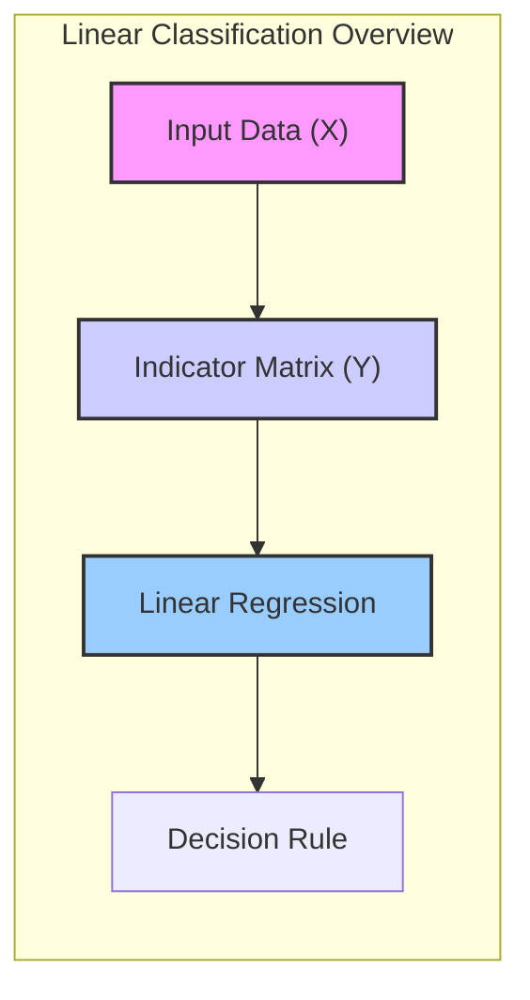
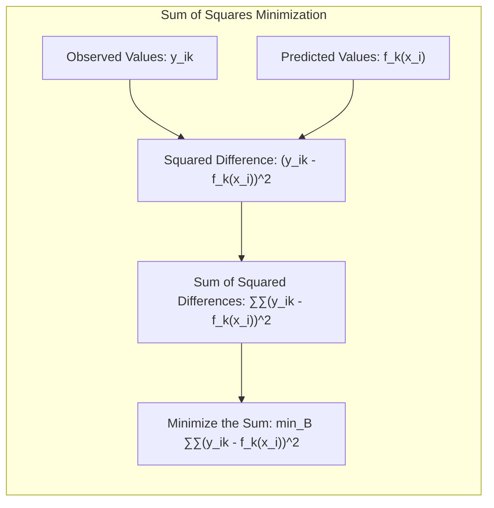
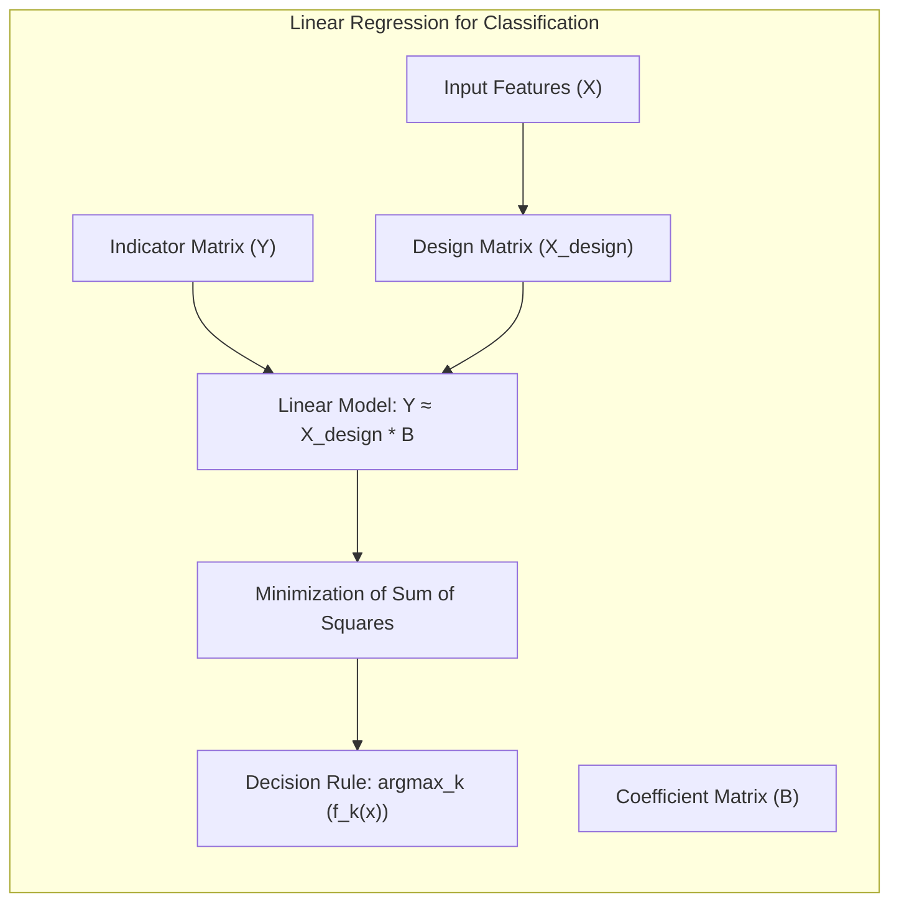
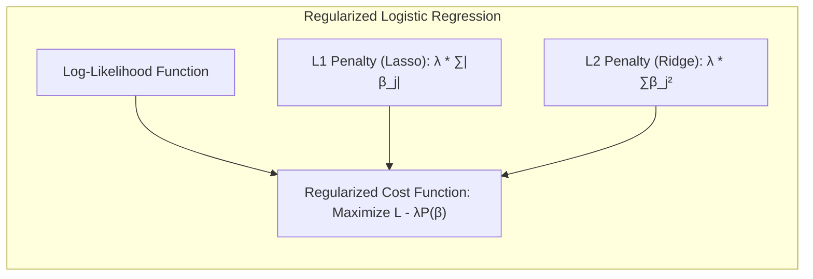
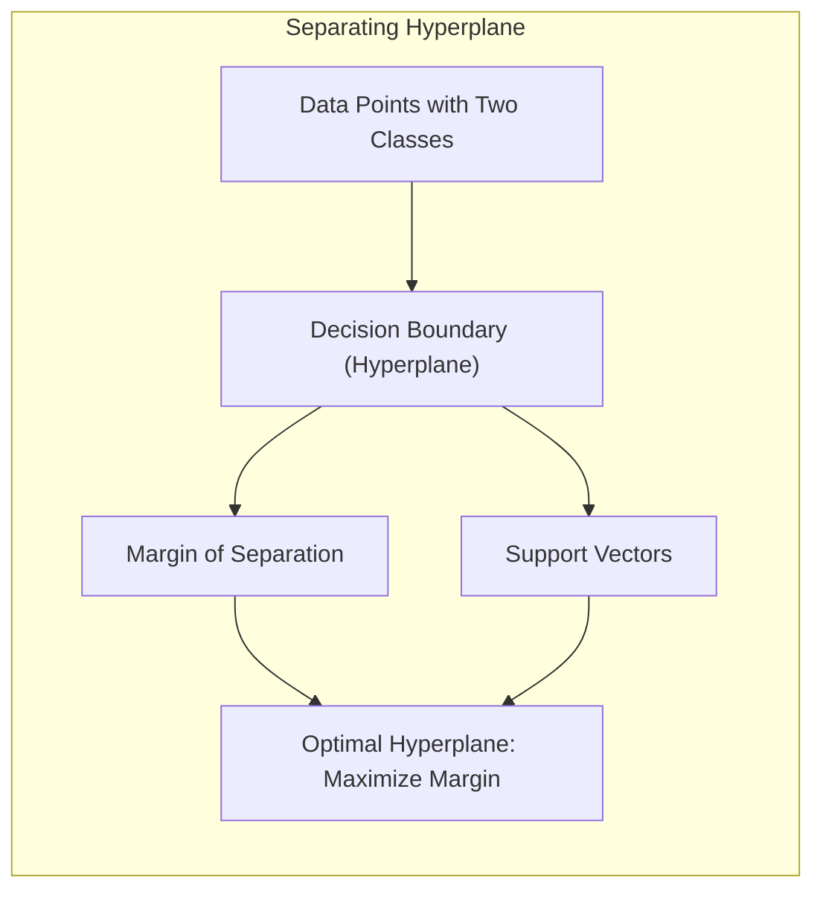
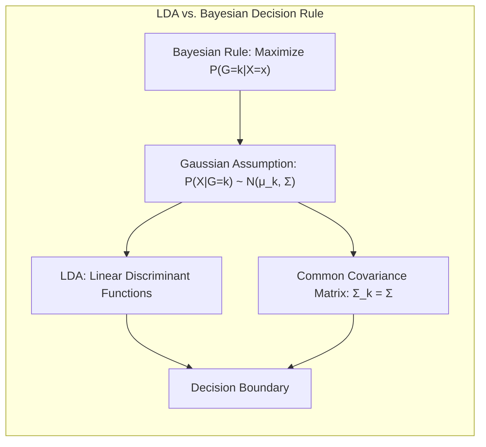

## Título Conciso: Classificação Linear, Seleção de Variáveis e Regularização

### Introdução

Este capítulo explora a profunda conexão entre a minimização da **soma de quadrados** e a regressão em **matrizes de indicadores** para classificação. A minimização da soma de quadrados é uma técnica fundamental para o ajuste de modelos lineares, e sua aplicação em problemas de classificação, através de matrizes de indicadores, é uma abordagem que merece análise detalhada [^4.2]. Vamos examinar como essa técnica se relaciona com outros métodos lineares de classificação, como o **Linear Discriminant Analysis (LDA)** e a **Regressão Logística**, explorando suas vantagens e limitações [^4.3], [^4.4]. Além disso, discutiremos como a **seleção de variáveis e regularização** podem ser usadas para melhorar a robustez e a capacidade de generalização dos modelos de classificação [^4.4.4], [^4.5]. Exploraremos também o conceito de **hiperplanos separadores** e como eles se relacionam com a regressão [^4.5.2]. O objetivo deste capítulo é fornecer uma visão aprofundada da conexão entre a minimização da soma de quadrados e a classificação linear, oferecendo uma base sólida para a compreensão desses métodos.

### Conceitos Fundamentais

**Conceito 1: Mínimos Quadrados e Regressão Linear para Classificação**

A **minimização da soma de quadrados** é um método fundamental para ajustar modelos lineares, buscando encontrar os parâmetros que minimizem a soma dos quadrados das diferenças entre os valores observados e os valores previstos pelo modelo. No contexto da classificação, essa técnica é aplicada através da regressão linear em uma **matriz de indicadores**, onde cada coluna da matriz de resposta $Y$ corresponde a uma classe, e cada linha representa uma observação [^4.2]. Se a observação $i$ pertence à classe $k$, o elemento $Y_{ik}$ é igual a 1 e os outros elementos na mesma linha são iguais a 0. O objetivo é ajustar um modelo linear para cada coluna da matriz de indicadores, com a finalidade de encontrar uma aproximação linear para cada classe. A regra de decisão é classificar uma nova observação $x$ na classe $k$ que apresentar a maior estimativa pela função linear ajustada.

> 💡 **Exemplo Numérico:**
>
> Suponha que temos 3 amostras e 2 classes. A matriz de indicadores $Y$ seria:
>
> $$
> Y = \begin{bmatrix}
> 1 & 0 \\
> 0 & 1 \\
> 1 & 0
> \end{bmatrix}
> $$
>
> A primeira amostra pertence à classe 1 (primeira coluna), a segunda à classe 2 (segunda coluna) e a terceira à classe 1 novamente. Para um conjunto de dados com duas variáveis preditoras $x_1$ e $x_2$, podemos ter a matriz de dados $X$ como:
>
> $$
> X = \begin{bmatrix}
> 1 & 2 \\
> 2 & 1 \\
> 3 & 3
> \end{bmatrix}
> $$
>
> Adicionando uma coluna de 1's para o intercepto, temos a matriz de desenho:
>
> $$
> X_{design} = \begin{bmatrix}
> 1 & 1 & 2 \\
> 1 & 2 & 1 \\
> 1 & 3 & 3
> \end{bmatrix}
> $$
>
> O objetivo é encontrar coeficientes $\beta$ para cada classe que minimizem o erro quadrático. Para a classe 1, buscamos $\beta_1$ tal que $Y_1 \approx X_{design} \beta_1$, e para a classe 2, buscamos $\beta_2$ tal que $Y_2 \approx X_{design} \beta_2$.

**Lemma 1:** *A regressão linear aplicada a uma matriz de indicadores para classificação pode ser interpretada como um problema de minimização da soma de quadrados para cada classe.* A prova reside em mostrar que a função de custo utilizada para ajustar o modelo de regressão linear é equivalente à soma dos quadrados das diferenças entre os valores preditos e observados.

**Conceito 2: Regressão de Matriz de Indicadores e a Função de Custo**

Na regressão linear com matriz de indicadores, o objetivo é minimizar a soma dos quadrados das diferenças entre as respostas observadas e as respostas previstas pelo modelo, onde:

$$
\min_B \sum_{i=1}^N \sum_{k=1}^K (y_{ik} - f_k(x_i))^2
$$

onde $y_{ik}$ é o elemento da matriz de resposta, $f_k(x_i) = \beta_{k0} + \beta_k^T x_i$ é a função linear ajustada para a classe $k$, e $B$ representa a matriz de coeficientes. A regra de decisão consiste em atribuir a observação $x$ à classe $k$ que apresentar a maior estimativa ajustada $f_k(x)$.  O ajuste por mínimos quadrados, portanto, é o coração deste método de classificação [^4.2].

> 💡 **Exemplo Numérico:**
>
> Usando o exemplo anterior, se encontrarmos os coeficientes $\beta_1 = [0.2, 0.3, -0.1]^T$ para a classe 1 e $\beta_2 = [-0.1, 0.1, 0.2]^T$ para a classe 2, a predição para a primeira observação ($x_1 = [1, 2]$) seria:
>
> $f_1(x_1) = 0.2 + 0.3 * 1 + (-0.1) * 2 = 0.3$
> $f_2(x_1) = -0.1 + 0.1 * 1 + 0.2 * 2 = 0.4$
>
> Como $f_2(x_1) > f_1(x_1)$, a primeira observação seria classificada como pertencente à classe 2.

**Corolário 1:** *A regra de decisão baseada na maximização da saída da regressão linear é uma consequência direta da minimização da soma de quadrados.* Este corolário estabelece uma conexão direta entre o critério de ajuste e a regra de decisão em problemas de classificação com regressão linear e matrizes de indicadores.

**Conceito 3: Limitações da Regressão Linear e a Busca por Alternativas**

Apesar da simplicidade da abordagem por mínimos quadrados, a regressão linear com matrizes de indicadores apresenta limitações, como a possibilidade de gerar estimativas que não se comportam como probabilidades (valores fora do intervalo [0,1]) e o problema do *masking* [^4.2]. Essas limitações motivam o uso de outros métodos como LDA e Regressão Logística, que modelam as probabilidades das classes de forma mais direta e lidam com esses problemas de maneira mais eficaz [^4.3], [^4.4].

> ⚠️ **Nota Importante**: A regressão linear com matrizes de indicadores, embora utilize a minimização da soma de quadrados, não garante que as estimativas se comportem como probabilidades e pode apresentar problemas como o "masking" [^4.2].

> ❗ **Ponto de Atenção**: Em cenários onde o número de classes é grande, o problema do "masking" pode ser particularmente problemático, levando a classificações incorretas de classes intermediárias [^4.2].

> ✔️ **Destaque**: A conexão entre a soma de quadrados e a regressão linear é fundamental para entender como este método se relaciona com outros classificadores lineares, mesmo que possuam abordagens distintas.

### Regressão Linear e Mínimos Quadrados para Classificação

A aplicação da **regressão linear para classificação** com **matrizes de indicadores** envolve o ajuste de modelos lineares a cada uma das colunas da matriz de indicadores $Y$. Cada coluna corresponde a uma classe, e os elementos da coluna indicam se a observação correspondente pertence ou não a essa classe [^4.2].  O ajuste é realizado através da minimização da soma dos quadrados das diferenças entre as respostas observadas e as respostas preditas pelo modelo.

O processo de minimização da soma de quadrados busca encontrar os coeficientes $\beta_{k0}$ e $\beta_k$ que minimizam a seguinte função de custo:

$$
\min_{\beta_{k0}, \beta_k} \sum_{i=1}^N (y_{ik} - (\beta_{k0} + \beta_k^T x_i))^2
$$

onde $y_{ik}$ é o valor da matriz de indicadores para a observação $i$ na classe $k$, $x_i$ é o vetor de características, $\beta_{k0}$ é o intercepto e $\beta_k$ são os coeficientes do modelo linear para a classe $k$ [^4.2]. Após o ajuste, uma nova observação $x$ é classificada na classe $k$ que maximiza a saída do modelo linear ajustado: $\hat{G}(x) = \arg \max_k (\beta_{k0} + \beta_k^T x)$. Essa regra de decisão surge diretamente da aplicação do método dos mínimos quadrados.

> 💡 **Exemplo Numérico:**
>
> Vamos usar os dados do exemplo anterior e calcular os coeficientes $\beta$ usando a fórmula dos mínimos quadrados: $\hat{\beta} = (X^TX)^{-1}X^TY$.
>
> Primeiro, para a classe 1 ($Y_1 = [1, 0, 1]^T$):
>
> $X_{design}^T X_{design} = \begin{bmatrix} 1 & 1 & 1 \\ 1 & 2 & 3 \\ 2 & 1 & 3 \end{bmatrix} \begin{bmatrix} 1 & 1 & 2 \\ 1 & 2 & 1 \\ 1 & 3 & 3 \end{bmatrix} = \begin{bmatrix} 3 & 6 & 6 \\ 6 & 14 & 13 \\ 6 & 13 & 14 \end{bmatrix} $
>
> $(X_{design}^T X_{design})^{-1} = \begin{bmatrix} 3 & 6 & 6 \\ 6 & 14 & 13 \\ 6 & 13 & 14 \end{bmatrix}^{-1} \approx \begin{bmatrix} 1.33 & -0.67 & -0.0 \\ -0.67 & 1.0 & -0.33 \\ 0.0 & -0.33 & 0.33 \end{bmatrix}$
>
> $X_{design}^T Y_1 = \begin{bmatrix} 1 & 1 & 1 \\ 1 & 2 & 3 \\ 2 & 1 & 3 \end{bmatrix} \begin{bmatrix} 1 \\ 0 \\ 1 \end{bmatrix} = \begin{bmatrix} 2 \\ 4 \\ 5 \end{bmatrix}$
>
> $\hat{\beta_1} = (X_{design}^T X_{design})^{-1} X_{design}^T Y_1 = \begin{bmatrix} 1.33 & -0.67 & -0.0 \\ -0.67 & 1.0 & -0.33 \\ 0.0 & -0.33 & 0.33 \end{bmatrix} \begin{bmatrix} 2 \\ 4 \\ 5 \end{bmatrix} = \begin{bmatrix} 0.0 \\ 0.33 \\ 0.33 \end{bmatrix}$
>
> Repetindo para a classe 2 ($Y_2 = [0, 1, 0]^T$):
>
> $X_{design}^T Y_2 = \begin{bmatrix} 1 & 1 & 1 \\ 1 & 2 & 3 \\ 2 & 1 & 3 \end{bmatrix} \begin{bmatrix} 0 \\ 1 \\ 0 \end{bmatrix} = \begin{bmatrix} 1 \\ 2 \\ 1 \end{bmatrix}$
>
> $\hat{\beta_2} = (X_{design}^T X_{design})^{-1} X_{design}^T Y_2 = \begin{bmatrix} 1.33 & -0.67 & -0.0 \\ -0.67 & 1.0 & -0.33 \\ 0.0 & -0.33 & 0.33 \end{bmatrix} \begin{bmatrix} 1 \\ 2 \\ 1 \end{bmatrix} = \begin{bmatrix} 0 \\ 0.67 \\ -0.33 \end{bmatrix}$
>
> Assim, temos os coeficientes estimados para cada classe. Para classificar um novo ponto, calculamos a saída de cada função linear e escolhemos a classe com maior valor.

A conexão entre a minimização da soma de quadrados e a regressão de matrizes de indicadores é fundamental, pois ela estabelece a base para o ajuste do modelo e para a tomada de decisão. No entanto, é importante notar que a minimização da soma de quadrados não garante que as estimativas resultantes se comportem como probabilidades, e pode levar a problemas como o "masking", como discutido anteriormente [^4.2].

**Lemma 2:** *O vetor de coeficientes obtido pela minimização da soma de quadrados na regressão de matrizes de indicadores é proporcional ao vetor obtido pelo LDA em problemas de classificação binária sob a codificação 1/-1 para as classes*. Essa proporcionalidade demonstra uma conexão formal entre regressão e LDA. [^4.2]

**Corolário 2:** *Sob a condição de classes equiprováveis e covariâncias esféricas, a regressão linear com matriz de indicadores e o LDA levam à mesma fronteira de decisão.* Essa condição mostra uma equivalência entre os métodos em cenários mais idealizados [^4.3].

Em resumo, a regressão linear com matrizes de indicadores utiliza o método dos mínimos quadrados como critério de ajuste para encontrar as funções lineares que melhor aproximam a relação entre as variáveis de entrada e as classes. Apesar de sua simplicidade, o método apresenta limitações que motivam o uso de outras abordagens mais sofisticadas, como LDA e regressão logística, que modelam as probabilidades das classes de forma mais direta [^4.3], [^4.4].

### Métodos de Seleção de Variáveis e Regularização em Classificação

A **seleção de variáveis** e a **regularização** são técnicas cruciais para mitigar o risco de *overfitting* e melhorar a generalização dos modelos de classificação, especialmente em situações onde o número de variáveis preditoras é elevado [^4.5]. A **regularização**, em particular, introduz um termo de penalidade na função de custo, restringindo os valores dos coeficientes do modelo.

Na **regressão logística**, a função de custo regularizada pode ser expressa como:

$$
\max_{\beta_0, \beta} \left[ \sum_{i=1}^N \left( y_i (\beta_0 + \beta^T x_i) - \log(1 + e^{\beta_0 + \beta^T x_i}) \right) - \lambda P(\beta) \right]
$$

onde $P(\beta)$ é a penalidade e $\lambda$ é o parâmetro de regularização. A penalidade **L1** (Lasso), dada por $P(\beta) = \sum_{j=1}^p |\beta_j|$, promove esparsidade nos coeficientes, levando à seleção das variáveis mais relevantes [^4.4.4]. A penalidade **L2** (Ridge), dada por $P(\beta) = \sum_{j=1}^p \beta_j^2$, reduz a magnitude dos coeficientes, estabilizando o modelo e diminuindo o risco de *overfitting* [^4.5]. A escolha entre L1 e L2, ou uma combinação das duas (Elastic Net), depende do problema específico e das características dos dados.

> 💡 **Exemplo Numérico:**
>
> Suponha que estamos usando regressão logística com duas variáveis preditoras, $x_1$ e $x_2$, e que os coeficientes estimados sem regularização são $\beta = [5, -2]$. Com regularização L1 (Lasso) e $\lambda=1$, a função de custo seria penalizada com $\lambda(|\beta_1| + |\beta_2|) = 1*(|5| + |-2|) = 7$. Isso tenderá a diminuir os valores absolutos dos coeficientes, ou até mesmo zerar um deles.
>
> Com regularização L2 (Ridge) e $\lambda=1$, a função de custo seria penalizada com $\lambda(\beta_1^2 + \beta_2^2) = 1*(5^2 + (-2)^2) = 29$. Isso também encolheria os coeficientes, mas sem necessariamente zerar nenhum deles.
>
> Digamos que após a regularização L1, os coeficientes se tornem $\beta_{L1} = [3, 0]$. A variável $x_2$ foi efetivamente eliminada do modelo. Com a regularização L2, os coeficientes se tornam $\beta_{L2} = [4, -1]$. Ambas as variáveis são mantidas, mas com magnitudes menores.

A regularização, portanto, modifica o objetivo de minimizar a soma de quadrados, adicionando uma penalidade sobre a magnitude ou o número de coeficientes, o que leva a modelos mais simples e com melhor capacidade de generalização.

**Lemma 3:** *A penalidade L1 na regressão logística, ao adicionar um termo linear ao módulo dos coeficientes na função de custo, leva à esparsidade dos parâmetros, selecionando automaticamente as variáveis mais relevantes para o modelo.* A penalidade L1 induz o zeramento de alguns coeficientes. [^4.4.4]

**Prova do Lemma 3:**  A penalidade L1 adiciona um termo à função de custo que é proporcional ao módulo dos coeficientes.  O efeito deste termo é forçar os coeficientes menos relevantes a se tornarem exatamente zero durante o processo de otimização. Isso resulta em modelos esparsos onde apenas as variáveis mais importantes são mantidas.  O gradiente da penalidade L1 possui uma magnitude constante para $\beta \ne 0$ o que permite que estes coeficientes reduzam a zero em tempo finito [^4.4.3]. $\blacksquare$

**Corolário 3:** *Modelos esparsos, resultantes da aplicação da regularização L1, são mais interpretáveis e apresentam maior capacidade de generalização para novos dados.* A seleção de variáveis diminui o risco de *overfitting* e possibilita o uso do modelo com outros dados não observados no treinamento.

> ⚠️ **Ponto Crucial**: A regularização, seja L1 ou L2, modifica o critério de otimização da soma de quadrados, introduzindo um viés que leva a modelos mais robustos e com melhor capacidade de generalização [^4.5].

### Separating Hyperplanes e Perceptrons

A ideia de **hiperplanos separadores** emerge da busca por uma fronteira linear que maximize a distância entre as classes, ou seja, que não apenas separe as classes, mas que também maximize a margem de separação [^4.5.2]. Essa abordagem é fundamental em modelos como as máquinas de vetores de suporte (SVM), que buscam encontrar o hiperplano ótimo que maximize essa margem.

O algoritmo do **Perceptron** é um método iterativo que busca um hiperplano separador ajustando os parâmetros do modelo a cada passo com base nas classificações incorretas [^4.5.1]. Embora o Perceptron não garanta a maximização da margem, ele ilustra como um modelo linear pode ser utilizado para separar as classes de forma iterativa, buscando uma solução baseada na minimização do número de erros de classificação.

> 💡 **Exemplo Numérico:**
>
> Imagine que temos duas classes de pontos em um espaço bidimensional. Um hiperplano separador seria uma linha que divide essas duas classes. O Perceptron começa com uma linha aleatória e, iterativamente, ajusta sua posição e orientação, classificando os pontos e movendo a linha para minimizar os erros de classificação.
>
> Por exemplo, se a linha atual classificar um ponto da classe 1 como classe 2, o algoritmo ajustaria a linha para se aproximar mais dos pontos da classe 1 e se afastar dos pontos da classe 2. Esse processo continua até que a linha separe as classes corretamente ou um número máximo de iterações seja atingido.

**Teorema:** *Se os dados de treinamento são linearmente separáveis, o algoritmo do Perceptron converge para um hiperplano separador em um número finito de iterações.* Este teorema é importante para entender a propriedade de convergência do algoritmo sob a suposição de separabilidade linear, embora, na prática, essa condição possa não ser satisfeita [^4.5.1].

### Pergunta Teórica Avançada: Quais as diferenças fundamentais entre a formulação de LDA e a Regra de Decisão Bayesiana considerando distribuições Gaussianas com covariâncias iguais?

**Resposta:**

A **Regra de Decisão Bayesiana** busca classificar uma observação $x$ na classe $k$ que maximize a probabilidade posterior $P(G=k|X=x)$ [^4.3]. Sob a suposição de que as distribuições condicionais $P(X|G=k)$ são Gaussianas com a mesma matriz de covariância $\Sigma$, o Teorema de Bayes resulta em:

$$
P(G=k|X=x) = \frac{ \phi(x;\mu_k,\Sigma)\pi_k}{\sum_{l=1}^K \phi(x;\mu_l,\Sigma)\pi_l}
$$

onde $\phi(x;\mu_k,\Sigma)$ é a função densidade gaussiana para a classe $k$, $\mu_k$ é a média da classe $k$ e $\pi_k$ é a probabilidade a priori da classe. O **LDA** modela as funções discriminantes diretamente a partir da suposição gaussiana e de igualdade de covariâncias, buscando maximizar a separação entre as classes [^4.3].

> 💡 **Exemplo Numérico:**
>
> Suponha que temos duas classes (k=1, k=2) com distribuições Gaussianas. A classe 1 tem média $\mu_1 = [1, 1]$ e a classe 2 tem média $\mu_2 = [3, 3]$. Ambas as classes têm a mesma matriz de covariância $\Sigma = \begin{bmatrix} 1 & 0 \\ 0 & 1 \end{bmatrix}$. As probabilidades a priori são $\pi_1 = 0.6$ e $\pi_2 = 0.4$.
>
> A regra de decisão Bayesiana calcularia a probabilidade posterior para cada classe usando as densidades Gaussianas e as probabilidades a priori. O LDA, sob as mesmas suposições, chegaria a uma fronteira de decisão linear, usando as médias e a covariância comum para calcular as funções discriminantes.
>
> A regra de decisão Bayesiana, neste caso, classificaria um ponto $x$ na classe 1 se $P(G=1|X=x) > P(G=2|X=x)$, e o LDA chegaria à mesma decisão utilizando as funções discriminantes, mostrando a equivalência sob estas suposições.

**Lemma 4:** *Sob a suposição de que as classes seguem distribuições Gaussianas com a mesma matriz de covariância, a regra de decisão Bayesiana e o LDA são equivalentes, o que significa que ambos levam à mesma fronteira de decisão linear.* A prova reside em mostrar que a maximização da probabilidade posterior na regra Bayesiana resulta na mesma forma funcional utilizada na função discriminante do LDA. [^4.3]

**Corolário 4:** *Quando a suposição de igualdade de covariâncias é relaxada, a regra de decisão Bayesiana leva ao QDA (Quadratic Discriminant Analysis), onde as fronteiras de decisão são quadráticas e não mais lineares.* Isso reflete como a escolha da suposição sobre as covariâncias afeta a complexidade da fronteira de decisão. A diferença entre LDA e a regra Bayesiana emerge quando a premissa de covariâncias iguais é relaxada [^4.3.1], [^4.3.3].

> ⚠️ **Ponto Crucial**:  A principal diferença entre LDA e a regra de decisão Bayesiana está na forma como eles derivam a regra de decisão e na suposição da igualdade de covariâncias. O LDA impõe esta restrição, enquanto a regra Bayesiana, sob a mesma suposição, leva ao mesmo resultado [^4.3].

### Conclusão

Neste capítulo, exploramos a conexão entre a minimização da soma de quadrados e a regressão de matrizes de indicadores para classificação, enfatizando como esta técnica se relaciona com outros métodos de classificação linear. Analisamos as limitações da regressão linear, como o problema do "masking" e a falta de calibração probabilística, e discutimos como a seleção de variáveis e a regularização podem melhorar a capacidade de generalização dos modelos. Ao longo do capítulo, destacamos a importância de entender a base matemática dos métodos, as suposições envolvidas e as implicações de cada escolha. A exploração do LDA e da regra de decisão Bayesiana sob distribuições gaussianas com covariâncias iguais também proporcionou uma perspectiva mais aprofundada sobre os fundamentos teóricos desses métodos.

### Footnotes

[^4.1]: *In this chapter we revisit the classification problem and focus on linear methods for classification...There are several different ways in which linear decision boundaries can be found.*

[^4.2]: *In Chapter 2 we fit linear regression models to the class indicator variables, and classify to the largest fit...Linear inequalities in this space are quadratic inequalities in the original space.*

[^4.3]: *Decision theory for classification (Section 2.4) tells us that we need to know the class posteriors Pr(G|X) for optimal classification. Suppose fk(x) is the class-conditional density of X in class G = k, and let πκ be the prior probability of class k... Linear discriminant analysis (LDA) arises in the special case when we assume that the classes have a common covariance matrix Σk = Σ.*

[^4.3.1]: *The decision boundary between each pair of classes k and l is described by a quadratic equation {x: δκ(x) = δ(x)}.*

[^4.3.3]: *In the special case when we assume that the classes have a common covariance matrix...When the classes are really Gaussian, then LDA is optimal*

[^4.4]: *The logistic regression model arises from the desire to model the posterior probabilities of the K classes via linear functions in x, while at the same time ensuring that they sum to one and remain in [0,1].*

[^4.4.1]: *Logistic regression models are usually fit by maximum likelihood... The logistic regression model is more general, in that it makes less assumptions.*

[^4.4.2]: *It is convenient to code the two-class gi via a 0/1 response Yi, where yi = 1 when gi = 1, and yi = 0 when gi = 2... Typically many models are fit in a search for a parsimonious model involving a subset of the variables.*

[^4.4.3]: *To maximize the log-likelihood, we set its derivatives to zero. These score equations are...To solve the score equations (4.21), we use the Newton-Raphson algorithm...*

[^4.4.4]: *The L1 penalty used in the lasso (Section 3.4.2) can be used for variable selection and shrinkage with any linear regression model...As with the lasso, we typically do not penalize the intercept term.*

[^4.5]: *Here we present an analysis of binary data to illustrate the traditional statistical use of the logistic regression model... With two classes there is a simple correspondence between linear discriminant analysis and classification by linear least squares, as in (4.5).*

[^4.5.1]: *The perceptron learning algorithm tries to find a separating hyperplane by minimizing the distance of misclassified points to the decision boundary.*

[^4.5.2]: *The optimal separating hyperplane separates the two classes and maximizes the distance to the closest point from either class... In light of (4.40), the constraints define an empty slab or margin around the linear decision boundary...*
