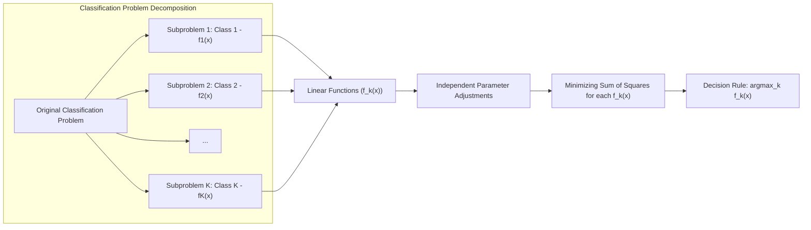
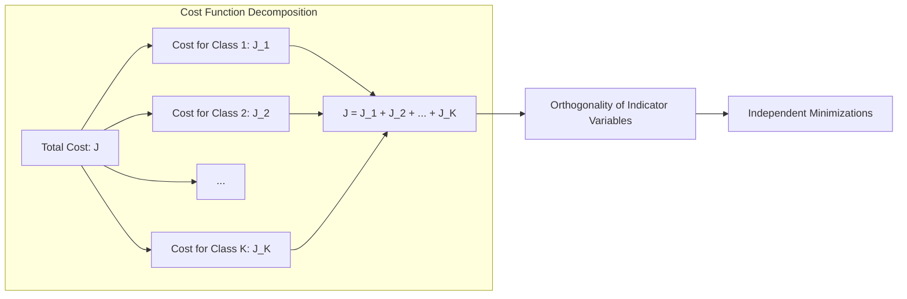
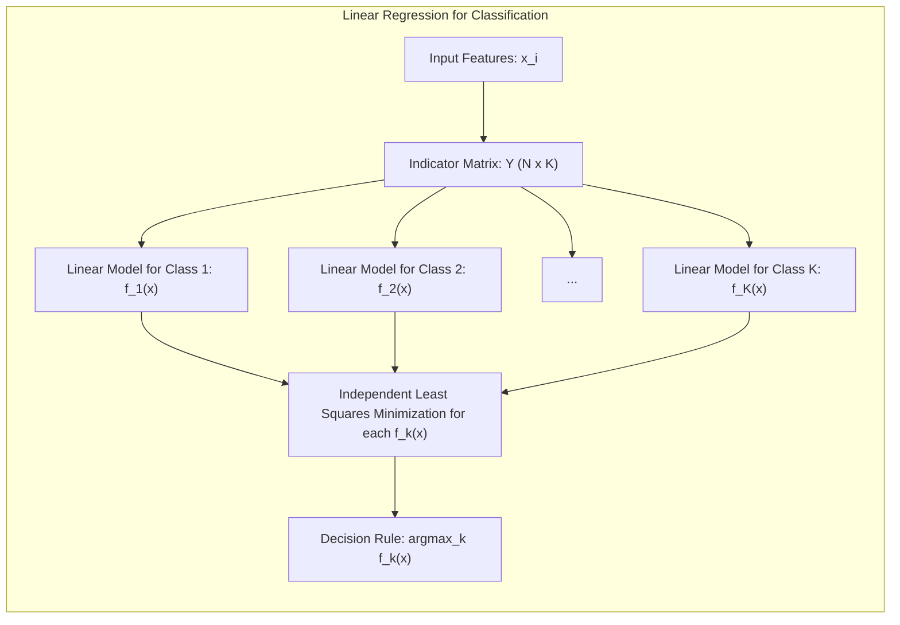
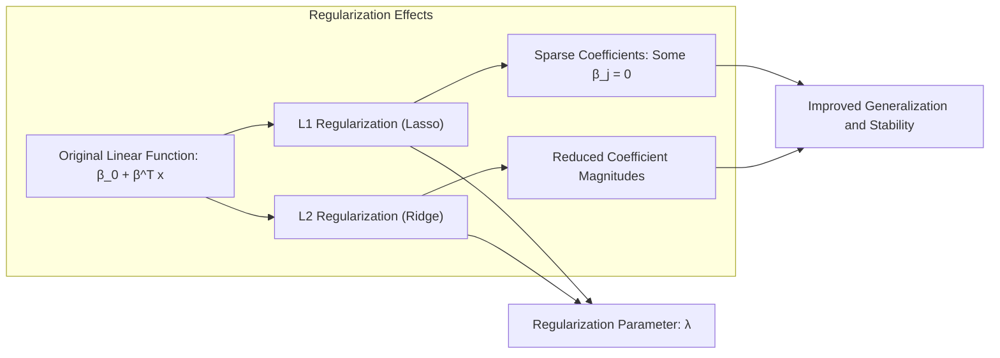
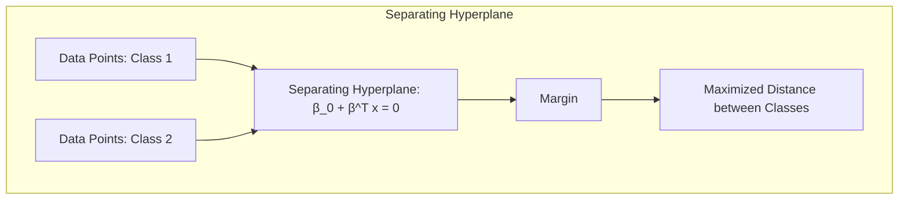
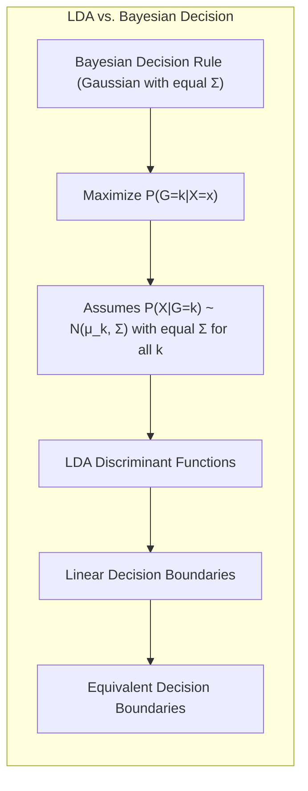

## Título Conciso: Classificação Linear, Seleção de Variáveis e Regularização

### Introdução

Este capítulo explora as consequências da decomposição do problema de classificação em subproblemas independentes, onde cada classe é modelada por uma função linear individualmente. Essa abordagem é fundamental na regressão linear com **matrizes de indicadores**, onde o objetivo é ajustar modelos lineares independentes para cada coluna da matriz de indicadores, correspondente a uma classe [^4.2]. Analisaremos como a separabilidade dos componentes afeta o ajuste do modelo por **mínimos quadrados** e suas implicações na regra de decisão. Além disso, discutiremos como essa abordagem se relaciona com outros métodos de classificação linear, como **Linear Discriminant Analysis (LDA)** e **Logistic Regression**, e exploraremos técnicas de **seleção de variáveis e regularização** para melhorar a robustez e a interpretabilidade dos modelos [^4.3], [^4.4], [^4.4.4]. Abordaremos também o conceito de **hiperplanos separadores** e sua conexão com os modelos lineares [^4.5.2]. O objetivo deste capítulo é fornecer uma visão clara de como a decomposição do problema de classificação impacta a construção e a interpretação dos modelos lineares.

### Conceitos Fundamentais

**Conceito 1: Decomposição em Componentes Separados na Regressão Linear**

Na regressão linear aplicada a matrizes de indicadores para classificação, o problema original é decomposto em $K$ subproblemas independentes, onde $K$ é o número de classes [^4.2]. Cada subproblema consiste em ajustar um modelo linear $f_k(x) = \beta_{k0} + \beta_k^T x$ para a $k$-ésima classe, e o objetivo é minimizar a soma dos quadrados dos erros entre os valores observados e os valores preditos por esse modelo. A independência desses subproblemas implica que o ajuste dos parâmetros para uma classe não afeta o ajuste dos parâmetros para outras classes. Isso simplifica o problema de otimização, mas pode levar a limitações, como a dificuldade de garantir que as estimativas resultantes se comportem como probabilidades.

> 💡 **Exemplo Numérico:**
> Suponha que temos um problema de classificação com $K=3$ classes e um conjunto de dados com $N=5$ amostras. As características de cada amostra são representadas por um vetor $x_i \in \mathbb{R}^2$. A matriz de indicadores $Y$ terá dimensões $5 \times 3$, onde cada linha corresponde a uma amostra e cada coluna a uma classe. Se a amostra $i$ pertence à classe $k$, então $Y_{ik} = 1$, caso contrário, $Y_{ik} = 0$. Por exemplo, se a amostra 1 pertence à classe 1, a amostra 2 à classe 2 e as amostras 3, 4, e 5 à classe 3, a matriz de indicadores seria:
>
> $$
> Y = \begin{bmatrix}
> 1 & 0 & 0 \\
> 0 & 1 & 0 \\
> 0 & 0 & 1 \\
> 0 & 0 & 1 \\
> 0 & 0 & 1
> \end{bmatrix}
> $$
>
> Para cada classe $k$, ajustamos um modelo linear $f_k(x) = \beta_{k0} + \beta_k^T x$.  Por exemplo, para a classe 1, o objetivo é minimizar $\sum_{i=1}^5 (Y_{i1} - (\beta_{10} + \beta_1^T x_i))^2$.  Este processo é repetido para as classes 2 e 3, independentemente.

**Lemma 1:** *Na regressão linear com matrizes de indicadores, a função de custo pode ser decomposta em $K$ termos independentes, onde cada termo corresponde a uma classe. Isso ocorre devido à ortogonalidade das variáveis indicadoras de classe.* A prova desse lema reside na forma da matriz de resposta (matriz de indicadores) e na natureza da soma de quadrados a ser minimizada.

**Conceito 2: Ajuste por Mínimos Quadrados e a Separação dos Componentes**

O ajuste dos parâmetros $\beta_{k0}$ e $\beta_k$ para cada classe $k$ é realizado minimizando a soma dos quadrados dos erros para aquela classe, ou seja:

$$
\min_{\beta_{k0}, \beta_k} \sum_{i=1}^N (y_{ik} - (\beta_{k0} + \beta_k^T x_i))^2
$$

onde $y_{ik}$ é o indicador da classe $k$ para a observação $i$. Essa minimização é realizada independentemente para cada classe, o que significa que o ajuste de um modelo para uma classe não afeta o ajuste para outras classes. A regra de decisão é então aplicar uma nova observação $x$ para a classe $k$ que apresentar o maior valor da função linear ajustada $f_k(x)$, onde:

$$
\hat{G}(x) = \arg\max_k f_k(x)
$$

A separação dos componentes durante o ajuste permite resolver um problema de otimização mais simples, mas, como consequência, não garante que as estimativas $f_k(x)$ se comportem como probabilidades, além de ser vulnerável ao "masking problem" [^4.2].

> 💡 **Exemplo Numérico:**
> Continuando o exemplo anterior, suponha que após a minimização da soma de quadrados para cada classe, obtivemos os seguintes parâmetros:
>
> - Classe 1: $\beta_{10} = 0.5$, $\beta_1 = [0.2, -0.1]^T$
> - Classe 2: $\beta_{20} = -0.2$, $\beta_2 = [-0.1, 0.3]^T$
> - Classe 3: $\beta_{30} = 0.1$, $\beta_3 = [0.3, 0.2]^T$
>
> Uma nova observação $x = [2, 1]^T$ seria classificada da seguinte forma:
>
> - $f_1(x) = 0.5 + (0.2 * 2) + (-0.1 * 1) = 0.5 + 0.4 - 0.1 = 0.8$
> - $f_2(x) = -0.2 + (-0.1 * 2) + (0.3 * 1) = -0.2 - 0.2 + 0.3 = -0.1$
> - $f_3(x) = 0.1 + (0.3 * 2) + (0.2 * 1) = 0.1 + 0.6 + 0.2 = 0.9$
>
> Como $f_3(x)$ é o maior valor, a observação $x$ seria classificada como pertencente à classe 3.

**Corolário 1:** *A separação dos componentes na regressão linear para classificação permite que o ajuste por mínimos quadrados seja realizado independentemente para cada classe.* Este corolário enfatiza a natureza independente dos ajustes e as consequentes vantagens e desvantagens dessa abordagem.

**Conceito 3: Limitações da Independência e a Busca por Métodos Integrados**

A independência dos componentes na regressão linear com matrizes de indicadores, embora simplifique o processo de otimização, apresenta limitações importantes, como a dificuldade de garantir que as estimativas resultantes se comportem como probabilidades e o problema do "masking" [^4.2]. Estas limitações motivam o uso de métodos como LDA e Regressão Logística, que modelam a relação entre as classes de forma mais integrada [^4.3], [^4.4].

> ⚠️ **Nota Importante**:  A separação dos componentes no ajuste da regressão linear com matrizes de indicadores, embora simplifique a otimização, não garante que as estimativas se comportem como probabilidades e pode levar a problemas como o "masking" [^4.2].

> ❗ **Ponto de Atenção**: Em problemas com muitas classes, a independência dos componentes na regressão linear pode levar a resultados subótimos e à necessidade de métodos que considerem a relação entre as classes de forma mais integrada [^4.2].

> ✔️ **Destaque**: A regressão linear com matrizes de indicadores, ao tratar cada classe de forma separada, não modela as inter-relações entre as classes de forma explícita, o que pode levar a resultados menos adequados em algumas situações.

### Regressão Linear e Mínimos Quadrados para Classificação

Na regressão linear para classificação, utilizando matrizes de indicadores, o problema é decomposto em $K$ subproblemas independentes, onde $K$ é o número de classes. Cada um desses subproblemas consiste em ajustar uma função linear $f_k(x) = \beta_{k0} + \beta_k^T x$ para a classe $k$, utilizando o método dos mínimos quadrados [^4.2].

A função de custo a ser minimizada para cada classe $k$ é dada por:

$$
\min_{\beta_{k0}, \beta_k} \sum_{i=1}^N (y_{ik} - (\beta_{k0} + \beta_k^T x_i))^2
$$

onde $y_{ik}$ é o indicador da classe $k$ para a observação $i$. O ajuste para cada classe é realizado independentemente, o que significa que a minimização da função de custo para uma classe não afeta o ajuste dos parâmetros para outras classes. A independência entre os ajustes para cada classe é uma consequência direta da ortogonalidade das colunas da matriz de indicadores, que são mutuamente exclusivas [^4.2].  Após o ajuste, uma nova observação $x$ é classificada na classe $k$ que maximiza o valor da função linear ajustada, ou seja: $\hat{G}(x) = \arg\max_k f_k(x)$.

A separação em componentes independentes simplifica o problema de otimização, pois cada subproblema pode ser resolvido de forma isolada. No entanto, como consequência desta independência, o método não garante que os valores ajustados se comportem como probabilidades, e é vulnerável ao problema do *masking*, onde classes intermediárias podem ser ignoradas [^4.2].

**Lemma 2:** *A decomposição do problema de classificação em subproblemas independentes na regressão com matrizes de indicadores permite a aplicação do método dos mínimos quadrados de forma separada para cada classe.* Esta característica é uma consequência direta da forma da matriz de indicadores e da minimização da soma de quadrados.

**Corolário 2:** *A decisão de classificar uma observação para a classe com o maior valor ajustado é uma consequência direta da minimização da soma de quadrados aplicada a cada classe de forma independente.*  Este corolário reforça a conexão entre o método de ajuste e a regra de decisão utilizada em regressão linear com matrizes de indicadores.

> 💡 **Exemplo Numérico:**
> Suponha um conjunto de dados com 3 amostras e 2 classes, com as seguintes características e classes:
>
> - Amostra 1: $x_1 = [1, 2]^T$, Classe 1 ($y_{11} = 1, y_{12} = 0$)
> - Amostra 2: $x_2 = [2, 1]^T$, Classe 2 ($y_{21} = 0, y_{22} = 1$)
> - Amostra 3: $x_3 = [3, 3]^T$, Classe 1 ($y_{31} = 1, y_{32} = 0$)
>
> A matriz de indicadores seria:
>
> $$
> Y = \begin{bmatrix}
> 1 & 0 \\
> 0 & 1 \\
> 1 & 0
> \end{bmatrix}
> $$
>
> Para a classe 1, o problema de minimização é:
>
> $$
> \min_{\beta_{10}, \beta_1} \sum_{i=1}^3 (y_{i1} - (\beta_{10} + \beta_1^T x_i))^2 = \min_{\beta_{10}, \beta_1} [(1 - (\beta_{10} + \beta_1^T [1, 2]^T))^2 + (0 - (\beta_{10} + \beta_1^T [2, 1]^T))^2 + (1 - (\beta_{10} + \beta_1^T [3, 3]^T))^2]
> $$
>
> Analogamente para a classe 2. Após resolver o problema de minimização, obtemos os parâmetros $\beta_{10}$, $\beta_1$, $\beta_{20}$ e $\beta_2$. Uma nova observação $x_{new} = [2.5, 2.5]^T$ seria classificada na classe que maximizar o valor de $f_k(x_{new})$.

A regressão linear, embora decomponha o problema em componentes separáveis para facilitar o ajuste, não modela a relação entre as classes e não garante que as estimativas resultantes se comportem como probabilidades. Isso destaca a necessidade de modelos que considerem as inter-relações entre as classes, como LDA e Regressão Logística [^4.3], [^4.4].

### Métodos de Seleção de Variáveis e Regularização em Classificação

**Seleção de variáveis** e **regularização** são técnicas cruciais para melhorar a estabilidade e a capacidade de generalização dos modelos lineares de classificação. Em particular, elas podem ser aplicadas à regressão logística, onde a função de custo é modificada pela adição de um termo de penalidade que controla a complexidade do modelo [^4.5].

Na **regressão logística**, a função de custo regularizada pode ser expressa como:

$$
\max_{\beta_0, \beta} \left[ \sum_{i=1}^N \left( y_i (\beta_0 + \beta^T x_i) - \log(1 + e^{\beta_0 + \beta^T x_i}) \right) - \lambda P(\beta) \right]
$$

onde $P(\beta)$ é a penalidade e $\lambda$ é o parâmetro de regularização. A penalidade **L1** (Lasso) é dada por $P(\beta) = \sum_{j=1}^p |\beta_j|$, que induz a esparsidade dos coeficientes, levando à seleção das variáveis mais relevantes [^4.4.4]. A penalidade **L2** (Ridge) é dada por $P(\beta) = \sum_{j=1}^p \beta_j^2$, que reduz a magnitude dos coeficientes, evitando soluções extremas e melhorando a estabilidade do modelo [^4.5].

> 💡 **Exemplo Numérico:**
> Considere um problema de classificação binária com regressão logística e 3 preditores ($x_1, x_2, x_3$). Suponha que, sem regularização, obtivemos os coeficientes: $\beta_0 = -0.5$, $\beta = [1.2, -0.8, 0.5]^T$.
>
> Aplicando regularização L1 (Lasso) com $\lambda = 0.5$, a função de custo se torna:
>
> $$
> \max_{\beta_0, \beta} \left[ \sum_{i=1}^N \left( y_i (\beta_0 + \beta^T x_i) - \log(1 + e^{\beta_0 + \beta^T x_i}) \right) - 0.5 (|\beta_1| + |\beta_2| + |\beta_3|) \right]
> $$
>
> A otimização com a penalidade L1 pode levar a um novo conjunto de coeficientes, por exemplo: $\beta_0 = -0.4$, $\beta = [0.9, -0.5, 0]^T$. Observe que o coeficiente de $x_3$ foi zerado, indicando que a variável $x_3$ foi considerada menos relevante pelo modelo.
>
> Aplicando regularização L2 (Ridge) com $\lambda = 0.5$, a função de custo se torna:
>
> $$
> \max_{\beta_0, \beta} \left[ \sum_{i=1}^N \left( y_i (\beta_0 + \beta^T x_i) - \log(1 + e^{\beta_0 + \beta^T x_i}) \right) - 0.5 (\beta_1^2 + \beta_2^2 + \beta_3^2) \right]
> $$
>
> A otimização com a penalidade L2 pode resultar em um novo conjunto de coeficientes, por exemplo: $\beta_0 = -0.45$, $\beta = [1.0, -0.7, 0.4]^T$.  Neste caso, os coeficientes foram reduzidos em magnitude, mas nenhuma variável foi completamente eliminada.
>
> | Método    | $\beta_0$ | $\beta_1$ | $\beta_2$ | $\beta_3$ |
> |-----------|-----------|-----------|-----------|-----------|
> | Sem Reg. | -0.5      | 1.2       | -0.8      | 0.5       |
> | Lasso     | -0.4      | 0.9       | -0.5      | 0         |
> | Ridge     | -0.45     | 1.0       | -0.7      | 0.4       |

A aplicação de regularização é fundamental para controlar o *overfitting* e melhorar o desempenho em dados não vistos durante o treinamento. A escolha entre L1 e L2 (ou uma combinação das duas), depende do problema específico e das características dos dados.

**Lemma 3:** *A penalidade L1 (Lasso) na regressão logística promove esparsidade nos coeficientes, levando à seleção de variáveis e à criação de modelos mais simples e interpretáveis.* A prova dessa afirmação reside na forma da penalidade e como o processo de otimização afeta os coeficientes [^4.4.4].

**Prova do Lemma 3:** A minimização da função de custo, que inclui o termo de penalidade L1, leva os coeficientes menos relevantes a tornarem-se exatamente zero, uma vez que a derivada da penalidade L1 tem magnitude constante. Isso promove a esparsidade do modelo, mantendo apenas as variáveis mais informativas. [^4.4.3]  $\blacksquare$

**Corolário 3:** *A regularização, ao reduzir a complexidade do modelo, ajuda a mitigar o problema do overfitting e melhora a capacidade de generalização para novos dados, mesmo quando o modelo original é composto por componentes independentes.* Isso ocorre porque as variáveis menos importantes são removidas ou seus coeficientes são reduzidos.

> ⚠️ **Ponto Crucial**: A regularização, seja L1 ou L2, é uma ferramenta fundamental para controlar a complexidade dos modelos lineares e melhorar sua capacidade de generalização, mesmo quando os modelos são ajustados separadamente para cada classe [^4.5].

### Separating Hyperplanes e Perceptrons

O conceito de **hiperplanos separadores** visa encontrar uma fronteira linear que maximize a separação entre as classes, ou seja, que não apenas separe as classes, mas também maximize a distância entre o hiperplano e as amostras mais próximas de cada classe [^4.5.2]. O objetivo é construir um modelo que seja robusto e que generalize bem para novos dados, mesmo quando as classes não estão perfeitamente separadas.

O algoritmo do **Perceptron** é um método iterativo que busca um hiperplano separador ajustando os parâmetros do modelo com base nas amostras classificadas incorretamente [^4.5.1]. O Perceptron, embora seja uma abordagem mais simples, ilustra como modelos lineares podem ser utilizados para separar classes. A separabilidade das classes, no entanto, é uma premissa importante para a convergência do algoritmo [^4.5.1].

> 💡 **Exemplo Numérico:**
> Considere um problema de classificação binária com duas características ($x_1, x_2$). O Perceptron busca um hiperplano (neste caso, uma linha) definido por $\beta_0 + \beta_1 x_1 + \beta_2 x_2 = 0$. Inicialmente, os parâmetros podem ser definidos aleatoriamente, por exemplo, $\beta_0 = 0$, $\beta_1 = 1$, $\beta_2 = 1$.
>
> O algoritmo do Perceptron itera sobre as amostras de treinamento. Se uma amostra é classificada incorretamente, os pesos são atualizados.
>
> Suponha que temos a seguinte amostra classificada incorretamente: $x = [2, 1]^T$, classe 1 (valor esperado = +1) e o valor predito pelo modelo é $\beta_0 + \beta_1 x_1 + \beta_2 x_2 = 0 + 1*2 + 1*1 = 3$, que é positivo (classificado como classe 2).
>
> A atualização dos pesos seria: $\beta_{new} = \beta_{old} + \eta * (y - \hat{y}) * x$, onde $\eta$ é a taxa de aprendizagem e $y$ é o valor correto (+1) e $\hat{y}$ é o valor predito (+1 se >0 e -1 se <=0). Como a classificação foi errada, $\hat{y} = +1$ pois o resultado foi > 0, então, a atualização seria $\beta_{new} = \beta_{old} + \eta * (1 - 1) * x = \beta_{old}$. Precisamos mudar a função de atualização para $\beta_{new} = \beta_{old} + \eta * y * x$ se a classificação foi errada.
>
> Usando $\eta = 0.1$, a atualização seria: $\beta_{new} = [0, 1, 1]^T + 0.1 * 1 * [1, 2, 1]^T = [0.1, 1.2, 1.1]^T$, ou seja, $\beta_0 = 0.1, \beta_1 = 1.2, \beta_2 = 1.1$. O processo se repete até que todas as amostras sejam classificadas corretamente ou um número máximo de iterações seja atingido.

**Teorema:** *Se o conjunto de dados de treinamento é linearmente separável, o algoritmo do Perceptron converge para um hiperplano separador em um número finito de iterações.* Este teorema, demonstra a propriedade de convergência do algoritmo em um cenário ideal,  onde a separação linear é possível [^4.5.1].

### Pergunta Teórica Avançada: Quais as diferenças fundamentais entre a formulação de LDA e a Regra de Decisão Bayesiana considerando distribuições Gaussianas com covariâncias iguais?

**Resposta:**

A **Regra de Decisão Bayesiana** busca classificar uma observação $x$ na classe $k$ que maximize a probabilidade posterior $P(G=k|X=x)$ [^4.3].  Sob a suposição de que as distribuições condicionais $P(X|G=k)$ são Gaussianas com a mesma matriz de covariância $\Sigma$, a regra de decisão Bayesiana é dada por:

$$
\hat{G}(x) = \arg\max_k P(G=k|X=x) = \arg\max_k \frac{ \phi(x;\mu_k,\Sigma)\pi_k}{\sum_{l=1}^K \phi(x;\mu_l,\Sigma)\pi_l}
$$

onde $\phi(x;\mu_k,\Sigma)$ é a função densidade gaussiana da classe $k$, e $\pi_k$ é a probabilidade a priori da classe. O **LDA** deriva suas funções discriminantes lineares diretamente dessas suposições, buscando uma separação ótima entre as classes.

**Lemma 4:** *Sob a suposição de que os dados seguem distribuições Gaussianas com a mesma matriz de covariância, a regra de decisão Bayesiana e as funções discriminantes do LDA levam à mesma fronteira de decisão linear.* A equivalência é demonstrada mostrando que a maximização da probabilidade posterior na regra de decisão Bayesiana resulta na mesma forma da função discriminante do LDA [^4.3].

**Corolário 4:** *A remoção da restrição de igualdade de covariâncias no QDA leva a funções discriminantes quadráticas e não mais a um hiperplano.* Isso reflete como a escolha das suposições sobre a distribuição dos dados impacta na complexidade da fronteira de decisão. A diferença entre LDA e a regra Bayesiana surge quando a premissa de covariâncias iguais é relaxada [^4.3.1], [^4.3.3].

> 💡 **Exemplo Numérico:**
> Suponha duas classes com distribuições gaussianas e covariância iguais.
>
> Classe 1: $\mu_1 = [1, 1]^T$, $\Sigma = \begin{bmatrix} 1 & 0 \\ 0 & 1 \end{bmatrix}$, $\pi_1 = 0.5$
>
> Classe 2: $\mu_2 = [3, 3]^T$, $\Sigma = \begin{bmatrix} 1 & 0 \\ 0 & 1 \end{bmatrix}$, $\pi_2 = 0.5$
>
> A regra de decisão Bayesiana, sob a suposição de covariâncias iguais, leva a uma fronteira de decisão linear. O LDA também encontra uma fronteira linear sob essas condições, e ambas serão equivalentes.
>
> Se as covariâncias fossem diferentes, por exemplo, $\Sigma_1 = \begin{bmatrix} 1 & 0 \\ 0 & 0.5 \end{bmatrix}$ e $\Sigma_2 = \begin{bmatrix} 0.5 & 0 \\ 0 & 1 \end{bmatrix}$, a regra de decisão Bayesiana levaria a uma fronteira de decisão quadrática e o QDA seria mais apropriado.

> ⚠️ **Ponto Crucial**: A principal diferença entre LDA e a regra de decisão Bayesiana está na abordagem da modelagem. LDA impõe uma restrição da igualdade de covariâncias, enquanto a regra de decisão Bayesiana, sob a mesma suposição, leva aos mesmos resultados [^4.3].

### Conclusão

Neste capítulo, exploramos a consequência de modelar cada classe com uma função linear separadamente em modelos lineares de classificação. Analisamos a conexão entre essa abordagem e a minimização da soma de quadrados, e como isso impacta a regra de decisão. Discutimos as limitações dessa abordagem, como o "masking" e a falta de garantia de que as estimativas se comportem como probabilidades, e vimos como a seleção de variáveis e a regularização podem ser usadas para mitigar esses problemas. A comparação com LDA e a regra de decisão Bayesiana também forneceu uma perspectiva valiosa sobre a base teórica de diferentes métodos de classificação. Ao longo deste capítulo, enfatizamos a importância de entender a natureza independente do ajuste para cada classe na regressão linear e como essa característica se relaciona com as limitações do método.

### Footnotes

[^4.1]: *In this chapter we revisit the classification problem and focus on linear methods for classification...There are several different ways in which linear decision boundaries can be found.* *(Trecho de Linear Methods for Classification)*

[^4.2]: *In Chapter 2 we fit linear regression models to the class indicator variables, and classify to the largest fit...Linear inequalities in this space are quadratic inequalities in the original space.* *(Trecho de Linear Methods for Classification)*

[^4.3]: *Decision theory for classification (Section 2.4) tells us that we need to know the class posteriors Pr(G|X) for optimal classification. Suppose fk(x) is the class-conditional density of X in class G = k, and let πκ be the prior probability of class k... Linear discriminant analysis (LDA) arises in the special case when we assume that the classes have a common covariance matrix Σk = Σ.* *(Trecho de Linear Methods for Classification)*

[^4.3.1]: *The decision boundary between each pair of classes k and l is described by a quadratic equation {x: δκ(x) = δ(x)}.* *(Trecho de Linear Methods for Classification)*

[^4.3.3]: *In the special case when we assume that the classes have a common covariance matrix...When the classes are really Gaussian, then LDA is optimal* *(Trecho de Linear Methods for Classification)*

[^4.4]: *The logistic regression model arises from the desire to model the posterior probabilities of the K classes via linear functions in x, while at the same time ensuring that they sum to one and remain in [0,1].* *(Trecho de Linear Methods for Classification)*

[^4.4.1]: *Logistic regression models are usually fit by maximum likelihood... The logistic regression model is more general, in that it makes less assumptions.* *(Trecho de Linear Methods for Classification)*

[^4.4.2]: *It is convenient to code the two-class gi via a 0/1 response Yi, where yi = 1 when gi = 1, and yi = 0 when gi = 2... Typically many models are fit in a search for a parsimonious model involving a subset of the variables.* *(Trecho de Linear Methods for Classification)*

[^4.4.3]: *To maximize the log-likelihood, we set its derivatives to zero. These score equations are...To solve the score equations (4.21), we use the Newton-Raphson algorithm...* *(Trecho de Linear Methods for Classification)*

[^4.4.4]: *The L1 penalty used in the lasso (Section 3.4.2) can be used for variable selection and shrinkage with any linear regression model...As with the lasso, we typically do not penalize the intercept term.* *(Trecho de Linear Methods for Classification)*

[^4.5]: *Here we present an analysis of binary data to illustrate the traditional statistical use of the logistic regression model... With two classes there is a simple correspondence between linear discriminant analysis and classification by linear least squares, as in (4.5).* *(Trecho de Linear Methods for Classification)*

[^4.5.1]: *The perceptron learning algorithm tries to find a separating hyperplane by minimizing the distance of misclassified points to the decision boundary.* *(Trecho de Linear Methods for Classification)*

[^4.5.2]: *The optimal separating hyperplane separates the two classes and maximizes the distance to the closest point from either class... In light of (4.40), the constraints define an empty slab or margin around the linear decision boundary...* *(Trecho de Linear Methods for Classification)*
