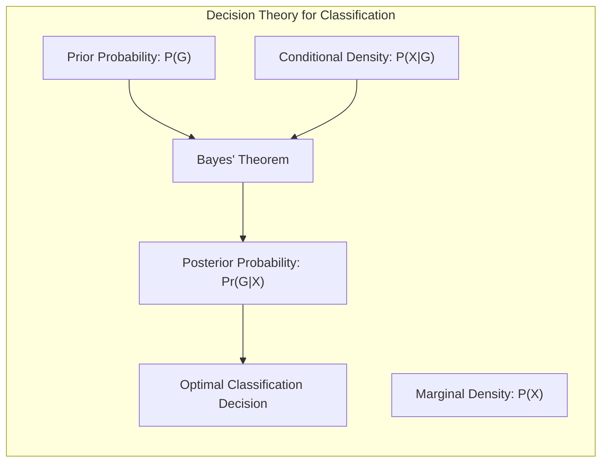
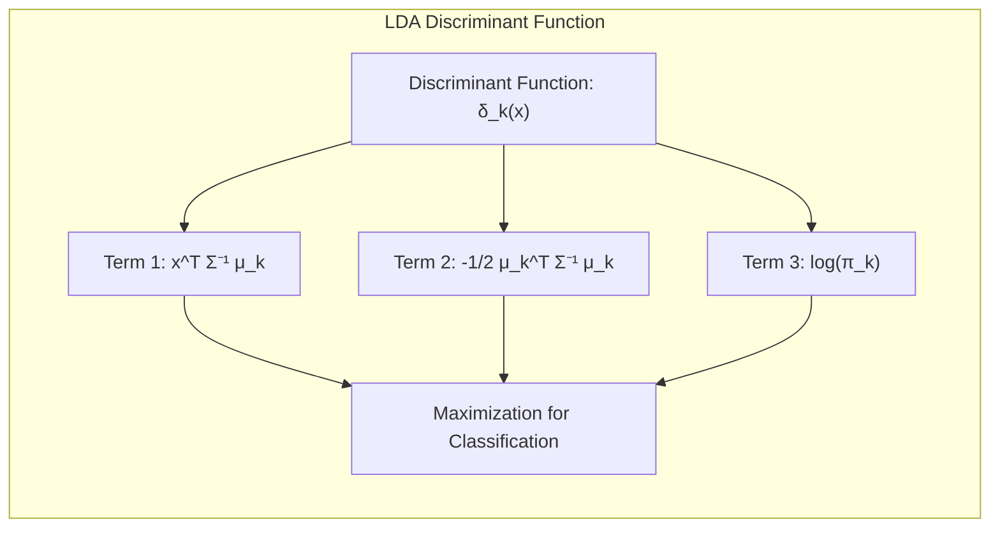
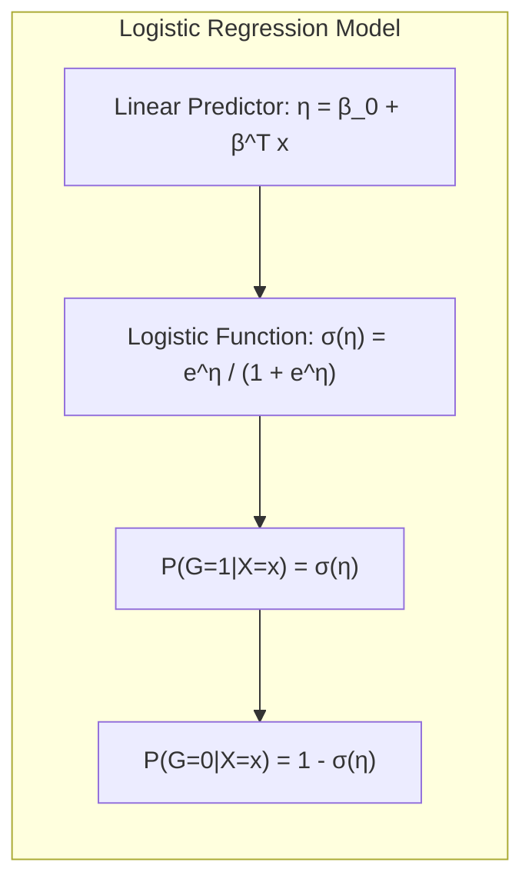
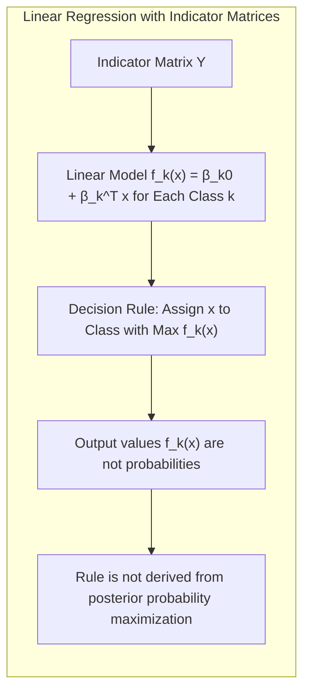
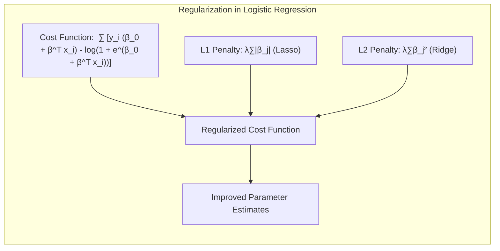
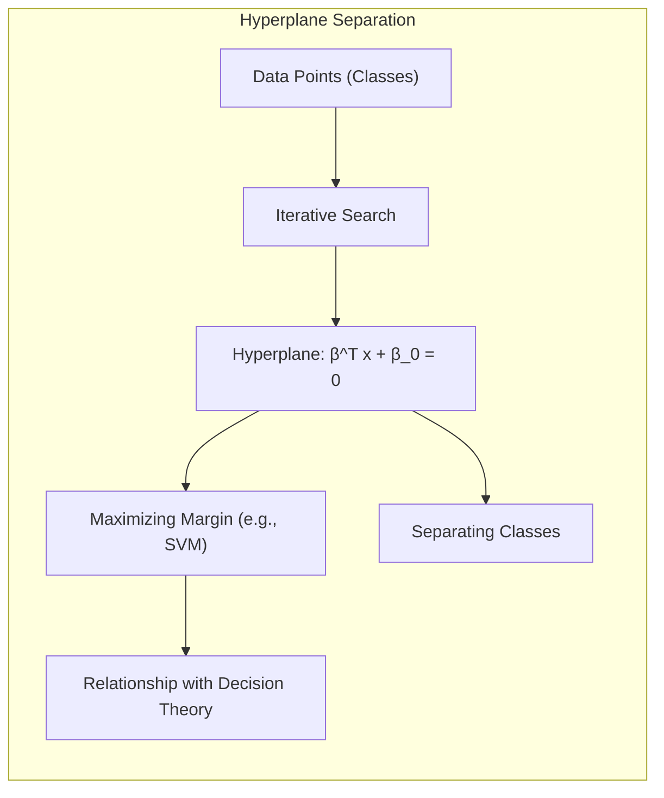
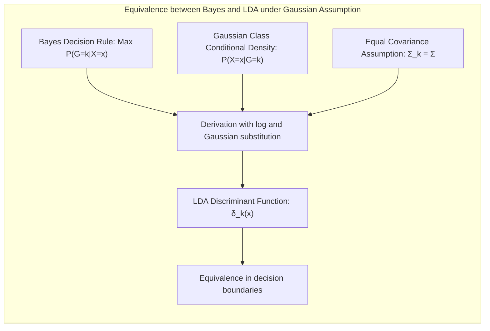

## Título Conciso: Classificação Linear, Seleção de Variáveis e Regularização

### Introdução

Este capítulo explora a fundo a **teoria de decisão** para classificação, enfatizando o papel fundamental das **probabilidades posteriores das classes**, $Pr(G|X=x)$, na tomada de decisões ótimas [^4.3]. A teoria de decisão fornece um arcabouço para entender como as decisões de classificação devem ser tomadas, levando em consideração tanto a distribuição dos dados quanto as probabilidades a priori das classes. Vamos analisar como essa teoria se conecta com métodos lineares de classificação, como **Linear Discriminant Analysis (LDA)** e **Logistic Regression**, explorando como esses métodos modelam ou estimam as probabilidades posteriores [^4.3], [^4.4]. Além disso, discutiremos as limitações da **regressão linear com matrizes de indicadores**, que não modela as probabilidades posteriores de forma direta [^4.2]. Abordaremos também a importância da **seleção de variáveis e regularização** para obter modelos mais robustos e com melhor capacidade de generalização [^4.4.4], [^4.5]. O conceito de **hiperplanos separadores** também será discutido em relação à teoria de decisão [^4.5.2]. O objetivo deste capítulo é fornecer uma visão aprofundada e detalhada de como a teoria de decisão orienta a construção de modelos de classificação.

### Conceitos Fundamentais

**Conceito 1: A Base da Teoria de Decisão e Probabilidades Posteriores**

A **teoria de decisão** para classificação estabelece que a decisão ótima de classificar uma observação $x$ em uma classe $G$ deve ser baseada na probabilidade posterior $Pr(G|X=x)$, que representa a probabilidade de $x$ pertencer à classe $G$ dado o valor de $x$ [^4.3]. A regra de decisão Bayesiana atribui a observação $x$ à classe $k$ que maximiza a probabilidade posterior:

$$
\hat{G}(x) = \arg\max_k Pr(G=k|X=x)
$$

Essa regra de decisão é considerada ótima porque minimiza o risco esperado de erro de classificação. As probabilidades posteriores são derivadas do Teorema de Bayes:

$$
Pr(G=k|X=x) = \frac{P(X=x|G=k)P(G=k)}{P(X=x)}
$$

onde $P(X=x|G=k)$ é a densidade condicional da observação $x$ dada a classe $k$, $P(G=k)$ é a probabilidade a priori da classe $k$ e $P(X=x)$ é a densidade marginal da observação $x$.

> 💡 **Exemplo Numérico:**
>
> Considere um problema de classificação binária com duas classes, $G=0$ e $G=1$. Suponha que temos uma observação $x$ e as seguintes probabilidades:
>
> - Probabilidade a priori da classe 0: $P(G=0) = 0.6$
> - Probabilidade a priori da classe 1: $P(G=1) = 0.4$
> - Densidade condicional de $x$ dada a classe 0: $P(X=x|G=0) = 0.2$
> - Densidade condicional de $x$ dada a classe 1: $P(X=x|G=1) = 0.7$
>
> Podemos calcular a probabilidade marginal $P(X=x)$ usando a lei da probabilidade total:
>
> $P(X=x) = P(X=x|G=0)P(G=0) + P(X=x|G=1)P(G=1) = (0.2)(0.6) + (0.7)(0.4) = 0.12 + 0.28 = 0.4$
>
> Agora, podemos calcular as probabilidades posteriores:
>
> $Pr(G=0|X=x) = \frac{P(X=x|G=0)P(G=0)}{P(X=x)} = \frac{(0.2)(0.6)}{0.4} = \frac{0.12}{0.4} = 0.3$
>
> $Pr(G=1|X=x) = \frac{P(X=x|G=1)P(G=1)}{P(X=x)} = \frac{(0.7)(0.4)}{0.4} = \frac{0.28}{0.4} = 0.7$
>
> De acordo com a regra de decisão Bayesiana, classificaríamos $x$ na classe 1, pois $Pr(G=1|X=x) > Pr(G=0|X=x)$.

**Lemma 1:** *A regra de decisão Bayesiana, baseada na maximização da probabilidade posterior, é ótima no sentido de que minimiza o risco esperado de erro de classificação.* Este lema destaca a importância da teoria de decisão e das probabilidades posteriores como base para modelos de classificação.

**Conceito 2: LDA e a Estimação das Probabilidades Posteriores**

O **LDA** busca estimar as probabilidades posteriores $Pr(G=k|X=x)$ assumindo que as classes seguem distribuições Gaussianas multivariadas com a mesma matriz de covariância $\Sigma$ [^4.3]. Sob essa suposição, a regra de decisão do LDA é equivalente a classificar $x$ na classe $k$ que maximize a função discriminante:

$$
\delta_k(x) = x^T \Sigma^{-1} \mu_k - \frac{1}{2} \mu_k^T \Sigma^{-1} \mu_k + \log \pi_k
$$

onde $\mu_k$ é o vetor de médias da classe $k$ e $\pi_k$ é a probabilidade a priori da classe. A função discriminante do LDA é uma aproximação para o log das probabilidades posteriores e, portanto, leva a decisões de classificação que são, sob certas condições, equivalentes à regra de decisão Bayesiana [^4.3].

> 💡 **Exemplo Numérico:**
>
> Considere um problema de classificação com duas classes e duas variáveis preditoras. Suponha que as médias das classes são:
>
> $\mu_1 = \begin{bmatrix} 1 \\ 2 \end{bmatrix}$ e $\mu_2 = \begin{bmatrix} 3 \\ 1 \end{bmatrix}$
>
> E a matriz de covariância comum é:
>
> $\Sigma = \begin{bmatrix} 1 & 0.5 \\ 0.5 & 1 \end{bmatrix}$
>
> As probabilidades a priori são:
>
> $\pi_1 = 0.4$ e $\pi_2 = 0.6$
>
> Vamos calcular a função discriminante para um ponto $x = \begin{bmatrix} 2 \\ 2 \end{bmatrix}$.
>
> Primeiro, calculamos $\Sigma^{-1}$:
>
> $\Sigma^{-1} = \frac{1}{1 - 0.5^2} \begin{bmatrix} 1 & -0.5 \\ -0.5 & 1 \end{bmatrix} = \frac{1}{0.75} \begin{bmatrix} 1 & -0.5 \\ -0.5 & 1 \end{bmatrix} = \begin{bmatrix} 1.33 & -0.67 \\ -0.67 & 1.33 \end{bmatrix}$
>
> Agora, calculamos $\delta_1(x)$ e $\delta_2(x)$:
>
> $\delta_1(x) = x^T \Sigma^{-1} \mu_1 - \frac{1}{2} \mu_1^T \Sigma^{-1} \mu_1 + \log \pi_1$
>
> $\delta_1(x) = \begin{bmatrix} 2 & 2 \end{bmatrix} \begin{bmatrix} 1.33 & -0.67 \\ -0.67 & 1.33 \end{bmatrix} \begin{bmatrix} 1 \\ 2 \end{bmatrix} - \frac{1}{2} \begin{bmatrix} 1 & 2 \end{bmatrix} \begin{bmatrix} 1.33 & -0.67 \\ -0.67 & 1.33 \end{bmatrix} \begin{bmatrix} 1 \\ 2 \end{bmatrix} + \log(0.4)$
>
> $\delta_1(x) = \begin{bmatrix} 2 & 2 \end{bmatrix} \begin{bmatrix} 0 \\ 2 \end{bmatrix} - \frac{1}{2} \begin{bmatrix} 1 & 2 \end{bmatrix} \begin{bmatrix} 0 \\ 2 \end{bmatrix} + \log(0.4)$
>
> $\delta_1(x) = 4 - \frac{1}{2} (4) + \log(0.4) = 4 - 2 - 0.916 = 1.084$
>
> $\delta_2(x) = x^T \Sigma^{-1} \mu_2 - \frac{1}{2} \mu_2^T \Sigma^{-1} \mu_2 + \log \pi_2$
>
> $\delta_2(x) = \begin{bmatrix} 2 & 2 \end{bmatrix} \begin{bmatrix} 1.33 & -0.67 \\ -0.67 & 1.33 \end{bmatrix} \begin{bmatrix} 3 \\ 1 \end{bmatrix} - \frac{1}{2} \begin{bmatrix} 3 & 1 \end{bmatrix} \begin{bmatrix} 1.33 & -0.67 \\ -0.67 & 1.33 \end{bmatrix} \begin{bmatrix} 3 \\ 1 \end{bmatrix} + \log(0.6)$
>
> $\delta_2(x) = \begin{bmatrix} 2 & 2 \end{bmatrix} \begin{bmatrix} 3.33 \\ -0.67 \end{bmatrix} - \frac{1}{2} \begin{bmatrix} 3 & 1 \end{bmatrix} \begin{bmatrix} 3.33 \\ -0.67 \end{bmatrix} + \log(0.6)$
>
> $\delta_2(x) = 5.32 - \frac{1}{2}(9.32) + \log(0.6) = 5.32 - 4.66 - 0.51 = 0.15$
>
> Como $\delta_1(x) > \delta_2(x)$, classificaríamos $x$ na classe 1.

**Corolário 1:** *A regra de decisão do LDA, sob a suposição de distribuições gaussianas com covariâncias iguais, é uma aproximação da regra de decisão Bayesiana, e ambas levam à mesma fronteira de decisão.* Este corolário estabelece uma conexão teórica entre LDA e a teoria de decisão.

**Conceito 3: Regressão Logística e a Modelagem Direta das Probabilidades Posteriores**

A **Regressão Logística**, por sua vez, modela diretamente as probabilidades posteriores, usando uma função logística para garantir que as probabilidades estejam no intervalo [0,1] [^4.4].  Para um problema de classificação binária, a probabilidade de $x$ pertencer à classe 1 é modelada como:

$$
P(G=1|X=x) = \frac{e^{\beta_0 + \beta^T x}}{1 + e^{\beta_0 + \beta^T x}}
$$

e a probabilidade para a classe 0 é $1 - P(G=1|X=x)$. A Regressão Logística estima os parâmetros $\beta_0$ e $\beta$ por maximização da verossimilhança, o que garante que o modelo se ajuste aos dados e, ao mesmo tempo, modele diretamente as probabilidades posteriores. A regra de decisão na regressão logística também atribui $x$ à classe com a maior probabilidade posterior.

> 💡 **Exemplo Numérico:**
>
> Vamos considerar um modelo de regressão logística com uma variável preditora, $x$, e parâmetros estimados $\beta_0 = -2$ e $\beta_1 = 1.5$.
>
> Para um ponto $x=1$, a probabilidade de pertencer à classe 1 é:
>
> $P(G=1|X=1) = \frac{e^{-2 + 1.5 \cdot 1}}{1 + e^{-2 + 1.5 \cdot 1}} = \frac{e^{-0.5}}{1 + e^{-0.5}} = \frac{0.6065}{1 + 0.6065} = \frac{0.6065}{1.6065} \approx 0.3775$
>
> A probabilidade de pertencer à classe 0 é:
>
> $P(G=0|X=1) = 1 - P(G=1|X=1) = 1 - 0.3775 = 0.6225$
>
> Neste caso, o modelo classificaria o ponto $x=1$ na classe 0, pois $P(G=0|X=1) > P(G=1|X=1)$.
>
> Se tivéssemos um ponto $x=2$:
>
> $P(G=1|X=2) = \frac{e^{-2 + 1.5 \cdot 2}}{1 + e^{-2 + 1.5 \cdot 2}} = \frac{e^{1}}{1 + e^{1}} = \frac{2.718}{1 + 2.718} = \frac{2.718}{3.718} \approx 0.731$
>
> $P(G=0|X=2) = 1 - 0.731 = 0.269$
>
> Neste caso, o modelo classificaria o ponto $x=2$ na classe 1, pois $P(G=1|X=2) > P(G=0|X=2)$.

> ⚠️ **Nota Importante**: Tanto LDA quanto a Regressão Logística buscam modelar ou estimar as probabilidades posteriores das classes, embora utilizem abordagens distintas [^4.3], [^4.4].

> ❗ **Ponto de Atenção**: A escolha entre LDA e Regressão Logística depende das suposições sobre a distribuição dos dados e do problema específico, sendo que cada um apresenta vantagens e desvantagens.

> ✔️ **Destaque**: A teoria de decisão fornece um arcabouço teórico para entender como modelos de classificação devem ser construídos, com base nas probabilidades posteriores das classes.

### Regressão Linear e Mínimos Quadrados para Classificação

A regressão linear com **matrizes de indicadores** utiliza uma abordagem diferente para problemas de classificação, onde cada classe $k$ é representada por um vetor indicador $Y_k$, e o objetivo é ajustar um modelo linear a cada coluna da matriz $Y$ [^4.2]. O modelo ajustado para cada classe $k$ é dado por $f_k(x) = \beta_{k0} + \beta_k^T x$, e a decisão de classificação é feita atribuindo $x$ à classe que maximiza $f_k(x)$.

Embora essa abordagem utilize um modelo linear, ela não modela diretamente as probabilidades posteriores $Pr(G|X=x)$. As saídas $f_k(x)$ podem assumir valores fora do intervalo [0, 1], e a maximização de $f_k(x)$ não corresponde à maximização da probabilidade posterior, o que a torna menos adequada sob a perspectiva da teoria de decisão [^4.2]. A regressão linear com matrizes de indicadores não leva em consideração as probabilidades a priori das classes, que são componentes fundamentais da probabilidade posterior.

> 💡 **Exemplo Numérico:**
>
> Considere um problema de classificação com três classes. Utilizamos matrizes de indicadores para representar as classes, onde cada coluna representa uma classe:
>
> $Y = \begin{bmatrix} 1 & 0 & 0 \\ 0 & 1 & 0 \\ 0 & 0 & 1 \\ 1 & 0 & 0 \\ 0 & 1 & 0 \end{bmatrix}$
>
> Temos duas variáveis preditoras $x_1$ e $x_2$. Após ajustar um modelo de regressão linear para cada coluna de Y, obtemos os seguintes modelos:
>
> $f_1(x) = 0.2 + 0.5x_1 - 0.3x_2$
> $f_2(x) = 0.1 - 0.2x_1 + 0.7x_2$
> $f_3(x) = -0.3 + 0.1x_1 + 0.2x_2$
>
> Para um ponto $x = \begin{bmatrix} 1 \\ 1 \end{bmatrix}$, temos:
>
> $f_1(x) = 0.2 + 0.5(1) - 0.3(1) = 0.4$
> $f_2(x) = 0.1 - 0.2(1) + 0.7(1) = 0.6$
> $f_3(x) = -0.3 + 0.1(1) + 0.2(1) = 0$
>
> A regra de decisão da regressão linear atribuiria $x$ à classe 2, pois $f_2(x)$ é o maior valor. No entanto, esses valores não são probabilidades e podem estar fora do intervalo [0,1].

Em resumo, a regressão linear com matriz de indicadores, embora seja uma forma de obter uma fronteira de decisão linear, não é diretamente baseada na maximização das probabilidades posteriores, ao contrário do LDA e da Regressão Logística, e sofre com problemas como o "masking" [^4.2].

**Lemma 2:** *A regressão linear com matrizes de indicadores não estima diretamente as probabilidades posteriores $Pr(G|X=x)$, e as saídas do modelo ajustado podem não estar no intervalo [0,1].* Este lema destaca a principal limitação da regressão linear como classificador do ponto de vista da teoria de decisão.

**Corolário 2:** *A regra de decisão da regressão linear, que atribui a classe com o maior valor de saída, não é equivalente à regra de decisão Bayesiana, que busca maximizar a probabilidade posterior.* Este corolário estabelece uma distinção fundamental entre a regressão linear e outros métodos de classificação lineares.

A regressão linear com matrizes de indicadores, portanto, não modela diretamente as probabilidades posteriores, o que dificulta a sua interpretação sob o ponto de vista da teoria de decisão. Métodos como LDA e Regressão Logística, que buscam aproximar ou modelar as probabilidades posteriores, são mais alinhados com os princípios da teoria de decisão [^4.3], [^4.4].

### Métodos de Seleção de Variáveis e Regularização em Classificação

**Seleção de variáveis** e **regularização** são técnicas essenciais para a construção de modelos de classificação mais robustos e com melhor capacidade de generalização, mesmo quando o foco está na estimativa das probabilidades posteriores [^4.5].  A regularização, em particular, adiciona um termo de penalidade à função de custo, o que restringe os valores dos coeficientes do modelo e evita o *overfitting*.

Na **regressão logística**, que busca modelar diretamente as probabilidades posteriores, a função de custo regularizada pode ser expressa como:

$$
\max_{\beta_0, \beta} \left[ \sum_{i=1}^N \left( y_i (\beta_0 + \beta^T x_i) - \log(1 + e^{\beta_0 + \beta^T x_i}) \right) - \lambda P(\beta) \right]
$$

onde $P(\beta)$ é a penalidade e $\lambda$ é o parâmetro de regularização. A penalidade **L1** (Lasso) é dada por $P(\beta) = \sum_{j=1}^p |\beta_j|$, que promove a esparsidade dos coeficientes, selecionando as variáveis mais relevantes [^4.4.4].  A penalidade **L2** (Ridge) é dada por $P(\beta) = \sum_{j=1}^p \beta_j^2$, que reduz a magnitude dos coeficientes e estabiliza o modelo, reduzindo o risco de *overfitting* [^4.5].

> 💡 **Exemplo Numérico:**
>
> Suponha que temos um modelo de regressão logística com duas variáveis preditoras, $x_1$ e $x_2$, e que o modelo sem regularização resulta nos seguintes coeficientes: $\beta_0 = -1$, $\beta_1 = 3$ e $\beta_2 = -2$.
>
> 1. **Regularização L1 (Lasso):**
>   - Se aplicarmos uma regularização L1 com $\lambda = 0.5$, a função de custo será penalizada pela soma dos valores absolutos dos coeficientes. Isso pode levar a alguns coeficientes a se tornarem exatamente zero.
>   - Suponha que após a regularização L1, os coeficientes são: $\beta_0 = -0.8$, $\beta_1 = 1.5$ e $\beta_2 = 0$. A variável $x_2$ foi eliminada do modelo.
>
> 2. **Regularização L2 (Ridge):**
>   - Se aplicarmos uma regularização L2 com $\lambda = 0.5$, a função de custo será penalizada pela soma dos quadrados dos coeficientes. Isso reduz a magnitude dos coeficientes, mas geralmente não os zera.
>   - Suponha que após a regularização L2, os coeficientes são: $\beta_0 = -0.9$, $\beta_1 = 2$ e $\beta_2 = -1.5$. Os coeficientes foram reduzidos em magnitude.
>
> A regularização L1 selecionou a variável mais importante (x1), enquanto a regularização L2 reduziu a magnitude de todos os coeficientes, tornando o modelo mais estável.

A aplicação de regularização é fundamental para garantir que as estimativas das probabilidades posteriores sejam mais precisas e generalizáveis para novos dados. Ao controlar a complexidade do modelo e selecionar as variáveis mais relevantes, a regularização melhora a qualidade da estimativa da probabilidade posterior.

**Lemma 3:** *A regularização L1 na regressão logística, ao promover esparsidade, leva a uma estimativa mais simples e interpretável da probabilidade posterior, eliminando o impacto de variáveis menos relevantes.* A demonstração deste lema é dada pela forma da penalidade L1 e como esta leva à esparsidade.

**Prova do Lemma 3:** A penalidade L1 impõe uma taxa constante de decréscimo nos coeficientes durante a otimização, levando alguns a tornarem-se exatamente zero. Isso resulta em modelos que são mais simples e que se baseiam em um número menor de variáveis, e a probabilidade posterior é estimada de forma mais concisa [^4.4.3], [^4.4.4]. $\blacksquare$

**Corolário 3:** *A regularização, tanto L1 quanto L2, contribui para uma melhor estimativa das probabilidades posteriores, controlando a complexidade do modelo e evitando o overfitting.*  A regularização melhora a capacidade do modelo de generalizar para dados não observados.

> ⚠️ **Ponto Crucial**: A regularização, ao controlar a complexidade dos modelos, melhora a qualidade da estimativa das probabilidades posteriores e evita problemas de *overfitting*, que são cruciais na aplicação de métodos lineares para classificação. [^4.5].

### Separating Hyperplanes e Perceptrons

A ideia de **hiperplanos separadores** visa encontrar uma fronteira linear que maximize a separação entre as classes, buscando não apenas separar as classes, mas também minimizar o risco de erro de classificação [^4.5.2]. Em modelos como o SVM, o objetivo é encontrar o hiperplano que maximize a margem, que representa a distância entre o hiperplano e as amostras mais próximas de cada classe.

O algoritmo do **Perceptron**, por sua vez, busca um hiperplano separador de forma iterativa, ajustando os parâmetros com base nas classificações incorretas [^4.5.1]. O Perceptron, apesar de sua simplicidade, ilustra como modelos lineares podem ser utilizados para tomar decisões de classificação. No entanto, ele não garante a maximização da margem e pode não ser uma representação fiel das probabilidades posteriores.

> 💡 **Exemplo Numérico:**
>
> Considere um conjunto de dados em duas dimensões com duas classes. O objetivo do Perceptron é encontrar um hiperplano (uma linha, neste caso) que separe as duas classes.
>
> Suponha que temos os seguintes dados:
>
> Classe 1:  $x_1 = \begin{bmatrix} 1 \\ 1 \end{bmatrix}$, $x_2 = \begin{bmatrix} 2 \\ 1 \end{bmatrix}$
>
> Classe 2:  $x_3 = \begin{bmatrix} 0 \\ 0 \end{bmatrix}$, $x_4 = \begin{bmatrix} 1 \\ 0 \end{bmatrix}$
>
> O Perceptron busca um hiperplano definido por $\beta^T x + \beta_0 = 0$. Inicializamos $\beta$ com valores aleatórios e iterativamente ajustamos $\beta$ e $\beta_0$ com base em erros de classificação.
>
> 1. Inicialização: $\beta = \begin{bmatrix} 0.1 \\ -0.2 \end{bmatrix}$, $\beta_0 = 0.3$
>
> 2. Para $x_1$: $0.1(1) - 0.2(1) + 0.3 = 0.2 > 0$, classificado corretamente.
>
> 3. Para $x_2$: $0.1(2) - 0.2(1) + 0.3 = 0.3 > 0$, classificado corretamente.
>
> 4. Para $x_3$: $0.1(0) - 0.2(0) + 0.3 = 0.3 > 0$, classificado incorretamente. Ajustamos: $\beta = \beta - \eta x_3 =  \begin{bmatrix} 0.1 \\ -0.2 \end{bmatrix} - \eta \begin{bmatrix} 0 \\ 0 \end{bmatrix}$, $\beta_0 = \beta_0 - \eta = 0.3 - \eta$, onde $\eta$ é a taxa de aprendizado.
>
> 5. Para $x_4$: $0.1(1) - 0.2(0) + 0.3 = 0.4 > 0$, classificado incorretamente. Ajustamos: $\beta = \beta - \eta x_4 =  \begin{bmatrix} 0.1 \\ -0.2 \end{bmatrix} - \eta \begin{bmatrix} 1 \\ 0 \end{bmatrix}$, $\beta_0 = \beta_0 - \eta = 0.3 - \eta$.
>
> As iterações continuam até que todos os pontos sejam classificados corretamente. O hiperplano resultante separa as duas classes, mas não necessariamente maximiza a margem.

**Teorema:** *O algoritmo do Perceptron converge para um hiperplano separador em um número finito de passos, se o conjunto de dados de treinamento for linearmente separável.* Este teorema, mostra uma condição específica onde a convergência para uma solução ótima é garantida sob uma perspectiva da teoria de decisão [^4.5.1].

### Pergunta Teórica Avançada: Quais as diferenças fundamentais entre a formulação de LDA e a Regra de Decisão Bayesiana considerando distribuições Gaussianas com covariâncias iguais?

**Resposta:**

A **Regra de Decisão Bayesiana** busca maximizar a probabilidade posterior $P(G=k|X=x)$ para classificar uma observação $x$, onde:

$$
P(G=k|X=x) = \frac{P(X=x|G=k)P(G=k)}{P(X=x)}
$$

Sob a suposição de distribuições Gaussianas com a mesma matriz de covariância $\Sigma$, a regra de decisão Bayesiana leva a uma função discriminante linear. O **LDA** deriva sua função discriminante linear assumindo que as classes seguem distribuições gaussianas multivariadas com a mesma matriz de covariância, e busca otimizar a separação entre as classes [^4.3].

**Lemma 4:** *Sob a suposição de distribuições Gaussianas com a mesma matriz de covariância, as regras de decisão obtidas pela Regra de Decisão Bayesiana e pelo LDA são equivalentes, ou seja, elas levam à mesma fronteira de decisão linear.* A equivalência é demonstrada mostrando que o log da razão das probabilidades posteriores na regra de decisão Bayesiana leva à mesma função discriminante utilizada no LDA [^4.3].

> 💡 **Exemplo Numérico:**
>
> Vamos demonstrar a equivalência da Regra de Decisão Bayesiana e do LDA sob a suposição de distribuições Gaussianas com a mesma matriz de covariância.
>
> A densidade condicional de $x$ dada a classe $k$ é:
>
> $P(X=x|G=k) = \frac{1}{(2\pi)^{p/2}|\Sigma|^{1/2}} \exp \left( -\frac{1}{2}(x - \mu_k)^T \Sigma^{-1} (x - \mu_k) \right)$
>
> A probabilidade posterior é:
>
> $Pr(G=k|X=x) = \frac{P(X=x|G=k)P(G=k)}{P(X=x)}$
>
> Para a regra de decisão Bayesiana, escolhemos a classe que maximiza a probabilidade posterior. Como $P(X=x)$ é constante para todas as classes, podemos maximizar $P(X=x|G=k)P(G=k)$
>
> Tomando o log da expressão, temos:
>
> $\log(P(X=x|G=k)P(G=k)) = \log(P(X=x|G=k)) + \log(P(G=k))$
>
> $= -\frac{1}{2}(x - \mu_k)^T \Sigma^{-1} (x - \mu_k) + \log(\pi_k) + C$
>
> $= -\frac{1}{2}(x^T \Sigma^{-1} x - 2x^T \Sigma^{-1} \mu_k + \mu_k^T \Sigma^{-1} \mu_k) + \log(\pi_k) + C$
>
> Como $-\frac{1}{2}x^T \Sigma^{-1} x$ é comum a todas as classes, podemos ignorá-lo.
>
> Portanto, maximizar a probabilidade posterior é equivalente a maximizar:
>
> $\delta_k(x) = x^T \Sigma^{-1} \mu_k - \frac{1}{2} \mu_k^T \Sigma^{-1} \mu_k + \log \pi_k$
>
> Esta é exatamente a função discriminante do LDA.

**Corolário 4:** *A remoção da restrição de igualdade de covariâncias na regra de decisão Bayesiana leva ao QDA, onde as fronteiras de decisão são quadráticas e não mais lineares.* Esta diferença reflete como a suposição sobre a forma da distribuição dos dados af