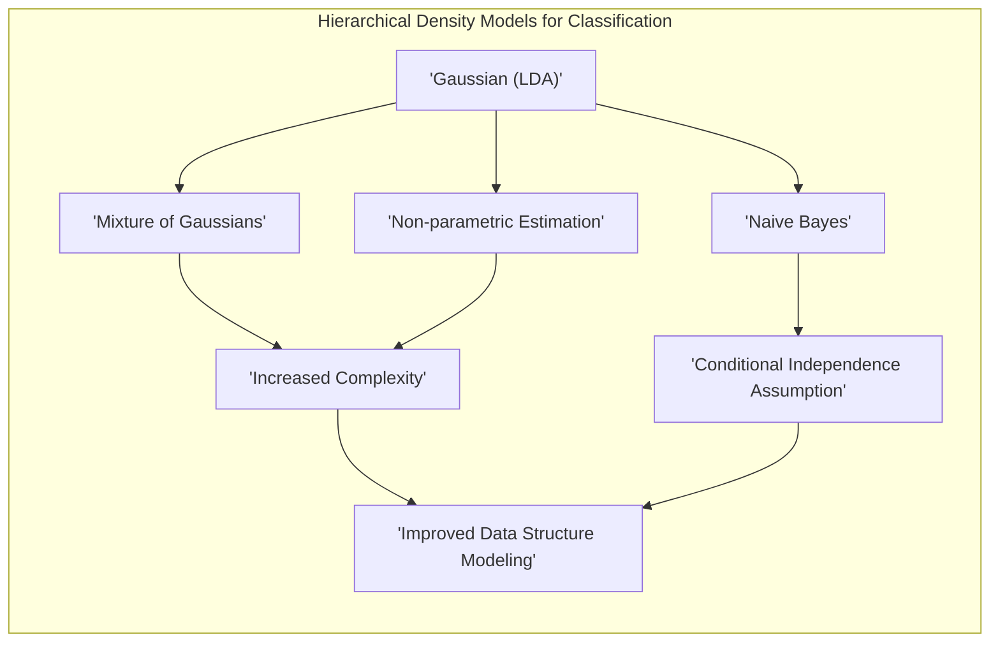
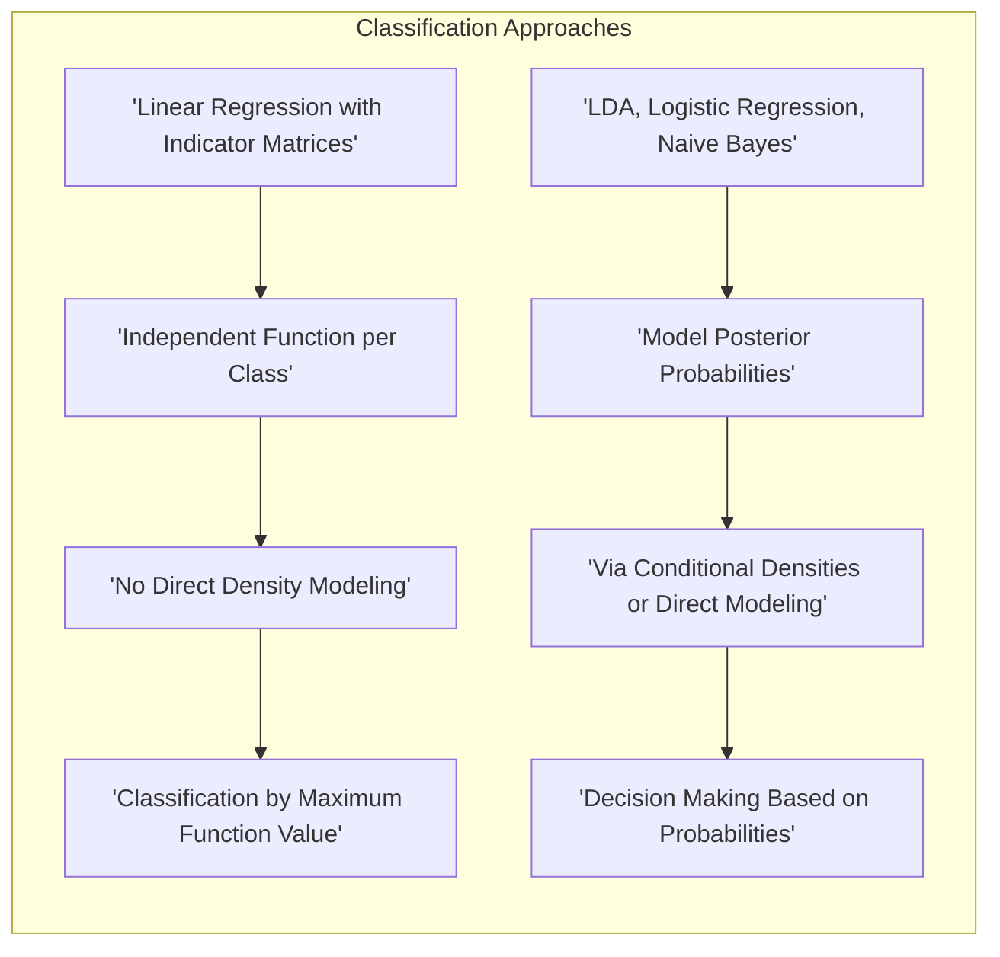
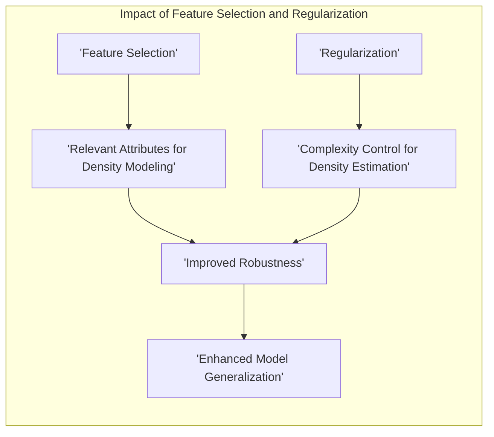
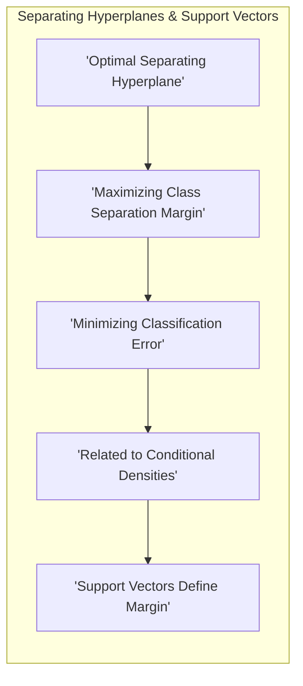
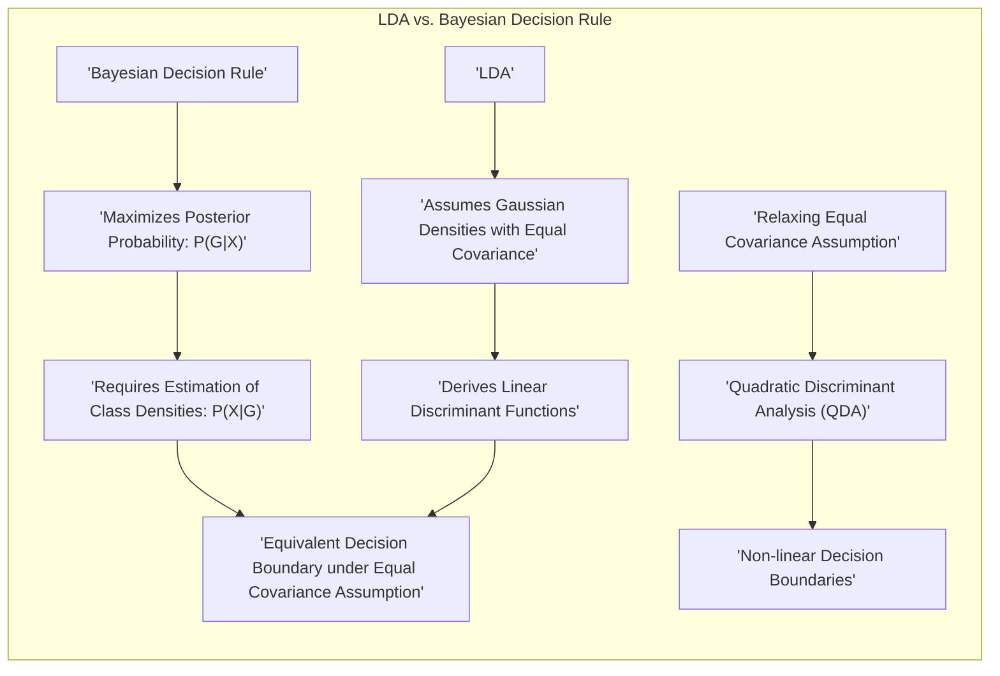

## Título Conciso: Classificação Linear, Modelagem de Densidades e Independência Condicional

### Introdução

Este capítulo explora as diferentes abordagens para modelar as **densidades condicionais de classe**, $P(X|G=k)$, um componente fundamental na **teoria de decisão** para classificação [^4.3]. Analisaremos como diferentes modelos para as densidades condicionais afetam a complexidade e a capacidade de modelagem dos classificadores. Começaremos com o modelo Gaussiano, base para o **Linear Discriminant Analysis (LDA)**, e então exploraremos modelos mais flexíveis, como misturas de Gaussianas e estimativas não paramétricas [^4.3]. Discutiremos também o modelo **Naive Bayes**, que assume a independência condicional dos atributos, e como essa suposição simplifica a modelagem das densidades [^4.3]. Compararemos essas abordagens com a **regressão linear com matrizes de indicadores**, que não modela as densidades condicionais de forma direta [^4.2], e com a **regressão logística**, que modela as probabilidades posteriores diretamente [^4.4]. Abordaremos também o papel da **seleção de variáveis e regularização** para melhorar a robustez e o desempenho dos modelos [^4.4.4], [^4.5]. O objetivo deste capítulo é fornecer uma visão abrangente e detalhada de como a modelagem das densidades condicionais afeta a tomada de decisão em problemas de classificação.

### Conceitos Fundamentais

**Conceito 1: O Papel das Densidades Condicionais na Teoria de Decisão**

A **teoria de decisão** estabelece que a regra ótima de classificação é baseada nas probabilidades posteriores $P(G=k|X=x)$, que representam a probabilidade de uma observação $x$ pertencer à classe $k$ [^4.3]. Para calcular as probabilidades posteriores usando o Teorema de Bayes, é necessário conhecer ou estimar as densidades condicionais de classe $P(X=x|G=k)$, também conhecidas como *likelihoods*, bem como as probabilidades a priori $P(G=k)$.  Diferentes abordagens para modelar essas densidades condicionais levam a diferentes modelos de classificação. A escolha do modelo para as densidades condicionais é um componente fundamental para a definição do modelo de classificação.

**Lemma 1:** *A capacidade de modelagem de um classificador é diretamente influenciada pela escolha do modelo para as densidades condicionais de classe, e quanto mais flexível o modelo, mais capacidade de capturar a estrutura dos dados.* O lema destaca a importância da escolha do modelo para as densidades condicionais na modelagem do problema.

**Conceito 2: Modelagem Gaussiana das Densidades Condicionais e LDA**

O **LDA** assume que as densidades condicionais de classe $P(X=x|G=k)$ seguem uma distribuição gaussiana multivariada com a mesma matriz de covariância $\Sigma$ para todas as classes [^4.3]:

$$
P(X=x|G=k) = \phi(x; \mu_k, \Sigma)
$$

onde $\mu_k$ é o vetor de médias da classe $k$ e $\phi$ é a função densidade de probabilidade gaussiana. Essa suposição leva a funções discriminantes lineares e a fronteiras de decisão lineares entre as classes. A suposição de gaussianidade e de igualdade de covariância é uma simplificação, mas leva a modelos eficientes e que funcionam bem em muitos casos [^4.3].

> 💡 **Exemplo Numérico:**
>
> Vamos considerar um problema de classificação com duas classes (G=0 e G=1) e duas features (X1 e X2). Suponha que, após estimar os parâmetros usando um conjunto de dados, tenhamos os seguintes valores para as médias e a matriz de covariância comum:
>
> $\mu_0 = \begin{bmatrix} 1 \\ 1 \end{bmatrix}$,  $\mu_1 = \begin{bmatrix} 3 \\ 3 \end{bmatrix}$, $\Sigma = \begin{bmatrix} 1 & 0.5 \\ 0.5 & 1 \end{bmatrix}$
>
> A função densidade gaussiana para cada classe é dada por:
>
> $\phi(x; \mu_k, \Sigma) = \frac{1}{(2\pi)^{D/2}|\Sigma|^{1/2}} \exp\left(-\frac{1}{2}(x-\mu_k)^T \Sigma^{-1} (x-\mu_k)\right)$
>
> onde D é a dimensão do espaço (neste caso, D=2).
>
> Vamos calcular a densidade para um ponto $x = \begin{bmatrix} 2 \\ 2 \end{bmatrix}$ para ambas as classes. Primeiro, calculamos $\Sigma^{-1}$:
>
> $\Sigma^{-1} = \frac{1}{1 - 0.5^2} \begin{bmatrix} 1 & -0.5 \\ -0.5 & 1 \end{bmatrix} = \begin{bmatrix} 1.33 & -0.67 \\ -0.67 & 1.33 \end{bmatrix}$
>
> Para a classe 0:
>
> $(x-\mu_0) = \begin{bmatrix} 1 \\ 1 \end{bmatrix}$, $(x-\mu_0)^T = \begin{bmatrix} 1 & 1 \end{bmatrix}$
>
> $(x-\mu_0)^T \Sigma^{-1} (x-\mu_0) = \begin{bmatrix} 1 & 1 \end{bmatrix} \begin{bmatrix} 1.33 & -0.67 \\ -0.67 & 1.33 \end{bmatrix} \begin{bmatrix} 1 \\ 1 \end{bmatrix} = 1.33 - 0.67 - 0.67 + 1.33 = 1.32$
>
> $\phi(x; \mu_0, \Sigma) \propto \exp\left(-\frac{1}{2} \times 1.32\right) \approx 0.52$
>
> Para a classe 1:
>
> $(x-\mu_1) = \begin{bmatrix} -1 \\ -1 \end{bmatrix}$, $(x-\mu_1)^T = \begin{bmatrix} -1 & -1 \end{bmatrix}$
>
> $(x-\mu_1)^T \Sigma^{-1} (x-\mu_1) = \begin{bmatrix} -1 & -1 \end{bmatrix} \begin{bmatrix} 1.33 & -0.67 \\ -0.67 & 1.33 \end{bmatrix} \begin{bmatrix} -1 \\ -1 \end{bmatrix} = 1.33 - 0.67 - 0.67 + 1.33 = 1.32$
>
> $\phi(x; \mu_1, \Sigma) \propto \exp\left(-\frac{1}{2} \times 1.32\right) \approx 0.52$
>
> Neste caso, ambos os valores são iguais (a constante de normalização foi omitida), mas se as médias fossem mais distantes, as densidades seriam diferentes. O LDA então usa essas densidades e as probabilidades a priori para calcular as probabilidades posteriores e classificar o ponto. A fronteira de decisão entre as classes seria uma linha reta, devido à suposição de covariâncias iguais.

**Corolário 1:** *Sob a suposição de distribuições Gaussianas com a mesma matriz de covariância, as funções discriminantes do LDA são lineares e resultam em fronteiras de decisão lineares, e o modelo pode ser visto como uma aproximação da regra de decisão Bayesiana.*  Este corolário demonstra as consequências da escolha de uma distribuição gaussiana para o modelo de densidade condicional em LDA [^4.3].

**Conceito 3: Modelos Flexíveis para as Densidades Condicionais**

Para lidar com dados que não seguem uma distribuição gaussiana, é possível utilizar modelos mais flexíveis para as densidades condicionais. **Misturas de Gaussianas** podem ser usadas para modelar densidades mais complexas, onde cada classe é representada por uma combinação de várias gaussianas. As **estimativas não paramétricas** são mais gerais e não impõem nenhuma restrição à forma da distribuição, adaptando-se aos dados de forma mais flexível. Embora sejam mais flexíveis, modelos mais complexos podem exigir mais dados para serem estimados corretamente e aumentar o risco de *overfitting* [^4.3].

> ⚠️ **Nota Importante**: A escolha do modelo para as densidades condicionais afeta diretamente a complexidade e a flexibilidade do modelo de classificação.

> ❗ **Ponto de Atenção**: Modelos mais flexíveis podem apresentar melhor capacidade de ajuste, mas podem precisar de mais dados e são mais suscetíveis ao overfitting.

> ✔️ **Destaque**: A modelagem da densidade condicional é um componente crucial para a tomada de decisão na classificação, e diferentes modelos podem ser mais adequados para diferentes tipos de dados e problemas.

### Regressão Linear e Mínimos Quadrados para Classificação

Na **regressão linear com matrizes de indicadores**, cada classe é modelada de forma independente, e o objetivo é minimizar a soma dos quadrados dos erros para cada classe. As funções ajustadas $f_k(x) = \beta_{k0} + \beta_k^T x$ são então utilizadas para a tomada de decisão, atribuindo a observação $x$ à classe que apresentar o maior valor da função. No entanto, essa abordagem não modela as densidades condicionais $P(X|G=k)$ diretamente [^4.2]. A regressão linear com matrizes de indicadores não impõe restrições sobre a forma das densidades e não utiliza informações sobre a distribuição dos dados.

Essa falta de modelagem explícita das densidades é uma das razões pelas quais a regressão linear pode apresentar algumas limitações em problemas de classificação. Em particular, ela não garante que as estimativas resultantes se comportem como probabilidades (valores entre 0 e 1), e pode sofrer do problema do *"masking"*, como discutido anteriormente. A regressão linear com matrizes de indicadores também não utiliza informações sobre as probabilidades a priori das classes, que são importantes para a obtenção das probabilidades posteriores [^4.2].

Por outro lado, métodos como LDA, que assume distribuições Gaussianas, ou modelos mais flexíveis que utilizam misturas de gaussianas ou estimativas não paramétricas, buscam modelar as densidades condicionais de forma mais direta e explícita [^4.3].  A regressão logística, por sua vez, modela diretamente as probabilidades posteriores utilizando uma função logística, sem modelar explicitamente as densidades condicionais [^4.4].

> 💡 **Exemplo Numérico:**
>
> Vamos considerar um problema de classificação com duas classes (G=0 e G=1) e uma única feature (X). Usamos regressão linear com matriz de indicadores para modelar cada classe. Suponha que, após ajustar um modelo linear aos dados, obtivemos as seguintes funções:
>
> $f_0(x) = 0.2 + 0.3x$ (para a classe G=0)
>
> $f_1(x) = -0.1 + 0.7x$ (para a classe G=1)
>
> Para classificar um novo ponto, digamos $x=2$, avaliamos ambas as funções:
>
> $f_0(2) = 0.2 + 0.3 \times 2 = 0.8$
>
> $f_1(2) = -0.1 + 0.7 \times 2 = 1.3$
>
> Como $f_1(2) > f_0(2)$, o ponto seria classificado como pertencente à classe G=1. Observe que esses valores não são probabilidades, mas sim valores de funções lineares. A regressão linear com matrizes de indicadores não garante que esses valores fiquem entre 0 e 1, e não modela as densidades condicionais de classe. Além disso, se tivéssemos um ponto com $x=-1$, teríamos $f_0(-1) = -0.1$ e $f_1(-1) = -0.8$, o que não faz sentido em termos de probabilidade.

**Lemma 2:** *A regressão linear com matrizes de indicadores não modela explicitamente as densidades condicionais $P(X|G=k)$, o que é uma limitação em relação a abordagens que utilizam a teoria de decisão.* A prova desse lema reside na ausência da modelagem da densidade dos dados no procedimento da regressão linear com indicadores.

**Corolário 2:** *Em situações onde as classes possuem distribuições que se desviam fortemente da normalidade ou onde a independência dos atributos não se verifica, a regressão linear com matrizes de indicadores pode ter desempenho inferior em relação a métodos que modelam a distribuição de dados de forma mais adequada.* Isso se deve à falta de modelagem das densidades condicionais na regressão linear.

Em resumo, enquanto a regressão linear com matrizes de indicadores oferece uma abordagem simples e direta para classificação, ela não utiliza informações sobre as densidades condicionais, e essa falta de modelagem explícita pode resultar em classificadores menos precisos em comparação com métodos que se baseiam diretamente na teoria de decisão.

### Métodos de Seleção de Variáveis e Regularização em Classificação

A **seleção de variáveis** e a **regularização** desempenham um papel fundamental na construção de modelos de classificação mais robustos e generalizáveis, independentemente da abordagem utilizada para modelar as densidades condicionais [^4.5].

Na **regressão logística**, que modela diretamente as probabilidades posteriores, a regularização pode ser expressa como:

$$
\max_{\beta_0, \beta} \left[ \sum_{i=1}^N \left( y_i (\beta_0 + \beta^T x_i) - \log(1 + e^{\beta_0 + \beta^T x_i}) \right) - \lambda P(\beta) \right]
$$

onde $P(\beta)$ é o termo de penalidade e $\lambda$ é o parâmetro de regularização. A penalidade **L1** (Lasso) promove a esparsidade dos coeficientes, selecionando as variáveis mais relevantes para a modelagem da densidade condicional [^4.4.4]. A penalidade **L2** (Ridge) reduz a magnitude dos coeficientes, estabilizando o modelo e evitando o *overfitting* [^4.5].

A aplicação da regularização, nesse contexto, é importante porque modelos que utilizam estimativas das densidades condicionais podem ser suscetíveis ao *overfitting*, e a regularização controla a complexidade do modelo, levando a uma estimativa das probabilidades posteriores mais precisas.

> 💡 **Exemplo Numérico:**
>
> Vamos considerar a regressão logística com regularização L1 (Lasso). Suponha que temos um problema de classificação com 5 features $(x_1, x_2, x_3, x_4, x_5)$ e o objetivo é prever a probabilidade de uma observação pertencer à classe 1. Após ajustar um modelo de regressão logística com regularização L1, obtivemos os seguintes coeficientes:
>
> $\beta_0 = -0.5$
>
> $\beta = \begin{bmatrix} 0.8 \\ 0 \\ 0.3 \\ -0.2 \\ 0 \end{bmatrix}$
>
> Note que $\beta_2 = 0$ e $\beta_5 = 0$, o que indica que as features $x_2$ e $x_5$ foram eliminadas pelo Lasso, que promove a esparsidade. A função logística resultante seria:
>
> $P(G=1|X=x) = \frac{1}{1 + e^{-(\beta_0 + \beta_1x_1 + \beta_3x_3 + \beta_4x_4)}}$
>
> Agora, vamos considerar um ponto $x = \begin{bmatrix} 1 \\ 2 \\ 1 \\ 0 \\ 3 \end{bmatrix}$. A probabilidade de pertencer à classe 1 seria:
>
> $P(G=1|X=x) = \frac{1}{1 + e^{-(-0.5 + 0.8 \times 1 + 0.3 \times 1 + (-0.2) \times 0)}} = \frac{1}{1 + e^{-0.6}} \approx 0.645$
>
> A regularização L1 ajudou a simplificar o modelo, selecionando as features mais importantes para a classificação. Se usássemos a regularização L2 (Ridge), teríamos coeficientes diferentes e nenhum deles seria exatamente zero, pois a penalidade L2 apenas reduz os valores dos coeficientes, sem eliminá-los.

**Lemma 3:** *A penalidade L1 (Lasso) na regressão logística, ao promover a esparsidade, leva a modelos mais simples, que são menos suscetíveis ao overfitting e que utilizam menos variáveis para estimar as densidades condicionais.* Essa afirmação é uma consequência direta do efeito da penalidade L1 durante o processo de otimização [^4.4.4].

**Prova do Lemma 3:** A penalidade L1 adiciona um termo à função de custo que é proporcional ao módulo dos coeficientes. A minimização da função de custo com este termo faz com que alguns coeficientes se tornem exatamente zero, resultando na seleção de variáveis. Essa esparsidade reduz a complexidade do modelo e melhora a capacidade de generalização, além de simplificar a interpretação [^4.4.3]. $\blacksquare$

**Corolário 3:** *A regularização, tanto L1 quanto L2, contribui para a melhoria da estimativa das densidades condicionais e, consequentemente, para uma melhor tomada de decisão na classificação, especialmente em problemas de alta dimensão.* As penalidades melhoram a estabilidade e a robustez dos modelos.

> ⚠️ **Ponto Crucial**: A seleção de variáveis e a regularização são ferramentas essenciais para melhorar a capacidade de generalização dos modelos de classificação, independentemente da abordagem utilizada para modelar as densidades condicionais, seja gaussianas, misturas de gaussianas ou estimativas não paramétricas [^4.5].

### Separating Hyperplanes e Perceptrons

A ideia de **hiperplanos separadores** busca encontrar uma fronteira linear que maximize a separação entre as classes, tentando minimizar o erro de classificação [^4.5.2]. Essa abordagem, que é central em modelos como as máquinas de vetores de suporte (SVM), busca encontrar o hiperplano ótimo que maximize a margem de separação.

O algoritmo do **Perceptron** é uma forma iterativa de encontrar um hiperplano separador ajustando os parâmetros do modelo com base nas classificações incorretas [^4.5.1]. Embora o Perceptron não modele diretamente as densidades condicionais, ele busca uma solução que separe as classes de forma eficaz.  Em casos onde a separação linear não é possível, as limitações do método se tornam mais evidentes [^4.5.1].

> 💡 **Exemplo Numérico:**
>
> Imagine um problema de classificação binária em 2D, com duas classes (G=0 e G=1) e duas features (X1 e X2). O Perceptron busca um hiperplano (neste caso, uma linha) que separe as classes. Suponha que, em um determinado passo da iteração, o hiperplano seja definido por:
>
> $w_0 + w_1x_1 + w_2x_2 = 0$
>
> com $w_0 = -1$, $w_1 = 1$, $w_2 = -1$.
>
> Um ponto $(x_1, x_2)$ é classificado como classe 1 se $w_0 + w_1x_1 + w_2x_2 > 0$ e classe 0 caso contrário.
>
> Se tivermos um ponto $x = (2, 1)$, a classificação seria:
>
> $-1 + 1 \times 2 + (-1) \times 1 = 0$
>
> Neste caso, o ponto está exatamente no hiperplano.
>
> Se tivermos um ponto $x = (3, 1)$, a classificação seria:
>
> $-1 + 1 \times 3 + (-1) \times 1 = 1 > 0$
>
> Este ponto seria classificado como classe 1.
>
> Se tivermos um ponto $x = (1, 2)$, a classificação seria:
>
> $-1 + 1 \times 1 + (-1) \times 2 = -2 < 0$
>
> Este ponto seria classificado como classe 0.
>
> Se o ponto (1,2) fosse da classe 1, o Perceptron ajustaria os pesos w para tentar classificar corretamente esse ponto, iterativamente. O Perceptron não modela as densidades condicionais, mas sim busca um separador linear que minimize os erros de classificação.

**Teorema:** *Sob a condição de que os dados sejam linearmente separáveis, o algoritmo do Perceptron garante convergência para um hiperplano separador em um número finito de passos.* Essa convergência garante que, sob condições ideais, o método encontrará uma solução [^4.5.1].

### Pergunta Teórica Avançada: Quais as diferenças fundamentais entre a formulação de LDA e a Regra de Decisão Bayesiana considerando distribuições Gaussianas com covariâncias iguais?

**Resposta:**

A **Regra de Decisão Bayesiana** busca classificar uma observação $x$ na classe $k$ que maximize a probabilidade posterior $P(G=k|X=x)$ [^4.3]. Sob a suposição de distribuições Gaussianas com a mesma matriz de covariância $\Sigma$, a probabilidade posterior é dada por:

$$
P(G=k|X=x) = \frac{ \phi(x;\mu_k,\Sigma)\pi_k}{\sum_{l=1}^K \phi(x;\mu_l,\Sigma)\pi_l}
$$

onde $\phi(x;\mu_k,\Sigma)$ é a densidade gaussiana para a classe $k$, e $\pi_k$ é a probabilidade a priori. O **LDA** deriva suas funções discriminantes lineares diretamente das densidades Gaussianas e busca maximizar a separação entre as classes, utilizando informações sobre as médias e covariâncias das classes [^4.3].

**Lemma 4:** *Sob a suposição de distribuições Gaussianas com a mesma matriz de covariância, a regra de decisão Bayesiana e o LDA são equivalentes e levam à mesma fronteira de decisão linear.*  Esta equivalência é estabelecida através da manipulação algébrica e demonstra que a maximização da probabilidade posterior é equivalente à maximização da função discriminante do LDA. [^4.3]

> 💡 **Exemplo Numérico:**
>
> Vamos considerar o mesmo exemplo numérico do LDA, com duas classes (G=0 e G=1), duas features (X1 e X2) e os seguintes parâmetros:
>
> $\mu_0 = \begin{bmatrix} 1 \\ 1 \end{bmatrix}$,  $\mu_1 = \begin{bmatrix} 3 \\ 3 \end{bmatrix}$, $\Sigma = \begin{bmatrix} 1 & 0.5 \\ 0.5 & 1 \end{bmatrix}$
>
> Suponha também que as probabilidades a priori são $\pi_0 = 0.4$ e $\pi_1 = 0.6$.
>
> Para um ponto $x = \begin{bmatrix} 2 \\ 2 \end{bmatrix}$, calculamos as densidades gaussianas (como no exemplo anterior):
>
> $\phi(x; \mu_0, \Sigma) \propto 0.52$
>
> $\phi(x; \mu_1, \Sigma) \propto 0.52$
>
> A probabilidade posterior para a classe 0 é:
>
> $P(G=0|X=x) = \frac{0.52 \times 0.4}{0.52 \times 0.4 + 0.52 \times 0.6} = \frac{0.208}{0.52} = 0.4$
>
> A probabilidade posterior para a classe 1 é:
>
> $P(G=1|X=x) = \frac{0.52 \times 0.6}{0.52 \times 0.4 + 0.52 \times 0.6} = \frac{0.312}{0.52} = 0.6$
>
> A Regra de Decisão Bayesiana classificaria o ponto $x$ na classe 1, pois $P(G=1|X=x) > P(G=0|X=x)$. O LDA, sob as mesmas condições, também levaria à mesma decisão, pois a fronteira de decisão é a mesma. A diferença seria que o LDA derivaria essa fronteira diretamente das médias e covariâncias, sem precisar calcular as probabilidades posteriores explicitamente. A equivalência surge quando as covariâncias são iguais.

**Corolário 4:** *A remoção da restrição de igualdade de covariâncias na regra de decisão Bayesiana leva ao QDA, onde as funções discriminantes são quadráticas e a fronteira de decisão não é mais linear.* Esta diferença destaca como as suposições sobre a forma da distribuição dos dados impactam diretamente na complexidade do modelo. A diferença entre LDA e a regra Bayesiana surge quando a premissa de covariâncias iguais é relaxada [^4.3.1], [^4.3.3].

> ⚠️ **Ponto Crucial**: A principal diferença entre LDA e a regra de decisão Bayesiana reside na restrição da igualdade de covariâncias. Enquanto o LDA impõe esta restrição, a regra Bayesiana, quando combinada com a distribuição gaussiana e com a restrição da covariância, leva ao mesmo resultado, o que evidencia a conexão teórica entre os dois métodos [^4.3].

### Conclusão

Neste capítulo, exploramos diferentes abordagens para modelar as densidades condicionais de classe, um componente central da teoria de decisão para classificação. Discutimos como diferentes modelos, como Gaussianas, misturas de Gaussianas, estimativas não paramétricas e Naive Bayes, afetam a complexidade e o desempenho dos classificadores.  Vimos que a regressão linear com matrizes de indicadores não modela diretamente essas densidades, o que pode levar a certas limitações. Analisamos também como a seleção de variáveis e a regularização são cruciais para melhorar a capacidade de generalização dos modelos, mesmo quando se busca modelar diretamente as densidades condicionais.  A discussão sobre a ligação entre o LDA e a regra de decisão Bayesiana, sob a suposição de distribuições Gaussianas com covariâncias iguais, forneceu um panorama sobre os fundamentos teóricos desses métodos.

### Footnotes

[^4.1]: *In this chapter we revisit the classification problem and focus on linear methods for classification...There are several different ways in which linear decision boundaries can be found.* *(Trecho de Linear Methods for Classification)*

[^4.2]: *In Chapter 2 we fit linear regression models to the class indicator variables, and classify to the largest fit...Linear inequalities in this space are quadratic inequalities in the original space.* *(Trecho de Linear Methods for Classification)*

[^4.3]: *Decision theory for classification (Section 2.4) tells us that we need to know the class posteriors Pr(G|X) for optimal classification. Suppose fk(x) is the class-conditional density of X in class G = k, and let πκ be the prior probability of class k... Linear discriminant analysis (LDA) arises in the special case when we assume that the classes have a common covariance matrix Σk = Σ.* *(Trecho de Linear Methods for Classification)*

[^4.3.1]: *The decision boundary between each pair of classes k and l is described by a quadratic equation {x: δκ(x) = δ(x)}.* *(Trecho de Linear Methods for Classification)*

[^4.3.3]: *In the special case when we assume that the classes have a common covariance matrix...When the classes are really Gaussian, then LDA is optimal* *(Trecho de Linear Methods for Classification)*

[^4.4]: *The logistic regression model arises from the desire to model the posterior probabilities of the K classes via linear functions in x, while at the same time ensuring that they sum to one and remain in [0,1].* *(Trecho de Linear Methods for Classification)*

[^4.4.1]: *Logistic regression models are usually fit by maximum likelihood... The logistic regression model is more general, in that it makes less assumptions.* *(Trecho de Linear Methods for Classification)*

[^4.4.2]: *It is convenient to code the two-class gi via a 0/1 response Yi, where yi = 1 when gi = 1, and yi = 0 when gi = 2... Typically many models are fit in a search for a parsimonious model involving a subset of the variables.* *(Trecho de Linear Methods for Classification)*

[^4.4.3]: *To maximize the log-likelihood, we set its derivatives to zero. These score equations are...To solve the score equations (4.21), we use the Newton-Raphson algorithm...* *(Trecho de Linear Methods for Classification)*

[^4.4.4]: *The L1 penalty used in the lasso (Section 3.4.2) can be used for variable selection and shrinkage with any linear regression model...As with the lasso, we typically do not penalize the intercept term.* *(Trecho de Linear Methods for Classification)*

[^4.5]: *Here we present an analysis of binary data to illustrate the traditional statistical use of the logistic regression model... With two classes there is a simple correspondence between linear discriminant analysis and classification by linear least squares, as in (4.5).* *(Trecho de Linear Methods for Classification)*

[^4.5.1]: *The perceptron learning algorithm tries to find a separating hyperplane by minimizing the distance of misclassified points to the decision boundary.* *(Trecho de Linear Methods for Classification)*

[^4.5.2]: *The optimal separating hyperplane separates the two classes and maximizes the distance to the closest point from either class... In light of (4.40), the constraints define an empty slab or margin around the linear decision boundary...* *(Trecho de Linear Methods for Classification)*
