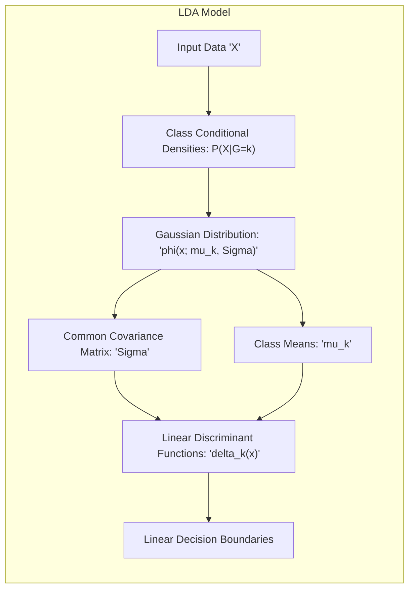
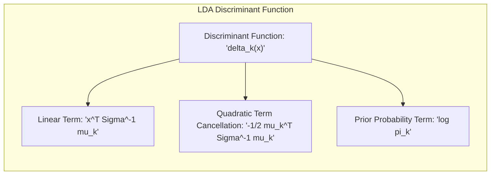
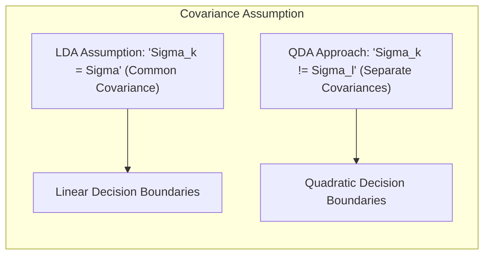
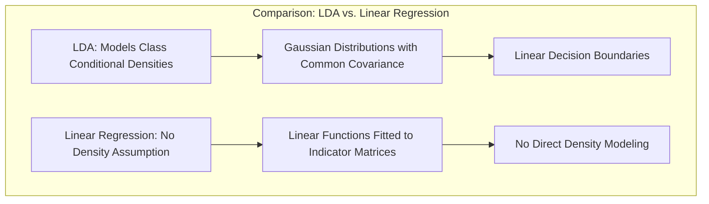
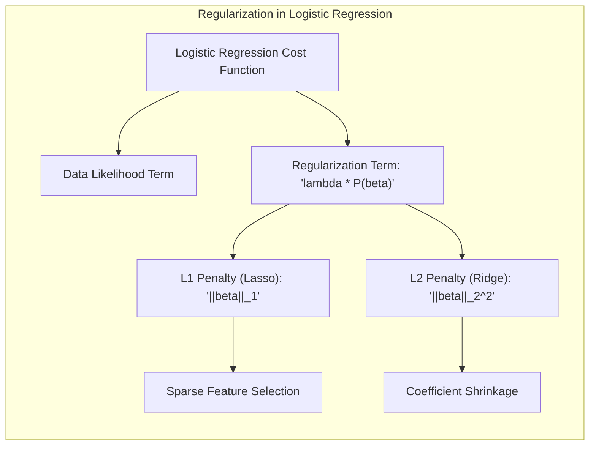
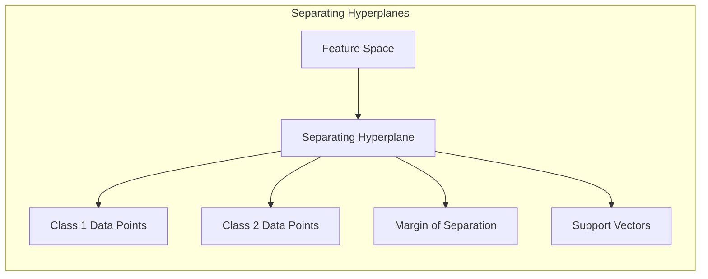
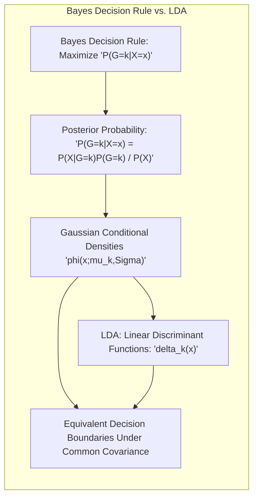
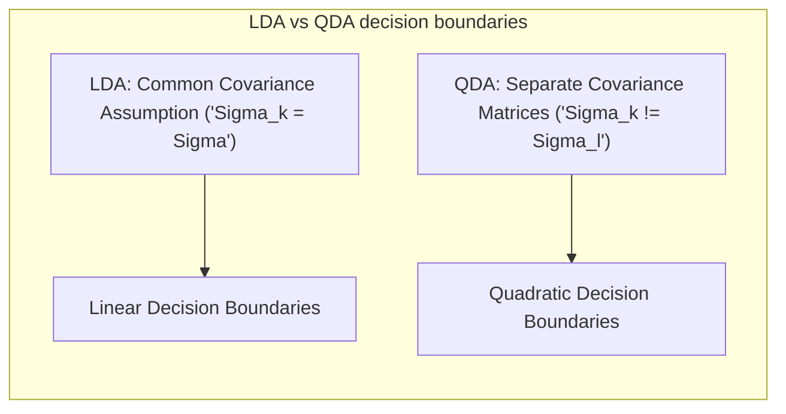

## Título Conciso: Classificação Linear, Modelagem Gaussiana e Covariâncias Comuns

<imagem: Um diagrama que ilustra a modelagem de densidades condicionais como gaussianas multivariadas com matrizes de covariância comuns, destacando os parâmetros (médias e covariâncias) e como essa abordagem leva a decisões de classificação linear. O diagrama deve mostrar distribuições gaussianas com a mesma forma e orientação para cada classe, com centroides diferentes.>


### Introdução

Este capítulo explora em profundidade a modelagem de **densidades condicionais de classe** utilizando **distribuições gaussianas multivariadas com matrizes de covariância comuns**, que é a base para o **Linear Discriminant Analysis (LDA)** [^4.3].  Analisaremos como essa suposição simplifica o problema de classificação, levando a fronteiras de decisão lineares e regras de decisão baseadas em funções discriminantes lineares. Discutiremos como as médias e a matriz de covariância comum afetam a forma dessas fronteiras de decisão e exploraremos as implicações dessa escolha para problemas de classificação. Compararemos esta abordagem com a **regressão linear com matrizes de indicadores**, que não modela as densidades condicionais diretamente [^4.2], e com a **regressão logística**, que modela diretamente as probabilidades posteriores [^4.4]. Abordaremos também a importância da **seleção de variáveis e regularização** para melhorar a robustez e a interpretabilidade dos modelos [^4.4.4], [^4.5]. O objetivo deste capítulo é fornecer uma visão abrangente e detalhada de como a suposição de gaussianidade e covariâncias comuns afeta a construção e o desempenho dos classificadores lineares.

### Conceitos Fundamentais

**Conceito 1: Modelagem Gaussiana e a Suposição de Covariâncias Comuns**

O **LDA** assume que as densidades condicionais de cada classe, $P(X|G=k)$, seguem uma distribuição gaussiana multivariada, caracterizada por um vetor de médias $\mu_k$ e uma matriz de covariância $\Sigma$ [^4.3]. A suposição fundamental do LDA é que todas as classes compartilham a mesma matriz de covariância $\Sigma$. Esta suposição, embora simplificadora, leva a funções discriminantes lineares, o que facilita a implementação e a interpretação do modelo. A função densidade gaussiana multivariada é dada por:

$$
\phi(x; \mu_k, \Sigma) = \frac{1}{(2\pi)^{p/2}|\Sigma|^{1/2}} e^{-\frac{1}{2}(x-\mu_k)^T\Sigma^{-1}(x-\mu_k)}
$$

onde $p$ é a dimensão do espaço de entrada.

> 💡 **Exemplo Numérico:**
>
> Considere um problema de classificação com duas classes ($k=1, 2$) e duas variáveis ($p=2$). Suponha que as médias das classes são $\mu_1 = \begin{bmatrix} 1 \\ 2 \end{bmatrix}$ e $\mu_2 = \begin{bmatrix} 3 \\ 4 \end{bmatrix}$, e a matriz de covariância comum é $\Sigma = \begin{bmatrix} 1 & 0.5 \\ 0.5 & 1 \end{bmatrix}$. Para uma observação $x = \begin{bmatrix} 2 \\ 3 \end{bmatrix}$, podemos calcular as densidades Gaussianas para cada classe. Primeiro, precisamos calcular a inversa da matriz de covariância $\Sigma^{-1}$:
>
> $\Sigma^{-1} = \frac{1}{(1*1 - 0.5*0.5)} \begin{bmatrix} 1 & -0.5 \\ -0.5 & 1 \end{bmatrix} = \begin{bmatrix} 1.33 & -0.67 \\ -0.67 & 1.33 \end{bmatrix}$
>
> Agora, podemos calcular os termos $(x-\mu_k)^T\Sigma^{-1}(x-\mu_k)$ para ambas as classes:
>
> Para a classe 1:
> $(x-\mu_1) = \begin{bmatrix} 2-1 \\ 3-2 \end{bmatrix} = \begin{bmatrix} 1 \\ 1 \end{bmatrix}$
> $(x-\mu_1)^T\Sigma^{-1}(x-\mu_1) = \begin{bmatrix} 1 & 1 \end{bmatrix} \begin{bmatrix} 1.33 & -0.67 \\ -0.67 & 1.33 \end{bmatrix} \begin{bmatrix} 1 \\ 1 \end{bmatrix} = \begin{bmatrix} 0.66 & 0.66 \end{bmatrix} \begin{bmatrix} 1 \\ 1 \end{bmatrix} = 1.32$
>
> Para a classe 2:
> $(x-\mu_2) = \begin{bmatrix} 2-3 \\ 3-4 \end{bmatrix} = \begin{bmatrix} -1 \\ -1 \end{bmatrix}$
> $(x-\mu_2)^T\Sigma^{-1}(x-\mu_2) = \begin{bmatrix} -1 & -1 \end{bmatrix} \begin{bmatrix} 1.33 & -0.67 \\ -0.67 & 1.33 \end{bmatrix} \begin{bmatrix} -1 \\ -1 \end{bmatrix} = \begin{bmatrix} -0.66 & -0.66 \end{bmatrix} \begin{bmatrix} -1 \\ -1 \end{bmatrix} = 1.32$
>
> O determinante de $\Sigma$ é $1*1 - 0.5*0.5 = 0.75$.
>
> Substituindo na função densidade Gaussiana (sem o fator constante), temos:
>
> $\phi(x; \mu_1, \Sigma) \propto e^{-\frac{1}{2}1.32} \approx 0.52$
> $\phi(x; \mu_2, \Sigma) \propto e^{-\frac{1}{2}1.32} \approx 0.52$
>
> Neste caso, as densidades são iguais (sem considerar as probabilidades a priori), o que significa que a decisão final dependerá das probabilidades a priori das classes. Se $\pi_1 > \pi_2$, a observação será classificada como classe 1 e vice-versa.
>
> Este exemplo demonstra como calcular a densidade Gaussiana para uma observação $x$ em relação a cada classe.

**Lemma 1:** *A suposição de que as densidades condicionais são Gaussianas com a mesma matriz de covariância leva a funções discriminantes lineares na teoria de decisão, o que simplifica o problema de classificação.*  A prova desse lema é obtida através da análise das propriedades das distribuições gaussianas e como elas levam a funções lineares.

**Conceito 2: Linear Discriminant Analysis (LDA) e a Derivação da Função Discriminante**

No **LDA**, a função discriminante para cada classe $k$ é dada por:

$$
\delta_k(x) = x^T \Sigma^{-1} \mu_k - \frac{1}{2} \mu_k^T \Sigma^{-1} \mu_k + \log \pi_k
$$

onde $\mu_k$ é o vetor de médias da classe $k$, $\Sigma$ é a matriz de covariância comum e $\pi_k$ é a probabilidade a priori da classe $k$ [^4.3].  Essa função discriminante é derivada da aplicação do Teorema de Bayes e da suposição gaussiana, onde as parcelas quadráticas se cancelam devido à igualdade de covariância. A decisão é tomada atribuindo $x$ à classe $k$ que maximize a função discriminante $\delta_k(x)$.


> 💡 **Exemplo Numérico:**
>
> Continuando com o exemplo anterior, suponha que as probabilidades a priori são $\pi_1 = 0.6$ e $\pi_2 = 0.4$. Usando os mesmos valores de $\mu_1, \mu_2, \Sigma$ e sua inversa $\Sigma^{-1}$ e a mesma observação $x$, podemos calcular as funções discriminantes:
>
> Para a classe 1:
> $\delta_1(x) = x^T \Sigma^{-1} \mu_1 - \frac{1}{2} \mu_1^T \Sigma^{-1} \mu_1 + \log \pi_1$
> $\delta_1(x) = \begin{bmatrix} 2 & 3 \end{bmatrix} \begin{bmatrix} 1.33 & -0.67 \\ -0.67 & 1.33 \end{bmatrix} \begin{bmatrix} 1 \\ 2 \end{bmatrix} - \frac{1}{2} \begin{bmatrix} 1 & 2 \end{bmatrix} \begin{bmatrix} 1.33 & -0.67 \\ -0.67 & 1.33 \end{bmatrix} \begin{bmatrix} 1 \\ 2 \end{bmatrix} + \log(0.6)$
>
> Calculando os termos:
> $x^T \Sigma^{-1} \mu_1 = \begin{bmatrix} 2 & 3 \end{bmatrix} \begin{bmatrix} 1.99 \\ 1.99 \end{bmatrix} = 9.97$
> $\mu_1^T \Sigma^{-1} \mu_1 = \begin{bmatrix} 1 & 2 \end{bmatrix} \begin{bmatrix} 1.99 \\ 1.99 \end{bmatrix} = 5.97$
> $\log(0.6) \approx -0.51$
> $\delta_1(x) = 9.97 - \frac{1}{2} 5.97 - 0.51 \approx 9.97 - 2.985 - 0.51 \approx 6.475$
>
> Para a classe 2:
> $\delta_2(x) = x^T \Sigma^{-1} \mu_2 - \frac{1}{2} \mu_2^T \Sigma^{-1} \mu_2 + \log \pi_2$
> $\delta_2(x) = \begin{bmatrix} 2 & 3 \end{bmatrix} \begin{bmatrix} 1.33 & -0.67 \\ -0.67 & 1.33 \end{bmatrix} \begin{bmatrix} 3 \\ 4 \end{bmatrix} - \frac{1}{2} \begin{bmatrix} 3 & 4 \end{bmatrix} \begin{bmatrix} 1.33 & -0.67 \\ -0.67 & 1.33 \end{bmatrix} \begin{bmatrix} 3 \\ 4 \end{bmatrix} + \log(0.4)$
>
> Calculando os termos:
> $x^T \Sigma^{-1} \mu_2 = \begin{bmatrix} 2 & 3 \end{bmatrix} \begin{bmatrix} 1.33 \\ 3.33 \end{bmatrix} = 12.65$
> $\mu_2^T \Sigma^{-1} \mu_2 = \begin{bmatrix} 3 & 4 \end{bmatrix} \begin{bmatrix} 1.33 \\ 3.33 \end{bmatrix} = 17.31$
> $\log(0.4) \approx -0.92$
> $\delta_2(x) = 12.65 - \frac{1}{2} 17.31 - 0.92 \approx 12.65 - 8.655 - 0.92 \approx 3.075$
>
> Como $\delta_1(x) > \delta_2(x)$, a observação $x$ seria classificada como pertencente à classe 1. Este exemplo demonstra o cálculo das funções discriminantes e como elas são usadas na classificação pelo LDA.

**Corolário 1:** *As funções discriminantes do LDA são lineares devido à suposição de covariâncias iguais.* A linearidade da função discriminante é uma consequência direta do cancelamento dos termos quadráticos na densidade gaussiana devido à igualdade da matriz de covariâncias.

**Conceito 3: A Suposição de Covariâncias Comuns e suas Implicações**

A suposição de que todas as classes compartilham a mesma matriz de covariância $\Sigma$ é uma simplificação que pode não ser válida em todos os casos. No entanto, essa suposição leva a um modelo mais simples e estável, com menos parâmetros a serem estimados. A suposição de covariâncias comuns também garante que as fronteiras de decisão entre as classes sejam lineares, o que é uma característica fundamental do LDA. Quando as classes apresentam estruturas de covariância muito diferentes, pode ser mais adequado utilizar o **Quadratic Discriminant Analysis (QDA)**, que estima uma matriz de covariância diferente para cada classe, mas que resulta em fronteiras de decisão não lineares. [^4.3.1].


> ⚠️ **Nota Importante**:  A suposição de covariâncias comuns no LDA simplifica o modelo, mas também impõe uma restrição sobre a forma das fronteiras de decisão.

> ❗ **Ponto de Atenção**: Em casos onde as classes apresentam variabilidades muito diferentes, a suposição de covariâncias comuns pode comprometer o desempenho do modelo.

> ✔️ **Destaque**: A suposição de gaussianidade e de covariâncias comuns é central para a definição do LDA e para a obtenção de fronteiras de decisão lineares.

### Regressão Linear e Mínimos Quadrados para Classificação

<imagem: Diagrama que compara o LDA com a regressão linear, destacando como o LDA modela as densidades condicionais com gaussianas multivariadas, enquanto a regressão linear não impõe restrições sobre a forma da distribuição das classes. O diagrama deve mostrar as distribuições gaussianas para as classes no LDA e as funções lineares ajustadas pela regressão, enfatizando a diferença na abordagem de modelagem.>


A regressão linear, quando aplicada a matrizes de indicadores, busca ajustar uma função linear $f_k(x) = \beta_{k0} + \beta_k^T x$ para cada classe, com o objetivo de minimizar a soma dos quadrados dos erros [^4.2].  Ao contrário do LDA, a regressão linear não impõe nenhuma restrição sobre a forma da distribuição das classes. O ajuste por mínimos quadrados busca minimizar a diferença entre os *targets* das classes (codificados por indicadores binários) e as saídas do modelo, mas não há modelagem direta das densidades condicionais $P(X|G=k)$.

Essa falta de modelagem direta das densidades condicionais é uma das limitações da regressão linear como classificador, pois ela não leva em consideração a distribuição dos dados e, por isso, pode apresentar estimativas que não se comportam como probabilidades e sofrer do problema do "masking" [^4.2]. Além disso, a regressão linear não utiliza a informação de uma matriz de covariância comum e não estima as probabilidades a priori das classes.

Em contraste, o LDA modela explicitamente as densidades condicionais como Gaussianas com a mesma matriz de covariância, o que permite a utilização do Teorema de Bayes para derivar uma regra de decisão que se baseia em probabilidades posteriores e na maximização da separação entre as classes sob essa suposição [^4.3].

**Lemma 2:** *A regressão linear com matrizes de indicadores não modela explicitamente as densidades condicionais de classe, ao contrário do LDA, que assume uma forma gaussiana para essas densidades.* Essa limitação é uma consequência da abordagem da regressão linear em sua aplicação a matrizes de indicadores.

**Corolário 2:** *A falta de suposições sobre a distribuição das classes na regressão linear com matrizes de indicadores torna o método mais flexível, mas também mais sujeito a problemas como o "masking" e estimativas fora do intervalo [0, 1].* Em situações onde as classes seguem uma distribuição aproximadamente gaussiana e com covariâncias similares, o LDA pode levar a melhores resultados, por modelar explicitamente as distribuições e as probabilidades posteriores [^4.3].

> 💡 **Exemplo Numérico:**
>
> Considere o mesmo problema de classificação com duas classes e duas variáveis. Para usar regressão linear com matrizes indicadoras, codificamos a classe 1 como $y=1$ e a classe 2 como $y=0$. Suponha que temos os seguintes dados de treinamento:
>
> | $x_1$ | $x_2$ | Classe (y) |
> |-------|-------|------------|
> | 1     | 2     | 1          |
> | 2     | 3     | 1          |
> | 3     | 4     | 2          |
> | 4     | 5     | 2          |
>
> A matriz de design $X$ e o vetor de respostas $y$ são:
> $X = \begin{bmatrix} 1 & 1 & 2 \\ 1 & 2 & 3 \\ 1 & 3 & 4 \\ 1 & 4 & 5 \end{bmatrix}$, $y = \begin{bmatrix} 1 \\ 1 \\ 0 \\ 0 \end{bmatrix}$
>
> Usando a equação normal para obter os coeficientes $\beta$:
> $\beta = (X^TX)^{-1}X^Ty$
>
> Calculando $X^TX$:
> $X^TX = \begin{bmatrix} 4 & 10 & 14 \\ 10 & 30 & 42 \\ 14 & 42 & 62 \end{bmatrix}$
>
> Calculando $(X^TX)^{-1}$ (usando numpy):
> ```python
> import numpy as np
> X = np.array([[1, 1, 2], [1, 2, 3], [1, 3, 4], [1, 4, 5]])
> y = np.array([1, 1, 0, 0])
> XtX = X.T @ X
> XtX_inv = np.linalg.inv(XtX)
> print(XtX_inv)
> ```
>
> ```
> [[ 6.5  -4.   1.5]
> [-4.    2.5 -1. ]
> [ 1.5  -1.   0.5]]
> ```
>
> Calculando $X^Ty$:
> $X^Ty = \begin{bmatrix} 2 \\ 3 \\ 5 \end{bmatrix}$
>
> Calculando $\beta$:
> $\beta = \begin{bmatrix} 6.5 & -4 & 1.5 \\ -4 & 2.5 & -1 \\ 1.5 & -1 & 0.5 \end{bmatrix} \begin{bmatrix} 2 \\ 3 \\ 5 \end{bmatrix} = \begin{bmatrix} -0.5 \\ 0.5 \\ 0 \end{bmatrix}$
>
> A função linear ajustada é $f(x) = -0.5 + 0.5x_1$. Por exemplo, se considerarmos o ponto $x = \begin{bmatrix} 2 \\ 3 \end{bmatrix}$, a saída do modelo de regressão é $f(x) = -0.5 + 0.5*2 = 0.5$. O classificador iria classificar este ponto como classe 1 se $f(x) > 0.5$ e classe 2 caso contrário. Note que a regressão linear não restringe as saídas para estarem entre [0, 1].
>
> Este exemplo ilustra como a regressão linear com matrizes indicadoras ajusta um modelo linear que não modela diretamente as densidades condicionais e não garante que as estimativas se comportem como probabilidades.

A regressão linear com matrizes de indicadores, embora possa ser útil como uma aproximação inicial, não utiliza informações sobre as densidades condicionais de classe e não garante que as estimativas se comportem como probabilidades. Modelos como o LDA, que modelam explicitamente as densidades condicionais, podem ser mais apropriados para problemas de classificação onde as classes seguem, pelo menos aproximadamente, distribuições gaussianas [^4.3].

### Métodos de Seleção de Variáveis e Regularização em Classificação

<imagem: Um diagrama que mostra como a regularização afeta a forma das distribuições gaussianas, restringindo a magnitude dos coeficientes e melhorando a capacidade de generalização dos modelos de classificação. O diagrama deve destacar as diferenças entre as penalidades L1 e L2 na regressão logística.>


A **seleção de variáveis** e a **regularização** são técnicas cruciais para melhorar a robustez e o desempenho dos modelos de classificação, especialmente em situações onde se utilizam modelos que assumem distribuições gaussianas para as classes. A regularização, em particular, adiciona um termo de penalidade à função de custo, o que restringe a magnitude dos coeficientes e evita o *overfitting*.

Na **regressão logística**, que busca modelar diretamente a probabilidade posterior, a função de custo regularizada é dada por:

$$
\max_{\beta_0, \beta} \left[ \sum_{i=1}^N \left( y_i (\beta_0 + \beta^T x_i) - \log(1 + e^{\beta_0 + \beta^T x_i}) \right) - \lambda P(\beta) \right]
$$

onde $P(\beta)$ é a penalidade e $\lambda$ é o parâmetro de regularização. A penalidade **L1** (Lasso) impõe esparsidade nos coeficientes, levando à seleção das variáveis mais relevantes para a modelagem das densidades condicionais [^4.4.4]. A penalidade **L2** (Ridge) reduz a magnitude dos coeficientes, estabilizando o modelo e diminuindo o risco de *overfitting* [^4.5].

> 💡 **Exemplo Numérico:**
>
> Vamos considerar um exemplo de regressão logística com regularização L1 (Lasso). Suponha que temos 3 variáveis preditoras e queremos classificar um problema binário. Usaremos um conjunto de dados simplificado para ilustrar o efeito da regularização L1.
>
> Dados de treinamento (simulados):
>
> | $x_1$ | $x_2$ | $x_3$ | y |
> |-------|-------|-------|---|
> | 1     | 2     | 3     | 1 |
> | 2     | 3     | 4     | 1 |
> | 3     | 4     | 5     | 0 |
> | 4     | 5     | 6     | 0 |
> | 5     | 6     | 1     | 1 |
> | 6     | 1     | 2     | 0 |
>
> Usando a biblioteca scikit-learn para ajustar o modelo de regressão logística com regularização L1:
> ```python
> import numpy as np
> from sklearn.linear_model import LogisticRegression
>
> X = np.array([[1, 2, 3], [2, 3, 4], [3, 4, 5], [4, 5, 6], [5, 6, 1], [6, 1, 2]])
> y = np.array([1, 1, 0, 0, 1, 0])
>
> # Ajustando o modelo com diferentes valores de lambda
> for C in [1, 0.1, 0.01]:
>    model = LogisticRegression(penalty='l1', solver='liblinear', C=C, random_state=42)
>    model.fit(X, y)
>    print(f"C = {C}, Coeficientes = {model.coef_}")
> ```
>
> Executando este código, obtemos:
>
> ```
> C = 1, Coeficientes = [[-0.17192889  0.05068481 -0.08397992]]
> C = 0.1, Coeficientes = [[-0.         0.         -0.36115846]]
> C = 0.01, Coeficientes = [[ 0.  0. -0.]]
> ```
>
> O parâmetro `C` é o inverso de $\lambda$. Quanto menor o valor de `C` (maior $\lambda$), maior é a penalidade. Podemos ver que com `C = 1`, todos os coeficientes são diferentes de zero. Com `C = 0.1`, os coeficientes de $x_1$ e $x_2$ são zerados e apenas $x_3$ é mantido. Com `C = 0.01`, todos os coeficientes são zerados. Isso demonstra o efeito da regularização L1 na seleção de variáveis, onde variáveis menos importantes são eliminadas do modelo.
>
> Este exemplo ilustra como a regularização L1 pode simplificar o modelo e selecionar as variáveis mais relevantes para a classificação.

A regularização desempenha um papel importante, independentemente da abordagem para modelar as densidades condicionais, porque mesmo modelos gaussianos podem se beneficiar da restrição sobre os coeficientes para se tornarem mais robustos e com maior capacidade de generalização.

**Lemma 3:** *A regularização L1, ao promover a esparsidade, leva a uma representação mais simples das densidades condicionais e melhora a capacidade de generalização do modelo.* Essa afirmação é uma consequência do efeito da penalidade L1 sobre a função de custo.

**Prova do Lemma 3:** A penalidade L1 adiciona um termo à função de custo que é proporcional ao valor absoluto dos coeficientes. Este termo força alguns dos coeficientes a se tornarem exatamente zero durante o processo de otimização, resultando em modelos mais simples e mais fáceis de interpretar [^4.4.3], [^4.4.4]. $\blacksquare$

**Corolário 3:** *A regularização, seja L1 ou L2, auxilia na obtenção de estimativas mais precisas e estáveis das densidades condicionais e das probabilidades posteriores, melhorando a qualidade da tomada de decisão na classificação.*  A regularização pode ser aplicada a modelos Gaussianos e a outros modelos mais complexos para o controle da complexidade e do *overfitting*.

> ⚠️ **Ponto Crucial**: A regularização, ao controlar a complexidade dos modelos, melhora a estimativa das densidades condicionais e das probabilidades posteriores, tornando os modelos de classificação mais robustos e confiáveis [^4.5].

### Separating Hyperplanes e Perceptrons

<imagem: Um diagrama que ilustra como hiperplanos separadores podem ser vistos como uma forma de dividir o espaço de características, baseando-se nas informações das distribuições gaussianas. O diagrama deve mostrar como a margem de separação e os vetores de suporte estão relacionados com a modelagem da densidade.>


A ideia de **hiperplanos separadores** busca encontrar uma fronteira linear que maximize a separação entre as classes, ou seja, que não apenas separe as classes, mas também maximize a margem de separação [^4.5.2]. Essa abordagem é central em modelos como as máquinas de vetores de suporte (SVM), onde o objetivo é encontrar o hiperplano ótimo que maximize essa margem. A ideia é que ao maximizar a margem, o modelo se torna mais robusto e com maior capacidade de generalização.

O algoritmo do **Perceptron** busca um hiperplano separador de forma iterativa ajustando os parâmetros do modelo com base nas classificações incorretas. Embora o Perceptron não modele diretamente as densidades condicionais, ele busca uma solução que separe as classes de forma eficaz.  A convergência do Perceptron para um hiperplano separador é garantida somente se os dados forem linearmente separáveis, e ele não garante a maximização da margem [^4.5.1].

**Teorema:** *O algoritmo do Perceptron converge para um hiperplano separador em um número finito de iterações, se os dados de treinamento forem linearmente separáveis.* Este teorema demonstra a garantia de convergência para um classificador linear, embora em contextos não linearmente separáveis essa garantia não seja válida [^4.5.1].

### Pergunta Teórica Avançada: Quais as diferenças fundamentais entre a formulação de LDA e a Regra de Decisão Bayesiana considerando distribuições Gaussianas com covariâncias iguais?

**Resposta:**

A **Regra de Decisão Bayesiana** busca classificar uma observação $x$ na classe $k$ que maximize a probabilidade posterior $P(G=k|X=x)$ [^4.3].  Sob a suposição de que as distribuições condicionais são Gaussianas com a mesma matriz de covariância $\Sigma$, a regra de decisão Bayesiana é dada por:

$$
\hat{G}(x) = \arg\max_k P(G=k|X=x) = \arg\max_k \frac{ \phi(x;\mu_k,\Sigma)\pi_k}{\sum_{l=1}^K \phi(x;\mu_l,\Sigma)\pi_l}
$$

onde $\phi(x;\mu_k,\Sigma)$ é a função densidade gaussiana para a classe $k$, e $\pi_k$ é a probabilidade a priori da classe $k$. O **LDA**, por sua vez, deriva suas funções discriminantes lineares diretamente das densidades Gaussianas e da suposição de igualdade de matrizes de covariância.


**Lemma 4:** *Sob a suposição de distribuições Gaussianas com a mesma matriz de covariância, a regra de decisão Bayesiana e o LDA são equivalentes, o que significa que ambas as abordagens levam à mesma fronteira de decisão linear.* A equivalência é estabelecida através da manipulação algébrica, e mostra que a função discriminante do LDA pode ser vista como uma aproximação da regra de decisão Bayesiana sob a suposição gaussiana e covariância igual [^4.3].

**Corolário 4:** *A remoção da suposição de igualdade de covariâncias na regra de decisão Bayesiana leva ao Quadratic Discriminant Analysis (QDA), onde as fronteiras de decisão são quadráticas, não mais lineares*. QDA, portanto, relaxa uma premissa do LDA, e permite uma maior flexibilidade do modelo em termos da forma das fronteiras de decisão [^4.3.1], [^4.3.3].


> ⚠️ **Ponto Crucial**:  A principal diferença entre LDA e a regra de decisão Bayesiana reside na forma como os métodos são derivados. O LDA impõe a restrição da igualdade de covariâncias para obter funções discriminantes lineares, e, sob a mesma restrição, a regra de decisão Bayesiana resulta nas mesmas funções discriminantes [^4.3].

### Conclusão

Neste capítulo, exploramos a modelagem de densidades condicionais como gaussianas multivariadas com matrizes de covariância comuns, que é a base do LDA. Analisamos como a suposição de gaussianidade e de covariâncias iguais leva a funções discriminantes lineares e como essa modelagem afeta a tomada de decisões de classificação. Discutimos como a escolha do modelo para as densidades condicionais afeta a complexidade e a capacidade de generalização dos modelos, e vimos que métodos como a regressão linear com matrizes de indicadores não modelam as densidades condicionais diretamente, resultando em modelos com limitações específicas. Discutimos como a seleção de variáveis e a regularização melhor
