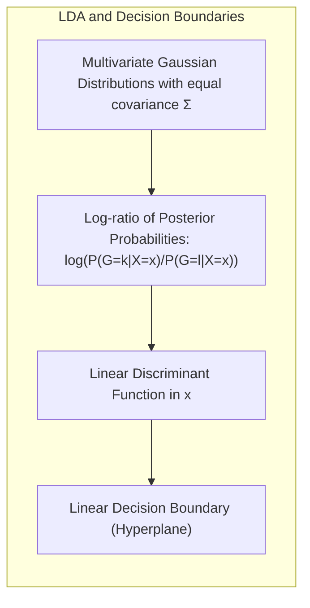
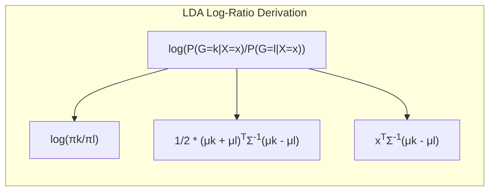
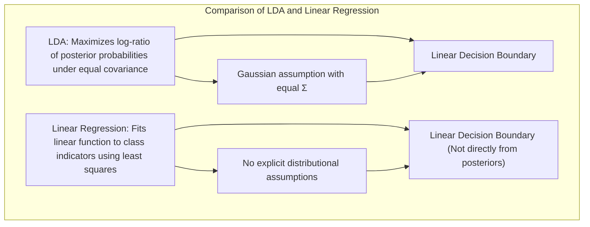
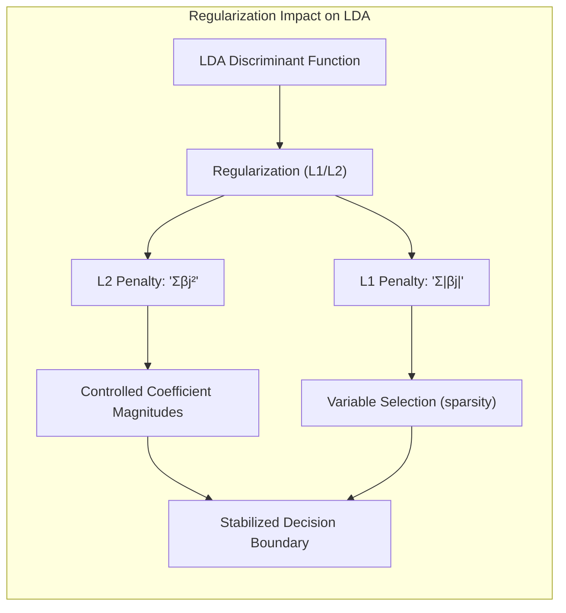
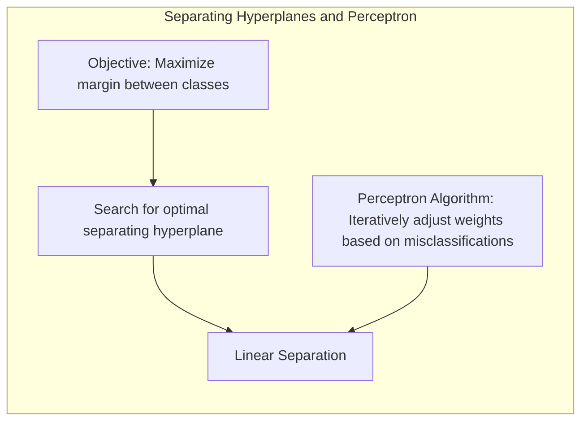
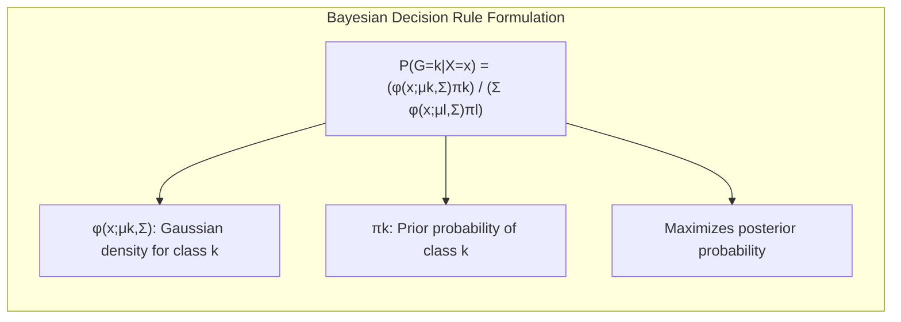

## Título Conciso: Classificação Linear, Fronteiras de Decisão e a Suposição de Covariâncias Iguais no LDA

### Introdução

Este capítulo explora a fundo como a suposição de **covariâncias iguais** no **Linear Discriminant Analysis (LDA)** leva à formação de uma **fronteira de decisão linear**. A análise do **log da razão de probabilidades** (log-ratio) desempenha um papel fundamental na compreensão desse processo [^4.3]. Investigaremos como a suposição de gaussianidade multivariada, juntamente com a igualdade das matrizes de covariância, resulta em uma função discriminante linear e, consequentemente, em uma fronteira de decisão linear. Além disso, compararemos esta abordagem com a **regressão linear com matrizes de indicadores**, que não impõe essas restrições sobre a distribuição dos dados [^4.2]. Analisaremos também a **regressão logística**, que modela as probabilidades posteriores de forma mais direta [^4.4]. Discutiremos também como a **seleção de variáveis e regularização** podem ser utilizadas para melhorar a estabilidade dos modelos e a qualidade da tomada de decisões [^4.4.4], [^4.5]. O conceito de **hiperplanos separadores** e sua relação com as decisões de classificação também será abordado [^4.5.2]. O objetivo deste capítulo é fornecer uma análise detalhada de como a suposição de covariâncias iguais no LDA leva à formação de fronteiras de decisão lineares.

### Conceitos Fundamentais

**Conceito 1: O Papel da Razão de Log-Probabilidades na Classificação**

Em um problema de classificação, a decisão ótima é tomada atribuindo uma observação $x$ à classe que maximiza a probabilidade posterior $Pr(G=k|X=x)$ [^4.3]. A razão de log-probabilidades, ou log-ratio, entre duas classes $k$ e $l$ é dada por:

$$
\log \frac{P(G=k|X=x)}{P(G=l|X=x)}
$$

Essa razão é frequentemente utilizada porque simplifica a comparação entre as probabilidades posteriores e a tomada de decisão.  Quando a razão de log-probabilidades é linear, a fronteira de decisão entre as classes $k$ e $l$ é um hiperplano, e este é o caso no LDA sob a suposição de distribuições gaussianas e covariâncias iguais [^4.3].

> 💡 **Exemplo Numérico:**
>
> Suponha que temos duas classes, $k$ e $l$, e que para uma dada observação $x$, as probabilidades posteriores são $P(G=k|X=x) = 0.8$ e $P(G=l|X=x) = 0.2$. O log-ratio seria:
>
> $$
> \log \frac{0.8}{0.2} = \log 4 \approx 1.386
> $$
>
> Um log-ratio positivo indica que a probabilidade da classe $k$ é maior que a da classe $l$, favorecendo a classificação de $x$ na classe $k$. Se o log-ratio fosse negativo, favoreceria a classe $l$.

**Lemma 1:** *A linearidade do log-ratio das probabilidades posteriores leva a fronteiras de decisão lineares entre classes*. Esse lema enfatiza como uma propriedade da probabilidade posterior se relaciona com a geometria da fronteira de decisão.

**Conceito 2: LDA e a Fronteira de Decisão Linear**

No **LDA**, a suposição de que as classes seguem distribuições Gaussianas multivariadas com a mesma matriz de covariância $\Sigma$ leva à seguinte expressão para o log-ratio:

$$
\log \frac{P(G=k|X=x)}{P(G=l|X=x)} = \log \frac{\pi_k}{\pi_l} + \frac{1}{2} (\mu_k + \mu_l)^T \Sigma^{-1} (\mu_k - \mu_l) + x^T \Sigma^{-1} (\mu_k - \mu_l)
$$

onde $\mu_k$ e $\mu_l$ são os vetores de médias das classes $k$ e $l$, e $\pi_k$ e $\pi_l$ são as probabilidades a priori das classes. A igualdade da matriz de covariância para todas as classes garante o cancelamento dos termos quadráticos em $x$, resultando em uma função linear em $x$.  Essa função linear define a fronteira de decisão, que é um hiperplano [^4.3]. A suposição de covariâncias iguais é fundamental para a linearidade da função discriminante e da fronteira de decisão.

> 💡 **Exemplo Numérico:**
>
> Considere duas classes com as seguintes características:
> - Classe $k$: $\mu_k = \begin{bmatrix} 2 \\ 2 \end{bmatrix}$, $\pi_k = 0.6$
> - Classe $l$: $\mu_l = \begin{bmatrix} 4 \\ 4 \end{bmatrix}$, $\pi_l = 0.4$
> - Matriz de covariância comum: $\Sigma = \begin{bmatrix} 1 & 0 \\ 0 & 1 \end{bmatrix}$, portanto $\Sigma^{-1} = \begin{bmatrix} 1 & 0 \\ 0 & 1 \end{bmatrix}$
>
> Vamos calcular o log-ratio para um ponto $x = \begin{bmatrix} 3 \\ 3 \end{bmatrix}$:
>
> $\text{Step 1: } \mu_k - \mu_l = \begin{bmatrix} -2 \\ -2 \end{bmatrix}$
>
> $\text{Step 2: } \mu_k + \mu_l = \begin{bmatrix} 6 \\ 6 \end{bmatrix}$
>
> $\text{Step 3: } (\mu_k + \mu_l)^T \Sigma^{-1} (\mu_k - \mu_l) = \begin{bmatrix} 6 & 6 \end{bmatrix} \begin{bmatrix} 1 & 0 \\ 0 & 1 \end{bmatrix} \begin{bmatrix} -2 \\ -2 \end{bmatrix} = \begin{bmatrix} 6 & 6 \end{bmatrix} \begin{bmatrix} -2 \\ -2 \end{bmatrix} = -12 -12 = -24$
>
> $\text{Step 4: } x^T \Sigma^{-1} (\mu_k - \mu_l) = \begin{bmatrix} 3 & 3 \end{bmatrix} \begin{bmatrix} 1 & 0 \\ 0 & 1 \end{bmatrix} \begin{bmatrix} -2 \\ -2 \end{bmatrix} = \begin{bmatrix} 3 & 3 \end{bmatrix} \begin{bmatrix} -2 \\ -2 \end{bmatrix} = -6 -6 = -12$
>
> $\text{Step 5: } \log \frac{\pi_k}{\pi_l} = \log \frac{0.6}{0.4} = \log 1.5 \approx 0.405$
>
> $\text{Step 6: } \log \frac{P(G=k|X=x)}{P(G=l|X=x)} = 0.405 + \frac{1}{2}(-24) + (-12) = 0.405 - 12 - 12 = -23.595$
>
> O log-ratio resultante é negativo, o que indica que o ponto $x = \begin{bmatrix} 3 \\ 3 \end{bmatrix}$ seria classificado na classe $l$.

**Corolário 1:** *A suposição de covariâncias iguais no LDA é a principal razão pela qual a fronteira de decisão entre duas classes é um hiperplano.*  Esse corolário destaca como a suposição sobre as covariâncias influencia a forma da fronteira de decisão no LDA.

**Conceito 3:  Implicações da Suposição de Covariâncias Iguais e a Equivalência com a Regra Bayesiana**

A suposição de covariâncias iguais, embora simplifique a modelagem, é uma restrição que pode não se verificar na prática [^4.3]. Quando as classes apresentam estruturas de covariância muito diferentes, a fronteira de decisão pode não ser ótima, e a opção do **Quadratic Discriminant Analysis (QDA)**, que permite que cada classe tenha sua própria matriz de covariância, pode ser mais adequada, mesmo que resulte em fronteiras não lineares [^4.3.1]. A suposição de covariâncias iguais também garante que as estimativas de parâmetros no LDA sejam mais estáveis e com menor variância. Quando a regra de decisão Bayesiana é aplicada sob a suposição de gaussianidade com covariâncias iguais, o resultado é exatamente o mesmo que o LDA.

> ⚠️ **Nota Importante**:  A suposição de covariâncias iguais no LDA leva a fronteiras de decisão lineares e simplifica o problema, mas pode comprometer o desempenho em situações onde essa suposição não é válida.

> ❗ **Ponto de Atenção**: Em casos onde as classes apresentam variabilidades muito diferentes, a utilização de modelos mais flexíveis como o QDA pode ser necessária.

> ✔️ **Destaque**: A igualdade das matrizes de covariância garante que a função discriminante do LDA seja linear e, consequentemente, que a fronteira de decisão seja um hiperplano.

### Regressão Linear e Mínimos Quadrados para Classificação

A **regressão linear**, quando aplicada a uma matriz de indicadores para classificação, busca ajustar uma função linear $f_k(x) = \beta_{k0} + \beta_k^T x$ para cada classe, utilizando o método dos mínimos quadrados [^4.2].  Ao contrário do LDA, a regressão linear não impõe restrições sobre a forma da distribuição das classes e não modela diretamente as probabilidades posteriores. A regra de decisão da regressão linear atribui uma nova observação $x$ à classe $k$ que maximiza o valor de $f_k(x)$, que não necessariamente corresponde à maximização da probabilidade posterior.

A ausência da suposição de igualdade de covariâncias e de gaussianidade na regressão linear resulta em modelos mais flexíveis, mas também pode levar a problemas como a ocorrência de estimativas fora do intervalo [0,1] e o problema do "masking" em problemas com muitas classes [^4.2]. Além disso, a regressão linear não utiliza informações sobre as probabilidades a priori das classes e não leva em consideração a distribuição das classes.

Em contraste, o LDA, ao assumir distribuições gaussianas com covariâncias iguais, utiliza o log-ratio das probabilidades posteriores para derivar a fronteira de decisão linear, que maximiza a separação entre as classes sob estas suposições [^4.3].

> 💡 **Exemplo Numérico:**
>
> Suponha que temos um problema de classificação com duas classes (0 e 1) e duas features. Utilizamos regressão linear para modelar a relação entre as features e as classes. A matriz de indicadores para a classe 1 seria um vetor com 1 para as observações da classe 1 e 0 para as da classe 0.
>
> Digamos que após ajustar o modelo de regressão linear, obtivemos as seguintes funções para cada classe:
>
> - Classe 0: $f_0(x) = 0.2 + 0.1x_1 - 0.3x_2$
> - Classe 1: $f_1(x) = 0.8 - 0.2x_1 + 0.5x_2$
>
> Para um novo ponto $x = \begin{bmatrix} 2 \\ 1 \end{bmatrix}$, temos:
>
> $f_0(x) = 0.2 + 0.1(2) - 0.3(1) = 0.2 + 0.2 - 0.3 = 0.1$
>
> $f_1(x) = 0.8 - 0.2(2) + 0.5(1) = 0.8 - 0.4 + 0.5 = 0.9$
>
> A regressão linear classificaria $x$ na classe 1, pois $f_1(x) > f_0(x)$. Observe que esses valores não são probabilidades, e podem ser negativos ou maiores que 1.

**Lemma 2:** *A regressão linear com matrizes de indicadores não modela a probabilidade posterior de forma direta e não utiliza o conceito do log-ratio na derivação da fronteira de decisão, ao contrário do LDA.* A prova deste lema reside na forma da derivação da regra de decisão em ambos os casos.

**Corolário 2:** *A regra de decisão da regressão linear, baseada na maximização da função de regressão ajustada, não garante que a decisão seja ótima no sentido da teoria de decisão, uma vez que ela não busca maximizar o log-ratio das probabilidades posteriores, ao contrário do LDA.* A não consideração da probabilidade posterior é um fator limitante da regressão linear.

Em resumo, a regressão linear com matrizes de indicadores, embora possa produzir fronteiras de decisão lineares, não utiliza a mesma base teórica e as mesmas suposições que o LDA, o que leva a resultados diferentes e, em muitos casos, menos adequados para a classificação [^4.3].

### Métodos de Seleção de Variáveis e Regularização em Classificação

A **seleção de variáveis** e a **regularização** desempenham um papel fundamental na construção de modelos de classificação lineares mais robustos, mesmo quando o foco está na suposição de distribuições gaussianas com covariâncias iguais como no LDA. Embora a suposição de covariância igual simplifique a modelagem, a regularização continua sendo fundamental para evitar o *overfitting* e melhorar a capacidade de generalização [^4.5].

Na **regressão logística**, que modela a probabilidade posterior diretamente, a regularização pode ser aplicada através da adição de um termo de penalidade à função de custo, levando à seguinte formulação:

$$
\max_{\beta_0, \beta} \left[ \sum_{i=1}^N \left( y_i (\beta_0 + \beta^T x_i) - \log(1 + e^{\beta_0 + \beta^T x_i}) \right) - \lambda P(\beta) \right]
$$

onde $P(\beta)$ é a penalidade e $\lambda$ é o parâmetro de regularização. A penalidade **L1** (Lasso) é dada por $P(\beta) = \sum_{j=1}^p |\beta_j|$, e leva à esparsidade nos coeficientes, selecionando as variáveis mais relevantes. A penalidade **L2** (Ridge) é dada por $P(\beta) = \sum_{j=1}^p \beta_j^2$ e reduz a magnitude dos coeficientes, estabilizando o modelo [^4.4.4], [^4.5].

> 💡 **Exemplo Numérico:**
>
> Vamos considerar um problema de regressão logística com duas features ($x_1$ e $x_2$) e o objetivo de prever a probabilidade de um evento binário (0 ou 1). Suponha que, sem regularização, obtivemos os seguintes coeficientes:
>
> $\beta_0 = -1.0$, $\beta_1 = 2.5$, $\beta_2 = -1.8$
>
> Agora, vamos aplicar a regularização L1 (Lasso) com $\lambda = 0.5$. Após a otimização, os coeficientes se tornam:
>
> $\beta_0 = -0.8$, $\beta_1 = 1.2$, $\beta_2 = 0.0$
>
> Observe que a regularização L1 zerou o coeficiente $\beta_2$, indicando que a feature $x_2$ foi considerada menos relevante pelo modelo. Isso simplifica o modelo e pode melhorar sua capacidade de generalização.
>
> Agora, aplicando a regularização L2 (Ridge) com o mesmo $\lambda = 0.5$. Após a otimização, os coeficientes se tornam:
>
> $\beta_0 = -0.9$, $\beta_1 = 1.8$, $\beta_2 = -1.3$
>
> A regularização L2 reduziu a magnitude dos coeficientes, o que também ajuda a evitar o overfitting, tornando o modelo mais estável.
>
> | Método    | $\beta_0$ | $\beta_1$ | $\beta_2$ |
> |-----------|-----------|-----------|-----------|
> | Sem Reg.  | -1.0      | 2.5       | -1.8      |
> | L1 (Lasso) | -0.8      | 1.2       | 0.0       |
> | L2 (Ridge) | -0.9      | 1.8       | -1.3      |

A aplicação da regularização no LDA, embora não seja tão direta, também tem impacto na estabilidade da fronteira de decisão. Ao controlar a complexidade do modelo e selecionar variáveis relevantes, a regularização melhora a qualidade da decisão e diminui a probabilidade de overfitting.

**Lemma 3:** *A penalidade L1, ao induzir esparsidade nos coeficientes, simplifica a função discriminante do LDA, o que leva a uma representação mais robusta e com melhor capacidade de generalização da fronteira de decisão linear.* A prova desse lema reside na maneira que a regularização L1 afeta a função discriminante.

**Prova do Lemma 3:** A penalidade L1 adiciona um termo linear (em módulo) à função de custo, e a minimização deste termo faz com que alguns coeficientes se tornem exatamente zero, selecionando as variáveis mais importantes. A esparsidade resulta em um modelo mais simples e fácil de interpretar [^4.4.3], [^4.4.4]. $\blacksquare$

**Corolário 3:** *A regularização, tanto L1 quanto L2, contribui para a estabilidade e a generalização da fronteira de decisão no LDA, e em outros modelos lineares, ao controlar o overfitting e selecionar as variáveis mais importantes.* As penalidades afetam a magnitude e a quantidade de coeficientes.

> ⚠️ **Ponto Crucial**: A regularização, embora não afete a forma linear da fronteira de decisão no LDA, melhora a qualidade da estimativa dos coeficientes e contribui para a estabilidade e a capacidade de generalização do modelo [^4.5].

### Separating Hyperplanes e Perceptrons

A ideia de **hiperplanos separadores** busca encontrar uma fronteira linear que maximize a distância entre as classes, buscando não apenas separar as classes, mas também maximizar a margem de separação [^4.5.2].  A maximização da margem busca uma solução que seja robusta, evitando a classificação incorreta de observações próximas da fronteira.

O algoritmo do **Perceptron** é um método iterativo que busca um hiperplano separador ajustando os parâmetros do modelo com base nas classificações incorretas [^4.5.1]. Embora o Perceptron não modele explicitamente as densidades condicionais nem maximize a margem, ele ilustra a capacidade de modelos lineares para obter separação entre as classes. Em casos não separáveis linearmente, o Perceptron não garante a convergência.

> 💡 **Exemplo Numérico:**
>
> Considere um problema de classificação binária com duas features. Inicializamos o Perceptron com um vetor de pesos aleatório $w = \begin{bmatrix} 0.1 \\ -0.2 \end{bmatrix}$ e um bias $b = 0.5$. A função de decisão é $f(x) = w^T x + b$.
>
> Suponha que temos uma observação $x = \begin{bmatrix} 1 \\ 2 \end{bmatrix}$ que pertence à classe 1.
>
> $\text{Step 1: } f(x) = \begin{bmatrix} 0.1 & -0.2 \end{bmatrix} \begin{bmatrix} 1 \\ 2 \end{bmatrix} + 0.5 = 0.1 - 0.4 + 0.5 = 0.2$
>
> Como $f(x) > 0$, o Perceptron classifica $x$ na classe 1 (correto).
>
> Agora, suponha que temos outra observação $x' = \begin{bmatrix} 2 \\ 1 \end{bmatrix}$ que pertence à classe 0.
>
> $\text{Step 2: } f(x') = \begin{bmatrix} 0.1 & -0.2 \end{bmatrix} \begin{bmatrix} 2 \\ 1 \end{bmatrix} + 0.5 = 0.2 - 0.2 + 0.5 = 0.5$
>
> Como $f(x') > 0$, o Perceptron classifica $x'$ na classe 1 (incorreto).
>
> $\text{Step 3: } \text{Atualização dos pesos: } w_{new} = w_{old} - \eta x' = \begin{bmatrix} 0.1 \\ -0.2 \end{bmatrix} - 0.1 \begin{bmatrix} 2 \\ 1 \end{bmatrix} = \begin{bmatrix} -0.1 \\ -0.3 \end{bmatrix}$ e $b_{new} = b_{old} - \eta = 0.5 - 0.1 = 0.4$ , onde $\eta = 0.1$ é a taxa de aprendizagem.
>
> O Perceptron continuará iterando sobre os dados, ajustando os pesos até que todas as observações sejam corretamente classificadas (ou até um número máximo de iterações).

**Teorema:** *Se as classes são linearmente separáveis, o algoritmo do Perceptron garante a convergência para um hiperplano separador em um número finito de passos.* Esta propriedade de convergência é uma característica do algoritmo sob condições específicas [^4.5.1].

### Pergunta Teórica Avançada: Quais as diferenças fundamentais entre a formulação de LDA e a Regra de Decisão Bayesiana considerando distribuições Gaussianas com covariâncias iguais?

**Resposta:**

A **Regra de Decisão Bayesiana** busca classificar uma observação $x$ na classe $k$ que maximiza a probabilidade posterior $P(G=k|X=x)$ [^4.3]. Sob a suposição de distribuições Gaussianas com a mesma matriz de covariância $\Sigma$, a probabilidade posterior é dada por:

$$
P(G=k|X=x) = \frac{ \phi(x;\mu_k,\Sigma)\pi_k}{\sum_{l=1}^K \phi(x;\mu_l,\Sigma)\pi_l}
$$

onde $\phi(x;\mu_k,\Sigma)$ é a densidade gaussiana da classe $k$, e $\pi_k$ é a probabilidade a priori da classe.  O **LDA**, por sua vez, deriva suas funções discriminantes lineares diretamente dessas suposições, buscando maximizar a separação entre as classes com uma fronteira linear.

> 💡 **Exemplo Numérico:**
>
> Para ilustrar a equivalência entre a regra de decisão Bayesiana e o LDA com covariâncias iguais, vamos usar os mesmos parâmetros do exemplo anterior:
> - Classe $k$: $\mu_k = \begin{bmatrix} 2 \\ 2 \end{bmatrix}$, $\pi_k = 0.6$
> - Classe $l$: $\mu_l = \begin{bmatrix} 4 \\ 4 \end{bmatrix}$, $\pi_l = 0.4$
> - Matriz de covariância comum: $\Sigma = \begin{bmatrix} 1 & 0 \\ 0 & 1 \end{bmatrix}$
>
> E o ponto $x = \begin{bmatrix} 3 \\ 3 \end{bmatrix}$.
>
> A densidade gaussiana é dada por:
>
> $\phi(x;\mu,\Sigma) = \frac{1}{(2\pi)^{p/2}|\Sigma|^{1/2}} \exp\left(-\frac{1}{2}(x-\mu)^T\Sigma^{-1}(x-\mu)\right)$
>
> Para este caso, $|\Sigma|=1$ e $p=2$. Vamos calcular as exponenciais:
>
> $\text{Step 1: } (x-\mu_k)^T\Sigma^{-1}(x-\mu_k) = \begin{bmatrix} 1 & 1 \end{bmatrix} \begin{bmatrix} 1 & 0 \\ 0 & 1 \end{bmatrix} \begin{bmatrix} 1 \\ 1 \end{bmatrix} = 1 + 1 = 2$
>
> $\text{Step 2: } (x-\mu_l)^T\Sigma^{-1}(x-\mu_l) = \begin{bmatrix} -1 & -1 \end{bmatrix} \begin{bmatrix} 1 & 0 \\ 0 & 1 \end{bmatrix} \begin{bmatrix} -1 \\ -1 \end{bmatrix} = 1 + 1 = 2$
>
> $\text{Step 3: } \phi(x;\mu_k,\Sigma) = \frac{1}{2\pi} \exp(-\frac{1}{2} \cdot 2) = \frac{1}{2\pi} \exp(-1)$
>
> $\text{Step 4: } \phi(x;\mu_l,\Sigma) = \frac{1}{2\pi} \exp(-\frac{1}{2} \cdot 2) = \frac{1}{2\pi} \exp(-1)$
>
> $\text{Step 5: } P(G=k|X=x) = \frac{\frac{1}{2\pi} \exp(-1) \cdot 0.6}{\frac{1}{2\pi} \exp(-1) \cdot 0.6 + \frac{1}{2\pi} \exp(-1) \cdot 0.4} = \frac{0.6}{0.6+0.4} = 0.6$
>
> $\text{Step 6: } P(G=l|X=x) = \frac{\frac{1}{2\pi} \exp(-1) \cdot 0.4}{\frac{1}{2\pi} \exp(-1) \cdot 0.6 + \frac{1}{2\pi} \exp(-1) \cdot 0.4} = \frac{0.4}{0.6+0.4} = 0.4$
>
> Note que a regra de decisão Bayesiana classifica $x$ na classe $k$ pois $P(G=k|X=x) > P(G=l|X=x)$. O LDA, sob as mesmas suposições, chegará à mesma conclusão através do log-ratio. A regra de decisão Bayesiana e o LDA são equivalentes quando as covariâncias são iguais.

**Lemma 4:** *Sob a suposição de distribuições Gaussianas com a mesma matriz de covariância, a regra de decisão Bayesiana e o LDA são equivalentes e levam à mesma fronteira de decisão linear.*  A prova dessa equivalência reside na forma do log-ratio das probabilidades posteriores e como, sob a suposição de covariâncias iguais, leva à forma linear da função discriminante do LDA [^4.3].

**Corolário 4:** *Quando a suposição de igualdade de covariâncias é relaxada, a regra de decisão Bayesiana leva ao QDA, onde as funções discriminantes são quadráticas e não mais lineares.* A remoção da restrição da igualdade das covariâncias  torna o modelo QDA mais flexível, mas também mais complexo [^4.3.1], [^4.3.3].

> ⚠️ **Ponto Crucial**:  A principal diferença entre o LDA e a regra de decisão Bayesiana está na suposição sobre as covariâncias.  LDA impõe a restrição da igualdade, enquanto a regra Bayesiana, sob a mesma restrição, leva ao mesmo resultado, o que evidencia a conexão entre as abordagens [^4.3].

### Conclusão

Neste capítulo, exploramos a fundo como a suposição de covariâncias iguais no LDA leva à formação de fronteiras de decisão lineares, utilizando a análise do log-ratio das probabilidades posteriores. Vimos como essa suposição simplifica o problema de classificação e como ela se relaciona com a teoria de decisão. Analisamos como a regressão linear, com matrizes de indicadores, não utiliza essa suposição e não modela as densidades condicionais de forma direta, ao contrário do LDA e da regressão logística.  Exploramos como a seleção de variáveis e a regularização desempenham um papel importante na melhoria da robustez dos modelos e na obtenção de estimativas mais precisas da probabilidade posterior. A conexão com o conceito de hiperplanos separadores e a apresentação das bases teóricas do algoritmo do Perceptron também ilustraram a relevância dos modelos lineares. Ao longo do capítulo, procuramos fornecer um entendimento claro das nuances dos métodos lineares de classificação, e da importância da suposição de covariância iguais.

### Footnotes

[^4.1]: *In this chapter we revisit the classification problem and focus on linear methods for classification...There are several different ways in which linear decision boundaries can be found.*

[^4.2]: *In Chapter 2 we fit linear regression models to the class indicator variables, and classify to the largest fit...Linear inequalities in this space are quadratic inequalities in the original space.*

[^4.3]: *Decision theory for classification (Section 2.4) tells us that we need to know the class posteriors Pr(G|X) for optimal classification. Suppose fk(x) is the class-conditional density of X in class G = k, and let πκ be the prior probability of class k... Linear discriminant analysis (LDA) arises in the special case when we assume that the classes have a common covariance matrix Σk = Σ.*

[^4.3.1]: *The decision boundary between each pair of classes k and l is described by a quadratic equation {x: δκ(x) = δ(x)}.*

[^4.3.3]: *In the special case when we assume that the classes have a common covariance matrix...When the classes are really Gaussian, then LDA is optimal*

[^4.4]: *The logistic regression model arises from the desire to model the posterior probabilities of the K classes via linear functions in x, while at the same time ensuring that they sum to one and remain in [0,1].*

[^4.4.1]: *Logistic regression models are usually fit by maximum likelihood... The logistic regression model is more general, in that it makes less assumptions.*

[^4.4.2]: *It is convenient to code the two-class gi via a 0/1 response Yi, where yi = 1 when gi = 1, and yi = 0 when gi = 2... Typically many models are fit in a search for a parsimonious model involving a subset of the variables.*

[^4.4.3]: *To maximize the log-likelihood, we set its derivatives to zero. These score equations are...To solve the score equations (4.21), we use the Newton-Raphson algorithm...*

[^4.4.4]: *The L1 penalty used in the lasso (Section 3.4.2) can be used for variable selection and shrinkage with any linear regression model...As with the lasso, we typically do not penalize the intercept term.*

[^4.5]: *Here we present an analysis of binary data to illustrate the traditional statistical use of the logistic regression model... With two classes there is a simple correspondence between linear discriminant analysis and classification by linear least squares, as in (4.5).*

[^4.5.1]: *The perceptron learning algorithm tries to find a separating hyperplane by minimizing the distance of misclassified points to the decision boundary.*

[^4.5.2]: *The optimal separating hyperplane separates the two classes and maximizes the distance to the closest point from either class... In light of (4.40), the constraints define an empty slab or margin around the linear decision boundary...*
