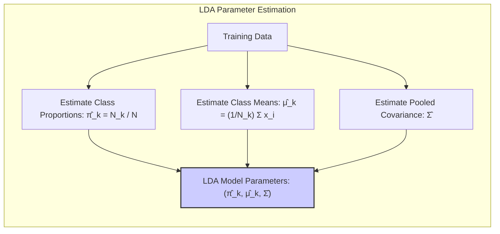
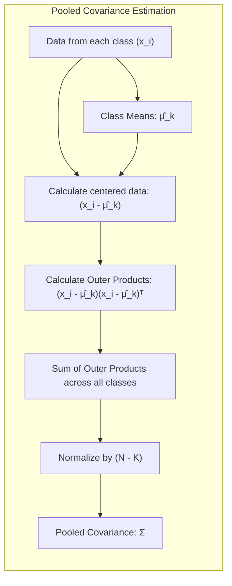
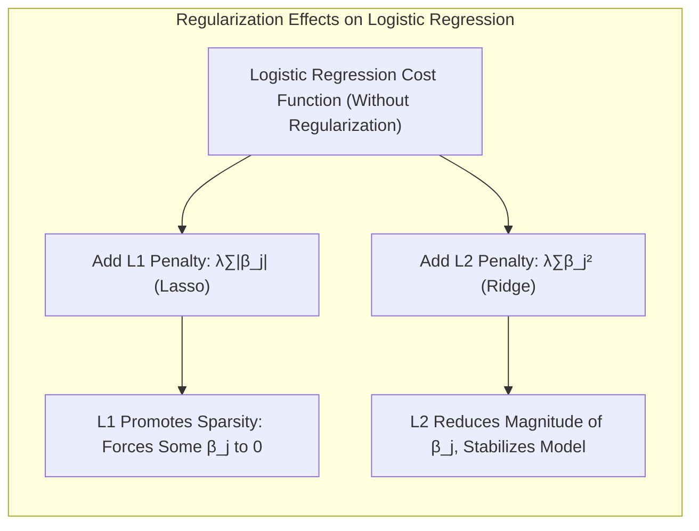
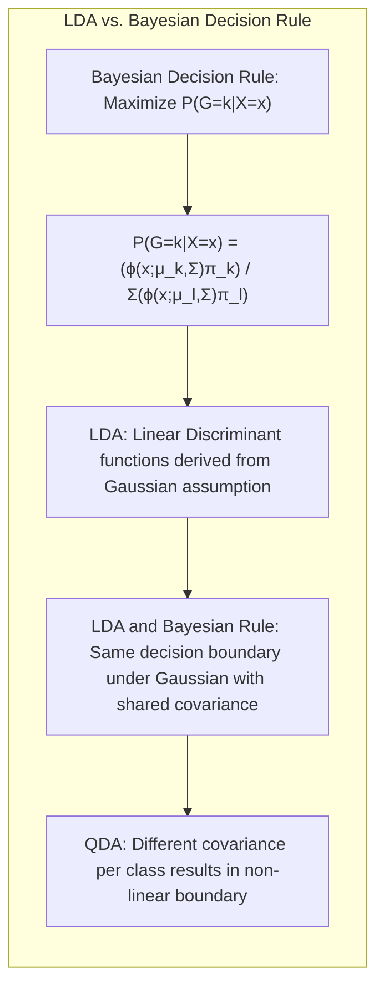

## Título Conciso: Estimação de Parâmetros no LDA, Proporções de Classe e Covariâncias Conjuntas



### Introdução

Este capítulo explora em profundidade o processo de **estimação dos parâmetros** no **Linear Discriminant Analysis (LDA)**, focando em como as **proporções de classe** e as **covariâncias conjuntas** são estimadas a partir dos dados de treinamento. Analisaremos como as médias de cada classe e a matriz de covariância comum são estimadas, e como essas estimativas se relacionam com as probabilidades a priori das classes. Compararemos a abordagem do LDA com a **regressão linear com matrizes de indicadores**, que não impõe as mesmas suposições sobre a distribuição dos dados, e com a **regressão logística**, que modela diretamente as probabilidades posteriores [^4.2], [^4.4]. Além disso, discutiremos a importância da **seleção de variáveis e regularização** para melhorar a estabilidade e a capacidade de generalização dos modelos [^4.4.4], [^4.5]. Abordaremos também o conceito de **hiperplanos separadores** e sua relação com a estimação de parâmetros no LDA [^4.5.2]. O objetivo deste capítulo é fornecer uma compreensão clara de como os parâmetros do LDA são estimados e como esses parâmetros afetam as decisões de classificação.

### Conceitos Fundamentais

**Conceito 1: Estimação dos Parâmetros no LDA e a Suposição Gaussiana**

O **LDA** assume que as densidades condicionais de classe, $P(X|G=k)$, seguem uma distribuição gaussiana multivariada com a mesma matriz de covariância $\Sigma$ para todas as classes [^4.3]. Os parâmetros do LDA a serem estimados a partir dos dados de treinamento são: o vetor de médias $\mu_k$ para cada classe $k$, a matriz de covariância comum $\Sigma$, e as probabilidades a priori das classes $\pi_k$. A estimativa desses parâmetros é fundamental para a construção do modelo de classificação. A suposição de gaussianidade com covariâncias iguais permite que as estimativas sejam obtidas de forma simples através das estatísticas amostrais.

**Lemma 1:** *A suposição de distribuições gaussianas com a mesma matriz de covariância permite a derivação de estimadores simples para os parâmetros do LDA usando estatísticas amostrais.* A prova reside na forma da densidade gaussiana multivariada e na aplicação do princípio da máxima verossimilhança.

**Conceito 2: Estimativa das Proporções de Classe e das Médias Amostrais**

As probabilidades a priori das classes $\pi_k$ são estimadas pelas **proporções de classe** nos dados de treinamento, ou seja, $\hat{\pi}_k = N_k/N$, onde $N_k$ é o número de observações da classe $k$ e $N$ é o número total de observações [^4.3]. Os vetores de médias $\mu_k$ são estimados pelas **médias amostrais** de cada classe:

$$
\hat{\mu}_k = \frac{1}{N_k} \sum_{i: g_i = k} x_i
$$

onde a soma é feita sobre todas as observações da classe $k$. Estas estimativas das médias e das probabilidades a priori são utilizadas na construção das funções discriminantes do LDA. As proporções de classe são estimativas não-viesadas das probabilidades a priori, e as médias amostrais são estimativas não-viesadas das médias populacionais (sob condições de amostragem aleatória).

> 💡 **Exemplo Numérico:**
>
> Suponha que temos um conjunto de dados com duas classes (A e B) e as seguintes observações:
>
> Classe A: $x_1 = [2, 3]$, $x_2 = [3, 4]$, $x_3 = [4, 5]$
> Classe B: $x_4 = [6, 7]$, $x_5 = [7, 8]$
>
> O número de observações na classe A é $N_A = 3$, e na classe B é $N_B = 2$. O número total de observações é $N = 5$.
>
> As proporções de classe são:
> $\hat{\pi}_A = N_A / N = 3 / 5 = 0.6$
> $\hat{\pi}_B = N_B / N = 2 / 5 = 0.4$
>
> As médias amostrais são:
> $\hat{\mu}_A = \frac{1}{3} ([2, 3] + [3, 4] + [4, 5]) = [3, 4]$
> $\hat{\mu}_B = \frac{1}{2} ([6, 7] + [7, 8]) = [6.5, 7.5]$
>
> Estas estimativas de $\hat{\pi}_A$, $\hat{\pi}_B$, $\hat{\mu}_A$ e $\hat{\mu}_B$ serão usadas no cálculo das funções discriminantes do LDA.

**Corolário 1:** *As estimativas das probabilidades a priori das classes e dos vetores de médias são obtidas diretamente através das estatísticas amostrais, representando estimativas não viesadas dos parâmetros populacionais sob a suposição de amostragem aleatória.* Isso simplifica o processo de estimação de parâmetros e torna o método computacionalmente eficiente.

**Conceito 3: Estimação da Matriz de Covariância Comum (Pooled Covariance)**

A matriz de covariância comum $\Sigma$ é estimada a partir das variâncias e covariâncias das amostras de todas as classes, calculando-se uma **matriz de covariância conjunta**, ou "pooled covariance". A estimativa da matriz de covariância comum é dada por:

$$
\hat{\Sigma} = \frac{1}{N - K} \sum_{k=1}^K \sum_{i: g_i = k} (x_i - \hat{\mu}_k)(x_i - \hat{\mu}_k)^T
$$

onde $N$ é o número total de observações, $K$ é o número de classes e $\hat{\mu}_k$ é a média amostral da classe $k$. Esta estimativa representa uma média ponderada das matrizes de covariância de cada classe, onde o peso de cada classe é proporcional ao número de amostras. A suposição de covariâncias iguais é fundamental para que esta estimativa seja usada para todas as classes [^4.3].



> 💡 **Exemplo Numérico:**
>
> Continuando o exemplo anterior, vamos calcular a matriz de covariância conjunta.
>
> Primeiro, calculamos as matrizes de covariância para cada classe:
>
> Para a classe A:
> $(x_1 - \hat{\mu}_A) = [2, 3] - [3, 4] = [-1, -1]$
> $(x_2 - \hat{\mu}_A) = [3, 4] - [3, 4] = [0, 0]$
> $(x_3 - \hat{\mu}_A) = [4, 5] - [3, 4] = [1, 1]$
> $\Sigma_A = \frac{1}{3-1} \left( [-1, -1]^T[-1, -1] + [0,0]^T[0,0] + [1, 1]^T[1, 1] \right) = \frac{1}{2} \begin{bmatrix} 2 & 2 \\ 2 & 2 \end{bmatrix} = \begin{bmatrix} 1 & 1 \\ 1 & 1 \end{bmatrix}$
>
> Para a classe B:
> $(x_4 - \hat{\mu}_B) = [6, 7] - [6.5, 7.5] = [-0.5, -0.5]$
> $(x_5 - \hat{\mu}_B) = [7, 8] - [6.5, 7.5] = [0.5, 0.5]$
> $\Sigma_B = \frac{1}{2-1} \left( [-0.5, -0.5]^T[-0.5, -0.5] + [0.5, 0.5]^T[0.5, 0.5] \right) = \begin{bmatrix} 0.5 & 0.5 \\ 0.5 & 0.5 \end{bmatrix}$
>
> Agora calculamos a matriz de covariância conjunta:
> $\hat{\Sigma} = \frac{1}{5 - 2} \left( \sum_{i \in A} (x_i - \hat{\mu}_A)(x_i - \hat{\mu}_A)^T + \sum_{i \in B} (x_i - \hat{\mu}_B)(x_i - \hat{\mu}_B)^T \right) $
>
> $\hat{\Sigma} = \frac{1}{3} \left( (3-1)\Sigma_A + (2-1)\Sigma_B \right) = \frac{1}{3} \left( 2 \begin{bmatrix} 1 & 1 \\ 1 & 1 \end{bmatrix} + 1 \begin{bmatrix} 0.5 & 0.5 \\ 0.5 & 0.5 \end{bmatrix} \right) = \frac{1}{3} \begin{bmatrix} 2.5 & 2.5 \\ 2.5 & 2.5 \end{bmatrix} = \begin{bmatrix} 5/6 & 5/6 \\ 5/6 & 5/6 \end{bmatrix} $

> Esta é a matriz de covariância conjunta que será utilizada no LDA.

> ⚠️ **Nota Importante**: A estimativa dos parâmetros no LDA utiliza as estatísticas amostrais (proporções, médias e covariância conjunta) para obter estimativas não viesadas dos parâmetros populacionais.

> ❗ **Ponto de Atenção**: A estimativa da matriz de covariância conjunta depende da suposição de que as classes compartilham a mesma matriz de covariância, o que pode não ser válido em todos os casos.

> ✔️ **Destaque**: A combinação das proporções de classe, médias amostrais e matriz de covariância comum permite a estimativa dos parâmetros do LDA, o que leva a funções discriminantes lineares e a fronteiras de decisão lineares.

### Regressão Linear e Mínimos Quadrados para Classificação

```mermaid
graph LR
    subgraph "Comparison of LDA and Linear Regression"
        direction LR
        A["LDA"] --> B["Estimates μ_k, Σ"]
        B --> C["Models Conditional Densities P(X|G=k)"]
        C --> E["Uses Pooled Covariance Σ̂"]
        F["Linear Regression with Indicator Matrices"] --> G["Estimates β_k directly"]
        G --> H["Fits models f_k(x) independently"]
        H --> I["No common covariance matrix"]
         E --"Gaussian Assumption"--> J
         I --"No Assumption"--> K
        J -->L ["Linear Decision Boundaries"]
        K --> M ["Potentially complex boundaries"]
    end
```

Na **regressão linear com matrizes de indicadores**, o ajuste dos modelos lineares $f_k(x) = \beta_{k0} + \beta_k^T x$ para cada classe é realizado de forma independente, utilizando o método dos mínimos quadrados, sem a necessidade de modelar as densidades condicionais de classe de forma explícita e sem a suposição de igualdade das matrizes de covariância [^4.2]. As estimativas dos coeficientes $\beta_{k0}$ e $\beta_k$ são obtidas minimizando a soma dos quadrados das diferenças entre os valores preditos e os valores observados, e não através de estimativas das médias e covariâncias como no LDA.

O método dos mínimos quadrados na regressão linear busca minimizar a função de custo, dada por:

$$
\min_{\beta_{k0}, \beta_k} \sum_{i=1}^N (y_{ik} - (\beta_{k0} + \beta_k^T x_i))^2
$$

onde $y_{ik}$ é o indicador da classe $k$ para a observação $i$, o que leva a uma solução com um conjunto de parâmetros separados para cada classe [^4.2]. A regressão linear, portanto, não utiliza informações sobre as probabilidades a priori das classes e não modela as densidades condicionais, o que é um contraste importante com o LDA.

> 💡 **Exemplo Numérico:**
>
> Vamos usar os mesmos dados do exemplo anterior para ilustrar a regressão linear com matrizes de indicadores. Primeiro, criamos as matrizes indicadoras para cada classe.
>
> Observações:
> $x_1 = [2, 3]$, $y_{A1} = 1$, $y_{B1} = 0$
> $x_2 = [3, 4]$, $y_{A2} = 1$, $y_{B2} = 0$
> $x_3 = [4, 5]$, $y_{A3} = 1$, $y_{B3} = 0$
> $x_4 = [6, 7]$, $y_{A4} = 0$, $y_{B4} = 1$
> $x_5 = [7, 8]$, $y_{A5} = 0$, $y_{B5} = 1$
>
> Para a classe A, o modelo de regressão linear é:
> $f_A(x) = \beta_{A0} + \beta_{A1} x_1 + \beta_{A2} x_2$
>
> Para a classe B, o modelo de regressão linear é:
> $f_B(x) = \beta_{B0} + \beta_{B1} x_1 + \beta_{B2} x_2$
>
> Usando o método dos mínimos quadrados, podemos encontrar os coeficientes $\beta_{A0}$, $\beta_{A1}$, $\beta_{A2}$, $\beta_{B0}$, $\beta_{B1}$ e $\beta_{B2}$.
>
> O resultado do ajuste por mínimos quadrados para este conjunto de dados (usando um software de estatística ou bibliotecas como scikit-learn) pode ser algo como:
>
> $\hat{\beta}_{A0} \approx -0.667, \hat{\beta}_{A1} \approx 0.333, \hat{\beta}_{A2} \approx 0.333$
> $\hat{\beta}_{B0} \approx -0.333, \hat{\beta}_{B1} \approx 0.167, \hat{\beta}_{B2} \approx 0.167$
>
> Observe que estes parâmetros são estimados de forma independente para cada classe, e não há compartilhamento da matriz de covariância como no LDA.
>
> A previsão para uma nova observação $x_{new}$ será feita atribuindo à classe $k$ cujo modelo linear $f_k(x_{new})$ tiver o maior valor.

A comparação com a estimação de parâmetros no LDA destaca as diferenças nas abordagens. Enquanto o LDA modela as densidades condicionais como Gaussianas e estima a matriz de covariância comum, a regressão linear não utiliza essas suposições. A consequência dessa diferença é que a regressão linear pode não ter o mesmo desempenho em situações onde as suposições do LDA são válidas.

**Lemma 2:** *A regressão linear com matrizes de indicadores não estima os parâmetros a partir das médias e da covariância conjunta, como faz o LDA, e o ajuste é feito independentemente para cada classe usando o método dos mínimos quadrados.* A prova reside na formulação da função objetivo e da derivação dos parâmetros para cada método.

**Corolário 2:** *A falta da suposição de igualdade de covariâncias na regressão linear com matrizes de indicadores leva a modelos mais flexíveis, mas também mais suscetíveis ao overfitting e com resultados que não necessariamente se comportam como probabilidades.* Essa característica da regressão linear, a impede de ser totalmente consistente com a base teórica da teoria da decisão.

A regressão linear, ao não utilizar estimativas das médias e covariâncias, pode ser menos eficiente em situações onde a suposição de gaussianidade e igualdade das covariâncias se verifica, do que métodos como o LDA, que levam essas informações em consideração. Em contrapartida, ela pode ser mais robusta em dados onde essas suposições não se aplicam [^4.2], [^4.3].

### Métodos de Seleção de Variáveis e Regularização em Classificação



A **seleção de variáveis** e a **regularização** desempenham um papel fundamental na melhoria da capacidade de generalização e da estabilidade dos modelos de classificação, incluindo aqueles que estimam parâmetros como no LDA [^4.5]. A regularização, em particular, adiciona um termo de penalidade à função de custo, restringindo os valores dos coeficientes e evitando o overfitting.

Na **regressão logística**, que modela diretamente a probabilidade posterior, a função de custo regularizada pode ser expressa como:

$$
\max_{\beta_0, \beta} \left[ \sum_{i=1}^N \left( y_i (\beta_0 + \beta^T x_i) - \log(1 + e^{\beta_0 + \beta^T x_i}) \right) - \lambda P(\beta) \right]
$$

onde $P(\beta)$ é a penalidade e $\lambda$ é o parâmetro de regularização. A penalidade **L1** (Lasso), dada por $P(\beta) = \sum_{j=1}^p |\beta_j|$, promove a esparsidade nos coeficientes, selecionando as variáveis mais relevantes para a modelagem da probabilidade posterior. A penalidade **L2** (Ridge), dada por $P(\beta) = \sum_{j=1}^p \beta_j^2$, reduz a magnitude dos coeficientes, estabilizando o modelo e evitando o *overfitting* [^4.4.4], [^4.5].

> 💡 **Exemplo Numérico:**
>
> Vamos considerar um exemplo com regressão logística e regularização L1 (Lasso). Suponha que temos um modelo de regressão logística com duas variáveis preditoras ($x_1$ e $x_2$) e um termo de intercepto, e que a função de custo após regularização L1 é dada por:
>
> $J(\beta) = -\sum_{i=1}^N \left( y_i \log(\hat{p}_i) + (1-y_i) \log(1-\hat{p}_i) \right) + \lambda (|\beta_1| + |\beta_2|)$
>
> onde $\hat{p}_i = \frac{1}{1 + e^{-(\beta_0 + \beta_1 x_{i1} + \beta_2 x_{i2})}}$ é a probabilidade prevista para a observação $i$.
>
> Suponha que, sem regularização ($\lambda = 0$), os coeficientes estimados sejam:
>
> $\beta_0 = 0.5$, $\beta_1 = 2.0$, $\beta_2 = -1.5$
>
> Agora, vamos aplicar a regularização L1 com $\lambda = 0.8$. O processo de otimização (que é realizado numericamente) irá encontrar novos valores para os coeficientes, que podem ser, por exemplo:
>
> $\beta_0 = 0.4$, $\beta_1 = 1.2$, $\beta_2 = 0$
>
> Note que o coeficiente $\beta_2$ foi forçado a zero, indicando que a variável $x_2$ foi selecionada para ser removida do modelo.
>
> Se tivéssemos usado regularização L2 (Ridge) com o mesmo valor de $\lambda$, os coeficientes poderiam ser algo como:
>
> $\beta_0 = 0.45$, $\beta_1 = 1.6$, $\beta_2 = -1.2$
>
> Neste caso, todos os coeficientes são reduzidos em magnitude, mas nenhum foi forçado exatamente a zero.

A aplicação da regularização, mesmo em métodos como o LDA que utilizam médias e covariâncias para modelar as densidades condicionais, ajuda a controlar a complexidade do modelo, melhorando a sua capacidade de generalização e reduzindo o risco de *overfitting*.

**Lemma 3:** *A penalidade L1 na regressão logística, ao promover a esparsidade, leva a uma estimativa dos parâmetros mais simples e com melhor capacidade de generalização.* Isso ocorre devido ao efeito da penalidade L1 sobre o valor dos coeficientes, forçando-os a serem exatamente zero [^4.4.4].

**Prova do Lemma 3:** A penalidade L1 impõe uma taxa constante de decréscimo nos coeficientes durante o processo de otimização da função de custo. O efeito deste termo é fazer com que alguns dos coeficientes se tornem exatamente zero, o que leva a uma representação mais esparsa do modelo. A esparsidade resulta em modelos mais simples e fáceis de interpretar [^4.4.3]. $\blacksquare$

**Corolário 3:** *A regularização, tanto L1 quanto L2, ajuda a controlar o overfitting, melhorando a estimativa dos parâmetros nos modelos de classificação linear, e resulta em modelos mais robustos e com maior capacidade de generalização.* As penalidades levam a estimativas mais estáveis dos parâmetros, e por consequência a modelos mais robustos.

> ⚠️ **Ponto Crucial**: A regularização é uma ferramenta fundamental para melhorar a estabilidade e a capacidade de generalização dos modelos de classificação linear, incluindo aqueles que estimam parâmetros com base em estatísticas amostrais como no LDA [^4.5].

### Separating Hyperplanes e Perceptrons

```mermaid
graph LR
    subgraph "Hyperplane and Perceptron"
        direction TB
        A["LDA: Hyperplane from means and pooled covariance"]
        B["Perceptron: Iterative search for separating hyperplane"]
        C["Perceptron: Initialize weights"]
        D["Perceptron: Classify data points"]
         E["Perceptron: Update weights based on misclassifications"]
         F["Perceptron: Repeat until convergence"]
        B --> C
        C --> D
        D --> E
        E --> F
        A --"Explicit Formula"--> G
        F --"Iterative Update"--> H
        G--> I["Optimal Linear Boundary"]
        H--> J ["Approximation of Linear Boundary"]
    end
```

A ideia de **hiperplanos separadores** busca encontrar uma fronteira linear que maximize a distância entre as classes, separando as amostras de forma clara, com o objetivo de construir modelos mais robustos e com boa capacidade de generalização [^4.5.2]. A busca pelo hiperplano separador se relaciona com a estimação dos parâmetros no LDA, pois o hiperplano ótimo é derivado a partir das médias das classes e da matriz de covariância comum.

O algoritmo do **Perceptron**, por sua vez, busca um hiperplano separador ajustando os parâmetros do modelo de forma iterativa com base nas classificações incorretas [^4.5.1]. Embora o Perceptron não modele as densidades condicionais explicitamente, ele busca uma solução que separe as classes, e que pode ser vista como uma aproximação para o hiperplano ideal, dada a forma linear do modelo. Se os dados forem linearmente separáveis, o Perceptron converge para um hiperplano separador em um número finito de iterações, mas sem garantir a maximização da margem.

> 💡 **Exemplo Numérico:**
>
> Vamos ilustrar o conceito de hiperplano separador e o Perceptron com um exemplo simplificado. Suponha que temos duas classes com os seguintes pontos:
>
> Classe A: $x_1 = [1, 1]$, $x_2 = [2, 1]$
> Classe B: $x_3 = [1, 3]$, $x_4 = [2, 3]$
>
> O objetivo do Perceptron é encontrar um hiperplano (neste caso, uma linha) que separe as classes. O Perceptron começa com um hiperplano aleatório e o atualiza iterativamente.
>
> Inicialização: $\beta = [0.1, 0.2]$, $\beta_0 = -0.5$ (valores aleatórios).
>
> Iteração 1:
> - Para $x_1$: $0.1*1 + 0.2*1 - 0.5 = -0.2$. Classificado incorretamente como B (deveria ser A). Atualizamos os pesos: $\beta = \beta + \eta x_1$, $\beta_0 = \beta_0 + \eta$, onde $\eta$ é a taxa de aprendizagem (e.g. $\eta = 0.1$).
> - $\beta = [0.1, 0.2] + 0.1 * [1, 1] = [0.2, 0.3]$, $\beta_0 = -0.5 + 0.1 = -0.4$.
>
> Iteração 2:
> - Para $x_2$: $0.2*2 + 0.3*1 - 0.4 = 0.3$. Classificado corretamente como A.
> - Para $x_3$: $0.2*1 + 0.3*3 - 0.4 = 0.7$. Classificado incorretamente como A (deveria ser B). Atualizamos os pesos: $\beta = [0.2, 0.3] - 0.1 * [1, 3] = [0.1, 0]$, $\beta_0 = -0.4 - 0.1 = -0.5$.
>
> Iterações seguintes: O algoritmo continua ajustando o hiperplano até convergir para uma solução que separe as classes corretamente.
>
> Ao final da convergência, o Perceptron terá encontrado um hiperplano separador.
>
> Este hiperplano separador é determinado pelos parâmetros $\beta$ e $\beta_0$. No LDA, o hiperplano separador também é derivado usando as médias das classes e a matriz de covariância conjunta, mas de forma não iterativa.
>
> O Perceptron, por ser um método iterativo, não garante a maximização da margem, ao contrário do SVM que busca o hiperplano com maior margem.

**Teorema:** *Se o conjunto de dados de treinamento é linearmente separável, o algoritmo do Perceptron garante a convergência para um hiperplano separador em um número finito de passos.* Essa propriedade de convergência sob condições de separabilidade linear é uma das características do algoritmo do Perceptron [^4.5.1].

### Pergunta Teórica Avançada: Quais as diferenças fundamentais entre a formulação de LDA e a Regra de Decisão Bayesiana considerando distribuições Gaussianas com covariâncias iguais?



**Resposta:**

A **Regra de Decisão Bayesiana** busca classificar uma observação $x$ na classe $k$ que maximize a probabilidade posterior $P(G=k|X=x)$ [^4.3]. Sob a suposição de que as distribuições condicionais são Gaussianas com a mesma matriz de covariância $\Sigma$, a probabilidade posterior é dada por:

$$
P(G=k|X=x) = \frac{ \phi(x;\mu_k,\Sigma)\pi_k}{\sum_{l=1}^K \phi(x;\mu_l,\Sigma)\pi_l}
$$

onde $\phi(x;\mu_k,\Sigma)$ é a densidade gaussiana da classe $k$, $\mu_k$ é a média da classe $k$ e $\pi_k$ é a probabilidade a priori da classe $k$. O **LDA** deriva suas funções discriminantes lineares diretamente dessas suposições, através da análise da log-razão das probabilidades posteriores [^4.3].

**Lemma 4:** *Sob a suposição de distribuições Gaussianas com a mesma matriz de covariância, a regra de decisão Bayesiana e o LDA levam à mesma fronteira de decisão linear.* A prova é feita mostrando que o log-ratio das probabilidades posteriores na regra de decisão Bayesiana resulta na mesma forma da função discriminante do LDA. [^4.3]

**Corolário 4:** *A remoção da restrição de igualdade de covariâncias na regra de decisão Bayesiana leva ao Quadratic Discriminant Analysis (QDA), onde a fronteira de decisão não é mais linear e as matrizes de covariância são estimadas separadamente para cada classe.* Essa diferença destaca o impacto das suposições sobre a distribuição dos dados no resultado da classificação [^4.3.1], [^4.3.3].

> ⚠️ **Ponto Crucial**: A principal diferença entre LDA e a regra de decisão Bayesiana reside na forma como os métodos são derivados e na imposição ou não da restrição de covariâncias iguais. O LDA impõe esta restrição enquanto que, sob a mesma premissa, a regra Bayesiana resulta no mesmo método. [^4.3]

### Conclusão

Neste capítulo, exploramos em detalhes o processo de estimação dos parâmetros no LDA, enfatizando a importância das proporções de classe e da covariância conjunta na construção do modelo. Analisamos como o LDA utiliza a suposição de gaussianidade e de igualdade de covariâncias para derivar funções discriminantes lineares, e como essas suposições se relacionam com a teoria de decisão. Compararmos o LDA com a regressão linear com matrizes de indicadores, que não modela as densidades condicionais diretamente, e com a regressão logística, que modela as probabilidades posteriores de forma mais direta. Abordamos também como a seleção de variáveis e a regularização melhoram a estabilidade dos modelos, e como a busca por hiperplanos separadores se conecta com a estimação de parâmetros no LDA. Ao longo do capítulo, procuramos fornecer uma compreensão clara e aprofundada de como os parâmetros do LDA são estimados e como esses parâmetros afetam a qualidade das decisões de classificação.

### Footnotes

[^4.1]: *In this chapter we revisit the classification problem and focus on linear methods for classification...There are several different ways in which linear decision boundaries can be found.* *(Trecho de Linear Methods for Classification)*

[^4.2]: *In Chapter 2 we fit linear regression models to the class indicator variables, and classify to the largest fit...Linear inequalities in this space are quadratic inequalities in the original space.* *(Trecho de Linear Methods for Classification)*

[^4.3]: *Decision theory for classification (Section 2.4) tells us that we need to know the class posteriors Pr(G|X) for optimal classification. Suppose fk(x) is the class-conditional density of X in class G = k, and let πκ be the prior probability of class k... Linear discriminant analysis (LDA) arises in the special case when we assume that the classes have a common covariance matrix Σk = Σ.* *(Trecho de Linear Methods for Classification)*

[^4.3.1]: *The decision boundary between each pair of classes k and l is described by a quadratic equation {x: δκ(x) = δ(x)}.* *(Trecho de Linear Methods for Classification)*

[^4.3.3]: *In the special case when we assume that the classes have a common covariance matrix...When the classes are really Gaussian, then LDA is optimal* *(Trecho de Linear Methods for Classification)*

[^4.4]: *The logistic regression model arises from the desire to model the posterior probabilities of the K classes via linear functions in x, while at the same time ensuring that they sum to one and remain in [0,1].* *(Trecho de Linear Methods for Classification)*

[^4.4.1]: *Logistic regression models are usually fit by maximum likelihood... The logistic regression model is more general, in that it makes less assumptions.* *(Trecho de Linear Methods for Classification)*

[^4.4.2]: *It is convenient to code the two-class gi via a 0/1 response Yi, where yi = 1 when gi = 1, and yi = 0 when gi = 2... Typically many models are fit in a search for a parsimonious model involving a subset of the variables.* *(Trecho de Linear Methods for Classification)*

[^4.4.3]: *To maximize the log-likelihood, we set its derivatives to zero. These score equations are...To solve the score equations (4.21), we use the Newton-Raphson algorithm...* *(Trecho de Linear Methods for Classification)*

[^4.4.4]: *The L1 penalty used in the lasso (Section 3.4.2) can be used for variable selection and shrinkage with any linear regression model...As with the lasso, we typically do not penalize the intercept term.* *(Trecho de Linear Methods for Classification)*

[^4.5]: *Here we present an analysis of binary data to illustrate the traditional statistical use of the logistic regression model... With two classes there is a simple correspondence between linear discriminant analysis and classification by linear least squares, as in (4.5).* *(Trecho de Linear Methods for Classification)*

[^4.5.1]: *The perceptron learning algorithm tries to find a separating hyperplane by minimizing the distance of misclassified points to the decision boundary.* *(Trecho de Linear Methods for Classification)*

[^4.5.2]: *The optimal separating hyperplane separates the two classes and maximizes the distance to the closest point