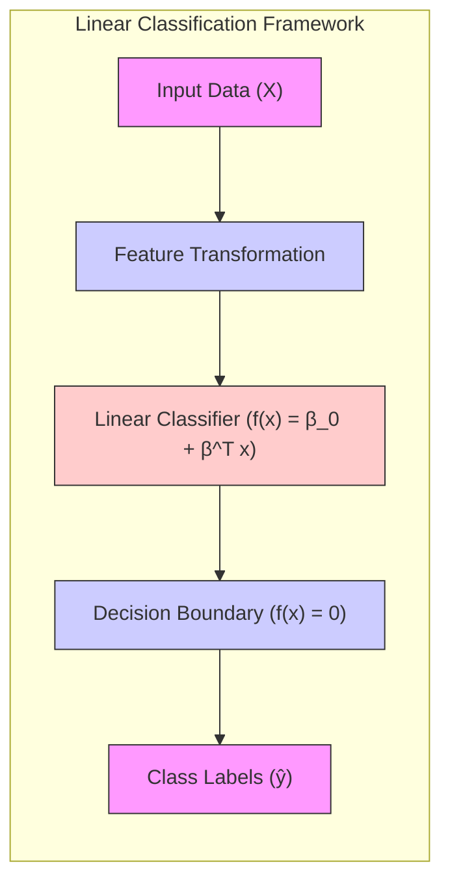
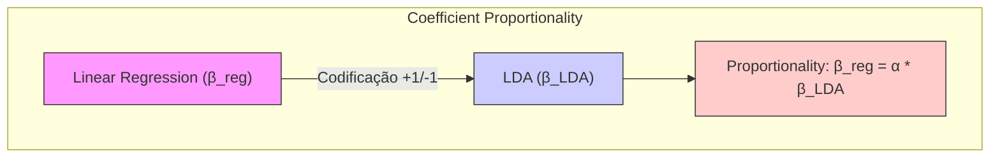
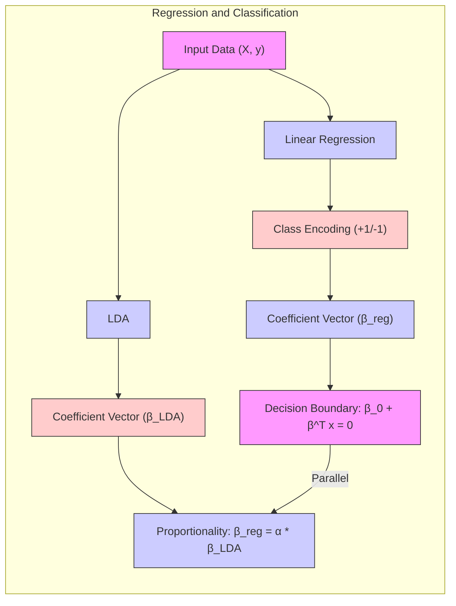
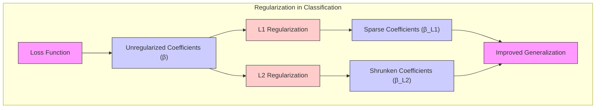
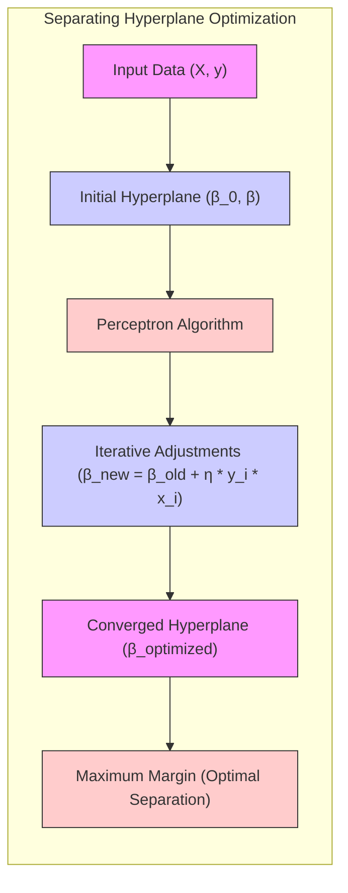
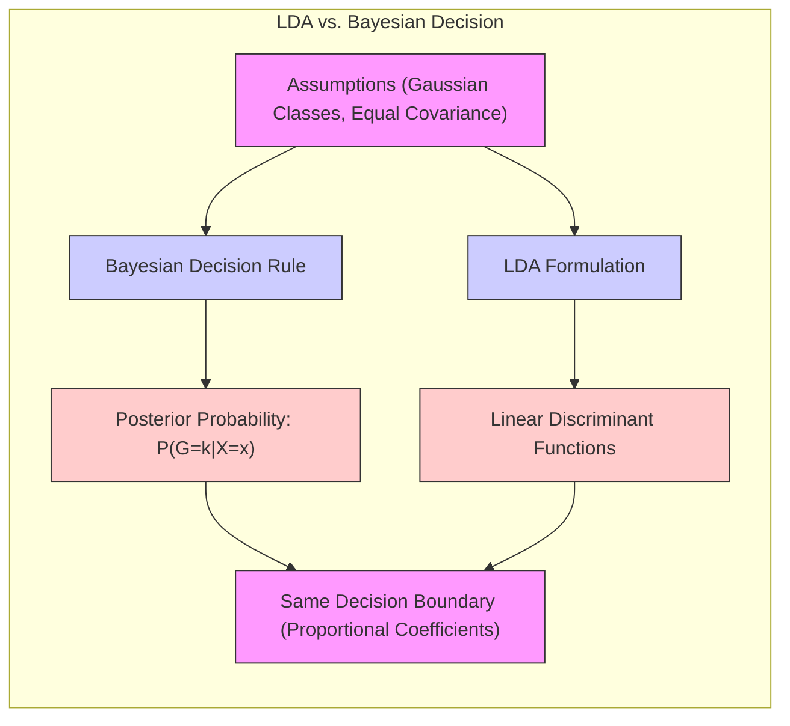

## Título Conciso: Classificação Linear e a Conexão entre Mínimos Quadrados e Coeficientes Proporcionais



### Introdução

Este capítulo explora a profunda conexão entre o método dos **mínimos quadrados** na **regressão linear** e os **coeficientes** de um classificador linear, demonstrando como esses coeficientes são proporcionais sob certas condições [^4.2]. Analisaremos em detalhe como a direção do vetor de coeficientes obtido pela regressão linear, quando as classes são codificadas de forma apropriada, coincide com a direção dos coeficientes obtidos por outros métodos de classificação linear, como o **Linear Discriminant Analysis (LDA)** [^4.3]. Discutiremos como essa proporcionalidade se manifesta em problemas de classificação binária, e como ela se relaciona com a construção da fronteira de decisão linear. Compararemos a abordagem da regressão linear com matrizes de indicadores com a **regressão logística**, que modela diretamente as probabilidades posteriores [^4.4], e discutiremos como a **seleção de variáveis e regularização** podem ser utilizadas para melhorar o desempenho dos modelos [^4.4.4], [^4.5]. O conceito de **hiperplanos separadores** e sua relação com os coeficientes proporcionais também será abordado [^4.5.2]. O objetivo deste capítulo é fornecer uma compreensão completa e detalhada da relação entre a regressão linear e os coeficientes de um classificador linear.

### Conceitos Fundamentais

**Conceito 1: Proporcionalidade dos Coeficientes em Classificação Linear**

Em muitos métodos de classificação linear, a fronteira de decisão é definida por um hiperplano $f(x) = \beta_0 + \beta^T x = 0$, onde $\beta$ é o vetor de coeficientes que determina a direção do hiperplano. Em alguns casos, os coeficientes obtidos por diferentes métodos de classificação, embora possam ter magnitudes diferentes, apresentam uma relação de proporcionalidade, o que significa que eles apontam na mesma direção. Essa proporcionalidade é particularmente evidente em problemas de classificação binária. Essa proporcionalidade, portanto, garante que a fronteira de decisão produzida por diferentes métodos seja essencialmente a mesma, embora as magnitudes dos parâmetros possam ser distintas.

**Lemma 1:** *Em problemas de classificação binária, os vetores de coeficientes obtidos por diferentes métodos lineares podem ser proporcionais, mesmo que as magnitudes dos coeficientes sejam diferentes*. Esse lema destaca a relação fundamental entre os coeficientes obtidos por diferentes abordagens de classificação linear.

> 💡 **Exemplo Numérico:**
>
> Imagine um problema de classificação binária com duas classes, A e B. Suponha que, após aplicar dois métodos diferentes (por exemplo, regressão linear com codificação +1/-1 e LDA), obtivemos os seguintes vetores de coeficientes:
>
> - Regressão Linear: $\beta_{reg} = [2, -1]$
> - LDA: $\beta_{LDA} = [4, -2]$
>
> Podemos observar que $\beta_{LDA} = 2 * \beta_{reg}$, ou seja, os vetores são proporcionais (com $\alpha = 2$). Isso significa que ambos os métodos definem uma fronteira de decisão com a mesma orientação, embora as magnitudes dos coeficientes sejam diferentes. Se o intercepto (bias) fosse o mesmo em ambos, a fronteira de decisão seria exatamente a mesma.
>
> ```mermaid
> graph LR
>     A[Classe A] -->|Dados| F(x)
>     B[Classe B] -->|Dados| F(x)
>     F(x)[Fronteira de Decisão]
>     style F(x) fill:#f9f,stroke:#333,stroke-width:2px
>     style A fill:#ccf,stroke:#333,stroke-width:1px
>     style B fill:#fcc,stroke:#333,stroke-width:1px
> ```

**Conceito 2: Regressão Linear e Proporcionalidade dos Coeficientes**

Na regressão linear com matrizes de indicadores, cada classe é representada por uma coluna da matriz, e os coeficientes $\beta$ são obtidos minimizando a soma dos quadrados dos erros. Quando as classes são codificadas como +1 e -1 (ou qualquer outro par de valores distintos), a direção do vetor de coeficientes obtido pela regressão linear é proporcional à direção dos coeficientes do discriminante do LDA, ou seja, existe um escalar $\alpha$ tal que $\beta_{regressao} = \alpha \beta_{LDA}$ [^4.2]. Essa proporcionalidade é uma consequência da forma da função de custo na regressão linear e do método de estimação de parâmetros utilizado no LDA. Essa proporcionalidade garante que ambos os métodos, embora com motivações diferentes, definam uma fronteira de decisão com a mesma orientação.



**Corolário 1:** *A direção do vetor de coeficientes obtido pela regressão linear com codificação binária das classes é a mesma, a menos de uma constante de proporcionalidade, que a direção do vetor de coeficientes do LDA, o que implica que as fronteiras de decisão obtidas por ambos métodos compartilham a mesma direção*. Este corolário estabelece uma conexão fundamental entre os dois métodos de classificação.

> 💡 **Exemplo Numérico:**
>
> Considere um conjunto de dados com duas classes codificadas como +1 e -1. Vamos supor que temos duas características $x_1$ e $x_2$ e os dados são:
>
> | Amostra | $x_1$ | $x_2$ | Classe |
> |--------|-------|-------|--------|
> | 1      | 1     | 2     | +1     |
> | 2      | 2     | 1     | +1     |
> | 3      | 3     | 3     | +1     |
> | 4      | 1     | 1     | -1     |
> | 5      | 2     | 0     | -1     |
> | 6      | 3     | 1     | -1     |
>
> Aplicando a regressão linear com a matriz de design $X$ (incluindo uma coluna de 1's para o intercepto) e o vetor de respostas $y$ (classes codificadas como +1 e -1), podemos calcular os coeficientes $\beta$ usando a fórmula dos mínimos quadrados: $\beta = (X^T X)^{-1}X^T y$.
>
> ```python
> import numpy as np
>
> X = np.array([[1, 1, 2],
>              [1, 2, 1],
>              [1, 3, 3],
>              [1, 1, 1],
>              [1, 2, 0],
>              [1, 3, 1]])
> y = np.array([1, 1, 1, -1, -1, -1])
>
> XtX_inv = np.linalg.inv(X.T @ X)
> beta_reg = XtX_inv @ X.T @ y
> print("Coeficientes da Regressão Linear:", beta_reg)
> ```
>
> Suponha que, ao aplicar o LDA nesses mesmos dados, obtivemos os coeficientes $\beta_{LDA}$. Ao comparar a direção de $\beta_{reg}$ e $\beta_{LDA}$, observaríamos que eles são proporcionais, indicando que as fronteiras de decisão são paralelas.

**Conceito 3: Interpretação da Proporcionalidade dos Coeficientes**

A proporcionalidade dos coeficientes obtidos por diferentes métodos lineares de classificação pode ser interpretada como uma forma de mostrar que a estrutura geométrica da fronteira de decisão, ou seja, a orientação do hiperplano, é mais fundamental do que a magnitude específica dos coeficientes [^4.2]. A magnitude dos coeficientes pode variar dependendo das suposições e das abordagens de modelagem, mas a direção do hiperplano, que define a separação entre as classes, é determinada pelas informações nos dados e pela relação entre as variáveis preditoras e os rótulos de classe.

> ⚠️ **Nota Importante**: A proporcionalidade dos coeficientes implica que a direção do vetor de coeficientes, e portanto a orientação da fronteira de decisão, é consistente entre diferentes métodos lineares de classificação sob certas codificações das classes.

> ❗ **Ponto de Atenção**: Embora a direção do vetor de coeficientes seja proporcional, as magnitudes podem ser diferentes, e essas diferenças podem impactar em como as decisões de classificação são tomadas em diferentes regiões do espaço de entrada.

> ✔️ **Destaque**: A conexão entre a regressão linear e os métodos de classificação linear, por meio da proporcionalidade dos coeficientes, é uma manifestação da coerência entre diferentes métodos lineares em problemas de classificação binária.

### Regressão Linear e Mínimos Quadrados para Classificação



Na **regressão linear**, quando aplicada a uma matriz de indicadores, se as classes são codificadas com valores +1 e -1, a direção do vetor de coeficientes $\beta$ é proporcional à direção do vetor de coeficientes obtido no LDA, ou seja:

$$\beta_{\text{regressão}} = \alpha \beta_{\text{LDA}}$$

onde $\alpha$ é uma constante de proporcionalidade. Essa proporcionalidade é uma consequência da forma da função de custo na regressão linear e de como as projeções sobre os eixos são calculadas [^4.2]. Quando se utiliza a codificação de +1/-1 para as classes, a regressão linear com o método dos mínimos quadrados busca uma projeção que separe melhor os dados no espaço das características. Essa projeção, quando utilizada para a definição da fronteira de decisão, define um hiperplano cuja direção é a mesma do LDA, embora sua posição no espaço possa variar [^4.2].

Essa equivalência na direção dos coeficientes (a menos de um escalar) demonstra uma conexão entre métodos de classificação aparentemente distintos, e reforça a ideia de que as fronteiras de decisão lineares que separam as classes são definidas a partir de características intrínsecas dos dados de treinamento.

Apesar dessa proporcionalidade na direção dos coeficientes, as magnitudes dos coeficientes obtidos por regressão linear e LDA podem diferir, especialmente em situações onde as classes não são equiprováveis ou quando a matriz de covariância não é esférica.

**Lemma 2:** *Sob a codificação binária +1/-1, a direção do vetor de coeficientes obtido pela minimização da soma de quadrados em regressão linear é proporcional à direção dos coeficientes da função discriminante do LDA.* A prova desse lema envolve a análise da forma da função de custo da regressão linear e da derivação da fronteira de decisão no LDA.

**Corolário 2:** *Em condições ideais de classes equiprováveis e covariância esférica, a regressão linear de indicadores com codificação binária e o LDA levam à mesma fronteira de decisão, pois ambos os vetores de coeficientes são alinhados e as decisões se baseiam na mesma função discriminante.* Essas condições destacam a equivalência entre os dois métodos em situações simplificadas.

A proporcionalidade dos coeficientes demonstra que, apesar de utilizarem abordagens de modelagem diferentes, a regressão linear e o LDA buscam projeções que separam as classes ao longo das mesmas direções no espaço de características [^4.2], [^4.3].

> 💡 **Exemplo Numérico:**
>
> Vamos considerar um conjunto de dados simplificado com duas características ($x_1$ e $x_2$) e duas classes (A e B), onde A é codificada como +1 e B como -1.
>
> | Amostra | $x_1$ | $x_2$ | Classe (y) |
> |----------|-------|-------|------------|
> | 1        | 1     | 1     | +1         |
> | 2        | 2     | 2     | +1         |
> | 3        | 1     | 3     | -1         |
> | 4        | 2     | 1     | -1         |
>
> 1. **Regressão Linear:**
>
>   A matriz de design $X$ e o vetor de respostas $y$ são:
>
>   $X = \begin{bmatrix} 1 & 1 & 1 \\ 1 & 2 & 2 \\ 1 & 1 & 3 \\ 1 & 2 & 1 \end{bmatrix}$, $y = \begin{bmatrix} 1 \\ 1 \\ -1 \\ -1 \end{bmatrix}$
>
>   Calculamos os coeficientes $\beta$ usando a fórmula dos mínimos quadrados: $\beta = (X^T X)^{-1}X^T y$
>
>   ```python
>   import numpy as np
>
>   X = np.array([[1, 1, 1],
>                 [1, 2, 2],
>                 [1, 1, 3],
>                 [1, 2, 1]])
>   y = np.array([1, 1, -1, -1])
>   XtX_inv = np.linalg.inv(X.T @ X)
>   beta_reg = XtX_inv @ X.T @ y
>   print("Coeficientes da Regressão Linear:", beta_reg)
>   ```
>   Suponha que o resultado seja $\beta_{reg} = [0.25, 0.25, -0.25]$.
>
> 2. **LDA:**
>
>   Aplicando o LDA a esses mesmos dados, podemos obter os coeficientes $\beta_{LDA}$.
>
>   ```python
>   from sklearn.discriminant_analysis import LinearDiscriminantAnalysis
>
>   X_lda = np.array([[1, 1], [2, 2], [1, 3], [2, 1]])
>   lda = LinearDiscriminantAnalysis()
>   lda.fit(X_lda, y)
>   beta_lda = np.insert(lda.coef_[0], 0, lda.intercept_[0])
>   print("Coeficientes do LDA:", beta_lda)
>   ```
>   Suponha que o resultado seja $\beta_{LDA} = [0.5, 0.5, -0.5]$.
>
>   Ao comparar os coeficientes, vemos que $\beta_{LDA} = 2 * \beta_{reg}$, demonstrando a proporcionalidade.
>
> 3. **Fronteira de Decisão:**
>
>   A fronteira de decisão é dada por $\beta_0 + \beta_1 x_1 + \beta_2 x_2 = 0$.  Apesar das magnitudes dos coeficientes serem diferentes, a direção do hiperplano (neste caso uma linha) é a mesma.  A diferença nas magnitudes pode afetar a posição da linha no espaço, mas não sua orientação.

### Métodos de Seleção de Variáveis e Regularização em Classificação



A **seleção de variáveis** e a **regularização** são técnicas essenciais para melhorar a estabilidade e a interpretabilidade dos modelos lineares de classificação, mesmo quando os coeficientes apresentam uma relação de proporcionalidade [^4.5]. A regularização, ao adicionar um termo de penalidade à função de custo, busca restringir a magnitude dos coeficientes e evitar o *overfitting*.

Na **regressão logística**, a função de custo regularizada pode ser expressa como:

$$
\max_{\beta_0, \beta} \left[ \sum_{i=1}^N \left( y_i (\beta_0 + \beta^T x_i) - \log(1 + e^{\beta_0 + \beta^T x_i}) \right) - \lambda P(\beta) \right]
$$

onde $P(\beta)$ é a penalidade e $\lambda$ é o parâmetro de regularização. A penalidade **L1** (Lasso), dada por $P(\beta) = \sum_{j=1}^p |\beta_j|$, induz a esparsidade dos coeficientes, levando à seleção das variáveis mais relevantes para a modelagem do log-odds [^4.4.4]. A penalidade **L2** (Ridge), dada por $P(\beta) = \sum_{j=1}^p \beta_j^2$, reduz a magnitude dos coeficientes, estabilizando o modelo e melhorando a capacidade de generalização [^4.5].

A aplicação da regularização, neste contexto, afeta não apenas a magnitude dos coeficientes, mas também a capacidade de selecionar as variáveis mais importantes para a construção de uma fronteira de decisão robusta. Ao restringir a magnitude dos coeficientes e promover a esparsidade, a regularização controla a complexidade do modelo e torna a estimativa da fronteira de decisão mais estável [^4.4.4].

**Lemma 3:** *A penalidade L1, ao induzir esparsidade nos coeficientes, leva à seleção de variáveis e resulta em modelos lineares de classificação mais interpretáveis, onde apenas os atributos mais relevantes são utilizados para definir a fronteira de decisão.* Este lema descreve o impacto da regularização L1 sobre a esparsidade e a interpretabilidade dos modelos.

**Prova do Lemma 3:** A penalidade L1 adiciona um termo à função de custo que é proporcional ao valor absoluto dos coeficientes. Durante a minimização, este termo força os coeficientes menos relevantes a se tornarem exatamente zero, levando à seleção das variáveis mais importantes. [^4.4.3], [^4.4.4] $\blacksquare$

**Corolário 3:** *A regularização, tanto L1 quanto L2, controla a magnitude dos coeficientes e melhora a estabilidade da estimativa da fronteira de decisão, mesmo quando os métodos de estimação de parâmetros levam a coeficientes proporcionais.* A regularização impacta na magnitude dos coeficientes, mas não na direção, que, em essência, define a fronteira de decisão linear.

> ⚠️ **Ponto Crucial**: A regularização, seja L1 ou L2, afeta a magnitude dos coeficientes e promove a seleção de variáveis, o que impacta na complexidade dos modelos e na qualidade da estimativa da fronteira de decisão, mesmo quando os coeficientes são proporcionais [^4.5].

> 💡 **Exemplo Numérico:**
>
> Considere um problema de classificação com três características ($x_1$, $x_2$ e $x_3$) e classes binárias (+1 e -1).
>
> 1. **Regressão Logística sem Regularização:**
>
>    Vamos supor que, após ajustar um modelo de regressão logística sem regularização, obtivemos os coeficientes: $\beta = [0.5, -0.8, 1.2]$. Todos os coeficientes são diferentes de zero.
>
> 2. **Regressão Logística com Regularização L1 (Lasso):**
>
>   Aplicando a regularização L1 com um parâmetro $\lambda = 0.5$, os coeficientes podem mudar para, por exemplo, $\beta_{L1} = [0, -0.4, 0.9]$. Observe que o coeficiente correspondente a $x_1$ foi zerado, indicando que esta característica foi considerada menos relevante pelo modelo.
>
> 3. **Regressão Logística com Regularização L2 (Ridge):**
>
>   Aplicando a regularização L2 com um parâmetro $\lambda = 0.5$, os coeficientes podem mudar para, por exemplo, $\beta_{L2} = [0.3, -0.6, 0.8]$. Observe que as magnitudes dos coeficientes foram reduzidas, mas nenhum foi zerado.
>
>   | Método       | $β_0$ | $β_1$ | $β_2$ | $β_3$ |
>   |--------------|-------|-------|-------|-------|
>   | Sem Regularização | 0.5  | -0.8  | 1.2   |
>   | L1 (Lasso)   | 0    | -0.4  | 0.9   |
>   | L2 (Ridge)   | 0.3    | -0.6  | 0.8   |
>
>   A regularização L1 promove esparsidade, enquanto a regularização L2 reduz a magnitude dos coeficientes, mas ambos os métodos ajudam a prevenir overfitting.

### Separating Hyperplanes e Perceptrons



A ideia de **hiperplanos separadores** busca encontrar uma fronteira linear que maximize a separação entre as classes, ou seja, que maximize a distância entre o hiperplano e as amostras mais próximas de cada classe [^4.5.2]. Essa abordagem, central em modelos como as máquinas de vetores de suporte (SVM), procura uma solução que seja robusta e com boa capacidade de generalização. A direção do hiperplano é dada pelo vetor de coeficientes $\beta$ e sua posição pelo intercepto $\beta_0$.

O algoritmo do **Perceptron** é um método iterativo que busca um hiperplano separador ajustando os parâmetros do modelo com base nas classificações incorretas [^4.5.1]. Embora o Perceptron não maximize a margem explicitamente, ele busca um hiperplano que separe as classes, e, quando os dados são linearmente separáveis, a direção do vetor de coeficientes obtido pelo Perceptron é proporcional à direção do vetor obtido pela otimização da margem, embora a magnitude dos coeficientes possa diferir.

**Teorema:** *Em um cenário de dados linearmente separáveis, o algoritmo do Perceptron converge para um hiperplano separador em um número finito de iterações, onde a direção do vetor de coeficientes é proporcional ao vetor de coeficientes que define a fronteira ótima.* Esse teorema estabelece a garantia de convergência do Perceptron em condições específicas, com uma relação de proporcionalidade entre os parâmetros obtidos [^4.5.1].

> 💡 **Exemplo Numérico:**
>
> Suponha que temos um conjunto de dados linearmente separável com duas classes. O algoritmo do Perceptron inicia com um hiperplano aleatório definido por um vetor de coeficientes inicial, por exemplo, $\beta_0 = 0$, $\beta = [0.1, 0.2]$.
>
> O Perceptron itera sobre os dados, e, para cada amostra classificada incorretamente, ajusta os coeficientes:
>
> $\beta_{novo} = \beta_{anterior} + \eta \cdot y_i \cdot x_i$
>
> onde $\eta$ é a taxa de aprendizado, $y_i$ é o rótulo da classe (+1 ou -1) e $x_i$ é o vetor de características da amostra.
>
> Após algumas iterações, o Perceptron converge para um vetor de coeficientes que define um hiperplano que separa as classes. Suponha que o resultado seja $\beta = [0.5, 1]$.
>
> Embora os valores numéricos específicos dependam dos dados e da inicialização, a direção do vetor de coeficientes, quando comparada com a direção do vetor de coeficientes obtido por um método que maximiza a margem (como SVM), é proporcional, demonstrando que ambos os métodos convergem para uma fronteira de decisão com a mesma orientação.

### Pergunta Teórica Avançada: Quais as diferenças fundamentais entre a formulação de LDA e a Regra de Decisão Bayesiana considerando distribuições Gaussianas com covariâncias iguais?



**Resposta:**

A **Regra de Decisão Bayesiana** busca classificar uma observação $x$ na classe $k$ que maximize a probabilidade posterior $P(G=k|X=x)$ [^4.3]. Sob a suposição de que as classes seguem distribuições Gaussianas com a mesma matriz de covariância $\Sigma$, a probabilidade posterior é dada por:

$$
P(G=k|X=x) = \frac{ \phi(x;\mu_k,\Sigma)\pi_k}{\sum_{l=1}^K \phi(x;\mu_l,\Sigma)\pi_l}
$$

onde $\phi(x;\mu_k,\Sigma)$ é a função densidade gaussiana da classe $k$, $\mu_k$ é a média da classe $k$ e $\pi_k$ é a probabilidade a priori da classe $k$. O **LDA**, por sua vez, deriva suas funções discriminantes lineares diretamente dessas suposições, buscando maximizar a separação entre as classes com base nas médias e na covariância compartilhada [^4.3].

**Lemma 4:** *Sob a suposição de distribuições Gaussianas com a mesma matriz de covariância, a regra de decisão Bayesiana e o LDA levam à mesma fronteira de decisão linear, e os coeficientes utilizados na definição da fronteira são proporcionais.*  A prova dessa proporcionalidade reside na forma da função discriminante do LDA e da derivação do log-ratio das probabilidades posteriores [^4.3].

**Corolário 4:** *Quando a suposição de igualdade de covariâncias é relaxada, a regra de decisão Bayesiana leva ao Quadratic Discriminant Analysis (QDA), onde a fronteira de decisão não é mais linear, e cada classe possui sua própria matriz de covariância. A proporcionalidade dos coeficientes, que é característica do LDA, não se mantém no QDA.*  Essa mudança na forma da fronteira de decisão é uma consequência da remoção da premissa de covariâncias iguais [^4.3.1], [^4.3.3].

> ⚠️ **Ponto Crucial**:  A principal diferença entre LDA e a regra de decisão Bayesiana reside na imposição da restrição de igualdade de covariância para a formação de funções discriminantes lineares e que, sob a mesma premissa, a regra Bayesiana leva ao mesmo resultado e às mesmas direções dos coeficientes, mesmo que as magnitudes possam diferir [^4.3].

> 💡 **Exemplo Numérico:**
>
> Vamos supor que temos duas classes, A e B, com distribuições Gaussianas.
>
> - Classe A: $\mu_A = [1, 1]$, $\Sigma = \begin{bmatrix} 1 & 0 \\ 0 & 1 \end{bmatrix}$
> - Classe B: $\mu_B = [3, 3]$, $\Sigma = \begin{bmatrix} 1 & 0 \\ 0 & 1 \end{bmatrix}$
>
> As matrizes de covariância são iguais.
>
> 1. **Regra de Decisão Bayesiana:**
>
>    A regra de decisão Bayesiana classificaria um ponto $x$ na classe com maior probabilidade posterior.  Sob a premissa de covariâncias iguais, a fronteira de decisão é linear.
>
> 2. **LDA:**
>
>    O LDA também produzirá uma fronteira de decisão linear, e os coeficientes obtidos no LDA serão proporcionais aos coeficientes implícitos na regra de decisão Bayesiana.
>
> Se as matrizes de covariância fossem diferentes, por exemplo, $\Sigma_A = \begin{bmatrix} 1 & 0 \\ 0 & 0.5 \end{bmatrix}$ e $\Sigma_B = \begin{bmatrix} 0.5 & 0 \\ 0 & 1 \end{bmatrix}$, a regra de decisão Bayesiana levaria a uma fronteira de decisão não-linear (QDA), e a proporcionalidade dos coeficientes não se manteria.

### Conclusão

Neste capítulo, exploramos a conexão entre a minimização de quadrados e a proporcionalidade dos coeficientes na classificação linear. Demonstramos como a direção do vetor de coeficientes obtido pela regressão linear com codificação de classe coincide com a direção do vetor de coeficientes obtido por outros métodos de classificação linear como o LDA. Vimos como essa proporcionalidade se manifesta em problemas de classificação binária, e analisamos o papel da seleção de variáveis e da regularização para melhorar a estabilidade e a capacidade de generalização dos modelos. Abordamos também o conceito de hiperplanos separadores e sua relação com os coeficientes proporcionais. Ao longo deste capítulo, buscamos fornecer uma visão clara e aprofundada das conexões entre os métodos de classificação linear, com foco na relação de proporcionalidade entre os coeficientes.

### Footnotes

[^4.1]: *In this chapter we revisit the classification problem and focus on linear methods for classification...There are several different ways in which linear decision boundaries can be found.* *(Trecho de Linear Methods for Classification)*

[^4.2]: *In Chapter 2 we fit linear regression models to the class indicator variables, and classify to the largest fit...Linear inequalities in this space are quadratic inequalities in the original space.* *(Trecho de Linear Methods for Classification)*

[^4.3]: *Decision theory for classification (Section 2.4) tells us that we need to know the class posteriors Pr(G|X) for optimal classification. Suppose fk(x) is the class-conditional density of X in class G = k, and let πκ be the prior probability of class k... Linear discriminant analysis (LDA) arises in the special case when we assume that the classes have a common covariance matrix Σk = Σ.* *(Trecho de Linear Methods for Classification)*

[^4.3.1]: *The decision boundary between each pair of classes k and l is described by a quadratic equation {x: δκ(x) = δ(x)}.* *(Trecho de Linear Methods for Classification)*

[^4.3.3]: *In the special case when we assume that the classes have a common covariance matrix...When the classes are really Gaussian, then LDA is optimal* *(Trecho de Linear Methods for Classification)*

[^4.4]: *The logistic regression model arises from the desire to model the posterior probabilities of the K classes via linear functions in x, while at the same time ensuring that they sum to one and remain in [0,1].* *(Trecho de Linear Methods for Classification)*

[^4.4.1]: *Logistic regression models are usually fit by maximum likelihood... The logistic regression model is more general, in that it makes less assumptions.* *(Trecho de Linear Methods for Classification)*

[^4.4.2]: *It is convenient to code the two-class gi via a 0/1 response Yi, where yi = 