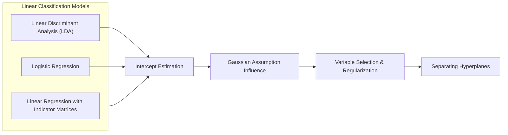
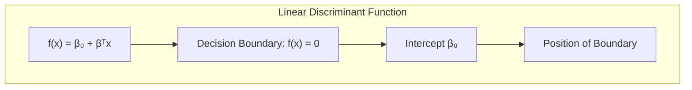
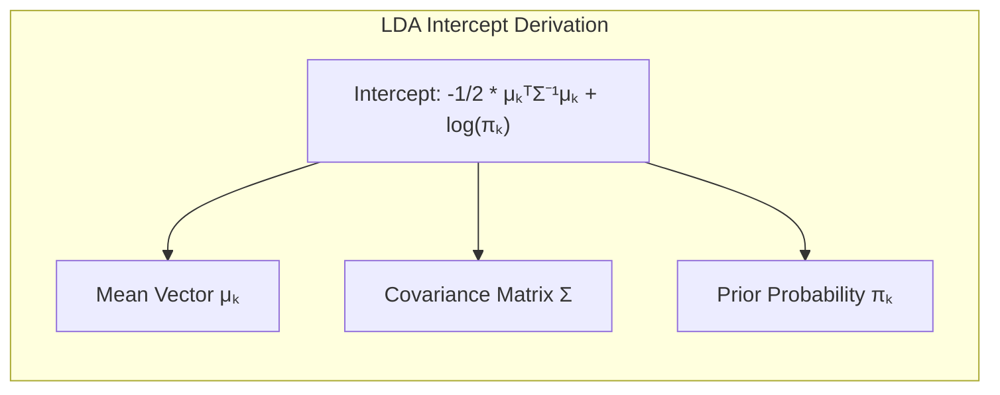
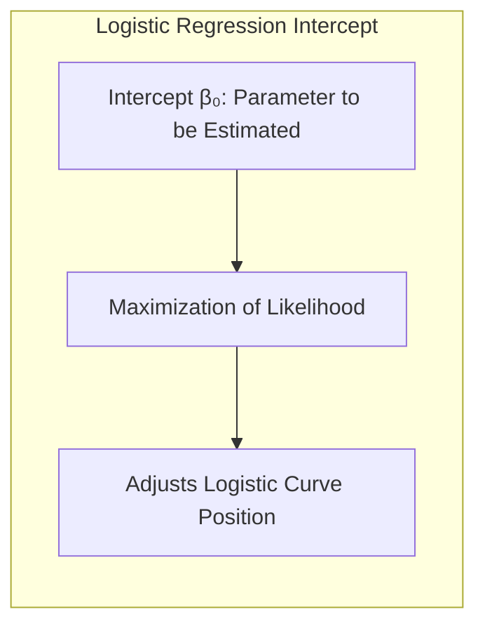
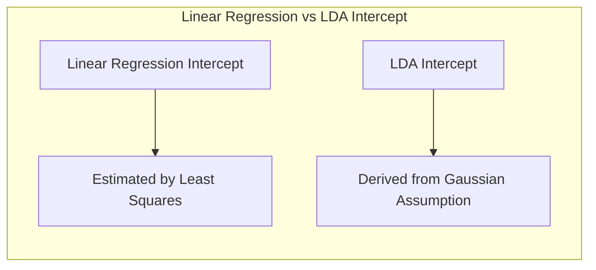
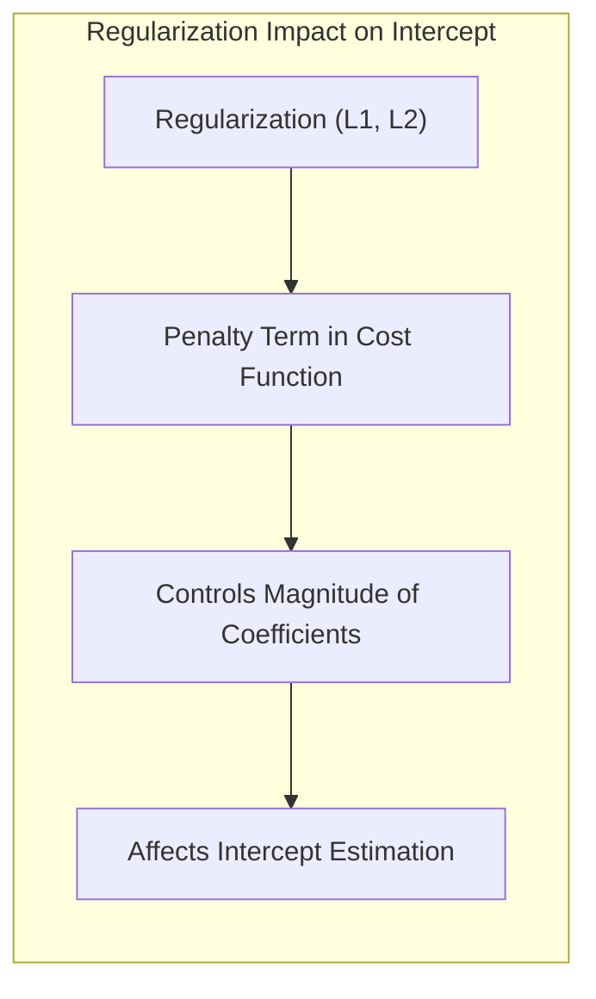
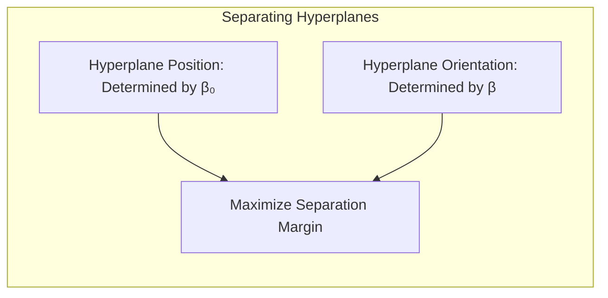
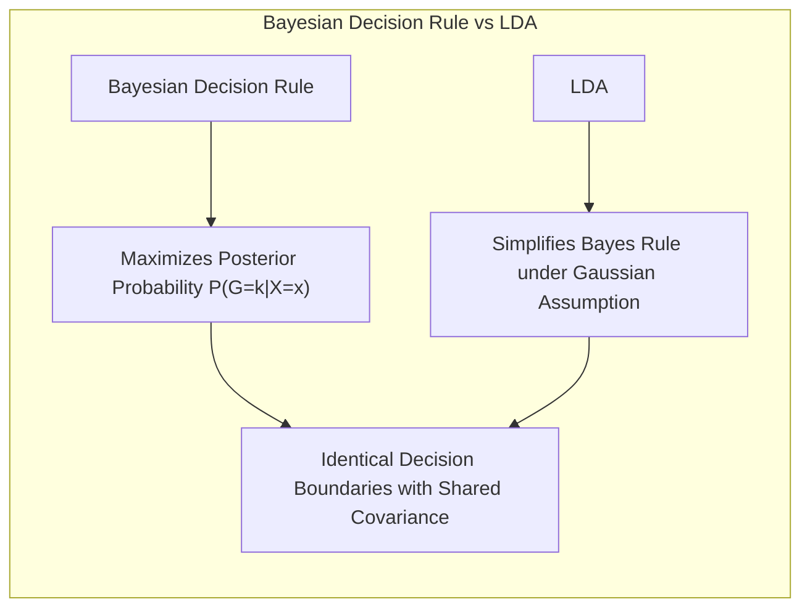

## Título Conciso: Classificação Linear, Interceptos e a Influência da Suposição Gaussiana

### Introdução

Este capítulo aprofunda a análise da **classificação linear**, focando nas diferenças na determinação dos **interceptos** ou "cut-points" nos modelos, e como a suposição **gaussiana** influencia essa estimativa, particularmente no **Linear Discriminant Analysis (LDA)** [^4.3]. Analisaremos como o LDA, a **regressão logística** e a **regressão linear com matrizes de indicadores** abordam a questão do intercepto (ou cut-point) e como cada abordagem se conecta com a tomada de decisão em modelos lineares. Examinaremos as suposições por trás de cada método e suas implicações para a estimativa dos interceptos. Discutiremos também a relevância da **seleção de variáveis e regularização** para a construção de modelos mais robustos e com melhor capacidade de generalização [^4.4.4], [^4.5]. Abordaremos ainda o papel dos **hiperplanos separadores** e como o intercepto afeta a posição desses hiperplanos [^4.5.2]. O objetivo deste capítulo é fornecer uma compreensão detalhada das diferentes abordagens para a estimativa dos interceptos e como essas escolhas afetam a capacidade de classificação dos modelos lineares.

### Conceitos Fundamentais

**Conceito 1: O Papel do Intercepto (Cut-Point) na Classificação Linear**

Em modelos de classificação linear, o **intercepto** ($\beta_0$ na forma geral da função discriminante $f(x) = \beta_0 + \beta^T x$) ou *cut-point*, define a posição da fronteira de decisão linear no espaço de características [^4.1]. O intercepto, ou *cut-point*, representa o ponto de interseção do hiperplano com o eixo vertical (quando a função de decisão é representada graficamente). O intercepto é crucial para definir o "lado" da fronteira de decisão onde uma observação é classificada, e sua estimativa é um passo fundamental na construção de modelos de classificação. Apesar de a direção da fronteira de decisão (definida por $\beta$) ser, em alguns casos, proporcional entre diferentes métodos, o intercepto (ou cut-point) pode variar, dependendo das suposições e dos métodos de estimação.

**Lemma 1:** *Em modelos lineares de classificação, o intercepto define a posição do hiperplano de decisão no espaço de características, afetando a separação entre as classes.*

> 💡 **Exemplo Numérico:**
>
> Imagine um cenário de classificação binária com uma única característica $x$. A função discriminante linear é dada por $f(x) = \beta_0 + \beta_1 x$. Se $\beta_0 = -2$ e $\beta_1 = 1$, a fronteira de decisão é o ponto onde $f(x) = 0$, ou seja, $-2 + x = 0$, o que implica $x = 2$.  O intercepto $\beta_0 = -2$ define que todos os pontos com $x < 2$ serão classificados como uma classe e os pontos com $x > 2$ como a outra.  Se $\beta_0$ fosse alterado para 0, a fronteira de decisão seria $x = 0$, alterando a classificação de todos os pontos no intervalo $0 < x < 2$.
>
> Se tivermos dois pontos, $x_1=1$ e $x_2=3$, com $\beta_1 = 1$, temos:
>
> Para $\beta_0 = -2$, $f(x_1) = -2 + 1 = -1$ (classe 0), $f(x_2) = -2 + 3 = 1$ (classe 1).
> Para $\beta_0 = 0$, $f(x_1) = 0 + 1 = 1$ (classe 1), $f(x_2) = 0 + 3 = 3$ (classe 1).
>
> Este exemplo ilustra como o intercepto desloca a fronteira de decisão e afeta a classificação.

**Conceito 2: LDA e a Estimação do Intercepto**

No **LDA**, o intercepto é determinado pelas probabilidades a priori das classes e pelas médias de cada classe, e também utiliza informações da matriz de covariância compartilhada [^4.3]. Ao analisar a expressão do log-ratio das probabilidades posteriores no LDA, observamos que o intercepto na função discriminante linear para uma classe $k$ é dado por:

$$
-\frac{1}{2}\mu_k^T \Sigma^{-1} \mu_k + \log \pi_k
$$

A presença de $\mu_k$, $\Sigma$ e $\pi_k$ mostra que o intercepto é influenciado pela distribuição dos dados e pelas probabilidades a priori das classes, que são estimadas a partir dos dados de treinamento. A suposição de gaussianidade com covariâncias iguais é utilizada para obter uma expressão que define o intercepto da função discriminante do LDA [^4.3].

**Corolário 1:** *O intercepto da função discriminante do LDA é influenciado tanto pela estrutura dos dados (médias e covariância) quanto pelas probabilidades a priori das classes, e a suposição gaussiana é fundamental para a sua derivação.*

> 💡 **Exemplo Numérico:**
>
> Suponha um problema de classificação com duas classes, onde a classe 1 tem média $\mu_1 = [1, 1]^T$ e a classe 2 tem média $\mu_2 = [3, 3]^T$. A matriz de covariância compartilhada é $\Sigma = \begin{bmatrix} 1 & 0 \\ 0 & 1 \end{bmatrix}$. As probabilidades a priori são $\pi_1 = 0.6$ e $\pi_2 = 0.4$.
>
> Para a classe 1, o intercepto é:
>
> $ \text{Intercepto}_1 = -\frac{1}{2}\mu_1^T \Sigma^{-1} \mu_1 + \log \pi_1 $
>
> $ \text{Intercepto}_1 = -\frac{1}{2} [1, 1] \begin{bmatrix} 1 & 0 \\ 0 & 1 \end{bmatrix}^{-1} [1, 1]^T + \log(0.6) $
>
> $ \text{Intercepto}_1 = -\frac{1}{2} [1, 1] [1, 1]^T + \log(0.6) $
>
> $ \text{Intercepto}_1 = -\frac{1}{2} (1 + 1) + \log(0.6) $
>
> $ \text{Intercepto}_1 = -1 + \log(0.6) \approx -1 - 0.51 = -1.51 $
>
> Para a classe 2, o intercepto é:
>
> $ \text{Intercepto}_2 = -\frac{1}{2}\mu_2^T \Sigma^{-1} \mu_2 + \log \pi_2 $
>
> $ \text{Intercepto}_2 = -\frac{1}{2} [3, 3] \begin{bmatrix} 1 & 0 \\ 0 & 1 \end{bmatrix}^{-1} [3, 3]^T + \log(0.4) $
>
> $ \text{Intercepto}_2 = -\frac{1}{2} [3, 3] [3, 3]^T + \log(0.4) $
>
> $ \text{Intercepto}_2 = -\frac{1}{2} (9 + 9) + \log(0.4) $
>
> $ \text{Intercepto}_2 = -9 + \log(0.4) \approx -9 - 0.92 = -9.92 $
>
> A diferença entre os interceptos é o que define a posição da fronteira de decisão, considerando as médias, covariâncias e probabilidades a priori das classes.

**Conceito 3: Regressão Logística e a Estimação do Intercepto**

Na **regressão logística**, o intercepto $\beta_0$ é determinado através da maximização da verossimilhança do modelo, e é um parâmetro livre que não é diretamente influenciado pela suposição gaussiana [^4.4.1]. O intercepto da regressão logística é um parâmetro a ser estimado diretamente a partir dos dados de treinamento, e ajusta a posição da curva logística, e a fronteira de decisão resultante, para a classificação. A regressão logística não impõe nenhuma forma específica para a distribuição dos dados, como o LDA, o que significa que o intercepto e o vetor de coeficientes podem ser estimados de forma mais flexível [^4.4.2].

> ⚠️ **Nota Importante**: O intercepto na regressão logística é um parâmetro livre que é estimado diretamente a partir dos dados, ao contrário do LDA, onde o intercepto é derivado da suposição gaussiana.

> ❗ **Ponto de Atenção**: Em problemas de classificação com classes desbalanceadas, a estimativa do intercepto na regressão logística pode ser afetada pela distribuição das classes, necessitando da aplicação de técnicas de reponderação ou sobreamostragem para obter uma estimação mais adequada.

> ✔️ **Destaque**: A abordagem para a estimativa do intercepto é um ponto crucial de distinção entre os métodos de classificação linear, como o LDA e a regressão logística.

> 💡 **Exemplo Numérico:**
>
> Considere um modelo de regressão logística com uma única característica $x$. A probabilidade de pertencer à classe 1 é modelada como:
>
> $P(Y=1|x) = \frac{1}{1 + e^{-(\beta_0 + \beta_1 x)}}$
>
> Suponha que, após o treinamento, os parâmetros estimados sejam $\beta_0 = -1$ e $\beta_1 = 2$. O intercepto $\beta_0 = -1$ afeta diretamente a probabilidade base de pertencer à classe 1 quando $x=0$.
>
> Para $x = 0$, $P(Y=1|x=0) = \frac{1}{1 + e^{-(-1 + 2 \cdot 0)}} = \frac{1}{1 + e^{1}} \approx 0.27$.
>
> A fronteira de decisão é encontrada quando $P(Y=1|x) = 0.5$. Isso ocorre quando $\beta_0 + \beta_1 x = 0$, logo, $x = -\frac{\beta_0}{\beta_1} = -\frac{-1}{2} = 0.5$.
>
> Se o intercepto fosse $\beta_0 = 1$, a fronteira de decisão mudaria para $x = -\frac{1}{2} = -0.5$. Note que o intercepto $\beta_0$ ajusta a posição da curva logística e, consequentemente, da fronteira de decisão.

### Regressão Linear e Mínimos Quadrados para Classificação

Na **regressão linear com matrizes de indicadores**, o intercepto $\beta_{k0}$ é determinado através da minimização da soma dos quadrados dos erros, juntamente com os coeficientes $\beta_k$, e são todos os parâmetros ajustados diretamente aos dados [^4.2]. Ao contrário do LDA, a regressão linear não impõe a suposição gaussiana sobre as distribuições das classes, e o intercepto é um parâmetro livre que não depende de forma explícita da probabilidade a priori das classes. No entanto, em algumas situações específicas, como classes equiprováveis e covariâncias esféricas, o intercepto da regressão linear pode ser proporcional ao intercepto do LDA, a menos de uma constante de proporcionalidade.

Na regressão linear com matrizes de indicadores, a busca por um modelo linear que minimiza os erros também define o valor do intercepto da função discriminante, sem se utilizar de nenhuma informação sobre a distribuição dos dados, como faz o LDA. Como consequência, o intercepto na regressão linear é um parâmetro livre, que será estimado para otimizar a separação das classes, sob o critério dos mínimos quadrados.

Essa diferença na estimativa do intercepto pode ter implicações no desempenho da regressão linear como classificador, particularmente em cenários onde a suposição gaussiana e de covariâncias iguais do LDA são válidas.

**Lemma 2:** *O intercepto na regressão linear com matrizes de indicadores é um parâmetro livre ajustado pelo método dos mínimos quadrados, e não depende diretamente das probabilidades a priori das classes ou da suposição gaussiana, como no LDA.*

**Corolário 2:** *A estimativa do intercepto na regressão linear com matrizes de indicadores, ao contrário do LDA, não depende da suposição gaussiana e das probabilidades a priori das classes, o que torna o método mais flexível, mas também mais vulnerável a problemas como o "masking", que surgem devido à natureza da minimização da soma de quadrados.*

A regressão linear com matrizes de indicadores, ao determinar o intercepto de forma independente da suposição gaussiana, difere dos modelos que utilizam essa premissa, como o LDA, e também da regressão logística, que utiliza o conceito de verossimilhança para estimar todos os seus parâmetros [^4.3], [^4.4].

> 💡 **Exemplo Numérico:**
>
> Considere um problema de classificação binária com duas classes (0 e 1) e uma única característica $x$. A regressão linear com matrizes de indicadores modela a classe $y$ como $y = \beta_0 + \beta_1 x + \epsilon$. Suponha que após ajustar o modelo aos dados, os parâmetros estimados sejam $\beta_0 = 0.2$ e $\beta_1 = 0.8$.
>
> A fronteira de decisão é encontrada quando a predição linear é igual a 0.5 (o ponto médio entre as classes 0 e 1). Assim, $0.5 = 0.2 + 0.8x$, o que resulta em $x = \frac{0.5 - 0.2}{0.8} = \frac{0.3}{0.8} = 0.375$.
>
> Se o intercepto fosse alterado para $\beta_0 = -0.1$, a fronteira de decisão mudaria para $0.5 = -0.1 + 0.8x$, resultando em $x = \frac{0.5 + 0.1}{0.8} = \frac{0.6}{0.8} = 0.75$.
>
> Este exemplo mostra como o intercepto $\beta_0$ afeta diretamente a posição da fronteira de decisão na regressão linear.

### Métodos de Seleção de Variáveis e Regularização em Classificação

A **seleção de variáveis** e a **regularização** desempenham um papel fundamental na melhoria da robustez dos modelos de classificação, impactando não apenas os coeficientes, mas também a estimativa do intercepto. A regularização adiciona um termo de penalidade à função de custo, o que restringe a magnitude dos coeficientes e evita o *overfitting*, e também influencia a estimativa do intercepto, embora em algumas formulações o intercepto não seja penalizado diretamente [^4.5].

Na **regressão logística**, a função de custo regularizada pode ser expressa como:

$$
\max_{\beta_0, \beta} \left[ \sum_{i=1}^N \left( y_i (\beta_0 + \beta^T x_i) - \log(1 + e^{\beta_0 + \beta^T x_i}) \right) - \lambda P(\beta) \right]
$$

onde $P(\beta)$ é a penalidade e $\lambda$ é o parâmetro de regularização. A penalidade **L1** (Lasso), dada por $P(\beta) = \sum_{j=1}^p |\beta_j|$, promove a esparsidade dos coeficientes, selecionando as variáveis mais relevantes para a estimação do intercepto e da probabilidade posterior. A penalidade **L2** (Ridge), dada por $P(\beta) = \sum_{j=1}^p \beta_j^2$, reduz a magnitude dos coeficientes, estabilizando o modelo e, indiretamente, a estimativa do intercepto [^4.4.4], [^4.5].

A aplicação da regularização ajuda a controlar a complexidade do modelo e a obter estimativas mais precisas dos parâmetros, incluindo o intercepto, resultando em modelos mais robustos e generalizáveis.

**Lemma 3:** *A regularização L1, ao promover a esparsidade, leva a estimativas do intercepto mais robustas, selecionando as variáveis mais relevantes para o ajuste do modelo.*

**Prova do Lemma 3:** A penalidade L1 adiciona um termo à função de custo que é proporcional ao valor absoluto dos coeficientes, e a minimização deste termo força alguns dos coeficientes a se tornarem exatamente zero durante o processo de otimização. Esta seleção de variáveis reduz o impacto do ruído na estimativa do intercepto, e o torna mais robusto [^4.4.3], [^4.4.4]. $\blacksquare$

**Corolário 3:** *A regularização, tanto L1 quanto L2, contribui para melhorar a estimativa do intercepto e aumentar a estabilidade do modelo, melhorando a capacidade de generalização da fronteira de decisão, mesmo que os métodos de estimação de parâmetros e interceptos sejam diferentes.*

> ⚠️ **Ponto Crucial**: A regularização, ao controlar a complexidade dos modelos, impacta na estimativa do intercepto e melhora a qualidade das decisões, mesmo quando a derivação dos interceptos são diferentes, e são derivadas da suposição gaussiana ou da maximização da verossimilhança, ou da minimização da soma de quadrados [^4.5].

> 💡 **Exemplo Numérico:**
>
> Vamos aplicar regularização L1 (Lasso) em um modelo de regressão logística com duas características, $x_1$ e $x_2$. A função de custo a ser maximizada é:
>
> $ L(\beta_0, \beta_1, \beta_2) = \sum_{i=1}^N \left( y_i (\beta_0 + \beta_1 x_{i1} + \beta_2 x_{i2}) - \log(1 + e^{\beta_0 + \beta_1 x_{i1} + \beta_2 x_{i2}}) \right) - \lambda (|\beta_1| + |\beta_2|) $
>
> Suponha que, sem regularização ($\lambda = 0$), os parâmetros estimados sejam $\beta_0 = -0.5$, $\beta_1 = 1.2$ e $\beta_2 = -0.8$.
>
> Ao aplicar regularização L1 com $\lambda = 0.5$, o modelo pode convergir para novos valores, por exemplo, $\beta_0 = -0.4$, $\beta_1 = 0.9$ e $\beta_2 = 0$. A penalidade L1 forçou $\beta_2$ a ser zero, efetivamente removendo a variável $x_2$ do modelo. Isso altera o intercepto para -0.4 e simplifica a fronteira de decisão, tornando-a dependente apenas de $x_1$.
>
> Se usarmos regularização L2, a função de custo seria:
>
> $ L(\beta_0, \beta_1, \beta_2) = \sum_{i=1}^N \left( y_i (\beta_0 + \beta_1 x_{i1} + \beta_2 x_{i2}) - \log(1 + e^{\beta_0 + \beta_1 x_{i1} + \beta_2 x_{i2}}) \right) - \lambda (\beta_1^2 + \beta_2^2) $
>
> Com $\lambda = 0.5$, o modelo poderia convergir para $\beta_0 = -0.45$, $\beta_1 = 0.95$ e $\beta_2 = -0.6$. A regularização L2 reduz a magnitude de ambos os coeficientes, mas não os força a zero. O intercepto também é afetado.
>
> A regularização L1 promove esparsidade, enquanto a L2 promove a redução da magnitude dos coeficientes, ambas afetando o intercepto e a fronteira de decisão.

### Separating Hyperplanes e Perceptrons

A ideia de **hiperplanos separadores** busca encontrar uma fronteira linear que maximize a separação entre as classes, onde o intercepto ($\beta_0$) define a posição do hiperplano no espaço de características e o vetor de coeficientes ($\beta$) define a orientação da fronteira [^4.5.2]. O objetivo é encontrar o hiperplano ótimo que maximize a margem de separação, ou seja, a distância entre o hiperplano e as amostras mais próximas de cada classe.

O algoritmo do **Perceptron** é um método iterativo que busca ajustar o hiperplano separador através do ajuste iterativo do intercepto e dos coeficientes, com base nas classificações incorretas [^4.5.1]. Embora o Perceptron não maximize a margem diretamente, ele ilustra como modelos lineares podem ser utilizados para encontrar uma solução que separa as classes, e, se o problema for linearmente separável, o algoritmo converge para um hiperplano separador, definindo, assim, o intercepto e a fronteira de decisão.

**Teorema:** *O algoritmo do Perceptron converge para um hiperplano separador em um número finito de iterações, se o conjunto de dados for linearmente separável.*

> 💡 **Exemplo Numérico:**
>
> Considere um conjunto de dados linearmente separável com duas classes e duas características. Inicializamos os parâmetros do Perceptron com $\beta_0 = 0$, $\beta_1 = 0$, e $\beta_2 = 0$.
>
> Suponha que a primeira amostra seja $x_i = [1, 2]^T$ e pertença à classe 1 ($y_i = 1$). A predição é $f(x_i) = 0 + 0 \cdot 1 + 0 \cdot 2 = 0$. Como $f(x_i) < 0$, o ponto é classificado incorretamente.
>
> Atualizamos os parâmetros:
>
> $\beta_0 = \beta_0 + \eta y_i = 0 + 1 = 1$
>
> $\beta_1 = \beta_1 + \eta y_i x_{i1} = 0 + 1 \cdot 1 = 1$
>
> $\beta_2 = \beta_2 + \eta y_i x_{i2} = 0 + 1 \cdot 2 = 2$
>
> (onde $\eta$ é a taxa de aprendizado, que assumimos como 1 para simplificar).
>
> O novo hiperplano é definido por $1 + x_1 + 2x_2 = 0$. Se a próxima amostra for $x_j = [3, 1]^T$ e pertença à classe 0 ($y_j = 0$), a predição é $f(x_j) = 1 + 1 \cdot 3 + 2 \cdot 1 = 6$. Como $f(x_j) > 0$, a predição está incorreta, e a atualização agora será:
>
> $\beta_0 = \beta_0 - \eta \cdot 1 = 1 - 1 = 0$
>
> $\beta_1 = \beta_1 - \eta x_{j1} = 1 - 3 = -2$
>
> $\beta_2 = \beta_2 - \eta x_{j2} = 2 - 1 = 1$
>
> O novo hiperplano é definido por $0 - 2x_1 + x_2 = 0$.
>
> Este processo iterativo ajusta o intercepto e os coeficientes do hiperplano, e, se o problema for linearmente separável, o algoritmo converge para um hiperplano separador. O intercepto $\beta_0$ desloca o hiperplano no espaço de características.

### Pergunta Teórica Avançada: Quais as diferenças fundamentais entre a formulação de LDA e a Regra de Decisão Bayesiana considerando distribuições Gaussianas com covariâncias iguais?

**Resposta:**

A **Regra de Decisão Bayesiana** busca classificar uma observação $x$ na classe $k$ que maximize a probabilidade posterior $P(G=k|X=x)$ [^4.3]. Sob a suposição de distribuições Gaussianas com a mesma matriz de covariância $\Sigma$, a probabilidade posterior é dada por:

$$
P(G=k|X=x) = \frac{ \phi(x;\mu_k,\Sigma)\pi_k}{\sum_{l=1}^K \phi(x;\mu_l,\Sigma)\pi_l}
$$

onde $\phi(x;\mu_k,\Sigma)$ é a densidade gaussiana para a classe $k$, $\mu_k$ é a média da classe $k$ e $\pi_k$ é a probabilidade a priori da classe $k$. O **LDA** deriva suas funções discriminantes lineares diretamente dessas suposições, buscando otimizar a separação entre as classes no espaço de características [^4.3].

**Lemma 4:** *Sob a suposição de distribuições Gaussianas com a mesma matriz de covariância, a regra de decisão Bayesiana e as funções discriminantes do LDA levam à mesma fronteira de decisão, incluindo interceptos que levam a posições similares da fronteira.*

**Corolário 4:** *A remoção da restrição de igualdade de covariâncias na regra de decisão Bayesiana leva ao Quadratic Discriminant Analysis (QDA), onde as fronteiras de decisão são quadráticas e os parâmetros, incluindo os interceptos, são estimados de forma diferente, levando à decisões não lineares.*

> ⚠️ **Ponto Crucial**: A principal diferença entre o LDA e a regra de decisão Bayesiana está na derivação do modelo. A regra Bayesiana busca maximizar a probabilidade posterior, e o LDA simplifica esta maximização através das suposições gaussianas e da igualdade de covariâncias, onde, sob essas restrições, as fronteiras de decisão, incluindo os interceptos, são idênticas [^4.3].

> 💡 **Exemplo Numérico:**
>
> Considere um cenário com duas classes e uma única característica $x$. Suponha que a classe 1 tenha média $\mu_1 = 2$ e a classe 2 tenha média $\mu_2 = 4$. A matriz de covariância compartilhada é $\Sigma = 1$. As probabilidades a priori são $\pi_1 = 0.4$ e $\pi_2 = 0.6$.
>
> A regra de decisão Bayesiana classifica um ponto $x$ na classe que maximiza a probabilidade posterior:
>
> $P(G=k|X=x) \propto \phi(x; \mu_k, \Sigma)\pi_k = \frac{1}{\sqrt{2\pi\Sigma}}e^{-\frac{(x-\mu_k)^2}{2\Sigma}} \pi_k$
>
> Tomando o log da probabilidade posterior e ignorando os termos constantes, temos:
>
> $\log P(G=k|X=x) \propto -\frac{(x-\mu_k)^2}{2} + \log(\pi_k)$
>
> Para a classe 1, o termo é: $-\frac{(x-2)^2}{2} + \log(0.4)$
>
> Para a classe 2, o termo é: $-\frac{(x-4)^2}{2} + \log(0.6)$
>
> A fronteira de decisão ocorre quando esses dois termos são iguais:
>
> $-\frac{(x-2)^2}{2} + \log(0.4) = -\frac{(x-4)^2}{2} + \log(0.6)$
>
> Resolvendo para $x$, temos:
>
> $(x-4)^2 - (x-2)^2 = 2(\log(0.6) - \log(0.4))$
>
> $x^2 - 8x + 16 - (x^2 - 4x + 4) = 2 \log(1.5)$
>
> $-4x + 12 = 2 \log(1.5)$
>
> $x = 3 - \frac{\log(1.5)}{2} \approx 3 - 0.20 = 2.8$
>
> O intercepto em LDA é implicitamente encontrado ao igualar as funções discriminantes.  Sob as suposições de gaussianidade e covariâncias iguais, LDA e a regra Bayesiana levam à mesma fronteira de decisão, incluindo o intercepto, que posiciona o hiperplano separador.

### Conclusão

Neste capítulo, exploramos as diferenças na estimação dos interceptos (ou cut-points) em modelos de classificação linear, destacando a influência da suposição gaussiana no LDA e o papel da minimização da soma de quadrados na regressão linear com matrizes de indicadores. Discutimos como a regressão logística estima os interceptos diretamente da maximização da verossimilhança, e como a escolha do método impacta a forma da fronteira de decisão e a qualidade das estimativas. Analisamos também como a seleção de variáveis e a regularização podem ser usadas para controlar a complexidade dos modelos e melhorar a robustez da estimativa do intercepto. A comparação entre o LDA e a regra de decisão Bayesiana destacou como a suposição gaussiana impacta a estimativa dos parâmetros, incluindo os interceptos, e a forma das fronteiras de decisão. Este capítulo ofereceu uma visão aprofundada de como diferentes abordagens lidam com a estimativa do intercepto e como essa escolha se relaciona com a tomada de decisão em modelos de classificação linear.

### Footnotes

[^4.1]: *In this chapter we revisit the classification problem and focus on linear methods for classification...There are several different ways in which linear decision boundaries can be found.*

[^4.2]: *In Chapter 2 we fit linear regression models to the class indicator variables, and classify to the largest fit...Linear inequalities in this space are quadratic inequalities in the original space.*

[^4.3]: *Decision theory for classification (Section 2.4) tells us that we need to know the class posteriors Pr(G|X) for optimal classification. Suppose fk(x) is the class-conditional density of X in class G = k, and let πκ be the prior probability of class k... Linear discriminant analysis (LDA) arises in the special case when we assume that the classes have a common covariance matrix Σk = Σ.*

[^4.3.1]: *The decision boundary between each pair of classes k and l is described by a quadratic equation {x: δκ(x) = δ(x)}.*

[^4.3.3]: *In the special case when we assume that the classes have a common covariance matrix...When the classes are really Gaussian, then LDA is optimal*

[^4.4]: *The logistic regression model arises from the desire to model the posterior probabilities of the K classes via linear functions in x, while at the same time ensuring that they sum to one and remain in [0,1].*

[^4.4.1]: *Logistic regression models are usually fit by maximum likelihood... The logistic regression model is more general, in that it makes less assumptions.*

[^4.4.2]: *It is convenient to code the two-class gi via a 0/1 response Yi, where yi = 1 when gi = 1, and yi = 0 when gi = 2... Typically many models are fit in a search for a parsimonious model involving a subset of the variables.*

[^4.4.3]: *To maximize the log-likelihood, we set its derivatives to zero. These score equations are...To solve the score equations (4.21), we use the Newton-Raphson algorithm...*

[^4.4.4]: *The L1 penalty used in the lasso (Section 3.4.2) can be used for variable selection and shrinkage with any linear regression model...As with the lasso, we typically do not penalize the intercept term.*

[^4.5]: *Here we present an analysis of binary data to illustrate the traditional statistical use of the logistic regression model... With two classes there is a simple correspondence between linear discriminant analysis and classification by linear least squares, as in (4.5).*

[^4.5.1]: *The perceptron learning algorithm tries to find a separating hyperplane by minimizing the distance of misclassified points to the decision boundary.*

[^4.5.2]: *The optimal separating hyperplane separates the two classes and maximizes the distance to the closest point from either class... In light of (4.40), the constraints define an empty slab or margin around the linear decision boundary...*
