## Título Conciso: Classificação Multiclasse e o Problema do "Masking": Abordagens e Soluções com LDA

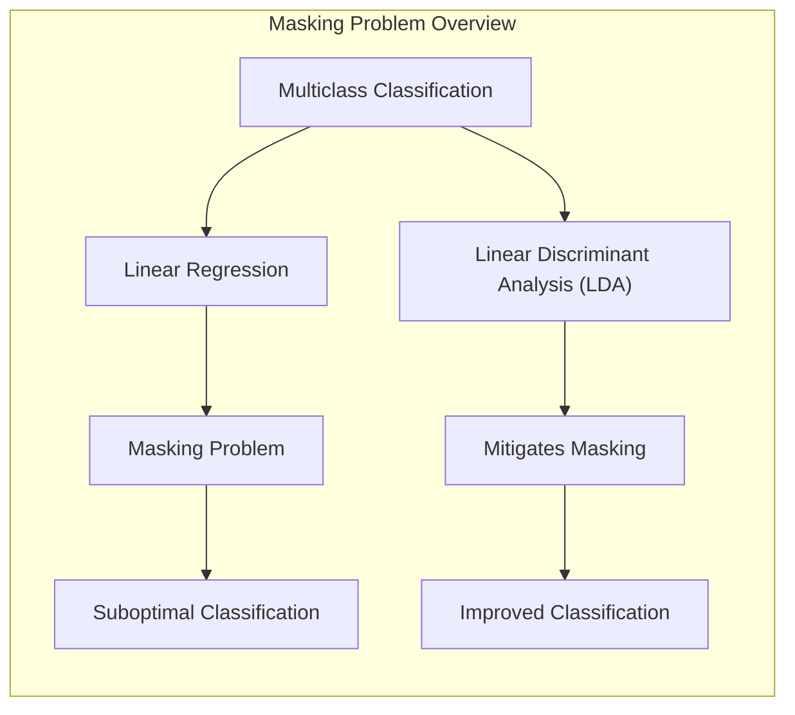

### Introdução

Este capítulo explora em profundidade o **"masking problem"**, uma limitação fundamental da **regressão linear** em problemas de **classificação multiclasse**. O "masking problem" surge quando uma ou mais classes intermediárias são "mascaradas" ou ignoradas durante o processo de classificação, levando a resultados subótimos e decisões incorretas [^4.2]. Analisaremos como essa limitação se manifesta e como métodos como o **Linear Discriminant Analysis (LDA)** podem ser utilizados para superar esse problema [^4.3]. Compararemos a abordagem da regressão linear com matrizes de indicadores com o LDA, destacando as vantagens do LDA em modelar as densidades condicionais de forma mais adequada. Abordaremos também a **regressão logística** e sua capacidade de lidar com problemas de classificação multiclasse e discutiremos a importância da **seleção de variáveis e regularização** para a construção de modelos mais robustos e com melhor capacidade de generalização [^4.4.4], [^4.5]. O conceito de **hiperplanos separadores** também será abordado na busca por soluções para o problema do "masking" [^4.5.2]. O objetivo deste capítulo é fornecer uma compreensão detalhada do problema do "masking" e de como o LDA e outras abordagens podem ser utilizadas para mitigar suas consequências em problemas de classificação multiclasse.

### Conceitos Fundamentais

**Conceito 1: O "Masking Problem" na Classificação Multiclasse**

O **"masking problem"** é uma limitação que surge na regressão linear com matrizes de indicadores em problemas de classificação multiclasse, onde o objetivo é atribuir uma observação $x$ a uma das $K$ classes [^4.2]. Quando o número de classes é grande, ou quando as classes intermediárias estão "entre" as classes extremas, a regressão linear pode não conseguir modelar a relação entre as classes de forma adequada. Nesses casos, a regressão linear pode atribuir às classes intermediárias um valor preditivo que é sistematicamente menor do que os valores preditivos para as classes extremas, fazendo com que as classes intermediárias sejam ignoradas na decisão de classificação, como se estivessem "mascaradas" pelas classes dominantes.

> 💡 **Exemplo Numérico:**
> Imagine um problema de classificação com três classes: "Baixo", "Médio" e "Alto", representadas por 0, 1 e 2 respectivamente. Suponha que temos os seguintes dados de treinamento, onde a única variável preditora $x$ está associada a cada classe:
>
> - Classe "Baixo" (0): $x = [1, 2, 3]$
> - Classe "Médio" (1): $x = [4, 5, 6]$
> - Classe "Alto" (2): $x = [7, 8, 9]$
>
> Usando regressão linear com matrizes de indicadores, o modelo busca ajustar uma linha para cada classe, sem considerar a relação entre elas. Isso pode fazer com que a classe "Médio" tenha valores preditivos menores, sendo "mascarada" pelas classes "Baixo" e "Alto".
>
> ```python
> import numpy as np
> from sklearn.linear_model import LinearRegression
>
> # Dados de exemplo
> X = np.array([1, 2, 3, 4, 5, 6, 7, 8, 9]).reshape(-1, 1)
> y = np.array([0, 0, 0, 1, 1, 1, 2, 2, 2])
>
> # Matriz de indicadores
> y_indicator = np.eye(3)[y]
>
> # Regressão Linear para cada classe
> models = []
> for k in range(3):
>     model = LinearRegression()
>     model.fit(X, y_indicator[:, k])
>     models.append(model)
>
> # Predições para um novo ponto x = 5
> new_x = np.array([5]).reshape(-1, 1)
> predictions = [model.predict(new_x)[0] for model in models]
>
> print(f"Predições para x=5: {predictions}")
>
> # Visualização das previsões (Mermaid)
> print("""
> ```mermaid
> graph LR
>     A[x=5] --> B(Classe Baixo - Predição: {:.2f})
>     A --> C(Classe Médio - Predição: {:.2f})
>     A --> D(Classe Alto - Predição: {:.2f})
> ```
> """.format(predictions[0], predictions[1], predictions[2]))
> ```
>
> O exemplo numérico ilustra como a regressão linear pode dar um valor preditivo menor para a classe intermediária. O gráfico Mermaid demonstra que, para um novo ponto x=5, a predição da classe "Médio" pode ser menor, indicando o problema do "masking".

**Lemma 1:** *Em problemas de classificação multiclasse, a regressão linear com matrizes de indicadores pode sofrer do "masking problem", onde classes intermediárias podem ser ignoradas pelo modelo, levando a erros de classificação sistemáticos.* A prova desse lema reside na forma do ajuste da regressão linear, que busca apenas a maximização da saída do modelo, sem modelar adequadamente a relação entre as classes.

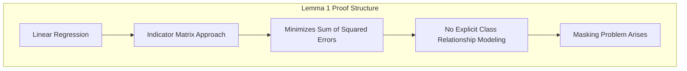

**Conceito 2: Causas e Manifestações do "Masking Problem"**

O "masking problem" ocorre quando as funções lineares ajustadas para as classes intermediárias assumem valores que são sempre menores do que as funções lineares ajustadas para as classes extremas [^4.2]. Isso resulta em um viés sistemático na decisão de classificação, onde as observações das classes intermediárias são frequentemente classificadas como pertencentes às classes extremas. Essa situação pode ocorrer mesmo quando as classes são linearmente separáveis, o que mostra que o problema não está apenas na falta de separabilidade dos dados, mas também na limitação da abordagem linear da regressão.

**Corolário 1:** *O "masking problem" é uma consequência da busca por minimizar a soma de quadrados na regressão linear sem considerar a relação entre as diferentes classes e, em particular, a relação entre probabilidades posteriores.* Este corolário enfatiza a natureza da causa do masking em relação ao método da regressão linear.

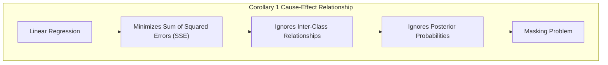

**Conceito 3: LDA e a Modelagem de Densidades para Evitar o "Masking"**

O **LDA**, ao modelar as densidades condicionais das classes como Gaussianas com a mesma matriz de covariância, utiliza informações sobre a distribuição dos dados para construir a fronteira de decisão [^4.3]. As funções discriminantes lineares do LDA são derivadas da teoria de decisão, buscando maximizar a separação entre as classes no espaço de características. Essa abordagem, ao considerar a distribuição das classes, evita o problema do "masking" de forma mais eficaz do que a regressão linear com matrizes de indicadores [^4.3].

> ⚠️ **Nota Importante**: O "masking problem" é uma limitação específica da regressão linear com matrizes de indicadores e não ocorre, por exemplo, no LDA, que modela as densidades condicionais explicitamente.

> ❗ **Ponto de Atenção**: O "masking problem" é particularmente problemático em problemas com muitas classes, onde a regressão linear pode ter um desempenho significativamente inferior em relação ao LDA.

> ✔️ **Destaque**: O LDA, ao modelar as densidades condicionais e ao utilizar as probabilidades a priori das classes, evita o "masking" e fornece fronteiras de decisão mais adequadas em cenários multiclasse do que a regressão linear.

### Regressão Linear e Mínimos Quadrados para Classificação

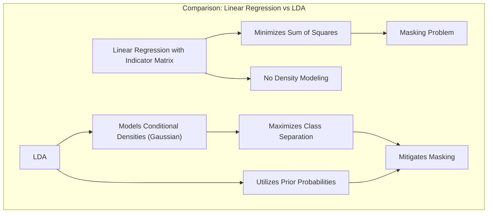

Na **regressão linear com matrizes de indicadores**, o objetivo é ajustar modelos lineares para cada classe, buscando minimizar a soma dos quadrados dos erros sem considerar a relação entre as classes [^4.2]. Essa abordagem pode resultar em problemas como o "masking", onde classes intermediárias são ignoradas na tomada de decisão. Isso ocorre porque a regressão linear não leva em conta a distribuição das classes e não modela as probabilidades posteriores, limitando a capacidade do modelo de representar as relações entre as classes de forma adequada [^4.2].

Quando o número de classes é grande, ou quando as classes intermediárias estão entre as classes extremas, a regressão linear pode não ser capaz de capturar a estrutura dos dados e, consequentemente, pode atribuir a amostras das classes intermediárias valores preditivos menores em comparação com as classes extremas.

Em contraste com a regressão linear, o LDA busca modelar as densidades condicionais das classes, usando distribuições Gaussianas com a mesma matriz de covariância, e utiliza essa modelagem para construir uma função discriminante linear que leva em consideração a variabilidade dos dados e a probabilidade a priori das classes [^4.3]. Essa abordagem permite que o LDA supere o "masking problem" e produza fronteiras de decisão mais adequadas para problemas multiclasse.

**Lemma 2:** *A regressão linear com matrizes de indicadores, por não modelar as densidades condicionais das classes, está sujeita ao "masking problem", que leva à classificação incorreta de amostras de classes intermediárias.* A prova desse lema é demonstrada pela forma como a regressão linear ajusta as funções lineares e como essa forma não modela a distribuição das classes corretamente.

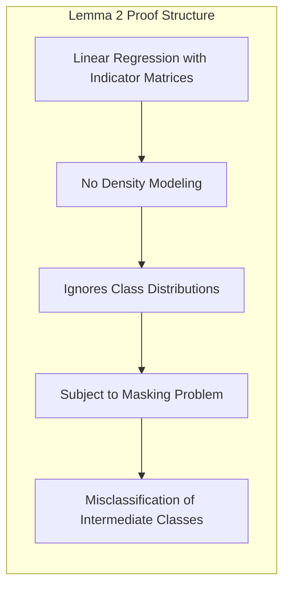

**Corolário 2:** *O LDA, ao modelar as densidades condicionais das classes como Gaussianas com covariância comum, leva a fronteiras de decisão mais robustas em relação ao problema do "masking", e utiliza as probabilidades a priori das classes, o que não é feito na regressão linear.* Este corolário estabelece uma conexão entre a forma da distribuição utilizada no LDA e como ela mitiga o masking.

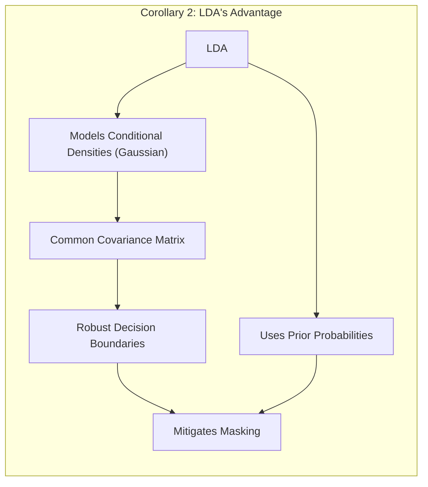

> 💡 **Exemplo Numérico:**
> Vamos considerar um exemplo simplificado com duas classes e uma variável preditora.
>
> **Dados:**
> - Classe 0 (triângulos): $x_0 = [1, 2, 3]$
> - Classe 1 (círculos): $x_1 = [5, 6, 7]$
>
> **Regressão Linear com Matrizes Indicadoras:**
>
> Para a regressão linear, criamos uma matriz indicadora $Y$ onde $Y_{i,k} = 1$ se a observação $i$ pertence à classe $k$, e $0$ caso contrário. Resolvemos o problema de mínimos quadrados para cada classe separadamente. A regressão linear tentará ajustar uma linha para cada classe sem considerar a distribuição dos dados.
>
> **LDA:**
>
> O LDA, por outro lado, calcula as médias de cada classe ($\mu_0$ e $\mu_1$) e a covariância comum ($Σ$). Em seguida, utiliza essas informações para encontrar a fronteira de decisão. As funções discriminantes são dadas por $\delta_k(x) = x^T \Sigma^{-1} \mu_k - \frac{1}{2}\mu_k^T \Sigma^{-1} \mu_k + \log \pi_k$, onde $\pi_k$ é a probabilidade a priori da classe $k$. O LDA busca maximizar a separação entre as classes, utilizando a distribuição dos dados.
>
> ```python
> import numpy as np
> from sklearn.linear_model import LinearRegression
> from sklearn.discriminant_analysis import LinearDiscriminantAnalysis
>
> # Dados de exemplo
> X = np.array([1, 2, 3, 5, 6, 7]).reshape(-1, 1)
> y = np.array([0, 0, 0, 1, 1, 1])
>
> # Regressão Linear com Matrizes Indicadoras
> y_indicator = np.eye(2)[y]
> model_lr_0 = LinearRegression().fit(X, y_indicator[:, 0])
> model_lr_1 = LinearRegression().fit(X, y_indicator[:, 1])
>
> # LDA
> model_lda = LinearDiscriminantAnalysis().fit(X, y)
>
> # Ponto de teste
> new_x = np.array([4]).reshape(-1, 1)
>
> # Predições
> pred_lr_0 = model_lr_0.predict(new_x)[0]
> pred_lr_1 = model_lr_1.predict(new_x)[0]
> pred_lda = model_lda.predict(new_x)[0]
>
> print(f"Regressão Linear - Classe 0: {pred_lr_0:.2f}, Classe 1: {pred_lr_1:.2f}")
> print(f"LDA - Classe: {pred_lda}")
>
> # Visualização das previsões (Mermaid)
> print("""
> ```mermaid
> graph LR
>     A[x=4] --> B(Regressão Linear - Classe 0: {:.2f})
>     A --> C(Regressão Linear - Classe 1: {:.2f})
>     A --> D(LDA - Classe: {})
> ```
> """.format(pred_lr_0, pred_lr_1, pred_lda))
> ```
>
> Este exemplo mostra que, para um novo ponto $x=4$, a regressão linear pode gerar predições que não refletem a probabilidade real de pertinência a cada classe, enquanto o LDA, ao considerar a distribuição dos dados, pode classificar corretamente.

A regressão linear com matrizes de indicadores, embora seja uma abordagem simples e direta, é vulnerável ao "masking problem" e, portanto, pode não ser adequada para problemas de classificação multiclasse onde esse problema se manifesta, enquanto o LDA modela as densidades condicionais e evita o problema do masking [^4.2], [^4.3].

### Métodos de Seleção de Variáveis e Regularização em Classificação

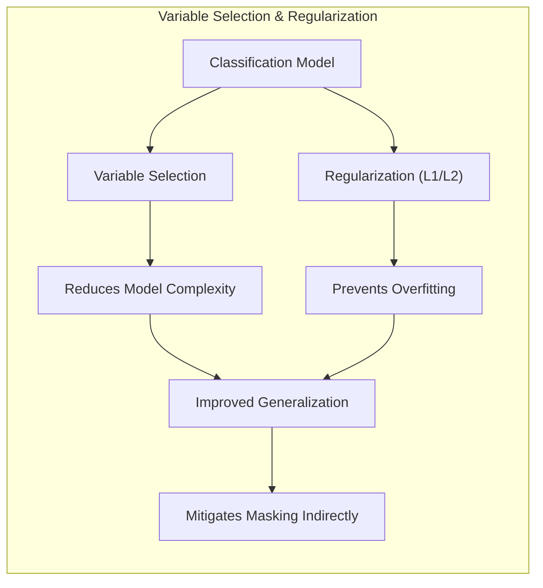

A **seleção de variáveis** e a **regularização** são técnicas importantes para melhorar a capacidade de generalização e a robustez de modelos de classificação, incluindo aqueles que buscam mitigar o "masking problem". A regularização, em particular, adiciona um termo de penalidade à função de custo, o que restringe a magnitude dos coeficientes e evita o *overfitting*, melhorando a capacidade do modelo de generalizar para novos dados e de modelar as relações entre as classes [^4.5].

Na **regressão logística**, a função de custo regularizada pode ser expressa como:

$$
\max_{\beta_0, \beta} \left[ \sum_{i=1}^N \left( y_i (\beta_0 + \beta^T x_i) - \log(1 + e^{\beta_0 + \beta^T x_i}) \right) - \lambda P(\beta) \right]
$$

onde $P(\beta)$ é a penalidade e $\lambda$ é o parâmetro de regularização. A penalidade **L1** (Lasso) é dada por $P(\beta) = \sum_{j=1}^p |\beta_j|$, que promove a esparsidade dos coeficientes, selecionando as variáveis mais relevantes para a modelagem da probabilidade posterior [^4.4.4]. A penalidade **L2** (Ridge) é dada por $P(\beta) = \sum_{j=1}^p \beta_j^2$, que reduz a magnitude dos coeficientes e estabiliza o modelo [^4.5].

> 💡 **Exemplo Numérico:**
>
> Considere um problema de classificação binária com uma variável preditora $x$ e um conjunto de dados com ruído. Vamos aplicar a regressão logística com regularização L1 e L2.
>
> ```python
> import numpy as np
> from sklearn.linear_model import LogisticRegression
> from sklearn.model_selection import train_test_split
> from sklearn.preprocessing import StandardScaler
> import matplotlib.pyplot as plt
>
> # Dados de exemplo com ruído
> np.random.seed(42)
> X = np.random.rand(100, 1) * 10
> y = (X[:, 0] > 5).astype(int)
> y = y + np.random.randint(-1, 2, size=100)
> y = np.clip(y, 0, 1)
>
> # Divisão em treino e teste
> X_train, X_test, y_train, y_test = train_test_split(X, y, test_size=0.3, random_state=42)
>
> # Normalização
> scaler = StandardScaler()
> X_train = scaler.fit_transform(X_train)
> X_test = scaler.transform(X_test)
>
> # Regressão Logística sem regularização
> model_lr = LogisticRegression(penalty=None, solver='liblinear').fit(X_train, y_train)
>
> # Regressão Logística com regularização L1 (Lasso)
> model_lr_l1 = LogisticRegression(penalty='l1', solver='liblinear', C=0.1).fit(X_train, y_train)
>
> # Regressão Logística com regularização L2 (Ridge)
> model_lr_l2 = LogisticRegression(penalty='l2', solver='liblinear', C=0.1).fit(X_train, y_train)
>
>
> # Avaliação
> train_score_lr = model_lr.score(X_train, y_train)
> test_score_lr = model_lr.score(X_test, y_test)
> train_score_l1 = model_lr_l1.score(X_train, y_train)
> test_score_l1 = model_lr_l1.score(X_test, y_test)
> train_score_l2 = model_lr_l2.score(X_train, y_train)
> test_score_l2 = model_lr_l2.score(X_test, y_test)
>
> print(f"Acurácia (treino) - Regressão Logística: {train_score_lr:.2f}")
> print(f"Acurácia (teste) - Regressão Logística: {test_score_lr:.2f}")
> print(f"Acurácia (treino) - Regressão Logística L1: {train_score_l1:.2f}")
> print(f"Acurácia (teste) - Regressão Logística L1: {test_score_l1:.2f}")
> print(f"Acurácia (treino) - Regressão Logística L2: {train_score_l2:.2f}")
> print(f"Acurácia (teste) - Regressão Logística L2: {test_score_l2:.2f}")
>
> # Plot dos dados e fronteiras de decisão
> plt.figure(figsize=(8, 6))
> plt.scatter(X_train[:, 0], y_train, c=y_train, cmap='viridis', edgecolors='k', label='Dados de Treino')
> x_plot = np.linspace(X.min(), X.max(), 100).reshape(-1, 1)
> x_plot_scaled = scaler.transform(x_plot)
>
> # Plot das fronteiras de decisão
> plt.plot(x_plot, model_lr.predict_proba(x_plot_scaled)[:, 1], label='Regressão Logística', color='red')
> plt.plot(x_plot, model_lr_l1.predict_proba(x_plot_scaled)[:, 1], label='Regressão Logística L1', color='blue')
> plt.plot(x_plot, model_lr_l2.predict_proba(x_plot_scaled)[:, 1], label='Regressão Logística L2', color='green')
>
> plt.xlabel('Variável Preditora (x)')
> plt.ylabel('Classe (0/1)')
> plt.legend()
> plt.title('Regressão Logística com Regularização')
> plt.grid(True)
> plt.show()
>
> # Tabela de resultados
> print("""
> | Método               | Acurácia (treino) | Acurácia (teste) |
> |----------------------|-------------------|------------------|
> | Regressão Logística  | {:.2f}           | {:.2f}           |
> | Regressão Logística L1 | {:.2f}           | {:.2f}           |
> | Regressão Logística L2 | {:.2f}           | {:.2f}           |
> """.format(train_score_lr, test_score_lr, train_score_l1, test_score_l1, train_score_l2, test_score_l2))
> ```
>
> Este exemplo demonstra como a regularização pode melhorar o desempenho do modelo, especialmente em dados com ruído. A tabela compara as acurácias de treino e teste com e sem regularização. O gráfico mostra as fronteiras de decisão obtidas.

A regularização pode ajudar a melhorar o desempenho dos modelos de classificação, incluindo aqueles que modelam as densidades condicionais e, indiretamente, a reduzir o problema do *masking* ou o viés da decisão em favor de classes extremas. A seleção de variáveis também reduz o impacto do ruído e aumenta a capacidade do modelo de generalizar para dados não vistos durante o treinamento.

**Lemma 3:** *A regularização L1, ao promover esparsidade, leva a modelos mais simples e interpretáveis, o que pode melhorar a capacidade de generalização dos modelos de classificação, mesmo quando estes não sofrem diretamente do problema do "masking".* A prova deste lema reside na forma da penalidade L1 e como ela impõe esparsidade nos coeficientes.

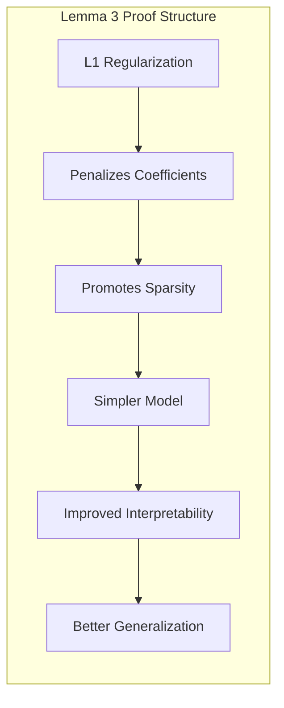

**Prova do Lemma 3:** A penalidade L1 impõe uma taxa constante de decréscimo nos coeficientes durante a otimização da função de custo. Esse mecanismo leva à remoção de variáveis irrelevantes para a tomada de decisão, criando modelos mais simples, e consequentemente mais robustos [^4.4.3], [^4.4.4]. $\blacksquare$

**Corolário 3:** *A regularização, tanto L1 quanto L2, melhora a estabilidade dos modelos e pode reduzir a chance de problemas como o overfitting, mesmo nos casos onde o problema do "masking" não seja diretamente abordado pela regularização.* O controle da complexidade e do overfitting leva a modelos mais robustos e confiáveis.

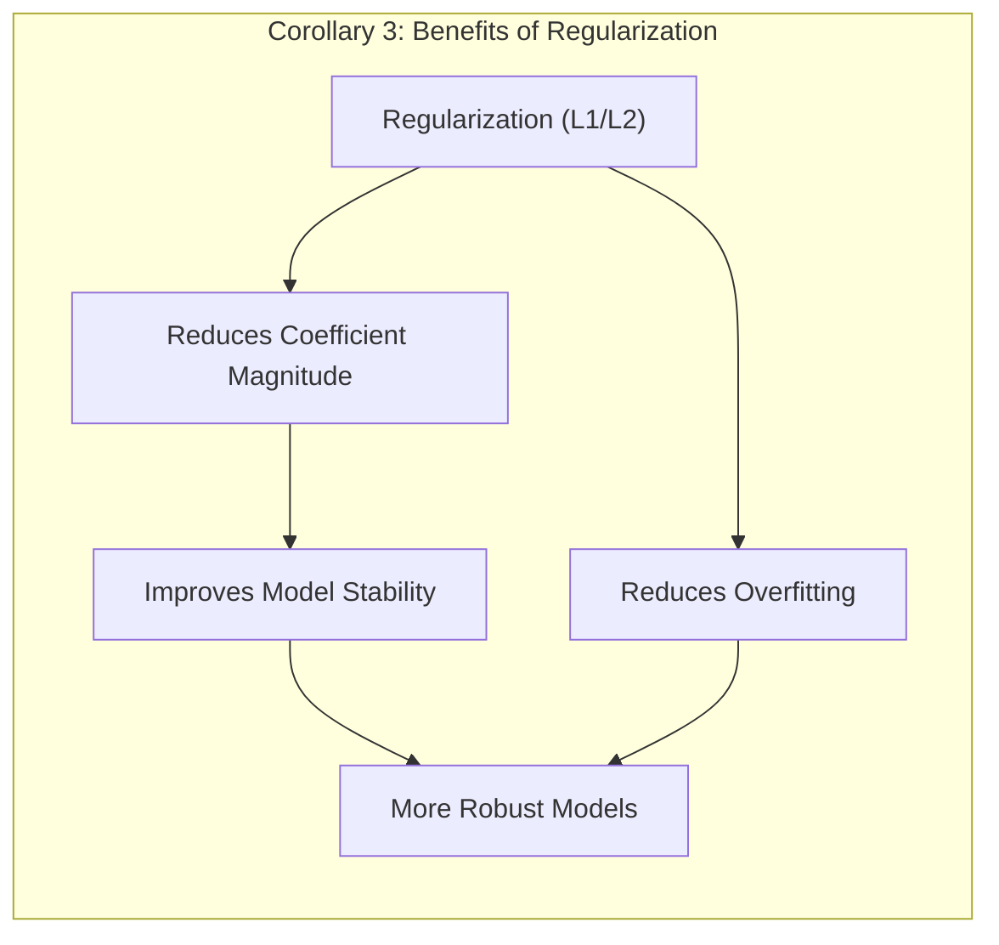

> ⚠️ **Ponto Crucial**: A seleção de variáveis e a regularização são ferramentas importantes para construir modelos de classificação mais robustos e generalizáveis, mesmo em cenários onde o problema do "masking" é mitigado por outras abordagens, como o LDA.

### Separating Hyperplanes e Perceptrons

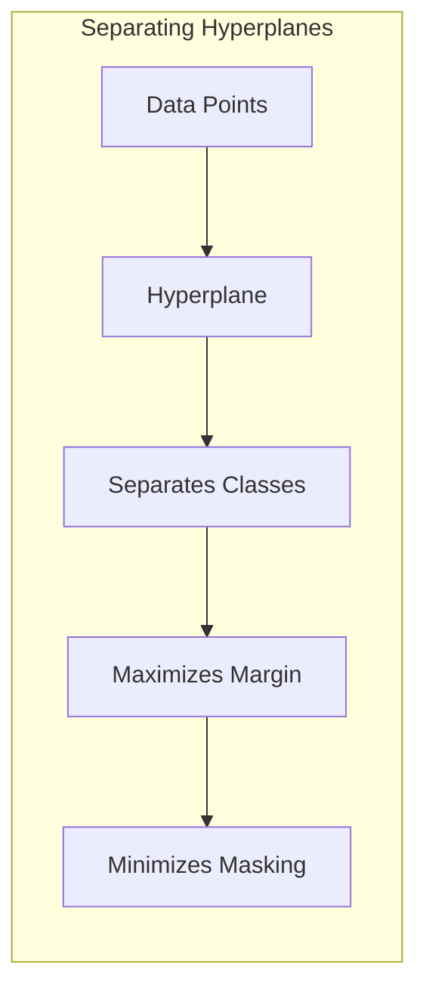

A ideia de **hiperplanos separadores** busca encontrar uma fronteira linear que maximize a separação entre as classes, buscando não apenas separar as classes, mas também minimizar o risco de erros de classificação e mitigar o problema do *masking* [^4.5.2]. Ao maximizar a distância entre o hiperplano e as amostras mais próximas de cada classe (margem), o objetivo é construir um modelo mais robusto, que seja menos sensível a pequenas mudanças nos dados.

O algoritmo do **Perceptron**, embora seja uma abordagem mais simples, busca um hiperplano separador de forma iterativa, ajustando os parâmetros do modelo a cada passo com base nas classificações incorretas [^4.5.1]. O Perceptron não garante a maximização da margem, e é mais suscetível a soluções subótimas, e o problema do masking, do que métodos como o LDA, e em particular o SVM, que buscam por hiperplanos ótimos.

**Teorema:** *Em cenários de dados linearmente separáveis, o algoritmo do Perceptron converge para um hiperplano separador em um número finito de iterações, embora a solução não seja única e nem garanta a maximização da margem.* Este teorema estabelece a garantia de convergência em condições ideais, apesar de não abordar diretamente o masking [^4.5.1].

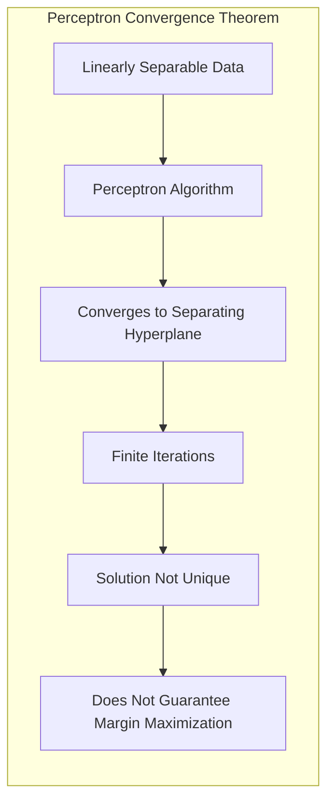

> 💡 **Exemplo Numérico:**
>
> Considere um conjunto de dados bidimensional com duas classes linearmente separáveis. Vamos ilustrar a busca por um hiperplano separador usando o Perceptron.
>
> ```python
> import numpy as np
> import matplotlib.pyplot as plt
> from sklearn.linear_model import Perceptron
> from sklearn.model_selection import train_test_split
>
> # Dados de exemplo linearmente separáveis
> np.random.seed(42)
> X = np.concatenate([np.random.randn(50, 2) + [2, 2], np.random.randn(50, 2) + [-2, -2]])
> y = np.array([0] * 50 + [1] * 50)
>
> # Divisão em treino e teste
> X_train, X_test, y_train, y_test = train_test_split(X, y, test_size=0.3, random_state=42)
>
> # Perceptron
> perceptron = Perceptron(max_iter=1000, tol=1e-3, random_state=42)
> perceptron.fit(X_train, y_train)
>
> # Avaliação
> train_score = perceptron.score(X_train, y_train)
> test_score = perceptron.score(X_test, y_test)
>
> print(f"Acurácia (treino): {train_score:.2f}")
> print(f"Acurácia (teste): {test_score:.2f}")
>
> # Plot da fronteira de decisão
> x_min, x_max = X[:, 0].min() - 1, X[:, 0].max() + 1
> y_min, y_max = X[:, 1].min() - 1, X[:, 1].max() + 1
> xx, yy = np.meshgrid(np.linspace(x_min, x_max, 500),
>                      np.linspace(y_min, y_max, 500))
> Z = perceptron.decision_function(np.c_[xx.ravel(), yy.ravel()])
> Z = Z.reshape(xx.shape)
>
> plt.figure(figsize=(8, 6))
> plt.contourf(xx, yy, Z > 0, cmap=plt.cm.RdBu, alpha=0.8)
> plt.scatter(X_train[:, 0], X_train[:, 1], c=y_train, cmap=plt.cm.RdBu, edgecolors='k', label='Dados de Treino')
> plt.scatter(X_test[:, 0], X_test[:, 1], c=y_test, cmap=plt.cm.RdBu, marker='x', s=50, edgecolors='k', label='Dados de Teste')
>
> plt.xlabel('X1')
> plt.ylabel('X2')
> plt.title('Perceptron - Hiperplano Separador')
> plt.legend()
> plt.grid(True)
> plt.show()
>
>
> # Visualização do hiperplano (Mermaid)
> print("""
> ```mermaid
> graph LR
>     A[Dados] --> B(Hiperplano Separador)
>     B --> C(Classificação)
> ```
> """)
> ```
>
> Este exemplo mostra como o Perceptron encontra um hiperplano que separa as classes. O gráfico mostra a fronteira de decisão e a distribuição dos dados. O diagrama Mermaid ilustra o fluxo do processo.

### Pergunta Teórica Avançada: Quais as diferenças fundamentais entre a formulação de LDA e a Regra de Decisão Bayesiana considerando distribuições Gaussianas com covariâncias iguais?

**Resposta:**

A **Regra de Decisão Bayesiana** busca classificar uma observação $x$ na classe $k$ que maximize a probabilidade posterior $P(G=k|X=x)$ [^4.3]. Quando as classes seguem distribuições Gaussianas com a mesma matriz de covariância $\Sigma$, o Teorema de Bayes resulta em:

$$
P(G=k|X=x) = \frac{ \phi(x;\mu_k,\Sigma)\pi_k}{\sum_{l=1}^K \phi(x;\mu_l,\Sigma)\pi_l}
$$

onde $\phi(x;\mu_k,\Sigma)$ é a densidade gaussiana da classe $k$, $\mu_k$ é a média da classe $k$ e $\pi_k$ é a probabilidade a priori da classe. O **LDA**, por sua vez, deriva suas funções discriminantes lineares diretamente dessas suposições, buscando otimizar a separação entre as classes [^4.3].

**Lemma 4:** *Sob a suposição de que as classes seguem distribuições Gaussianas com a mesma matriz de covariância, a regra de decisão Bayesiana e a função discriminante do LDA são equivalentes e levam à mesma fronteira de decisão linear.* A equivalência é obtida através da análise do log-ratio das probabilidades posteriores e da sua conexão com a função discriminante linear do LDA [^4.3].

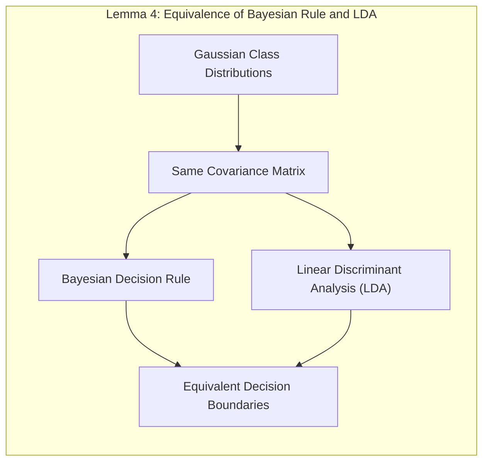

**Corolário 4:** *A remoção da restrição de igualdade de covariâncias na regra de decisão Bayesiana leva ao Quadratic Discriminant Analysis (QDA), que permite fronteiras de decisão quadráticas e, portanto, é capaz de modelar situações onde o LDA, por apresentar fronteiras de decisão lineares, pode ter o seu desempenho comprometido e sofrer do "masking".* A flexibilidade do QDA, que relaxa a suposição de covariâncias iguais, permite modelar relações mais complexas entre os dados e as classes, mas a um custo computacional maior. [^4.3.1], [^4.3.3]

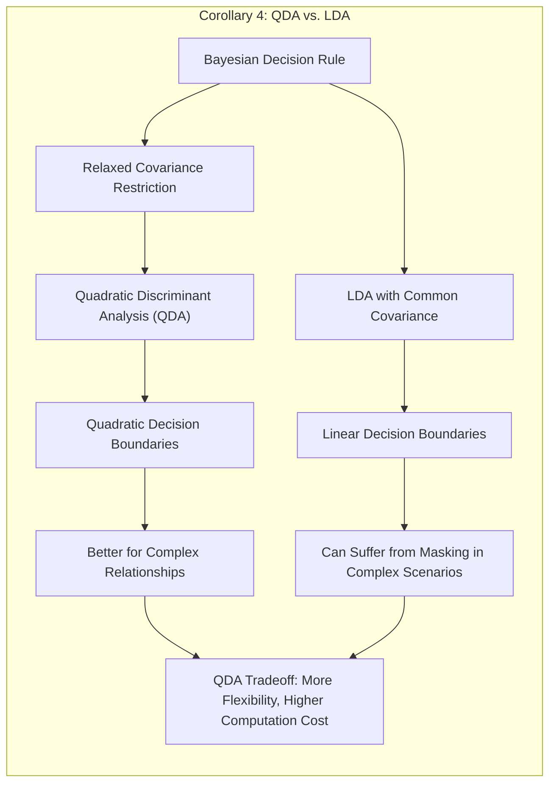

> ⚠️ **Ponto Crucial**: A principal diferença entre LDA e a regra de decisão Bayesiana reside na restrição da igualdade de covariâncias, que garante a formação de funções discriminantes lineares no LDA, enquanto a regra Bayesiana, quando aplicada sob a mesma restrição, leva ao mesmo resultado [^4.3].

### Conclusão

Neste capítulo, exploramos em profundidade o "masking problem", uma limitação da regressão linear com matrizes de indicadores em problemas