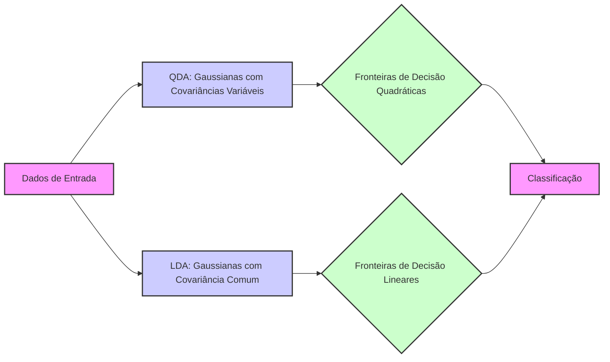
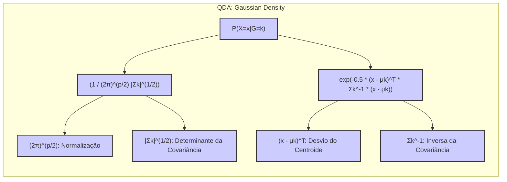
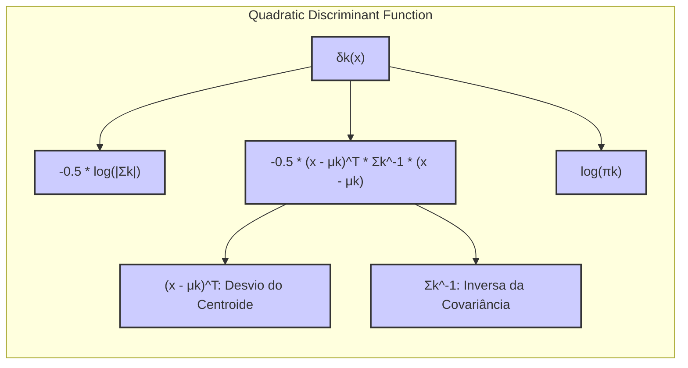
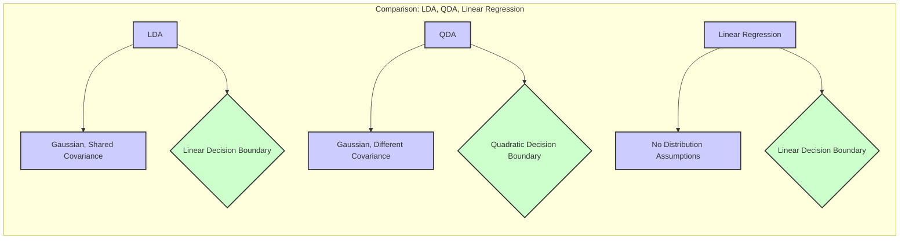
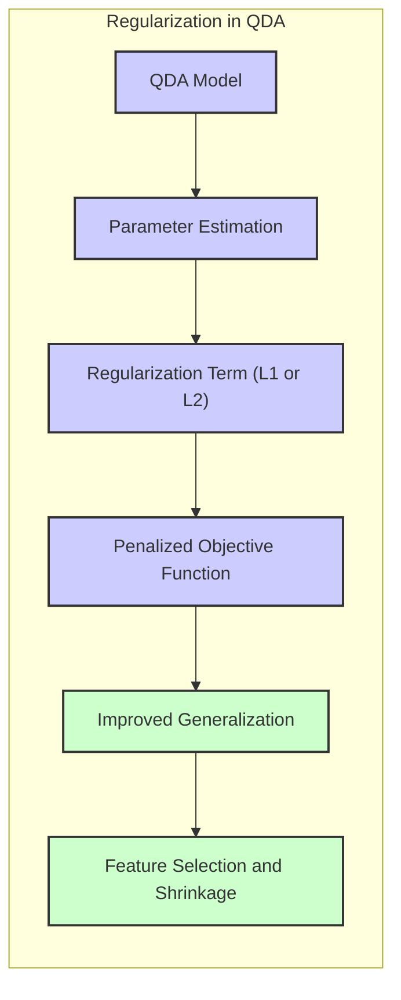
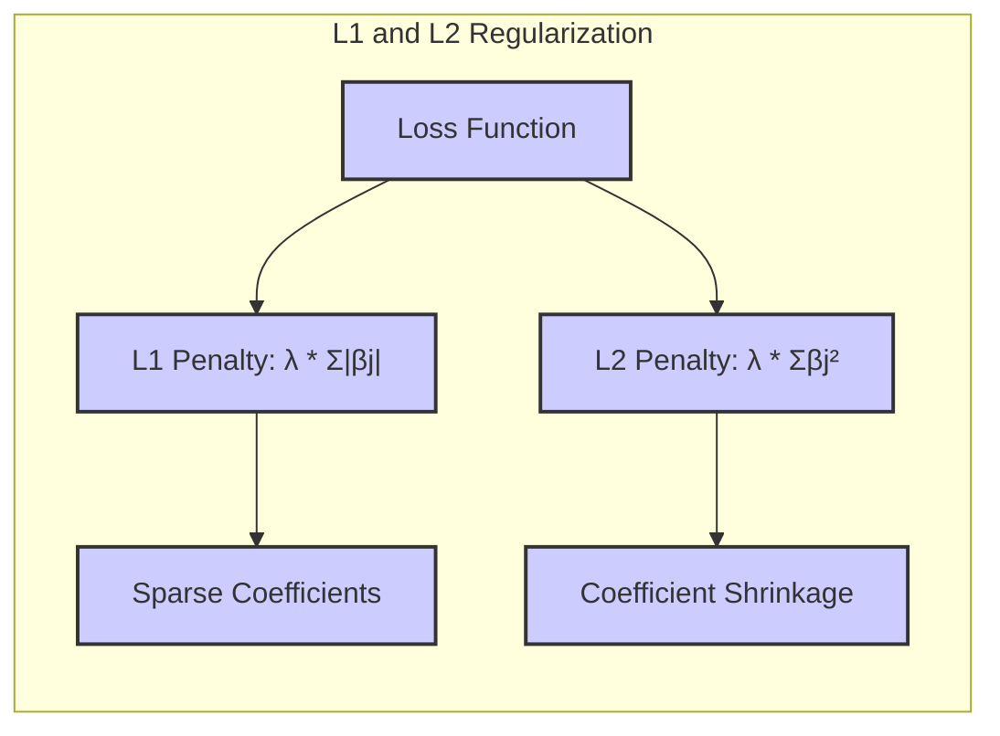
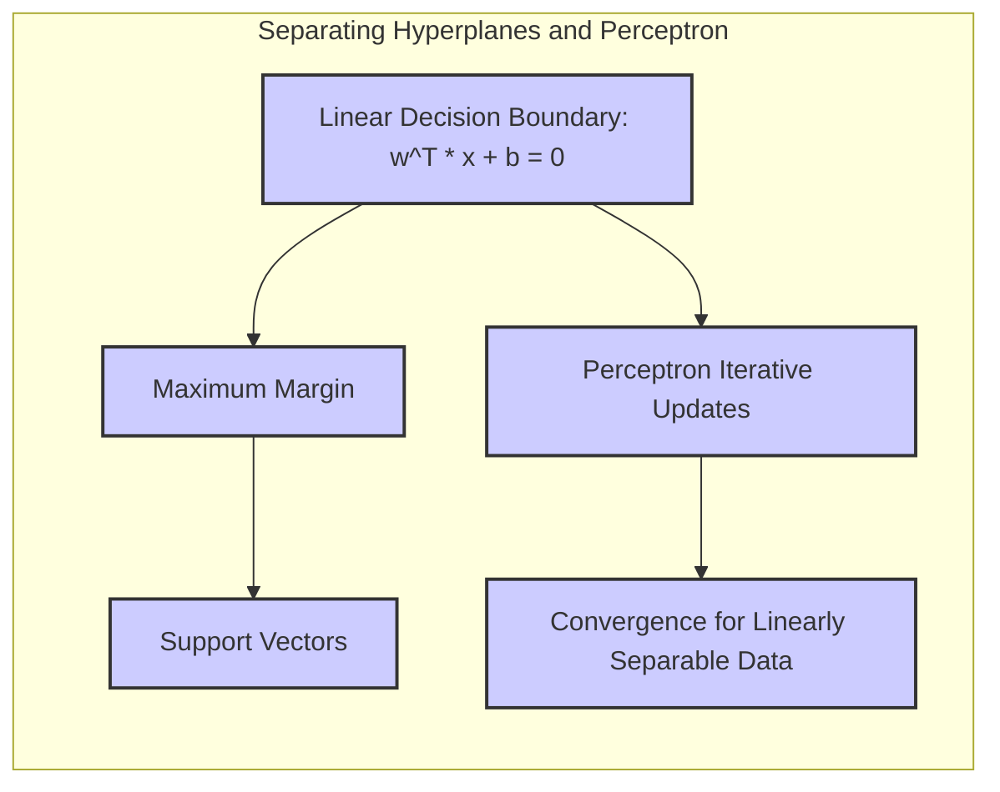
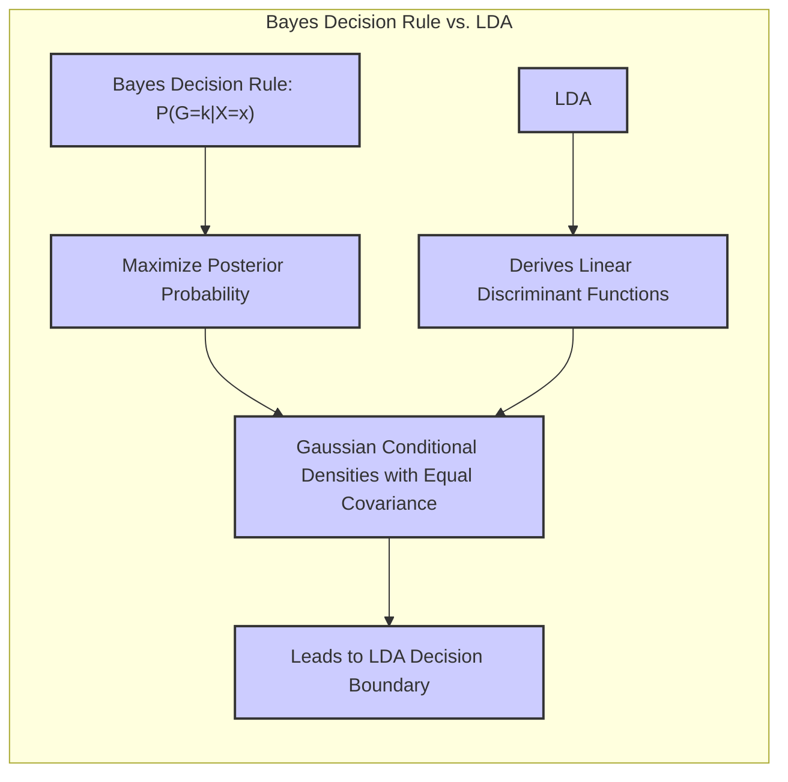

## Título Conciso: Classificação Quadrática: Fronteiras de Decisão Não Lineares e QDA



### Introdução

Este capítulo explora em detalhe o **Quadratic Discriminant Analysis (QDA)**, um método de classificação que, ao contrário do **Linear Discriminant Analysis (LDA)**, permite que cada classe tenha sua própria **matriz de covariância**, levando à formação de **fronteiras de decisão quadráticas** [^4.3]. Analisaremos como a remoção da suposição de covariâncias iguais no LDA afeta a forma da função discriminante e como isso resulta em fronteiras de decisão não lineares. Compararemos o QDA com a **regressão linear com matrizes de indicadores**, que não modela as densidades condicionais de forma direta, e com a **regressão logística**, que modela as probabilidades posteriores por meio de uma função logística [^4.2], [^4.4]. Discutiremos a importância da **seleção de variáveis e regularização** para controlar a complexidade dos modelos quadráticos [^4.4.4], [^4.5]. O conceito de **hiperplanos separadores** será abordado no contexto de modelos lineares, e contrastaremos com o QDA [^4.5.2]. O objetivo deste capítulo é fornecer uma compreensão aprofundada das fronteiras de decisão quadráticas no QDA e de como elas se relacionam com as suposições sobre a distribuição dos dados.

### Conceitos Fundamentais

**Conceito 1: Quadratic Discriminant Analysis (QDA) e a Flexibilidade das Covariâncias**

O **Quadratic Discriminant Analysis (QDA)** é uma generalização do LDA que relaxa a suposição de igualdade das matrizes de covariância entre as classes. No QDA, cada classe $k$ é modelada com uma distribuição gaussiana multivariada, caracterizada por um vetor de médias $\mu_k$ e uma matriz de covariância $\Sigma_k$ específica para cada classe [^4.3]. Ao permitir que as covariâncias variem entre as classes, o QDA torna-se mais flexível do que o LDA e é capaz de modelar dados com distribuições mais complexas, resultando em fronteiras de decisão não lineares [^4.3.1]. A função densidade gaussiana para a classe $k$ é dada por:

$$
P(X=x|G=k) = \phi(x; \mu_k, \Sigma_k) = \frac{1}{(2\pi)^{p/2}|\Sigma_k|^{1/2}} e^{-\frac{1}{2}(x-\mu_k)^T\Sigma_k^{-1}(x-\mu_k)}
$$

onde $p$ é a dimensão do espaço de entrada.

> 💡 **Exemplo Numérico:**
>
> Considere um problema de classificação com duas classes ($k=1, 2$) e duas variáveis ($p=2$). Suponha que os parâmetros estimados para cada classe são:
>
> - Classe 1: $\mu_1 = \begin{bmatrix} 1 \\ 1 \end{bmatrix}$, $\Sigma_1 = \begin{bmatrix} 2 & 0.5 \\ 0.5 & 1 \end{bmatrix}$
> - Classe 2: $\mu_2 = \begin{bmatrix} 3 \\ 3 \end{bmatrix}$, $\Sigma_2 = \begin{bmatrix} 1 & -0.2 \\ -0.2 & 1.5 \end{bmatrix}$
>
> Note que as matrizes de covariância $\Sigma_1$ e $\Sigma_2$ são diferentes. A função densidade para cada classe pode ser calculada para qualquer ponto $x = [x_1, x_2]^T$. Por exemplo, para o ponto $x = \begin{bmatrix} 2 \\ 2 \end{bmatrix}$:
>
> Para a Classe 1:
>
>  $\Sigma_1^{-1} = \frac{1}{(2*1 - 0.5*0.5)} \begin{bmatrix} 1 & -0.5 \\ -0.5 & 2 \end{bmatrix} =  \frac{1}{1.75} \begin{bmatrix} 1 & -0.5 \\ -0.5 & 2 \end{bmatrix} \approx \begin{bmatrix} 0.57 & -0.29 \\ -0.29 & 1.14 \end{bmatrix}$
>
>  $(x - \mu_1)^T \Sigma_1^{-1} (x - \mu_1) =  \begin{bmatrix} 1 & 1 \end{bmatrix} \begin{bmatrix} 0.57 & -0.29 \\ -0.29 & 1.14 \end{bmatrix} \begin{bmatrix} 1 \\ 1 \end{bmatrix} = 1.13$
>
>  $|\Sigma_1| = 2*1 - 0.5*0.5 = 1.75$
>
>  $\phi(x; \mu_1, \Sigma_1) = \frac{1}{(2\pi)^{2/2}(1.75)^{1/2}} e^{-0.5 * 1.13} \approx 0.081$
>
> Para a Classe 2:
>
>  $\Sigma_2^{-1} = \frac{1}{(1*1.5 - (-0.2)*(-0.2))} \begin{bmatrix} 1.5 & 0.2 \\ 0.2 & 1 \end{bmatrix} = \frac{1}{1.46} \begin{bmatrix} 1.5 & 0.2 \\ 0.2 & 1 \end{bmatrix} \approx \begin{bmatrix} 1.03 & 0.14 \\ 0.14 & 0.68 \end{bmatrix}$
>
> $(x - \mu_2)^T \Sigma_2^{-1} (x - \mu_2) = \begin{bmatrix} -1 & -1 \end{bmatrix} \begin{bmatrix} 1.03 & 0.14 \\ 0.14 & 0.68 \end{bmatrix} \begin{bmatrix} -1 \\ -1 \end{bmatrix} = 1.85$
>
>  $|\Sigma_2| = 1*1.5 - (-0.2)*(-0.2) = 1.46$
>
>  $\phi(x; \mu_2, \Sigma_2) = \frac{1}{(2\pi)^{2/2}(1.46)^{1/2}} e^{-0.5 * 1.85} \approx 0.074$
>
> A densidade da classe 1 é maior nesse ponto, o que sugere que este ponto estaria mais próximo da classe 1, mas a decisão final depende também das probabilidades a priori e da função discriminante completa.



**Lemma 1:** *No QDA, a remoção da suposição de igualdade de covariâncias entre as classes leva à formação de funções discriminantes quadráticas e, consequentemente, a fronteiras de decisão não lineares.* A prova deste lema é obtida analisando a forma das funções discriminantes no QDA e como as parcelas quadráticas não se cancelam quando a covariância é distinta entre as classes.

**Conceito 2: Funções Discriminantes Quadráticas e Fronteiras de Decisão**

No QDA, a função discriminante para a classe $k$ é dada por:

$$
\delta_k(x) = -\frac{1}{2} \log |\Sigma_k| - \frac{1}{2} (x - \mu_k)^T \Sigma_k^{-1} (x - \mu_k) + \log \pi_k
$$

onde $\mu_k$ é o vetor de médias da classe $k$, $\Sigma_k$ é a matriz de covariância da classe $k$ e $\pi_k$ é a probabilidade a priori da classe $k$. A decisão de classificação é tomada atribuindo a observação $x$ à classe que maximize $\delta_k(x)$ [^4.3]. Ao contrário do LDA, essa função discriminante é quadrática em $x$, o que significa que as fronteiras de decisão entre as classes não são mais hiperplanos, mas sim superfícies quadráticas, como parábolas, elipses e hipérboles [^4.3.1].

> 💡 **Exemplo Numérico:**
>
> Usando os mesmos parâmetros do exemplo anterior, e assumindo probabilidades a priori iguais para ambas as classes ($\pi_1 = \pi_2 = 0.5$), podemos calcular as funções discriminantes para o ponto $x = \begin{bmatrix} 2 \\ 2 \end{bmatrix}$:
>
> Para a Classe 1:
>
> $\delta_1(x) = -\frac{1}{2} \log(1.75) - \frac{1}{2} (1.13) + \log(0.5) \approx -0.28 - 0.565 - 0.693 \approx -1.538$
>
> Para a Classe 2:
>
> $\delta_2(x) = -\frac{1}{2} \log(1.46) - \frac{1}{2} (1.85) + \log(0.5) \approx -0.19 - 0.925 - 0.693 \approx -1.808$
>
> Como $\delta_1(x) > \delta_2(x)$, o ponto $x$ seria classificado na classe 1. A fronteira de decisão seria dada por $\delta_1(x) = \delta_2(x)$, que resulta em uma equação quadrática.
>
> Podemos visualizar essa fronteira de decisão no espaço de features usando um gráfico de contorno. Para isso, precisaríamos calcular os valores de $\delta_1(x)$ e $\delta_2(x)$ para uma grade de valores de $x_1$ e $x_2$, e então plotar a curva onde $\delta_1(x) = \delta_2(x)$.



**Corolário 1:** *A utilização de matrizes de covariância distintas para cada classe no QDA resulta em funções discriminantes quadráticas e, consequentemente, em fronteiras de decisão não lineares.* Essa diferença é fundamental na distinção entre LDA e QDA.

**Conceito 3: Vantagens e Desvantagens do QDA**

O QDA oferece maior flexibilidade em relação ao LDA, permitindo que as fronteiras de decisão se adaptem à estrutura dos dados de forma mais precisa. No entanto, essa flexibilidade tem um custo. O QDA possui um número maior de parâmetros a serem estimados, o que o torna mais suscetível ao *overfitting*, especialmente quando o número de observações por classe é pequeno. Além disso, a estimação das matrizes de covariância para cada classe pode ser computacionalmente mais custosa do que a estimação de uma única matriz de covariância compartilhada, como no LDA. Portanto, o QDA é mais adequado para situações onde a suposição de covariâncias iguais é claramente violada, e é necessário modelar fronteiras de decisão mais complexas [^4.3.2].

> ⚠️ **Nota Importante**: O QDA, ao remover a restrição de igualdade das covariâncias do LDA, se torna mais flexível e capaz de modelar dados com distribuições mais complexas, mas também mais suscetível ao *overfitting*.

> ❗ **Ponto de Atenção**: A escolha entre LDA e QDA deve levar em consideração o trade-off entre viés (LDA) e variância (QDA), bem como o tamanho da amostra e a complexidade da estrutura dos dados.

> ✔️ **Destaque**: O QDA, ao permitir que cada classe tenha sua própria matriz de covariância, produz fronteiras de decisão que são quadráticas, e não mais lineares como no LDA.

### Regressão Linear e Mínimos Quadrados para Classificação



A **regressão linear com matrizes de indicadores** busca ajustar funções lineares separadamente para cada classe, sem modelar diretamente as densidades condicionais das classes ou impor suposições sobre as matrizes de covariância [^4.2]. Ao contrário do LDA, que assume covariâncias iguais, e do QDA, que assume distribuições gaussianas mas permite covariâncias diferentes, a regressão linear não impõe restrições sobre as distribuições dos dados. A regressão linear ajusta modelos independentes para cada classe usando mínimos quadrados, e a decisão de classificação é tomada atribuindo a observação à classe com maior saída ajustada.

A abordagem da regressão linear não leva à formação de fronteiras de decisão quadráticas, como o QDA, uma vez que o ajuste dos coeficientes é feito através da minimização da soma dos quadrados dos erros, o que resulta em funções lineares e fronteiras de decisão lineares. A regressão linear não utiliza informações sobre a estrutura da matriz de covariância e não busca modelar as densidades condicionais como o LDA ou o QDA [^4.2].

Enquanto o LDA e QDA buscam modelos que se baseiam nas propriedades distribucionais dos dados, a regressão linear com matrizes de indicadores busca apenas minimizar a distância entre a resposta predita e o target da classe, através de funções lineares separadas para cada classe, sem considerar explicitamente a forma das densidades condicionais ou a probabilidade posterior [^4.2].

> 💡 **Exemplo Numérico:**
>
> Considere um problema de classificação binária com duas classes, onde a classe 1 é representada por $y=1$ e a classe 2 por $y=0$. Suponha que temos um único preditor $x$ e o seguinte conjunto de dados:
>
> | x    | y |
> |------|---|
> | 1    | 0 |
> | 2    | 0 |
> | 3    | 1 |
> | 4    | 1 |
>
> Podemos ajustar dois modelos de regressão linear separadamente, um para cada classe. Para a classe 1 (y=1), o modelo seria $f_1(x) = \beta_{01} + \beta_{11}x$, e para a classe 2 (y=0), o modelo seria $f_2(x) = \beta_{02} + \beta_{12}x$.
>
> Utilizando o método dos mínimos quadrados para ajustar esses modelos, podemos obter os seguintes resultados (este é um exemplo simplificado, em geral, precisaríamos usar um pacote estatístico para calcular os coeficientes):
>
> $f_1(x) = -1 + 0.7x$
> $f_2(x) = 0 + 0.1x$
>
> A decisão de classificação seria feita comparando $f_1(x)$ e $f_2(x)$. Se $f_1(x) > f_2(x)$, classificamos como classe 1, caso contrário, como classe 2. A fronteira de decisão seria onde $f_1(x) = f_2(x)$, que neste caso é uma linha reta.
>
> Visualmente, podemos notar que a regressão linear ajusta retas para cada classe, que não necessariamente capturam a estrutura dos dados como o QDA faria se os dados tivessem uma distribuição gaussiana com covariâncias diferentes.

**Lemma 2:** *Ao contrário do QDA, a regressão linear com matrizes de indicadores não leva à formação de fronteiras de decisão quadráticas, uma vez que não modela as densidades condicionais e estima os parâmetros de forma independente.* A prova desse lema reside na forma da função de custo na regressão linear e na forma das funções discriminantes no QDA.

**Corolário 2:** *A utilização da regressão linear com matrizes de indicadores para problemas de classificação, ao não considerar as matrizes de covariância das classes, não leva à formação de fronteiras de decisão quadráticas, como o QDA, e portanto, não consegue capturar relações mais complexas entre as classes.*  Este corolário estabelece uma distinção clara entre as duas abordagens e a forma das fronteiras de decisão resultantes.

A regressão linear com matrizes de indicadores, portanto, não se conecta diretamente com o conceito de fronteiras de decisão quadráticas, uma vez que não modela as densidades condicionais com distribuições gaussianas com diferentes covariâncias. O QDA oferece uma forma de relaxar a suposição do LDA, gerando fronteiras de decisão não lineares com maior capacidade de modelagem, e melhor aderência a problemas onde a suposição de igualdade de covariância é claramente violada [^4.3].

### Métodos de Seleção de Variáveis e Regularização em Classificação



A **seleção de variáveis** e a **regularização** são técnicas importantes para lidar com a complexidade dos modelos e evitar o *overfitting* em problemas de classificação, incluindo aqueles onde as fronteiras de decisão são quadráticas, como no QDA. A regularização, ao adicionar um termo de penalidade à função de custo, busca controlar a magnitude dos coeficientes do modelo e melhorar a capacidade de generalização para novos dados [^4.5].

Na **regressão logística**, a regularização é aplicada através da modificação da função de verossimilhança, de acordo com a formulação:

$$
\max_{\beta_0, \beta} \left[ \sum_{i=1}^N \left( y_i (\beta_0 + \beta^T x_i) - \log(1 + e^{\beta_0 + \beta^T x_i}) \right) - \lambda P(\beta) \right]
$$

onde $P(\beta)$ é a penalidade e $\lambda$ é o parâmetro de regularização. A penalidade **L1** (Lasso), dada por $P(\beta) = \sum_{j=1}^p |\beta_j|$, promove a esparsidade dos coeficientes, selecionando as variáveis mais relevantes e simplificando o modelo [^4.4.4]. A penalidade **L2** (Ridge), dada por $P(\beta) = \sum_{j=1}^p \beta_j^2$, reduz a magnitude dos coeficientes, estabilizando o modelo e diminuindo o risco de *overfitting* [^4.5].

> 💡 **Exemplo Numérico:**
>
> Vamos considerar um exemplo de regressão logística com duas variáveis ($x_1$ e $x_2$) e um termo de regularização L1. A função de verossimilhança regularizada é:
>
> $$
> L(\beta) = \sum_{i=1}^N \left[ y_i(\beta_0 + \beta_1 x_{i1} + \beta_2 x_{i2}) - \log(1 + e^{\beta_0 + \beta_1 x_{i1} + \beta_2 x_{i2}}) \right] - \lambda (|\beta_1| + |\beta_2|)
> $$
>
> Suponha que, sem regularização ($\lambda=0$), os coeficientes estimados sejam $\beta_0 = -1$, $\beta_1 = 2$ e $\beta_2 = -3$. Agora, vamos aplicar regularização L1 com $\lambda = 1$. A função de verossimilhança regularizada será maximizada por um algoritmo de otimização, resultando em novos coeficientes. Um possível resultado seria, por exemplo, $\beta_0 = -0.8$, $\beta_1 = 1.2$ e $\beta_2 = -2$.
>
> Observe que a regularização L1 tende a reduzir a magnitude dos coeficientes, e, em casos mais extremos, pode zerar alguns deles (esparsidade). Se, em vez disso, tivéssemos usado a regularização L2, os coeficientes seriam reduzidos de forma diferente, mas ainda haveria uma redução em suas magnitudes, embora não necessariamente para zero. O efeito da regularização é evitar o overfitting, e a escolha de $\lambda$ é normalmente feita através de validação cruzada.
>
> Podemos comparar os resultados com e sem regularização:
>
> | Método        | $\beta_0$ | $\beta_1$ | $\beta_2$ |
> |---------------|-----------|-----------|-----------|
> | Sem Reg.      | -1        | 2         | -3        |
> | L1 Reg. ($\lambda$=1) | -0.8      | 1.2       | -2        |
>
> A regularização L1, neste exemplo, reduziu a magnitude dos coeficientes e pode, em outros casos, zerar alguns deles, o que é útil para seleção de variáveis.



A aplicação da regularização é particularmente importante em modelos mais complexos como o QDA, pois modelos com muitos parâmetros (como o QDA) podem ser mais suscetíveis ao *overfitting* e a problemas de instabilidade. Ao controlar a complexidade e selecionar as variáveis mais importantes, a regularização auxilia na construção de modelos com melhor capacidade de generalização.

**Lemma 3:** *A penalidade L1, ao induzir esparsidade nos coeficientes, leva a um modelo mais simples e com melhor capacidade de generalização, mesmo em modelos com fronteiras de decisão quadráticas, como o QDA.* Isso ocorre devido ao impacto da penalidade L1 na função de custo.

**Prova do Lemma 3:** A penalidade L1 adiciona um termo que é proporcional ao valor absoluto dos coeficientes na função de custo. A minimização da função de custo, com este termo, força a maioria dos coeficientes menos importantes a se tornarem exatamente zero, o que leva a modelos mais simples e com melhor capacidade de generalização [^4.4.3], [^4.4.4].  $\blacksquare$

**Corolário 3:** *A regularização, tanto L1 quanto L2, auxilia no controle do overfitting em modelos de classificação complexos, e a seleção de variáveis através da penalidade L1 melhora a interpretabilidade e a generalização dos modelos, mesmo quando as fronteiras de decisão são quadráticas.* O controle do *overfitting* aumenta a qualidade da estimativa dos parâmetros e da fronteira de decisão.

> ⚠️ **Ponto Crucial**: A regularização, seja L1 ou L2, desempenha um papel fundamental na construção de modelos de classificação mais robustos, mesmo quando as fronteiras de decisão são quadráticas, como no QDA, ou quando o modelo não considera suposições Gaussianas como a regressão logística, e auxilia na seleção das variáveis mais importantes [^4.5].

### Separating Hyperplanes e Perceptrons



A ideia de **hiperplanos separadores** busca encontrar uma fronteira linear que maximize a distância entre as classes, ou seja, a margem de separação. Essa abordagem é central em modelos como as máquinas de vetores de suporte (SVM), onde o objetivo é encontrar o hiperplano ótimo que maximize a separação entre as classes, buscando uma fronteira linear que seja a melhor possível dentro da família de funções lineares [^4.5.2].

O algoritmo do **Perceptron** busca um hiperplano separador ajustando os parâmetros do modelo de forma iterativa com base nas classificações incorretas [^4.5.1].  O Perceptron, embora seja uma abordagem mais simples, ilustra a capacidade de um modelo linear para separar classes em problemas que são linearmente separáveis.  Em situações onde a separabilidade linear não é possível, o Perceptron não garante convergência, e o método se torna inadequado.

> 💡 **Exemplo Numérico:**
>
> Considere um problema de classificação binária com duas variáveis $x_1$ e $x_2$ e os seguintes dados (linearmente separáveis):
>
> - Classe 1: $(1,1), (2,1), (2,2)$
> - Classe 2: $(0,0), (1,0), (0,1)$
>
> O Perceptron busca um hiperplano da forma $w_0 + w_1x_1 + w_2x_2 = 0$. O algoritmo começa com pesos iniciais (por exemplo, $w_0=0, w_1=0, w_2=0$) e itera sobre os dados, atualizando os pesos quando há uma classificação incorreta.
>
> Suponha que o Perceptron itera sobre os dados e classifica inicialmente o ponto (1,1) da classe 1 como classe 2 (ou seja, $w_0 + w_1(1) + w_2(1) < 0$). Então, os pesos são atualizados utilizando a regra de atualização do Perceptron $w_{new} = w_{old} + \alpha y x$, onde $\alpha$ é a taxa de aprendizagem e $y$ é o rótulo da classe (1 ou -1).
>
> Após algumas iterações, o Perceptron pode encontrar um hiperplano separador, como por exemplo, $-0.5 + 1x_1 + 1x_2 = 0$. Este hiperplano classifica corretamente todos os pontos dos dados.
>
> O Perceptron ilustra como um modelo linear pode separar classes linearmente separáveis, mas este modelo não é adequado para dados não linearmente separáveis, onde o QDA poderia ser mais adequado.
>
>  ```mermaid
>  graph LR
>      A[Classe 1: (1,1), (2,1), (2,2)] -->|Positive Side of Hyperplane| C(Hyperplane: -0.5 + x1 + x2 = 0);
>      B[Classe 2: (0,0), (1,0), (0,1)] -->|Negative Side of Hyperplane| C;
>  ```

O conceito de hiperplanos separadores está diretamente ligado à classificação linear, e a sua capacidade de modelar problemas com fronteiras de decisão lineares contrasta com o QDA, que gera fronteiras quadráticas, e com a complexidade dos modelos não lineares [^4.3.1].

**Teorema:** *Em um cenário de dados linearmente separáveis, o algoritmo do Perceptron converge para um hiperplano separador em um número finito de iterações.* Este teorema garante a convergência sob as condições de linearidade, mas não representa uma solução para a não linearidade dos problemas [^4.5.1].

### Pergunta Teórica Avançada: Quais as diferenças fundamentais entre a formulação de LDA e a Regra de Decisão Bayesiana considerando distribuições Gaussianas com covariâncias iguais?

**Resposta:**

A **Regra de Decisão Bayesiana** busca classificar uma observação $x$ na classe $k$ que maximize a probabilidade posterior $P(G=k|X=x)$ [^4.3]. Sob a suposição de que as classes seguem distribuições Gaussianas com a mesma matriz de covariância $\Sigma$, a probabilidade posterior é dada por:

$$
P(G=k|X=x) = \frac{ \phi(x;\mu_k,\Sigma)\pi_k}{\sum_{l=1}^K \phi(x;\mu_l,\Sigma)\pi_l}
$$

onde $\phi(x;\mu_k,\Sigma)$ é a densidade gaussiana para a classe $k$, $\mu_k$ é a média da classe $k$ e $\pi_k$ é a probabilidade a priori da classe. O **LDA**, por sua vez, deriva suas funções discriminantes lineares a partir dessas suposições, buscando maximizar a separação entre as classes com base nas médias e na covariância compartilhada [^4.3].



**Lemma 4:** *Sob a suposição de distribuições Gaussianas com a mesma matriz de covariância, a regra de decisão Bayesiana e o LDA levam à mesma fronteira de decisão linear, e os coeficientes e interceptos utilizados na definição da fronteira são equivalentes.*