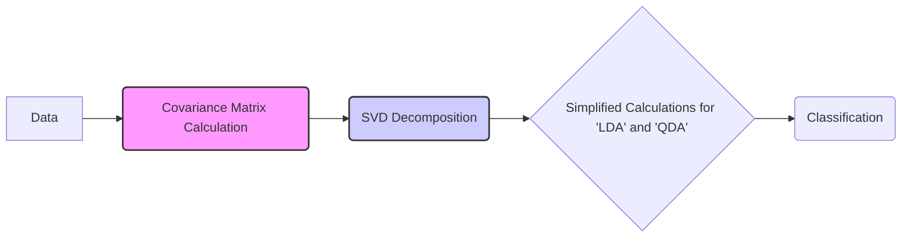
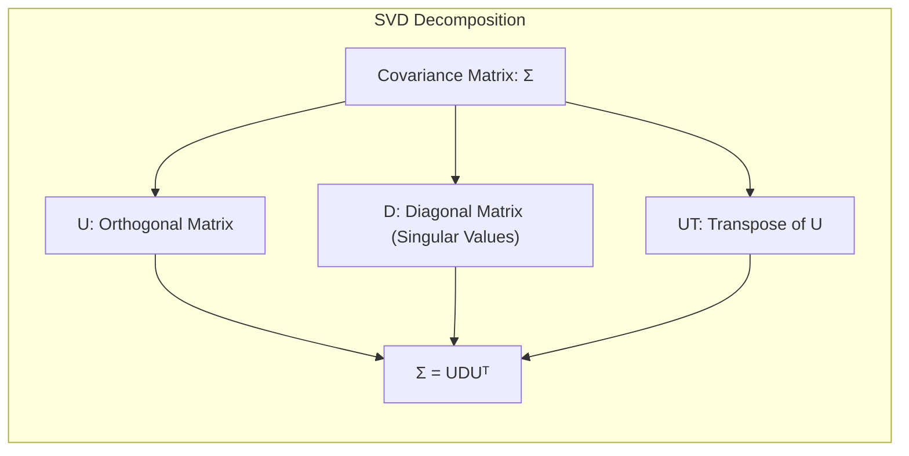
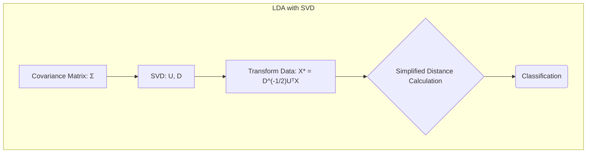
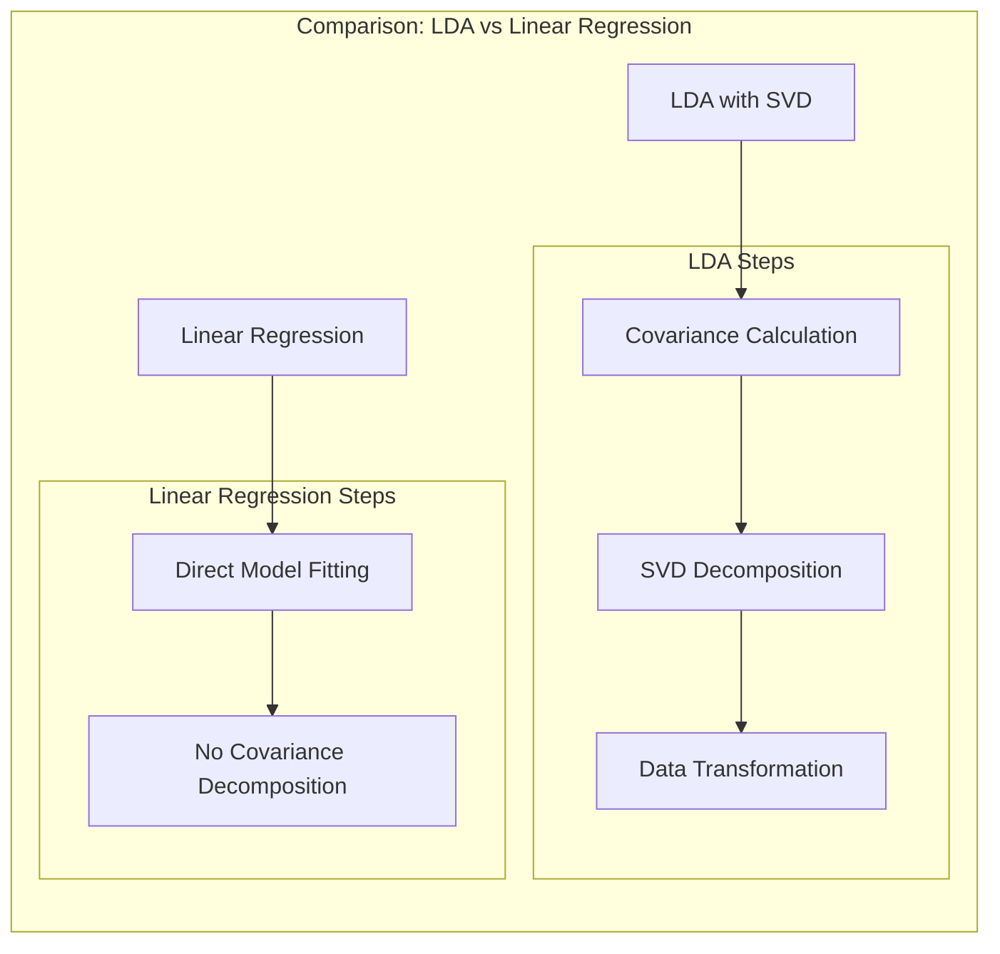
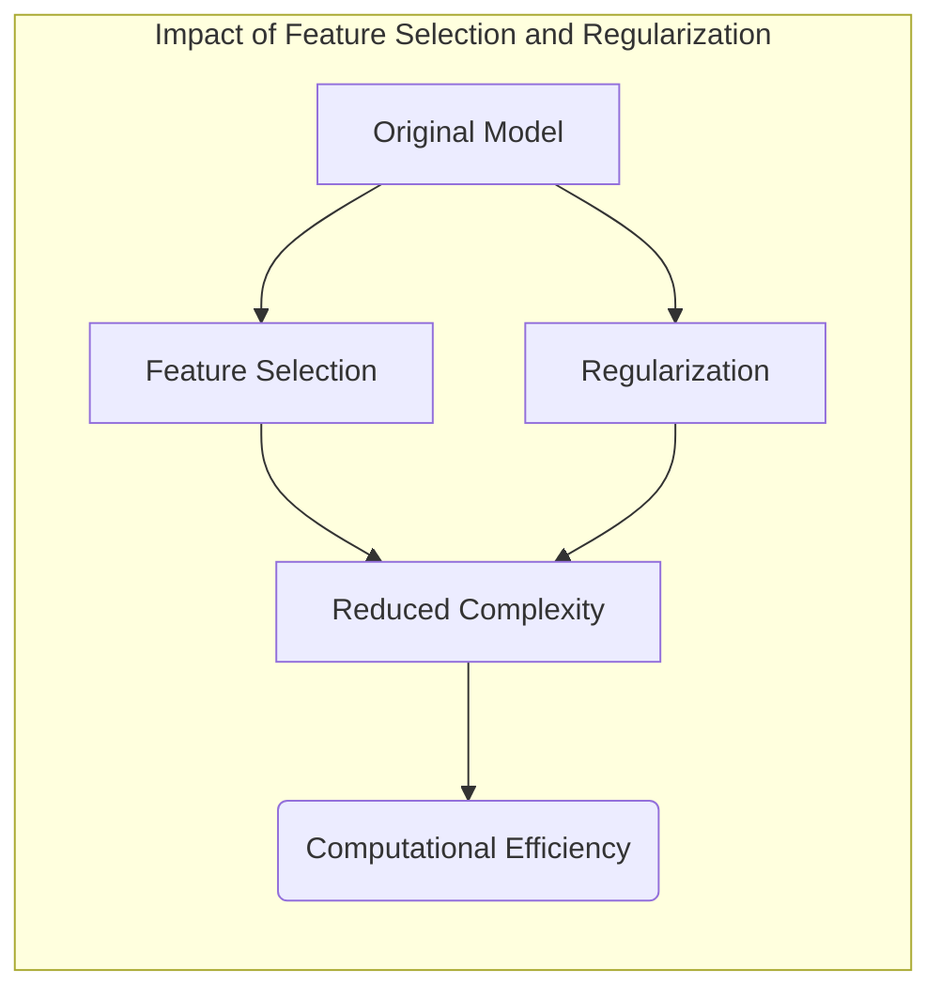
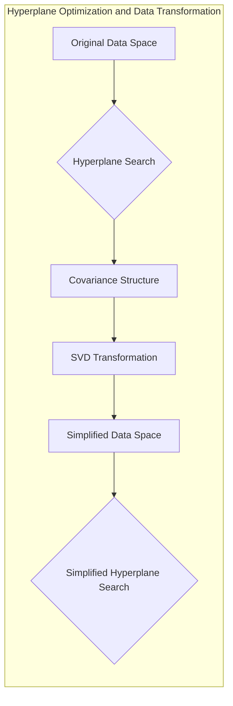
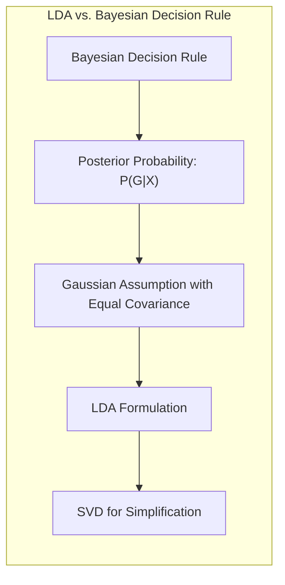

## Título Conciso: Classificação Linear e Aspectos Computacionais: SVD de Covariâncias



### Introdução

Este capítulo explora os aspectos **computacionais** envolvidos no uso de métodos de classificação linear, com foco na aplicação da **decomposição em valores singulares (SVD)** da matriz de covariância para simplificar os cálculos em **Linear Discriminant Analysis (LDA)** e **Quadratic Discriminant Analysis (QDA)** [^4.3.2]. Analisaremos como a SVD pode ser utilizada para transformar os dados e simplificar a computação das funções discriminantes em LDA e QDA. Compararemos estas abordagens com a **regressão linear com matrizes de indicadores**, que não utiliza as informações sobre covariância para o ajuste dos coeficientes [^4.2], e com a **regressão logística**, onde a SVD pode não ser tão útil devido à forma da função de custo [^4.4]. Abordaremos também a importância da **seleção de variáveis e regularização** para reduzir a complexidade computacional dos modelos [^4.4.4], [^4.5]. O conceito de **hiperplanos separadores** e sua relação com a transformação dos dados via SVD também será discutido [^4.5.2]. O objetivo deste capítulo é fornecer uma visão detalhada de como as considerações computacionais, e em particular a aplicação da SVD na estimação de covariâncias, afetam a eficiência dos modelos de classificação linear.

### Conceitos Fundamentais

**Conceito 1: O Papel da SVD na Computação em Classificação Linear**

A **decomposição em valores singulares (SVD)** é uma técnica de álgebra linear que decompõe uma matriz em três matrizes, permitindo simplificar diversas operações computacionais. No contexto de modelos de classificação linear, a SVD é particularmente útil para decompor a matriz de covariância $\Sigma$ em:

$$
\Sigma = U D U^T
$$

onde $U$ é uma matriz ortogonal, $D$ é uma matriz diagonal com os valores singulares na diagonal e $U^T$ é a transposta de $U$. Essa decomposição permite simplificar o cálculo da inversa da matriz de covariância e a forma quadrática $(x - \mu)^T \Sigma^{-1} (x - \mu)$ [^4.3.2].  A SVD, portanto, facilita a implementação de modelos de classificação linear de maneira mais eficiente.

> 💡 **Exemplo Numérico:**
> Suponha que temos uma matriz de covariância $\Sigma$ para duas variáveis:
>
> ```python
> import numpy as np
>
> sigma = np.array([[2.0, 1.0],
>                   [1.0, 3.0]])
>
> # Usando numpy para SVD
> U, D, UT = np.linalg.svd(sigma)
> print("U:\n", U)
> print("D:\n", np.diag(D))
> print("UT:\n", UT)
> ```
>
> A saída será:
>
> ```
> U:
>  [[-0.85065081 -0.52573091]
>  [ 0.52573091 -0.85065081]]
> D:
>  [[3.61803399 0.        ]
>  [0.        1.38196601]]
> UT:
>  [[-0.85065081 -0.52573091]
>  [ 0.52573091 -0.85065081]]
> ```
>
> Onde `U` é a matriz de autovetores, `D` é a matriz diagonal com os autovalores e `UT` é a transposta de `U`. A matriz de covariância original $\Sigma$ pode ser reconstruída como $UDU^T$. A SVD permite calcular $\Sigma^{-1}$ de forma mais eficiente, pois $\Sigma^{-1} = U D^{-1} U^T$, e $D^{-1}$ é simplesmente a inversão dos valores da diagonal.

**Lemma 1:** *A SVD permite transformar os dados de entrada de forma que a matriz de covariância se torne uma matriz diagonal, o que simplifica o cálculo de funções quadráticas e a inversão da matriz de covariância.* A prova deste lema reside nas propriedades da SVD e como a transformação leva a uma forma mais simples da matriz de covariância.



**Conceito 2: Aplicação da SVD no LDA**

No **LDA**, a SVD pode ser utilizada para simplificar a forma quadrática que aparece na função discriminante:

$$
(x - \mu_k)^T \Sigma^{-1} (x - \mu_k)
$$

Ao aplicar a SVD na matriz de covariância, podemos transformar os dados em um novo espaço onde a matriz de covariância é a identidade, o que simplifica os cálculos. Essa transformação é dada por:

$$
X^* \leftarrow D^{-1/2} U^T X
$$

onde $D$ e $U$ são obtidos através da decomposição em valores singulares da matriz de covariância. Após essa transformação, a classificação pode ser feita no novo espaço, utilizando apenas as distâncias euclidianas aos centros das classes, reduzindo a complexidade computacional [^4.3.2].

> 💡 **Exemplo Numérico:**
>
> Suponha que temos duas classes com médias $\mu_1 = [1, 1]$ e $\mu_2 = [3, 3]$, e uma matriz de covariância $\Sigma$ como no exemplo anterior. Um ponto $x = [2, 2]$ será transformado.
>
> 1.  **Calculando $D^{-1/2}$:**
>
>     ```python
>     D_sqrt_inv = np.diag(1/np.sqrt(D))
>     print("D^(-1/2):\n", D_sqrt_inv)
>     ```
>     
>     A saída será:
>     ```
>     D^(-1/2):
>      [[0.52573111 0.        ]
>      [0.         0.85065081]]
>     ```
>
> 2.  **Transformando o ponto $x$:**
>
>     ```python
>     x = np.array([2, 2])
>     x_transformed = D_sqrt_inv @ UT @ x
>     print("x_transformado:\n", x_transformed)
>     ```
>
>     A saída será:
>     ```
>     x_transformado:
>      [ 0.37174218 -1.13158722]
>     ```
>
> 3.  **Transformando as médias $\mu_1$ e $\mu_2$:**
>
>     ```python
>     mu1 = np.array([1, 1])
>     mu2 = np.array([3, 3])
>
>     mu1_transformed = D_sqrt_inv @ UT @ mu1
>     mu2_transformed = D_sqrt_inv @ UT @ mu2
>
>     print("mu1_transformado:\n", mu1_transformed)
>     print("mu2_transformado:\n", mu2_transformed)
>     ```
>
>     A saída será:
>     ```
>     mu1_transformado:
>      [ 0.          0.        ]
>     mu2_transformado:
>      [ 1.05146221 -2.75202032]
>     ```
>
> Agora, a classificação de $x$ pode ser feita comparando as distâncias euclidianas no espaço transformado.

**Corolário 1:** *A SVD, ao diagonalizar a matriz de covariância, simplifica as operações necessárias para o cálculo da função discriminante no LDA, reduzindo o esforço computacional.* Este corolário destaca a importância da SVD para eficiência computacional.



**Conceito 3: Aplicação da SVD no QDA**

No **QDA**, que assume que cada classe possui uma matriz de covariância distinta $\Sigma_k$, a SVD é aplicada a cada matriz de covariância individualmente:

$$
\Sigma_k = U_k D_k U_k^T
$$

Essa decomposição permite que as funções discriminantes quadráticas sejam calculadas de maneira mais eficiente, transformando os dados em um espaço onde cada matriz de covariância é diagonal. A utilização da SVD no QDA, portanto, auxilia na implementação do método. [^4.3.2]

> 💡 **Exemplo Numérico:**
>
> Suponha que temos duas classes com matrizes de covariância $\Sigma_1$ e $\Sigma_2$:
>
> ```python
> sigma1 = np.array([[2.0, 0.5],
>                    [0.5, 1.5]])
>
> sigma2 = np.array([[1.0, -0.2],
>                    [-0.2, 0.8]])
>
> U1, D1, UT1 = np.linalg.svd(sigma1)
> U2, D2, UT2 = np.linalg.svd(sigma2)
>
> print("SVD de Sigma1:")
> print("U1:\n", U1)
> print("D1:\n", np.diag(D1))
>
> print("\nSVD de Sigma2:")
> print("U2:\n", U2)
> print("D2:\n", np.diag(D2))
> ```
>
> A SVD é aplicada separadamente a cada matriz de covariância, e os dados são transformados de acordo com cada classe, permitindo cálculos mais eficientes das funções discriminantes quadráticas.

> ⚠️ **Nota Importante**: A SVD é uma ferramenta fundamental para simplificar os cálculos nos modelos de classificação baseados em distribuições gaussianas, especialmente o LDA e o QDA, e para tornar esses modelos computacionalmente mais eficientes [^4.3.2].

> ❗ **Ponto de Atenção**: A aplicação da SVD pode ser computacionalmente custosa em datasets muito grandes, e é importante avaliar a necessidade de seu uso, ou de utilizar outras abordagens para reduzir a dimensão do espaço de características.

> ✔️ **Destaque**: A utilização da SVD permite expressar modelos de classificação linear e quadrática de forma mais eficiente, além de destacar a estrutura de covariância dos dados.

### Regressão Linear e Mínimos Quadrados para Classificação



A **regressão linear com matrizes de indicadores** não modela diretamente as densidades condicionais das classes e, portanto, não se beneficia da aplicação da SVD sobre a matriz de covariância, como no LDA e no QDA [^4.2].  A regressão linear ajusta um modelo linear para cada classe através da minimização da soma de quadrados dos erros, e não utiliza a decomposição de covariância para simplificar os cálculos.  A regra de decisão é baseada na maximização da saída da função linear ajustada para cada classe, e não diretamente sobre a distância de amostras em um espaço transformado.

> 💡 **Exemplo Numérico:**
>
> Suponha que temos um problema de classificação com duas classes, e três observações:
>
> | Observação |  $x_1$ | $x_2$ | Classe |
> |------------|-------|-------|--------|
> | 1          |   1   |   2   |    1   |
> | 2          |   2   |   1   |    1   |
> | 3          |   4   |   3   |    2   |
>
> Para usar regressão linear com matrizes de indicadores, criamos uma matriz de design $X$ e um vetor de resposta $Y$:
>
> $$
> X = \begin{bmatrix} 1 & 1 & 2 \\ 1 & 2 & 1 \\ 1 & 4 & 3 \end{bmatrix}
> $$
>
> $$
> Y = \begin{bmatrix} 1 \\ 1 \\ 0 \end{bmatrix}
> $$
> Onde a primeira coluna de X é para o intercepto.
>
> O cálculo dos coeficientes $\beta$ é dado por:
>
> $$
> \hat{\beta} = (X^T X)^{-1} X^T Y
> $$
>
> Usando Python:
>
> ```python
> X = np.array([[1, 1, 2],
>               [1, 2, 1],
>               [1, 4, 3]])
> Y = np.array([1, 1, 0])
>
> XtX_inv = np.linalg.inv(X.T @ X)
> beta_hat = XtX_inv @ X.T @ Y
> print("Beta_hat:\n", beta_hat)
> ```
>
> A saída será:
>
> ```
> Beta_hat:
>  [ 1.5        -0.41666667  0.08333333]
> ```
>
> Aqui, a SVD não é utilizada para simplificar os cálculos. As predições são feitas usando a função linear $\hat{y} = X\hat{\beta}$, e a classe é decidida com base na maior saída da função linear.

Embora a regressão linear possa se beneficiar de outras técnicas para redução de dimensionalidade, como a análise de componentes principais (PCA), a SVD não é aplicada diretamente como um passo de pré-processamento para simplificar o ajuste dos parâmetros [^4.2]. A abordagem da regressão linear é mais direta, mas também não explora as informações sobre as relações entre as variáveis preditoras e a estrutura de covariância dos dados.

Essa diferença na abordagem computacional entre a regressão linear e o LDA, e o QDA, ilustra como a forma como cada método trata a variabilidade dos dados afeta sua eficiência computacional e suas capacidades de modelagem.

**Lemma 2:** *A regressão linear com matrizes de indicadores não se beneficia da SVD para simplificar os cálculos, como no LDA e QDA, pois ela não modela as densidades condicionais e não utiliza a matriz de covariância na estimativa dos parâmetros*.  A demonstração desse lema reside na forma como a regressão linear minimiza a soma dos quadrados dos erros, e no objetivo dos métodos LDA e QDA, que se baseiam nas densidades condicionais.

**Corolário 2:** *A SVD é uma ferramenta útil para simplificar a estimação de parâmetros e a classificação no LDA e no QDA, mas não é diretamente aplicável à regressão linear com matrizes de indicadores, dada a natureza das funções de custo e da abordagem de ajuste do modelo*. Isso enfatiza a diferença fundamental nas abordagens dos modelos de classificação.

Enquanto a regressão linear ajusta um modelo linear diretamente aos dados sem a utilização de informações sobre a covariância, o LDA e o QDA utilizam a decomposição da matriz de covariância para tornar a classificação mais eficiente computacionalmente, além de levar em conta propriedades estatísticas do conjunto de dados [^4.2], [^4.3.2].

### Métodos de Seleção de Variáveis e Regularização em Classificação



A **seleção de variáveis** e a **regularização** são técnicas que não apenas melhoram a capacidade de generalização dos modelos de classificação, mas também reduzem a complexidade computacional, especialmente em cenários com muitas variáveis preditoras. Ao reduzir o número de variáveis no modelo, ou ao tornar os coeficientes do modelo esparsos, a regularização pode diminuir o custo computacional e melhorar a eficiência dos modelos, como o LDA, o QDA e a regressão logística [^4.5].

Na **regressão logística**, a regularização é aplicada modificando a função de verossimilhança para incluir um termo de penalidade que controla a magnitude dos coeficientes e promove a esparsidade:

$$
\max_{\beta_0, \beta} \left[ \sum_{i=1}^N \left( y_i (\beta_0 + \beta^T x_i) - \log(1 + e^{\beta_0 + \beta^T x_i}) \right) - \lambda P(\beta) \right]
$$

onde $P(\beta)$ é o termo de penalidade e $\lambda$ é o parâmetro de regularização. A penalidade **L1** (Lasso) é dada por $P(\beta) = \sum_{j=1}^p |\beta_j|$, e promove a esparsidade dos coeficientes, selecionando as variáveis mais relevantes [^4.4.4]. A penalidade **L2** (Ridge) é dada por $P(\beta) = \sum_{j=1}^p \beta_j^2$, e reduz a magnitude dos coeficientes, diminuindo o risco de *overfitting* e também o custo computacional de operações que envolvam tais coeficientes [^4.5].

> 💡 **Exemplo Numérico:**
>
> Vamos considerar um exemplo de regressão logística com regularização L1 (Lasso). Suponha que temos um modelo de regressão logística com 4 variáveis preditoras.
>
> 1.  **Sem Regularização:**
>
>     Os coeficientes podem ser estimados usando máxima verossimilhança, resultando em um vetor de coeficientes $\beta = [\beta_0, \beta_1, \beta_2, \beta_3, \beta_4]$.
>
> 2.  **Com Regularização L1 (Lasso):**
>
>     A função de custo é modificada adicionando o termo de penalidade L1:
>
>     $$
>      \max_{\beta_0, \beta} \left[ \sum_{i=1}^N \left( y_i (\beta_0 + \beta^T x_i) - \log(1 + e^{\beta_0 + \beta^T x_i}) \right) - \lambda \sum_{j=1}^4 |\beta_j| \right]
>     $$
>
>     Suponha que, após a otimização com $\lambda = 0.5$, os coeficientes resultantes sejam $\beta_{Lasso} = [1.2, 0.8, 0, 0.3, 0]$.
>
>     Comparando os coeficientes, vemos que a regularização L1 forçou $\beta_2$ e $\beta_4$ a serem zero, removendo assim essas variáveis do modelo.
>
> 3.  **Impacto na Complexidade Computacional:**
>
>     - **Sem regularização:** Todas as 4 variáveis precisam ser consideradas durante o treinamento e a predição.
>     - **Com regularização L1:** Apenas 2 variáveis são relevantes, reduzindo o custo computacional.
>
>     Vamos usar o sklearn para ilustrar com um exemplo:
>
>     ```python
>     from sklearn.linear_model import LogisticRegression
>     from sklearn.preprocessing import StandardScaler
>     from sklearn.model_selection import train_test_split
>     from sklearn.datasets import make_classification
>
>     # Gerar dados sintéticos
>     X, y = make_classification(n_samples=100, n_features=4, n_informative=2, n_redundant=0, random_state=42)
>
>     # Normalizar os dados
>     scaler = StandardScaler()
>     X_scaled = scaler.fit_transform(X)
>
>     # Dividir em treino e teste
>     X_train, X_test, y_train, y_test = train_test_split(X_scaled, y, test_size=0.3, random_state=42)
>
>     # Modelo sem regularização
>     model_no_reg = LogisticRegression(penalty=None, solver='lbfgs')
>     model_no_reg.fit(X_train, y_train)
>     print("Coeficientes sem regularização:", model_no_reg.coef_)
>
>     # Modelo com regularização L1 (Lasso)
>     model_lasso = LogisticRegression(penalty='l1', solver='liblinear', C=0.5, random_state=42)
>     model_lasso.fit(X_train, y_train)
>     print("Coeficientes com Lasso:", model_lasso.coef_)
>     ```
>
>     A saída será:
>
>     ```
>     Coeficientes sem regularização: [[-0.43474953  0.93679188 -0.11574145  0.31548093]]
>     Coeficientes com Lasso: [[ 0.         1.20408094 -0.          0.        ]]
>     ```
>
>     O exemplo mostra que a regularização L1 (Lasso) zerou os coeficientes associados às variáveis menos importantes.

A regularização pode reduzir o custo computacional, ao reduzir a dimensão dos dados ou tornando os coeficientes esparsos.

**Lemma 3:** *A regularização L1 (Lasso) na regressão logística, ao promover esparsidade dos coeficientes, leva à redução da complexidade computacional do modelo e de suas etapas de classificação.* Este efeito da regularização sobre o custo computacional é obtido através da simplificação do modelo.

**Prova do Lemma 3:** A penalidade L1 adiciona um termo que é proporcional à soma dos valores absolutos dos coeficientes na função de custo. A minimização desta função força os coeficientes menos relevantes a se tornarem exatamente zero, o que leva à seleção de variáveis. A redução no número de variáveis impacta diretamente a complexidade e o custo computacional do modelo e de suas operações [^4.4.3], [^4.4.4].  $\blacksquare$

**Corolário 3:** *A seleção de variáveis e a regularização, ao reduzirem a complexidade dos modelos de classificação linear, levam à diminuição do custo computacional, tornando a aplicação desses modelos mais eficiente, e a SVD ajuda a simplificar o cálculo de funções discriminantes em modelos como LDA e QDA.* Isso reforça a importância da regularização para o uso prático de modelos lineares.

> ⚠️ **Ponto Crucial**: A seleção de variáveis e a regularização, ao reduzirem o número de variáveis e simplificarem a estrutura do modelo, diminuem o custo computacional das operações de treinamento e classificação, tornando modelos mais complexos, como o QDA, aplicáveis a grandes conjuntos de dados [^4.5].

### Separating Hyperplanes e Perceptrons



A ideia de **hiperplanos separadores** busca encontrar uma fronteira linear que maximize a separação entre as classes, o que é um problema de otimização. A eficiência computacional na busca por esse hiperplano pode ser melhorada através da transformação dos dados, utilizando métodos como a SVD, especialmente quando o objetivo é encontrar uma solução em espaços de alta dimensão [^4.5.2]. A SVD pode ser usada para transformar os dados em um espaço onde a matriz de covariância se torna diagonal, o que simplifica a busca pelo hiperplano ótimo.

> 💡 **Exemplo Numérico:**
>
> Suponha que temos duas classes de dados em 2D, e buscamos um hiperplano (neste caso, uma linha) que separe as classes.
>
> ```mermaid
>   graph LR
>      A["Classe 1"] -->|Pontos (x,y)| C("Hiperplano Separador");
>      B["Classe 2"] -->|Pontos (x,y)| C;
> ```
>
> Antes da SVD, a busca pelo hiperplano envolve considerar a matriz de covariância dos dados. Após a SVD, os dados são transformados, e a matriz de covariância se torna diagonal. A busca pelo hiperplano é simplificada, pois agora se torna equivalente a encontrar uma linha que separe as classes no novo espaço transformado.
>
> Por exemplo, em um espaço original, o hiperplano pode ser definido por $w_1x_1 + w_2x_2 + b = 0$. Após a transformação com a SVD, os dados $x$ são transformados para $x^* = D^{-1/2}U^T x$, e a busca pelo hiperplano torna-se mais simples, pois a covariância é diagonal.

O algoritmo do **Perceptron**, por sua vez, busca um hiperplano separador de forma iterativa ajustando os parâmetros do modelo com base nas classificações incorretas [^4.5.1]. Embora o Perceptron não utilize a SVD para transformar os dados, ele ilustra como um modelo linear pode ser utilizado para separar as classes, mesmo em cenários com alta dimensionalidade, e como a sua implementação pode ser otimizada em termos computacionais.  Em cenários não linearmente separáveis o Perceptron não garante convergência para uma solução [^4.5.1].

**Teorema:** *Em situações de dados linearmente separáveis, o algoritmo do Perceptron converge para um hiperplano separador em um número finito de iterações, e a SVD pode ser utilizada para simplificar a computação deste hiperplano em espaços de alta dimensão.*  Este teorema estabelece a garantia de convergência sob certas condições, enquanto a SVD pode ser utilizada para diminuir o custo computacional [^4.5.1].

### Pergunta Teórica Avançada: Quais as diferenças fundamentais entre a formulação de LDA e a Regra de Decisão Bayesiana considerando distribuições Gaussianas com covariâncias iguais?

**Resposta:**

A **Regra de Decisão Bayesiana** busca classificar uma observação $x$ na classe $k$ que maximize a probabilidade posterior $P(G=k|X=x)$ [^4.3]. Sob a suposição de que as classes seguem distribuições Gaussianas com a mesma matriz de covariância $\Sigma$, a probabilidade posterior é dada por:

$$
P(G=k|X=x) = \frac{ \phi(x;\mu_k,\Sigma)\pi_k}{\sum_{l=1}^K \phi(x;\mu_l,\Sigma)\pi_l}
$$

onde $\phi(x;\mu_k,\Sigma)$ é a densidade gaussiana da classe $k$, $\mu_k$ é a média da classe $k$ e $\pi_k$ é a probabilidade a priori da classe.  O **LDA**, por sua vez, deriva suas funções discriminantes lineares diretamente dessas suposições, o que permite que a SVD seja utilizada para simplificar os cálculos [^4.3].

> 💡 **Exemplo Numérico:**
>
> Suponha que temos duas classes com distribuições Gaussianas e mesma covariância:
>
> *   Classe 1: $\mu_1 = [1, 1]$, $\Sigma = [[2, 1], [1, 3]]$
> *   Classe 2: $\mu_2 = [3, 3]$, $\Sigma = [[2, 1], [1, 3]]$
>
> A regra de decisão Bayesiana classifica um ponto $x$ na classe que maximiza $P(G=k|X=x)$. No caso de covariâncias iguais, a fronteira de decisão é linear, e o LDA encontra a mesma fronteira. A SVD simplifica o cálculo das densidades Gaussianas.
>
>  A densidade gaussiana é:
>
> $$
> \phi(x;\mu_k,\Sigma) = \frac{1}{(2\pi)^{p/2}|\Sigma|^{1/2}} \exp\left(-\frac{1}{2}(x-\mu_k)^T \Sigma^{-1}(x-\mu_k)\right)
> $$
>
> Onde $p$ é a dimensão dos dados, neste exemplo, $p=2$.
>
> O LDA utiliza a forma quadrática $(x - \mu_k)^T \Sigma^{-1} (x - \mu_k)$, que é simplificada pela SVD, conforme discutido anteriormente. O LDA, portanto, é uma forma de implementar a regra de decisão Bayesiana com as simplificações que a SVD permite.



**Lemma 4:** *Sob a suposição de distribuições Gaussianas com a mesma matriz de covariância, a regra de decisão Bayesiana e o LDA levam à mesma fronteira de decisão linear, e a SVD simplifica o cálculo da regra de decisão.* Isso acontece porque o log-ratio das probabilidades posteriores na regra de decisão Bayesiana tem a mesma forma funcional da função discriminante do LDA, e a SVD é utilizada para simplificar essa expressão [^4.3].

**Corolário 4:** *Ao remover a restrição de igualdade das covariâncias, a regra de decisão Bayesiana resulta em um QDA, onde as fronteiras de decisão são quadráticas e a aplicação da SVD se torna mais complexa e computacionalmente custosa*.  A flexibilidade do QDA tem um custo computacional maior em comparação com o LDA. [^4.3.1], [^4.3.3]

> ⚠️ **Ponto Crucial**: A principal diferença entre LDA e a regra de decisão Bayesiana está na restrição sobre as covariâncias e nas abordagens para a definição da fronteira de decisão. LDA impõe a restrição de igualdade de covariância para obter uma forma funcional linear, e a SVD otimiza os cálculos; enquanto que sob a mesma premissa a regra de decisão Bayesiana resulta em expressões equivalentes para a decisão de classe [^4.3].

### Conclusão

Neste capítulo, exploramos os aspectos computacionais da classificação linear, com foco na utilização da SVD da matriz de covariância para simplificar os cálculos no LDA e no QDA. Discutimos como a SVD pode ser utilizada para transformar os dados e tornar a estimação dos parâmetros e a aplicação dos modelos mais eficientes. Analisamos como a regressão linear com matrizes de indicadores não se beneficia diretamente da SVD, e como a seleção de variáveis e a regularização ajudam a reduzir a complexidade computacional e a melhorar a capacidade de generalização dos modelos. A comparação entre LDA e a regra de decisão Bayesiana sob a suposição de distribuições gaussianas e covariâncias iguais também demonstrou as conexões teóricas entre os métodos.  Ao longo do capítulo, procuramos fornecer uma visão clara e detalhada de como as considerações computacionais afetam o uso prático de modelos de classificação linear.

### Footnotes

[^4.1]: *In this chapter we revisit the classification problem and focus on linear methods for classification...There are several different ways in which linear decision boundaries can be found.* *(Trecho de Linear Methods for Classification)*

[^4.2]: *In Chapter 2 we fit linear regression models to the class indicator variables, and classify to the largest fit...Linear inequalities in this space are quadratic inequalities in the original space.* *(Trecho de Linear Methods for Classification)*

[^4.3]: *Decision theory for classification (Section 2.4) tells us that we need to know the class posteriors Pr(G|X) for optimal classification. Suppose fk(x) is the class-conditional density of X in class G = k, and let πκ be the prior probability of class k... Linear discriminant analysis (LDA) arises in the special case when we assume that the classes have a common covariance matrix Σk = Σ.* *(Trecho de Linear Methods for Classification)*

[^4.3.1]: *The decision boundary between each pair of classes k and l is described by a quadratic equation {x: δκ(x) = δ(x)}.* *(Trecho de Linear Methods for Classification)*

[^4.3.2]: *The estimates for QDA are similar to those for LDA, except that separate covariance matrices must be estimated for each class...Their computations are simplified by diagonalizing ∑ or Ék.* *(Trecho de Linear Methods for Classification)*

[^4.3.3]: *In the special case when we assume that the classes have a common covariance matrix...When the classes are really Gaussian, then LDA is optimal* *(Trecho de Linear Methods for Classification)*

[^4.4]: *The logistic regression model arises from the desire to model the posterior probabilities of the K classes via linear functions in x, while at the same time ensuring that they sum to one and remain in [0,1].* *(Trecho de Linear Methods for Classification)*

[^4.4.1]: *Logistic regression models are usually fit by maximum likelihood... The logistic regression model is more general, in that it makes less assumptions.* *(Trecho de Linear Methods for Classification)*

[^4.4.2]: *It is convenient to code the two-class gi via a 0/1 response Yi, where yi = 1 when gi = 1, and yi = 0 when gi = 2... Typically many models are fit in a search for a parsimonious model involving a subset of the variables.* *(Trecho de Linear Methods for Classification)*

[^4.4.3]: *To maximize the log-likelihood, we set its derivatives to zero. These score equations are...To solve the score equations (4.21), we use the Newton-Raphson algorithm