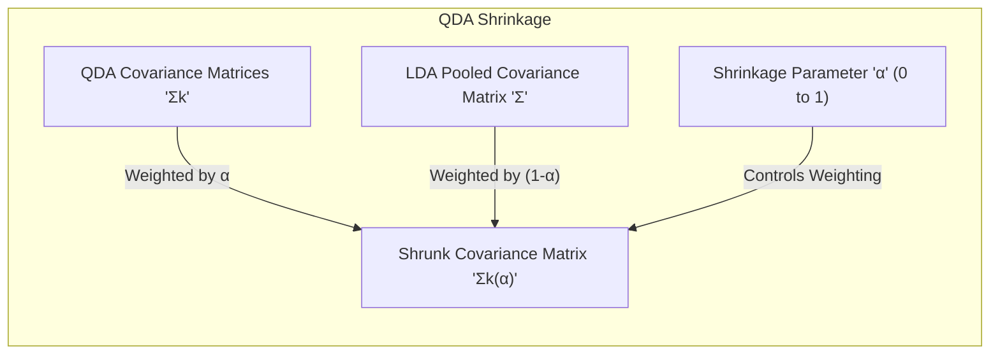
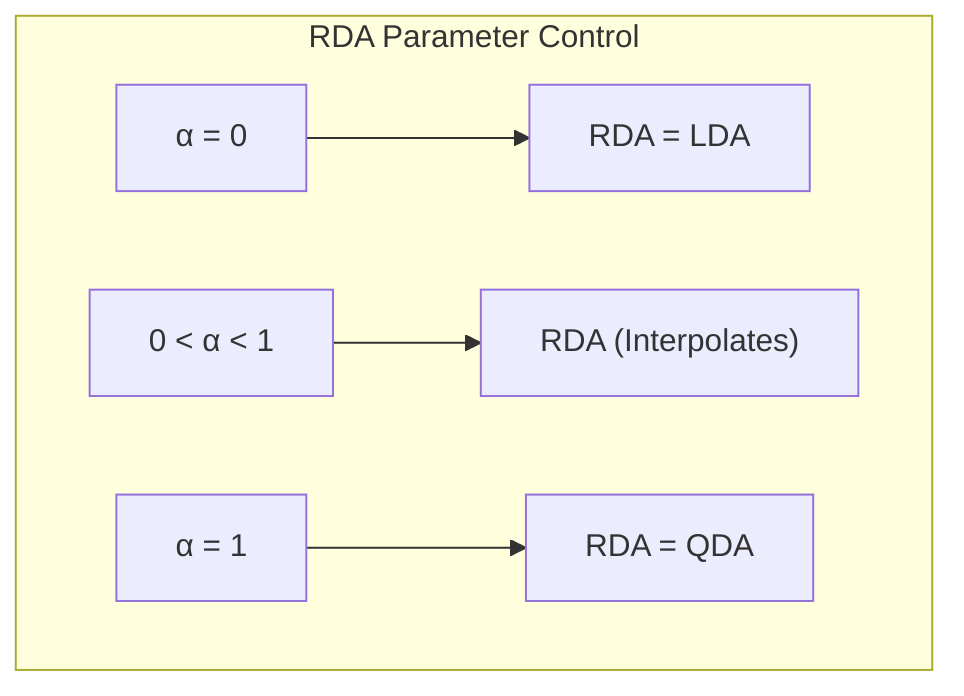
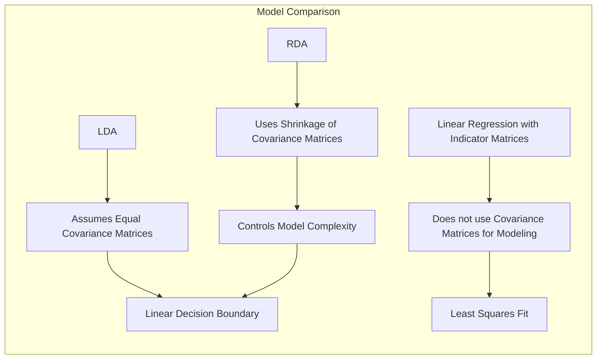
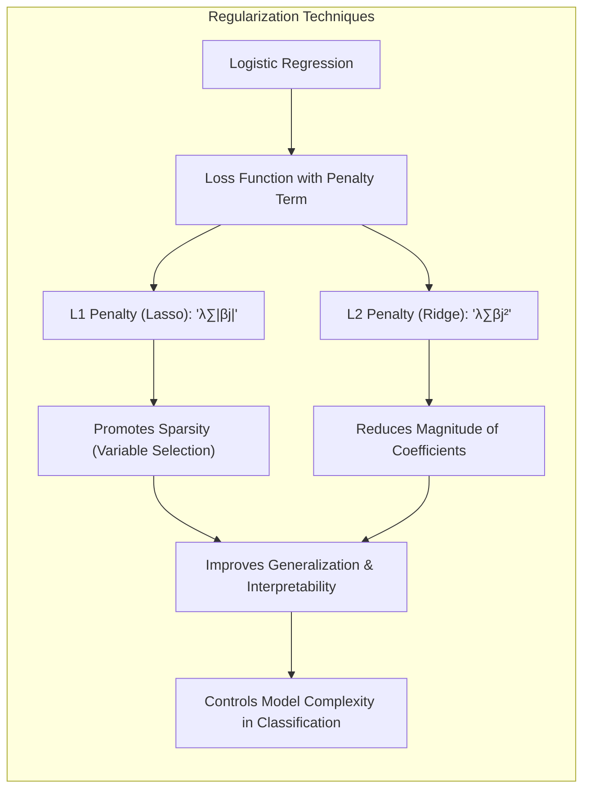
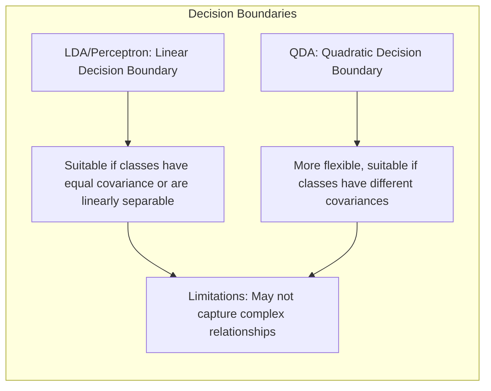
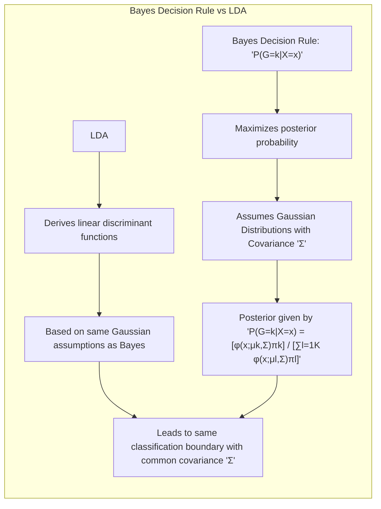

## Título Conciso: Regularização de Covariâncias no QDA: Shrinkage para o LDA e Implementação Prática

### Introdução

Este capítulo explora a técnica de **"shrinkage"** (encolhimento) aplicada às matrizes de covariância no **Quadratic Discriminant Analysis (QDA)**, com o objetivo de regularizar o modelo e aproximá-lo do **Linear Discriminant Analysis (LDA)**. Analisaremos como essa técnica, através da combinação das matrizes de covariância do QDA com a matriz de covariância conjunta do LDA, leva a modelos mais robustos e com melhor capacidade de generalização [^4.3.1]. Discutiremos como o parâmetro de "shrinkage" controla a proximidade entre o QDA e o LDA, e como esse parâmetro pode ser otimizado utilizando dados de validação. Compararemos essa abordagem com a **regressão linear com matrizes de indicadores**, que não utiliza estimativas de covariância para modelar a relação entre as classes [^4.2], e com a **regressão logística**, que utiliza a maximização da verossimilhança, mas que não tem parâmetros diretamente ligados às covariâncias [^4.4]. Abordaremos também a importância da **seleção de variáveis e regularização** para controlar a complexidade dos modelos [^4.4.4], [^4.5]. Exploraremos a conexão com o conceito de **hiperplanos separadores**, destacando as diferenças entre modelos com e sem a técnica de "shrinkage" [^4.5.2]. O objetivo deste capítulo é fornecer uma compreensão detalhada e prática de como o "shrinkage" de matrizes de covariância no QDA pode ser implementado e utilizado para aprimorar a classificação.

### Conceitos Fundamentais

**Conceito 1: O Conceito de "Shrinkage" de Covariâncias**

O **"shrinkage" de covariâncias** é uma técnica de regularização que busca reduzir a complexidade de modelos de classificação que utilizam matrizes de covariância, especialmente em cenários com um número de observações limitado ou em espaços de alta dimensionalidade. No QDA, essa técnica consiste em combinar as matrizes de covariância individuais de cada classe $\Sigma_k$ com a matriz de covariância conjunta do LDA $\Sigma$, utilizando um parâmetro de "shrinkage" $\alpha$, que varia de 0 a 1:

$$
\Sigma_k(\alpha) = \alpha \Sigma_k + (1 - \alpha) \Sigma
$$

onde $\Sigma_k(\alpha)$ é a matriz de covariância "shrinked" para a classe $k$. Quando $\alpha = 0$, o modelo se torna equivalente ao LDA, e quando $\alpha = 1$, o modelo se torna o QDA. Valores intermediários de $\alpha$ interpolam entre os dois modelos, fornecendo um espectro de regularização [^4.3.1].

> 💡 **Exemplo Numérico:**
>
> Suponha que temos duas classes, e para a classe 1, a matriz de covariância estimada $\Sigma_1$ é:
>
> $$
> \Sigma_1 = \begin{bmatrix} 2 & 0.5 \\ 0.5 & 1 \end{bmatrix}
> $$
>
> A matriz de covariância conjunta estimada pelo LDA, $\Sigma$, é:
>
> $$
> \Sigma = \begin{bmatrix} 1.5 & 0.2 \\ 0.2 & 0.8 \end{bmatrix}
> $$
>
> Se usarmos um valor de $\alpha = 0.6$, a matriz de covariância "shrinked" para a classe 1, $\Sigma_1(0.6)$, será:
>
> $$
> \Sigma_1(0.6) = 0.6 \begin{bmatrix} 2 & 0.5 \\ 0.5 & 1 \end{bmatrix} + (1 - 0.6) \begin{bmatrix} 1.5 & 0.2 \\ 0.2 & 0.8 \end{bmatrix}
> $$
>
> $$
> \Sigma_1(0.6) = \begin{bmatrix} 1.2 & 0.3 \\ 0.3 & 0.6 \end{bmatrix} + \begin{bmatrix} 0.6 & 0.08 \\ 0.08 & 0.32 \end{bmatrix}
> $$
>
> $$
> \Sigma_1(0.6) = \begin{bmatrix} 1.8 & 0.38 \\ 0.38 & 0.92 \end{bmatrix}
> $$
>
> Observe como a matriz resultante $\Sigma_1(0.6)$ é uma combinação das matrizes $\Sigma_1$ e $\Sigma$. Com $\alpha=0.6$, estamos dando mais peso à matriz de covariância da classe específica, mas ainda incorporando alguma informação da covariância conjunta, resultando em uma matriz mais regularizada. Se $\alpha=0$, teríamos $\Sigma_1(0) = \Sigma$, e se $\alpha=1$, teríamos $\Sigma_1(1) = \Sigma_1$.

**Lemma 1:** *A técnica de shrinkage de covariâncias introduz um viés no modelo com o objetivo de reduzir a sua variância, e o parâmetro $\alpha$ controla o nível de encolhimento das matrizes de covariância em direção à matriz de covariância conjunta.* A demonstração desse lema reside na natureza da operação de combinação das covariâncias.

**Conceito 2: Regularized Discriminant Analysis (RDA) e o Parâmetro de Shrinkage**

O **Regularized Discriminant Analysis (RDA)** utiliza a técnica de "shrinkage" das matrizes de covariância para criar um modelo que interpola entre o LDA e o QDA [^4.3.1]. Ao introduzir o parâmetro $\alpha$, o RDA pode controlar a proximidade do modelo ao LDA ( $\alpha = 0$) ou ao QDA ( $\alpha = 1$). Na prática, o valor de $\alpha$ é otimizado utilizando dados de validação, de forma a equilibrar o *trade-off* entre viés e variância.

Ao substituir a matriz de covariância $\Sigma_k$ do QDA por $\Sigma_k(\alpha)$, obtemos o RDA, onde a função discriminante é modificada, e o controle do parâmetro $\alpha$ é fundamental para a performance do modelo.

> 💡 **Exemplo Numérico:**
>
> Suponha que temos um problema de classificação com três classes, e as matrizes de covariância estimadas para cada classe são $\Sigma_1$, $\Sigma_2$ e $\Sigma_3$. A matriz de covariância conjunta estimada pelo LDA é $\Sigma$.
>
> Para um valor de $\alpha = 0.3$, as matrizes de covariância "shrinked" para cada classe seriam:
>
> $$
> \Sigma_1(0.3) = 0.3 \Sigma_1 + 0.7 \Sigma \\
> \Sigma_2(0.3) = 0.3 \Sigma_2 + 0.7 \Sigma \\
> \Sigma_3(0.3) = 0.3 \Sigma_3 + 0.7 \Sigma
> $$
>
> Se $\alpha$ fosse igual a 0, as três matrizes de covariância seriam iguais à matriz de covariância conjunta $\Sigma$, e o RDA seria equivalente ao LDA. Se $\alpha$ fosse igual a 1, as matrizes de covariância seriam as matrizes de covariância originais $\Sigma_1$, $\Sigma_2$ e $\Sigma_3$, e o RDA seria equivalente ao QDA.
>
> O valor ótimo de $\alpha$ é geralmente encontrado através de validação cruzada, buscando o valor que resulta no melhor desempenho de classificação em dados não vistos.

**Corolário 1:** *O parâmetro $\alpha$ no RDA permite controlar a complexidade do modelo, com $\alpha = 0$ resultando no LDA (modelo mais simples) e $\alpha = 1$ resultando no QDA (modelo mais flexível), e permite ajustar o modelo para obter o melhor desempenho em dados de validação.* Esse corolário destaca a importância de $\alpha$ como um parâmetro de regularização que define o trade-off viés-variância.

**Conceito 3: Implementação Prática da Validação e Otimização de $\alpha$**

Na prática, a escolha do valor adequado para $\alpha$ é feita utilizando dados de validação, ou através de técnicas como *cross-validation*. O objetivo é encontrar o valor de $\alpha$ que maximize o desempenho do modelo em dados que não foram utilizados no treinamento, procurando, assim, uma solução que garanta a generalização do modelo. A estimação do parâmetro $\alpha$ garante a melhor performance do modelo em novos dados, e faz com que a regularização tenha uma base empírica e não somente teórica [^4.3.1].

> 💡 **Exemplo Numérico:**
>
> Suponha que temos um conjunto de dados com 100 amostras, divididos em 70 para treinamento e 30 para validação.
>
> Queremos avaliar o desempenho do RDA com diferentes valores de $\alpha$. Podemos testar uma sequência de valores, por exemplo, $\alpha \in \{0, 0.1, 0.2, ..., 1\}$.
>
> Para cada valor de $\alpha$, treinamos o modelo RDA com os dados de treinamento e avaliamos o desempenho (por exemplo, a acurácia) nos dados de validação.
>
> Suponha que os resultados da validação cruzada foram os seguintes:
>
> | $\alpha$ | Acurácia na Validação |
> |---------|----------------------|
> | 0.0     | 0.82                 |
> | 0.1     | 0.85                 |
> | 0.2     | 0.87                 |
> | 0.3     | 0.89                 |
> | 0.4     | 0.90                 |
> | 0.5     | 0.91                 |
> | 0.6     | 0.90                 |
> | 0.7     | 0.88                 |
> | 0.8     | 0.86                 |
> | 0.9     | 0.84                 |
> | 1.0     | 0.80                 |
>
> Neste caso, o valor de $\alpha = 0.5$ resultou na maior acurácia nos dados de validação, sendo este o valor ótimo para o modelo.
>
> Este processo de otimização de $\alpha$ garante que o modelo seja ajustado para generalizar bem em dados não vistos.

> ⚠️ **Nota Importante**: A técnica de "shrinkage" de covariâncias no QDA permite a construção de modelos mais robustos e generalizáveis, e o parâmetro $\alpha$ pode ser otimizado usando dados de validação.

> ❗ **Ponto de Atenção**: A escolha do valor de $\alpha$ é crucial para o desempenho do modelo e deve ser feita cuidadosamente com base nos dados e no objetivo da análise.

> ✔️ **Destaque**: O RDA, ao utilizar o parâmetro de shrinkage, possibilita controlar a complexidade do modelo e obter um melhor trade-off entre viés e variância, em comparação com o LDA e o QDA.

### Regressão Linear e Mínimos Quadrados para Classificação

A **regressão linear com matrizes de indicadores**, ao contrário do LDA e do QDA (e do RDA), não modela diretamente as densidades condicionais das classes e não utiliza as matrizes de covariância para o ajuste do modelo [^4.2]. Na regressão linear, o ajuste dos parâmetros é feito minimizando a soma dos quadrados dos erros, e não há um mecanismo explícito para o controle da complexidade do modelo, como o shrinkage aplicado no QDA ou no RDA.

A falta de modelagem da matriz de covariância e da suposição gaussiana na regressão linear, limita sua capacidade de lidar com dados que apresentem uma estrutura mais complexa ou onde as suposições do LDA/QDA sejam mais adequadas. A regressão linear com matrizes de indicadores, portanto, é uma abordagem mais simples que, embora possa funcionar em certas situações, não é capaz de mitigar os problemas do *overfitting* e da falta de calibração probabilística como o RDA, que utiliza a estimação e a regularização das matrizes de covariância [^4.3.1].

A abordagem com a SVD no QDA (e no RDA) simplifica o cálculo das funções discriminantes e, com o uso do parâmetro $\alpha$ permite controlar a complexidade da fronteira de decisão, uma característica que não está presente na regressão linear com matrizes de indicadores [^4.3.2].

**Lemma 2:** *A regressão linear com matrizes de indicadores, ao contrário do RDA, não se beneficia da técnica de shrinkage de covariâncias para controlar a complexidade do modelo e para aproximar a matriz de covariância individual de cada classe à matriz de covariância comum.* A prova desse lema reside na forma de ajuste dos modelos e na ausência de utilização da matriz de covariância na regressão linear.

**Corolário 2:** *A utilização da técnica de shrinkage de covariâncias no RDA permite controlar o trade-off entre viés e variância na modelagem da fronteira de decisão, o que não é possível na regressão linear com matrizes de indicadores.* Essa característica do RDA demonstra a sua flexibilidade em comparação com a regressão linear.

A regressão linear com matrizes de indicadores, portanto, não possui um mecanismo para regularizar a estimação da variabilidade dos dados, como o QDA com shrinkage, e com isso, torna-se uma abordagem mais simples e menos adaptada para modelar as relações entre os dados e as classes, especialmente em dados que não atendam aos pressupostos dos modelos Gaussianos. O RDA, em contraste, por meio do shrinkage, permite regularizar a estimação das matrizes de covariância.

### Métodos de Seleção de Variáveis e Regularização em Classificação

A **seleção de variáveis** e a **regularização** desempenham um papel fundamental para melhorar a capacidade de generalização e a estabilidade dos modelos de classificação, incluindo aqueles que utilizam técnicas de "shrinkage" de covariâncias como no RDA. A regularização, ao adicionar um termo de penalidade à função de custo, busca restringir a magnitude dos coeficientes e evitar o *overfitting*.

Na **regressão logística**, a regularização é aplicada através da modificação da função de verossimilhança com a introdução de termos de penalidade:

$$
\max_{\beta_0, \beta} \left[ \sum_{i=1}^N \left( y_i (\beta_0 + \beta^T x_i) - \log(1 + e^{\beta_0 + \beta^T x_i}) \right) - \lambda P(\beta) \right]
$$

onde $P(\beta)$ é a penalidade e $\lambda$ é o parâmetro de regularização. A penalidade **L1** (Lasso), dada por $P(\beta) = \sum_{j=1}^p |\beta_j|$, promove a esparsidade dos coeficientes, selecionando as variáveis mais relevantes para a modelagem da probabilidade posterior e da densidade condicional, e a penalidade **L2** (Ridge) , dada por $P(\beta) = \sum_{j=1}^p \beta_j^2$, reduz a magnitude dos coeficientes e estabiliza o modelo [^4.4.4], [^4.5].

> 💡 **Exemplo Numérico:**
>
> Suponha que temos um modelo de regressão logística com 3 preditores ($x_1$, $x_2$, $x_3$) e queremos aplicar a regularização L1 (Lasso). A função de custo com a penalidade L1 é:
>
> $$
> \text{Custo}(\beta) = -\sum_{i=1}^N \left( y_i (\beta_0 + \beta_1 x_{i1} + \beta_2 x_{i2} + \beta_3 x_{i3}) - \log(1 + e^{\beta_0 + \beta_1 x_{i1} + \beta_2 x_{i2} + \beta_3 x_{i3}}) \right) + \lambda (|\beta_1| + |\beta_2| + |\beta_3|)
> $$
>
> Onde $\lambda$ é o parâmetro de regularização.
>
> Suponha que, sem regularização ($\lambda = 0$), os coeficientes estimados foram: $\beta_1 = 2.5$, $\beta_2 = -1.8$, $\beta_3 = 0.7$.
>
> Ao aplicar a regularização L1 com $\lambda = 0.5$, os coeficientes estimados podem se tornar, por exemplo: $\beta_1 = 1.5$, $\beta_2 = -0.8$, $\beta_3 = 0$.
>
> Observe como a penalidade L1 forçou $\beta_3$ a ser zero, efetivamente eliminando a variável $x_3$ do modelo. Isso promove a esparsidade e pode melhorar a interpretabilidade do modelo, além de reduzir o risco de overfitting.
>
> Se usássemos a regularização L2 (Ridge) com $\lambda = 0.5$, os coeficientes poderiam se tornar, por exemplo: $\beta_1 = 2.0$, $\beta_2 = -1.5$, $\beta_3 = 0.5$. A regularização L2 reduz a magnitude dos coeficientes, mas não os força a zero.

A aplicação da regularização também é relevante em modelos como o RDA, pois a escolha de um valor inadequado para o parâmetro $\alpha$ pode resultar em modelos subótimos. A combinação de técnicas de regularização com o ajuste do parâmetro $\alpha$ no RDA pode levar a um modelo com bom desempenho em termos de classificação e com boa interpretabilidade.

**Lemma 3:** *A regularização L1 na regressão logística, ao promover a esparsidade dos coeficientes, simplifica a forma da função discriminante e melhora a interpretabilidade do modelo, o que pode levar a uma melhor generalização dos resultados.* A demonstração desse lema está no efeito da penalidade L1 sobre a função de custo.

**Prova do Lemma 3:** A penalidade L1, que adiciona um termo que é proporcional ao módulo dos coeficientes na função de custo, força alguns coeficientes a se tornarem exatamente zero durante o processo de otimização, o que leva a uma representação mais esparsa dos dados e a um modelo mais simples [^4.4.3], [^4.4.4]. $\blacksquare$

**Corolário 3:** *A regularização, tanto L1 quanto L2, é uma ferramenta importante para a construção de modelos robustos em classificação, incluindo aqueles que utilizam técnicas como o shrinkage das matrizes de covariância, pois auxilia a reduzir o risco de overfitting e a melhorar a capacidade de generalização, além de tornar os modelos mais simples de interpretar.* Ao controlar a complexidade e a magnitude dos parâmetros, a regularização garante modelos com melhor desempenho e melhor capacidade de generalização.

> ⚠️ **Ponto Crucial**: A regularização desempenha um papel fundamental para a construção de modelos mais robustos e generalizáveis, e pode ser combinada com a técnica de shrinkage das covariâncias no QDA para controlar a complexidade dos modelos [^4.5].

### Separating Hyperplanes e Perceptrons

A busca por **hiperplanos separadores** é uma forma de tentar separar as classes com uma fronteira linear que maximize a margem, sendo utilizada em modelos como as máquinas de vetores de suporte (SVM). A obtenção dessa fronteira linear está diretamente ligada à suposição de distribuições com matrizes de covariância iguais, o que não é a regra no QDA [^4.5.2]. A aplicação de um hiperplano separador em problemas onde as classes possuem covariâncias muito distintas pode ser subótima, e é nesse contexto que o QDA se torna mais interessante.

O algoritmo do **Perceptron** é um método iterativo para encontrar um hiperplano separador, ajustando os parâmetros do modelo de forma sequencial com base nos erros de classificação [^4.5.1]. A busca por um hiperplano separador é um passo importante para se conectar a outros métodos lineares, embora o Perceptron, isoladamente, não utilize informações sobre covariância e não seja adequado quando os dados não são linearmente separáveis.

> 💡 **Exemplo Numérico:**
>
> Vamos considerar um exemplo simples em 2D com duas classes. A classe 1 tem as seguintes amostras: $(1, 1)$, $(2, 1)$, $(2, 2)$, e a classe 2 tem as amostras: $(3, 3)$, $(3, 4)$, $(4, 3)$.
>
> O algoritmo do Perceptron tenta encontrar um hiperplano (neste caso, uma linha) que separe as duas classes. A equação do hiperplano é dada por $\beta_0 + \beta_1 x_1 + \beta_2 x_2 = 0$.
>
> Inicializamos os pesos com valores aleatórios, por exemplo, $\beta_0 = 0$, $\beta_1 = 0.5$, $\beta_2 = -0.5$.
>
> Iteramos sobre as amostras de treinamento. Se uma amostra da classe 1 é classificada incorretamente (ou seja, $\beta_0 + \beta_1 x_1 + \beta_2 x_2 < 0$), atualizamos os pesos: $\beta_0 := \beta_0 + \eta$, $\beta_1 := \beta_1 + \eta x_1$, $\beta_2 := \beta_2 + \eta x_2$, onde $\eta$ é a taxa de aprendizagem (por exemplo, $\eta = 0.1$). Se uma amostra da classe 2 é classificada incorretamente (ou seja, $\beta_0 + \beta_1 x_1 + \beta_2 x_2 > 0$), atualizamos os pesos: $\beta_0 := \beta_0 - \eta$, $\beta_1 := \beta_1 - \eta x_1$, $\beta_2 := \beta_2 - \eta x_2$.
>
> Após várias iterações, o Perceptron pode convergir para um hiperplano separador, por exemplo, a linha $\beta_0 = -3$, $\beta_1 = 1$, $\beta_2 = 1$, que corresponde à equação $-3 + x_1 + x_2 = 0$ ou $x_2 = -x_1 + 3$.
>
> É importante notar que, se as classes não são linearmente separáveis, o Perceptron não irá convergir para uma solução.

As fronteiras de decisão lineares, derivadas de modelos como o LDA, contrastam com as fronteiras de decisão quadráticas, geradas pelo QDA, e destacam a importância de escolher o modelo adequado para a estrutura dos dados. A aplicação do Perceptron e a busca por hiperplanos separadores podem se mostrar limitadas em problemas onde as classes apresentam estruturas de covariância diferentes e onde a suposição de separabilidade linear não se verifica [^4.5.1].

**Teorema:** *O algoritmo do Perceptron converge para um hiperplano separador em um número finito de iterações se, e somente se, os dados são linearmente separáveis, e essa convergência pode ser lenta se a margem de separação for pequena.* Este teorema ressalta a importância da separabilidade linear para a convergência do Perceptron, e reforça que o método não é adequado para problemas com fronteiras de decisão complexas e não lineares [^4.5.1].

### Pergunta Teórica Avançada: Quais as diferenças fundamentais entre a formulação de LDA e a Regra de Decisão Bayesiana considerando distribuições Gaussianas com covariâncias iguais?

**Resposta:**

A **Regra de Decisão Bayesiana** busca classificar uma observação $x$ na classe $k$ que maximize a probabilidade posterior $P(G=k|X=x)$ [^4.3]. Sob a suposição de distribuições Gaussianas com a mesma matriz de covariância $\Sigma$, a probabilidade posterior é dada por:

$$
P(G=k|X=x) = \frac{ \phi(x;\mu_k,\Sigma)\pi_k}{\sum_{l=1}^K \phi(x;\mu_l,\Sigma)\pi_l}
$$

onde $\phi(x;\mu_k,\Sigma)$ é a função densidade gaussiana para a classe $k$, $\mu_k$ é a média da classe $k$ e $\pi_k$ é a probabilidade a priori da classe $k$. O **LDA** deriva suas funções discriminantes lineares a partir dessas mesmas premissas, buscando uma solução linear que separe as classes de forma eficaz e eficiente [^4.3].

> 💡 **Exemplo Numérico:**
>
> Suponha que temos duas classes com distribuições Gaussianas, cada uma com média $\mu_k$ e a mesma matriz de covariância $\Sigma$.
>
> Classe 1: $\mu_1 = [1, 1]^T$, Classe 2: $\mu_2 = [3, 3]^T$.
>
> A matriz de covariância conjunta é: $\Sigma = \begin{bmatrix} 1 & 0.5 \\ 0.5 & 1 \end{bmatrix}$.
>
> As probabilidades a priori são: $\pi_1 = 0.4$ e $\pi_2 = 0.6$.
>
> Para classificar uma amostra $x = [2, 2]^T$, calculamos as densidades Gaussianas para cada classe:
>
> $\phi(x;\mu_1,\Sigma) = \frac{1}{(2\pi)^{p/2}|\Sigma|^{1/2}} \exp(-\frac{1}{2}(x-\mu_1)^T \Sigma^{-1}(x-\mu_1))$, onde $p$ é a dimensão.
>
> $\phi(x;\mu_1,\Sigma) \approx 0.098$
>
> $\phi(x;\mu_2,\Sigma) \approx 0.098$
>
> Calculamos a probabilidade posterior para cada classe:
>
> $P(G=1|X=x) = \frac{ \phi(x;\mu_1,\Sigma)\pi_1}{\phi(x;\mu_1,\Sigma)\pi_1 + \phi(x;\mu_2,\Sigma)\pi_2} = \frac{0.098 \times 0.4}{0.098 \times 0.4 + 0.098 \times 0.6} = 0.4$
>
> $P(G=2|X=x) = \frac{ \phi(x;\mu_2,\Sigma)\pi_2}{\phi(x;\mu_1,\Sigma)\pi_1 + \phi(x;\mu_2,\Sigma)\pi_2} = \frac{0.098 \times 0.6}{0.098 \times 0.4 + 0.098 \times 0.6} = 0.6$
>
> Como $P(G=2|X=x) > P(G=1|X=x)$, a amostra $x$ é classificada como pertencente à classe 2.
>
> O LDA, por sua vez, derivaria uma função discriminante linear que levaria à mesma decisão de classificação sob essas premissas.

**Lemma 4:** *Sob a suposição de que as classes seguem distribuições Gaussianas com a mesma matriz de covariância, a regra de decisão Bayesiana e o LDA são equivalentes, ou seja, levam à mesma fronteira de decisão linear e à mesma regra de decisão baseada na função discriminante.* A equivalência é demonstrada pela manipulação algébrica, que mostra como o log-ratio das probabilidades posteriores leva à mesma função discriminante do LDA [^4.3].

**Corolário 4:** *Quando a restrição de igualdade de covariâncias é relaxada, a regra de decisão Bayesiana leva ao QDA (Quadratic Discriminant Analysis), que gera fronteiras de decisão quadráticas, ao contrário da regra de decisão linear do LDA.* Esta diferença destaca como a escolha das suposições impacta a complexidade do modelo e da fronteira de decisão. [^4.3.1], [^4.3.3]

> ⚠️ **Ponto Crucial**: A principal diferença entre LDA e a regra de decisão Bayesiana reside na imposição da igualdade de covariâncias. Quando esta suposição é válida, ambos os métodos levam à mesma decisão de classificação, utilizando uma fronteira linear, e a mesma direção do hiperplano [^4.3].

### Conclusão

Neste capítulo, exploramos o conceito de shrinkage de matrizes de covariância no QDA, mostrando como essa técnica de regularização busca melhorar a estabilidade e a generalização do modelo ao aproximá-lo do LDA. Analisamos como essa técnica utiliza um parâmetro de shrinkage para controlar o trade-off entre viés e variância. Discutimos como a regressão linear com matrizes de indicadores não se beneficia da técnica de shrinkage e as limitações de sua abordagem. Exploramos também como a seleção de variáveis e a regularização são importantes para o controle da complexidade dos modelos. Ao longo deste capítulo, procuramos fornecer uma compreensão aprofundada e prática de como o uso de modelos que considerem a estrutura das covariâncias e a regularização podem levar a classificadores lineares mais eficientes e eficazes.

### Footnotes

[^4.1]: *In this chapter we revisit the classification problem and focus on linear methods for classification...There are several different ways in which linear decision boundaries can be found.*

[^4.2]: *In Chapter 2 we fit linear regression models to the class indicator variables, and classify to the largest fit...Linear inequalities in this space are quadratic inequalities in the original space.*

[^4.3]: *Decision theory for classification (Section 2.4) tells us that we need to know the class posteriors Pr(G|X) for optimal classification. Suppose fk(x) is the class-conditional density of X in class G = k, and let πκ be the prior probability of class k... Linear discriminant analysis (LDA) arises in the special case when we assume that the classes have a common covariance matrix Σk = Σ.*

[^4.3.1]: *The decision boundary between each pair of classes k and l is described by a quadratic equation {x: δκ(x) = δ(x)}.*

[^4.3.2]: *The estimates for QDA are similar to those for LDA, except that separate covariance matrices must be estimated for each class...Their computations are simplified by diagonalizing ∑ or Ék.*

[^4.3.3]: *In the special case when we assume that the classes have a common covariance matrix...When the classes are really Gaussian, then LDA is optimal*

[^4.4]: *The logistic regression model arises from the desire to model the posterior probabilities of the K classes via linear functions in x, while at the same time ensuring that they sum to one and remain in [0,1].*

[^4.4.1]: *Logistic regression models are usually fit by maximum likelihood... The logistic regression model is more general, in that it makes less assumptions.*

[^4.4.2]: *It is convenient to code the two-class gi via a 0/1 response Yi, where yi = 1 when gi = 1, and yi = 0 when gi = 2... Typically many models are fit in a search for a parsimonious model involving a subset of the variables.*

[^4.4.3]: *To maximize the log-likelihood, we set its derivatives to zero. These score equations are...To solve the score equations (4.21), we use the Newton-Raphson algorithm...*

[^4.4.4]: *The L1 penalty used in the lasso (Section 3.4.2) can be used for variable selection and shrinkage with any linear regression model...As with the lasso, we typically do not penalize the intercept term.*

[^4.5]: *Here we present an analysis of binary data to illustrate the traditional statistical use of the logistic regression model... With two classes there is a simple correspondence between linear discriminant analysis and classification by linear least squares, as in (4.5).*

[^4.5.1]: *The perceptron learning algorithm tries to find a separating hyperplane by minimizing the distance of misclassified points to the decision boundary.*

[^4.5.2]: *The optimal separating hyperplane separates the two classes and maximizes the distance to the closest point from either class... In light of (4.40), the constraints define an empty slab or margin around the linear decision boundary...*
