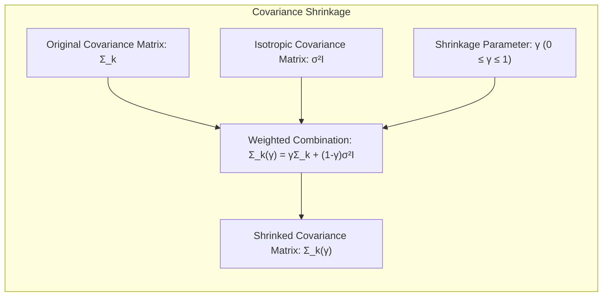
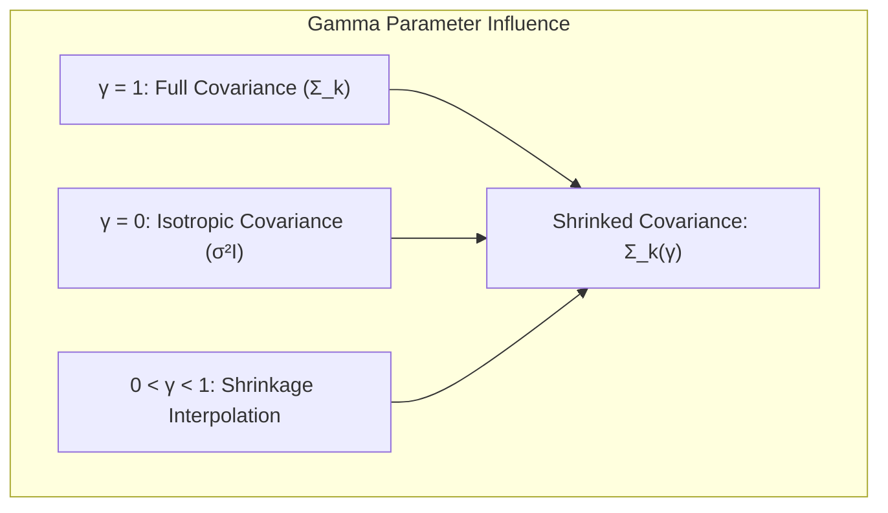
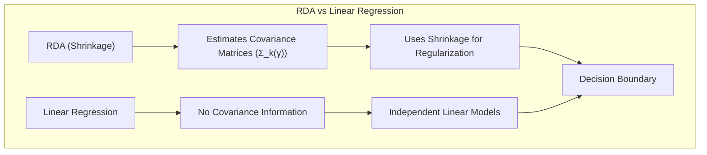
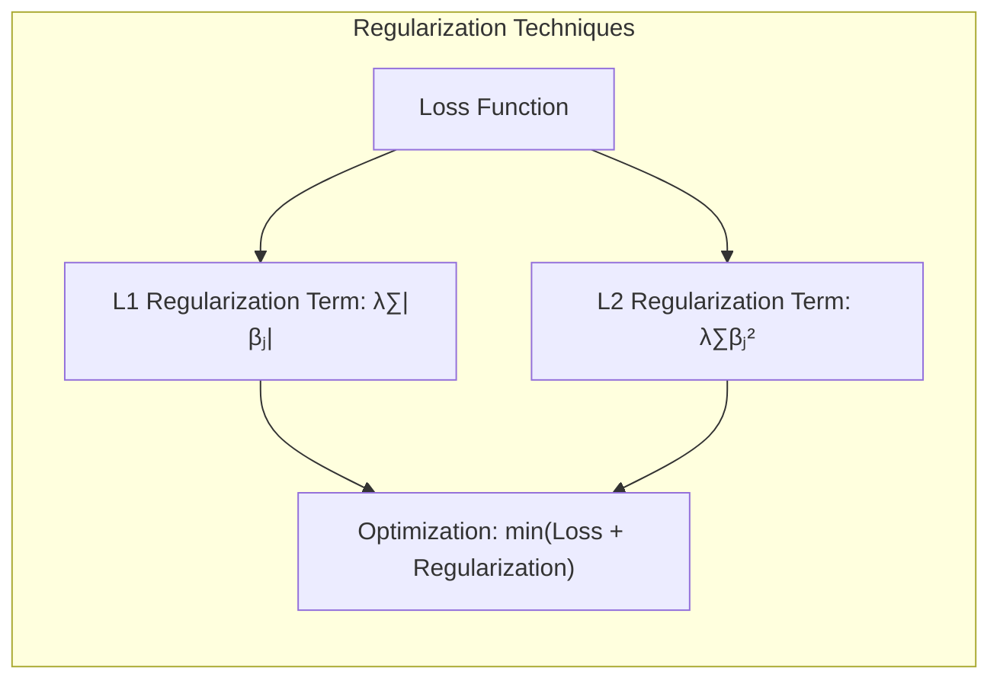
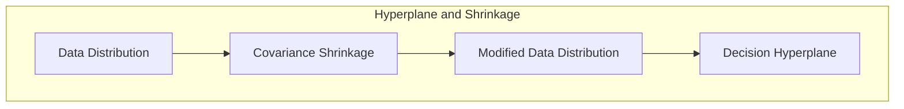
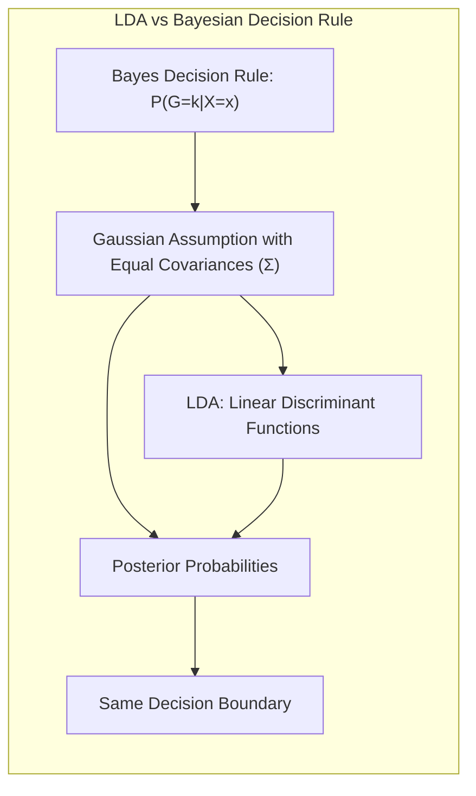

## Classificação Linear e a Regularização de Covariâncias: Shrinkage em Direção a uma Covariância Isótropa



### Introdução

Este capítulo explora uma forma específica de regularização de matrizes de covariância, onde o objetivo é "encolher" (shrink) as matrizes de covariância em direção a uma matriz de covariância **escalar isótropa**, ou seja, uma matriz que é proporcional à matriz identidade [^4.3.1]. Analisaremos como essa técnica pode ser utilizada para controlar a complexidade de modelos de classificação, e como ela se relaciona com o **Linear Discriminant Analysis (LDA)** e o **Quadratic Discriminant Analysis (QDA)**. Discutiremos como essa forma específica de regularização pode melhorar a estabilidade dos modelos e evitar o *overfitting*. Compararemos essa abordagem com a **regressão linear com matrizes de indicadores**, que não utiliza informações sobre as matrizes de covariância [^4.2], e com a **regressão logística**, que modela as probabilidades posteriores, mas não impõe restrições sobre a matriz de covariância [^4.4]. Analisaremos também o uso de **seleção de variáveis e regularização** em conjunto com a técnica de *shrinkage* [^4.4.4], [^4.5]. O conceito de **hiperplanos separadores** também será abordado no contexto da regularização de covariâncias [^4.5.2]. O objetivo deste capítulo é fornecer uma visão aprofundada e detalhada de como a regularização de covariâncias em direção a uma forma escalar isótropa pode ser utilizada para a construção de modelos de classificação mais robustos e eficientes.

### Conceitos Fundamentais

**Conceito 1:  Shrinkage em Direção a uma Covariância Escalar Isótropa**

A técnica de "shrinkage" das matrizes de covariância, discutida no capítulo anterior, pode ser generalizada para "encolher" as matrizes de covariância em direção a uma matriz escalar isótropa, dada por $\sigma^2 I$, onde $\sigma^2$ é um escalar e $I$ é a matriz identidade. Essa abordagem impõe uma forma particular para a matriz de covariância, restringindo a sua estrutura e reduzindo o número de parâmetros a serem estimados. A matriz de covariância *shrinked*, para cada classe $k$, é dada por:

$$
\Sigma_k(\gamma) = \gamma \Sigma_k + (1-\gamma) \sigma^2 I
$$

onde $\Sigma_k$ é a matriz de covariância da classe $k$, $\sigma^2$ é o parâmetro de regularização, e $\gamma$ é o parâmetro de *shrinkage* que controla o peso entre a matriz de covariância original e a matriz escalar isótropa, e varia entre 0 e 1 [^4.3.1]. Essa abordagem pode ser vista como uma forma de "regularizar" ou "suavizar" as matrizes de covariância, tornando-as mais estáveis e menos sujeitas ao *overfitting*.

> 💡 **Exemplo Numérico:**
>
> Suponha que temos duas classes, e para a classe 1, a matriz de covariância estimada $\Sigma_1$ é:
>
> $$
> \Sigma_1 = \begin{bmatrix}
> 2.5 & 1.2 \\
> 1.2 & 3.1
> \end{bmatrix}
> $$
>
> e o parâmetro de regularização $\sigma^2 = 2$. Se escolhermos um valor de $\gamma = 0.6$, a matriz de covariância *shrinked* $\Sigma_1(\gamma)$ será:
>
> Primeiro, calculamos a matriz escalar isótropa:
>
> $$
> \sigma^2 I = 2 \begin{bmatrix}
> 1 & 0 \\
> 0 & 1
> \end{bmatrix} = \begin{bmatrix}
> 2 & 0 \\
> 0 & 2
> \end{bmatrix}
> $$
>
> Agora, aplicamos a fórmula de *shrinkage*:
>
> $$
> \Sigma_1(0.6) = 0.6 \begin{bmatrix}
> 2.5 & 1.2 \\
> 1.2 & 3.1
> \end{bmatrix} + (1-0.6) \begin{bmatrix}
> 2 & 0 \\
> 0 & 2
> \end{bmatrix}
> $$
>
> $$
> \Sigma_1(0.6) = \begin{bmatrix}
> 1.5 & 0.72 \\
> 0.72 & 1.86
> \end{bmatrix} + \begin{bmatrix}
> 0.8 & 0 \\
> 0 & 0.8
> \end{bmatrix}
> $$
>
> $$
> \Sigma_1(0.6) = \begin{bmatrix}
> 2.3 & 0.72 \\
> 0.72 & 2.66
> \end{bmatrix}
> $$
>
> A matriz de covariância resultante $\Sigma_1(0.6)$ é uma combinação da matriz de covariância original e da matriz escalar isótropa. Observe que os elementos fora da diagonal foram reduzidos, e os elementos diagonais foram "encolhidos" em direção ao valor de $\sigma^2$. O efeito do *shrinkage* é tornar a matriz de covariância mais próxima de uma matriz escalar isótropa, o que pode melhorar a estabilidade do modelo.

**Lemma 1:** *A técnica de shrinkage de covariâncias em direção a uma matriz escalar isótropa busca restringir a forma da matriz de covariância, o que simplifica o modelo e melhora a sua estabilidade e capacidade de generalização, e o parâmetro $\gamma$ controla o grau de regularização.*

**Conceito 2:  Regularização com Covariâncias Escalares e o Parâmetro γ**

A regularização em direção a uma matriz de covariância escalar isótropa é feita através do parâmetro $\gamma$, que varia entre 0 e 1. Quando $\gamma = 1$, o modelo utiliza a matriz de covariância original $\Sigma_k$, e quando $\gamma = 0$, a matriz de covariância utilizada é $\sigma^2 I$. Valores intermediários de $\gamma$ interpolam entre os dois extremos, permitindo que o modelo se aproxime da suposição de covariâncias esféricas. A escolha do valor adequado para $\gamma$ é feita, na prática, utilizando técnicas de validação ou cross-validation. Essa regularização visa a obtenção de estimativas das covariâncias mais estáveis, através da redução da variância da estimativa e melhorando a capacidade de generalização do modelo.



> 💡 **Exemplo Numérico:**
>
> Considere um problema de classificação com duas classes e duas características. Suponha que, após estimar as matrizes de covariância, obtemos:
>
> $\Sigma_1 = \begin{bmatrix} 3 & 1 \\ 1 & 2 \end{bmatrix}$ para a classe 1, e $\Sigma_2 = \begin{bmatrix} 4 & -1 \\ -1 & 5 \end{bmatrix}$ para a classe 2.  
>
> Vamos regularizar essas matrizes usando $\sigma^2 = 3$ e diferentes valores de $\gamma$.
>
> **Caso 1: γ = 1 (Sem regularização)**
>
> $\Sigma_1(\gamma=1) = \Sigma_1 = \begin{bmatrix} 3 & 1 \\ 1 & 2 \end{bmatrix}$
>
> $\Sigma_2(\gamma=1) = \Sigma_2 = \begin{bmatrix} 4 & -1 \\ -1 & 5 \end{bmatrix}$
>
> **Caso 2: γ = 0.5 (Regularização intermediária)**
>
> $\Sigma_1(\gamma=0.5) = 0.5 \begin{bmatrix} 3 & 1 \\ 1 & 2 \end{bmatrix} + 0.5 \begin{bmatrix} 3 & 0 \\ 0 & 3 \end{bmatrix} = \begin{bmatrix} 3 & 0.5 \\ 0.5 & 2.5 \end{bmatrix}$
>
> $\Sigma_2(\gamma=0.5) = 0.5 \begin{bmatrix} 4 & -1 \\ -1 & 5 \end{bmatrix} + 0.5 \begin{bmatrix} 3 & 0 \\ 0 & 3 \end{bmatrix} = \begin{bmatrix} 3.5 & -0.5 \\ -0.5 & 4 \end{bmatrix}$
>
> **Caso 3: γ = 0 (Regularização máxima)**
>
> $\Sigma_1(\gamma=0) = 0 \begin{bmatrix} 3 & 1 \\ 1 & 2 \end{bmatrix} + 1 \begin{bmatrix} 3 & 0 \\ 0 & 3 \end{bmatrix} = \begin{bmatrix} 3 & 0 \\ 0 & 3 \end{bmatrix}$
>
> $\Sigma_2(\gamma=0) = 0 \begin{bmatrix} 4 & -1 \\ -1 & 5 \end{bmatrix} + 1 \begin{bmatrix} 3 & 0 \\ 0 & 3 \end{bmatrix} = \begin{bmatrix} 3 & 0 \\ 0 & 3 \end{bmatrix}$
>
> Observe como, ao diminuir o valor de $\gamma$, as matrizes de covariância se tornam mais próximas da matriz escalar isótropa $\sigma^2 I$. Quando $\gamma=0$, ambas as matrizes são iguais a $\sigma^2 I$, o que corresponde à suposição de covariâncias esféricas. A escolha do valor ideal de $\gamma$ dependerá da validação cruzada, buscando o melhor desempenho de generalização do modelo.

**Corolário 1:** *O parâmetro $\gamma$ controla a proximidade do modelo de classificação à suposição de covariância escalar isótropa, o que impacta a forma da fronteira de decisão e a estabilidade da solução.*

**Conceito 3: Implicações Práticas do Uso da Covariância Isótropa**

A utilização de uma matriz de covariância escalar isótropa impõe uma forma específica para a distribuição dos dados, restringindo a variabilidade e a correlação entre as variáveis. Em alguns casos, essa restrição pode ser adequada, especialmente quando a quantidade de dados é limitada ou o número de variáveis é muito grande.  Essa forma de regularização, que simplifica a estrutura da covariância, também pode tornar os modelos menos suscetíveis ao *overfitting*. O uso de uma matriz escalar isótropa, portanto, é uma simplificação adicional da modelagem que pode ser útil para melhorar o desempenho de modelos lineares em determinados cenários.

> ⚠️ **Nota Importante**: A regularização de covariâncias em direção a uma matriz escalar isótropa simplifica o modelo, mas pode levar a perda de informações sobre a estrutura de covariâncias dos dados.

> ❗ **Ponto de Atenção**: Em situações onde as classes apresentam estruturas de covariância muito distintas, a utilização de uma matriz escalar isótropa pode não ser adequada.

> ✔️ **Destaque**: A regularização de covariâncias em direção a uma matriz escalar isótropa é uma forma de controle da complexidade, e promove modelos mais estáveis e com menor risco de overfitting.

### Regressão Linear e Mínimos Quadrados para Classificação



A **regressão linear com matrizes de indicadores**, ao contrário do LDA, QDA ou RDA, não utiliza informações sobre a matriz de covariância dos dados no processo de ajuste [^4.2]. O objetivo da regressão linear com matriz de indicadores é encontrar os coeficientes $\beta_{k0}$ e $\beta_k$ que minimizem a soma dos erros quadrados para cada classe $k$, sem impor quaisquer restrições sobre a estrutura da variabilidade dos dados. A regressão linear ajusta cada função linear de forma independente, sem se utilizar de nenhuma informação sobre como os dados se distribuem, ou sobre as suas relações através das covariâncias.

Essa ausência de modelagem da estrutura de covariância faz com que a regressão linear seja mais flexível, mas também mais suscetível a problemas como o *overfitting* e o "masking", especialmente em situações onde o número de variáveis ou de classes é muito grande. A regressão linear com matrizes de indicadores, portanto, contrasta com abordagens como o LDA, QDA e RDA, que buscam modelar a estrutura de variabilidade dos dados por meio das matrizes de covariância, mesmo que com diferentes restrições. A regularização com shrinkage para uma covariância escalar isótropa é uma forma de restringir a forma da covariância, o que está ausente da regressão linear [^4.3.1].

> 💡 **Exemplo Numérico:**
>
> Suponha que temos um problema de classificação com duas classes (0 e 1) e duas variáveis preditoras ($x_1$ e $x_2$).  Temos os seguintes dados:
>
> | $x_1$ | $x_2$ | Classe |
> |-------|-------|--------|
> | 1     | 2     | 0      |
> | 1.5   | 1.8   | 0      |
> | 2     | 2.5   | 0      |
> | 3     | 4     | 1      |
> | 3.5   | 4.2   | 1      |
> | 4     | 3.8   | 1      |
>
> Para a regressão linear com matrizes de indicadores, criaríamos uma matriz de indicadores $Y$, onde a coluna correspondente à classe 0 teria 1 para as amostras da classe 0 e 0 caso contrário, e a coluna correspondente à classe 1 teria 1 para as amostras da classe 1 e 0 caso contrário.  A regressão linear ajustaria um modelo para cada coluna de $Y$ usando as variáveis preditoras.
>
> Em Python, usando `sklearn`:
>
> ```python
> import numpy as np
> from sklearn.linear_model import LinearRegression
>
> X = np.array([[1, 2], [1.5, 1.8], [2, 2.5], [3, 4], [3.5, 4.2], [4, 3.8]])
> y = np.array([0, 0, 0, 1, 1, 1])
>
> # Criar matriz de indicadores
> Y = np.zeros((len(y), 2))
> Y[np.arange(len(y)), y] = 1
>
> # Ajustar modelos de regressão linear para cada classe
> models = []
> for k in range(2):
>     model = LinearRegression()
>     model.fit(X, Y[:, k])
>     models.append(model)
>
> # Imprimir os coeficientes
> for k, model in enumerate(models):
>     print(f"Classe {k}: Intercept = {model.intercept_:.2f}, Coefficients = {model.coef_}")
> ```
>
> Este código ajusta um modelo de regressão linear para cada classe, usando as variáveis preditoras $x_1$ e $x_2$.  Observe que não há nenhuma informação sobre as covariâncias das classes sendo usada no ajuste, e cada modelo é ajustado de forma independente dos demais.

**Lemma 2:** *A regressão linear com matrizes de indicadores não utiliza informações sobre a matriz de covariância dos dados, o que a distingue de modelos como o LDA, QDA e RDA, e, em consequência, não se beneficia da técnica de shrinkage de covariâncias em direção a uma matriz escalar isótropa.*

**Corolário 2:** *Enquanto o RDA utiliza a técnica de shrinkage de covariâncias para melhorar a estabilidade e a capacidade de generalização do modelo, aproximando as covariâncias das classes de uma forma mais simples, a regressão linear com matrizes de indicadores não possui nenhum mecanismo para controlar a variabilidade das estimativas e o overfitting através da forma da covariância.*

A regressão linear com matrizes de indicadores, portanto, ao não modelar diretamente a estrutura de covariância dos dados, se distingue dos modelos que utilizam essa informação para construir fronteiras de decisão mais estáveis e generalizáveis.  O uso do shrinkage em direção a uma matriz escalar isótropa é uma forma de controle da complexidade e da variabilidade dos modelos, que está ausente da regressão linear com matrizes de indicadores [^4.3.1].

### Métodos de Seleção de Variáveis e Regularização em Classificação



A **seleção de variáveis** e a **regularização** são técnicas essenciais para controlar a complexidade dos modelos de classificação e melhorar a estabilidade da estimativa dos parâmetros, mesmo quando modelos mais complexos são utilizados, como no QDA com shrinkage para uma matriz escalar isótropa [^4.5].

Na **regressão logística**, a regularização pode ser implementada através da adição de um termo de penalidade à função de custo:

$$
\max_{\beta_0, \beta} \left[ \sum_{i=1}^N \left( y_i (\beta_0 + \beta^T x_i) - \log(1 + e^{\beta_0 + \beta^T x_i}) \right) - \lambda P(\beta) \right]
$$

onde $P(\beta)$ é o termo de penalidade e $\lambda$ é o parâmetro de regularização. A penalidade **L1** (Lasso) é dada por $P(\beta) = \sum_{j=1}^p |\beta_j|$, que promove a esparsidade nos coeficientes e seleciona as variáveis mais relevantes para a modelagem da probabilidade posterior [^4.4.4]. A penalidade **L2** (Ridge) é dada por $P(\beta) = \sum_{j=1}^p \beta_j^2$, que reduz a magnitude dos coeficientes e estabiliza o modelo [^4.5].

> 💡 **Exemplo Numérico:**
>
> Vamos ilustrar a regularização L1 (Lasso) e L2 (Ridge) em um modelo de regressão logística. Suponha que temos um conjunto de dados com 5 variáveis preditoras e uma variável de resposta binária (0 ou 1).
>
> Usando `sklearn`:
>
> ```python
> import numpy as np
> from sklearn.linear_model import LogisticRegression
> from sklearn.preprocessing import StandardScaler
> from sklearn.model_selection import train_test_split
>
> # Gerar dados sintéticos
> np.random.seed(42)
> X = np.random.rand(100, 5)
> y = np.random.randint(0, 2, 100)
>
> # Dividir os dados em treino e teste
> X_train, X_test, y_train, y_test = train_test_split(X, y, test_size=0.3, random_state=42)
>
> # Padronizar os dados
> scaler = StandardScaler()
> X_train_scaled = scaler.fit_transform(X_train)
> X_test_scaled = scaler.transform(X_test)
>
> # Ajustar regressão logística sem regularização
> logreg_none = LogisticRegression(penalty=None, solver='lbfgs', max_iter=1000)
> logreg_none.fit(X_train_scaled, y_train)
>
> # Ajustar regressão logística com regularização L1 (Lasso)
> logreg_l1 = LogisticRegression(penalty='l1', solver='liblinear', C=0.5, random_state=42)
> logreg_l1.fit(X_train_scaled, y_train)
>
> # Ajustar regressão logística com regularização L2 (Ridge)
> logreg_l2 = LogisticRegression(penalty='l2', solver='lbfgs', C=0.5, random_state=42, max_iter=1000)
> logreg_l2.fit(X_train_scaled, y_train)
>
> # Imprimir os coeficientes
> print("Regressão Logística (Sem Regularização):", logreg_none.coef_)
> print("Regressão Logística (L1 - Lasso):", logreg_l1.coef_)
> print("Regressão Logística (L2 - Ridge):", logreg_l2.coef_)
> ```
>
> Observe como a regularização L1 (Lasso) tende a zerar alguns dos coeficientes, realizando seleção de variáveis, enquanto a regularização L2 (Ridge) reduz a magnitude de todos os coeficientes. O parâmetro `C` controla a força da regularização (valores menores de `C` correspondem a maior regularização).  A escolha do tipo de regularização e do valor do parâmetro de regularização depende do problema em questão, e pode ser feita através de validação cruzada, buscando o melhor desempenho de generalização.

A aplicação da regularização não é restrita a modelos como a regressão logística, e pode ser utilizada, embora com algumas adaptações, em modelos como o QDA com shrinkage, a fim de controlar a complexidade do modelo e melhorar a sua capacidade de generalização.

**Lemma 3:** *A regularização L1, ao promover a esparsidade, leva à criação de modelos mais simples e com menor custo computacional, o que é particularmente útil em modelos complexos de classificação, como aqueles que envolvem estimativas de covariâncias e uso da técnica de shrinkage.*

**Prova do Lemma 3:**  A penalidade L1, ao adicionar um termo linear (em módulo) na função de custo, força alguns dos coeficientes a se tornarem zero durante o processo de otimização.  Essa esparsidade leva a modelos mais simples, mais interpretáveis, e que são menos suscetíveis ao *overfitting*, além de impactar o custo computacional [^4.4.3], [^4.4.4].  $\blacksquare$

**Corolário 3:** *A regularização, tanto L1 quanto L2, auxilia no controle da complexidade do modelo e melhora a estimativa dos parâmetros, e com isso, torna o modelo mais robusto e menos suscetível a overfitting, mesmo quando se utilizam modelos que empregam técnicas como o shrinkage em direção a matrizes escalares isótropas*.

> ⚠️ **Ponto Crucial**: A regularização, seja L1 ou L2, é um mecanismo fundamental para controlar a complexidade dos modelos de classificação e melhorar a sua capacidade de generalização, mesmo quando se utilizam técnicas como o shrinkage das matrizes de covariância [^4.5].

### Separating Hyperplanes e Perceptrons



A busca por **hiperplanos separadores** visa encontrar uma fronteira linear que maximize a separação entre as classes, com o objetivo de construir modelos que sejam robustos e com boa capacidade de generalização [^4.5.2]. A utilização de técnicas de shrinkage nas matrizes de covariância pode impactar na forma e na localização dos hiperplanos separadores.

O algoritmo do **Perceptron** busca um hiperplano separador ajustando iterativamente os parâmetros do modelo com base nas amostras classificadas incorretamente [^4.5.1]. O Perceptron, embora seja uma abordagem mais simples, pode ser visto como um método para encontrar um hiperplano que minimize os erros de classificação, e esse hiperplano pode não ser o ideal, especialmente quando as classes apresentam estruturas de covariância complexas ou com pouca separabilidade linear.

> 💡 **Exemplo Numérico:**
>
> Vamos demonstrar o funcionamento do algoritmo do Perceptron com um exemplo simples. Considere os seguintes dados bidimensionais de duas classes:
>
> Classe 1: (1, 2), (1.5, 1.8), (2, 2.5)
>
> Classe 2: (3, 4), (3.5, 4.2), (4, 3.8)
>
> Inicializamos um vetor de pesos $w = [0.1, 0.1]$ e um bias $b = 0.1$.
>
> O algoritmo do Perceptron atualiza os pesos e o bias iterativamente usando a seguinte regra:
>
> Se $w^T x_i + b > 0$, classificar como classe 2 (y = 1); senão, classificar como classe 1 (y = -1).
>
> Se a predição estiver incorreta, atualizamos os pesos e o bias:
>
> $w = w + \eta y_i x_i$
>
> $b = b + \eta y_i$
>
> onde $\eta$ é a taxa de aprendizagem (e.g., 0.1).
>
>
> **Iteração 1:**
>
> Ponto (1,2): $w^T x + b = 0.1*1 + 0.1*2 + 0.1 = 0.4 > 0$. Classificado incorretamente (classe 1, y=-1).
>
> Atualização: $w = [0.1, 0.1] + 0.1*(-1)*[1, 2] = [0, -0.1]$. $b = 0.1 + 0.1*(-1) = 0$.
>
> Ponto (1.5, 1.8): $w^T x + b = 0*1.5 - 0.1*1.8 + 0 = -0.18 < 0$. Classificado corretamente (classe 1, y=-1).
>
> Ponto (2, 2.5): $w^T x + b = 0*2 - 0.1*2.5 + 0 = -0.25 < 0$. Classificado corretamente (classe 1, y=-1).
>
> Ponto (3, 4): $w^T x + b = 0*3 - 0.1*4 + 0 = -0.4 < 0$. Classificado incorretamente (classe 2, y=1).
>
> Atualização: $w = [0, -0.1] + 0.1*1*[3, 4] = [0.3, 0.3]$. $b = 0 + 0.1*1 = 0.1$.
>
> Ponto (3.5, 4.2): $w^T x + b = 0.3*3.5 + 0.3*4.2 + 0.1 = 2.46 > 0$. Classificado corretamente (classe 2, y=1).
>
> Ponto (4, 3.8): $w^T x + b = 0.3*4 + 0.3*3.8 + 0.1 = 2.44 > 0$. Classificado corretamente (classe 2, y=1).
>
> O processo continua iterativamente, ajustando os pesos e o bias até que um hiperplano separador seja encontrado, ou um número máximo de iterações seja alcançado. O hiperplano separador é dado por $w^Tx + b = 0$.
>
> ```python
> import numpy as np
>
> def perceptron(X, y, eta=0.1, max_iter=100):
>     w = np.zeros(X.shape[1])
>     b = 0
>     for _ in range(max_iter):
>         misclassified = False
>         for i in range(len(X)):
>             if y[i] * (np.dot(X[i], w) + b) <= 0:
>                 w = w + eta * y[i] * X[i]
>                 b = b + eta * y[i]
>                 misclassified = True
>         if not misclassified:
>             break
>     return w, b
>
> X = np.array([[1, 2], [1.5, 1.8], [2, 2.5], [3, 4], [3.5, 4.2], [4, 3.8]])
> y = np.array([-1, -1, -1, 1, 1, 1]) # -1 for class 1, 1 for class 2
>
> weights, bias = perceptron(X, y)
> print("Pesos:", weights)
> print("Bias:", bias)
> ```
>
> Este exemplo demonstra como o Perceptron ajusta o hiperplano separador iterativamente.

O uso de técnicas como a regularização e o shrinkage das matrizes de covariância, quando combinadas com um modelo de classificação linear, pode levar a hiperplanos separadores mais estáveis e com melhor capacidade de generalização, ainda que a estrutura da fronteira de decisão seja linear [^4.5.1].

**Teorema:** *O algoritmo do Perceptron converge para um hiperplano separador em um número finito de iterações se, e somente se, os dados forem linearmente separáveis, e a SVD pode auxiliar a encontrar essa solução.*

### Pergunta Teórica Avançada: Quais as diferenças fundamentais entre a formulação de LDA e a Regra de Decisão Bayesiana considerando distribuições Gaussianas com covariâncias iguais?

**Resposta:**

A **Regra de Decisão Bayesiana** busca classificar uma observação $x$ na classe $k$ que maximize a probabilidade posterior $P(G=k|X=x)$ [^4.3]. Sob a suposição de que as classes seguem distribuições Gaussianas com a mesma matriz de covariância $\Sigma$, a probabilidade posterior é dada por:

$$
P(G=k|X=x) = \frac{ \phi(x;\mu_k,\Sigma)\pi_k}{\sum_{l=1}^K \phi(x;\mu_l,\Sigma)\pi_l}
$$

onde $\phi(x;\mu_k,\Sigma)$ é a função densidade gaussiana para a classe $k$, $\mu_k$ é a média da classe $k$ e $\pi_k$ é a probabilidade a priori da classe $k$. O **LDA**, por sua vez, deriva suas funções discriminantes lineares diretamente dessas suposições, buscando encontrar uma fronteira de decisão que maximize a separação entre as classes no espaço de características [^4.3].



**Lemma 4:** *Sob a suposição de distribuições Gaussianas com a mesma matriz de covariância, a regra de decisão Bayesiana e as funções discriminantes do LDA levam à mesma fronteira de decisão linear e aos mesmos coeficientes proporcionais para a construção dessa fronteira.*

**Corolário 4:** *A remoção da restrição de igualdade de covariâncias na regra de decisão Bayesiana leva ao QDA, onde as funções discriminantes são quadráticas e a fronteira de decisão não é mais um hiperplano. O QDA permite, assim, maior flexibilidade para modelar dados que se desviam da suposição de covariâncias iguais.*

> ⚠️ **Ponto Crucial**: A principal diferença entre o LDA e a regra de decisão Bayesiana está na abordagem para a definição da fronteira de decisão. O LDA impõe a restrição de igualdade de covariâncias e deriva uma função discriminante linear, enquanto a regra de decisão Bayesiana, quando combinada com a suposição gaussiana e com a restrição da covariância, leva ao mesmo resultado [^4.3].

### Conclusão

Neste capítulo, exploramos a técnica de *shrinkage* de matrizes de covariância em direção a uma matriz escalar isótropa como uma forma de regularização em modelos de classificação linear. Vimos como essa abordagem impacta a complexidade do modelo, e como ela pode ser utilizada para melhorar a capacidade de generalização do QDA.  Discutimos também as limitações da regressão linear com matrizes de indicadores e a importância da seleção de variáveis e regularização para controlar o *overfitting* e para obter estimativas mais precisas das probabilidades posteriores, e, finalmente, discutimos como o conceito de hiperplanos separadores se conecta com os métodos apresentados. Ao longo do capítulo, buscamos fornecer uma visão clara e detalhada de como a regularização de covariâncias, especialmente através do shrinkage em direção a matrizes escalares isótropas, pode ser utilizada na prática para construir modelos de classificação mais robustos e eficientes.

### Footnotes

[^4.1]: *In this chapter we revisit the classification problem and focus on linear methods for classification...There are several different ways in which linear decision boundaries can be found.*

[^4.2]: *In Chapter 2 we fit linear regression models to the class indicator variables, and classify to the largest fit...Linear inequalities in this space are quadratic inequalities in the original space.*

[^4.3]: *Decision theory for classification (Section 2.4) tells us that we need to know the class posteriors Pr(G|X) for optimal classification. Suppose fk(x) is the class-conditional density of X in class G = k, and let πκ be the prior probability of class k... Linear discriminant analysis (LDA) arises in the special case when we assume that the classes have a common covariance matrix Σk = Σ.*

[^4.3.1]: *The decision boundary between each pair of classes k and
