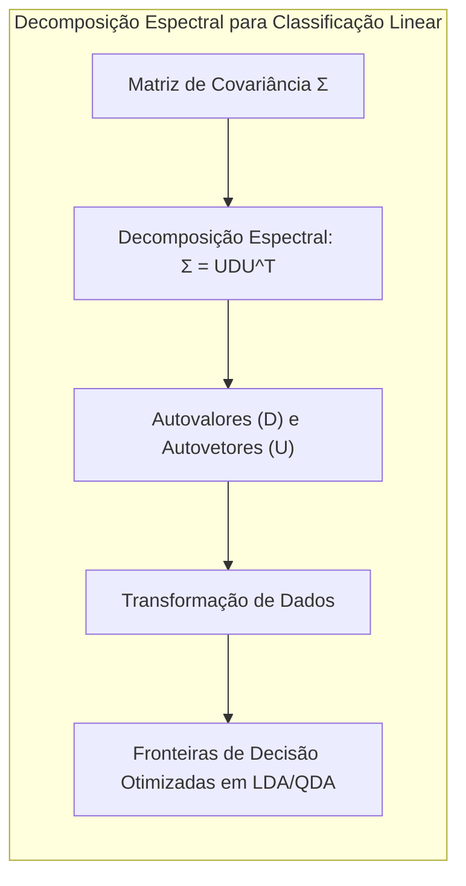
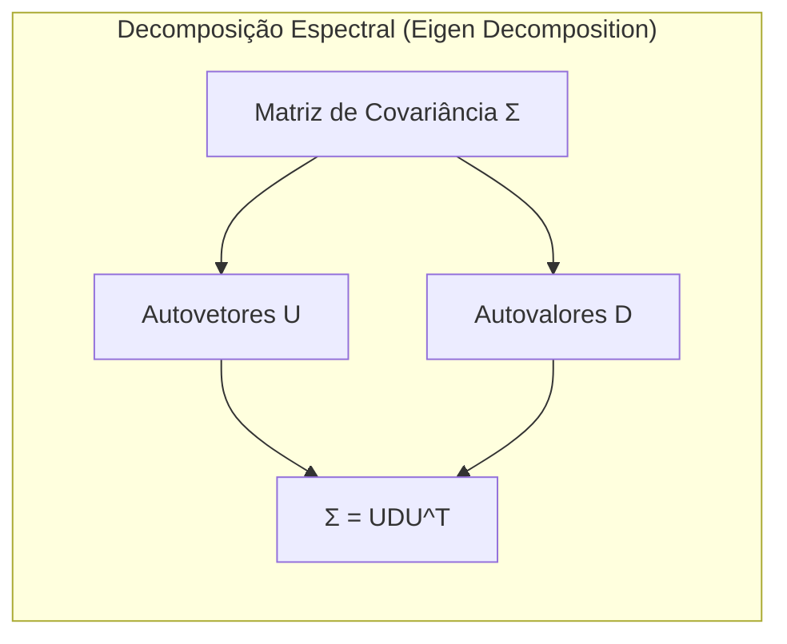
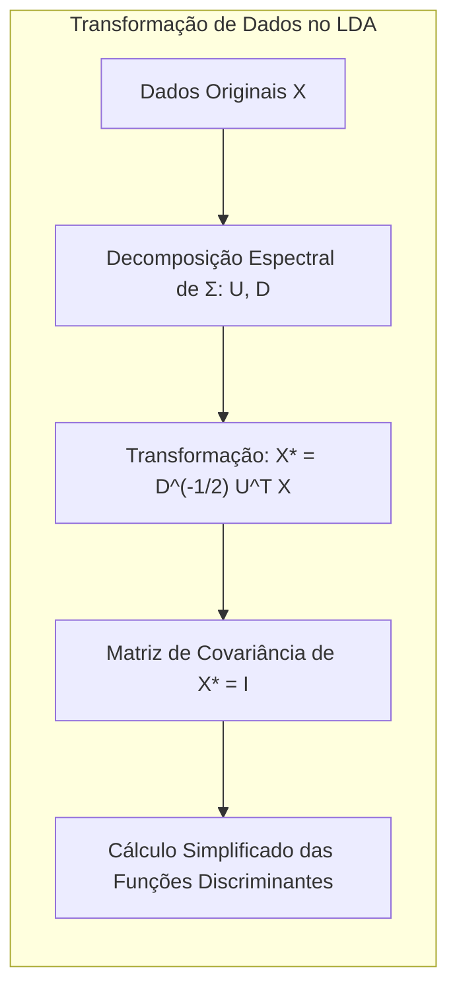
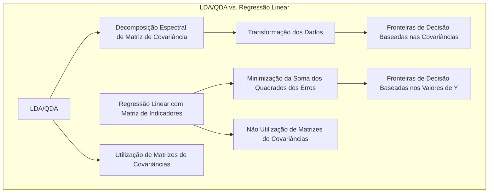
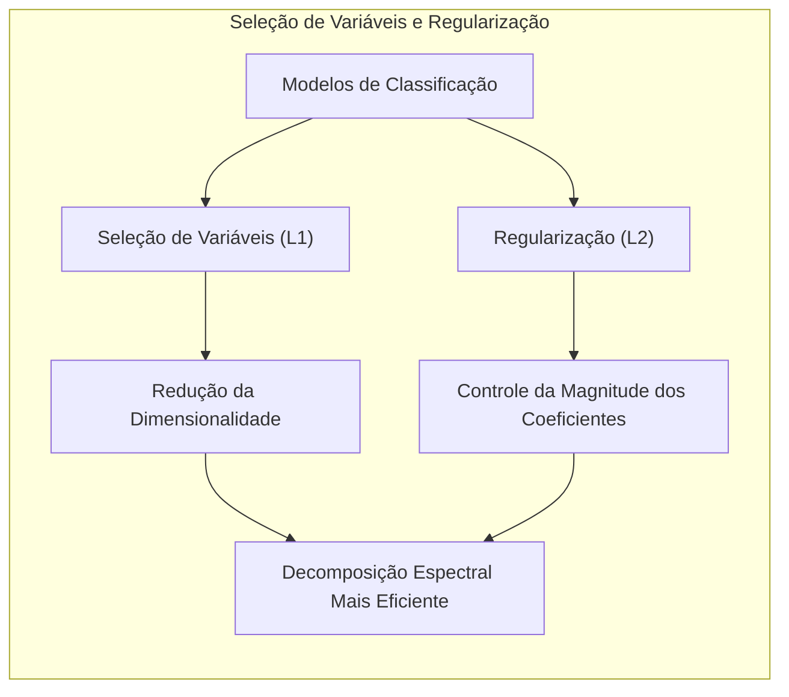
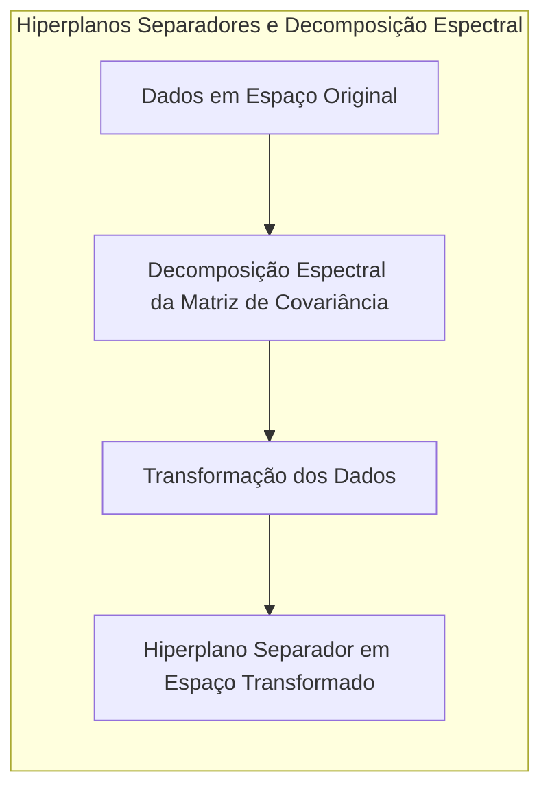
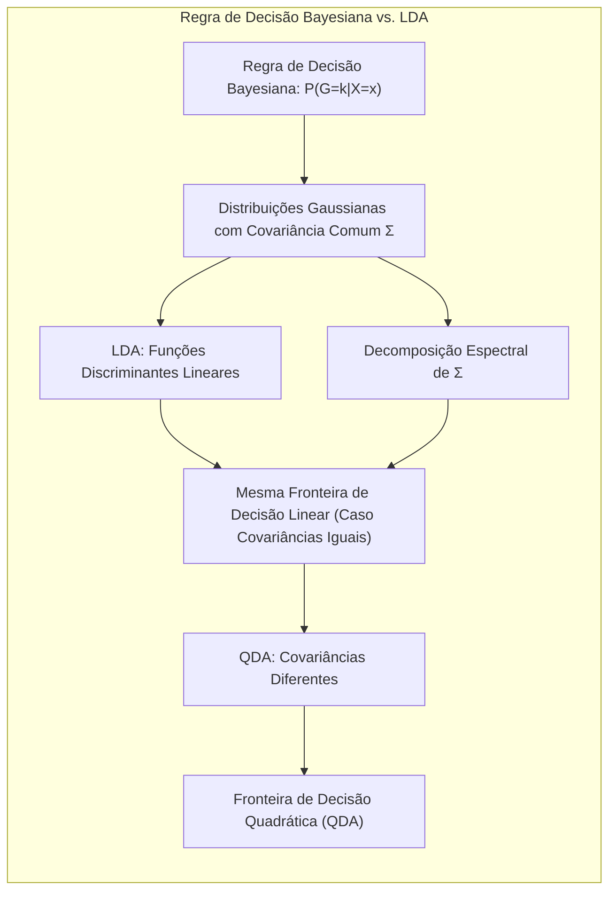

## Título Conciso: Classificação Linear e a Decomposição Espectral: Eigenvalores e Fronteiras de Decisão

### Introdução

Este capítulo explora a aplicação da **decomposição espectral (eigen decomposition)** de matrizes de covariância para simplificar a computação das funções discriminantes e otimizar a obtenção de fronteiras de decisão em modelos de classificação linear, com foco no **Linear Discriminant Analysis (LDA)** e no **Quadratic Discriminant Analysis (QDA)** [^4.3.2]. Analisaremos como os **autovalores e autovetores** da matriz de covariância podem ser utilizados para transformar os dados e tornar os cálculos mais eficientes. Compararemos essa abordagem com a **regressão linear com matrizes de indicadores**, que não utiliza informações da matriz de covariância [^4.2], e com a **regressão logística**, onde a decomposição espectral pode ser aplicada apenas indiretamente através da matriz Hessiana [^4.4]. Discutiremos também como a **seleção de variáveis e regularização** podem ser utilizadas em conjunto com a decomposição espectral para controlar a complexidade dos modelos e melhorar a sua capacidade de generalização [^4.4.4], [^4.5]. Abordaremos também o conceito de **hiperplanos separadores** no contexto de autovalores e autovetores [^4.5.2]. O objetivo deste capítulo é fornecer uma compreensão detalhada de como a decomposição espectral pode ser utilizada para simplificar e otimizar as operações computacionais nos modelos de classificação linear, particularmente o LDA e o QDA.

### Conceitos Fundamentais

**Conceito 1: Decomposição Espectral de Matrizes de Covariância**

A **decomposição espectral (eigen decomposition)** de uma matriz de covariância $\Sigma$ consiste em expressar $\Sigma$ como:

$$
\Sigma = UDU^T
$$

onde $U$ é uma matriz ortogonal cujas colunas são os autovetores de $\Sigma$, e $D$ é uma matriz diagonal cujos elementos na diagonal são os autovalores de $\Sigma$.  Os autovalores representam a variância dos dados ao longo das direções definidas pelos autovetores, e a decomposição espectral permite que a matriz de covariância seja interpretada e manipulada de forma mais eficiente [^4.3.2]. Essa decomposição é uma ferramenta fundamental para modelos de classificação lineares que utilizam a matriz de covariância para a tomada de decisão.

> 💡 **Exemplo Numérico:**
>
> Suponha uma matriz de covariância $\Sigma$ de duas variáveis, dada por:
>
> $$
> \Sigma = \begin{bmatrix} 2 & 1 \\ 1 & 2 \end{bmatrix}
> $$
>
> A decomposição espectral de $\Sigma$ nos dá os autovalores e autovetores. Os autovalores são $\lambda_1 = 3$ e $\lambda_2 = 1$, e os autovetores correspondentes, normalizados, são $u_1 = \begin{bmatrix} 1/\sqrt{2} \\ 1/\sqrt{2} \end{bmatrix}$ e $u_2 = \begin{bmatrix} -1/\sqrt{2} \\ 1/\sqrt{2} \end{bmatrix}$. Assim, as matrizes $U$ e $D$ são:
>
> $$
> U = \begin{bmatrix} 1/\sqrt{2} & -1/\sqrt{2} \\ 1/\sqrt{2} & 1/\sqrt{2} \end{bmatrix}
> $$
>
> $$
> D = \begin{bmatrix} 3 & 0 \\ 0 & 1 \end{bmatrix}
> $$
>
> Podemos verificar que $\Sigma = UDU^T$. O primeiro autovetor, $u_1$, representa a direção de maior variabilidade dos dados (com autovalor 3), enquanto o segundo autovetor, $u_2$, representa a direção de menor variabilidade (com autovalor 1). Esta decomposição permite entender como os dados se distribuem e pode simplificar cálculos posteriores, especialmente em modelos como o LDA e o QDA.

**Lemma 1:** *A decomposição espectral permite decompor a matriz de covariância em seus componentes essenciais, os autovalores e autovetores, o que facilita a análise e a manipulação da matriz.*

**Conceito 2: Utilização da Decomposição Espectral no LDA**

No **LDA**, a matriz de covariância é compartilhada por todas as classes, e a decomposição espectral é utilizada para transformar os dados em um espaço onde a matriz de covariância é diagonal, o que simplifica o cálculo da forma quadrática $(x - \mu_k)^T \Sigma^{-1} (x - \mu_k)$ que aparece na função discriminante [^4.3.2].  Ao transformar os dados por $X^* = D^{-1/2}U^T X$, onde $U$ e $D$ são os resultados da decomposição espectral de $\Sigma$, a nova matriz de covariância de $X^*$ torna-se a matriz identidade, e o cálculo das funções discriminantes se resume ao cálculo de distâncias euclidianas ponderadas aos centroides das classes.

> 💡 **Exemplo Numérico:**
>
> Continuando com o exemplo anterior, suponha que temos dados de duas classes com a mesma matriz de covariância $\Sigma$ dada acima, e médias $\mu_1 = \begin{bmatrix} 1 \\ 1 \end{bmatrix}$ e $\mu_2 = \begin{bmatrix} 3 \\ 3 \end{bmatrix}$. A transformação dos dados $X$ para $X^*$ usando $D^{-1/2}$ e $U^T$ é:
>
> Primeiro calculamos $D^{-1/2}$:
>
> $$
> D^{-1/2} = \begin{bmatrix} 1/\sqrt{3} & 0 \\ 0 & 1 \end{bmatrix}
> $$
>
> A matriz $U^T$ é a transposta de $U$:
>
> $$
> U^T = \begin{bmatrix} 1/\sqrt{2} & 1/\sqrt{2} \\ -1/\sqrt{2} & 1/\sqrt{2} \end{bmatrix}
> $$
>
> Agora, para um ponto $x = \begin{bmatrix} 2 \\ 2 \end{bmatrix}$, a transformação $x^* = D^{-1/2} U^T x$ é dada por:
>
> $$
> x^* = \begin{bmatrix} 1/\sqrt{3} & 0 \\ 0 & 1 \end{bmatrix} \begin{bmatrix} 1/\sqrt{2} & 1/\sqrt{2} \\ -1/\sqrt{2} & 1/\sqrt{2} \end{bmatrix} \begin{bmatrix} 2 \\ 2 \end{bmatrix} = \begin{bmatrix} 1/\sqrt{3} & 0 \\ 0 & 1 \end{bmatrix} \begin{bmatrix} 2\sqrt{2} \\ 0 \end{bmatrix} = \begin{bmatrix} 2\sqrt{2}/\sqrt{3} \\ 0 \end{bmatrix}
> $$
>
>  Após essa transformação, a matriz de covariância dos dados transformados $X^*$ será a matriz identidade, simplificando o cálculo das distâncias e funções discriminantes no LDA.

**Corolário 1:** *A decomposição espectral da matriz de covariância no LDA simplifica a computação das funções discriminantes, pois a matriz de covariância, após a transformação, torna-se a matriz identidade, o que reduz o custo computacional da tomada de decisões.*

**Conceito 3: Utilização da Decomposição Espectral no QDA**

No **QDA**, cada classe possui sua própria matriz de covariância $\Sigma_k$, e a decomposição espectral é aplicada a cada matriz individualmente:

$$
\Sigma_k = U_k D_k U_k^T
$$

onde $U_k$ e $D_k$ são os autovetores e autovalores da matriz de covariância da classe $k$, respectivamente. A decomposição espectral possibilita o cálculo da inversa da matriz de covariância $\Sigma_k^{-1}$ de forma eficiente, e simplifica o cálculo da forma quadrática que aparece na função discriminante, de forma que a decisão final seja computacionalmente viável [^4.3.2].

> 💡 **Exemplo Numérico:**
>
>  Suponha que temos duas classes com matrizes de covariância diferentes:
>
> $$
> \Sigma_1 = \begin{bmatrix} 2 & 0.5 \\ 0.5 & 1 \end{bmatrix}, \quad \Sigma_2 = \begin{bmatrix} 1 & -0.2 \\ -0.2 & 1.5 \end{bmatrix}
> $$
>
> Para o QDA, realizamos a decomposição espectral de cada matriz separadamente. Para $\Sigma_1$, os autovalores e autovetores (aproximados) são $\lambda_{11} \approx 2.28$ com $u_{11} \approx \begin{bmatrix} 0.93 \\ 0.36 \end{bmatrix}$ e $\lambda_{12} \approx 0.72$ com $u_{12} \approx \begin{bmatrix} -0.36 \\ 0.93 \end{bmatrix}$. Para $\Sigma_2$, os autovalores e autovetores (aproximados) são $\lambda_{21} \approx 1.56$ com $u_{21} \approx \begin{bmatrix} -0.22 \\ 0.97 \end{bmatrix}$ e $\lambda_{22} \approx 0.94$ com $u_{22} \approx \begin{bmatrix} 0.97 \\ 0.22 \end{bmatrix}$.
>
> As matrizes $U_1$, $D_1$, $U_2$, e $D_2$ são construídas com esses valores. A decomposição espectral nos permite calcular $\Sigma_1^{-1}$ e $\Sigma_2^{-1}$ de forma eficiente usando as matrizes $U_k$ e $D_k$. A inversa da matriz diagonal $D_k$ é simplesmente a matriz com os inversos dos autovalores na diagonal.

> ⚠️ **Nota Importante**: A decomposição espectral é uma ferramenta fundamental para simplificar os cálculos e otimizar a implementação de modelos de classificação linear e quadrática, como o LDA e QDA [^4.3.2].

> ❗ **Ponto de Atenção**: A aplicação da decomposição espectral pode ser computacionalmente custosa em datasets com alta dimensionalidade, o que motiva o uso de técnicas de seleção de variáveis e regularização.

> ✔️ **Destaque**: A decomposição espectral da matriz de covariância é uma ferramenta que transforma o problema em um espaço mais adequado para classificação linear, com a diagonalização da matriz de covariância.

### Regressão Linear e Mínimos Quadrados para Classificação

A **regressão linear com matrizes de indicadores**, ao contrário do LDA e QDA, não utiliza a decomposição espectral da matriz de covariância para simplificar o processo de ajuste e para a tomada de decisão [^4.2].  A regressão linear busca diretamente minimizar a soma dos quadrados dos erros entre os valores preditos e os observados, sem se basear em suposições sobre a distribuição dos dados e suas propriedades de covariância, o que a distingue dos métodos baseados em gaussianas. A regra de decisão da regressão linear, baseada na maximização da saída da função linear ajustada, também não se beneficia diretamente dos resultados da decomposição espectral.

> 💡 **Exemplo Numérico:**
>
> Suponha que temos um problema de classificação binária com duas classes, que são representadas por variáveis indicadoras $y_i$, onde $y_i = 1$ para a classe 1 e $y_i = 0$ para a classe 2. Temos dois preditores $x_1$ e $x_2$. O modelo de regressão linear é dado por:
>
> $$
> \hat{y} = \beta_0 + \beta_1 x_1 + \beta_2 x_2
> $$
>
>  Os parâmetros $\beta_0$, $\beta_1$ e $\beta_2$ são estimados por mínimos quadrados, ou seja, minimizando a soma dos erros quadráticos:
>
> $$
> \min_{\beta_0, \beta_1, \beta_2} \sum_{i=1}^n (y_i - (\beta_0 + \beta_1 x_{i1} + \beta_2 x_{i2}))^2
> $$
>
>  A regra de decisão para classificar um novo ponto $x = (x_1, x_2)$ é dada por: classificar em classe 1 se $\hat{y} > 0.5$ e em classe 2 caso contrário. Note que a regressão linear não usa nenhuma informação sobre a covariância das classes, apenas busca ajustar um hiperplano que separa os pontos com base nos valores das variáveis indicadoras $y$.

Enquanto o LDA e o QDA utilizam a decomposição espectral para simplificar seus cálculos e tornar a tomada de decisão computacionalmente eficiente, a regressão linear com matrizes de indicadores não se beneficia dessa transformação, o que pode tornar o método menos eficiente em situações com alta dimensionalidade. A regressão linear, portanto, não utiliza as relações entre as variáveis e a sua variabilidade para otimizar o processo de classificação [^4.2].

**Lemma 2:** *A regressão linear com matrizes de indicadores não utiliza a decomposição espectral da matriz de covariância para simplificar os cálculos e não se baseia em modelos de distribuição dos dados.*

**Corolário 2:** *A falta de utilização da decomposição espectral na regressão linear com matrizes de indicadores pode tornar os cálculos menos eficientes e pode levar a uma representação das classes menos precisa do que aquela obtida utilizando abordagens que modelam explicitamente as covariâncias dos dados, como o LDA e o QDA.*

Em resumo, a regressão linear com matrizes de indicadores se distingue do LDA e do QDA por não utilizar a decomposição espectral para simplificar o ajuste dos modelos e a tomada de decisão, o que resulta em diferenças significativas na eficiência computacional e na forma como os dados são modelados. [^4.2], [^4.3.2]

### Métodos de Seleção de Variáveis e Regularização em Classificação

A **seleção de variáveis** e a **regularização** são ferramentas fundamentais para lidar com a complexidade computacional e com o *overfitting* nos modelos de classificação, mesmo quando se utiliza a decomposição espectral das matrizes de covariância [^4.5].  Ao selecionar as variáveis mais relevantes e ao restringir a magnitude dos coeficientes, a regularização ajuda a reduzir o número de parâmetros a serem estimados e a tornar o cálculo da decomposição espectral mais eficiente.

Na **regressão logística**, a função de custo regularizada pode ser expressa como:

$$
\max_{\beta_0, \beta} \left[ \sum_{i=1}^N \left( y_i (\beta_0 + \beta^T x_i) - \log(1 + e^{\beta_0 + \beta^T x_i}) \right) - \lambda P(\beta) \right]
$$

onde $P(\beta)$ é a penalidade e $\lambda$ é o parâmetro de regularização. A penalidade **L1** (Lasso), dada por $P(\beta) = \sum_{j=1}^p |\beta_j|$, promove a esparsidade dos coeficientes, levando à seleção das variáveis mais relevantes [^4.4.4]. A penalidade **L2** (Ridge), dada por $P(\beta) = \sum_{j=1}^p \beta_j^2$, reduz a magnitude dos coeficientes, estabilizando o modelo [^4.5].

> 💡 **Exemplo Numérico:**
>
> Considere um problema de classificação binária com regressão logística. Suponha que temos 5 preditores $x_1, x_2, x_3, x_4, x_5$, e o modelo de regressão logística é dado por:
>
> $$
> \log\left(\frac{P(y=1|x)}{1-P(y=1|x)}\right) = \beta_0 + \beta_1 x_1 + \beta_2 x_2 + \beta_3 x_3 + \beta_4 x_4 + \beta_5 x_5
> $$
>
> Suponha que após ajustar o modelo sem regularização, obtemos os seguintes coeficientes:
>
> $$
> \beta = \begin{bmatrix} 0.5 \\ 2.1 \\ -1.8 \\ 0.3 \\ -0.1 \\ 1.5 \end{bmatrix}
> $$
>
> Agora, vamos aplicar a regularização L1 (Lasso) com $\lambda = 0.5$. A otimização com a penalidade L1 pode levar a um vetor de coeficientes como:
>
> $$
> \beta_{L1} = \begin{bmatrix} 0.4 \\ 1.5 \\ -1.0 \\ 0 \\ 0 \\ 1.0 \end{bmatrix}
> $$
>
> Observe que os coeficientes $\beta_4$ e $\beta_5$ foram reduzidos a zero, indicando que as variáveis $x_4$ e $x_5$ foram consideradas menos relevantes pelo modelo regularizado com L1.
>
> Agora, vamos aplicar a regularização L2 (Ridge) com $\lambda = 0.5$. A otimização com a penalidade L2 pode levar a um vetor de coeficientes como:
>
> $$
> \beta_{L2} = \begin{bmatrix} 0.45 \\ 1.8 \\ -1.6 \\ 0.25 \\ -0.05 \\ 1.2 \end{bmatrix}
> $$
>
> Observe que a regularização L2 reduziu a magnitude de todos os coeficientes, mas não os levou a zero. A escolha entre L1 e L2, ou uma combinação de ambas (Elastic Net), depende do problema e do objetivo de modelagem.

Em modelos como o LDA e QDA, a seleção de variáveis e a regularização também podem simplificar a matriz de covariância, tornando a decomposição espectral mais rápida e menos custosa computacionalmente, ao reduzir a dimensão dos dados, e a quantidade de parâmetros a serem estimados.

**Lemma 3:** *A regularização L1, ao induzir esparsidade, leva a uma redução na dimensão dos dados e na complexidade computacional da decomposição espectral, reduzindo, também, a quantidade de parâmetros a serem estimados no modelo.*

**Prova do Lemma 3:** A penalidade L1, ao adicionar um termo que é proporcional ao valor absoluto dos coeficientes na função de custo, força alguns desses coeficientes a se tornarem exatamente zero durante o processo de otimização. Essa esparsidade leva à seleção de variáveis e à redução da dimensionalidade dos dados, simplificando a decomposição espectral da matriz de covariância e reduzindo o custo computacional do modelo [^4.4.3], [^4.4.4]. $\blacksquare$

**Corolário 3:** *A seleção de variáveis e a regularização, ao simplificarem os modelos de classificação linear e reduzirem a dimensão do espaço de características, diminuem o custo computacional da decomposição espectral e de outras operações envolvidas na construção e aplicação de modelos, como LDA e QDA.*

> ⚠️ **Ponto Crucial**:  A seleção de variáveis e a regularização são fundamentais para reduzir a complexidade computacional dos modelos de classificação linear, e podem ser utilizadas em conjunto com a decomposição espectral da matriz de covariância para tornar a aplicação de modelos como LDA e QDA mais eficientes em cenários de alta dimensionalidade [^4.5].

### Separating Hyperplanes e Perceptrons

A ideia de **hiperplanos separadores** busca encontrar uma fronteira linear que maximize a separação entre as classes. O conceito de margem máxima pode ser interpretado através da aplicação da decomposição espectral nas matrizes de covariância das classes [^4.5.2].  A decomposição espectral também pode ser utilizada para transformar os dados e simplificar a busca pelo hiperplano ótimo.

O algoritmo do **Perceptron**, ao buscar um hiperplano separador ajustando iterativamente os parâmetros do modelo com base nas classificações incorretas, pode também se beneficiar da decomposição espectral [^4.5.1]. Embora o Perceptron não utilize explicitamente a informação da matriz de covariância, a decomposição espectral pode ser utilizada para transformar os dados em um espaço onde a separação das classes se torna mais evidente, e onde a busca pelo hiperplano pode ser simplificada.  Em contextos não linearmente separáveis, o Perceptron não garante a convergência [^4.5.1].

> 💡 **Exemplo Numérico:**
>
> Considere duas classes com dados linearmente separáveis em duas dimensões. Inicialmente, os dados podem estar em um espaço onde a separação não é óbvia. Aplicando a decomposição espectral da matriz de covariância (ou uma matriz de covariância conjunta) e transformando os dados, podemos obter um novo espaço onde as classes são mais separadas.
>
> Suponha que temos dois pontos da classe 1 $x_1 = \begin{bmatrix} 1 \\ 1 \end{bmatrix}$ e $x_2 = \begin{bmatrix} 2 \\ 2 \end{bmatrix}$ e dois pontos da classe 2 $x_3 = \begin{bmatrix} 4 \\ 1 \end{bmatrix}$ e $x_4 = \begin{bmatrix} 5 \\ 2 \end{bmatrix}$. O Perceptron, ao iterar sobre os pontos, pode encontrar um hiperplano separador, ajustando seus pesos. Se aplicarmos uma transformação linear baseada na decomposição espectral, poderemos encontrar um novo espaço onde a separação das classes é mais simples. Por exemplo, a transformação poderia levar a $x_1' = \begin{bmatrix} -1 \\ 0 \end{bmatrix}$, $x_2' = \begin{bmatrix} -0.5 \\ 0 \end{bmatrix}$, $x_3' = \begin{bmatrix} 1 \\ 0 \end{bmatrix}$, $x_4' = \begin{bmatrix} 1.5 \\ 0 \end{bmatrix}$. Neste novo espaço, a separação entre as classes se torna trivial. O Perceptron então converge facilmente para uma solução.

**Teorema:** *A aplicação da decomposição espectral pode simplificar a busca por hiperplanos separadores em espaços de alta dimensão, e, se os dados forem linearmente separáveis, o algoritmo do Perceptron converge para uma solução em um número finito de passos*.

### Pergunta Teórica Avançada: Quais as diferenças fundamentais entre a formulação de LDA e a Regra de Decisão Bayesiana considerando distribuições Gaussianas com covariâncias iguais?

**Resposta:**

A **Regra de Decisão Bayesiana** busca classificar uma observação $x$ na classe $k$ que maximize a probabilidade posterior $P(G=k|X=x)$ [^4.3]. Sob a suposição de que as classes seguem distribuições Gaussianas com a mesma matriz de covariância $\Sigma$, a probabilidade posterior é dada por:

$$
P(G=k|X=x) = \frac{ \phi(x;\mu_k,\Sigma)\pi_k}{\sum_{l=1}^K \phi(x;\mu_l,\Sigma)\pi_l}
$$

onde $\phi(x;\mu_k,\Sigma)$ é a densidade gaussiana para a classe $k$, $\mu_k$ é a média da classe $k$ e $\pi_k$ é a probabilidade a priori da classe $k$.  O **LDA**, por sua vez, deriva suas funções discriminantes lineares diretamente dessas suposições, e utiliza a SVD como uma forma de simplificar os cálculos [^4.3].

**Lemma 4:** *Sob a suposição de distribuições Gaussianas com a mesma matriz de covariância, a regra de decisão Bayesiana e a função discriminante do LDA levam à mesma fronteira de decisão linear, e os resultados da decomposição espectral de Σ são utilizados para simplificar o cálculo da fronteira.*

**Corolário 4:** *A relaxação da suposição de igualdade de covariâncias na regra de decisão Bayesiana leva ao QDA, onde a aplicação da SVD pode ser feita separadamente para cada matriz de covariância e as fronteiras de decisão são quadráticas, não mais lineares, tornando o problema computacionalmente mais custoso*.

> ⚠️ **Ponto Crucial**:  A principal diferença entre o LDA e a regra de decisão Bayesiana reside na restrição sobre a matriz de covariância e como a SVD simplifica a computação da função discriminante no LDA. O LDA impõe a restrição de covariâncias iguais, e sob essa suposição, a regra Bayesiana resulta no mesmo método e na mesma fronteira de decisão [^4.3].

### Conclusão

Neste capítulo, exploramos a aplicação da decomposição espectral para simplificar a computação das fronteiras de decisão em modelos de classificação linear, focando no LDA e no QDA. Discutimos como a SVD pode ser utilizada para transformar os dados e tornar os cálculos mais eficientes.  Vimos que a regressão linear não se beneficia da aplicação da SVD como o LDA e o QDA.  Analisamos como a seleção de variáveis e a regularização são importantes para controlar a complexidade computacional dos modelos e, finalmente, mostramos como a aplicação de hiperplanos separadores se conecta com a decomposição espectral da matriz de covariância. Ao longo do capítulo, buscamos oferecer uma compreensão clara e detalhada de como a decomposição espectral de matrizes de covariância pode ser utilizada para otimizar modelos de classificação lineares e quadráticos.

### Footnotes

[^4.1]: *In this chapter we revisit the classification problem and focus on linear methods for classification...There are several different ways in which linear decision boundaries can be found.* *(Trecho de Linear Methods for Classification)*

[^4.2]: *In Chapter 2 we fit linear regression models to the class indicator variables, and classify to the largest fit...Linear inequalities in this space are quadratic inequalities in the original space.* *(Trecho de Linear Methods for Classification)*

[^4.3]: *Decision theory for classification (Section 2.4) tells us that we need to know the class posteriors Pr(G|X) for optimal classification. Suppose fk(x) is the class-conditional density of X in class G = k, and let πκ be the prior probability of class k... Linear discriminant analysis (LDA) arises in the special case when we assume that the classes have a common covariance matrix Σk = Σ.* *(Trecho de Linear Methods for Classification)*

[^4.3.1]: *The decision boundary between each pair of classes k and l is described by a quadratic equation {x: δκ(x) = δ(x)}.* *(Trecho de Linear Methods for Classification)*

[^4.3.2]: *The estimates for QDA are similar to those for LDA, except that separate covariance matrices must be estimated for each class...Their computations are simplified by diagonalizing ∑ or Ék.* *(Trecho de Linear Methods for Classification)*

[^4.3.3]: *In the special case when we assume that the classes have a common covariance matrix...When the classes are really Gaussian, then LDA is optimal* *(Trecho de Linear Methods for Classification)*

[^4.4]: *The logistic regression model arises from the desire to model the posterior probabilities of the K classes via linear functions in x, while at the same time ensuring that they sum to one and remain in [0,1].* *(Trecho de Linear Methods for Classification)*

[^4.4.1]: *Logistic regression models are usually fit by maximum likelihood... The logistic regression model is more general, in that it makes less assumptions.* *(Trecho de Linear Methods for Classification)*

[^4.4.2]: *It is convenient to code the two-class gi via a 0/1 response Yi, where yi = 1 when gi = 1, and yi = 0 when gi = 2... Typically many models are fit in a search for a parsimonious model involving a subset of the variables.* *(Trecho de Linear Methods for Classification)*

[^4.4.3]: *To maximize the log-likelihood, we set its derivatives to zero. These score equations are...To solve the score equations (4.21), we use the Newton-Raphson algorithm...* *(Trecho de Linear Methods for Classification)*

[^4.4.4]: *The L1 penalty used in the lasso (Section 3.4.2) can be used for variable selection and shrinkage with any linear regression model...As with the lasso, we typically do not penalize the intercept term.* *(Trecho de Linear Methods for Classification)*

[^4.5]: *Here we present an analysis of binary data to illustrate the traditional statistical use of the logistic regression model... With two classes there is a simple correspondence between linear discriminant analysis and classification by linear least squares, as in (4.5).* *(Trecho de Linear Methods for Classification)*

[^4.5.1]: *The perceptron learning algorithm tries to find a separating hyperplane by minimizing the distance of misclassified points to the decision boundary.* *(Trecho de Linear Methods for Classification)*

[^4.5.2]: *The optimal separating hyperplane separates the two classes and maximizes the distance to the closest point from either class... In light of (4.40), the constraints define an empty slab or margin around the linear decision boundary...* *(Trecho de Linear Methods for Classification)*
