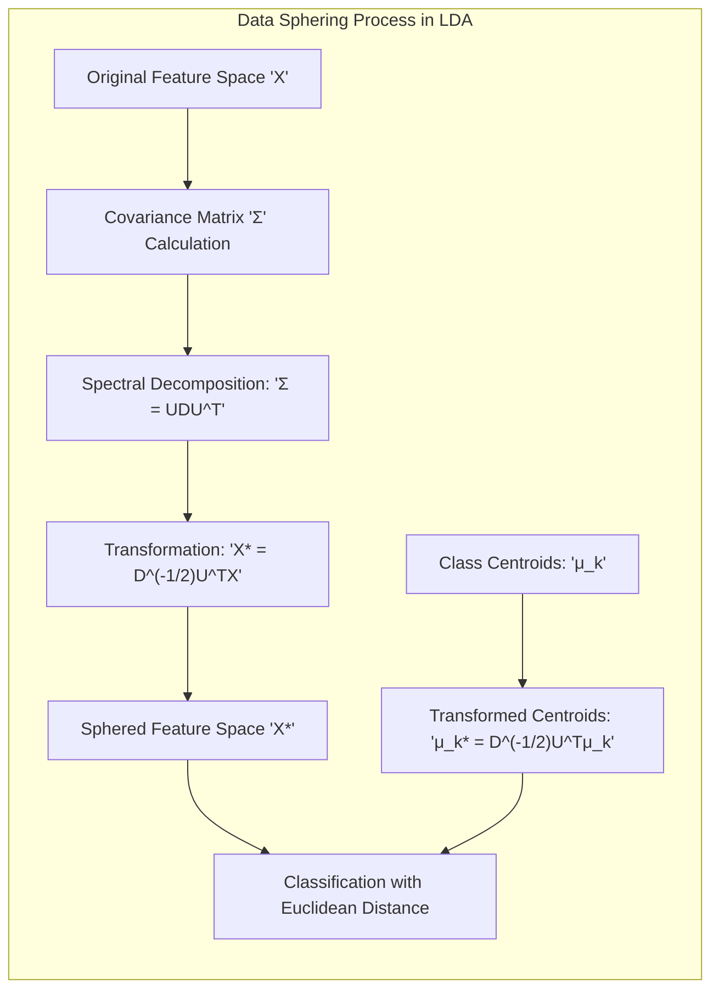
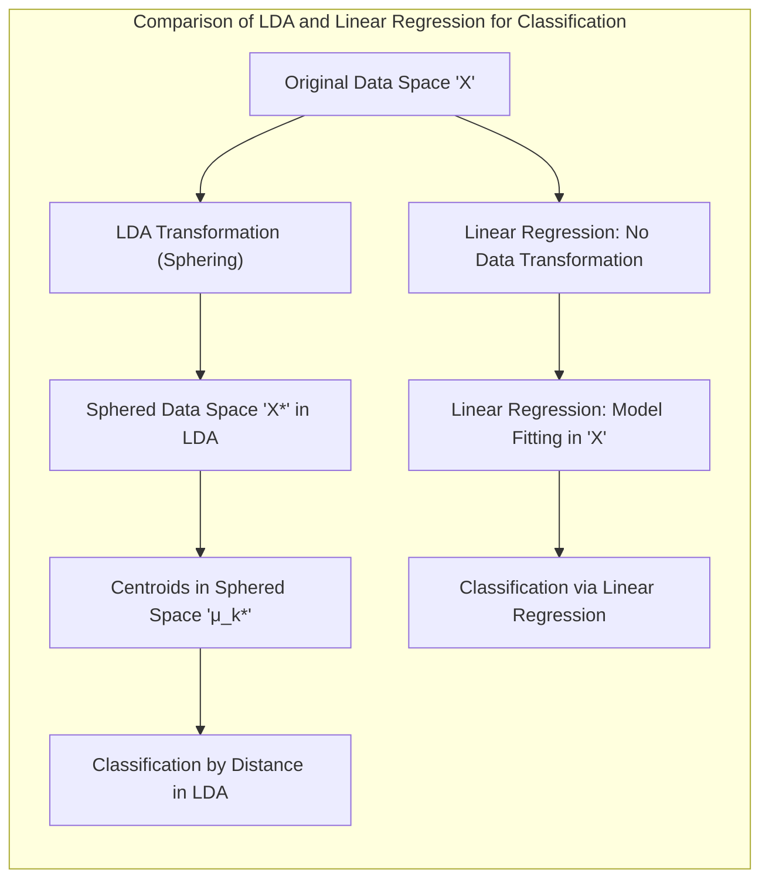
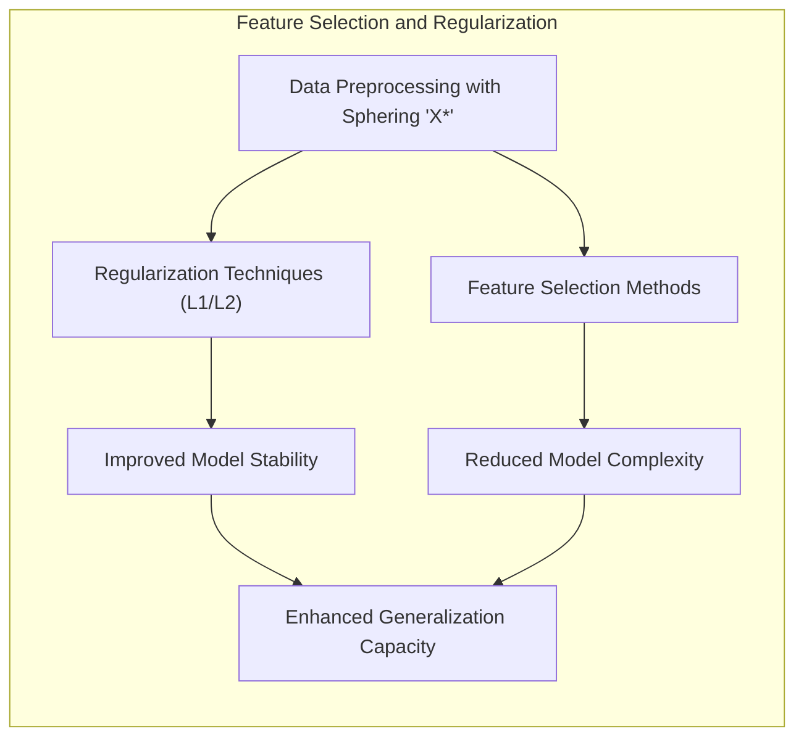
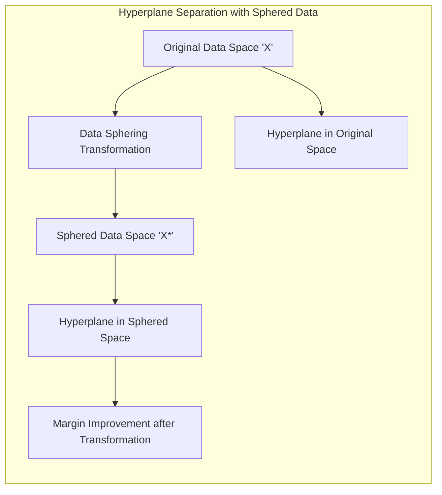
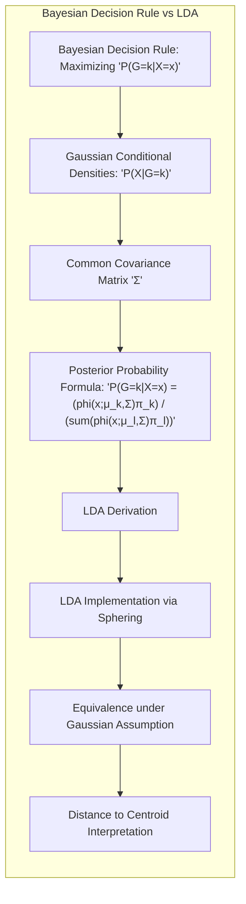

## Título Conciso: Classificação Linear e a Estratégia de Esferização e Centroide Mais Próximo



### Introdução

Este capítulo explora em detalhes a estratégia de **esferização de dados** seguida pela classificação para o **centroide da classe mais próximo**, uma abordagem computacionalmente eficiente utilizada no **Linear Discriminant Analysis (LDA)** [^4.3.2]. Analisaremos como a transformação dos dados, utilizando a matriz de covariância conjunta, leva a um espaço onde as distâncias euclidianas podem ser usadas diretamente para a tomada de decisões.  Compararemos essa abordagem com a **regressão linear com matrizes de indicadores**, que não utiliza a informação de covariância [^4.2], e com a **regressão logística**, que modela a probabilidade posterior das classes [^4.4].  Discutiremos a importância da **seleção de variáveis e regularização** para melhorar a estabilidade da estimativa das matrizes de covariância [^4.4.4], [^4.5]. Exploraremos também a relação entre **hiperplanos separadores** e a transformação dos dados através da esferização [^4.5.2]. O objetivo deste capítulo é fornecer uma visão abrangente de como a esferização e a classificação para o centroide mais próximo são utilizados na prática para a construção de modelos de classificação linear eficientes.

### Conceitos Fundamentais

**Conceito 1: A Estratégia de Esferização dos Dados**

A **esferização dos dados** é uma técnica de pré-processamento que busca transformar as variáveis de entrada para um novo espaço onde a matriz de covariância seja a matriz identidade, ou seja, onde as variáveis sejam não correlacionadas e tenham variância unitária. Essa transformação é feita através da decomposição espectral da matriz de covariância $\Sigma = UDU^T$, e da transformação dos dados para o novo espaço através de $X^* = D^{-1/2} U^T X$ [^4.3.2]. O resultado dessa transformação é um conjunto de dados que pode ser interpretado como se as classes possuíssem uma estrutura de covariância esférica, o que simplifica a computação da decisão de classe, especialmente no LDA e QDA [^4.3.2].

> 💡 **Exemplo Numérico:**
>
> Vamos considerar um conjunto de dados bidimensional com duas classes. Suponha que a matriz de covariância conjunta seja:
>
> $$
> \Sigma = \begin{bmatrix} 2 & 1 \\ 1 & 2 \end{bmatrix}
> $$
>
> 1. **Decomposição Espectral:** Calculamos os autovalores e autovetores de $\Sigma$. Os autovalores são $\lambda_1 = 3$ e $\lambda_2 = 1$, e os autovetores correspondentes são $u_1 = \begin{bmatrix} 1/\sqrt{2} \\ 1/\sqrt{2} \end{bmatrix}$ e $u_2 = \begin{bmatrix} -1/\sqrt{2} \\ 1/\sqrt{2} \end{bmatrix}$. Assim,
>
> $$
> U = \begin{bmatrix} 1/\sqrt{2} & -1/\sqrt{2} \\ 1/\sqrt{2} & 1/\sqrt{2} \end{bmatrix}, \quad D = \begin{bmatrix} 3 & 0 \\ 0 & 1 \end{bmatrix}
> $$
>
> 2. **Transformação:** A matriz $D^{-1/2}$ é dada por:
>
> $$
> D^{-1/2} = \begin{bmatrix} 1/\sqrt{3} & 0 \\ 0 & 1 \end{bmatrix}
> $$
>
> 3. **Esferização:** A transformação para um novo ponto $x = \begin{bmatrix} 2 \\ 1 \end{bmatrix}$ seria:
>
> $$
> x^* = D^{-1/2} U^T x = \begin{bmatrix} 1/\sqrt{3} & 0 \\ 0 & 1 \end{bmatrix} \begin{bmatrix} 1/\sqrt{2} & 1/\sqrt{2} \\ -1/\sqrt{2} & 1/\sqrt{2} \end{bmatrix} \begin{bmatrix} 2 \\ 1 \end{bmatrix} = \begin{bmatrix} 1/\sqrt{6} & 1/\sqrt{6} \\ -1/\sqrt{2} & 1/\sqrt{2} \end{bmatrix} \begin{bmatrix} 2 \\ 1 \end{bmatrix} = \begin{bmatrix} \frac{3}{\sqrt{6}} \\ \frac{-1}{\sqrt{2}} + \frac{1}{\sqrt{2}}\end{bmatrix} = \begin{bmatrix} \frac{\sqrt{6}}{2} \\ 0 \end{bmatrix}
> $$
>
> Após a esferização, as variáveis em $x^*$ não são correlacionadas e têm variância unitária.

**Lemma 1:** *A esferização dos dados, utilizando a matriz de covariância comum, leva a um espaço transformado onde a matriz de covariância se torna a matriz identidade, o que simplifica a computação da distância euclidiana aos centros das classes.*  A prova desse lema é obtida mostrando como a transformação $X^* = D^{-1/2} U^T X$ leva a uma matriz de covariância identidade.

**Conceito 2: Classificação para o Centroide Mais Próximo no Espaço Esferizado**

Após a esferização dos dados, a classificação é feita atribuindo uma nova observação $x^*$ à classe cujo **centroide** transformado $\mu_k^*$ seja o mais próximo, usando a distância euclidiana.  O centroide transformado para cada classe é dado por:

$$
\mu_k^* = D^{-1/2} U^T \mu_k
$$

A regra de decisão é, portanto:

$$
\hat{G}(x) = \arg\min_k ||x^* - \mu_k^*||^2
$$

Essa regra é equivalente à regra de decisão do LDA, sob a suposição gaussiana e covariâncias iguais, mas simplifica significativamente o cálculo e a implementação do método. A classificação utilizando a distância euclidiana do espaço transformado é computacionalmente eficiente e uma aproximação para a maximização da probabilidade posterior [^4.3.2].

> 💡 **Exemplo Numérico:**
>
> Continuando com o exemplo anterior, suponha que os centroides das duas classes no espaço original sejam:
>
> $$
> \mu_1 = \begin{bmatrix} 1 \\ 1 \end{bmatrix}, \quad \mu_2 = \begin{bmatrix} 3 \\ 2 \end{bmatrix}
> $$
>
> Os centroides transformados seriam:
>
> $$
> \mu_1^* = D^{-1/2} U^T \mu_1 = \begin{bmatrix} 1/\sqrt{3} & 0 \\ 0 & 1 \end{bmatrix} \begin{bmatrix} 1/\sqrt{2} & 1/\sqrt{2} \\ -1/\sqrt{2} & 1/\sqrt{2} \end{bmatrix} \begin{bmatrix} 1 \\ 1 \end{bmatrix} = \begin{bmatrix} \frac{2}{\sqrt{6}} \\ 0 \end{bmatrix}
> $$
>
> $$
> \mu_2^* = D^{-1/2} U^T \mu_2 = \begin{bmatrix} 1/\sqrt{3} & 0 \\ 0 & 1 \end{bmatrix} \begin{bmatrix} 1/\sqrt{2} & 1/\sqrt{2} \\ -1/\sqrt{2} & 1/\sqrt{2} \end{bmatrix} \begin{bmatrix} 3 \\ 2 \end{bmatrix} = \begin{bmatrix} \frac{5}{\sqrt{6}} \\ \frac{-1}{\sqrt{2}} \end{bmatrix}
> $$
>
> Para classificar o ponto $x^* = \begin{bmatrix} \frac{\sqrt{6}}{2} \\ 0 \end{bmatrix}$, calculamos as distâncias euclidianas aos centroides transformados:
>
> $$
> ||x^* - \mu_1^*||^2 = \left( \frac{\sqrt{6}}{2} - \frac{2}{\sqrt{6}} \right)^2 + (0 - 0)^2 = \left(\frac{3-4}{2\sqrt{6}} \right)^2 = \frac{1}{24}
> $$
>
> $$
> ||x^* - \mu_2^*||^2 = \left( \frac{\sqrt{6}}{2} - \frac{5}{\sqrt{6}} \right)^2 + \left(0 - \frac{-1}{\sqrt{2}} \right)^2 =  \left(\frac{3-10}{2\sqrt{6}} \right)^2 + \frac{1}{2} = \frac{49}{24} + \frac{12}{24} = \frac{61}{24}
> $$
>
> Como $||x^* - \mu_1^*||^2 < ||x^* - \mu_2^*||^2$, classificamos $x$ para a classe 1.

**Corolário 1:** *A classificação para o centroide mais próximo no espaço esferizado, obtido através da decomposição espectral da matriz de covariância, é uma forma computacionalmente eficiente de implementar a regra de decisão do LDA.*  Este corolário destaca a conexão entre o método e a tomada de decisão.

**Conceito 3: Relação com a Regra de Decisão Bayesiana e a Função Discriminante do LDA**

A estratégia de esferização e classificação para o centroide mais próximo é uma forma de implementar a regra de decisão do LDA de maneira eficiente, onde a função discriminante do LDA pode ser vista como uma medida de distância ponderada por informações sobre as probabilidades a priori das classes, e que pode ser implementada através da esferização e do cálculo da distância euclidiana. Sob a suposição gaussiana e de covariâncias iguais, essa abordagem é equivalente à maximização da probabilidade posterior, como definida na regra de decisão Bayesiana. Portanto, essa abordagem conecta o cálculo da distância com as decisões de classificação com base em probabilidades posteriores.

> ⚠️ **Nota Importante**: A estratégia de esferização e classificação para o centroide mais próximo é uma forma eficiente de implementar o LDA, e se baseia na suposição de gaussianidade multivariada com covariâncias iguais [^4.3.2].

> ❗ **Ponto de Atenção**: Embora a esferização simplifique o cálculo das funções discriminantes no LDA, ela não resolve o problema de overfitting e nem da necessidade de ter matrizes de covariância bem estimadas, com pouco ruído nas amostras.

> ✔️ **Destaque**: A estratégia de esferização e classificação para o centroide mais próximo simplifica a implementação do LDA e está relacionada com a teoria de decisão e com a maximização da probabilidade posterior.

### Regressão Linear e Mínimos Quadrados para Classificação



A **regressão linear com matrizes de indicadores**, ao contrário do LDA, não utiliza a esferização dos dados ou qualquer outra forma de transformação baseada na matriz de covariância [^4.2]. A regressão linear busca ajustar funções lineares separadamente para cada classe através da minimização da soma de quadrados dos erros, sem utilizar informação sobre a estrutura de variância dos dados.  A decisão de classificação é então feita atribuindo a observação à classe com o maior valor de saída.

A ausência da transformação dos dados na regressão linear resulta em um método que não leva em consideração a distribuição dos dados e a variabilidade entre as classes, o que pode levar a problemas como o "masking" em problemas multiclasse. A regressão linear, portanto, não se beneficia da simplificação do cálculo da função discriminante através da esferização dos dados, e a decisão de classificação é feita diretamente a partir do modelo ajustado no espaço original.  Em contraste, no LDA a esferização simplifica o cálculo da distância aos centroides, tornando a decisão mais eficiente.

A comparação com a abordagem do LDA, que utiliza a esferização dos dados para simplificar o cálculo da função discriminante e da decisão de classe, destaca as diferenças fundamentais entre os dois métodos, em como utilizam as informações da distribuição dos dados.

> 💡 **Exemplo Numérico:**
>
> Vamos usar um exemplo simples com duas classes e duas features. Suponha que temos os seguintes dados:
>
> Classe 1: $X_1 = \begin{bmatrix} 1 & 1 \\ 1 & 2 \\ 2 & 1 \end{bmatrix}$, $y_1 = \begin{bmatrix} 1 \\ 1 \\ 1 \end{bmatrix}$
> Classe 2: $X_2 = \begin{bmatrix} 3 & 3 \\ 3 & 4 \\ 4 & 3 \end{bmatrix}$, $y_2 = \begin{bmatrix} 0 \\ 0 \\ 0 \end{bmatrix}$
>
> Para regressão linear com matrizes de indicadores, combinamos os dados e criamos uma matriz de indicadores $Y$:
>
> $X = \begin{bmatrix} 1 & 1 \\ 1 & 2 \\ 2 & 1 \\ 3 & 3 \\ 3 & 4 \\ 4 & 3 \end{bmatrix}$, $Y = \begin{bmatrix} 1 \\ 1 \\ 1 \\ 0 \\ 0 \\ 0 \end{bmatrix}$
>
> Usamos a fórmula de mínimos quadrados para encontrar os coeficientes $\beta$:
>
> $\beta = (X^TX)^{-1}X^TY$
>
> 1. **Calcular $X^TX$:**
>
> $X^TX = \begin{bmatrix} 1 & 1 & 2 & 3 & 3 & 4 \\ 1 & 2 & 1 & 3 & 4 & 3 \end{bmatrix} \begin{bmatrix} 1 & 1 \\ 1 & 2 \\ 2 & 1 \\ 3 & 3 \\ 3 & 4 \\ 4 & 3 \end{bmatrix} = \begin{bmatrix} 44 & 40 \\ 40 & 40 \end{bmatrix}$
>
> 2. **Calcular $(X^TX)^{-1}$:**
>
> $(X^TX)^{-1} = \frac{1}{44*40 - 40*40} \begin{bmatrix} 40 & -40 \\ -40 & 44 \end{bmatrix} = \frac{1}{160} \begin{bmatrix} 40 & -40 \\ -40 & 44 \end{bmatrix} = \begin{bmatrix} 0.25 & -0.25 \\ -0.25 & 0.275 \end{bmatrix}$
>
> 3. **Calcular $X^TY$:**
>
> $X^TY = \begin{bmatrix} 1 & 1 & 2 & 3 & 3 & 4 \\ 1 & 2 & 1 & 3 & 4 & 3 \end{bmatrix} \begin{bmatrix} 1 \\ 1 \\ 1 \\ 0 \\ 0 \\ 0 \end{bmatrix} = \begin{bmatrix} 4 \\ 4 \end{bmatrix}$
>
> 4. **Calcular $\beta$:**
>
> $\beta = (X^TX)^{-1}X^TY = \begin{bmatrix} 0.25 & -0.25 \\ -0.25 & 0.275 \end{bmatrix} \begin{bmatrix} 4 \\ 4 \end{bmatrix} = \begin{bmatrix} 0 \\ 0.1 \end{bmatrix}$
>
> O modelo linear para classificação seria $f(x) = 0.1x_2$. Para um novo ponto $x = \begin{bmatrix} 2 \\ 2 \end{bmatrix}$, a saída do modelo é $f(x) = 0.1 * 2 = 0.2$. Para classificar, compararíamos a saída com um limiar (por exemplo, 0.5).
>
>  Em contraste, o LDA primeiro esferizaria os dados, o que não é realizado nesse exemplo de regressão linear.

**Lemma 2:** *A regressão linear com matrizes de indicadores não utiliza a esferização dos dados ou qualquer outra transformação baseada na matriz de covariância para simplificar o processo de classificação, ao contrário do LDA, que utiliza a decomposição espectral para diagonalizar a matriz de covariância e transforma o espaço de características.* Esse lema destaca uma diferença fundamental entre os métodos em relação à forma como os dados são tratados.

**Corolário 2:** *A falta da esferização dos dados na regressão linear com matrizes de indicadores torna os cálculos mais complexos e pode levar a resultados menos precisos do que aqueles obtidos com métodos que consideram a estrutura da matriz de covariância, como o LDA.* A utilização da esferização é, portanto, uma forma de obter um modelo computacionalmente mais eficiente.

Em resumo, a regressão linear com matrizes de indicadores não se beneficia da simplificação obtida através da esferização e da classificação pelo centroide mais próximo, que são características da implementação do LDA, e utiliza um critério diferente para a definição das fronteiras de decisão, baseado diretamente no ajuste das funções lineares, e não na projeção dos dados e no cálculo de distâncias no espaço transformado [^4.2].

### Métodos de Seleção de Variáveis e Regularização em Classificação



A **seleção de variáveis** e a **regularização** são técnicas importantes para melhorar a estabilidade e a capacidade de generalização dos modelos de classificação, mesmo quando se utiliza a estratégia de esferização e classificação pelo centroide mais próximo [^4.5].  Ao selecionar as variáveis mais relevantes e ao restringir a magnitude dos coeficientes, a regularização auxilia na criação de modelos que sejam menos suscetíveis ao overfitting.

Na **regressão logística**, a regularização é implementada adicionando um termo de penalidade à função de custo:

$$
\max_{\beta_0, \beta} \left[ \sum_{i=1}^N \left( y_i (\beta_0 + \beta^T x_i) - \log(1 + e^{\beta_0 + \beta^T x_i}) \right) - \lambda P(\beta) \right]
$$

onde $P(\beta)$ é a penalidade e $\lambda$ é o parâmetro de regularização. A penalidade **L1** (Lasso), dada por $P(\beta) = \sum_{j=1}^p |\beta_j|$, promove a esparsidade dos coeficientes, selecionando as variáveis mais relevantes e simplificando o modelo [^4.4.4]. A penalidade **L2** (Ridge), dada por $P(\beta) = \sum_{j=1}^p \beta_j^2$, reduz a magnitude dos coeficientes, melhorando a estabilidade e a capacidade de generalização do modelo [^4.5].

A aplicação da regularização em modelos que utilizam a esferização dos dados pode ser vista como uma forma de controlar a complexidade do modelo, melhorando a sua capacidade de generalização e evitando o ajuste excessivo aos dados de treinamento.

> 💡 **Exemplo Numérico:**
>
> Vamos considerar um exemplo de regressão logística com regularização L1 (Lasso). Suponha que temos um conjunto de dados com 5 features e uma variável binária de resposta.
>
> ```python
> import numpy as np
> from sklearn.linear_model import LogisticRegression
> from sklearn.model_selection import train_test_split
> from sklearn.preprocessing import StandardScaler
>
> # Dados de exemplo
> np.random.seed(42)
> X = np.random.rand(100, 5)
> y = np.random.randint(0, 2, 100)
>
> # Dividir dados em treinamento e teste
> X_train, X_test, y_train, y_test = train_test_split(X, y, test_size=0.3, random_state=42)
>
> # Padronizar os dados
> scaler = StandardScaler()
> X_train_scaled = scaler.fit_transform(X_train)
> X_test_scaled = scaler.transform(X_test)
>
> # Regressão Logística sem regularização
> logreg_no_reg = LogisticRegression(penalty=None, solver='lbfgs')
> logreg_no_reg.fit(X_train_scaled, y_train)
>
> # Regressão Logística com regularização L1 (Lasso)
> logreg_l1 = LogisticRegression(penalty='l1', C=0.1, solver='liblinear') # C é o inverso de lambda
> logreg_l1.fit(X_train_scaled, y_train)
>
> # Regressão Logística com regularização L2 (Ridge)
> logreg_l2 = LogisticRegression(penalty='l2', C=0.1, solver='lbfgs')
> logreg_l2.fit(X_train_scaled, y_train)
>
> # Imprimir coeficientes
> print("Coeficientes sem regularização:", logreg_no_reg.coef_)
> print("Coeficientes com regularização L1 (Lasso):", logreg_l1.coef_)
> print("Coeficientes com regularização L2 (Ridge):", logreg_l2.coef_)
>
> # Avaliar o desempenho
> print("Acurácia sem regularização:", logreg_no_reg.score(X_test_scaled, y_test))
> print("Acurácia com regularização L1 (Lasso):", logreg_l1.score(X_test_scaled, y_test))
> print("Acurácia com regularização L2 (Ridge):", logreg_l2.score(X_test_scaled, y_test))
> ```
>
> Neste exemplo, podemos observar como a regularização L1 (Lasso) zera alguns coeficientes, realizando a seleção de variáveis, enquanto a regularização L2 (Ridge) reduz a magnitude dos coeficientes. Os resultados da acurácia mostram como a regularização pode melhorar o desempenho do modelo em dados de teste.

**Lemma 3:** *A regularização L1, ao induzir esparsidade, leva a modelos mais simples e com melhor capacidade de generalização, e a seleção de variáveis através da penalidade L1 melhora a estabilidade e a interpretabilidade do modelo.* Este lema descreve a importância da regularização para a qualidade dos modelos de classificação.

**Prova do Lemma 3:** A penalidade L1 adiciona um termo proporcional ao valor absoluto dos coeficientes, que força alguns deles a se tornarem exatamente zero durante a otimização, o que resulta em modelos mais esparsos e com maior poder de generalização [^4.4.3], [^4.4.4]. $\blacksquare$

**Corolário 3:** *A seleção de variáveis e a regularização, ao controlarem a complexidade do modelo, melhoram a qualidade da estimativa do centroide e a estabilidade do modelo, mesmo quando a classificação é realizada no espaço transformado pela esferização*.  O controle da complexidade é um componente importante para a construção de modelos robustos.

> ⚠️ **Ponto Crucial**: A seleção de variáveis e a regularização, mesmo quando combinadas com a técnica de esferização, são importantes para construir modelos de classificação lineares mais robustos e com maior capacidade de generalização [^4.5].

### Separating Hyperplanes e Perceptrons



A busca por **hiperplanos separadores** visa encontrar uma fronteira linear que maximize a separação entre as classes, e a transformação dos dados através da esferização pode simplificar essa busca, uma vez que a estrutura de covariância se torna mais simples no espaço transformado [^4.5.2].  A esferização dos dados permite visualizar o hiperplano separador e sua relação com as classes em um espaço transformado.

O algoritmo do **Perceptron** busca um hiperplano separador através do ajuste iterativo dos parâmetros do modelo. A aplicação do Perceptron após a transformação dos dados através da esferização pode acelerar a convergência do algoritmo, caso o problema seja linearmente separável, ou auxiliar a encontrar uma solução subótima que separe as classes de forma mais eficiente, mesmo em dados que não sejam linearmente separáveis [^4.5.1].

> 💡 **Exemplo Numérico:**
>
> Vamos ilustrar como a esferização pode ajudar o Perceptron. Suponha que temos dados bidimensionais de duas classes:
>
> Classe 1: $X_1 = \begin{bmatrix} 1 & 1 \\ 1.5 & 1.2 \\ 2 & 0.8 \end{bmatrix}$
> Classe 2: $X_2 = \begin{bmatrix} 3 & 2 \\ 3.5 & 2.2 \\ 4 & 1.8 \end{bmatrix}$
>
> 1. **Dados Originais:**  Os dados podem não ser fáceis de separar com um hiperplano simples.
> 2. **Esferização:** Aplicamos a esferização como no primeiro exemplo, usando a matriz de covariância conjunta. Isso pode transformar os dados em um espaço onde a separação linear é mais evidente.
> 3. **Perceptron:** Aplicamos o algoritmo do Perceptron aos dados originais e aos dados esferizados.
>
> ```python
> import numpy as np
> from sklearn.linear_model import Perceptron
> from sklearn.preprocessing import StandardScaler
> from sklearn.pipeline import Pipeline
>
> # Dados de exemplo
> X1 = np.array([[1, 1], [1.5, 1.2], [2, 0.8]])
> X2 = np.array([[3, 2], [3.5, 2.2], [4, 1.8]])
> X = np.concatenate((X1, X2), axis=0)
> y = np.array([0, 0, 0, 1, 1, 1])
>
> # Perceptron nos dados originais
> perceptron_orig = Perceptron(max_iter=1000, tol=1e-3)
> perceptron_orig.fit(X, y)
>
> # Esferização e Perceptron
> # Estimativa da matriz de covariância conjunta
> cov_matrix = np.cov(X, rowvar=False)
> eig_vals, eig_vecs = np.linalg.eig(cov_matrix)
> D = np.diag(eig_vals)
> U = eig_vecs
> D_inv_sqrt = np.diag(1 / np.sqrt(eig_vals))
>
> def sphere_data(X, D_inv_sqrt, U):
>   return np.dot(np.dot(D_inv_sqrt, U.T), X.T).T
>
> X_sphered = sphere_data(X, D_inv_sqrt, U)
>
> perceptron_sphered = Perceptron(max_iter=1000, tol=1e-3)
> perceptron_sphered.fit(X_sphered,y)
>
> print("Pesos do Perceptron nos dados originais:", perceptron_orig.coef_)
> print("Pesos do Perceptron nos dados esferizados:", perceptron_sphered.coef_)
>
> # Avaliando a acurácia
> print("Acurácia do Perceptron nos dados originais:", perceptron_orig.score(X, y))
> print("Acurácia do Perceptron nos dados esferizados:", perceptron_sphered.score(X_sphered, y))
> ```
>
> O exemplo ilustra como o Perceptron pode convergir mais rapidamente e encontrar uma solução melhor após a esferização dos dados, já que a estrutura de covariância é simplificada.

**Teorema:** *A aplicação da esferização dos dados, utilizando a matriz de covariância, pode simplificar a busca por hiperplanos separadores, e a aplicação do Perceptron, sob condições de linear separabilidade, garante a convergência para uma solução, e sob a forma transformadas dos dados, ela pode convergir mais rapidamente*. A transformação dos dados auxilia na obtenção de soluções mais adequadas do ponto de vista da teoria da decisão [^4.5.1].

### Pergunta Teórica Avançada: Quais as diferenças fundamentais entre a formulação de LDA e a Regra de Decisão Bayesiana considerando distribuições Gaussianas com covariâncias iguais?



**Resposta:**

A **Regra de Decisão Bayesiana** busca classificar uma observação $x$ na classe $k$ que maximize a probabilidade posterior $P(G=k|X=x)$ [^4.3]. Sob a suposição de que as distribuições condicionais $P(X|G=k)$ são Gaussianas com a mesma matriz de covariância $\Sigma$, a probabilidade posterior é dada por:

$$
P(G=k|X=x) = \frac{ \phi(x;\mu_k,\Sigma)\pi_k}{\sum_{l=1}^K \phi(x;\mu_l,\Sigma)\pi_l}
$$

onde $\phi(x;\mu_k,\Sigma)$ é a densidade gaussiana da classe $k$, $\mu_k$ é a média da classe $k$ e $\pi_k$ é a probabilidade a priori da classe $k$. O **LDA** deriva suas funções discriminantes lineares diretamente dessas suposições e a SVD auxilia na implementação através da esferização dos dados, o que simplifica o cálculo [^4.3].

**Lemma 4:** *Sob a suposição de que as classes seguem distribuições Gaussianas com a mesma matriz de covariância, a regra de decisão Bayesiana e o LDA são equivalentes, e a aplicação da SVD pode ser utilizada para tornar o processo computacionalmente mais eficiente, ao mesmo tempo que a esferização leva à mesma solução, expressa através da distância ao centroide da classe.*  A prova desse lema consiste em demonstrar que a maximização da probabilidade posterior na regra de decisão Bayesiana leva à mesma função discriminante linear obtida através do LDA. [^4.3]

**Corolário 4:** *A remoção da restrição da igualdade de covariâncias na regra de decisão Bayesiana leva ao QDA, que estima matrizes de covariância distintas para cada classe, e nesse contexto, a esferização com uma covariância conjunta não se aplica*. A flexibilidade do QDA, portanto, implica na remoção da estrutura de dados criada pela esferização [^4.3.1], [^4.3.3]

> ⚠️ **Ponto Crucial**: A principal diferença entre o LDA e a regra de decisão Bayesiana está na imposição de igualdade das covariâncias e em como a SVD é utilizada para tornar o processo computacionalmente mais eficiente, enquanto que, sob a suposição de covariâncias iguais, a regra de decisão Bayesiana leva ao mesmo resultado, onde a esferização dos dados pode simplificar a tomada de decisão [^4.3].

### Conclusão

Neste capítulo, exploramos em profundidade a estratégia de esferização dos dados, seguida pela classificação para o centroide da classe mais próxima, como uma forma eficiente de implementar o LDA. Analisamos como essa técnica simplifica os cálculos e como ela se relaciona com a teoria de decisão. Discutimos como a regressão linear com matrizes de indicadores, ao contrário do LDA, não utiliza a transformação dos dados por esferização. Vimos também que a seleção de variáveis e a regularização são importantes para controlar a complexidade dos modelos e para garantir estimativas robustas dos parâmetros. Finalmente, abordamos o conceito de hiperplanos separadores e sua relação com a transformação dos dados através da esferização. Ao longo do capítulo, buscamos fornecer uma visão abrangente de como a esferização pode ser utilizada para simplificar e otimizar modelos lineares de classificação.

### Footnotes

[^4.1]: *In this chapter we revisit the classification problem and focus on linear methods for classification...There are several different ways in which linear decision boundaries can be found.* *(Trecho de Linear Methods for Classification)*

[^4.2]: *In Chapter 2 we fit linear regression models to the class indicator variables, and classify to the largest fit...Linear inequalities in this space are quadratic inequalities in the original space.* *(Trecho de Linear Methods for Classification)*

[^4.3