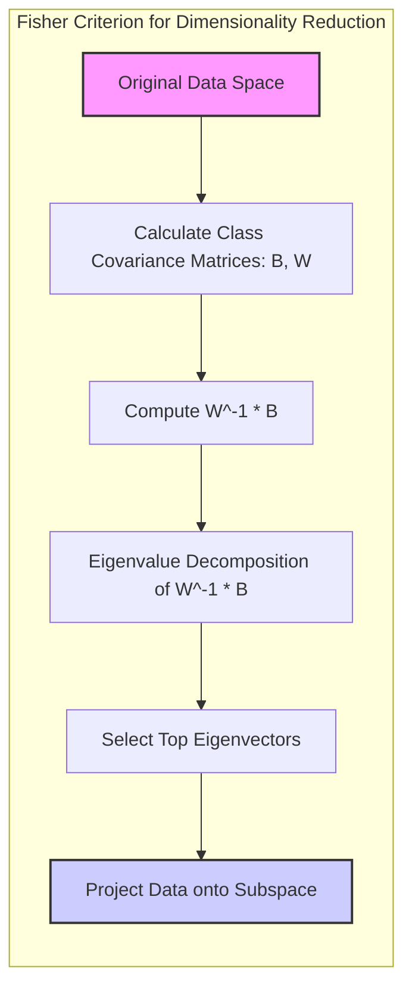
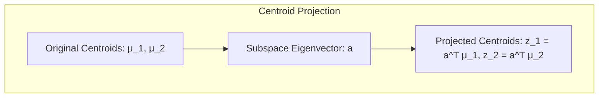
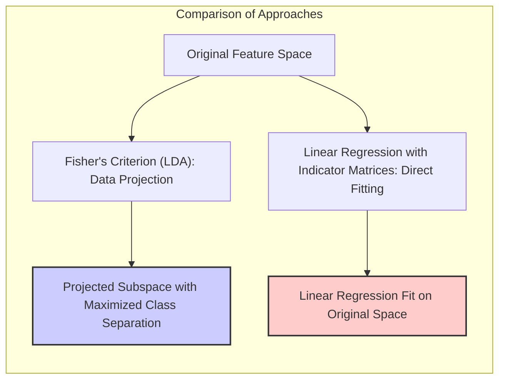
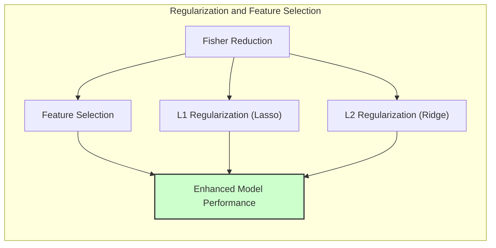
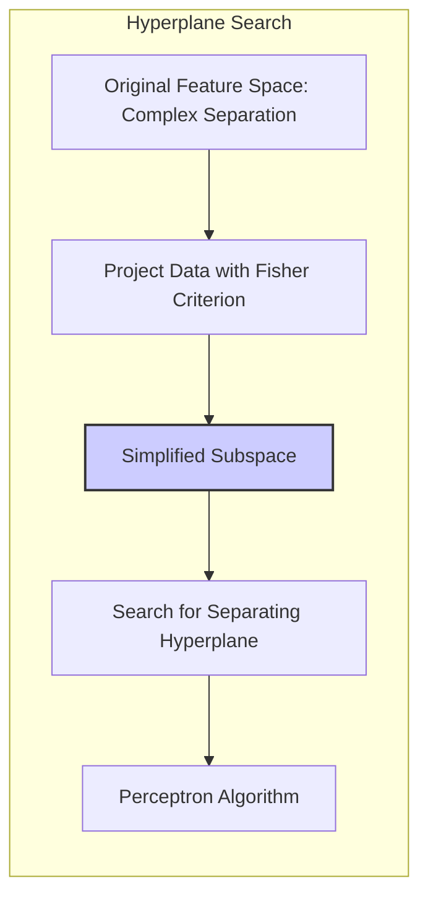
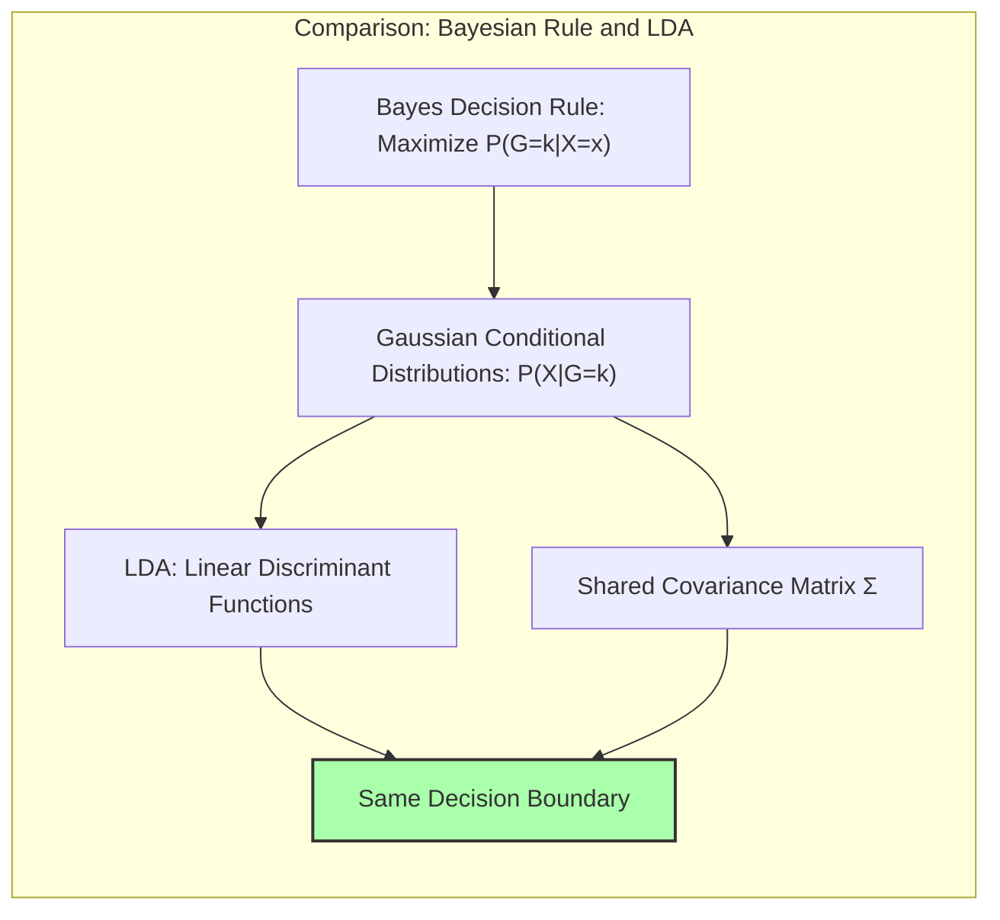

## Título Conciso: Classificação Linear e Redução de Dimensionalidade: Fisher Criterion e Subespaços Discriminantes



### Introdução

Este capítulo explora técnicas de **redução de dimensionalidade** em modelos de classificação linear, com foco no **Critério de Fisher** e como ele pode ser utilizado para projetar os dados em **subespaços informativos** que maximizem a separação entre as classes [^4.3.3]. Analisaremos como a projeção dos centroides das classes em subespaços de menor dimensão pode simplificar o problema de classificação e melhorar a eficiência computacional, sem perda significativa de informação discriminante. Compararemos essa abordagem com a **regressão linear com matrizes de indicadores**, que não utiliza explicitamente a ideia de projeções em subespaços discriminantes [^4.2], e com a **regressão logística**, onde a redução de dimensionalidade pode ser utilizada através da seleção de variáveis [^4.4]. Discutiremos a importância da **seleção de variáveis e regularização** para complementar a redução de dimensionalidade em modelos lineares [^4.4.4], [^4.5]. O conceito de **hiperplanos separadores** e como a redução de dimensionalidade pode afetar a busca por esses hiperplanos também será abordado [^4.5.2]. O objetivo deste capítulo é fornecer uma visão aprofundada de como a redução de dimensionalidade, especialmente através do Critério de Fisher, pode ser utilizada para a construção de modelos de classificação mais eficientes e robustos.

### Conceitos Fundamentais

**Conceito 1: O Critério de Fisher para Redução de Dimensionalidade**

O **Critério de Fisher** é um critério utilizado para encontrar um subespaço de menor dimensão onde as classes estejam o mais separadas possível, em termos de variância [^4.3.3]. O objetivo é maximizar a variância entre classes e minimizar a variância dentro de cada classe. Formalmente, o critério de Fisher busca a projeção $Z = a^T X$ que maximize:

$$
\frac{a^T B a}{a^T W a}
$$

onde $B$ é a matriz de covariância entre classes e $W$ é a matriz de covariância dentro das classes (pooled covariance). A solução para esse problema é dada pelos autovetores correspondentes aos maiores autovalores da matriz $W^{-1}B$, e esses autovetores definem as direções que melhor separam as classes no espaço de entrada [^4.3.3]. O critério de Fisher é uma forma de encontrar os melhores subespaços para a projeção dos dados e para a tomada de decisão.

> 💡 **Exemplo Numérico:**
>
> Vamos considerar um problema de classificação com duas classes e duas características (features). Suponha que temos os seguintes dados para os centroides das classes:
>
> Classe 1: $\mu_1 = [1, 1]^T$
> Classe 2: $\mu_2 = [3, 2]^T$
>
> E as matrizes de covariância:
>
> Matriz de covariância dentro das classes (pooled):
> $W = \begin{bmatrix} 0.5 & 0 \\ 0 & 0.5 \end{bmatrix}$
>
> Matriz de covariância entre classes:
> $B = (\mu_1 - \mu_2)(\mu_1 - \mu_2)^T = \begin{bmatrix} 4 & 2 \\ 2 & 1 \end{bmatrix}$
>
> Calculamos $W^{-1}$:
> $W^{-1} = \begin{bmatrix} 2 & 0 \\ 0 & 2 \end{bmatrix}$
>
> Agora, calculamos $W^{-1}B$:
> $W^{-1}B = \begin{bmatrix} 8 & 4 \\ 4 & 2 \end{bmatrix}$
>
> Os autovalores de $W^{-1}B$ são $\lambda_1 \approx 10$ e $\lambda_2 = 0$, e o autovetor correspondente a $\lambda_1$ é $a_1 \approx [0.894, 0.447]^T$. Este autovetor define a direção no espaço de características original que melhor separa as classes. A projeção dos dados nessa direção maximiza a separação das classes. A projeção seria dada por $Z = a_1^T X$.
>
> Este exemplo numérico mostra como o Critério de Fisher encontra uma direção que maximiza a separação, mesmo em um cenário bidimensional. Em problemas de alta dimensionalidade, essa técnica é ainda mais crucial.

**Lemma 1:** *O critério de Fisher busca maximizar a separação entre as classes através da maximização da variância entre classes e minimização da variância dentro das classes no subespaço projetado.* A prova desse lema é dada pelas condições de otimalidade do problema definido pelo Critério de Fisher.

**Conceito 2: Subespaços Discriminantes e Projeção dos Centroides**

O Critério de Fisher leva à definição de **subespaços discriminantes**, que são subespaços de menor dimensão onde a separação entre as classes é maximizada. No contexto do LDA, esses subespaços são gerados pelos autovetores da matriz $W^{-1}B$ [^4.3.3].  Ao projetar os centroides das classes sobre esses subespaços, é possível simplificar o problema de classificação, pois o número de dimensões consideradas é reduzido sem uma perda significativa de informação discriminante. Após a projeção, a classificação pode ser feita no subespaço projetado, utilizando a mesma regra de decisão do LDA, mas em um espaço de menor dimensão, o que facilita a computação e a visualização dos dados.



> 💡 **Exemplo Numérico:**
>
> Usando os centroides do exemplo anterior, $\mu_1 = [1, 1]^T$ e $\mu_2 = [3, 2]^T$, e o autovetor $a_1 \approx [0.894, 0.447]^T$, podemos projetar os centroides no subespaço discriminante:
>
> $z_1 = a_1^T \mu_1 = [0.894, 0.447] [1, 1]^T \approx 1.341$
>
> $z_2 = a_1^T \mu_2 = [0.894, 0.447] [3, 2]^T \approx 3.576$
>
> No subespaço discriminante de uma dimensão, a distância entre os centroides projetados é $|z_2 - z_1| \approx 2.235$, que representa a separação maximizada entre as classes nesse espaço. A classificação seria feita comparando a projeção de novas amostras $x$ com os valores de $z_1$ e $z_2$.

**Corolário 1:** *A projeção dos centroides das classes em subespaços discriminantes através do Critério de Fisher simplifica o problema de classificação ao reduzir a dimensão do espaço de características sem perda de informação sobre a separação entre as classes.* Este corolário demonstra a importância do subespaço discriminante para eficiência computacional.

**Conceito 3: Interpretação da Redução de Dimensionalidade**

A redução de dimensionalidade, utilizando o Critério de Fisher, pode ser vista como uma forma de remover componentes do espaço de características que não são informativos para a classificação, ou seja, dimensões onde as classes estão sobrepostas e não são bem separadas.  Ao projetar os dados sobre subespaços discriminantes, o modelo se torna mais eficiente e menos sujeito ao *overfitting*.  Essa abordagem pode ser particularmente útil quando o número de variáveis preditoras é muito grande, ou quando o custo computacional da classificação é uma preocupação.

> ⚠️ **Nota Importante**: O Critério de Fisher define os subespaços mais informativos para a classificação, permitindo a construção de modelos lineares de forma mais eficiente.

> ❗ **Ponto de Atenção**: A escolha do número de dimensões do subespaço projetado deve ser feita cuidadosamente através da análise do desempenho do modelo em dados de validação, de forma a encontrar um trade-off entre complexidade e capacidade de generalização.

> ✔️ **Destaque**: O Critério de Fisher permite encontrar subespaços de menor dimensão onde a separação das classes é maximizada, facilitando o processo de classificação.

### Regressão Linear e Mínimos Quadrados para Classificação



A **regressão linear com matrizes de indicadores**, ao contrário do LDA com redução de dimensionalidade utilizando o Critério de Fisher, não utiliza informações sobre a estrutura de covariância dos dados para construir o modelo, e o ajuste do modelo é feito diretamente no espaço de características original [^4.2]. A regressão linear busca ajustar uma função linear para cada classe, sem aplicar transformações nos dados que busquem maximizar a separação entre as classes em um subespaço projetado.

A ausência de redução de dimensionalidade na regressão linear com matrizes de indicadores pode tornar o método menos eficiente em cenários com muitas variáveis preditoras, e também mais sujeito a problemas como o *overfitting* e o "masking".  A regressão linear com matrizes de indicadores também não modela as relações entre as variáveis através da matriz de covariância e não se beneficia da projeção em subespaços discriminantes [^4.2].

Em contrapartida, o LDA, ao aplicar o Critério de Fisher para definir um subespaço de menor dimensão, busca concentrar a informação mais relevante para a classificação, projetando os centroides das classes e as amostras em um subespaço onde a separabilidade é otimizada. Essa projeção permite que o modelo seja mais eficiente computacionalmente e menos suscetível ao overfitting [^4.3.3].

> 💡 **Exemplo Numérico:**
>
> Suponha que temos os seguintes dados para duas classes e duas características:
>
> Classe 1: $X_1 = \begin{bmatrix} 1 & 1 \\ 2 & 1 \\ 1.5 & 1.5 \end{bmatrix}$, $Y_1 = \begin{bmatrix} 1 \\ 1 \\ 1 \end{bmatrix}$
>
> Classe 2: $X_2 = \begin{bmatrix} 3 & 2 \\ 4 & 2.5 \\ 3.5 & 1.5 \end{bmatrix}$, $Y_2 = \begin{bmatrix} 0 \\ 0 \\ 0 \end{bmatrix}$
>
> Para regressão linear com matrizes de indicadores, combinamos todas as amostras:
> $X = \begin{bmatrix} 1 & 1 \\ 2 & 1 \\ 1.5 & 1.5 \\ 3 & 2 \\ 4 & 2.5 \\ 3.5 & 1.5 \end{bmatrix}$, $Y = \begin{bmatrix} 1 \\ 1 \\ 1 \\ 0 \\ 0 \\ 0 \end{bmatrix}$
>
> A regressão linear tenta encontrar um vetor $\beta$ tal que $X\beta \approx Y$. Calculamos $\beta$ usando a fórmula de mínimos quadrados: $\beta = (X^TX)^{-1}X^TY$.
>
> ```python
> import numpy as np
> from sklearn.linear_model import LinearRegression
>
> X = np.array([[1, 1], [2, 1], [1.5, 1.5], [3, 2], [4, 2.5], [3.5, 1.5]])
> Y = np.array([1, 1, 1, 0, 0, 0])
>
> model = LinearRegression()
> model.fit(X, Y)
>
> print("Coeficientes da regressão linear:", model.coef_)
> print("Intercepto da regressão linear:", model.intercept_)
> ```
>
> Isso nos dá um vetor $\beta$ e um intercepto que define um hiperplano no espaço original de duas dimensões. A regressão linear não considera a covariância das classes para otimizar a separação. O LDA, por outro lado, usaria o Critério de Fisher para projetar os dados em um subespaço que maximizaria a separação antes de ajustar um modelo linear.

**Lemma 2:** *A regressão linear com matrizes de indicadores não se beneficia da projeção em subespaços discriminantes através do Critério de Fisher, o que a diferencia de métodos como o LDA que utilizam essa abordagem para melhorar a separabilidade das classes e reduzir a dimensionalidade do problema.* A prova desse lema está na forma como o método de regressão linear ajusta o modelo, sem levar em consideração a distribuição das classes.

**Corolário 2:** *A falta de utilização do Critério de Fisher para a projeção em subespaços discriminantes na regressão linear com matrizes de indicadores pode levar a modelos menos eficientes, especialmente em problemas com muitas variáveis preditoras e onde a separabilidade linear não é evidente no espaço original.* Este corolário destaca como a projeção em subespaços discrimiantes impacta na performance do método.

A regressão linear com matrizes de indicadores, portanto, não explora a redução de dimensionalidade através do Critério de Fisher, o que a distingue de modelos como o LDA, e que resultam em abordagens que são menos eficientes no tratamento de problemas com grandes dimensões, e onde a separabilidade das classes não seja trivial [^4.2], [^4.3.3].

### Métodos de Seleção de Variáveis e Regularização em Classificação



A **seleção de variáveis** e a **regularização** são técnicas importantes para complementar a redução de dimensionalidade através do Critério de Fisher, melhorando a capacidade de generalização e a interpretabilidade dos modelos de classificação [^4.5]. A regularização, em particular, pode ser aplicada para controlar a magnitude dos coeficientes nos subespaços projetados, evitando o *overfitting* e a instabilidade do modelo.

Na **regressão logística**, que busca modelar diretamente a probabilidade posterior, a função de custo regularizada é dada por:

$$
\max_{\beta_0, \beta} \left[ \sum_{i=1}^N \left( y_i (\beta_0 + \beta^T x_i) - \log(1 + e^{\beta_0 + \beta^T x_i}) \right) - \lambda P(\beta) \right]
$$

onde $P(\beta)$ é a penalidade e $\lambda$ é o parâmetro de regularização.  A penalidade **L1** (Lasso) é dada por $P(\beta) = \sum_{j=1}^p |\beta_j|$, e leva à esparsidade dos coeficientes, promovendo a seleção das variáveis mais relevantes [^4.4.4]. A penalidade **L2** (Ridge), dada por $P(\beta) = \sum_{j=1}^p \beta_j^2$, reduz a magnitude dos coeficientes, estabilizando o modelo e evitando o *overfitting* [^4.5].

> 💡 **Exemplo Numérico:**
>
> Vamos considerar a regressão logística com regularização L1 (Lasso). Suponha que temos os seguintes dados:
>
> $X = \begin{bmatrix} 1 & 2 & 3 \\ 1 & 3 & 4 \\ 1 & 4 & 5 \\ 1 & 5 & 6 \\ 2 & 3 & 4 \\ 2 & 4 & 5 \end{bmatrix}$, $Y = \begin{bmatrix} 0 \\ 0 \\ 1 \\ 1 \\ 0 \\ 1 \end{bmatrix}$
>
> Usaremos o scikit-learn para ajustar um modelo de regressão logística com regularização L1:
>
> ```python
> import numpy as np
> from sklearn.linear_model import LogisticRegression
>
> X = np.array([[1, 2, 3], [1, 3, 4], [1, 4, 5], [1, 5, 6], [2, 3, 4], [2, 4, 5]])
> y = np.array([0, 0, 1, 1, 0, 1])
>
> # Regularização L1 (Lasso) com parâmetro lambda = 0.1
> model_l1 = LogisticRegression(penalty='l1', C=1/0.1, solver='liblinear')
> model_l1.fit(X, y)
>
> print("Coeficientes com L1:", model_l1.coef_)
>
> # Regularização L2 (Ridge) com parâmetro lambda = 0.1
> model_l2 = LogisticRegression(penalty='l2', C=1/0.1, solver='liblinear')
> model_l2.fit(X, y)
>
> print("Coeficientes com L2:", model_l2.coef_)
>
> ```
>
> O parâmetro `C` no scikit-learn é o inverso de $\lambda$. A regularização L1 (Lasso) tende a zerar alguns coeficientes, realizando a seleção de variáveis, enquanto a regularização L2 (Ridge) reduz a magnitude dos coeficientes.
>
>  Por exemplo, se os coeficientes com L1 forem `[[0. , 1.2,  0. ]]`, isto significa que a primeira e terceira variáveis foram consideradas irrelevantes e seus coeficientes foram zerados, enquanto a segunda variável tem um coeficiente de 1.2. Já os coeficientes com L2 podem ser `[[0.1, 0.8, 0.5]]`, indicando que todas as variáveis são relevantes, mas seus coeficientes foram reduzidos para evitar overfitting.

A combinação de redução de dimensionalidade com técnicas de regularização é uma forma de otimizar a construção de modelos de classificação robustos e eficientes, explorando os pontos fortes de ambas as abordagens.

**Lemma 3:** *A regularização L1, ao induzir a esparsidade dos coeficientes, complementa a redução de dimensionalidade do Critério de Fisher, levando a modelos mais simples, com melhor capacidade de generalização e com menor custo computacional*. A prova desse lema reside no efeito da penalidade L1 na seleção de variáveis.

**Prova do Lemma 3:** A penalidade L1, ao adicionar um termo que é proporcional ao módulo dos coeficientes na função de custo, força alguns desses coeficientes a se tornarem exatamente zero durante o processo de otimização. A esparsidade leva à seleção de variáveis e à simplificação da estrutura do modelo [^4.4.3], [^4.4.4]. $\blacksquare$

**Corolário 3:** *A combinação de redução de dimensionalidade através do Critério de Fisher com a regularização L1 ou L2 leva à construção de modelos de classificação mais eficientes e robustos, com melhor capacidade de generalização e menor complexidade computacional.* A combinação de métodos distintos ajuda a otimizar o desempenho do modelo.

> ⚠️ **Ponto Crucial**: A seleção de variáveis e a regularização atuam em conjunto com a redução de dimensionalidade para otimizar o processo de classificação, e ambos são componentes fundamentais para a construção de modelos mais eficientes e robustos [^4.5].

### Separating Hyperplanes e Perceptrons



A busca por **hiperplanos separadores** busca uma fronteira linear que maximize a separação entre as classes. Essa busca pode ser feita de forma mais eficiente quando os dados são projetados em subespaços de menor dimensão que separem melhor as classes, como através do Critério de Fisher [^4.5.2]. A projeção dos centroides das classes sobre subespaços informativos através do Critério de Fisher transforma o espaço de características para que um hiperplano separador possa ser encontrado de forma mais eficiente, e que este seja o melhor possível, dadas as características do conjunto de dados.

O algoritmo do **Perceptron** busca encontrar um hiperplano separador ajustando iterativamente os parâmetros do modelo com base nas classificações incorretas [^4.5.1]. Embora o Perceptron não maximize explicitamente a margem de separação, a aplicação do algoritmo após a projeção dos dados através do Critério de Fisher pode facilitar a convergência para um hiperplano que separe as classes no subespaço projetado. Em problemas onde a dimensionalidade é muito alta, a redução de dimensionalidade através do Critério de Fisher pode ser um passo importante para encontrar hiperplanos separadores mais robustos.

> 💡 **Exemplo Numérico:**
>
> Vamos usar os dados do exemplo anterior, com os centroides projetados $z_1 \approx 1.341$ e $z_2 \approx 3.576$. No subespaço de uma dimensão, o Perceptron buscaria um ponto de corte $w$ que separasse as duas classes. Inicializando $w$ com um valor aleatório, o Perceptron atualiza $w$ iterativamente quando classifica os dados incorretamente.
>
> Por exemplo, se $w = 2.0$, o Perceptron classificaria $z_1$ como classe 0 (menor que $w$) e $z_2$ como classe 1 (maior que $w$). Se uma nova amostra com projeção $z = 1.5$ fosse classificada como classe 1, o Perceptron ajustaria $w$ para um valor menor que 2.0 para classificar corretamente essa amostra. Após algumas iterações, o Perceptron convergiria para um valor de $w$ que separa as classes corretamente.
>
> O Perceptron é um algoritmo simples, mas sua convergência pode ser problemática em espaços de alta dimensionalidade. A projeção pelo Critério de Fisher reduz a dimensão e simplifica o problema, facilitando a convergência do Perceptron.

**Teorema:** *A projeção dos dados em subespaços discriminantes através do Critério de Fisher pode simplificar a busca por hiperplanos separadores, e a aplicação do algoritmo do Perceptron, neste espaço projetado, leva a soluções mais eficientes para problemas de alta dimensionalidade.* A projeção simplifica o problema e pode facilitar a separação das classes. [^4.5.1]

### Pergunta Teórica Avançada: Quais as diferenças fundamentais entre a formulação de LDA e a Regra de Decisão Bayesiana considerando distribuições Gaussianas com covariâncias iguais?

**Resposta:**

A **Regra de Decisão Bayesiana** busca classificar uma observação $x$ na classe $k$ que maximize a probabilidade posterior $P(G=k|X=x)$ [^4.3]. Sob a suposição de que as distribuições condicionais $P(X|G=k)$ são Gaussianas com a mesma matriz de covariância $\Sigma$, a probabilidade posterior é dada por:

$$
P(G=k|X=x) = \frac{ \phi(x;\mu_k,\Sigma)\pi_k}{\sum_{l=1}^K \phi(x;\mu_l,\Sigma)\pi_l}
$$

onde $\phi(x;\mu_k,\Sigma)$ é a densidade gaussiana da classe $k$, $\mu_k$ é a média da classe $k$ e $\pi_k$ é a probabilidade a priori da classe $k$. O **LDA**, por sua vez, deriva suas funções discriminantes lineares diretamente dessas mesmas suposições, buscando maximizar a separação entre as classes, no espaço de características, sob as premissas de gaussianidade e igualdade de covariâncias [^4.3].



**Lemma 4:** *Sob a suposição de que as classes seguem distribuições Gaussianas com a mesma matriz de covariância, a regra de decisão Bayesiana e o LDA são equivalentes em termos da fronteira de decisão, e utilizam as informações das médias, covariância, e das probabilidades a priori, e o Critério de Fisher ajuda a projetar os dados em subespaços mais informativos para a separação das classes.*  A equivalência é demonstrada mostrando que o log-ratio das probabilidades posteriores leva à mesma forma da função discriminante do LDA [^4.3].

> 💡 **Exemplo Numérico:**
>
> Suponha que temos duas classes com distribuições Gaussianas com médias $\mu_1 = [1, 1]^T$ e $\mu_2 = [3, 2]^T$, e a mesma matriz de covariância $\Sigma = \begin{bmatrix} 0.5 & 0 \\ 0 & 0.5 \end{bmatrix}$. As probabilidades a priori são $\pi_1 = 0.6$ e $\pi_2 = 0.4$.
>
> A regra de decisão Bayesiana classificaria uma nova amostra $x$ na classe $k$ que maximizasse $P(G=k|X=x)$.  O LDA, sob as mesmas suposições, também levaria à mesma decisão, com uma fronteira linear, definida pela função discriminante de LDA:
>
> $ \delta_k(x) = x^T \Sigma^{-1} \mu_k - \frac{1}{2}\mu_k^T \Sigma^{-1} \mu_k + \log \pi_k$
>
> Substituindo os valores para $k=1$ e $k=2$, e comparando as funções, encontramos que a fronteira de decisão é a mesma que a da regra Bayesiana.

**Corolário 4:** *A remoção da restrição da igualdade de covariâncias na regra de decisão Bayesiana leva ao QDA, que utiliza matrizes de covariância distintas para cada classe e gera fronteiras de decisão quadráticas, o que demonstra o impacto da suposição sobre as covariâncias na forma da fronteira de decisão e na escolha do método mais adequado*. A relaxação da suposição da covariância igual conduz a um problema de otimização distinto. [^4.3.1], [^4.3.3].

> ⚠️ **Ponto Crucial**: A principal diferença entre LDA e a regra de decisão Bayesiana está na abordagem: LDA busca uma solução linear utilizando a premissa gaussiana e de covariâncias iguais, e o log-ratio da regra Bayesiana. Sob essas premissas, ambos os métodos levam ao mesmo resultado e à mesma fronteira de decisão [^4.3].

### Conclusão

Neste capítulo, exploramos a utilização do Critério de Fisher para a redução de dimensionalidade e a projeção dos dados em subespaços discriminantes em modelos de classificação linear. Analisamos como essa abordagem simplifica o problema de classificação ao maximizar a separação entre as classes em um espaço de menor dimensão e vimos como a projeção dos centroides é feita. Discutimos como a regressão linear com matrizes de indicadores não se beneficia dessa abordagem e como a seleção de variáveis e a regularização podem complementar a redução de dimensionalidade e melhorar a capacidade de generalização. A comparação entre LDA e a regra de decisão Bayesiana sob as mesmas suposições também elucidou a conexão teórica entre os métodos. Ao longo do capítulo, procuramos fornecer uma visão clara e detalhada de como a redução de dimensionalidade, especialmente através do Critério de Fisher, pode ser utilizada na prática para construir modelos de classificação linear mais eficientes e robustos.

### Footnotes

[^4.1]: *In this chapter we revisit the classification problem and focus on linear methods for classification...There are several different ways in which linear decision boundaries can be found.*

[^4.2]: *In Chapter 2 we fit linear regression models to the class indicator variables, and classify to the largest fit...Linear inequalities in this space are quadratic inequalities in the original space.*

[^4.3]: *Decision theory for classification (Section 2.4) tells us that we need to know the class posteriors Pr(G|X) for optimal classification. Suppose fk(x) is the class-conditional density of X in class G = k, and let πκ be the prior probability of class k... Linear discriminant analysis (LDA) arises in the special case when we assume that the classes have a common covariance matrix Σk = Σ.*

[^4.3.1]: *The decision boundary between each pair of classes k and l is described by a quadratic equation {x: δκ(x) = δ(x)}.*

[^4.3.2]: *The estimates for QDA are similar to those for LDA, except that separate covariance matrices must be estimated for each class...Their computations are simplified by diagonalizing ∑ or Ék.*

[^4.3.3]: *In the special case when we assume that the classes have a common covariance matrix...When the classes are really Gaussian, then LDA is optimal*

[^4.4]: *The logistic regression model arises from the desire to model the posterior probabilities of the K classes via linear functions in x, while at the same time ensuring that they sum to one and remain in [0,1].*

[^4.4.1]: *Logistic regression models are usually fit by maximum likelihood... The logistic regression model is more general, in that it makes less assumptions.*

[^4.4.2]: *It is convenient to code the two-class gi via a 0/1 response Yi, where yi = 1 when gi = 1, and yi = 0 when gi = 2... Typically many models are fit in a search for a parsimonious model involving a subset of the variables.*

[^4.4.3]: *To maximize the log-likelihood, we set its derivatives to zero. These score equations are...To solve the score equations (4.21), we use the Newton-Raphson algorithm...*

[^4.4.4]: *The L1 penalty used in the lasso (Section 3.4.2) can be used for variable selection and shrinkage with any linear regression model...As with the lasso, we typically do not penalize the intercept term.*

[^4.5]: *Here we present an analysis of binary data to illustrate the traditional statistical use of the logistic regression model... With two classes there is a simple correspondence between linear discriminant analysis and classification by linear least squares, as in (4.5).*

[^4.5.1]: *The perceptron learning algorithm tries to find a separating hyperplane by minimizing the distance of misclassified points to the decision boundary.*

[^4.5.2]: *The optimal separating hyperplane separates the two classes and maximizes the distance to the closest point from either class... In light of (4.40), the constraints define an empty slab or margin around the linear decision boundary...*
