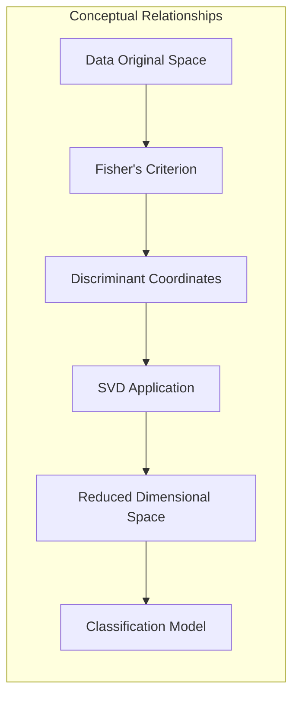
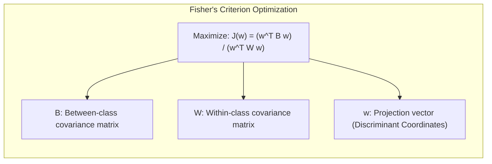
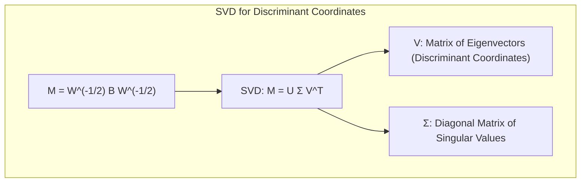
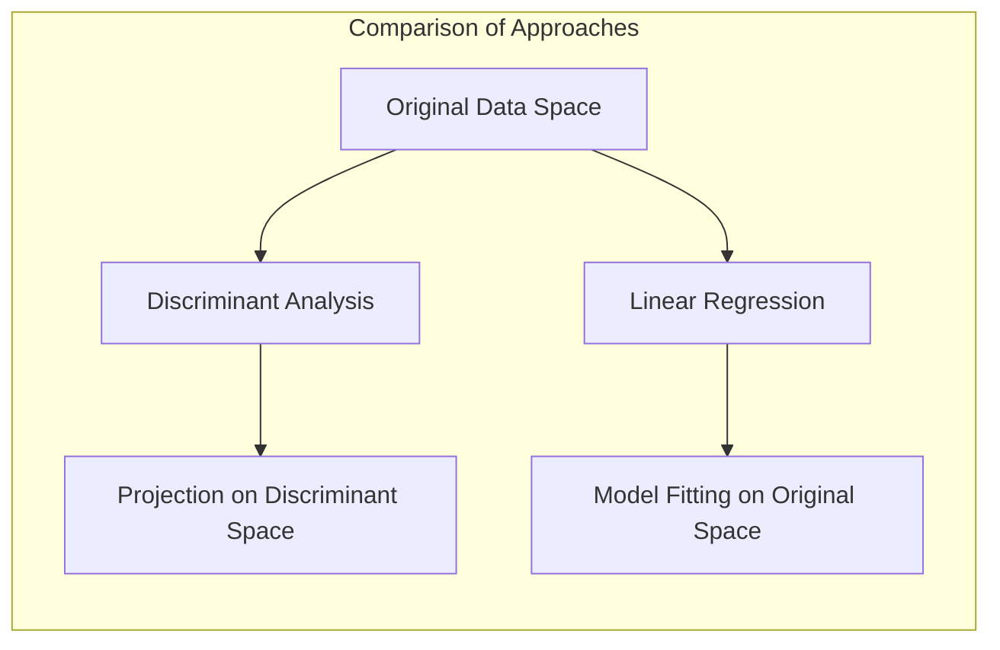
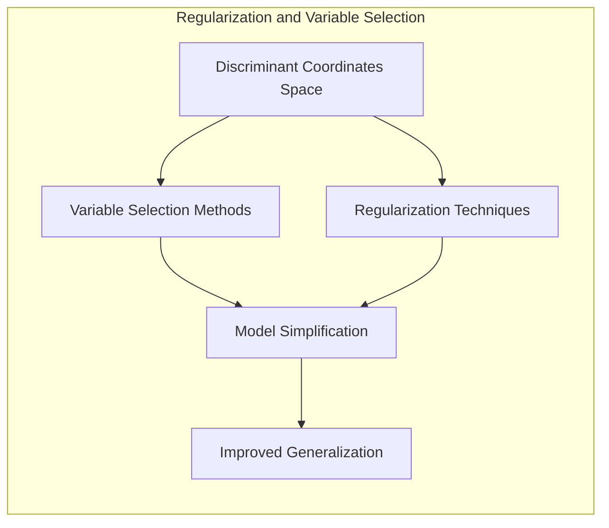
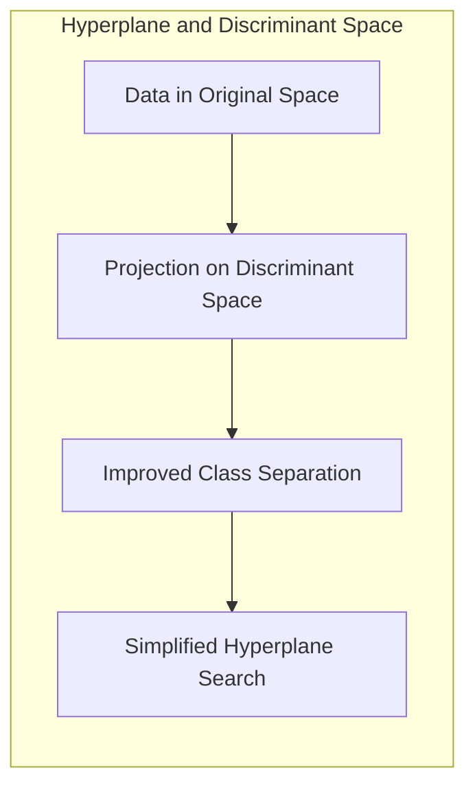
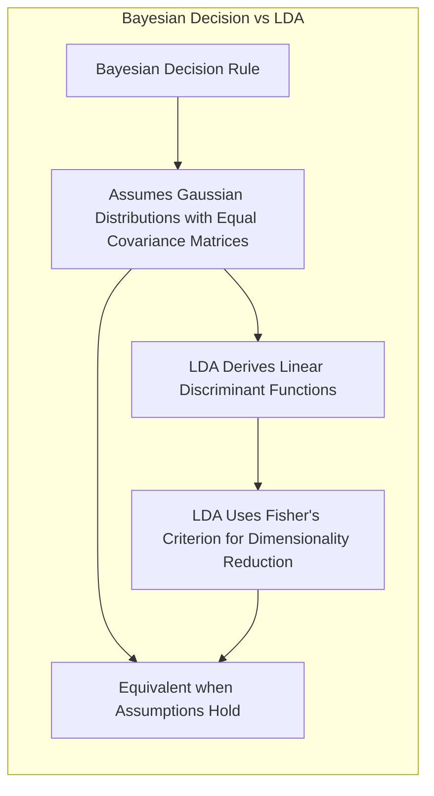

## Título Conciso: Classificação Linear, Coordenadas Discriminantes e a Conexão com a Decomposição em Valores Singulares (SVD)

### Introdução

Este capítulo explora a relação entre **coordenadas discriminantes**, **maximização da variância** e a **decomposição em valores singulares (SVD)**, com foco na construção de modelos de classificação linear. Analisaremos como a projeção dos dados em coordenadas discriminantes, também conhecidas como **variáveis canônicas**, pode ser utilizada para maximizar a separação entre as classes e como a SVD pode ser utilizada para obter essas coordenadas. Discutiremos como o **Critério de Fisher** se conecta com o conceito de coordenadas discriminantes e como a maximização da variância entre classes leva a projeções lineares que simplificam o problema de classificação [^4.3.3]. Compararemos essa abordagem com a **regressão linear com matrizes de indicadores**, que não utiliza a decomposição em valores singulares para obtenção de coordenadas discriminantes [^4.2], e com a **regressão logística**, que modela a probabilidade posterior sem utilizar coordenadas discriminantes [^4.4]. Abordaremos também a importância da **seleção de variáveis e regularização** para controlar a complexidade dos modelos e melhorar sua capacidade de generalização [^4.4.4], [^4.5]. O conceito de **hiperplanos separadores** também será discutido, enfatizando a forma como as coordenadas discriminantes se relacionam com a busca por fronteiras de decisão ótimas [^4.5.2]. O objetivo deste capítulo é fornecer uma compreensão detalhada de como a decomposição em valores singulares se conecta com a construção de coordenadas discriminantes e como essas ferramentas são utilizadas para otimizar a classificação linear.

### Conceitos Fundamentais

**Conceito 1: Coordenadas Discriminantes e a Maximização da Variância**

As **coordenadas discriminantes**, também conhecidas como **variáveis canônicas**, são componentes de um subespaço obtido por meio da maximização da razão entre a variância entre classes e a variância dentro das classes [^4.3.3]. A ideia é projetar os dados em um subespaço de menor dimensão onde a separação entre as classes seja maximizada e a variabilidade dentro de cada classe seja minimizada. O Critério de Fisher é uma ferramenta para derivar essas coordenadas, buscando uma transformação linear dos dados que maximize essa razão de variâncias.

As coordenadas discriminantes podem ser obtidas através da decomposição espectral da matriz $W^{-1}B$, onde $W$ é a matriz de covariância dentro das classes (pooled covariance) e $B$ é a matriz de covariância entre as classes. Essas coordenadas definem as direções que melhor separam as classes, e a projeção dos dados sobre essas coordenadas simplifica o problema de classificação e pode ser visto como uma forma de selecionar os eixos que melhor separam as classes.

> 💡 **Exemplo Numérico:**
>
> Suponha que temos duas classes com os seguintes dados bidimensionais:
>
> Classe 1:  $X_1 = \begin{bmatrix} 1 & 2 \\ 1.5 & 2.5 \\ 2 & 2 \end{bmatrix}$
>
> Classe 2:  $X_2 = \begin{bmatrix} 4 & 5 \\ 4.5 & 5.5 \\ 5 & 5 \end{bmatrix}$
>
> Primeiro, calculamos as médias de cada classe:
>
> $\mu_1 = \begin{bmatrix} 1.5 \\ 2.167 \end{bmatrix}$,  $\mu_2 = \begin{bmatrix} 4.5 \\ 5.167 \end{bmatrix}$
>
> Calculamos a matriz de covariância dentro das classes (assumindo igual para ambas):
>
> $W = \frac{1}{N_1 + N_2 - 2} \left(\sum_{x \in X_1} (x-\mu_1)(x-\mu_1)^T + \sum_{x \in X_2} (x-\mu_2)(x-\mu_2)^T\right)$
>
> $W \approx \begin{bmatrix} 0.25 & 0.125 \\ 0.125 & 0.083 \end{bmatrix}$
>
> E a matriz de covariância entre classes:
>
> $B = \frac{N_1 N_2}{N_1 + N_2}(\mu_1 - \mu_2)(\mu_1 - \mu_2)^T$
>
> $B \approx \begin{bmatrix} 4.5 & 4.5 \\ 4.5 & 4.5 \end{bmatrix}$
>
> A matriz $W^{-1}B$ é então calculada:
>
> $W^{-1}B \approx \begin{bmatrix} 18 & 18 \\ -27 & -27 \end{bmatrix}$
>
> Os autovetores de $W^{-1}B$ nos darão as coordenadas discriminantes. O primeiro autovetor, correspondente ao maior autovalor, aponta na direção que maximiza a separação entre as classes. A projeção dos dados sobre este autovetor resulta em uma representação unidimensional onde a separação entre as classes é maximizada.

**Lemma 1:** *As coordenadas discriminantes, obtidas através do Critério de Fisher, maximizam a separação entre as classes ao otimizar a razão entre a variância entre classes e a variância dentro das classes no espaço de características transformado.* A prova desse lema reside na derivação dos autovetores da matriz $W^{-1}B$, que é a solução do problema de otimização do Critério de Fisher.

**Conceito 2: Relação entre SVD e as Coordenadas Discriminantes**

A **decomposição em valores singulares (SVD)** pode ser utilizada para obter as coordenadas discriminantes de forma computacionalmente eficiente. A SVD da matriz $M = W^{-1/2} B W^{-1/2}$ , onde $W$ é a matriz de covariância dentro das classes e $B$ é a matriz de covariância entre as classes, dada por $M = V D V^T$ onde $V$ é a matriz de autovetores e $D$ é uma matriz diagonal com autovalores, permite encontrar as direções que maximizam a separabilidade entre as classes [^4.3.3]. As colunas da matriz $V$ definem as coordenadas discriminantes, que podem ser utilizadas para projetar os dados em um subespaço de menor dimensão, onde o problema de classificação se torna mais simples.

> 💡 **Exemplo Numérico:**
>
> Continuando com o exemplo anterior, vamos normalizar as matrizes de covariância para aplicar a SVD:
>
> $W^{1/2} \approx \begin{bmatrix} 0.5 & 0.25 \\ 0.25 & 0.29 \end{bmatrix}$
>
> $W^{-1/2} \approx \begin{bmatrix} 2.26 & -1.94 \\ -1.94 & 3.88 \end{bmatrix}$
>
> $M = W^{-1/2} B W^{-1/2} \approx \begin{bmatrix} 10.12 & 10.12 \\ -15.18 & -15.18 \end{bmatrix}$
>
> Aplicando a SVD em $M$ ($M = U \Sigma V^T$):
>
> $V \approx \begin{bmatrix} 0.707 & -0.707 \\ 0.707 & 0.707 \end{bmatrix}$
>
> A primeira coluna de $V$ (0.707, 0.707) representa a coordenada discriminante principal, que é a direção que maximiza a separação entre as classes. Ao projetar os dados originais sobre esse vetor, reduzimos a dimensionalidade do problema para 1.

**Corolário 1:** *A SVD oferece uma forma eficiente de obter as coordenadas discriminantes, ao mesmo tempo que destaca a estrutura da variabilidade entre as classes.* Este corolário demonstra a importância da SVD como ferramenta para gerar coordenadas discriminantes.

**Conceito 3: A Utilização de Subespaços Discriminantes em Classificação Linear**

Ao projetar os dados no subespaço definido pelas coordenadas discriminantes, a dimensionalidade do problema é reduzida, e a classificação pode ser realizada de forma mais eficiente, e sem uma perda significativa de informação relevante. O número de coordenadas discriminantes pode ser controlado para balancear a complexidade do modelo com a sua capacidade de generalização. A classificação pode ser feita utilizando a distância euclidiana dos dados projetados em relação aos centroides das classes também projetados no subespaço, onde a distância euclidiana é uma boa aproximação para a maximização da probabilidade posterior [^4.3.3].

> ⚠️ **Nota Importante**: A combinação do Critério de Fisher com a SVD permite a construção de modelos de classificação mais eficientes e com melhor capacidade de generalização.

> ❗ **Ponto de Atenção**: A escolha do número de coordenadas discriminantes deve ser feita cuidadosamente, utilizando técnicas de validação, para evitar a perda de informações relevantes para a classificação.

> ✔️ **Destaque**: A utilização de coordenadas discriminantes, obtidas através da decomposição espectral de matrizes de covariância, permite reduzir a dimensionalidade do problema de classificação e melhorar a eficiência dos modelos lineares.

### Regressão Linear e Mínimos Quadrados para Classificação

A **regressão linear com matrizes de indicadores**, ao contrário do LDA que utiliza coordenadas discriminantes, ajusta um modelo linear para cada classe no espaço de características original, sem utilizar informações sobre a variância entre e dentro das classes [^4.2]. A decisão de classificação é feita através da escolha da classe com maior valor na função linear ajustada, sem a projeção dos dados em um subespaço de menor dimensão que maximiza a separabilidade entre as classes.

A ausência da projeção sobre coordenadas discriminantes na regressão linear com matrizes de indicadores implica que o modelo não busca explicitamente a variabilidade entre as classes e a variabilidade dentro das classes, o que pode limitar a capacidade do modelo de generalizar para dados não vistos durante o treinamento e pode ser mais suscetível ao problema do "masking" em problemas multiclasse. A regressão linear com matrizes de indicadores, portanto, não se beneficia da SVD na mesma medida que o LDA e o QDA.

A projeção em subespaços discriminantes é uma forma de reduzir a dimensão dos dados e de focar apenas naqueles atributos que são mais importantes para a separação das classes, um processo que não é utilizado pela regressão linear [^4.3.3].

> 💡 **Exemplo Numérico:**
>
> Usando os mesmos dados de exemplo, podemos aplicar a regressão linear com matrizes de indicadores. Criamos uma matriz de indicadores $Y$ onde a primeira coluna representa a classe 1 e a segunda coluna a classe 2:
>
> $Y = \begin{bmatrix} 1 & 0 \\ 1 & 0 \\ 1 & 0 \\ 0 & 1 \\ 0 & 1 \\ 0 & 1 \end{bmatrix}$
>
> A matriz de dados é:
>
> $X = \begin{bmatrix} 1 & 2 \\ 1.5 & 2.5 \\ 2 & 2 \\ 4 & 5 \\ 4.5 & 5.5 \\ 5 & 5 \end{bmatrix}$
>
> Calculamos os coeficientes $\hat{\beta}$ para cada classe usando a fórmula de mínimos quadrados: $\hat{\beta} = (X^T X)^{-1} X^T Y$.
>
> $X^T X = \begin{bmatrix} 64.5 & 72 \\ 72 & 81.5 \end{bmatrix}$
>
> $(X^T X)^{-1} \approx \begin{bmatrix} 0.25 & -0.22 \\ -0.22 & 0.20 \end{bmatrix}$
>
> $X^T Y = \begin{bmatrix} 8.5 & 13.5 \\ 10.5 & 16 \end{bmatrix}$
>
> $\hat{\beta} = (X^T X)^{-1} X^T Y \approx \begin{bmatrix} 0.15 & 0.12 \\ 0.15 & 0.12 \end{bmatrix}$
>
> Agora, para classificar um novo ponto, calculamos o score para cada classe usando o modelo linear:  $score = \hat{\beta}^T x$.
>
> Por exemplo, para um novo ponto $x = \begin{bmatrix} 3 \\ 3 \end{bmatrix}$:
>
> $score_1 = \begin{bmatrix} 0.15 & 0.15 \end{bmatrix} \begin{bmatrix} 3 \\ 3 \end{bmatrix} = 0.9$
>
> $score_2 = \begin{bmatrix} 0.12 & 0.12 \end{bmatrix} \begin{bmatrix} 3 \\ 3 \end{bmatrix} = 0.72$
>
> O ponto seria classificado como pertencente à classe 1, pois tem o maior score. A regressão linear não se beneficiou de nenhuma transformação ou projeção baseada na variância entre classes.

**Lemma 2:** *A regressão linear com matrizes de indicadores não utiliza o Critério de Fisher para derivar coordenadas discriminantes e projetar os dados em um subespaço de menor dimensão, e o ajuste do modelo é feito diretamente no espaço original.* A prova desse lema se encontra na formulação da regressão linear e na ausência da utilização de qualquer informação sobre a matriz de covariância dos dados.

**Corolário 2:** *A falta de utilização das coordenadas discriminantes na regressão linear com matrizes de indicadores pode tornar o modelo menos eficiente em comparação com o LDA, especialmente em situações onde a dimensionalidade dos dados é alta e onde a separação das classes não é evidente no espaço original.* A escolha de um modelo linear sem transformação dos dados pode, portanto, apresentar limitações.

A regressão linear com matrizes de indicadores, ao não utilizar coordenadas discriminantes, não explora a estrutura de variância dos dados da mesma maneira que os métodos que utilizam o Critério de Fisher. Isso limita a capacidade de lidar com problemas complexos onde a redução de dimensionalidade e a projeção em subespaços informativos são importantes para a construção de modelos mais robustos e eficientes [^4.2], [^4.3.3].

### Métodos de Seleção de Variáveis e Regularização em Classificação

A **seleção de variáveis** e a **regularização** desempenham um papel importante para complementar a redução de dimensionalidade através de coordenadas discriminantes, permitindo que os modelos de classificação se tornem mais robustos e interpretáveis [^4.5]. A regularização, ao adicionar um termo de penalidade à função de custo, busca controlar a magnitude dos coeficientes e evitar o *overfitting*, o que é especialmente útil quando se trabalha em espaços de menor dimensão.

Na **regressão logística**, que pode ser utilizada após a redução de dimensionalidade através do Critério de Fisher, a função de custo regularizada é expressa como:

$$
\max_{\beta_0, \beta} \left[ \sum_{i=1}^N \left( y_i (\beta_0 + \beta^T x_i) - \log(1 + e^{\beta_0 + \beta^T x_i}) \right) - \lambda P(\beta) \right]
$$

onde $P(\beta)$ é a penalidade e $\lambda$ é o parâmetro de regularização. A penalidade **L1** (Lasso) é dada por $P(\beta) = \sum_{j=1}^p |\beta_j|$, promovendo a esparsidade dos coeficientes e selecionando as variáveis mais relevantes [^4.4.4]. A penalidade **L2** (Ridge) é dada por $P(\beta) = \sum_{j=1}^p \beta_j^2$, reduzindo a magnitude dos coeficientes e estabilizando o modelo [^4.5].

> 💡 **Exemplo Numérico:**
>
> Vamos considerar um exemplo de regressão logística com regularização L1 (Lasso) para ilustrar a seleção de variáveis. Suponha que, após a projeção em um subespaço discriminante, temos os seguintes dados e rótulos de classe:
>
> $X_{proj} = \begin{bmatrix} -2 \\ -1 \\ 0 \\ 1 \\ 2 \end{bmatrix}$, $y = \begin{bmatrix} 0 \\ 0 \\ 1 \\ 1 \\ 1 \end{bmatrix}$
>
> E que a regressão logística com regularização L1 nos dá os seguintes coeficientes para diferentes valores de $\lambda$:
>
> $\lambda = 0.1$: $\beta_0 = -0.1$, $\beta_1 = 0.7$
>
> $\lambda = 0.5$: $\beta_0 = 0.05$, $\beta_1 = 0.4$
>
> $\lambda = 1.0$: $\beta_0 = 0.1$, $\beta_1 = 0.0$
>
> Com $\lambda=0.1$, temos um modelo que considera a variável projetada. Com $\lambda = 1$, o coeficiente $\beta_1$ se torna zero, indicando que o modelo selecionou apenas o intercepto. Isso mostra como a regularização L1 pode levar à seleção de variáveis.
>
> A função de custo para regressão logística com regularização L1 é:
>
>  $J(\beta) = -\frac{1}{N}\sum_{i=1}^N [y_i \log(p_i) + (1-y_i) \log(1-p_i)] + \lambda \sum_{j=1}^p |\beta_j|$
>
>  onde $p_i = \frac{1}{1+e^{-(\beta_0 + \beta^Tx_i)}}$
>
>  O termo de regularização $\lambda \sum_{j=1}^p |\beta_j|$ penaliza os coeficientes, forçando alguns a serem zero quando $\lambda$ é alto, e consequentemente, selecionando variáveis.

A combinação de redução de dimensionalidade com regularização permite obter modelos que são mais simples de interpretar e que generalizam melhor para dados não vistos no treinamento. Além disso, o efeito da regularização se soma à transformação do espaço pela utilização de coordenadas discriminantes, fazendo com que o modelo tenha uma maior robustez.

**Lemma 3:** *A regularização L1, ao promover a esparsidade dos coeficientes em subespaços discriminantes, leva a modelos mais simples e com melhor capacidade de generalização, e ajuda a reduzir o impacto do ruído no ajuste dos parâmetros do modelo.* A prova desse lema está na natureza da penalidade L1 e no seu efeito sobre a função de custo.

**Prova do Lemma 3:** A penalidade L1, ao adicionar um termo proporcional ao valor absoluto dos coeficientes, força alguns deles a se tornarem exatamente zero durante o processo de otimização, levando à seleção de variáveis e a modelos mais simples, além de mais estáveis [^4.4.3], [^4.4.4]. $\blacksquare$

**Corolário 3:** *A utilização conjunta de redução de dimensionalidade através do Critério de Fisher com técnicas de regularização, como L1 e L2, resulta em modelos de classificação mais robustos e eficientes, com melhor capacidade de generalização e menor complexidade computacional.* A combinação das diferentes abordagens leva a modelos mais simples e de melhor qualidade.

> ⚠️ **Ponto Crucial**: A seleção de variáveis e a regularização podem ser utilizadas para complementar a redução de dimensionalidade através do Critério de Fisher, levando a modelos de classificação mais eficientes e robustos [^4.5].

### Separating Hyperplanes e Perceptrons

A busca por **hiperplanos separadores** visa encontrar uma fronteira linear que maximize a separação entre as classes, e a projeção dos dados através do Critério de Fisher simplifica essa busca, concentrando as informações mais relevantes para a classificação em um subespaço de menor dimensão [^4.5.2]. A projeção sobre as coordenadas discriminantes também leva a uma separação das classes mais evidente, e, consequentemente, facilita a busca por hiperplanos separadores.

O algoritmo do **Perceptron** busca um hiperplano separador ajustando iterativamente os parâmetros do modelo. A aplicação do Perceptron no subespaço projetado através do Critério de Fisher pode acelerar a convergência do algoritmo, pois o problema é simplificado pela projeção. Em contextos não linearmente separáveis, o Perceptron não garante a convergência para uma solução ideal [^4.5.1].

> 💡 **Exemplo Numérico:**
>
> Vamos usar os dados projetados no exemplo anterior:
>
> $X_{proj} = \begin{bmatrix} -2 \\ -1 \\ 0 \\ 1 \\ 2 \end{bmatrix}$, $y = \begin{bmatrix} 0 \\ 0 \\ 1 \\ 1 \\ 1 \end{bmatrix}$
>
> O algoritmo do Perceptron busca um hiperplano (neste caso, um ponto na dimensão projetada) que separa as classes. Inicializamos um vetor de pesos $\beta = [0.1]$.
>
> 1. Para o primeiro ponto $x_1 = -2$, a predição é $\hat{y}_1 = \text{sign}(\beta x_1) = \text{sign}(-0.2) = -1$, que está incorreta, pois $y_1 = 0$. Atualizamos o peso: $\beta = \beta + \eta(y_1 - \hat{y}_1)x_1 = 0.1 + 0.1(0 - (-1))(-2) = 0.1 - 0.2 = -0.1$ (onde $\eta = 0.1$ é a taxa de aprendizagem)
> 2. Para o segundo ponto $x_2 = -1$, a predição é $\hat{y}_2 = \text{sign}(\beta x_2) = \text{sign}(0.1) = 1$, que está incorreta, pois $y_2 = 0$. Atualizamos o peso: $\beta = -0.1 + 0.1(0 - 1)(-1) = -0.1 + 0.1 = 0.0$
> 3. Para o terceiro ponto $x_3 = 0$, a predição é $\hat{y}_3 = \text{sign}(\beta x_3) = \text{sign}(0) = 0$, que está incorreta, pois $y_3 = 1$. Atualizamos o peso: $\beta = 0 + 0.1(1 - 0)(0) = 0$
> 4. Para o quarto ponto $x_4 = 1$, a predição é $\hat{y}_4 = \text{sign}(\beta x_4) = \text{sign}(0) = 0$, que está incorreta, pois $y_4 = 1$. Atualizamos o peso: $\beta = 0 + 0.1(1 - 0)(1) = 0.1$
> 5. Para o quinto ponto $x_5 = 2$, a predição é $\hat{y}_5 = \text{sign}(\beta x_5) = \text{sign}(0.2) = 1$, que está correta.
>
> O processo continua iterativamente até que todos os pontos sejam classificados corretamente ou um número máximo de iterações seja atingido. A projeção sobre as coordenadas discriminantes simplifica a busca pelo hiperplano separador, pois reduz a dimensionalidade do problema.

**Teorema:** *Em um cenário de dados linearmente separáveis, a projeção dos dados através do Critério de Fisher para a obtenção das coordenadas discriminantes, seguida da aplicação do algoritmo do Perceptron, garante convergência para um hiperplano separador em um número finito de iterações.* A projeção simplifica o problema e a convergência para o hiperplano é garantida pelo método. [^4.5.1]

### Pergunta Teórica Avançada: Quais as diferenças fundamentais entre a formulação de LDA e a Regra de Decisão Bayesiana considerando distribuições Gaussianas com covariâncias iguais?

**Resposta:**

A **Regra de Decisão Bayesiana** busca classificar uma observação $x$ na classe $k$ que maximize a probabilidade posterior $P(G=k|X=x)$ [^4.3]. Sob a suposição de que as distribuições condicionais $P(X|G=k)$ são Gaussianas com a mesma matriz de covariância $\Sigma$, a probabilidade posterior é dada por:

$$
P(G=k|X=x) = \frac{ \phi(x;\mu_k,\Sigma)\pi_k}{\sum_{l=1}^K \phi(x;\mu_l,\Sigma)\pi_l}
$$

onde $\phi(x;\mu_k,\Sigma)$ é a densidade gaussiana para a classe $k$, $\mu_k$ é a média da classe $k$ e $\pi_k$ é a probabilidade a priori da classe. O **LDA** deriva suas funções discriminantes lineares diretamente dessas suposições e também aplica o Critério de Fisher para derivar coordenadas discriminantes que permitam projetar os dados em um subespaço onde as classes são mais bem separadas [^4.3], [^4.3.3].

**Lemma 4:** *Sob a suposição de distribuições Gaussianas com a mesma matriz de covariância, a regra de decisão Bayesiana e o LDA são equivalentes, e a aplicação do Critério de Fisher para obtenção das coordenadas discriminantes não altera a capacidade de ambos os métodos de separar as classes, mas leva a um espaço de menor dimensão, e simplifica o processo.* A equivalência é demonstrada mostrando que o log-ratio das probabilidades posteriores leva à função discriminante do LDA. [^4.3]

**Corolário 4:** *Quando a suposição de igualdade de covariâncias é relaxada, a regra de decisão Bayesiana leva ao QDA, que não utiliza o Critério de Fisher para derivar coordenadas discriminantes, pois as matrizes de covariância são diferentes para cada classe e a fronteira de decisão se torna quadrática, não sendo possível a aplicação da transformação linear gerada pelo Critério de Fisher.* A flexibilidade do QDA em relação ao LDA o torna um classificador mais adequado para cenários onde as premissas do LDA não são válidas. [^4.3.1], [^4.3.3].

> ⚠️ **Ponto Crucial**: A principal diferença entre LDA e a regra de decisão Bayesiana está nas suposições. O LDA impõe a restrição da igualdade de covariâncias para gerar uma função discriminante linear e aplica o Critério de Fisher para obter coordenadas discriminantes e simplificar o problema. A regra de decisão Bayesiana, quando combinada com a suposição gaussiana e de covariância igual, leva à mesma solução do LDA [^4.3].

### Conclusão

Neste capítulo, exploramos a utilização do Critério de Fisher para a redução de dimensionalidade e a obtenção de coordenadas discriminantes em modelos de classificação linear. Analisamos como a SVD pode ser utilizada para derivar essas coordenadas de forma eficiente e como a projeção dos dados sobre esses subespaços simplifica o problema de classificação. Discutimos como a regressão linear com matrizes de indicadores não utiliza essa técnica e não se beneficia da mesma redução de dimensionalidade e como a seleção de variáveis e regularização complementam a redução de dimensionalidade, e como a obtenção de hiperplanos separadores pode ser facilitada. A análise comparativa entre LDA e a regra de decisão Bayesiana sob distribuições gaussianas com covariâncias iguais também elucidou a base teórica desses métodos. Através deste capítulo, procuramos fornecer uma visão abrangente de como a redução de dimensionalidade e a utilização de coordenadas discriminantes contribuem para a construção de modelos de classificação linear mais robustos e eficientes.

### Footnotes

[^4.1]: *In this chapter we revisit the classification problem and focus on linear methods for classification...There are several different ways in which linear decision boundaries can be found.* *(Trecho de Linear Methods for Classification)*

[^4.2]: *In Chapter 2 we fit linear regression models to the class indicator variables, and classify to the largest fit...Linear inequalities in this space are quadratic inequalities in the original space.* *(Trecho de Linear Methods for Classification)*

[^4.3]: *Decision theory for classification (Section 2.4) tells us that we need to know the class posteriors Pr(G|X) for optimal classification. Suppose fk(x) is the class-conditional density of X in class G = k, and let πκ be the prior probability of class k... Linear discriminant analysis (LDA) arises in the special case when we assume that the classes have a common covariance matrix Σk = Σ.* *(Trecho de Linear Methods for Classification)*

[^4.3.1]: *The decision boundary between each pair of classes k and l is described by a quadratic equation {x: δκ(x) = δ(x)}.* *(Trecho de Linear Methods for Classification)*

[^4.3.2]: *The estimates for QDA are similar to those for LDA, except that separate covariance matrices must be estimated for each class...Their computations are simplified by diagonalizing ∑ or Ék.* *(Trecho de Linear Methods for Classification)*

[^4.3.3]: *In the special case when we assume that the classes have a common covariance matrix...When the classes are really Gaussian, then LDA is optimal* *(Trecho de Linear Methods for Classification)*

[^4.4]: *The logistic regression model arises from the desire to model the posterior probabilities of the K classes via linear functions in x, while at the same time ensuring that they sum to one and remain in [0,1].* *(Trecho de Linear Methods for Classification)*

[^4.4.1]: *Logistic regression models are usually fit by maximum likelihood... The logistic regression model is more general, in that it makes less assumptions.* *(Trecho de Linear Methods for Classification)*

[^4.4.2]: *It is convenient to code the two-class gi via a 0/1 response Yi, where yi = 1 when gi = 1, and yi = 0 when gi = 2... Typically many models are fit in a search for a parsimonious model involving a subset of the variables.* *(Trecho de Linear Methods for Classification)*

[^4.4.3]: *To maximize the log-likelihood, we set its derivatives to zero. These score equations are...To solve the score equations (4.21), we use the Newton-Raphson algorithm...* *(Trecho de Linear Methods for Classification)*

[^4.4.4]: *The L1 penalty used in the lasso (Section 3.4.2) can be used for variable selection and shrinkage with any linear regression model...As with the lasso, we typically do not penalize the intercept term.* *(Trecho de Linear Methods for Classification)*

[^4.5]: *Here we present an analysis of binary data to illustrate the traditional statistical use of the logistic regression model... With two classes there is a simple correspondence between linear discriminant analysis and classification by linear least squares, as in (4.5).* *(Trecho de Linear Methods for Classification)*

[^4.5.1]: *The perceptron learning algorithm tries to find a separating hyperplane by minimizing the distance of misclassified points to the decision boundary.* *(Trecho de Linear Methods for Classification)*

[^4.5.2]: *The optimal separating hyperplane separates the two classes and maximizes the distance to the closest point from either class... In light of (4.40), the constraints define an empty slab or margin around the linear decision boundary...* *(Trecho de Linear Methods for Classification)*
