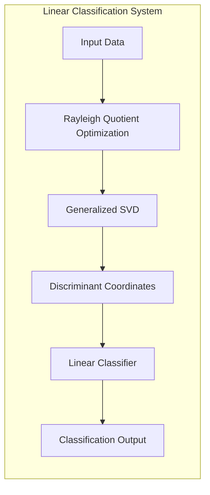
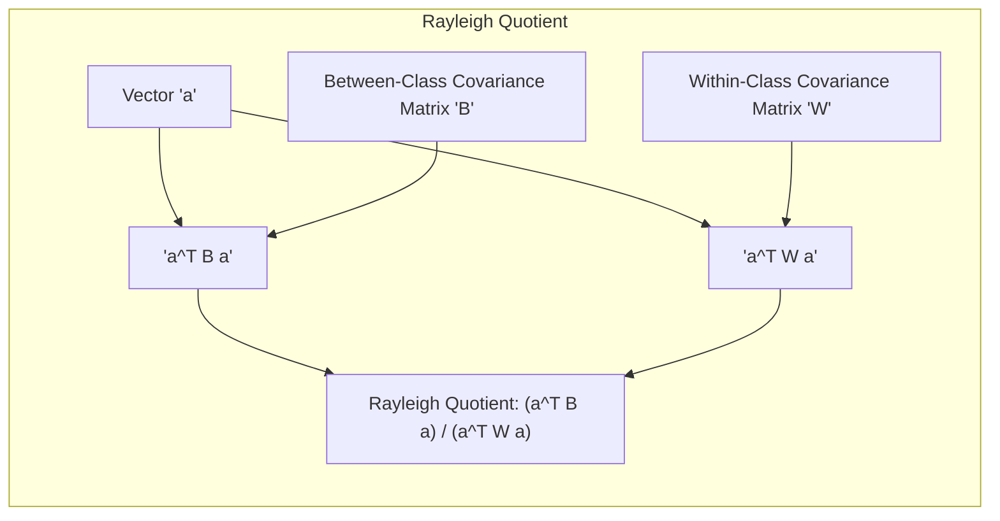
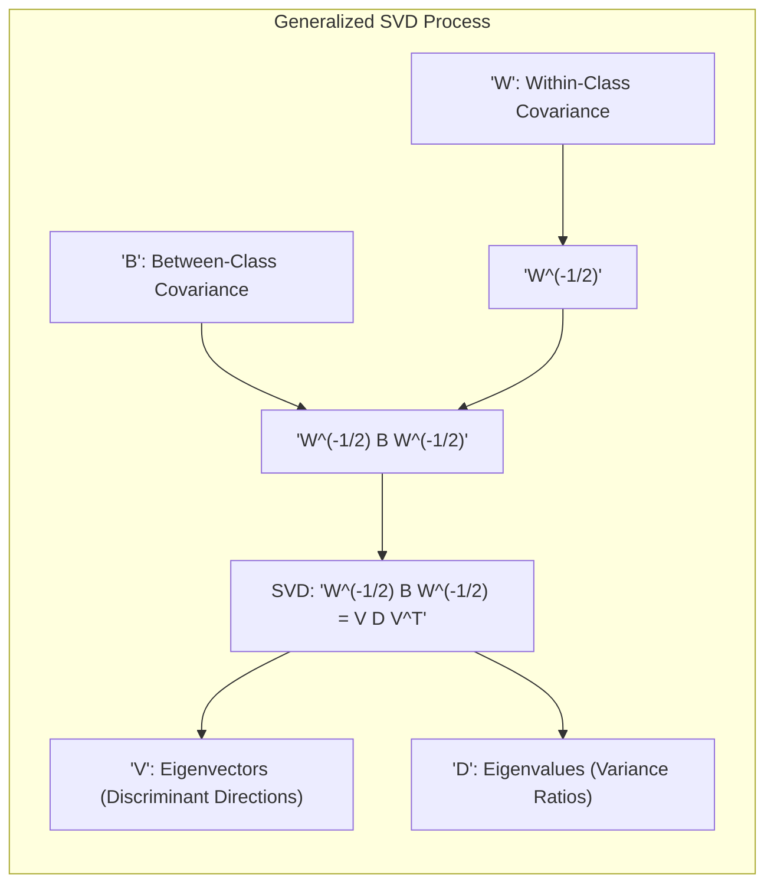
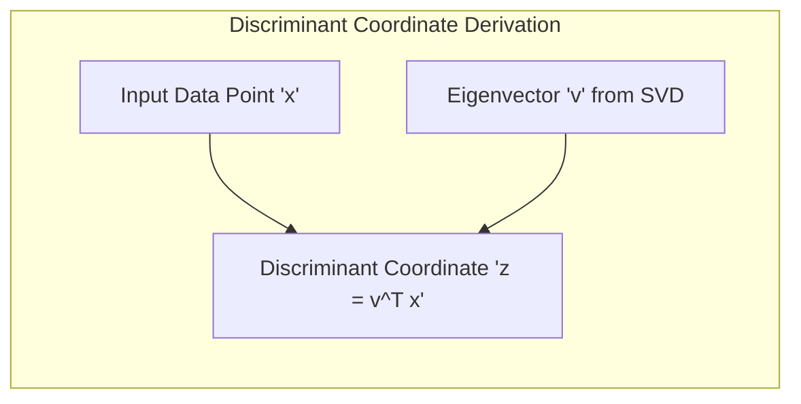
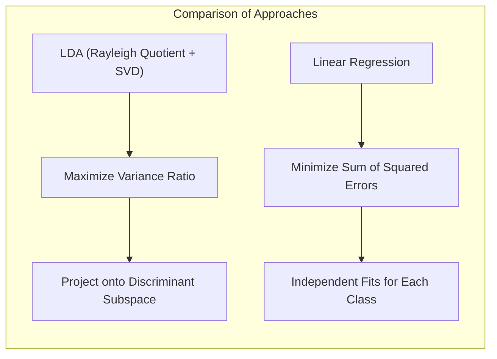
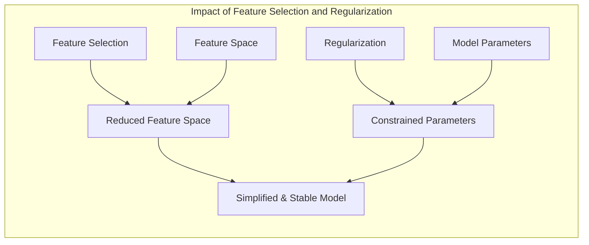
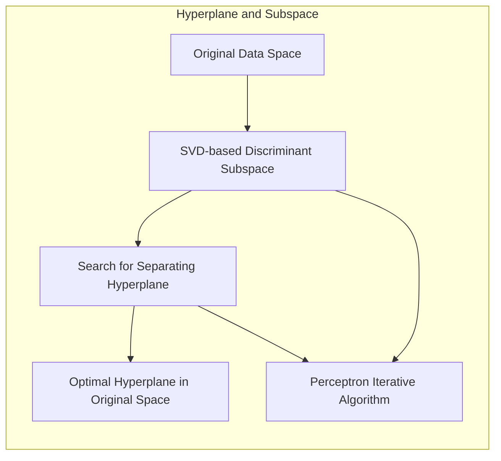
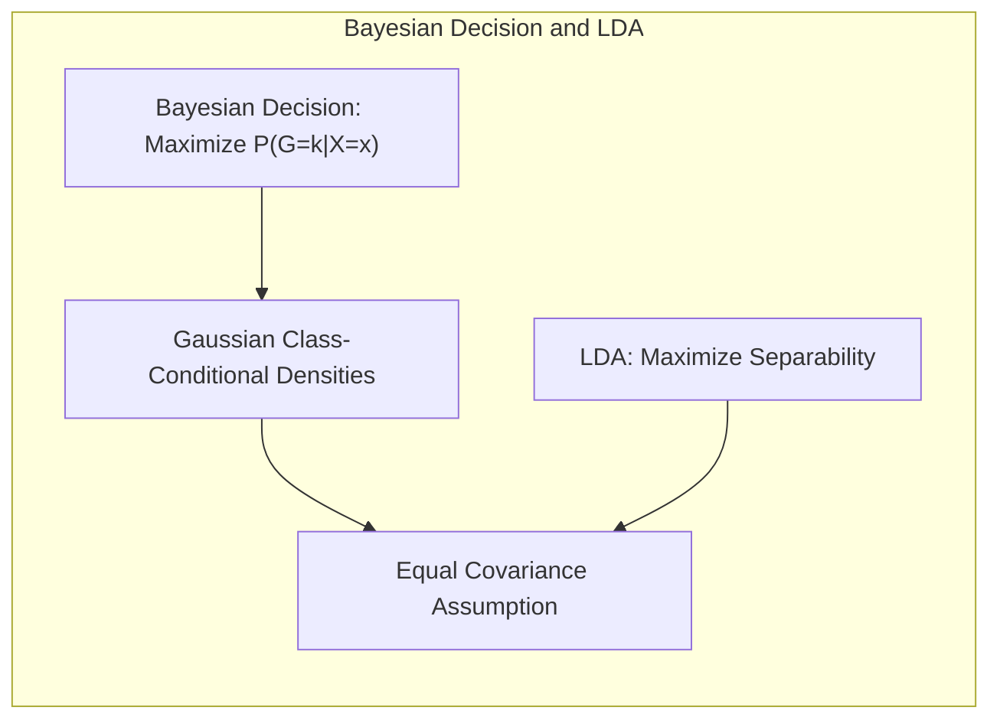

## Título Conciso: Classificação Linear e Otimização: Rayleigh Quociente e Generalização da SVD



### Introdução

Este capítulo explora a fundo o problema de otimização que envolve o **Rayleigh quociente**, e como a **decomposição em valores singulares (SVD) generalizada** pode ser utilizada para encontrar a solução para esse problema, construindo modelos lineares de classificação. Analisaremos como o **Critério de Fisher**, que busca maximizar a razão entre variância entre classes e variância dentro das classes, pode ser reformulado como um problema de maximização de um Rayleigh quociente. Discutiremos como a SVD generalizada, que permite a decomposição de matrizes não quadráticas, pode ser utilizada para encontrar as direções que maximizam o Rayleigh quociente, o que leva à identificação das **coordenadas discriminantes**, também conhecidas como **variáveis canônicas** [^4.3.3]. Compararemos essa abordagem com a **regressão linear com matrizes de indicadores**, que não utiliza o conceito de Rayleigh quociente para derivar a fronteira de decisão, e com a **regressão logística**, que utiliza a maximização da verossimilhança [^4.2], [^4.4]. Abordaremos também a importância da **seleção de variáveis e regularização** para controlar a complexidade dos modelos e garantir a sua estabilidade [^4.4.4], [^4.5].  Exploraremos como a busca por **hiperplanos separadores** se conecta com o problema de otimização do Rayleigh quociente [^4.5.2]. O objetivo deste capítulo é fornecer uma compreensão detalhada de como a otimização do Rayleigh quociente e a SVD generalizada são utilizadas na construção de modelos de classificação linear.

### Conceitos Fundamentais

**Conceito 1: O Rayleigh Quociente e a Maximização da Separabilidade**

O **Rayleigh quociente** é uma função que, quando aplicada a um vetor $a$, representa a razão entre duas formas quadráticas envolvendo matrizes simétricas. No contexto de classificação linear, o Rayleigh quociente é definido como:

$$
\frac{a^T B a}{a^T W a}
$$

onde $B$ é a matriz de covariância entre classes e $W$ é a matriz de covariância dentro das classes (pooled covariance).  A maximização desse quociente busca encontrar as direções $a$ que maximizem a variância entre as médias das classes, em relação à variância dentro das classes, que é a ideia central do Critério de Fisher.  A solução para esse problema de otimização é dada pelos autovetores correspondentes aos maiores autovalores da matriz $W^{-1}B$, e que definem os eixos que melhor separam as classes no espaço de entrada [^4.3.3]. O Rayleigh quociente é uma forma de quantificar a qualidade da projeção.

> 💡 **Exemplo Numérico:**
>
> Suponha que temos duas classes, com médias $\mu_1 = [1, 1]^T$ e $\mu_2 = [3, 3]^T$.  A matriz de covariância dentro das classes é $W = \begin{bmatrix} 1 & 0 \\ 0 & 1 \end{bmatrix}$. A matriz de covariância entre classes, $B$, é dada por $B = (\mu_1 - \mu_2)(\mu_1 - \mu_2)^T = \begin{bmatrix} 4 & 4 \\ 4 & 4 \end{bmatrix}$.
>
> Para um vetor arbitrário $a = [1, 0]^T$, temos:
>
> $a^T B a = \begin{bmatrix} 1 & 0 \end{bmatrix} \begin{bmatrix} 4 & 4 \\ 4 & 4 \end{bmatrix} \begin{bmatrix} 1 \\ 0 \end{bmatrix} = 4$
>
> $a^T W a = \begin{bmatrix} 1 & 0 \end{bmatrix} \begin{bmatrix} 1 & 0 \\ 0 & 1 \end{bmatrix} \begin{bmatrix} 1 \\ 0 \end{bmatrix} = 1$
>
> O Rayleigh quociente é $\frac{4}{1} = 4$.
>
> Agora, considere o vetor $a = [1, 1]^T$ (que está na direção da diferença entre as médias das classes):
>
> $a^T B a = \begin{bmatrix} 1 & 1 \end{bmatrix} \begin{bmatrix} 4 & 4 \\ 4 & 4 \end{bmatrix} \begin{bmatrix} 1 \\ 1 \end{bmatrix} = 16$
>
> $a^T W a = \begin{bmatrix} 1 & 1 \end{bmatrix} \begin{bmatrix} 1 & 0 \\ 0 & 1 \end{bmatrix} \begin{bmatrix} 1 \\ 1 \end{bmatrix} = 2$
>
> O Rayleigh quociente é $\frac{16}{2} = 8$.
>
> Este exemplo ilustra como o Rayleigh quociente varia de acordo com a direção de $a$. A maximização busca o vetor $a$ que maximiza essa razão, e esse vetor define a direção que melhor separa as classes.



**Lemma 1:** *O Rayleigh quociente quantifica a razão entre variância entre classes e a variância dentro das classes em um determinado subespaço, e a sua maximização busca a projeção que maximize a separabilidade entre classes.* A prova deste lema se encontra nas condições de otimalidade do Rayleigh quociente.

**Conceito 2: SVD Generalizada e a Solução do Problema de Otimização**

A **decomposição em valores singulares (SVD) generalizada** é uma extensão da SVD que pode ser aplicada a pares de matrizes, mesmo que estas não sejam quadráticas. Essa técnica é utilizada para resolver o problema de otimização do Rayleigh quociente, ao encontrar as direções $a$ que maximizam a razão $\frac{a^T B a}{a^T W a}$.  A solução é obtida através da decomposição $W^{-1/2} B W^{-1/2} = V D V^T$, onde $V$ é a matriz de autovetores e $D$ é a matriz diagonal com autovalores.  Os autovetores $V$ correspondem às direções que maximizam o Rayleigh quociente, e essas direções definem os subespaços discriminantes [^4.3.3].  Os autovalores da matriz $W^{-1}B$ representam as razões de variância entre e intra-classes, e a projeção das observações sobre os autovetores cria as coordenadas discriminantes.

> 💡 **Exemplo Numérico:**
>
> Usando as matrizes $W$ e $B$ do exemplo anterior, calculamos $W^{-1} = \begin{bmatrix} 1 & 0 \\ 0 & 1 \end{bmatrix}$. Então, $W^{-1}B = \begin{bmatrix} 4 & 4 \\ 4 & 4 \end{bmatrix}$.
>
> A decomposição em autovalores e autovetores de $W^{-1}B$ nos dá:
>
> Autovalores: $\lambda_1 = 8$, $\lambda_2 = 0$.
>
> Autovetores: $v_1 = \frac{1}{\sqrt{2}}\begin{bmatrix} 1 \\ 1 \end{bmatrix}$, $v_2 = \frac{1}{\sqrt{2}}\begin{bmatrix} -1 \\ 1 \end{bmatrix}$.
>
> O autovetor $v_1$ corresponde ao maior autovalor e é a direção que maximiza o Rayleigh quociente. A projeção dos dados nessa direção criará as coordenadas discriminantes, que separam as classes o máximo possível. O autovalor $\lambda_1 = 8$ representa a razão de variância entre e intra-classes nessa direção, demonstrando a eficácia da projeção. O autovalor $\lambda_2 = 0$ indica que não há separação das classes na direção de $v_2$.



**Corolário 1:** *A SVD generalizada oferece uma forma eficiente de encontrar os autovetores que maximizam o Rayleigh quociente, o que corresponde à solução do problema de otimização do Critério de Fisher, e esses autovetores definem os subespaços discriminantes que serão utilizados para a projeção dos dados.* Este corolário demonstra como a SVD generalizada fornece uma forma de resolver um problema de otimização e definir os subespaços discriminantes.

**Conceito 3:  Coordenadas Discriminantes e a Generalização da SVD**

As **coordenadas discriminantes**, também conhecidas como **variáveis canônicas**, são obtidas através da projeção dos dados nos autovetores obtidos pela SVD generalizada da matriz $W^{-1/2} B W^{-1/2}$ [^4.3.3]. Essas coordenadas representam um subespaço de menor dimensão onde a separação entre as classes é maximizada, em relação à variância dentro das classes. O uso das coordenadas discriminantes simplifica o problema de classificação, pois o número de dimensões é reduzido, e as classes podem ser representadas de forma mais eficiente nesse subespaço projetado.

> 💡 **Exemplo Numérico:**
>
> Continuando o exemplo anterior, suponha que temos um ponto de dados $x = [2, 2]^T$. Projetando esse ponto no autovetor $v_1 = \frac{1}{\sqrt{2}}\begin{bmatrix} 1 \\ 1 \end{bmatrix}$, obtemos a coordenada discriminante $z$:
>
> $z = v_1^T x = \frac{1}{\sqrt{2}}\begin{bmatrix} 1 & 1 \end{bmatrix} \begin{bmatrix} 2 \\ 2 \end{bmatrix} = \frac{4}{\sqrt{2}} = 2\sqrt{2} \approx 2.83$
>
> Esta coordenada discriminante $z$ representa a posição do ponto $x$ no subespaço que maximiza a separação das classes. Ao projetar todos os pontos de dados nesse subespaço, obtemos uma representação de menor dimensão onde as classes são mais separáveis.



> ⚠️ **Nota Importante**: A SVD generalizada oferece uma forma eficiente de obter os subespaços discriminantes através da resolução do problema de otimização do Rayleigh quociente, e assim, se torna uma ferramenta fundamental para o LDA e outras abordagens de redução de dimensionalidade.

> ❗ **Ponto de Atenção**:  A escolha do número de autovetores (e consequentemente a dimensionalidade do subespaço projetado) deve ser feita de forma a equilibrar a complexidade do modelo com a sua capacidade de generalização.

> ✔️ **Destaque**: A SVD generalizada, aplicada ao problema de otimização do Rayleigh quociente, permite encontrar subespaços discriminantes que maximizam a separação entre as classes e que constituem uma forma de redução de dimensionalidade em problemas de classificação.

### Regressão Linear e Mínimos Quadrados para Classificação



A **regressão linear com matrizes de indicadores**, ao contrário do LDA que utiliza o Rayleigh quociente, não busca maximizar a variância entre classes em relação à variância dentro das classes [^4.2]. A regressão linear ajusta modelos para cada classe independentemente, sem considerar as relações entre as classes através das suas covariâncias e não busca projetar os dados em subespaços que maximizem a separabilidade das classes [^4.2]. A regressão linear, por consequência, não utiliza a SVD generalizada ou o conceito de Rayleigh quociente no processo de ajuste e de tomada de decisão.

A ausência do Critério de Fisher e do uso da SVD generalizada na regressão linear implica que o método não se beneficia da estrutura de dados revelada pela decomposição de covariâncias e projeção dos dados nos subespaços que maximizam a variância entre as classes.

Em contraste com o LDA, que utiliza o Critério de Fisher e a SVD generalizada para encontrar coordenadas discriminantes que separem as classes, a regressão linear com matrizes de indicadores busca diretamente uma função que minimize a soma de quadrados dos erros, sem realizar nenhuma transformação baseada nas covariâncias. A regressão linear, portanto,  pode não ser adequada para problemas onde a separabilidade linear não seja evidente e onde uma projeção em um subespaço adequado seja necessária [^4.2].

> 💡 **Exemplo Numérico:**
>
> Considere um problema de classificação com duas classes. Para a regressão linear, criamos uma matriz de indicadores $Y$ onde $y_i = 1$ se a observação $x_i$ pertence à classe 1, e $y_i = 0$ se pertence à classe 2.
>
> Digamos que temos as seguintes observações e classes:
>
> $x_1 = [1, 1]^T$, classe 1, $y_1 = 1$
>
> $x_2 = [2, 2]^T$, classe 1, $y_2 = 1$
>
> $x_3 = [4, 1]^T$, classe 2, $y_3 = 0$
>
> $x_4 = [5, 2]^T$, classe 2, $y_4 = 0$
>
> Usando regressão linear, ajustaríamos um modelo $\hat{y} = \beta_0 + \beta_1 x_1 + \beta_2 x_2$ para prever $y$. O objetivo é encontrar $\beta_0, \beta_1, \beta_2$ que minimizem a soma dos erros quadrados $(y_i - \hat{y}_i)^2$.
>
> ```python
> import numpy as np
> from sklearn.linear_model import LinearRegression
>
> X = np.array([[1, 1], [2, 2], [4, 1], [5, 2]])
> y = np.array([1, 1, 0, 0])
>
> model = LinearRegression()
> model.fit(X, y)
> print(f"Coeficientes: {model.coef_}")
> print(f"Intercepto: {model.intercept_}")
> ```
>
> Este código ajusta um modelo de regressão linear que tenta prever a classe diretamente, sem considerar as covariâncias das classes ou o Rayleigh quociente. Os coeficientes resultantes não correspondem às direções que maximizam a separação entre as classes, como no LDA.

**Lemma 2:** *A regressão linear com matrizes de indicadores não utiliza a otimização do Rayleigh quociente para derivar coordenadas discriminantes e não se beneficia da SVD generalizada para simplificar o problema de classificação, o que a distingue dos métodos que se baseiam nessas técnicas.* A prova desse lema se encontra na formulação da função de custo da regressão linear e na derivação dos parâmetros do modelo, que não se baseiam no Rayleigh quociente.

**Corolário 2:** *A falta de utilização do Critério de Fisher na regressão linear com matrizes de indicadores pode limitar o seu desempenho em problemas onde a variância entre classes e intra-classes é importante para a separação, e que se beneficiariam da escolha de subespaços com melhor separabilidade, como é feito através do Critério de Fisher e a SVD generalizada.*  Este corolário destaca as limitações da regressão linear em contraste com abordagens que se baseiam em projeções com base na estrutura de covariância.

A regressão linear com matrizes de indicadores, embora simples de implementar e interpretar, não utiliza o conceito de Rayleigh quociente e a SVD generalizada para a obtenção de coordenadas discriminantes, o que a torna menos eficiente em problemas onde a separabilidade das classes no espaço original não é evidente e onde a projeção em um subespaço de menor dimensão é fundamental. [^4.2], [^4.3.3]

### Métodos de Seleção de Variáveis e Regularização em Classificação



A **seleção de variáveis** e a **regularização** desempenham um papel importante na melhoria da estabilidade e interpretabilidade dos modelos lineares de classificação, mesmo quando se utiliza a maximização do Rayleigh quociente para encontrar os subespaços discriminantes.  A regularização, ao adicionar um termo de penalidade à função de custo, restringe a magnitude dos coeficientes e pode tornar o cálculo do Rayleigh quociente mais estável e menos suscetível ao overfitting [^4.5].

Na **regressão logística**, que modela as probabilidades posteriores através de uma função linear, a regularização pode ser aplicada da seguinte forma:

$$
\max_{\beta_0, \beta} \left[ \sum_{i=1}^N \left( y_i (\beta_0 + \beta^T x_i) - \log(1 + e^{\beta_0 + \beta^T x_i}) \right) - \lambda P(\beta) \right]
$$

onde $P(\beta)$ é a penalidade e $\lambda$ é o parâmetro de regularização.  A penalidade **L1** (Lasso) é dada por $P(\beta) = \sum_{j=1}^p |\beta_j|$, que leva à esparsidade dos coeficientes, selecionando as variáveis mais relevantes para a modelagem do log-odds e da separação das classes [^4.4.4].  A penalidade **L2** (Ridge), dada por $P(\beta) = \sum_{j=1}^p \beta_j^2$, reduz a magnitude dos coeficientes, estabilizando o modelo [^4.5].

> 💡 **Exemplo Numérico:**
>
> Suponha que temos um problema de classificação binária com regressão logística. Ajustamos um modelo com e sem regularização L1 (Lasso).
>
> Digamos que temos os seguintes dados e classes:
>
> $x_1 = [1, 2, 3, 4]^T$, classe 1, $y_1 = 1$
>
> $x_2 = [2, 3, 4, 5]^T$, classe 1, $y_2 = 1$
>
> $x_3 = [5, 4, 3, 2]^T$, classe 0, $y_3 = 0$
>
> $x_4 = [6, 5, 4, 3]^T$, classe 0, $y_4 = 0$
>
> Sem regularização:
>
> ```python
> import numpy as np
> from sklearn.linear_model import LogisticRegression
>
> X = np.array([[1, 2, 3, 4], [2, 3, 4, 5], [5, 4, 3, 2], [6, 5, 4, 3]])
> y = np.array([1, 1, 0, 0])
>
> model = LogisticRegression(penalty=None)
> model.fit(X, y)
> print(f"Coeficientes (Sem Reg.): {model.coef_}")
> ```
>
> Com regularização L1 (Lasso) com $\lambda = 0.1$:
>
> ```python
> model_lasso = LogisticRegression(penalty='l1', C=1/0.1, solver='liblinear')
> model_lasso.fit(X, y)
> print(f"Coeficientes (Lasso): {model_lasso.coef_}")
> ```
>
> Observamos que a regularização L1 leva a coeficientes esparsos, ou seja, alguns coeficientes são exatamente zero, indicando que algumas variáveis foram consideradas menos relevantes para o modelo. A escolha de $\lambda$ (ou $C$ que é o inverso de $\lambda$ no sklearn) influencia a quantidade de regularização e a esparsidade dos coeficientes.

A combinação da otimização do Rayleigh quociente com técnicas de regularização permite a construção de modelos de classificação que são simultaneamente eficientes em termos computacionais e robustos em relação a problemas de *overfitting*, principalmente quando as relações entre classes são mais complexas.

**Lemma 3:** *A regularização L1, ao induzir a esparsidade dos coeficientes, simplifica a representação das coordenadas discriminantes e melhora a capacidade de generalização do modelo, resultando em estimativas mais precisas das direções que maximizam a separação entre as classes.*  A demonstração desse lema reside na forma da penalidade L1 e como ela afeta a estrutura do modelo.

**Prova do Lemma 3:** A penalidade L1 força alguns coeficientes a se tornarem exatamente zero durante a minimização do custo, o que leva à seleção de variáveis e à redução da dimensionalidade do modelo. Esta propriedade da penalidade L1 é fundamental para a simplificação e estabilidade do modelo [^4.4.3], [^4.4.4]. $\blacksquare$

**Corolário 3:** *A seleção de variáveis e a regularização, ao controlarem a complexidade do modelo, melhoram a estabilidade e a capacidade de generalização dos modelos de classificação que utilizam projeções em subespaços discriminantes, maximizando a razão de Rayleigh, e com isso, tornam a estimação dos parâmetros mais robusta e menos suscetível a ruído nos dados.* O controle da complexidade impacta na capacidade de generalização do modelo, e torna os seus resultados mais robustos.

> ⚠️ **Ponto Crucial**: A seleção de variáveis e a regularização complementam a otimização do Rayleigh quociente e a aplicação da SVD, e a combinação dessas técnicas permite a construção de modelos de classificação mais eficientes e com maior capacidade de generalização [^4.5].

### Separating Hyperplanes e Perceptrons



A busca por **hiperplanos separadores** visa encontrar uma fronteira linear que maximize a separação entre as classes, e essa busca pode ser simplificada pela transformação dos dados em um subespaço de menor dimensão, onde a separabilidade seja mais evidente. A SVD generalizada e a otimização do Rayleigh quociente buscam encontrar os subespaços que maximizem a separação entre as classes, utilizando informações sobre as médias e as covariâncias dos dados, e consequentemente auxiliando na busca pelo melhor hiperplano separador [^4.5.2], [^4.3.3].

O algoritmo do **Perceptron** busca um hiperplano separador de forma iterativa, ajustando os parâmetros do modelo com base nas classificações incorretas [^4.5.1].  A aplicação do Perceptron no subespaço projetado através das coordenadas discriminantes pode tornar o processo de convergência mais rápido e encontrar um hiperplano que separe as classes de maneira mais eficiente, especialmente quando os dados são de alta dimensão.  Apesar da simplicidade do Perceptron, a sua combinação com projeções via o Critério de Fisher pode resultar em um modelo com boa performance.

> 💡 **Exemplo Numérico:**
>
> Considere um problema de classificação com dois atributos e duas classes. Aplicamos o Perceptron nos dados originais e nos dados projetados pelo LDA.
>
> Dados Originais:
>
> $x_1 = [1, 1]^T$, classe 1
>
> $x_2 = [2, 1.5]^T$, classe 1
>
> $x_3 = [4, 3]^T$, classe 2
>
> $x_4 = [5, 3.5]^T$, classe 2
>
> Usando LDA, projetamos os dados em um subespaço de uma dimensão (coordenada discriminante). Suponha que a projeção resulta em:
>
> $z_1 = 1.2$ (correspondente a $x_1$)
>
> $z_2 = 1.8$ (correspondente a $x_2$)
>
> $z_3 = 4.5$ (correspondente a $x_3$)
>
> $z_4 = 5.2$ (correspondente a $x_4$)
>
> Aplicar o Perceptron nos dados originais envolve ajustar um hiperplano (uma linha neste caso) que separa as classes. Aplicar o Perceptron nos dados projetados envolve encontrar um ponto que separa as classes na dimensão projetada. O Perceptron no espaço projetado converge para uma solução mais rapidamente devido à redução da dimensionalidade e melhor separabilidade das classes.

**Teorema:** *A projeção dos dados em um subespaço discriminante, obtido através da otimização do Rayleigh quociente e a SVD generalizada, simplifica a busca por hiperplanos separadores, e a aplicação do Perceptron no espaço projetado pode acelerar a convergência para uma solução separadora, em problemas que são linearmente separáveis.*  A combinação das técnicas de projeção com a busca por hiperplanos pode levar a resultados melhores e mais robustos [^4.5.1].

### Pergunta Teórica Avançada: Quais as diferenças fundamentais entre a formulação de LDA e a Regra de Decisão Bayesiana considerando distribuições Gaussianas com covariâncias iguais?

**Resposta:**

A **Regra de Decisão Bayesiana** busca classificar uma observação $x$ na classe $k$ que maximize a probabilidade posterior $P(G=k|X=x)$ [^4.3]. Sob a suposição de que as classes seguem distribuições Gaussianas com a mesma matriz de covariância $\Sigma$, a probabilidade posterior é dada por:

$$
P(G=k|X=x) = \frac{ \phi(x;\mu_k,\Sigma)\pi_k}{\sum_{l=1}^K \phi(x;\mu_l,\Sigma)\pi_l}
$$

onde $\phi(x;\mu_k,\Sigma)$ é a função densidade gaussiana para a classe $k$, $\mu_k$ é a média da classe $k$ e $\pi_k$ é a probabilidade a priori da classe. O **LDA**, por sua vez, deriva suas funções discriminantes lineares diretamente dessas suposições, buscando maximizar a separação entre as classes, e o Critério de Fisher e a SVD generalizada podem ser utilizadas para obter as coordenadas discriminantes que simplificam o problema de classificação [^4.3], [^4.3.3].



**Lemma 4:** *Sob a suposição de distribuições Gaussianas com a mesma matriz de covariância, a regra de decisão Bayesiana e o LDA levam à mesma fronteira de decisão linear, e que a otimização do Rayleigh quociente e a aplicação da SVD generalizada não alteram a solução, mas simplificam a sua obtenção.* Esta equivalência é obtida mostrando que o log-ratio das probabilidades posteriores leva à mesma forma da função discriminante do LDA. [^4.3]

**Corolário 4:** *Ao remover a restrição de igualdade de covariâncias na regra de decisão Bayesiana, obtém-se o QDA, onde a busca por uma solução ótima envolve a estimação de matrizes de covariância distintas para cada classe, e a aplicação do Critério de Fisher não é diretamente utilizada, já que ele pressupõe uma covariância única.* A complexidade da decisão aumenta na ausência da suposição de covariância comum [^4.3.1], [^4.3.3].

> ⚠️ **Ponto Crucial**:  A principal diferença entre LDA e a regra de decisão Bayesiana é que o LDA impõe a restrição da igualdade de covariâncias e utiliza o Rayleigh quociente para otimizar a separação das classes, enquanto que sob a mesma restrição, a regra Bayesiana se resume ao mesmo modelo [^4.3].

### Conclusão

Neste capítulo, exploramos o conceito de Rayleigh quociente e sua relação com a maximização da variância e a separação entre as classes. Analisamos como a SVD generalizada pode ser utilizada para resolver o problema de otimização do Rayleigh quociente, e como essa técnica se conecta com a construção de modelos de classificação linear e a obtenção de coordenadas discriminantes. Discutimos como a regressão linear com matrizes de indicadores não utiliza o conceito de Rayleigh quociente e como a seleção de variáveis e a regularização são fundamentais para melhorar a estabilidade e a interpretabilidade dos modelos.  Exploramos a busca por hiperplanos separadores no contexto da otimização do Rayleigh quociente. Ao longo deste capítulo, procuramos fornecer uma visão clara de como a otimização do Rayleigh quociente e a utilização da SVD generalizada podem ser utilizadas para construir modelos de classificação linear mais eficientes e robustos.

### Footnotes

[^4.1]: *In this chapter we revisit the classification problem and focus on linear methods for classification...There are several different ways in which linear decision boundaries can be found.* *(Trecho de Linear Methods for Classification)*

[^4.2]: *In Chapter 2 we fit linear regression models to the class indicator variables, and classify to the largest fit...Linear inequalities in this space are quadratic inequalities in the original space.* *(Trecho de Linear Methods for Classification)*

[^4.3]: *Decision theory for classification (Section 2.4) tells us that we need to know the class posteriors Pr(G|X) for optimal classification. Suppose fk(x) is the class-conditional density of X in class G = k, and let πκ be the prior probability of class k... Linear discriminant analysis (LDA) arises in the special case when we assume that the classes have a common covariance matrix Σk = Σ.* *(Trecho de Linear Methods for Classification)*

[^4.3.1]: *The decision boundary between each pair of classes k and l is described by a quadratic equation {x: δκ(x) = δ(x)}.* *(Trecho de Linear Methods for Classification)*

[^4.3.2]: *The estimates for QDA are similar to those for LDA, except that separate covariance matrices must be estimated for each class...Their computations are simplified by diagonalizing ∑ or Ék.* *(Trecho de Linear Methods for Classification)*

[^4.3.3]: *In the special case when we assume that the classes have a common covariance matrix...When the classes are really Gaussian, then LDA is optimal... Finding the sequences of optimal subspaces for LDA involves the following steps:* *(Trecho de Linear Methods for Classification)*

[^4.4]: *The logistic regression model arises from the desire to model the posterior probabilities of the K classes via linear functions in x, while at the same time ensuring that they sum to one and remain in [0,1].* *(Trecho de Linear Methods for Classification)*

[^4.4.1]: *Logistic regression models are usually fit by maximum likelihood... The logistic regression model is more general, in that it makes less assumptions.* *(Trecho de Linear Methods for Classification)*

[^4.4.2]: *It is convenient to code the two-class gi via a 0/1 response Yi, where yi = 1 when gi = 1, and yi = 0 when gi = 2... Typically many models are fit in a search for a parsimonious model involving a subset of the variables.* *(Trecho de Linear Methods for Classification)*

[^4.4.3]: *To maximize the log-likelihood, we set its derivatives to zero. These score equations are...To solve the score equations (4.21), we use the Newton-Raphson algorithm...* *(Trecho de Linear Methods for Classification)*

[^4.4.4]: *The L1 penalty used in the lasso (Section 3.4.2) can be used for variable selection and shrinkage with any linear regression model...As with the lasso, we typically do not penalize the intercept term.* *(Trecho de Linear Methods for Classification)*

[^4.5]: *Here we present an analysis of binary data to illustrate the traditional statistical use of the logistic regression model... With two classes there is a simple correspondence between linear discriminant analysis and classification by linear least squares, as in (4.5).* *(Trecho de Linear Methods for Classification)*

[^4.5.1]: *The perceptron learning algorithm tries to find a separating hyperplane by minimizing the distance of misclassified points to the decision boundary.* *(Trecho de Linear Methods for Classification)*

[^4.5.2]: *The optimal separating hyperplane separates the two classes and maximizes the distance to the closest point from either class... In light of (4.40), the constraints define an empty slab or margin around the linear decision boundary...* *(Trecho de Linear Methods for Classification)*
