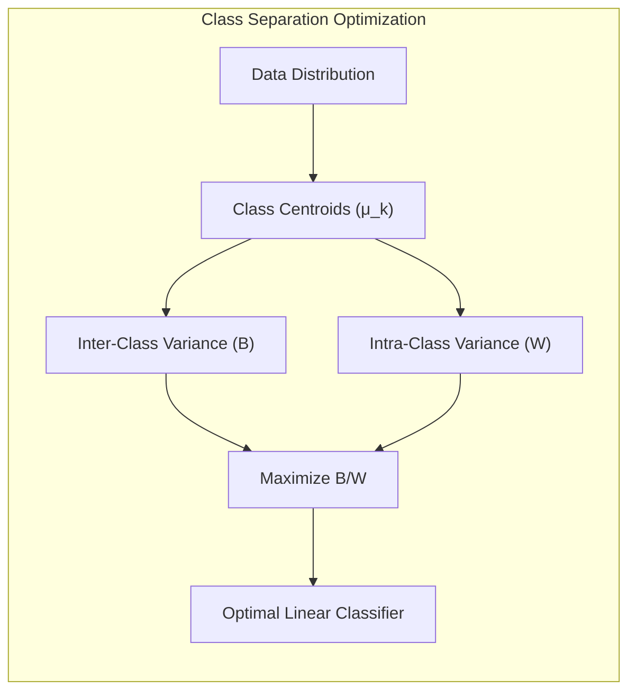
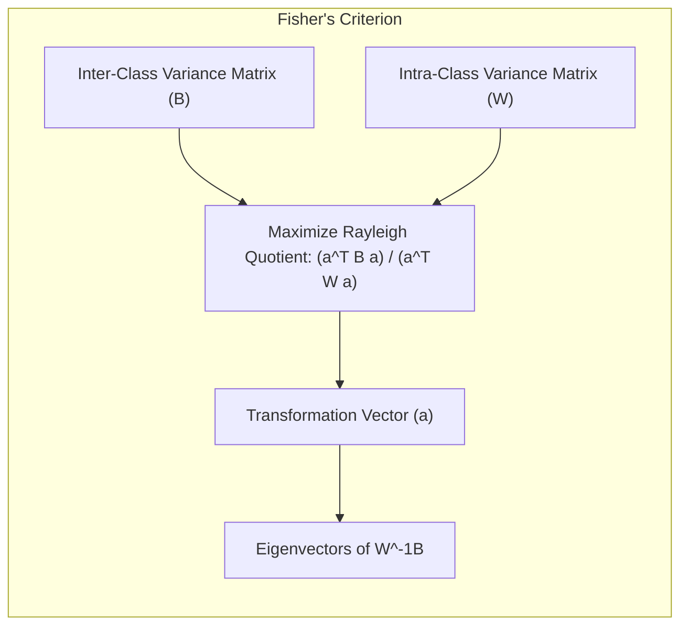
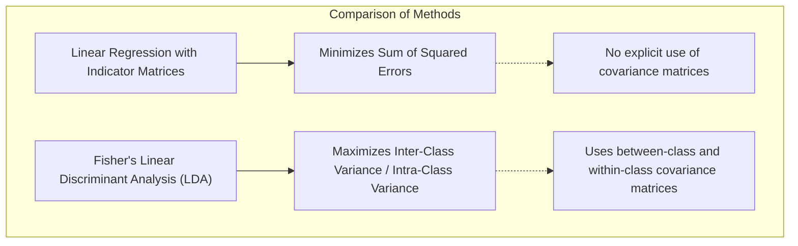
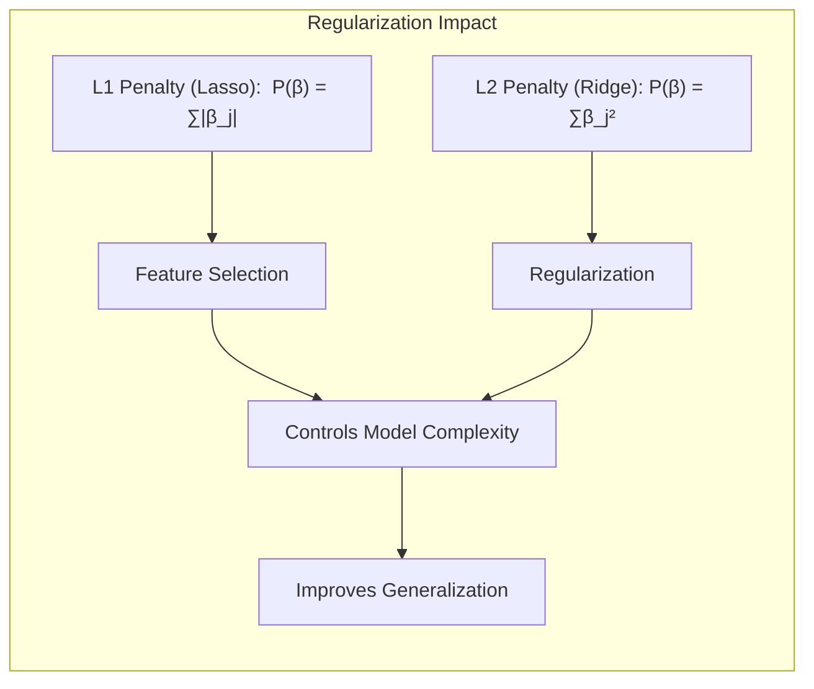
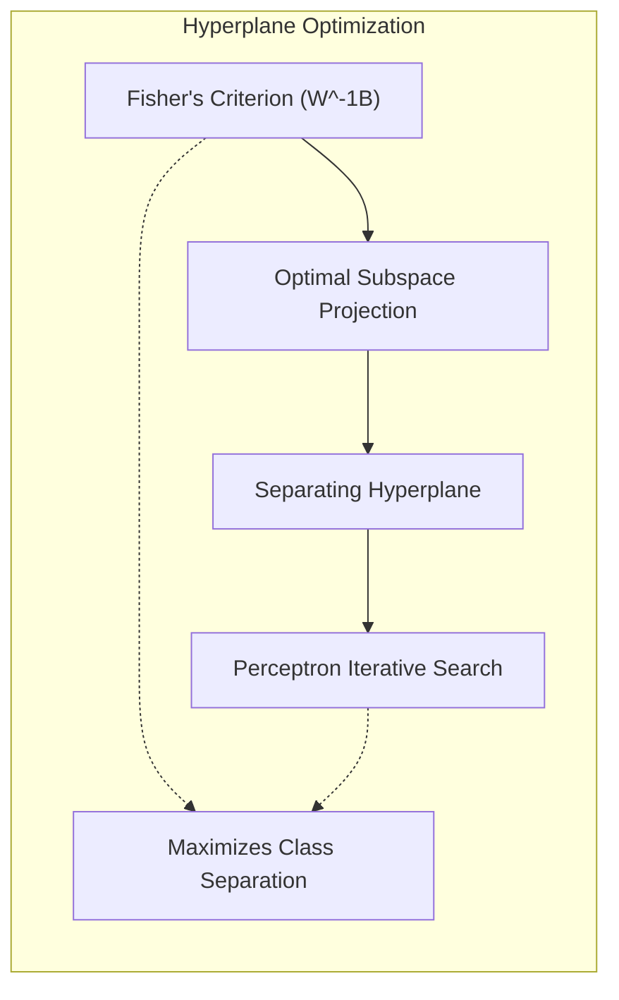
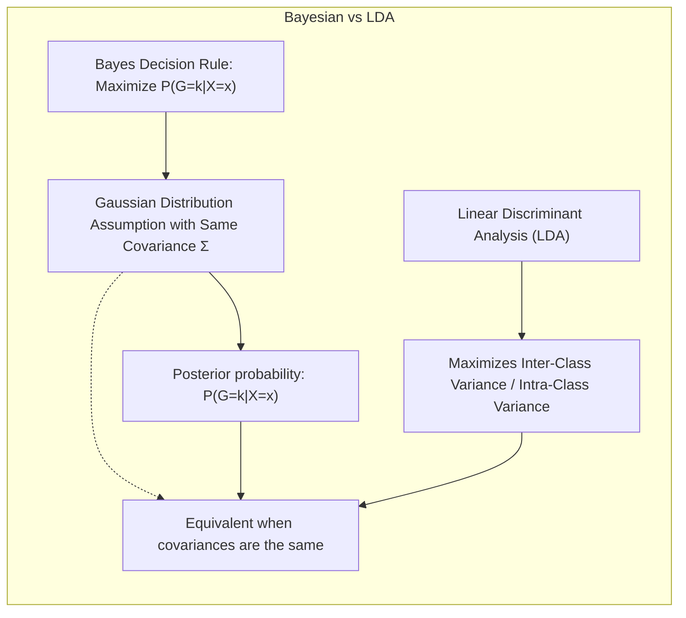

## Título Conciso: Classificação Linear e Otimização da Separação de Classes: Maximizando a Variância Inter-Classe e Minimizado a Intra-Classe



### Introdução

Este capítulo explora a fundo o conceito de **maximização da variância entre classes (inter-classe)** e a **minimização da variância dentro das classes (intra-classe)**, e como essa ideia fundamental se conecta com a construção de modelos de classificação linear. Analisaremos como essa forma de otimização, que busca projetar os dados de forma a separar as classes da melhor forma possível, é utilizada para derivar as **coordenadas discriminantes** ou **variáveis canônicas** no **Linear Discriminant Analysis (LDA)** e como o **Critério de Fisher** quantifica essa otimização [^4.3.3]. Discutiremos como essa abordagem contrasta com a **regressão linear com matrizes de indicadores**, que não utiliza explicitamente a variância entre e dentro das classes no ajuste do modelo [^4.2], e com a **regressão logística**, que modela as probabilidades posteriores, mas não utiliza a decomposição da matriz de covariância das classes [^4.4]. Abordaremos a importância da **seleção de variáveis e regularização** para controlar a complexidade dos modelos e melhorar a estabilidade dos resultados [^4.4.4], [^4.5]. Exploraremos também a relação entre **hiperplanos separadores** e a ideia de maximizar a separação entre as classes através da maximização da variância inter-classe e minimização da variância intra-classe [^4.5.2]. O objetivo deste capítulo é fornecer uma compreensão detalhada de como a maximização da variância entre classes e a minimização da variância dentro das classes se relacionam com a construção de modelos de classificação linear eficientes.

### Conceitos Fundamentais

**Conceito 1: Maximização da Variância Inter-Classe e Minimização da Variância Intra-Classe**

O objetivo central da classificação linear é encontrar uma fronteira de decisão que separe as classes da melhor forma possível. Uma maneira de quantificar essa separação é através da maximização da **variância entre classes**, também conhecida como variância inter-classe, que mede o grau de separação entre os centroides das classes, e através da minimização da **variância dentro das classes**, também conhecida como variância intra-classe, que mede a dispersão das observações em torno do seu centroide [^4.3.3]. A ideia é que, ao projetar os dados em um subespaço, as classes sejam o mais separadas possível e que as observações de cada classe estejam o mais agrupadas possível [^4.3.3]. A razão entre variância inter-classe e variância intra-classe é utilizada para encontrar um subespaço que maximize essa razão.

> 💡 **Exemplo Numérico:**
>
> Suponha que temos duas classes com as seguintes amostras bidimensionais:
>
> Classe 1: $X_1 = \begin{bmatrix} 1 & 2 \\ 1.5 & 1.8 \\ 1.2 & 2.1 \end{bmatrix}$
>
> Classe 2: $X_2 = \begin{bmatrix} 5 & 8 \\ 5.5 & 8.2 \\ 4.8 & 7.9 \end{bmatrix}$
>
> 1. **Cálculo dos centroides:**
>   $\mu_1 = \frac{1}{3} \begin{bmatrix} 1+1.5+1.2 \\ 2+1.8+2.1 \end{bmatrix} = \begin{bmatrix} 1.23 \\ 1.97 \end{bmatrix}$
>   $\mu_2 = \frac{1}{3} \begin{bmatrix} 5+5.5+4.8 \\ 8+8.2+7.9 \end{bmatrix} = \begin{bmatrix} 5.1 \\ 8.03 \end{bmatrix}$
>
> 2. **Centroide geral:** Supondo $\pi_1 = \pi_2 = 0.5$,
>   $\mu = 0.5 * \mu_1 + 0.5 * \mu_2 = \begin{bmatrix} 3.165 \\ 5 \end{bmatrix}$
>
> 3. **Variância inter-classe (B):**
>  $B = 0.5 * (\mu_1 - \mu)(\mu_1 - \mu)^T + 0.5 * (\mu_2 - \mu)(\mu_2 - \mu)^T$
>  $B = 0.5 * \begin{bmatrix} -1.935 \\ -3.03 \end{bmatrix} \begin{bmatrix} -1.935 & -3.03 \end{bmatrix} + 0.5 * \begin{bmatrix} 1.935 \\ 3.03 \end{bmatrix} \begin{bmatrix} 1.935 & 3.03 \end{bmatrix}$
>  $B = \begin{bmatrix} 3.744 & 5.863 \\ 5.863 & 9.181 \end{bmatrix}$
>
> 4. **Variância intra-classe (W):**
>   Para simplificar, vamos supor que a variância intra-classe seja a mesma para ambas as classes e igual à matriz identidade:
>   $W = \begin{bmatrix} 1 & 0 \\ 0 & 1 \end{bmatrix}$
>
> O objetivo é encontrar uma projeção que maximize a razão $\frac{a^T B a}{a^T W a}$. Neste exemplo, podemos ver que a variância entre as classes é muito maior do que a variância dentro das classes (que foi simplificada como a matriz identidade), indicando que as classes estão bem separadas. O Critério de Fisher busca um vetor *a* que maximize essa separação.

**Lemma 1:** *A maximização da variância inter-classe e a minimização da variância intra-classe, através do Critério de Fisher, busca uma transformação linear dos dados que maximiza a separação entre as classes e o agrupamento dos dados dentro de cada classe.* A prova desse lema se baseia na formulação do Critério de Fisher e na sua derivação para encontrar a transformação ótima.

**Conceito 2: O Critério de Fisher e as Matrizes de Variância entre e dentro das Classes**

O **Critério de Fisher** busca formalizar o objetivo de maximizar a separação entre as classes e minimizar a dispersão dentro de cada classe. Para isso, utiliza duas matrizes de variância: a matriz de variância entre classes $B$, dada por:

$$
B = \sum_{k=1}^K \pi_k (\mu_k - \mu)(\mu_k - \mu)^T
$$

onde $\mu_k$ é o centroide da classe $k$, $\mu$ é o centroide geral, e $\pi_k$ é a probabilidade a priori da classe $k$, e a matriz de variância dentro das classes (pooled covariance) $W$, dada por:

$$
W = \frac{1}{N - K} \sum_{k=1}^K \sum_{i: g_i = k} (x_i - \mu_k) (x_i - \mu_k)^T
$$

onde a segunda soma se restringe às amostras da classe $k$. O Critério de Fisher busca a transformação linear $Z = a^T X$ que maximize a razão $\frac{a^T B a}{a^T W a}$, e essa razão é conhecida como Rayleigh quotient [^4.3.3]. Os autovetores da matriz $W^{-1}B$ definem as direções no espaço original onde a separação entre as classes é maximizada.



> 💡 **Exemplo Numérico:**
>
>  Usando os dados do exemplo anterior, vamos calcular $W^{-1}B$. Assumimos $W = \begin{bmatrix} 1 & 0 \\ 0 & 1 \end{bmatrix}$, então $W^{-1} = \begin{bmatrix} 1 & 0 \\ 0 & 1 \end{bmatrix}$.
>
>  $W^{-1}B = \begin{bmatrix} 1 & 0 \\ 0 & 1 \end{bmatrix} \begin{bmatrix} 3.744 & 5.863 \\ 5.863 & 9.181 \end{bmatrix} = \begin{bmatrix} 3.744 & 5.863 \\ 5.863 & 9.181 \end{bmatrix}$
>
>  Para encontrar as direções que maximizam a separação das classes, precisamos calcular os autovetores desta matriz. Os autovetores de $W^{-1}B$ apontam nas direções onde a separação entre as classes é maximizada.
>
>  Os autovalores e autovetores podem ser calculados usando numpy:
>
> ```python
> import numpy as np
>
> B = np.array([[3.744, 5.863], [5.863, 9.181]])
> W = np.array([[1, 0], [0, 1]])
>
> w, v = np.linalg.eig(np.linalg.inv(W) @ B)
>
> print("Autovalores:", w)
> print("Autovetores:", v)
> ```
>  Isso retornará dois autovalores, onde o maior corresponde à direção de maior separação, e os autovetores associados indicam a direção no espaço original.

**Corolário 1:** *O Critério de Fisher, ao utilizar a razão entre a variância entre classes e a variância dentro das classes, quantifica o objetivo de maximizar a separação entre classes em relação à variabilidade dentro de cada classe.*  Este corolário enfatiza o significado das matrizes de variância e de seu uso no critério de Fisher.

**Conceito 3: A Interpretação Geométrica da Maximização de Variâncias**

A maximização da variância entre classes e a minimização da variância dentro das classes pode ser interpretada geometricamente como a busca por um subespaço onde os centroides das classes estejam o mais distantes possível, enquanto as amostras de cada classe estejam o mais agrupadas possível [^4.3.3].  Ao projetar os dados nesse subespaço, a separação entre as classes torna-se mais evidente, o que simplifica a tomada de decisão.  Essa interpretação geométrica auxilia na compreensão intuitiva do Critério de Fisher.

> 💡 **Exemplo Numérico:**
>
>  Imagine os dados do exemplo anterior plotados em um gráfico 2D. A projeção ótima encontrada pelo Critério de Fisher seria uma linha (1D) que, quando os dados são projetados nela, maximiza a distância entre os centroides das classes e minimiza a dispersão dos pontos de cada classe em torno de seus respectivos centroides. Essa linha seria definida pelo autovetor principal de $W^{-1}B$.

> ⚠️ **Nota Importante**: A maximização da variância entre classes e a minimização da variância dentro das classes são objetivos fundamentais para a construção de modelos de classificação linear eficientes, e esses objetivos são formalizados através do Critério de Fisher.

> ❗ **Ponto de Atenção**: A maximização da razão de variâncias no Critério de Fisher busca um compromisso entre a separação das classes e a variabilidade dentro de cada classe, e os autovalores da matriz $W^{-1}B$ quantificam a importância das direções encontradas.

> ✔️ **Destaque**: O Critério de Fisher, ao otimizar a razão entre variância inter-classes e variância intra-classes, busca o subespaço onde as classes sejam mais bem separadas.

### Regressão Linear e Mínimos Quadrados para Classificação



A **regressão linear com matrizes de indicadores**, ao contrário do LDA, não utiliza explicitamente as informações sobre a variância entre classes e a variância dentro das classes [^4.2]. A regressão linear busca encontrar os coeficientes que minimizem a soma dos quadrados dos erros, de forma independente para cada classe, sem considerar explicitamente as relações entre as classes em termos de variância e covariância.

O ajuste da regressão linear é feita através da minimização da seguinte função de custo:

$$
\min_{\beta_{k0}, \beta_k} \sum_{i=1}^N (y_{ik} - (\beta_{k0} + \beta_k^T x_i))^2
$$

onde $y_{ik}$ é o indicador da classe $k$ para a observação $i$.  Essa forma de ajuste não considera como a distribuição das classes se relaciona entre si ou a variabilidade dentro e entre as classes, e pode levar a modelos que não separam as classes da melhor forma, especialmente quando o número de variáveis é grande [^4.2].

> 💡 **Exemplo Numérico:**
>
> Suponha que temos duas classes e um preditor. Vamos criar dados para exemplificar a regressão linear:
>
> Classe 1: $X_1 = \begin{bmatrix} 1 \\ 1.5 \\ 2 \end{bmatrix}$, $Y_1 = \begin{bmatrix} 1 \\ 1 \\ 1 \end{bmatrix}$ (representado por 1)
>
> Classe 2: $X_2 = \begin{bmatrix} 4 \\ 4.5 \\ 5 \end{bmatrix}$, $Y_2 = \begin{bmatrix} 0 \\ 0 \\ 0 \end{bmatrix}$ (representado por 0)
>
>  Podemos usar a regressão linear para modelar um indicador para cada classe. Para a classe 1, o modelo seria:
>
>  $y_{i1} = \beta_{10} + \beta_{1} x_i + \epsilon_i$
>
>  Para a classe 2, o modelo seria:
>
>  $y_{i2} = \beta_{20} + \beta_{2} x_i + \epsilon_i$
>
>  O ajuste desses modelos independentemente, usando mínimos quadrados, não leva em consideração a separabilidade entre as classes.
>
>  Usando Python, podemos calcular os coeficientes:
>
> ```python
> import numpy as np
> from sklearn.linear_model import LinearRegression
>
> X_1 = np.array([[1], [1.5], [2]])
> Y_1 = np.array([1, 1, 1])
> X_2 = np.array([[4], [4.5], [5]])
> Y_2 = np.array([0, 0, 0])
>
> model_1 = LinearRegression().fit(X_1, Y_1)
> model_2 = LinearRegression().fit(X_2, Y_2)
>
> print("Classe 1 - Intercept:", model_1.intercept_, "Coeficiente:", model_1.coef_)
> print("Classe 2 - Intercept:", model_2.intercept_, "Coeficiente:", model_2.coef_)
> ```
>
>  Este exemplo mostra que a regressão linear ajusta um modelo para cada classe independentemente, sem considerar a separação entre as classes. O LDA, por outro lado, buscaria um subespaço que maximize a separação entre as classes.

Em contraste, o LDA utiliza o Critério de Fisher para projetar os dados em um subespaço que maximize a separação entre as classes e minimize a variabilidade dentro de cada classe, utilizando as informações sobre a matriz de covariância entre e dentro das classes [^4.3.3].

**Lemma 2:** *A regressão linear com matrizes de indicadores não busca explicitamente a maximização da variância entre classes e a minimização da variância dentro das classes, ao contrário do LDA que utiliza o Critério de Fisher para definir uma projeção que maximize essa razão.* A demonstração desse lema se encontra na formulação da função de custo da regressão linear, que não utiliza informações sobre a matriz de covariância.

**Corolário 2:** *A falta de consideração da variância entre classes e dentro das classes na regressão linear com matrizes de indicadores pode resultar em modelos menos eficientes em termos de separação das classes, do que modelos que maximizam a separabilidade através do Critério de Fisher, como o LDA.*  Este corolário ressalta a importância de maximizar a separabilidade entre as classes para a obtenção de bons modelos lineares de classificação.

A regressão linear com matrizes de indicadores, embora simples de implementar, não utiliza as informações sobre a variabilidade dos dados e não busca explicitamente a separação entre as classes, o que a torna menos adequada em comparação com o LDA, especialmente em problemas onde a separabilidade linear não é evidente no espaço original e onde a escolha de um bom subespaço de projeção é fundamental [^4.2], [^4.3.3].

### Métodos de Seleção de Variáveis e Regularização em Classificação



A **seleção de variáveis** e a **regularização** desempenham um papel fundamental na construção de modelos de classificação linear mais robustos e generalizáveis, especialmente quando se busca maximizar a variância entre classes e minimizar a variância dentro das classes [^4.5]. A regularização, ao adicionar um termo de penalidade à função de custo, restringe a magnitude dos coeficientes, o que pode estabilizar a projeção dos dados em subespaços discriminantes, e também permite o controle do overfitting.

Na **regressão logística**, a função de custo regularizada pode ser expressa como:

$$
\max_{\beta_0, \beta} \left[ \sum_{i=1}^N \left( y_i (\beta_0 + \beta^T x_i) - \log(1 + e^{\beta_0 + \beta^T x_i}) \right) - \lambda P(\beta) \right]
$$

onde $P(\beta)$ é a penalidade e $\lambda$ é o parâmetro de regularização. A penalidade **L1** (Lasso), dada por $P(\beta) = \sum_{j=1}^p |\beta_j|$, promove a esparsidade dos coeficientes, selecionando as variáveis mais relevantes para a modelagem do log-odds e da separabilidade entre as classes [^4.4.4]. A penalidade **L2** (Ridge), dada por $P(\beta) = \sum_{j=1}^p \beta_j^2$, reduz a magnitude dos coeficientes, estabilizando o modelo e melhorando a sua capacidade de generalização [^4.5].

> 💡 **Exemplo Numérico:**
>
> Vamos criar um exemplo com regressão logística com regularização L1 e L2:
>
> ```python
> import numpy as np
> from sklearn.linear_model import LogisticRegression
> from sklearn.preprocessing import StandardScaler
>
> # Dados de exemplo (2 classes, 5 features)
> np.random.seed(42)
> X = np.random.rand(100, 5)
> y = np.random.randint(0, 2, 100)
>
> # Normalização dos dados
> scaler = StandardScaler()
> X_scaled = scaler.fit_transform(X)
>
> # Regressão logística com regularização L1 (Lasso)
> model_l1 = LogisticRegression(penalty='l1', solver='liblinear', C=0.5)
> model_l1.fit(X_scaled, y)
>
> # Regressão logística com regularização L2 (Ridge)
> model_l2 = LogisticRegression(penalty='l2', C=0.5)
> model_l2.fit(X_scaled, y)
>
> print("Coeficientes L1:", model_l1.coef_)
> print("Coeficientes L2:", model_l2.coef_)
>
> # Comparando o número de coeficientes não nulos
> print("Número de coeficientes não nulos (L1):", np.sum(model_l1.coef_ != 0))
> print("Número de coeficientes não nulos (L2):", np.sum(model_l2.coef_ != 0))
> ```
>
> Neste exemplo, podemos observar que a regularização L1 (Lasso) leva a mais coeficientes iguais a zero, promovendo a seleção de variáveis, enquanto a regularização L2 (Ridge) reduz a magnitude dos coeficientes, mas geralmente mantém todos diferentes de zero. A escolha de $\lambda$ é feita via validação cruzada.

A combinação de redução de dimensionalidade com técnicas de regularização e seleção de variáveis permite obter modelos que são mais robustos, e que focam nas variáveis mais informativas, resultando em uma separação entre classes mais eficiente e um melhor ajuste dos parâmetros.

**Lemma 3:** *A regularização L1, ao promover a esparsidade nos coeficientes, leva à seleção de variáveis mais relevantes para a separação das classes, e, portanto, a modelos mais simples e com melhor capacidade de generalização.* A prova desse lema se encontra na forma da penalidade L1 e como ela influencia na escolha das variáveis.

**Prova do Lemma 3:** A penalidade L1 força os coeficientes menos importantes a se tornarem exatamente zero, selecionando as variáveis que mais contribuem para a separação das classes.  Essa seleção leva a modelos mais simples e menos sujeitos ao *overfitting*, e garante que a maximização da variância entre classes e a minimização da variância dentro das classes seja mais estável e com mais poder preditivo [^4.4.3], [^4.4.4]. $\blacksquare$

**Corolário 3:** *A utilização conjunta de técnicas de seleção de variáveis e regularização, em conjunto com a otimização do Rayleigh quociente e a projeção em subespaços discriminantes, leva à construção de modelos de classificação mais robustos e eficientes, maximizando a variância entre classes e minimizando a variância intra-classes em subespaços mais informativos.*  A combinação das abordagens resulta em um modelo mais eficiente e com maior capacidade de generalização.

> ⚠️ **Ponto Crucial**:  A seleção de variáveis e a regularização são ferramentas importantes para complementar a maximização da variância entre classes e minimização da variância dentro das classes, levando a modelos de classificação lineares mais robustos e generalizáveis [^4.5].

### Separating Hyperplanes e Perceptrons



A busca por **hiperplanos separadores** visa encontrar uma fronteira linear que maximize a distância entre as classes e maximize a separação das classes [^4.5.2].  A utilização do Critério de Fisher e a projeção dos dados em subespaços discriminantes podem ser vistas como uma forma de simplificar essa busca, utilizando as matrizes de variância entre e dentro das classes para identificar direções que separam melhor as classes.

O algoritmo do **Perceptron**, por sua vez, busca um hiperplano separador através do ajuste iterativo dos seus parâmetros com base nas amostras mal classificadas [^4.5.1].  Embora o Perceptron não utilize o Critério de Fisher de forma explícita, a sua convergência, em casos linearmente separáveis, busca uma solução onde a separação entre as classes seja maximizada, e a projeção em um subespaço discriminante pode auxiliar na convergência do método. A escolha do hiperplano ótimo através do Critério de Fisher resulta em um problema de otimização que pode ser resolvido através da aplicação da SVD generalizada, o que corresponde à maximização da variância entre classes e minimização da variância dentro das classes, como também é o objetivo do Perceptron [^4.3.3].

> 💡 **Exemplo Numérico:**
>
> Imagine duas classes de dados que podem ser separadas por um hiperplano (uma linha em 2D). O algoritmo do Perceptron ajustaria iterativamente a inclinação e a posição dessa linha até que todas ou a maioria das amostras estejam corretamente classificadas. O Critério de Fisher, por outro lado, encontraria uma projeção ótima para os dados, que maximizaria a separação entre as classes, o que poderia facilitar a convergência do Perceptron.

**Teorema:** *Em um cenário de dados linearmente separáveis, a projeção dos dados sobre subespaços discriminantes, obtidos através da otimização do Critério de Fisher, facilita a busca por um hiperplano separador, e o algoritmo do Perceptron pode convergir para uma solução que maximize a separação entre classes, e, portanto, com o mesmo objetivo de maximizar a razão do Critério de Fisher.* Este teorema demonstra a conexão entre as abordagens de otimização do Rayleigh quociente e a busca por hiperplanos separadores [^4.5.1].

### Pergunta Teórica Avançada: Quais as diferenças fundamentais entre a formulação de LDA e a Regra de Decisão Bayesiana considerando distribuições Gaussianas com covariâncias iguais?

**Resposta:**

A **Regra de Decisão Bayesiana** busca classificar uma observação $x$ na classe $k$ que maximize a probabilidade posterior $P(G=k|X=x)$ [^4.3].  Sob a suposição de que as classes seguem distribuições Gaussianas com a mesma matriz de covariância $\Sigma$, a probabilidade posterior é dada por:

$$
P(G=k|X=x) = \frac{ \phi(x;\mu_k,\Sigma)\pi_k}{\sum_{l=1}^K \phi(x;\mu_l,\Sigma)\pi_l}
$$

onde $\phi(x;\mu_k,\Sigma)$ é a densidade gaussiana para a classe $k$, $\mu_k$ é a média da classe $k$ e $\pi_k$ é a probabilidade a priori da classe. O **LDA**, por sua vez, deriva suas funções discriminantes lineares a partir dessas suposições, maximizando a separabilidade entre as classes, utilizando a matriz de covariância conjunta e o conceito de Rayleigh quociente [^4.3], [^4.3.3].



**Lemma 4:** *Sob a suposição de que as classes seguem distribuições Gaussianas com a mesma matriz de covariância, a regra de decisão Bayesiana e o LDA são equivalentes, e o Critério de Fisher se conecta ao LDA através da maximização da variância entre classes e da minimização da variância dentro das classes.* A prova reside na manipulação algébrica, mostrando que a maximização da probabilidade posterior é equivalente a maximizar a função discriminante do LDA. [^4.3]

**Corolário 4:** *Quando a restrição de igualdade de covariâncias é relaxada, a regra de decisão Bayesiana leva ao QDA, onde a busca por uma solução ótima envolve a estimação de matrizes de covariância distintas para cada classe, e as funções discriminantes se tornam quadráticas.  A aplicação do Critério de Fisher para o QDA não tem a mesma simplicidade e garantia de separabilidade que existe no LDA.* A forma da fronteira de decisão torna-se mais flexível no QDA devido à suposição de covariâncias diferentes entre as classes. [^4.3.1], [^4.3.3]

> 💡 **Exemplo Numérico:**
>
>  No caso de LDA, as fronteiras de decisão são sempre lineares devido à suposição de covariâncias iguais. No QDA, as fronteiras podem ser quadráticas, o que permite modelar situações onde as classes têm diferentes formas e dispersões.
>
>  Se as classes tiverem as mesmas matrizes de covariância:
>  $\Sigma_1 = \Sigma_2 = \begin{bmatrix} 1 & 0 \\ 0 & 1 \end{bmatrix}$, a decisão do classificador Bayesiano seria equivalente à do LDA.
>
>  Se as classes tiverem matrizes de covariância diferentes:
>  $\Sigma_1 = \begin{bmatrix} 1 & 0 \\ 0 & 1 \end{bmatrix}$ e $\Sigma_2 = \begin{bmatrix} 2 & 0 \\ 0 & 0.5 \end{bmatrix}$, a decisão do classificador Bayesiano levaria a uma fronteira quadrática, como no QDA.

> ⚠️ **Ponto Crucial**: A principal diferença entre LDA e a regra de decisão Bayesiana está na forma como a decisão é derivada. O LDA se baseia no Critério de Fisher para maximizar a separação entre as classes, e também se baseia na suposição da igualdade das matrizes de covariância, enquanto a regra Bayesiana fornece uma formulação geral que, quando aplicada a uma suposição gaussiana com covariâncias iguais, leva ao mesmo resultado do LDA [^4.3].

### Conclusão

Neste capítulo, exploramos o conceito da maximização da variância entre classes e da minimização da variância dentro das classes, e como essa ideia está no coração da construção de modelos lineares de classificação como o LDA. Analisamos como o Critério de Fisher quantifica essa forma de otimização e como a SVD generalizada pode ser utilizada para encontrar os subespaços discriminantes que levam à melhor separação entre as classes. Discutimos como a regressão linear com matrizes de indicadores não explora essas relações de variância e covariância. Vimos como a seleção de variáveis e a regularização complementam a otimização do Rayleigh quociente, levando a modelos mais robustos e eficientes, e como os hiperplanos separadores se relacionam com a busca por modelos lineares. Ao longo do capítulo, procuramos oferecer uma visão clara e detalhada de como a maximização da variância entre classes e a minimização da variância intra-classes se conectam com a teoria e a prática da classificação linear, e como o Critério de Fisher e a SVD generalizada podem ser utilizadas para encontrar boas soluções para o problema de classificação.

### Footnotes

[^4.1]: *In this chapter we revisit the classification problem and focus on linear methods for classification...There are several different ways in which linear decision boundaries can be found.* *(Trecho de Linear Methods for Classification)*

[^4.2]: *In Chapter 2 we fit linear regression models to the class indicator variables, and classify to the largest fit...Linear inequalities in this space are quadratic inequalities in the original space.* *(Trecho de Linear Methods for Classification)*

[^4.3]: *Decision theory for classification (Section 2.4) tells us that we need to know the class posteriors Pr(G|X) for optimal classification. Suppose fk(x) is the class-conditional density of X in class G = k, and let πκ be the prior probability of class k... Linear discriminant analysis (LDA) arises in the special case when we assume that the classes have a common covariance matrix Σk = Σ.* *(Trecho de Linear Methods for Classification)*

[^4.3.1]: *The decision boundary between each pair of classes k and l is described by a quadratic equation {x: δκ(x) = δ(x)}.* *(Trecho de Linear Methods for Classification)*

[^4.3.2]: *The estimates for QDA are similar to those for LDA, except that separate covariance matrices must be estimated for each class...Their computations are simplified by diagonalizing ∑ or Ék.* *(Trecho de Linear Methods for Classification)*

[^4.3.3]: *In the special case when we assume that the classes have a common covariance matrix...When the classes are really Gaussian, then LDA is optimal... Finding the sequences of optimal subspaces for LDA involves the following steps:* *(Trecho de Linear Methods for Classification)*

[^4.4]: *The logistic regression model arises from the desire to model the posterior probabilities of the K classes via linear functions in x, while at the same time ensuring that they sum to one and remain in [0,1].* *(Trecho de Linear Methods for Classification)*

[^4.4.1]: *Logistic regression models are usually fit by maximum likelihood... The logistic regression model is more general, in that it makes less assumptions.* *(Trecho de Linear Methods for Classification)*

[^4.4.2]: *It is convenient to code the two-class gi via a 0/1 response Yi, where yi = 1 when gi = 1, and yi = 0 when gi = 2... Typically many models are fit in a search for a parsimonious model involving a subset of the variables.* *(Trecho de Linear Methods for Classification)*

[^4.4.3]: *To maximize the log-likelihood, we set its derivatives to zero. These score equations are...To solve the score equations (4.21), we use the Newton-Raphson algorithm...* *(Trecho de Linear Methods for Classification)*

[^4.4.4]: *The L1 penalty used in the lasso (Section 3.4.2) can be used for variable selection and shrinkage with any linear regression model...As with the lasso, we typically do not penalize the intercept term.* *(Trecho de Linear Methods for Classification)*

[^4.5]: *Here we present an analysis of binary data to illustrate the traditional statistical use of the logistic regression model... With two classes there is a simple correspondence between linear discriminant analysis and classification by linear least squares, as in (4.5).* *(Trecho de Linear Methods for Classification)*

[^4.5