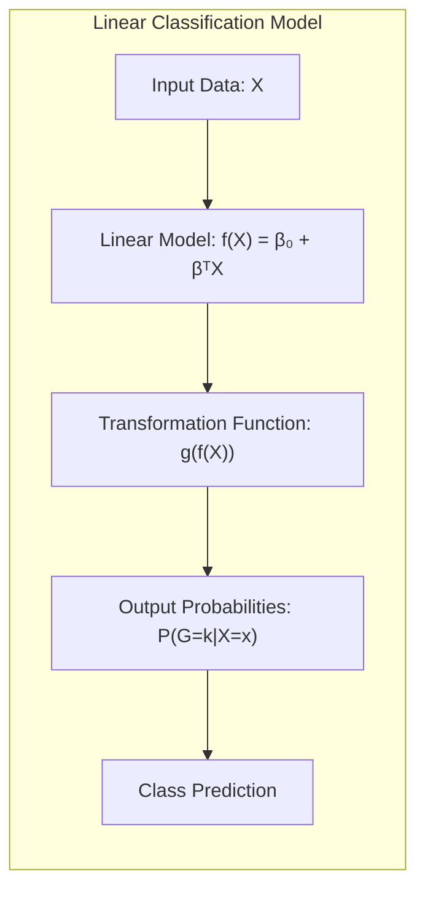
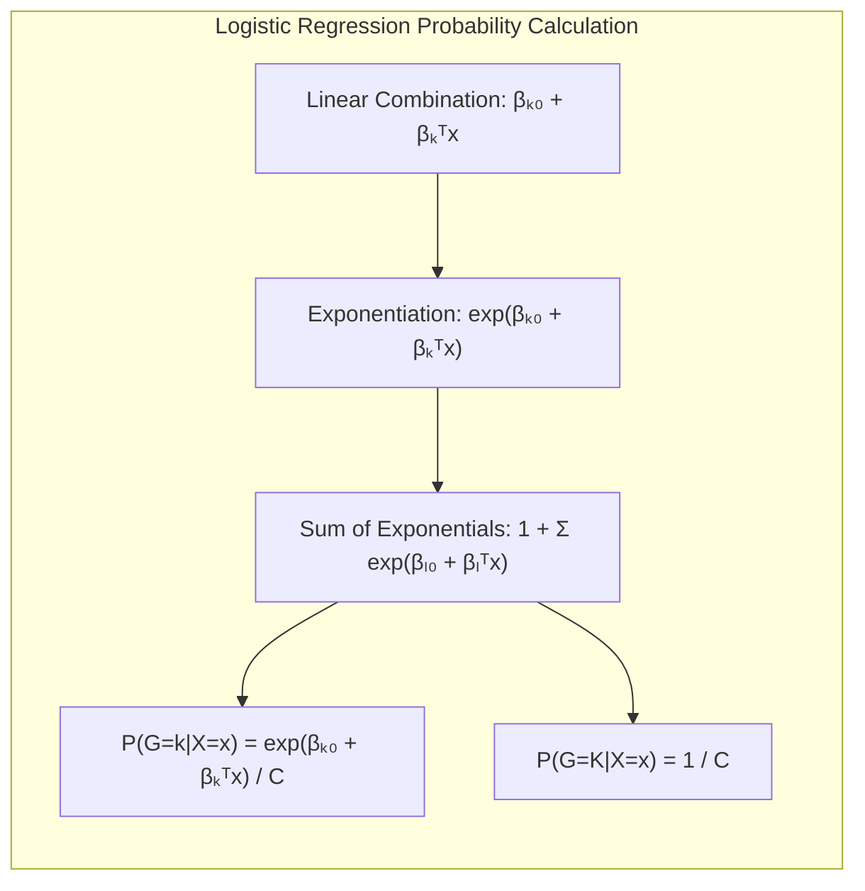
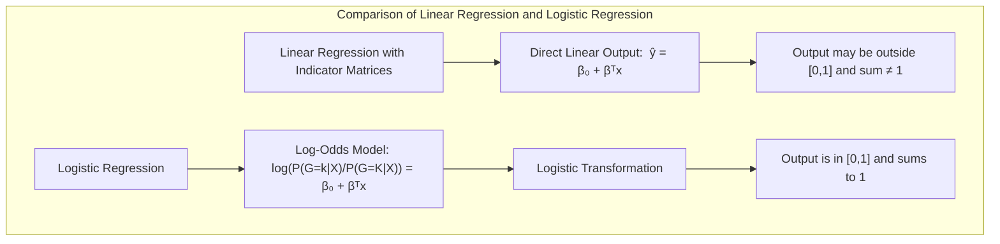
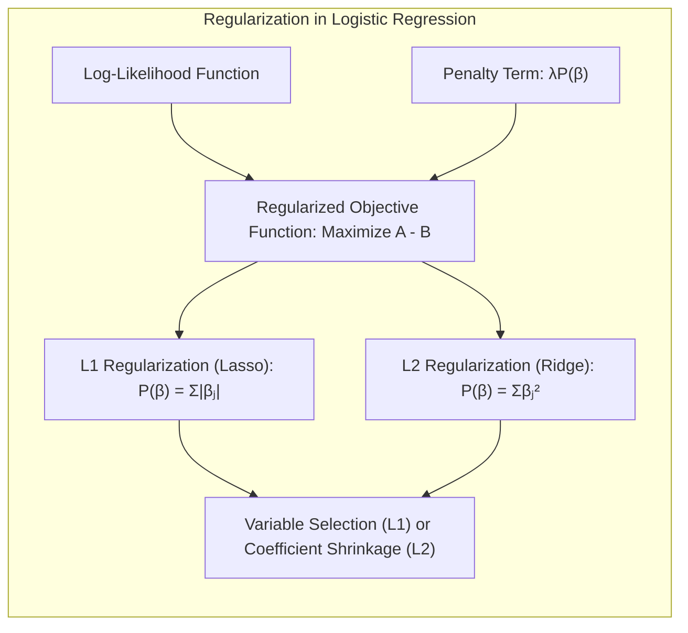
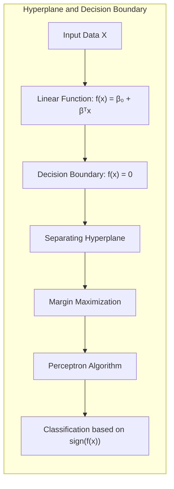
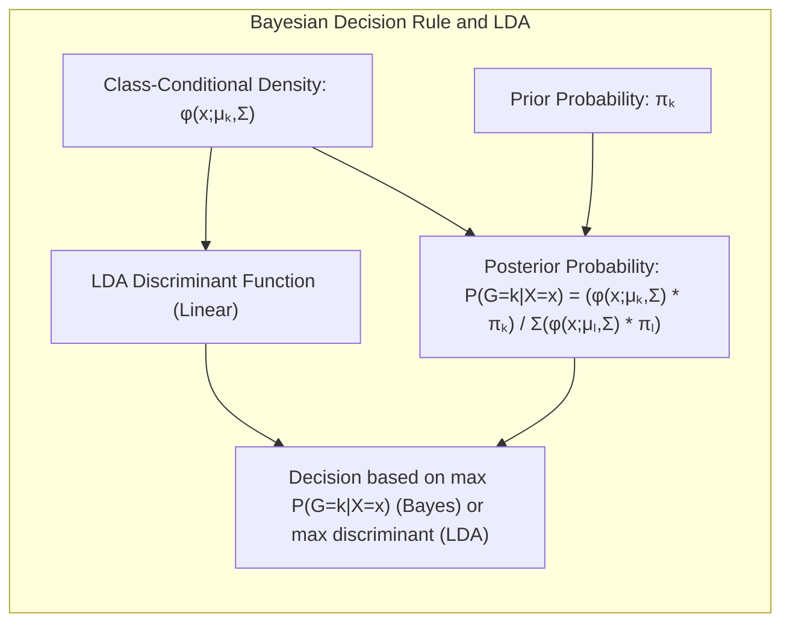

## Título Conciso: Classificação Linear e a Modelagem de Probabilidades Posteriores: Restrições de Intervalo e Soma Unitária

### Introdução

Este capítulo explora a fundo a modelagem de **probabilidades posteriores das classes** utilizando **funções lineares**, com ênfase em como impor as restrições de que as probabilidades devem estar no intervalo [0,1] e somar 1. Analisaremos como a **regressão logística** utiliza a função logística para garantir que as probabilidades posteriores estejam devidamente calibradas, e como essa abordagem contrasta com a **regressão linear com matrizes de indicadores**, que não modela as probabilidades diretamente [^4.2], [^4.4]. Discutiremos como o **Linear Discriminant Analysis (LDA)**, sob a suposição gaussiana, também leva a probabilidades posteriores com essas propriedades, embora de forma indireta [^4.3]. Abordaremos a importância da **seleção de variáveis e regularização** para a construção de modelos que não apresentem *overfitting* e que sejam robustos, especialmente quando as probabilidades são modeladas diretamente com funções lineares [^4.4.4], [^4.5]. Exploraremos também como o conceito de **hiperplanos separadores** se relaciona com a modelagem das probabilidades posteriores [^4.5.2]. O objetivo deste capítulo é fornecer uma compreensão detalhada e abrangente de como a modelagem de probabilidades posteriores com funções lineares e as restrições de soma unitária e intervalo [0,1] podem ser utilizadas na construção de modelos de classificação lineares.

### Conceitos Fundamentais

**Conceito 1:  A Necessidade de Probabilidades Posteriores Calibradas**

Em problemas de classificação, o objetivo final é atribuir uma observação $x$ à classe $k$ com a maior probabilidade posterior $P(G=k|X=x)$ [^4.3]. Para que essas probabilidades sejam interpretadas corretamente e utilizadas na tomada de decisões, é fundamental que elas estejam no intervalo [0,1] e que a soma das probabilidades para todas as classes seja igual a 1. Modelos que não impõem essas restrições podem levar a decisões de classificação subótimas e a resultados pouco confiáveis. Em modelos lineares, é importante, portanto, que as saídas sejam adequadamente calibradas, de forma a se comportarem como probabilidades.

**Lemma 1:** *Em problemas de classificação, a necessidade de que as probabilidades posteriores pertençam ao intervalo [0,1] e somem 1 é fundamental para a interpretabilidade dos modelos e para a aplicação da teoria de decisão.* A prova desse lema reside na definição de probabilidades como sendo valores entre 0 e 1, que representam a incerteza de um evento, e como essas propriedades são utilizadas no processo de tomada de decisão.

**Conceito 2: Regressão Logística e a Modelagem da Probabilidade Posterior**

A **regressão logística** modela diretamente as probabilidades posteriores utilizando a função logística, que garante que os valores estejam no intervalo [0,1] e que a soma das probabilidades para todas as classes seja igual a 1. Para um problema de classificação com $K$ classes, a regressão logística modela os log-odds (logaritmo da razão das chances) das classes $1$ a $K-1$ em relação à classe $K$, como funções lineares:

$$
\log \frac{P(G=k|X=x)}{P(G=K|X=x)} = \beta_{k0} + \beta_k^T x \text{ para } k=1, \ldots, K-1
$$

A probabilidade posterior para cada classe é dada por:

$$
P(G=k|X=x) = \frac{e^{\beta_{k0} + \beta_k^T x}}{1 + \sum_{l=1}^{K-1} e^{\beta_{l0} + \beta_l^T x}}
$$

para $k=1, \ldots, K-1$ e,

$$
P(G=K|X=x) = \frac{1}{1 + \sum_{l=1}^{K-1} e^{\beta_{l0} + \beta_l^T x}}
$$

Essa modelagem, por meio da função logística, garante que as probabilidades estejam no intervalo [0,1] e que a soma de todas as probabilidades seja igual a 1 [^4.4].

> 💡 **Exemplo Numérico:**
>
> Considere um problema de classificação binária (K=2) com uma única variável preditora ($x$). Suponha que os parâmetros da regressão logística sejam $\beta_{10} = -1$ e $\beta_1 = 0.5$. Para uma observação $x=2$, podemos calcular os log-odds e a probabilidade posterior da classe 1:
>
> $$
> \log \frac{P(G=1|X=2)}{P(G=2|X=2)} = -1 + 0.5 \times 2 = 0
> $$
>
> Isso significa que o log-odds é 0, o que implica que as chances são iguais (1:1). A probabilidade posterior para a classe 1 é:
>
> $$
> P(G=1|X=2) = \frac{e^0}{1 + e^0} = \frac{1}{1 + 1} = 0.5
> $$
>
> E a probabilidade posterior para a classe 2 é:
>
> $$
> P(G=2|X=2) = \frac{1}{1 + e^0} = \frac{1}{1 + 1} = 0.5
> $$
>
> Observe que as probabilidades estão entre 0 e 1 e somam 1, como esperado.

**Corolário 1:** *A regressão logística garante que as estimativas das probabilidades posteriores pertençam ao intervalo [0,1] e somem 1, o que é consistente com a definição de probabilidades e com a teoria de decisão.* O uso da função logística é fundamental para que essa garantia seja obtida.

**Conceito 3: LDA e a Derivação Indireta das Probabilidades Posteriores**

No **LDA**, as probabilidades posteriores não são modeladas diretamente como na regressão logística, mas são derivadas da suposição de que as densidades condicionais seguem distribuições Gaussianas multivariadas com a mesma matriz de covariância [^4.3].  A função discriminante do LDA, que é linear, pode ser relacionada com o log das probabilidades posteriores, de modo que a maximização da função discriminante leva à maximização da probabilidade posterior. A regra de decisão do LDA também garante que as probabilidades posteriores sejam normalizadas, embora de forma indireta [^4.3].

> ⚠️ **Nota Importante**: A regressão logística modela as probabilidades posteriores diretamente, através de uma função logística, enquanto o LDA deriva as probabilidades a partir da suposição gaussiana, e a relação com o log das probabilidades é através da função discriminante.

> ❗ **Ponto de Atenção**: A regressão logística modela as probabilidades posteriores de forma mais flexível, sem impor a restrição gaussiana, mas necessita de ajuste dos parâmetros por maximização da verossimilhança.

> ✔️ **Destaque**: A imposição de restrições sobre as probabilidades posteriores é fundamental para a interpretabilidade dos modelos de classificação e para a aplicação da teoria de decisão.

### Regressão Linear e Mínimos Quadrados para Classificação

A **regressão linear com matrizes de indicadores** busca ajustar funções lineares para cada classe, utilizando o método dos mínimos quadrados, sem impor restrições sobre o comportamento dos valores de saída. Em particular, a regressão linear não garante que as estimativas estejam no intervalo [0,1] e que somem 1, que são as propriedades desejadas para as probabilidades posteriores. Isso ocorre pois a função linear utilizada na regressão linear permite estimativas que não são consistentes com a teoria de probabilidade [^4.2].

A falta dessas restrições resulta em um modelo que não pode ser interpretado como uma estimativa direta da probabilidade posterior das classes, dificultando a aplicação da teoria de decisão e levando a erros de interpretação.  Além disso, as estimativas obtidas pela regressão linear podem levar a resultados subótimos, especialmente em problemas multiclasse.

A regressão linear com matrizes de indicadores, portanto, não modela as probabilidades posteriores diretamente, o que a distingue de modelos como a regressão logística que utilizam a função logística para garantir a calibração das probabilidades e o somatório unitário [^4.4]. A regressão linear com matrizes de indicadores utiliza funções lineares como aproximação da resposta de classes, o que é diferente de modelar a probabilidade posterior.

> 💡 **Exemplo Numérico:**
>
>  Suponha um problema de classificação binária com uma variável preditora $x$. Usamos regressão linear para modelar as classes usando uma matriz de indicadores. A classe 1 é codificada como 1 e a classe 2 como 0.  Após ajustar o modelo de regressão linear, obtemos os seguintes coeficientes: $\beta_0 = 0.2$ e $\beta_1 = 0.4$.
>
> Para um valor de $x = 3$, a previsão do modelo é:
>
> $$
> \hat{y} = \beta_0 + \beta_1 x = 0.2 + 0.4 \times 3 = 1.4
> $$
>
> Este valor, 1.4, está fora do intervalo [0,1] e não pode ser interpretado como uma probabilidade. Em outro caso, para $x = -1$, teríamos:
>
> $$
> \hat{y} = 0.2 + 0.4 \times (-1) = -0.2
> $$
>
> Este valor, -0.2, também está fora do intervalo [0,1]. Isso demonstra que a regressão linear, sem restrições, não produz estimativas que se comportam como probabilidades.

**Lemma 2:** *A regressão linear com matrizes de indicadores não garante que as estimativas obtidas estejam no intervalo [0,1] e que a soma para todas as classes seja igual a 1, o que impede a sua interpretação direta como probabilidades posteriores.* A prova desse lema reside na forma como a regressão linear ajusta os parâmetros, sem impor nenhuma restrição sobre os valores de saída.

**Corolário 2:** *A regressão linear com matrizes de indicadores, por não impor restrições sobre as estimativas, dificulta a aplicação da teoria de decisão e pode levar a classificações menos precisas em comparação com métodos que modelam diretamente as probabilidades posteriores ou as densidades, como a regressão logística ou LDA.*  Este corolário destaca uma limitação fundamental da regressão linear como classificador.

Em resumo, a regressão linear com matrizes de indicadores, embora utilize funções lineares para tomada de decisão, não modela as probabilidades posteriores de forma direta e não garante que as estimativas resultantes se comportem como probabilidades, o que a distingue de abordagens como a regressão logística que utilizam transformações não lineares para atingir esse objetivo [^4.2], [^4.4].

### Métodos de Seleção de Variáveis e Regularização em Classificação

A **seleção de variáveis** e a **regularização** são técnicas importantes para melhorar a qualidade da estimativa das probabilidades posteriores, mesmo em modelos onde as restrições de soma unitária e valores no intervalo [0,1] são impostas [^4.5]. A regularização, ao adicionar um termo de penalidade à função de custo, controla a magnitude dos coeficientes, o que pode melhorar a estabilidade da estimativa e prevenir o overfitting.

Na **regressão logística**, a regularização é implementada modificando a função de verossimilhança para incluir um termo de penalidade:

$$
\max_{\beta_0, \beta} \left[ \sum_{i=1}^N \left( y_i (\beta_0 + \beta^T x_i) - \log(1 + e^{\beta_0 + \beta^T x_i}) \right) - \lambda P(\beta) \right]
$$

onde $P(\beta)$ é a penalidade e $\lambda$ é o parâmetro de regularização. A penalidade **L1** (Lasso), dada por $P(\beta) = \sum_{j=1}^p |\beta_j|$, promove a esparsidade dos coeficientes, selecionando as variáveis mais relevantes para a modelagem das probabilidades posteriores [^4.4.4]. A penalidade **L2** (Ridge), dada por $P(\beta) = \sum_{j=1}^p \beta_j^2$, reduz a magnitude dos coeficientes, estabilizando o modelo e tornando a estimativa das probabilidades mais robusta [^4.5].

> 💡 **Exemplo Numérico:**
>
> Considere um problema de regressão logística com duas variáveis preditoras ($x_1$ e $x_2$) e regularização L1 (Lasso). A função de verossimilhança é modificada com a penalidade L1.  Suponha que, após o ajuste do modelo com $\lambda = 0.5$, os coeficientes resultantes sejam: $\beta_0 = -0.2$, $\beta_1 = 0.8$ e $\beta_2 = 0$.
>
> A penalidade L1 forçou $\beta_2$ a ser exatamente 0, o que significa que a variável $x_2$ foi eliminada do modelo. Se tivéssemos utilizado regularização L2 (Ridge) com o mesmo $\lambda$, os coeficientes poderiam ser, por exemplo, $\beta_0 = -0.15$, $\beta_1 = 0.6$ e $\beta_2 = 0.2$.
>
> Observe que, com regularização L2, ambas as variáveis são mantidas no modelo, mas seus coeficientes são reduzidos em magnitude em comparação com um modelo sem regularização. A regularização L1 promove a esparsidade, simplificando o modelo, enquanto a regularização L2 reduz a complexidade dos coeficientes.
>
> Para comparar, vamos considerar um modelo sem regularização, onde os coeficientes seriam $\beta_0 = -0.3$, $\beta_1 = 1.2$ e $\beta_2 = 0.5$. A tabela abaixo resume os resultados:
>
> | Método       | $\beta_0$ | $\beta_1$ | $\beta_2$ |
> |--------------|-----------|-----------|-----------|
> | Sem Regularização | -0.3     | 1.2       | 0.5       |
> | Lasso (L1)   | -0.2     | 0.8       | 0         |
> | Ridge (L2)   | -0.15    | 0.6       | 0.2       |
>
> Este exemplo ilustra como a regularização L1 pode realizar a seleção de variáveis (esparsidade), enquanto a regularização L2 reduz a magnitude dos coeficientes, contribuindo para a estabilidade do modelo.

A aplicação de técnicas de regularização, portanto, complementa a modelagem da probabilidade posterior, melhorando a capacidade de generalização do modelo para novos dados e diminuindo o risco de overfitting.

**Lemma 3:** *A regularização L1 na regressão logística, ao promover a esparsidade dos coeficientes, seleciona as variáveis mais importantes para a estimativa das probabilidades posteriores, o que leva a modelos mais simples e com melhor interpretabilidade.*  A prova reside na forma da penalidade L1 e como ela afeta a função de custo.

**Prova do Lemma 3:**  A penalidade L1 adiciona um termo à função de custo que é proporcional ao valor absoluto dos coeficientes. A minimização deste termo força alguns dos coeficientes a se tornarem exatamente zero, promovendo a seleção de variáveis e levando a modelos mais simples e com melhor interpretabilidade [^4.4.3], [^4.4.4]. $\blacksquare$

**Corolário 3:** *A regularização, tanto L1 quanto L2, contribui para a estabilidade e a capacidade de generalização dos modelos que modelam probabilidades posteriores, ao controlar o overfitting e reduzir a complexidade das estimativas.* A regularização, neste contexto, pode ser vista como uma ferramenta para aprimorar a qualidade da modelagem das probabilidades posteriores.

> ⚠️ **Ponto Crucial**:  A seleção de variáveis e a regularização são técnicas essenciais para complementar a modelagem das probabilidades posteriores em modelos lineares de classificação, melhorando a estabilidade e a capacidade de generalização dos modelos, mesmo quando se utilizam funções que impõem que as probabilidades estejam entre 0 e 1 e somem 1 [^4.5].

### Separating Hyperplanes e Perceptrons

A busca por **hiperplanos separadores** visa encontrar uma fronteira linear que maximize a separação entre as classes. Essa abordagem pode ser vista como uma forma de aproximar a modelagem das probabilidades posteriores, especialmente em problemas de classificação binária [^4.5.2]. Um hiperplano separador é definido como $f(x) = \beta_0 + \beta^T x = 0$, e o objetivo é encontrar os parâmetros $\beta_0$ e $\beta$ que maximizem a distância entre o hiperplano e os pontos mais próximos de cada classe.

O algoritmo do **Perceptron**, ao buscar um hiperplano separador através de ajustes iterativos, encontra uma fronteira de decisão que separa as classes com um número mínimo de erros, e que se conecta com o conceito de probabilidades posteriores por buscar uma solução que classifique as amostras corretamente [^4.5.1]. O Perceptron, porém, não modela explicitamente as probabilidades posteriores, e foca mais na separação das classes, do que na estimativa de probabilidades bem calibradas.

> 💡 **Exemplo Numérico:**
>
> Considere um problema de classificação binária com duas variáveis preditoras ($x_1$ e $x_2$) e duas classes, onde os pontos da classe 1 são (2, 3), (3, 4), (4, 2) e os pontos da classe 2 são (1, 1), (2, 1), (1, 2). O perceptron busca um hiperplano que separe as classes.
>
> Inicialmente, podemos começar com um hiperplano aleatório, por exemplo, $\beta_0 = -1$, $\beta_1 = 1$ e $\beta_2 = -1$, o que corresponde à equação $-1 + x_1 - x_2 = 0$. Podemos verificar o sinal da função $f(x) = \beta_0 + \beta_1 x_1 + \beta_2 x_2$ para cada ponto:
>
> - Para (2,3):  $f(2,3) = -1 + 2 - 3 = -2 < 0$ (classificado incorretamente, pois é classe 1)
> - Para (3,4):  $f(3,4) = -1 + 3 - 4 = -2 < 0$ (classificado incorretamente, pois é classe 1)
> - Para (4,2):  $f(4,2) = -1 + 4 - 2 = 1 > 0$ (classificado corretamente, pois é classe 1)
> - Para (1,1):  $f(1,1) = -1 + 1 - 1 = -1 < 0$ (classificado corretamente, pois é classe 2)
> - Para (2,1):  $f(2,1) = -1 + 2 - 1 = 0$ (na fronteira)
> - Para (1,2):  $f(1,2) = -1 + 1 - 2 = -2 < 0$ (classificado corretamente, pois é classe 2)
>
> Os pontos (2,3) e (3,4) foram classificados incorretamente. O algoritmo do Perceptron ajusta os parâmetros iterativamente para reduzir o número de erros, atualizando o hiperplano com base nos pontos mal classificados, até encontrar um hiperplano que separe as classes. O perceptron não modela a probabilidade posterior, mas busca um hiperplano que separe as classes.

**Teorema:** *Em cenários de dados linearmente separáveis, o algoritmo do Perceptron converge para um hiperplano separador que minimiza o número de erros na classificação, mas não garante, a priori, que a forma da função de decisão se conecte com a probabilidade posterior da classe.* Este teorema estabelece as bases para a garantia de convergência do Perceptron em situações específicas, embora ele não modele as probabilidades posteriores diretamente [^4.5.1].

### Pergunta Teórica Avançada: Quais as diferenças fundamentais entre a formulação de LDA e a Regra de Decisão Bayesiana considerando distribuições Gaussianas com covariâncias iguais?

**Resposta:**

A **Regra de Decisão Bayesiana** busca classificar uma observação $x$ na classe $k$ que maximize a probabilidade posterior $P(G=k|X=x)$ [^4.3].  Sob a suposição de que as classes seguem distribuições Gaussianas com a mesma matriz de covariância $\Sigma$, a probabilidade posterior é dada por:

$$
P(G=k|X=x) = \frac{ \phi(x;\mu_k,\Sigma)\pi_k}{\sum_{l=1}^K \phi(x;\mu_l,\Sigma)\pi_l}
$$

onde $\phi(x;\mu_k,\Sigma)$ é a densidade gaussiana para a classe $k$, $\mu_k$ é a média da classe $k$ e $\pi_k$ é a probabilidade a priori da classe. O **LDA**, por sua vez, deriva suas funções discriminantes lineares a partir dessas suposições, e busca maximizar a separação entre as classes no espaço de características, o que corresponde, sob as mesmas premissas, à maximização da probabilidade posterior [^4.3].

> 💡 **Exemplo Numérico:**
>
> Considere um problema de classificação com duas classes, onde as observações de cada classe seguem uma distribuição gaussiana com a mesma matriz de covariância. Suponha que a média da classe 1 seja $\mu_1 = [1, 1]^T$ e a média da classe 2 seja $\mu_2 = [3, 3]^T$. A matriz de covariância comum é $\Sigma = \begin{bmatrix} 1 & 0 \\ 0 & 1 \end{bmatrix}$. As probabilidades a priori são $\pi_1 = 0.6$ e $\pi_2 = 0.4$.
>
> Um ponto $x = [2, 2]^T$ precisa ser classificado. A função de densidade gaussiana para cada classe é:
>
> $$
> \phi(x;\mu_k,\Sigma) = \frac{1}{(2\pi)^{p/2}|\Sigma|^{1/2}} \exp\left(-\frac{1}{2}(x-\mu_k)^T\Sigma^{-1}(x-\mu_k)\right)
> $$
>
> Onde $p=2$ é o número de variáveis preditoras. Calculando as densidades:
>
> $$
> \phi(x;\mu_1,\Sigma) = \frac{1}{2\pi} \exp\left(-\frac{1}{2}\begin{bmatrix} 2-1 \\ 2-1 \end{bmatrix}^T\begin{bmatrix} 1 & 0 \\ 0 & 1 \end{bmatrix}^{-1}\begin{bmatrix} 2-1 \\ 2-1 \end{bmatrix}\right) = \frac{1}{2\pi} \exp(-1) \approx 0.058
> $$
>
> $$
> \phi(x;\mu_2,\Sigma) = \frac{1}{2\pi} \exp\left(-\frac{1}{2}\begin{bmatrix} 2-3 \\ 2-3 \end{bmatrix}^T\begin{bmatrix} 1 & 0 \\ 0 & 1 \end{bmatrix}^{-1}\begin{bmatrix} 2-3 \\ 2-3 \end{bmatrix}\right) = \frac{1}{2\pi} \exp(-1) \approx 0.058
> $$
>
> As probabilidades posteriores são:
>
> $$
> P(G=1|X=x) = \frac{0.058 \times 0.6}{0.058 \times 0.6 + 0.058 \times 0.4} = \frac{0.0348}{0.058} = 0.6
> $$
>
> $$
> P(G=2|X=x) = \frac{0.058 \times 0.4}{0.058 \times 0.6 + 0.058 \times 0.4} = \frac{0.0232}{0.058} = 0.4
> $$
>
> De acordo com a regra de decisão Bayesiana, o ponto $x$ seria classificado na classe 1, pois $P(G=1|X=x) > P(G=2|X=x)$. O LDA, sob as mesmas premissas, chegaria à mesma conclusão.

**Lemma 4:** *Sob a suposição de distribuições Gaussianas com a mesma matriz de covariância, a regra de decisão Bayesiana e o LDA são equivalentes e levam à mesma fronteira de decisão linear e à mesma classificação, e ambos se baseiam na maximização da probabilidade posterior da classe.* A demonstração dessa equivalência se dá através da manipulação algébrica, que mostra como as funções discriminantes do LDA e a probabilidade posterior são relacionadas através do log-ratio das probabilidades posteriores [^4.3].

**Corolário 4:** *Quando a restrição de igualdade de covariâncias é relaxada, a regra de decisão Bayesiana leva ao Quadratic Discriminant Analysis (QDA), que não utiliza funções discriminantes lineares, e cujas fronteiras de decisão são quadráticas. O QDA representa uma abordagem mais geral para a tomada de decisão, que se baseia na modelagem de probabilidades posteriores, mas relaxa a suposição de covariâncias iguais.* A remoção da suposição de igualdade das matrizes de covariâncias leva a um modelo mais complexo, e a fronteiras de decisão não lineares [^4.3.1], [^4.3.3].

> ⚠️ **Ponto Crucial**: A principal diferença entre LDA e a regra de decisão Bayesiana reside na abordagem. LDA é um caso particular onde a suposição gaussiana e de covariâncias iguais leva a uma forma funcional específica, uma função discriminante linear, enquanto a regra Bayesiana oferece uma formulação mais geral da decisão. LDA deriva a função discriminante utilizando premissas sobre as densidades e que levam ao mesmo log-ratio que a regra de decisão Bayesiana sob as mesmas premissas [^4.3].

### Conclusão

Neste capítulo, exploramos a modelagem de probabilidades posteriores com funções lineares, com ênfase em como impor as restrições de soma unitária e intervalo [0,1]. Analisamos como a regressão logística utiliza a função logística para garantir que as estimativas se comportem como probabilidades, e como o LDA deriva as probabilidades posteriores através da suposição gaussiana e de covariâncias iguais. Discutimos como a regressão linear com matrizes de indicadores não modela as probabilidades posteriores diretamente, e como a seleção de variáveis e a regularização são importantes para melhorar a estabilidade e a capacidade de generalização dos modelos.  Vimos também como a busca por hiperplanos separadores se relaciona com a modelagem de probabilidades posteriores. Ao longo do capítulo, procuramos fornecer uma visão aprofundada da relação entre a modelagem de probabilidades posteriores e a construção de modelos de classificação linear.

### Footnotes

[^4.1]: *In this chapter we revisit the classification problem and focus on linear methods for classification...There are several different ways in which linear decision boundaries can be found.* *(Trecho de Linear Methods for Classification)*

[^4.2]: *In Chapter 2 we fit linear regression models to the class indicator variables, and classify to the largest fit...Linear inequalities in this space are quadratic inequalities in the original space.* *(Trecho de Linear Methods for Classification)*

[^4.3]: *Decision theory for classification (Section 2.4) tells us that we need to know the class posteriors Pr(G|X) for optimal classification. Suppose fk(x) is the class-conditional density of X in class G = k, and let πκ be the prior probability of class k... Linear discriminant analysis (LDA) arises in the special case when we assume that the classes have a common covariance matrix Σk = Σ.* *(Trecho de Linear Methods for Classification)*

[^4.3.1]: *The decision boundary between each pair of classes k and l is described by a quadratic equation {x: δκ(x) = δ(x)}.* *(Trecho de Linear Methods for Classification)*

[^4.3.3]: *In the special case when we assume that the classes have a common covariance matrix...When the classes are really Gaussian, then LDA is optimal* *(Trecho de Linear Methods for Classification)*

[^4.4]: *The logistic regression model arises from the desire to model the posterior probabilities of the K classes via linear functions in x, while at the same time ensuring that they sum to one and remain in [0,1].* *(Trecho de Linear Methods for Classification)*

[^4.4.1]: *Logistic regression models are usually fit by maximum likelihood... The logistic regression model is more general, in that it makes less assumptions.* *(Trecho de Linear Methods for Classification)*

[^4.4.2]: *It is convenient to code the two-class gi via a 0/1 response Yi, where yi = 1 when gi = 1, and yi = 0 when gi = 2... Typically many models are fit in a search for a parsimonious model involving a subset of the variables.* *(Trecho de Linear Methods for Classification)*

[^4.4.3]: *To maximize the log-likelihood, we set its derivatives to zero. These score equations are...To solve the score equations (4.21), we use the Newton-Raphson algorithm...* *(Trecho de Linear Methods for Classification)*

[^4.4.4]: *The L1 penalty used in the lasso (Section 3.4.2) can be used for variable selection and shrinkage with any linear regression model...As with the lasso, we typically do not penalize the intercept term.* *(Trecho de Linear Methods for Classification)*

[^4.5]: *Here we present an analysis of binary data to illustrate the traditional statistical use of the logistic regression model... With two classes there is a simple correspondence between linear discriminant analysis and classification by linear least squares, as in (4.5).* *(Trecho de Linear Methods for Classification)*

[^4.5.1]: *The perceptron learning algorithm tries to find a separating hyperplane by minimizing the distance of misclassified points to the decision boundary.* *(Trecho de Linear Methods for Classification)*

[^4.5.2]: *The optimal separating hyperplane separates the two classes and maximizes the distance to the closest point from either class... In light of (4.40), the constraints define an empty slab or margin around the linear decision boundary...* *(Trecho de Linear Methods for Classification)*
