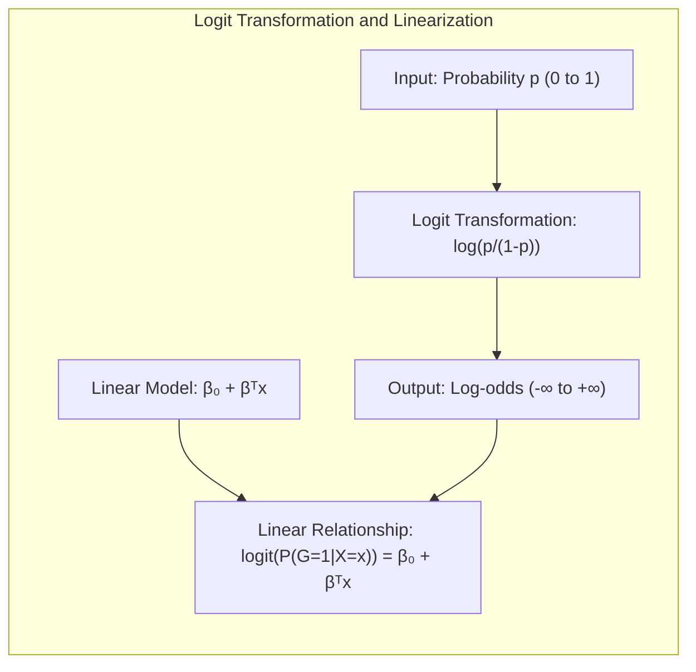
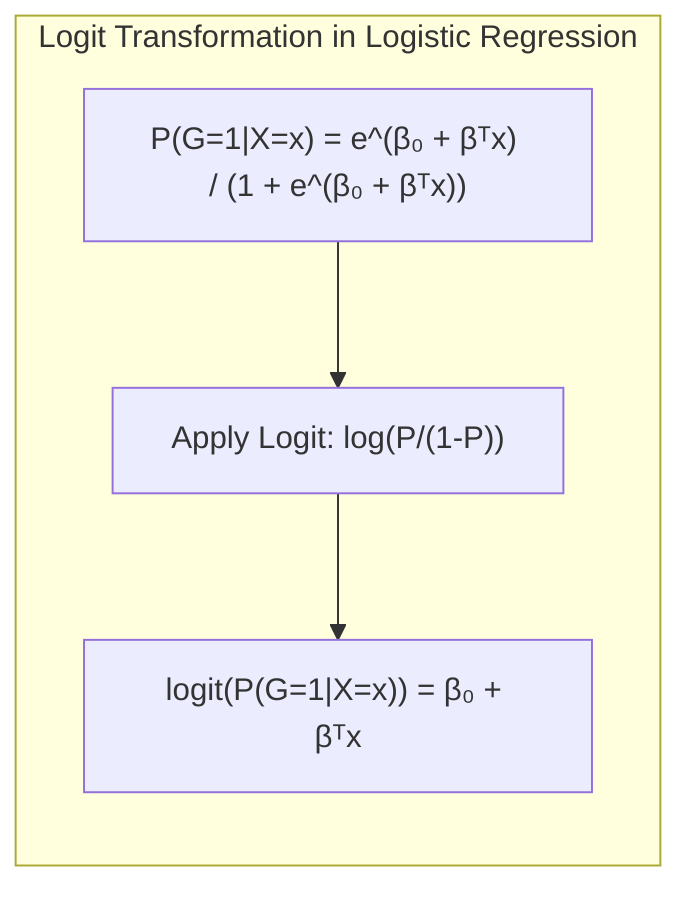
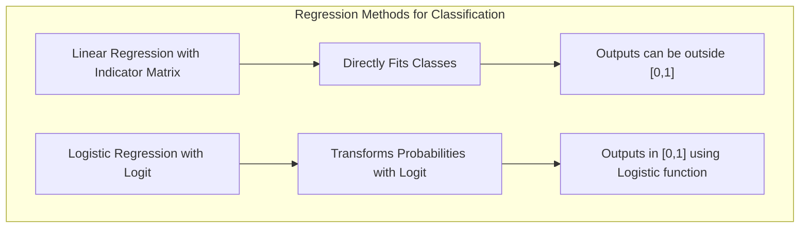
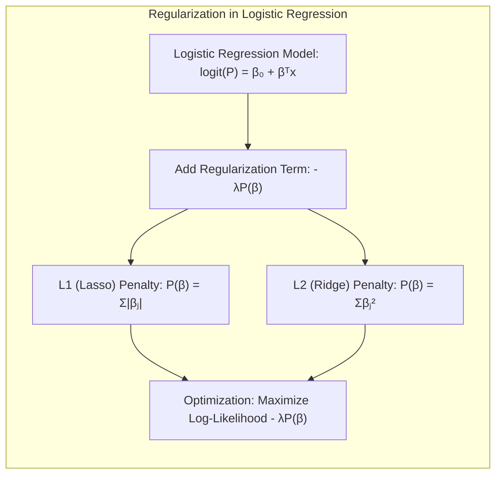
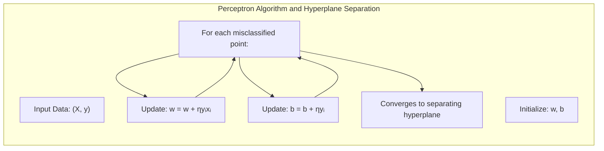
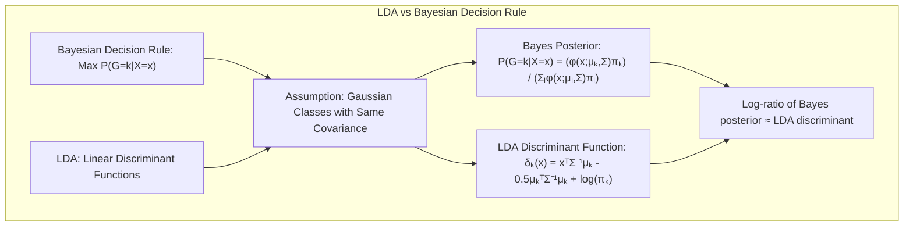

## Título Conciso: Classificação Linear e a Transformação Logit: Linearização da Relação Probabilidade-Preditor



### Introdução

Este capítulo explora em profundidade a **transformação logit**, e como ela é utilizada na **regressão logística** para linearizar a relação entre a probabilidade de uma classe e um preditor linear. Analisaremos como a função logística, quando transformada através do logit, resulta em uma função linear em relação aos parâmetros do modelo, e como essa linearização facilita a estimação e a interpretação dos resultados [^4.4]. Compararemos a abordagem da regressão logística com a **regressão linear com matrizes de indicadores**, que não utiliza a transformação logit e com o **Linear Discriminant Analysis (LDA)**, que utiliza transformações lineares baseadas em suposições gaussianas [^4.2], [^4.3]. Abordaremos também a importância da **seleção de variáveis e regularização** para controlar a complexidade dos modelos logísticos e melhorar a sua capacidade de generalização [^4.4.4], [^4.5]. Discutiremos como a transformação logit se conecta com a busca por **hiperplanos separadores** em modelos de classificação [^4.5.2]. O objetivo deste capítulo é fornecer uma compreensão detalhada de como a transformação logit é utilizada para modelar probabilidades posteriores de forma linear, e como isso se conecta com a construção de modelos de classificação eficientes e robustos.

### Conceitos Fundamentais

**Conceito 1: O Conceito da Transformação Logit**

A **transformação logit**, também conhecida como log-odds, é uma função que mapeia probabilidades do intervalo [0,1] para o intervalo dos números reais ($-\infty$, $+\infty$).  O logit de uma probabilidade $p$ é definido como:

$$
\text{logit}(p) = \log \left( \frac{p}{1-p} \right)
$$

A transformação logit é utilizada na regressão logística para linearizar a relação entre a probabilidade de pertencer a uma classe e o preditor linear $\beta_0 + \beta^T x$. A transformação logit, portanto, cria uma relação linear entre o preditor linear e o log-odds da probabilidade, facilitando a aplicação de modelos lineares [^4.4].

> 💡 **Exemplo Numérico:**
>
> Vamos calcular o logit para algumas probabilidades:
>
> - Se $p = 0.1$, então $\text{logit}(0.1) = \log(\frac{0.1}{1-0.1}) = \log(\frac{0.1}{0.9}) = \log(1/9) \approx -2.197$.
> - Se $p = 0.5$, então $\text{logit}(0.5) = \log(\frac{0.5}{1-0.5}) = \log(\frac{0.5}{0.5}) = \log(1) = 0$.
> - Se $p = 0.9$, então $\text{logit}(0.9) = \log(\frac{0.9}{1-0.9}) = \log(\frac{0.9}{0.1}) = \log(9) \approx 2.197$.
>
> Observe que probabilidades menores que 0.5 resultam em logits negativos, probabilidades iguais a 0.5 resultam em um logit de 0, e probabilidades maiores que 0.5 resultam em logits positivos. A transformação logit estica a escala de probabilidade, especialmente perto dos limites 0 e 1, tornando-a linearmente relacionada com o preditor.

**Lemma 1:** *A transformação logit é uma função que mapeia probabilidades do intervalo [0,1] para o conjunto dos números reais, o que permite que modelos lineares sejam utilizados para modelar o log-odds (logaritmo da razão das chances) e que os parâmetros sejam estimados de forma mais simples.* A prova desse lema está na forma funcional da transformação logit e como ela relaciona probabilidade e preditores lineares.

**Conceito 2: Regressão Logística e a Linearização da Relação Probabilidade-Preditor**

Na **regressão logística**, a probabilidade de uma observação $x$ pertencer a uma classe $k$ (num problema binário, a classe 1) é modelada usando a função logística:

$$
P(G=1|X=x) = \frac{e^{\beta_0 + \beta^T x}}{1 + e^{\beta_0 + \beta^T x}}
$$

A aplicação da transformação logit nessa probabilidade resulta em uma função linear:



$$
\text{logit}(P(G=1|X=x)) = \log \left(\frac{P(G=1|X=x)}{1 - P(G=1|X=x)}\right) = \beta_0 + \beta^T x
$$

Essa linearização é fundamental para que os parâmetros $\beta_0$ e $\beta$ possam ser estimados utilizando técnicas de otimização, como a maximização da verossimilhança [^4.4.1].  A transformação logit, portanto, transforma um problema não linear em um problema linear no espaço dos parâmetros.

> 💡 **Exemplo Numérico:**
>
> Suponha que tenhamos um modelo de regressão logística com um único preditor $x$ e parâmetros $\beta_0 = -2$ e $\beta_1 = 1$.  Então, o log-odds para um valor de $x=2$ seria:
>
> $\text{logit}(P(G=1|X=2)) = -2 + 1 \cdot 2 = 0$
>
> Para encontrar a probabilidade correspondente, usamos a função logística inversa:
>
> $P(G=1|X=2) = \frac{e^0}{1+e^0} = \frac{1}{1+1} = 0.5$
>
> Se $x = 3$:
>
> $\text{logit}(P(G=1|X=3)) = -2 + 1 \cdot 3 = 1$
>
> $P(G=1|X=3) = \frac{e^1}{1+e^1} \approx \frac{2.718}{1+2.718} \approx 0.731$
>
> Aqui, o aumento em $x$ leva a um aumento linear no log-odds, e um aumento não linear na probabilidade, demonstrando como a transformação logit lineariza a relação no espaço dos parâmetros.

**Corolário 1:** *A transformação logit lineariza a relação entre a probabilidade e o preditor linear na regressão logística, o que permite que modelos lineares sejam utilizados para modelar a probabilidade de pertencer a uma classe.* Esse corolário estabelece a razão de ser do logit e de sua importância em modelos lineares de classificação.

**Conceito 3:  A Função Logística e a Garantia de Probabilidades no Intervalo [0, 1]**

A **função logística** (sigmoide), que é a inversa da transformação logit, garante que as probabilidades estimadas pela regressão logística estejam no intervalo [0,1].  A função logística, dada por:

$$
\frac{e^x}{1 + e^x}
$$

mapeia um número real $x$ para um valor entre 0 e 1.  Essa propriedade da função logística é crucial para que a saída da regressão logística possa ser interpretada como uma probabilidade [^4.4].

> 💡 **Exemplo Numérico:**
>
> Vamos avaliar a função logística para alguns valores de $x$:
>
> - Se $x = -5$, a função logística resulta em $\frac{e^{-5}}{1 + e^{-5}} \approx \frac{0.0067}{1 + 0.0067} \approx 0.0066$.
> - Se $x = 0$, a função logística resulta em $\frac{e^0}{1 + e^0} = \frac{1}{1+1} = 0.5$.
> - Se $x = 5$, a função logística resulta em $\frac{e^5}{1 + e^5} \approx \frac{148.41}{1 + 148.41} \approx 0.9933$.
>
> Como podemos ver, a função logística sempre produz um valor entre 0 e 1, independentemente do valor de entrada $x$, garantindo que as probabilidades estimadas na regressão logística sejam válidas.

> ⚠️ **Nota Importante**:  A transformação logit lineariza a relação probabilidade-preditor, e a função logística garante que as probabilidades resultantes estejam no intervalo [0,1].

> ❗ **Ponto de Atenção**: A regressão logística, ao utilizar a função logística para modelar as probabilidades, se torna um método de classificação flexível e que não necessita das suposições Gaussianas, como no LDA.

> ✔️ **Destaque**: A transformação logit é uma ferramenta fundamental para a modelagem de probabilidades com modelos lineares, e a função logística garante a calibração das probabilidades estimadas.

### Regressão Linear e Mínimos Quadrados para Classificação



A **regressão linear com matrizes de indicadores**, ao contrário da regressão logística, não utiliza a transformação logit para modelar as probabilidades posteriores.  A regressão linear ajusta diretamente um modelo linear para cada classe, buscando minimizar a soma de quadrados dos erros, e não impõe nenhuma restrição sobre a forma funcional das probabilidades estimadas [^4.2]. Isso resulta em estimativas que podem assumir valores fora do intervalo [0,1], e que a soma das probabilidades não é garantidamente igual a 1. A regressão linear não modela o log-odds como uma função linear dos parâmetros, e não se beneficia da transformação que lineariza essa relação como faz a regressão logística [^4.2].

Enquanto a regressão logística utiliza a transformação logit e a função logística para modelar as probabilidades de forma calibrada, a regressão linear busca uma relação linear entre os dados e a resposta de cada classe, sem levar em consideração a necessidade de que as respostas se comportem como probabilidades [^4.4].

> 💡 **Exemplo Numérico:**
>
> Considere um problema de classificação binária com uma variável preditora $x$ e duas classes (0 e 1). Vamos gerar dados simulados para ilustrar a diferença entre regressão linear e logística.
>
> ```python
> import numpy as np
> import matplotlib.pyplot as plt
> from sklearn.linear_model import LinearRegression, LogisticRegression
>
> np.random.seed(42)
> X = np.linspace(-5, 5, 100).reshape(-1, 1)
> y = (X > 0).astype(int).flatten()
> y_noisy = y + np.random.normal(0, 0.2, 100) # Adicionando ruído
> y_noisy = np.clip(y_noisy, 0, 1) # Garante que os valores estejam entre 0 e 1
>
> # Regressão Linear
> linear_model = LinearRegression()
> linear_model.fit(X, y_noisy)
> y_linear_pred = linear_model.predict(X)
>
> # Regressão Logística
> logistic_model = LogisticRegression()
> logistic_model.fit(X, y)
> y_logistic_pred = logistic_model.predict_proba(X)[:, 1]
>
> # Plotting
> plt.figure(figsize=(10, 6))
> plt.scatter(X, y_noisy, label='Dados Ruidosos', alpha=0.5)
> plt.plot(X, y_linear_pred, color='red', label='Regressão Linear')
> plt.plot(X, y_logistic_pred, color='green', label='Regressão Logística')
> plt.xlabel('Preditor (x)')
> plt.ylabel('Probabilidade/Valor da Classe')
> plt.legend()
> plt.title('Comparação entre Regressão Linear e Logística')
> plt.grid(True)
> plt.ylim(-0.1, 1.1)
> plt.show()
> ```
>
> O gráfico gerado mostra que a regressão linear pode produzir valores fora do intervalo [0, 1], enquanto a regressão logística sempre produz probabilidades dentro desse intervalo. A regressão logística, ao utilizar a função logística, modela as probabilidades de forma mais apropriada para o problema de classificação.

**Lemma 2:** *A regressão linear com matrizes de indicadores não utiliza a transformação logit para modelar as probabilidades posteriores, e portanto, não garante que as estimativas pertençam ao intervalo [0, 1] e que somem 1.*  A prova deste lema reside na formulação do método dos mínimos quadrados, que não impõe qualquer restrição sobre os valores de saída.

**Corolário 2:** *A falta de utilização da transformação logit na regressão linear com matrizes de indicadores resulta em um modelo que não modela as probabilidades posteriores diretamente, e, portanto, não garante que as estimativas sejam calibradas e consistentes com a teoria de decisão, ao contrário da regressão logística.*  Este corolário destaca a diferença fundamental entre os dois métodos.

A regressão linear com matrizes de indicadores, portanto, ao não utilizar a transformação logit, apresenta limitações para modelar probabilidades posteriores, o que a distingue da regressão logística, que utiliza a função logística para linearizar a relação entre probabilidade e preditores lineares, e assim, obter uma estimativa de probabilidades mais calibrada e consistente com a teoria de decisão [^4.2], [^4.4].

### Métodos de Seleção de Variáveis e Regularização em Classificação



A **seleção de variáveis** e a **regularização** são ferramentas essenciais para melhorar a qualidade da modelagem das probabilidades posteriores em modelos de classificação, como a regressão logística, e auxiliar na obtenção de estimativas mais robustas e estáveis dos coeficientes do modelo [^4.5].  A regularização, em particular, busca restringir a magnitude dos coeficientes, o que pode melhorar a estabilidade da função logística e prevenir o *overfitting*.

Na **regressão logística**, a regularização é implementada adicionando um termo de penalidade à função de verossimilhança:

$$
\max_{\beta_0, \beta} \left[ \sum_{i=1}^N \left( y_i (\beta_0 + \beta^T x_i) - \log(1 + e^{\beta_0 + \beta^T x_i}) \right) - \lambda P(\beta) \right]
$$

onde $P(\beta)$ é a penalidade e $\lambda$ é o parâmetro de regularização.  A penalidade **L1** (Lasso) é dada por $P(\beta) = \sum_{j=1}^p |\beta_j|$, que promove a esparsidade nos coeficientes, selecionando as variáveis mais relevantes para a modelagem da probabilidade posterior [^4.4.4]. A penalidade **L2** (Ridge) é dada por $P(\beta) = \sum_{j=1}^p \beta_j^2$, que reduz a magnitude dos coeficientes e estabiliza o modelo [^4.5].

> 💡 **Exemplo Numérico:**
>
> Vamos demonstrar o efeito da regularização L1 (Lasso) em um modelo de regressão logística. Usaremos um conjunto de dados simulado com 10 variáveis preditoras, onde apenas 3 são realmente relevantes para a classe.
>
> ```python
> import numpy as np
> import pandas as pd
> from sklearn.model_selection import train_test_split
> from sklearn.linear_model import LogisticRegression
> from sklearn.metrics import accuracy_score
>
> # Gerando dados simulados
> np.random.seed(42)
> n_samples = 200
> n_features = 10
> X = np.random.rand(n_samples, n_features)
> beta_true = np.array([2, -3, 1.5, 0, 0, 0, 0, 0, 0, 0])
> y_prob = 1 / (1 + np.exp(-(np.dot(X, beta_true) + np.random.normal(0, 0.5, n_samples))))
> y = (y_prob > 0.5).astype(int)
>
> # Dividindo os dados em treinamento e teste
> X_train, X_test, y_train, y_test = train_test_split(X, y, test_size=0.3, random_state=42)
>
> # Modelo sem regularização
> model_no_reg = LogisticRegression(penalty=None, solver='lbfgs', max_iter=1000)
> model_no_reg.fit(X_train, y_train)
> y_pred_no_reg = model_no_reg.predict(X_test)
> accuracy_no_reg = accuracy_score(y_test, y_pred_no_reg)
>
> # Modelo com regularização L1 (Lasso)
> model_l1 = LogisticRegression(penalty='l1', C=0.5, solver='liblinear', random_state=42, max_iter=1000) # C é o inverso de lambda
> model_l1.fit(X_train, y_train)
> y_pred_l1 = model_l1.predict(X_test)
> accuracy_l1 = accuracy_score(y_test, y_pred_l1)
>
> # Comparando os coeficientes
> coef_no_reg = model_no_reg.coef_.flatten()
> coef_l1 = model_l1.coef_.flatten()
>
> df_coef = pd.DataFrame({'Feature': range(n_features),
>                           'No Regularization': coef_no_reg,
>                            'L1 Regularization': coef_l1})
> print("Acurácia sem regularização: ", accuracy_no_reg)
> print("Acurácia com regularização L1: ", accuracy_l1)
> print("\nCoeficientes do modelo:\n", df_coef)
> ```
>
> Executando este código, podemos observar que:
>
> 1. A regularização L1 leva a coeficientes nulos para as variáveis irrelevantes, realizando a seleção de variáveis.
> 2. A acurácia pode ser similar ou melhor com regularização, devido à redução do overfitting e à seleção de variáveis.
>
> A tabela de coeficientes mostra que a regularização L1 (Lasso) zerou os coeficientes das variáveis menos relevantes, simplificando o modelo.

Ao controlar a complexidade do modelo através da regularização e da seleção de variáveis, é possível obter estimativas mais precisas das probabilidades posteriores, e construir modelos que são mais robustos e com melhor capacidade de generalização.

**Lemma 3:** *A regularização L1, ao promover a esparsidade, leva à seleção de variáveis mais relevantes para a estimativa das probabilidades posteriores, resultando em modelos mais simples e com melhor capacidade de generalização*. O mecanismo que gera a esparsidade está na forma da penalidade L1.

**Prova do Lemma 3:**  A penalidade L1, ao adicionar um termo que é proporcional ao valor absoluto dos coeficientes, força os coeficientes menos relevantes a se tornarem exatamente zero durante o processo de otimização, e essa esparsidade leva à modelos mais simples, e que focam na variáveis mais relevantes para a estimativa das probabilidades posteriores [^4.4.3], [^4.4.4]. $\blacksquare$

**Corolário 3:** *A regularização, tanto L1 quanto L2, contribui para uma estimativa mais precisa e estável das probabilidades posteriores, e o controle da complexidade do modelo através da regularização melhora a capacidade de generalização, e evita o overfitting, mesmo quando se utiliza a transformação logit.*  O controle da complexidade é uma ferramenta importante para obter estimativas de probabilidade mais robustas.

> ⚠️ **Ponto Crucial**: A seleção de variáveis e a regularização são técnicas cruciais para melhorar a modelagem das probabilidades posteriores, e o controle da complexidade dos modelos,  levando a modelos mais robustos e generalizáveis [^4.5].

### Separating Hyperplanes e Perceptrons



A busca por **hiperplanos separadores** busca encontrar uma fronteira linear que maximize a separação entre as classes, e essa busca, embora não modele explicitamente as probabilidades posteriores, pode ser vista como uma aproximação para a separação das classes com base em informações derivadas da modelagem dessas probabilidades [^4.5.2].  O hiperplano separador define uma fronteira linear no espaço de características, e a posição do hiperplano (definida pelo intercepto e pelos coeficientes) é otimizada para maximizar a distância entre as classes, de acordo com um critério específico.

O algoritmo do **Perceptron**, por sua vez, busca um hiperplano separador ajustando os parâmetros do modelo de forma iterativa com base nas classificações incorretas [^4.5.1]. O Perceptron, em sua forma original, não modela as probabilidades posteriores, e busca apenas a separação das classes. Contudo, em problemas de classificação binária, o Perceptron pode ser interpretado como um método que modela o sinal do log-odds, que é uma transformação da probabilidade posterior, e sua convergência está relacionada com a capacidade de separar as classes de forma linear.

> 💡 **Exemplo Numérico:**
>
> Considere um exemplo de dados linearmente separáveis em duas dimensões. Vamos usar o Perceptron para encontrar o hiperplano separador.
>
> ```python
> import numpy as np
> import matplotlib.pyplot as plt
>
> # Dados linearmente separáveis
> X = np.array([[1, 1], [2, 2], [2, 0], [0, 0], [1, 0], [0, 1]])
> y = np.array([1, 1, 1, -1, -1, -1])
>
> def perceptron_step(X, y, w, b, learning_rate=0.1):
>     misclassified = True
>     while misclassified:
>         misclassified = False
>         for i in range(len(X)):
>             if y[i] * (np.dot(w, X[i]) + b) <= 0:
>                 w = w + learning_rate * y[i] * X[i]
>                 b = b + learning_rate * y[i]
>                 misclassified = True
>     return w, b
>
> # Inicialização dos pesos e bias
> w = np.array([0, 0])
> b = 0
>
> # Executando o Perceptron
> w, b = perceptron_step(X, y, w, b)
>
> # Plotando o hiperplano separador
> x_vals = np.linspace(-1, 3, 100)
> y_vals = (-w[0] * x_vals - b) / w[1]
>
> plt.figure(figsize=(8, 6))
> plt.scatter(X[:, 0], X[:, 1], c=y, cmap='coolwarm')
> plt.plot(x_vals, y_vals, color='black', label='Hiperplano')
> plt.xlabel('X1')
> plt.ylabel('X2')
> plt.title('Perceptron - Hiperplano Separador')
> plt.legend()
> plt.grid(True)
> plt.show()
>
> print("Pesos encontrados:", w)
> print("Bias encontrado:", b)
>
> ```
>
> O código demonstra que o Perceptron encontra um hiperplano que separa os dados, ajustando iterativamente os pesos e o bias até que não haja mais classificações incorretas.  Este hiperplano, embora não represente diretamente as probabilidades, serve como uma aproximação para a separação das classes.

**Teorema:** *Em um cenário de dados linearmente separáveis, o algoritmo do Perceptron converge para um hiperplano separador em um número finito de iterações, mas não garante a obtenção das estimativas de probabilidades posteriores, mas busca uma separação baseada na relação entre as probabilidades das classes.*  A convergência para uma solução separadora sob condições específicas, e sem utilizar informação da teoria da decisão, é a principal característica do algoritmo do Perceptron [^4.5.1].

### Pergunta Teórica Avançada: Quais as diferenças fundamentais entre a formulação de LDA e a Regra de Decisão Bayesiana considerando distribuições Gaussianas com covariâncias iguais?



**Resposta:**

A **Regra de Decisão Bayesiana** busca classificar uma observação $x$ na classe $k$ que maximize a probabilidade posterior $P(G=k|X=x)$ [^4.3]. Sob a suposição de que as distribuições condicionais $P(X|G=k)$ são Gaussianas com a mesma matriz de covariância $\Sigma$, a probabilidade posterior é dada por:

$$
P(G=k|X=x) = \frac{ \phi(x;\mu_k,\Sigma)\pi_k}{\sum_{l=1}^K \phi(x;\mu_l,\Sigma)\pi_l}
$$

onde $\phi(x;\mu_k,\Sigma)$ é a densidade gaussiana da classe $k$, $\mu_k$ é a média da classe $k$ e $\pi_k$ é a probabilidade a priori da classe. O **LDA**, por sua vez, deriva suas funções discriminantes lineares diretamente dessas suposições e ao tomar o log-ratio das probabilidades posteriores, e utiliza as probabilidades a priori das classes, e as médias, e covariância comum para obter a sua função discriminante linear [^4.3].

> 💡 **Exemplo Numérico:**
>
> Vamos considerar um exemplo simplificado com duas classes, cada uma com uma distribuição gaussiana com a mesma matriz de covariância.
>
> Suponha que temos:
>
> - Classe 1: $\mu_1 = [1, 1]$, $\pi_1 = 0.6$
> - Classe 2: $\mu_2 = [3, 3]$, $\pi_2 = 0.4$
> - Matriz de covariância comum: $\Sigma = \begin{bmatrix} 1 & 0 \\ 0 & 1 \end{bmatrix}$
>
> Vamos calcular as funções discriminantes do LDA para um ponto $x = [2, 2]$.
>
> A função discriminante do LDA para a classe $k$ é:
>
> $\delta_k(x) = x^T \Sigma^{-1} \mu_k - \frac{1}{2} \mu_k^T \Sigma^{-1} \mu_k + \log \pi_k$
>
> Como $\Sigma$ é a matriz identidade, $\Sigma^{-1} = \Sigma$:
>
> $\delta_1(x) = [2, 2] \begin{bmatrix} 1 & 0 \\ 0 & 1 \end{bmatrix} [1, 1]^T - \frac{1}{2} [1, 1] \begin{bmatrix} 1 & 0 \\ 0 & 1 \end{bmatrix} [1, 1]^T + \log(0.6)$
> $\delta_1(x) = [2, 2] [1, 1]^T - \frac{1}{2} [1, 1] [1, 1]^T + \log(0.6)$
> $\delta_1(x) = 4 - \frac{1}{2} (2) + \log(0.6) = 4 - 1 - 0.51 \approx 2.49$
>
> $\delta_2(x) = [2, 2] \begin{bmatrix} 1 & 0 \\ 0 & 1 \end{bmatrix} [3, 3]^T - \frac{1}{2} [3, 3] \begin{bmatrix} 1 & 0 \\ 0 & 1 \end{bmatrix} [3, 3]^T + \log(0.4)$
> $\delta_2(x) = [2, 2] [3, 3]^T - \frac{1}{2} [3, 3] [3, 3]^T + \log(0.4)$
> $\delta_2(x) = 12 - \frac{1}{2} (18) + \log(0.4) = 12 - 9 - 0.916 \approx 2.084$
>
> Como $\delta_1(x) > \delta_2(x)$, o LDA classificaria o ponto $x$ como pertencente à Classe 1. Este exemplo ilustra como o LDA utiliza as médias, a covariância comum, e as probabilidades a priori para construir as funções discriminantes lineares.

**Lemma 4:** *Sob a suposição de que as classes seguem distribuições Gaussianas com a mesma matriz de covariância, a regra de decisão Bayesiana e as funções discriminantes do LDA são equivalentes, e o LDA utiliza a suposição gaussiana para simplificar a forma da função discriminante e para obter uma forma linear das probabilidades posteriores, de maneira indireta.* Esta equivalência é obtida mostrando que o log-ratio das probabilidades posteriores na regra de decisão Bayesiana é equivalente à função discriminante do LDA sob a mesma premissa. [^4.3]

**Corolário 4:** *Ao remover a restrição de igualdade de covariâncias, a regra de decisão Bayesiana leva ao QDA, onde as probabilidades posteriores são modeladas de forma mais geral e a fronteira de decisão não é mais linear, mas sim quadrática.* O QDA, portanto, relaxa uma premissa do LDA, e utiliza informações da covariância de cada classe para a construção da fronteira de decisão. [^4.3.1], [^4.3.3].

> ⚠️ **Ponto Crucial**:  A principal diferença entre o LDA e a regra de decisão Bayesiana está na suposição da igualdade das matrizes de covariância, e como esta suposição leva à mesma fronteira de decisão linear, que é expressa através da função discriminante do LDA.  Sob a mesma suposição, a regra de decisão Bayesiana leva ao mesmo resultado [^4.3].

### Conclusão

Neste capítulo, exploramos a transformação logit como uma ferramenta para modelar as probabilidades posteriores com funções lineares, com foco em como a função logística garante que as probabilidades estejam no intervalo [0,1] e que somem 1, e como essa modelagem é feita na regressão logística, e como ela se difere da regressão linear com matrizes de indicadores, que não modela as probabilidades diretamente. Analisamos como o LDA, sob a suposição gaussiana, se conecta com a modelagem das probabilidades posteriores. Discutimos a importância da seleção de variáveis e da regularização para obter estimativas mais robustas e estáveis das probabilidades. Vimos também como a busca por hiperplanos separadores se relaciona com a modelagem das probabilidades posteriores. Através deste capítulo, buscamos oferecer uma visão abrangente sobre a utilização de modelos lineares para a classificação, e o papel fundamental da transformação logit para a construção de modelos com probabilidades calibradas e com boa capacidade de generalização.

### Footnotes

[^4.1]: *In this chapter we revisit the classification problem and focus on linear methods for classification...There are several different ways in which linear decision boundaries can be found.* *(Trecho de Linear Methods for Classification)*

[^4.2]: *In Chapter 2 we fit linear regression models to the class indicator variables, and classify to the largest fit...Linear inequalities in this space are quadratic inequalities in the original space.* *(Trecho de Linear Methods for Classification)*

[^4.3]: *Decision theory for classification (Section 2.4) tells us that we need to know the class posteriors Pr(G|X) for optimal