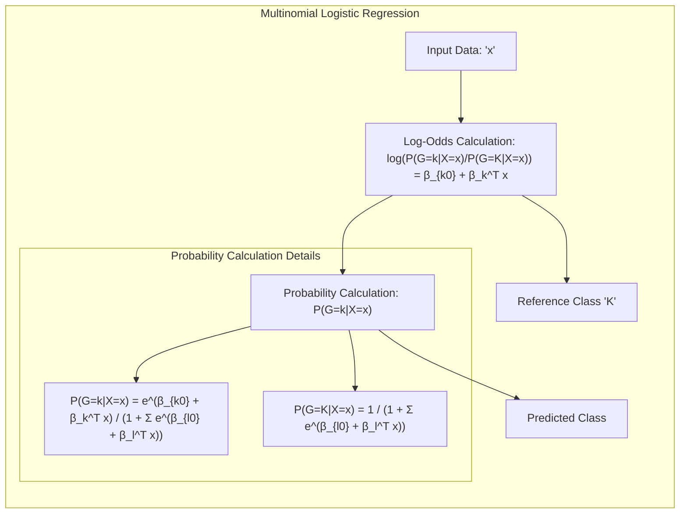
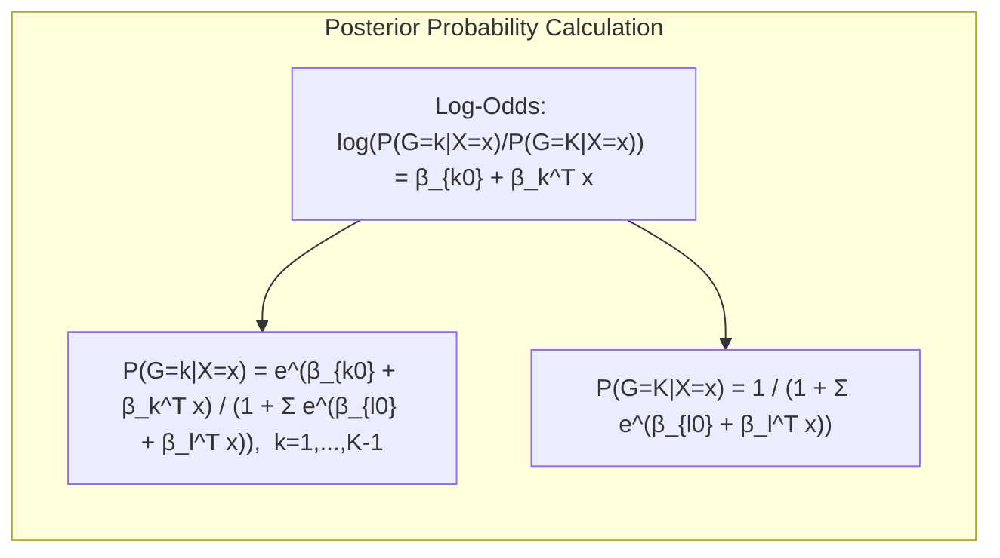
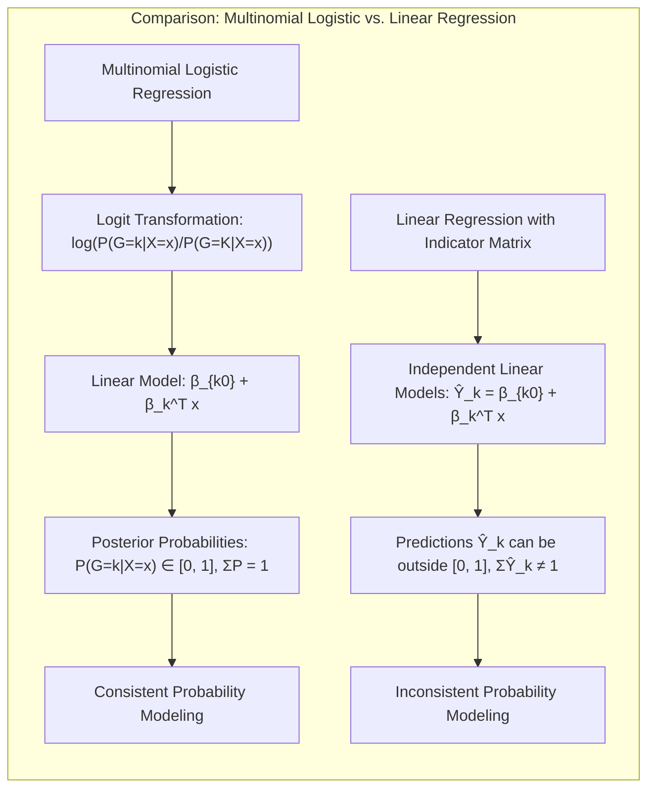
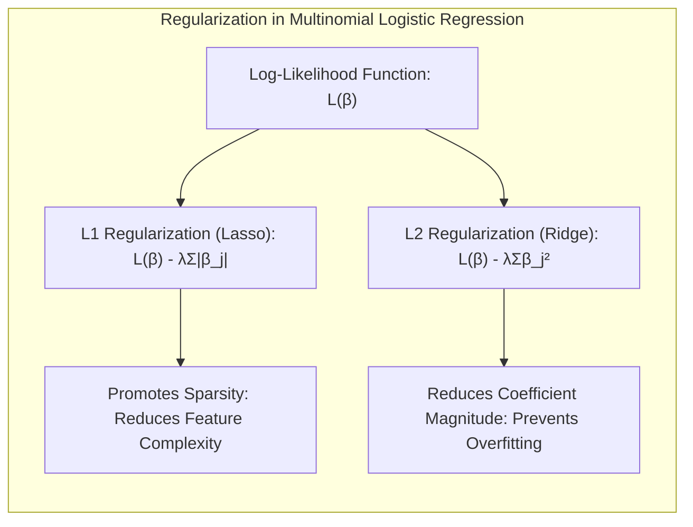
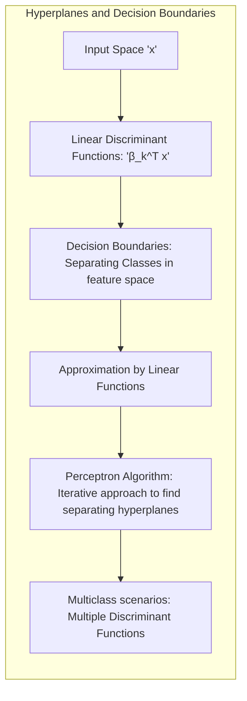
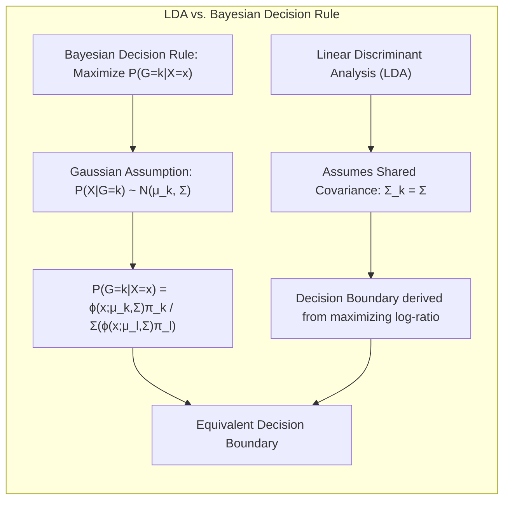

## Título Conciso: Classificação Multiclasse e Regressão Logística: Uso de Classe de Referência e Modelagem de Probabilidades Posteriores

### Introdução

Este capítulo explora a fundo a aplicação da **regressão logística multinomial** em problemas de classificação com mais de duas classes, e como a escolha de uma **classe de referência** pode simplificar a modelagem das **probabilidades posteriores**. Analisaremos como a regressão logística multinomial utiliza funções lineares para modelar o log-odds (logit) de cada classe em relação à classe de referência, e como essa abordagem garante que as probabilidades estimadas estejam no intervalo $[0,1]$ e somem a 1 [^4.4]. Compararemos essa abordagem com a **regressão linear com matrizes de indicadores**, que não impõe tais restrições sobre a forma das probabilidades [^4.2], e com o **Linear Discriminant Analysis (LDA)** e o **Quadratic Discriminant Analysis (QDA)**, que modelam as densidades condicionais das classes utilizando distribuições Gaussianas [^4.3]. Discutiremos também como a **seleção de variáveis e regularização** podem ser utilizadas para controlar a complexidade dos modelos multinomiais [^4.4.4], [^4.5]. O conceito de **hiperplanos separadores** também será analisado, mesmo em modelos de classificação multiclasse [^4.5.2]. O objetivo deste capítulo é fornecer uma compreensão detalhada e abrangente de como a regressão logística multinomial, com o uso de uma classe de referência, modela as probabilidades posteriores em problemas de classificação com múltiplas classes.

### Conceitos Fundamentais

**Conceito 1: Regressão Logística Multinomial e o Uso de uma Classe de Referência**

Na **regressão logística multinomial**, o log-odds (logit) de cada classe $k$, com $k = 1, \ldots, K-1$, em relação a uma classe de referência $K$ é modelado como uma função linear das variáveis preditoras $x$ [^4.4]:

$$
\log \frac{P(G=k|X=x)}{P(G=K|X=x)} = \beta_{k0} + \beta_k^T x
$$

onde $\beta_{k0}$ é o intercepto e $\beta_k$ é o vetor de coeficientes para a classe $k$. Ao escolher uma classe de referência, o modelo reduz o número de parâmetros a serem estimados e simplifica a modelagem das probabilidades posteriores. A modelagem das probabilidades posteriores de cada classe em relação à classe de referência através do log-odds é uma das características fundamentais da regressão logística multinomial, e uma forma de garantir que as probabilidades resultantes estejam bem calibradas e que somem a 1.

> 💡 **Exemplo Numérico:**
>
> Vamos considerar um problema de classificação com três classes (K=3), onde temos uma única variável preditora $x$. Suponha que a classe 3 seja a classe de referência. Temos as seguintes equações para o log-odds das classes 1 e 2 em relação à classe 3:
>
>  $$
> \log \frac{P(G=1|X=x)}{P(G=3|X=x)} = -0.5 + 1.2x
> $$
>
> $$
> \log \frac{P(G=2|X=x)}{P(G=3|X=x)} = 0.8 - 0.7x
> $$
>
>  Aqui, $\beta_{10} = -0.5$, $\beta_1 = 1.2$, $\beta_{20} = 0.8$ e $\beta_2 = -0.7$.  Se tivermos um ponto $x = 1$, podemos calcular os log-odds:
>
>  $$
> \log \frac{P(G=1|X=1)}{P(G=3|X=1)} = -0.5 + 1.2(1) = 0.7
> $$
>
> $$
> \log \frac{P(G=2|X=1)}{P(G=3|X=1)} = 0.8 - 0.7(1) = 0.1
> $$
>
>  Isso indica que, para $x=1$, a classe 1 tem um log-odds maior em relação à classe 3 do que a classe 2 em relação à classe 3. Isso se traduzirá em probabilidades posteriores diferentes, como veremos no próximo exemplo.

**Lemma 1:** *A regressão logística multinomial utiliza uma classe de referência para simplificar a modelagem das probabilidades posteriores, modelando o log-odds de cada classe em relação à classe de referência como uma função linear dos preditores, e a escolha da classe de referência não afeta a capacidade do modelo de separar as classes.* A prova deste lema está na forma como as probabilidades posteriores são obtidas através do log-odds, e a invariância da probabilidade posterior resultante à escolha da classe de referência.

**Conceito 2: Derivação das Probabilidades Posteriores na Regressão Logística Multinomial**

A partir das funções lineares que modelam os log-odds das classes em relação à classe de referência, é possível obter as probabilidades posteriores para todas as classes, utilizando as seguintes equações:

$$
P(G=k|X=x) = \frac{e^{\beta_{k0} + \beta_k^T x}}{1 + \sum_{l=1}^{K-1} e^{\beta_{l0} + \beta_l^T x}} \quad \text{ para } k=1, \ldots, K-1
$$

e

$$
P(G=K|X=x) = \frac{1}{1 + \sum_{l=1}^{K-1} e^{\beta_{l0} + \beta_l^T x}}
$$

Essas equações garantem que a soma das probabilidades posteriores para todas as classes seja igual a 1 e que as probabilidades estejam no intervalo [0, 1]. A utilização do logit como uma forma de definir as probabilidades posteriores garante que as restrições sobre a forma das probabilidades sejam cumpridas [^4.4].

> 💡 **Exemplo Numérico:**
>
> Continuando o exemplo anterior, com $x=1$, calculamos os log-odds como 0.7 e 0.1 para as classes 1 e 2, respectivamente, em relação à classe 3. Agora, vamos calcular as probabilidades posteriores:
>
> $$
> P(G=1|X=1) = \frac{e^{0.7}}{1 + e^{0.7} + e^{0.1}} = \frac{2.0137}{1 + 2.0137 + 1.1052} \approx  \frac{2.0137}{4.1189} \approx 0.489
> $$
>
> $$
> P(G=2|X=1) = \frac{e^{0.1}}{1 + e^{0.7} + e^{0.1}} = \frac{1.1052}{1 + 2.0137 + 1.1052} \approx \frac{1.1052}{4.1189} \approx 0.268
> $$
>
> $$
> P(G=3|X=1) = \frac{1}{1 + e^{0.7} + e^{0.1}} = \frac{1}{1 + 2.0137 + 1.1052} \approx  \frac{1}{4.1189} \approx 0.243
> $$
>
> Observe que $0.489 + 0.268 + 0.243 \approx 1$. As probabilidades estão entre 0 e 1, e somam aproximadamente 1, como esperado.  Para $x=1$, o modelo estima que a classe 1 tem a maior probabilidade posterior, seguida pela classe 2 e depois pela classe 3.

**Corolário 1:** *As probabilidades posteriores obtidas através da regressão logística multinomial, utilizando uma classe de referência, estão sempre no intervalo [0, 1] e somam a 1, o que garante a calibração e a consistência do modelo com a teoria de probabilidade.* Esse corolário demonstra como a regressão logística multinomial satisfaz as propriedades básicas da modelagem probabilística.

**Conceito 3: Interpretação dos Parâmetros da Regressão Logística Multinomial**

Os parâmetros $\beta_{k0}$ e $\beta_k$ na regressão logística multinomial são estimados através da maximização da verossimilhança dos dados de treinamento [^4.4.1]. Esses parâmetros representam o efeito das variáveis preditoras sobre o log-odds da classe $k$ em relação à classe de referência. A interpretação dos parâmetros pode ser um pouco mais complexa do que em modelos lineares simples, pois eles se referem à razão de chances entre a classe $k$ e a classe de referência.

> ⚠️ **Nota Importante**: A regressão logística multinomial, ao utilizar o log-odds e uma classe de referência, modela as probabilidades posteriores de forma consistente com a teoria de probabilidades, garantindo que as estimativas estejam entre 0 e 1 e somem a 1.

> ❗ **Ponto de Atenção**: A escolha da classe de referência não afeta a capacidade do modelo de separar as classes, mas pode influenciar a interpretação dos coeficientes.

> ✔️ **Destaque**: A escolha da classe de referência simplifica a modelagem da probabilidade posterior em problemas com múltiplas classes e permite a utilização de funções lineares para a modelagem do log-odds.

### Regressão Linear e Mínimos Quadrados para Classificação

A **regressão linear com matrizes de indicadores**, ao contrário da regressão logística multinomial, não utiliza uma classe de referência para modelar as probabilidades posteriores e não impõe a restrição de que as probabilidades somem a 1 e pertençam ao intervalo [0,1] [^4.2]. A regressão linear ajusta modelos lineares independentes para cada classe, o que pode levar a estimativas que não se comportam como probabilidades e não respeitam o conceito de probabilidade posterior. A regra de decisão na regressão linear se baseia na escolha da classe com a maior resposta do modelo linear ajustado, que não corresponde necessariamente à classe com maior probabilidade posterior [^4.2].

> 💡 **Exemplo Numérico:**
>
> Vamos considerar um problema de classificação com três classes (K=3) e uma única variável preditora $x$. Usando regressão linear com matrizes indicadoras, podemos ajustar três modelos lineares independentes para cada classe:
>
> $$
> \hat{Y}_1 = 0.2 + 0.5x
> $$
>
> $$
> \hat{Y}_2 = 0.1 - 0.3x
> $$
>
> $$
> \hat{Y}_3 = 0.3 + 0.2x
> $$
>
> Se tivermos um ponto $x = 1$, as previsões seriam:
>
> $$
> \hat{Y}_1 = 0.2 + 0.5(1) = 0.7
> $$
>
> $$
> \hat{Y}_2 = 0.1 - 0.3(1) = -0.2
> $$
>
> $$
> \hat{Y}_3 = 0.3 + 0.2(1) = 0.5
> $$
>
>  Aqui, a classe 1 tem a maior "resposta" (0.7), mas observe que a previsão para a classe 2 é negativa (-0.2), o que não faz sentido para uma probabilidade. Além disso, se somarmos as "probabilidades" estimadas, obtemos 0.7 -0.2 + 0.5 = 1, mas isso nem sempre acontece com regressão linear. As estimativas não estão necessariamente no intervalo [0,1] e não somam a 1. A classe 1 seria escolhida, mas a interpretação como probabilidade é perdida.

A falta de um modelo que imponha restrições nas probabilidades e de uma classe de referência na regressão linear com matrizes de indicadores pode tornar o método menos adequado para problemas de classificação multiclasse, uma vez que a estimação das probabilidades não é garantida. As estimativas de probabilidade da regressão linear podem não estar no intervalo [0,1], e podem não somar 1 para todas as classes, o que dificulta a aplicação da teoria de decisão e dificulta a interpretação dos resultados.

Em contraste, a regressão logística multinomial utiliza uma classe de referência para modelar o log-odds de cada classe, e a função logística para garantir que as probabilidades estejam no intervalo correto e somem 1 [^4.4]. Essa abordagem, portanto, se conecta diretamente com o conceito de modelagem da probabilidade posterior.

**Lemma 2:** *A regressão linear com matrizes de indicadores, ao contrário da regressão logística multinomial, não utiliza uma classe de referência e não modela diretamente as probabilidades posteriores, e as estimativas de probabilidade resultantes não necessariamente respeitam as restrições de intervalo [0,1] e somatório unitário.* A prova desse lema está na forma como o modelo é definido e ajustado.

**Corolário 2:** *A falta de modelagem direta das probabilidades posteriores na regressão linear com matrizes de indicadores dificulta a interpretação dos resultados como probabilidades e a utilização da teoria da decisão para a construção do modelo, o que a distingue de abordagens como a regressão logística multinomial, que modela as probabilidades através de uma transformação logit e uma classe de referência.* Este corolário ressalta a diferença fundamental entre os dois métodos, tanto na modelagem das probabilidades quanto na abordagem utilizada para a tomada de decisão.

A regressão linear, portanto, embora possa ser utilizada para problemas de classificação, não utiliza explicitamente os conceitos da teoria de decisão, enquanto a regressão logística multinomial modela as probabilidades posteriores e a escolha da classe de referência para simplificar a estimação dos parâmetros, e garantir que a probabilidade seja consistente e bem calibrada [^4.2], [^4.4].

### Métodos de Seleção de Variáveis e Regularização em Classificação

A **seleção de variáveis** e a **regularização** desempenham um papel crucial na construção de modelos de classificação multiclasse robustos e com boa capacidade de generalização, especialmente quando se utiliza a regressão logística multinomial [^4.5]. A regularização, ao adicionar termos de penalidade à função de custo, controla a magnitude dos coeficientes e evita o *overfitting*.

Na **regressão logística multinomial**, a regularização é implementada através da modificação da função de verossimilhança com a inclusão de um termo de penalidade:

$$
\max_{\beta_0, \beta} \left[ \sum_{i=1}^N \left( \sum_{k=1}^K y_{ik} (\beta_{k0} + \beta_k^T x_i) - \log \left(1 + \sum_{l=1}^{K-1} e^{\beta_{l0} + \beta_l^T x_i} \right) \right) - \lambda P(\beta) \right]
$$

onde $P(\beta)$ é a penalidade e $\lambda$ é o parâmetro de regularização. A penalidade **L1** (Lasso) é dada por $P(\beta) = \sum_{j=1}^p |\beta_j|$, que promove a esparsidade dos coeficientes, selecionando as variáveis mais relevantes para a modelagem do log-odds e das probabilidades posteriores [^4.4.4]. A penalidade **L2** (Ridge), dada por $P(\beta) = \sum_{j=1}^p \beta_j^2$, reduz a magnitude dos coeficientes e estabiliza o modelo [^4.5].

> 💡 **Exemplo Numérico:**
>
> Vamos considerar um problema de classificação com três classes e duas variáveis preditoras, $x_1$ e $x_2$. Suponha que ajustamos um modelo de regressão logística multinomial com regularização L1 (Lasso). Após a otimização, obtemos os seguintes coeficientes:
>
> Para a classe 1 (em relação à classe 3):
> $$ \beta_{10} = -0.2, \beta_{11} = 1.5, \beta_{12} = 0 $$
>
> Para a classe 2 (em relação à classe 3):
> $$ \beta_{20} = 0.4, \beta_{21} = 0, \beta_{22} = -0.8 $$
>
> Observe que $\beta_{12}$ e $\beta_{21}$ são 0 devido à regularização L1. Isso indica que a variável $x_2$ não contribui para a distinção entre a classe 1 e a classe 3, e a variável $x_1$ não contribui para a distinção entre a classe 2 e a classe 3. A regularização L1 selecionou as variáveis mais relevantes para cada classe.
>
> Se usarmos regularização L2 (Ridge), os coeficientes podem ser:
>
> Para a classe 1 (em relação à classe 3):
> $$ \beta_{10} = -0.1, \beta_{11} = 1.0, \beta_{12} = 0.3 $$
>
> Para a classe 2 (em relação à classe 3):
> $$ \beta_{20} = 0.3, \beta_{21} = -0.2, \beta_{22} = -0.5 $$
>
> Observe que, com L2, nenhum coeficiente é exatamente zero, mas seus valores são reduzidos, o que ajuda a estabilizar o modelo e reduzir o overfitting.
>
> Vamos supor que o lambda (λ) na regularização L1 é 0.5. Se aumentarmos o valor de lambda para 1.0, a penalidade aumenta e podemos obter:
>
> Para a classe 1 (em relação à classe 3):
> $$ \beta_{10} = -0.1, \beta_{11} = 0.8, \beta_{12} = 0 $$
>
> Para a classe 2 (em relação à classe 3):
> $$ \beta_{20} = 0.3, \beta_{21} = 0, \beta_{22} = -0.4 $$
>
> Ao aumentar o lambda, a penalização é mais forte, e mais coeficientes podem ser levados a zero.

A regularização, portanto, auxilia na construção de modelos de classificação multinomial mais robustos, que modelam as probabilidades posteriores de forma mais precisa. A seleção de variáveis, através da penalidade L1, também leva a modelos mais simples e interpretáveis, e diminui a chance de overfitting e melhora a capacidade de generalização.

**Lemma 3:** *A regularização L1 na regressão logística multinomial, ao promover a esparsidade dos coeficientes, leva à seleção de variáveis que são relevantes para a modelagem do log-odds e das probabilidades posteriores, simplificando o modelo e melhorando a sua interpretabilidade e capacidade de generalização*. A prova deste lema se encontra no efeito da penalidade L1 sobre a função de custo.

**Prova do Lemma 3:** A penalidade L1 força os coeficientes menos relevantes a se tornarem zero durante a maximização da função de custo, o que resulta na seleção das variáveis mais importantes para o modelo, e promove a esparsidade dos coeficientes e, consequentemente, modelos mais simples e robustos [^4.4.3], [^4.4.4]. $\blacksquare$

**Corolário 3:** *A seleção de variáveis e a regularização, ao controlarem a complexidade dos modelos de classificação multinomial, levam a estimativas mais precisas das probabilidades posteriores, reduzindo o risco de overfitting e aumentando a capacidade de generalização para novos dados.* O controle da complexidade através da regularização é uma ferramenta importante para modelos de classificação multiclasse.

> ⚠️ **Ponto Crucial**: A seleção de variáveis e a regularização são técnicas cruciais para construir modelos de classificação multinomial robustos e interpretáveis e para controlar a complexidade da modelagem das probabilidades posteriores [^4.5].

### Separating Hyperplanes e Perceptrons

A busca por **hiperplanos separadores** visa encontrar uma fronteira linear que maximize a separação entre as classes, e essa busca pode ser relacionada com a modelagem das probabilidades posteriores, especialmente em problemas de classificação binária [^4.5.2]. A aplicação do Perceptron, em cenários multiclasse, também pode ser feita com o uso de transformações que busquem encontrar as melhores projeções lineares que separem as classes, mesmo sem se utilizar a modelagem direta das probabilidades posteriores.

No contexto da regressão logística multinomial, a escolha de uma classe de referência permite a construção de modelos lineares que separam as classes, com base na forma funcional do log-odds que se conecta com as probabilidades posteriores. Embora as fronteiras entre classes não sejam exatamente hiperplanos no espaço original, elas se aproximam de um hiperplano no espaço do log-odds transformado.

O algoritmo do **Perceptron** é uma forma iterativa de buscar um hiperplano que minimize os erros de classificação, e pode ser estendido para problemas multiclasse através de diferentes abordagens para a escolha da classe em cada iteração, ou através da formulação do problema com o uso de funções discriminantes [^4.5.1]. A busca por hiperplanos separadores, nesse contexto, pode ser vista como uma forma de aproximar a separação entre as classes através de funções lineares que são conectadas com modelos como a regressão logística multinomial.

> 💡 **Exemplo Numérico:**
>
> Considere um problema de classificação com 3 classes e 2 variáveis preditoras. O Perceptron busca encontrar hiperplanos que separem as classes. Num cenário idealmente linearmente separável, teríamos:
>
> - Um hiperplano separando a classe 1 das classes 2 e 3.
> - Um hiperplano separando a classe 2 das classes 1 e 3.
> - Um hiperplano separando a classe 3 das classes 1 e 2.
>
> O Perceptron iterativamente ajusta os coeficientes desses hiperplanos até que os erros de classificação sejam minimizados. Em um problema de classificação multiclasse, isso pode envolver a construção de múltiplas funções discriminantes, uma para cada classe. O modelo de regressão logística multinomial, por sua vez, aproxima essas separações através do modelagem do log-odds, que resulta em probabilidades posteriores bem definidas.

**Teorema:** *Em problemas de classificação binária com dados linearmente separáveis, o algoritmo do Perceptron garante a convergência para um hiperplano separador, que pode ser interpretado como a busca por um hiperplano que separe as classes, utilizando informações sobre as probabilidades posteriores e que tenha o mesmo objetivo que a regressão logística, que é a separação das classes.* A convergência, no entanto, não é garantida em cenários multiclasse. [^4.5.1]

### Pergunta Teórica Avançada: Quais as diferenças fundamentais entre a formulação de LDA e a Regra de Decisão Bayesiana considerando distribuições Gaussianas com covariâncias iguais?

**Resposta:**

A **Regra de Decisão Bayesiana** busca classificar uma observação $x$ na classe $k$ que maximize a probabilidade posterior $P(G=k|X=x)$ [^4.3]. Sob a suposição de que as classes seguem distribuições Gaussianas com a mesma matriz de covariância $\Sigma$, a probabilidade posterior é dada por:

$$
P(G=k|X=x) = \frac{ \phi(x;\mu_k,\Sigma)\pi_k}{\sum_{l=1}^K \phi(x;\mu_l,\Sigma)\pi_l}
$$

onde $\phi(x;\mu_k,\Sigma)$ é a densidade gaussiana da classe $k$, $\mu_k$ é a média da classe $k$ e $\pi_k$ é a probabilidade a priori da classe. O **LDA**, por sua vez, deriva suas funções discriminantes lineares diretamente dessas suposições, e a fronteira de decisão é construída através da maximização do log-ratio das probabilidades posteriores [^4.3].

> 💡 **Exemplo Numérico:**
>
> Suponha que temos duas classes (K=2) com distribuições Gaussianas com a mesma matriz de covariância $\Sigma$, e que $\pi_1 = 0.6$ e $\pi_2 = 0.4$. Temos as médias $\mu_1 = [1, 1]$ e $\mu_2 = [3, 3]$. A Regra de Decisão Bayesiana calcula a probabilidade posterior para cada classe dado um ponto $x$ e classifica o ponto na classe com maior probabilidade posterior. O LDA, sob as mesmas premissas, encontra uma fronteira linear entre as duas classes.
>
> Se $\Sigma = \begin{bmatrix} 1 & 0 \\ 0 & 1 \end{bmatrix}$, e um ponto $x=[2,2]$, a probabilidade posterior da classe 1 é dada por:
>
> $P(G=1|X=x) =  \frac{ \phi(x;\mu_1,\Sigma)\pi_1}{\phi(x;\mu_1,\Sigma)\pi_1 + \phi(x;\mu_2,\Sigma)\pi_2} $
>
> $ \phi(x;\mu_1,\Sigma) = \frac{1}{2\pi} e^{-\frac{1}{2}( [2,2] - [1,1])^T \begin{bmatrix} 1 & 0 \\ 0 & 1 \end{bmatrix}^{-1} ([2,2] - [1,1])} = \frac{1}{2\pi} e^{-\frac{1}{2}( [1,1] \begin{bmatrix} 1 & 0 \\ 0 & 1 \end{bmatrix}^{-1} [1,1]^T)} = \frac{1}{2\pi} e^{-1} \approx 0.0585 $
>
> $ \phi(x;\mu_2,\Sigma) = \frac{1}{2\pi} e^{-\frac{1}{2}( [2,2] - [3,3])^T \begin{bmatrix} 1 & 0 \\ 0 & 1 \end{bmatrix}^{-1} ([2,2] - [3,3])} = \frac{1}{2\pi} e^{-\frac{1}{2}( [-1,-1] \begin{bmatrix} 1 & 0 \\ 0 & 1 \end{bmatrix}^{-1} [-1,-1]^T)} = \frac{1}{2\pi} e^{-1} \approx 0.0585 $
>
> $P(G=1|X=x) =  \frac{0.0585 \times 0.6}{0.0585 \times 0.6 + 0.0585 \times 0.4} = \frac{0.0351}{0.0351 + 0.0234} = \frac{0.0351}{0.0585} = 0.6 $
>
> Como $P(G=1|X=x) = 0.6$ e $P(G=2|X=x) = 0.4$, o ponto $x$ seria classificado como classe 1. O LDA, sob as mesmas premissas, chegará na mesma decisão.

**Lemma 4:** *Sob a suposição de que as classes seguem distribuições Gaussianas com a mesma matriz de covariância, a regra de decisão Bayesiana e o LDA levam à mesma fronteira de decisão linear e à mesma probabilidade posterior, mesmo utilizando diferentes formas de modelagem e derivação do modelo*. A equivalência é demonstrada através da manipulação algébrica, mostrando que a maximização da probabilidade posterior é equivalente à maximização da função discriminante do LDA. [^4.3]

**Corolário 4:** *Quando a restrição de igualdade de covariâncias é removida, a regra de decisão Bayesiana leva ao QDA, que utiliza matrizes de covariância distintas para cada classe, e as fronteiras de decisão não são mais lineares, mas sim quadráticas, e que a estimação dos parâmetros se torna computacionalmente mais complexa.* A flexibilidade do QDA impõe uma modelagem da decisão mais complexa [^4.3.1], [^4.3.3].

> ⚠️ **Ponto Crucial**: A principal diferença entre LDA e a regra de decisão Bayesiana reside na abordagem da modelagem. O LDA é um caso particular da regra Bayesiana sob suposição gaussianas e com covariâncias iguais. Sob as mesmas premissas, os modelos são equivalentes em termos de decisão, e sua diferença está nos pressupostos iniciais para a modelagem e na derivação da função de decisão [^4.3].

### Conclusão

Neste capítulo, exploramos a utilização da regressão logística multinomial para a modelagem de probabilidades posteriores em problemas de classificação com múltiplas classes. Analisamos como a escolha de uma classe de referência simplifica a modelagem do log-odds e como a função logística garante que as probabilidades estimadas estejam bem calibradas e pertençam ao intervalo [0,1] e somem a 1. Comparamos essa abordagem com a regressão linear com matrizes de indicadores, que não modela as probabilidades posteriores diretamente, e com o LDA, que utiliza a suposição gaussiana para a modelagem. Discutimos como a seleção de variáveis e a regularização são importantes para a construção de modelos multinomiais robustos e com boa capacidade de generalização, e como a busca por hiperplanos separadores se relaciona com a modelagem da probabilidade posterior e com a separação das classes. Ao longo deste capítulo, procuramos oferecer uma compreensão clara e aprofundada de como a regressão logística multinomial, utilizando o conceito de log-odds e uma classe de referência, modela probabilidades posteriores em problemas de classificação com múltiplas classes.

### Footnotes

[^4.1]: *In this chapter we revisit the classification problem and focus on linear methods for classification...There are several different ways in which linear decision boundaries can be found.*

[^4.2]: *In Chapter 2 we fit linear regression models to the class indicator variables, and classify to the largest fit...Linear inequalities in this space are quadratic inequalities in the original space.*

[^4.3]: *Decision theory for classification (Section 2.4) tells us that we need to know the class posteriors Pr(G|X) for optimal classification. Suppose fk(x) is the class-conditional density of X in class G = k, and let πκ be the prior probability of class k... Linear discriminant analysis (LDA) arises in the special case when we assume that the classes have a common covariance matrix Σk = Σ.*

[^4.3.1]: *The decision boundary between each pair of classes k and l is described by a quadratic equation {x: δκ(x) = δ(x)}.*

[^4.3.3]: *In the special case when we assume that the classes have a common covariance matrix...When the classes are really Gaussian, then LDA is optimal*

[^4.4]: *The logistic regression model arises from the desire to model the posterior probabilities of the K classes via linear functions in x, while at the same time ensuring that they sum to one and remain in [0,1].*

[^4.4.