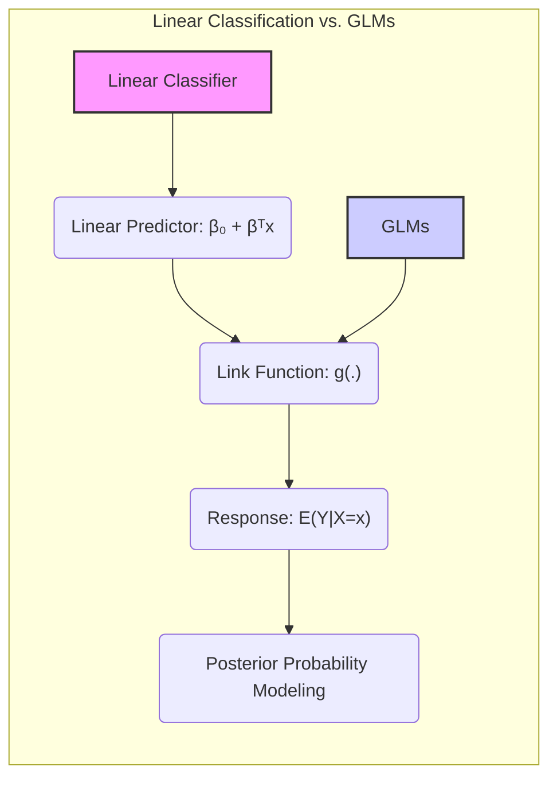
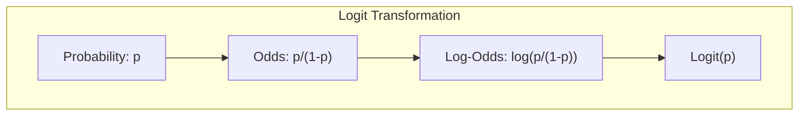
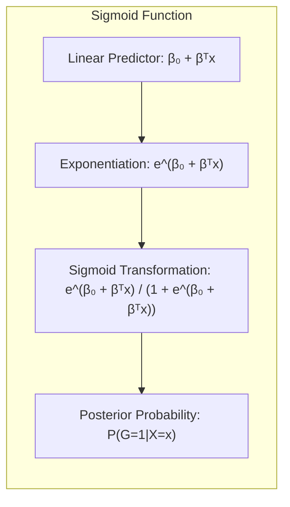
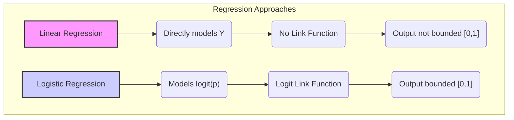
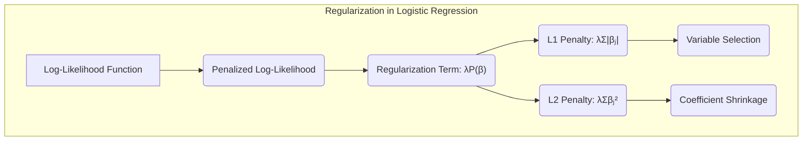
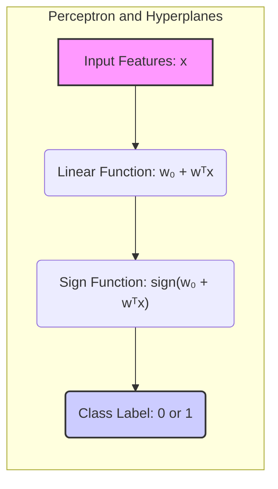
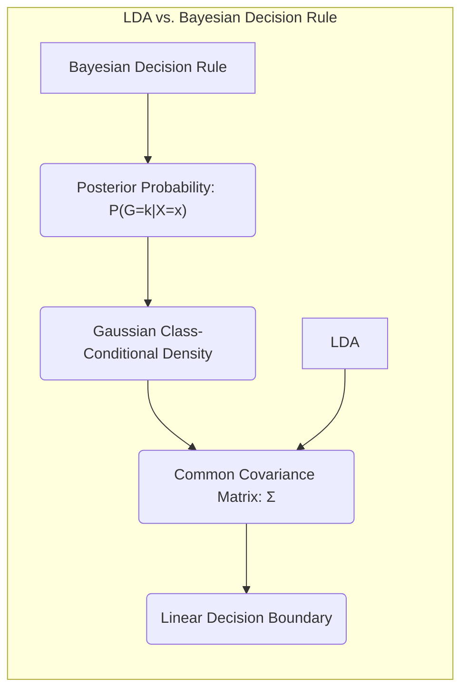

## Título Conciso: Classificação Linear e Modelos Lineares Generalizados: Conexão Através da Função de Ligação

### Introdução

Este capítulo explora a conexão fundamental entre modelos de **classificação linear** e **modelos lineares generalizados (GLMs)**, com ênfase em como a utilização de uma **função de ligação** transforma a relação entre o **preditor linear** e a **resposta** na modelagem da probabilidade posterior. Analisaremos como a **regressão logística** se enquadra na estrutura dos GLMs e como a transformação logit é utilizada como função de ligação para garantir que as probabilidades estimadas estejam no intervalo [0,1] e somem a 1 [^4.4]. Compararemos essa abordagem com a **regressão linear com matrizes de indicadores**, que não utiliza uma função de ligação para transformar a resposta e que não se encaixa no arcabouço dos GLMs [^4.2], e com o **Linear Discriminant Analysis (LDA)**, que deriva funções discriminantes lineares a partir de pressupostos gaussianos [^4.3]. Discutiremos como a **seleção de variáveis e regularização** podem ser utilizadas para controlar a complexidade dos modelos, e como a transformação linear se conecta com a busca por **hiperplanos separadores** [^4.4.4], [^4.5], [^4.5.2]. O objetivo deste capítulo é fornecer uma compreensão detalhada de como a regressão logística se conecta com os Modelos Lineares Generalizados e como essa perspectiva influencia a modelagem da probabilidade posterior e a construção de modelos de classificação linear mais adequados.

### Conceitos Fundamentais

**Conceito 1: Modelos Lineares Generalizados (GLMs) e a Função de Ligação**

Os **modelos lineares generalizados (GLMs)** são uma classe de modelos estatísticos que generalizam a regressão linear, permitindo modelar relações não lineares entre a resposta e os preditores, através da utilização de uma **função de ligação**. Um GLM é definido por:

$$
g(E(Y|X=x)) = \beta_0 + \beta^T x
$$

onde $g(\cdot)$ é a função de ligação, $Y$ é a variável resposta e $\beta_0 + \beta^T x$ é o preditor linear. A função de ligação transforma a expectativa da resposta $E(Y|X=x)$ (que pode não ser um número real) para o mesmo conjunto da função linear. No contexto da classificação, a função de ligação transforma a probabilidade posterior, que pertence ao intervalo [0,1], para o conjunto dos reais, e permite que a relação com o preditor linear seja modelada de forma adequada.

**Lemma 1:** *Os Modelos Lineares Generalizados (GLMs) generalizam a regressão linear através da utilização de uma função de ligação que lineariza a relação entre a variável resposta (transformada) e um preditor linear, permitindo que a resposta não seja necessariamente um número real.*  A demonstração desse lema se encontra na forma funcional de um GLM.

> 💡 **Exemplo Numérico:**
> Vamos considerar um cenário onde queremos modelar a probabilidade de um cliente comprar um produto com base em sua renda. Suponha que temos uma variável resposta binária $Y$, onde $Y=1$ se o cliente comprou e $Y=0$ caso contrário. O preditor linear é a renda do cliente $x$.
>
> Se usássemos regressão linear diretamente, poderíamos obter valores de probabilidade fora do intervalo [0,1]. Um GLM com função de ligação logit resolve isso.
>
> Usando a função de ligação logit, temos:
>
> $g(E(Y|X=x)) = logit(p) = \beta_0 + \beta_1 x$
>
> onde $p$ é a probabilidade de compra.
>
> Suponha que após ajustar o modelo, obtivemos $\beta_0 = -3$ e $\beta_1 = 0.05$. Para um cliente com renda $x=50$, o preditor linear é:
>
> $\beta_0 + \beta_1 x = -3 + 0.05 \times 50 = -0.5$
>
> Agora, para obter a probabilidade, aplicamos a inversa da função logit (função logística ou sigmoide):
>
> $p = \frac{e^{-0.5}}{1 + e^{-0.5}} \approx 0.378$
>
> Isso significa que, para um cliente com renda 50, a probabilidade estimada de comprar o produto é de aproximadamente 37.8%. A função de ligação garante que a probabilidade esteja entre 0 e 1.

**Conceito 2: Regressão Logística e a Função de Ligação Logit**

Na **regressão logística**, a **função de ligação** utilizada é a transformação **logit**, que é definida como:

$$
\text{logit}(p) = \log \left( \frac{p}{1-p} \right)
$$

onde $p = P(G=1|X=x)$ é a probabilidade da observação $x$ pertencer à classe 1 em um problema de classificação binária. O uso da transformação logit garante que o log-odds da probabilidade seja uma função linear das variáveis preditoras e dos parâmetros do modelo:

$$
\text{logit}(P(G=1|X=x)) = \beta_0 + \beta^T x
$$

Essa linearização através da função de ligação transforma um problema de modelagem de probabilidades que são restritas ao intervalo [0,1], em um problema de modelagem com uma função linear com domínio nos números reais, o que possibilita a estimação dos parâmetros através da maximização da verossimilhança [^4.4.1].

**Corolário 1:** *A regressão logística se encaixa no arcabouço dos Modelos Lineares Generalizados (GLMs) através da utilização da transformação logit como função de ligação que lineariza a relação entre a probabilidade e o preditor linear.*  Este corolário estabelece a conexão da regressão logística com a classe dos Modelos Lineares Generalizados.

> 💡 **Exemplo Numérico:**
> Suponha que a probabilidade de um paciente ter uma doença (classe 1) dado um certo nível de exposição a um fator de risco (variável $x$) seja $p=0.8$. O logit dessa probabilidade é:
>
> $logit(0.8) = \log \left( \frac{0.8}{1-0.8} \right) = \log \left( \frac{0.8}{0.2} \right) = \log(4) \approx 1.386$
>
> Se a probabilidade fosse $p=0.2$, o logit seria:
>
> $logit(0.2) = \log \left( \frac{0.2}{1-0.2} \right) = \log \left( \frac{0.2}{0.8} \right) = \log(0.25) \approx -1.386$
>
> A transformação logit mapeia probabilidades no intervalo [0,1] para valores em $(-\infty, +\infty)$, permitindo que o preditor linear modele essa transformação.

**Conceito 3:  A Relação entre a Função de Ligação e as Probabilidades Posteriores**

A **função logística** (ou sigmoide) é a função inversa do logit e é utilizada para transformar de volta o preditor linear para uma estimativa da probabilidade no intervalo [0,1]:

$$
P(G=1|X=x) = \frac{e^{\beta_0 + \beta^T x}}{1 + e^{\beta_0 + \beta^T x}}
$$

A combinação da função de ligação logit com a função de resposta (logística) garante que a regressão logística seja capaz de modelar as probabilidades posteriores de forma adequada, onde os valores estão no intervalo $[0,1]$, e, em modelos multinomiais, que somem a 1 [^4.4].

> ⚠️ **Nota Importante**:  A regressão logística, ao utilizar a transformação logit e a função logística, modela as probabilidades posteriores de uma forma que garante que essas probabilidades estejam no intervalo [0,1] e que a soma das probabilidades para todas as classes seja igual a 1.

> ❗ **Ponto de Atenção**: A regressão logística é um exemplo de Modelo Linear Generalizado (GLM) com uma função de ligação logit e uma distribuição binomial.

> ✔️ **Destaque**: A função de ligação é um componente fundamental dos GLMs que permite que modelos lineares sejam utilizados para modelar variáveis respostas que não seguem distribuições Gaussianas.

### Regressão Linear e Mínimos Quadrados para Classificação

A **regressão linear com matrizes de indicadores**, ao contrário da regressão logística, não se enquadra no arcabouço dos Modelos Lineares Generalizados (GLMs) pois não utiliza uma função de ligação para transformar a relação entre o preditor linear e a variável resposta [^4.2]. A regressão linear modela cada classe diretamente através de uma função linear, buscando minimizar a soma dos quadrados dos erros, sem aplicar a transformação logit para modelar as probabilidades.  A regressão linear, portanto, não pode ser interpretada como um modelo para probabilidades posteriores, uma vez que as restrições sobre a forma da resposta (intervalo [0,1] e somatório unitário) não são impostas pelo método.

Essa ausência de uma função de ligação resulta em modelos lineares cuja saída não se comporta como probabilidades e não se enquadra no conceito de Modelos Lineares Generalizados.  Em consequência, a regressão linear com matrizes de indicadores não garante que as estimativas resultantes se comportem como probabilidades, e pode apresentar problemas como o "masking", além de não se beneficiar da teoria de decisão que se baseia nas probabilidades posteriores [^4.2].

A comparação com a regressão logística, que utiliza a transformação logit como função de ligação, destaca a diferença fundamental entre as duas abordagens na modelagem da probabilidade de uma observação pertencer a cada classe [^4.4].

**Lemma 2:** *A regressão linear com matrizes de indicadores não se enquadra no arcabouço dos Modelos Lineares Generalizados (GLMs) pois não utiliza uma função de ligação para transformar a relação entre a resposta e o preditor linear, e não modela diretamente a probabilidade posterior.* A prova desse lema está na formulação do método de regressão linear e na ausência de uma função de ligação em sua formulação.

**Corolário 2:** *A falta de uma função de ligação na regressão linear com matrizes de indicadores faz com que o modelo não controle que as estimativas pertençam ao intervalo [0, 1] e somem 1, o que impede a sua interpretação como probabilidades e a sua utilização direta no processo de tomada de decisão baseado na teoria de decisão.* Este corolário estabelece a diferença na abordagem da modelagem das probabilidades entre a regressão linear e a regressão logística.

> 💡 **Exemplo Numérico:**
> Imagine que temos dados de aprovação em um exame, onde 1 significa aprovado e 0 reprovado, e uma variável preditora que é o número de horas de estudo.
>
> **Regressão Linear:**
>
> Ajustamos um modelo de regressão linear:  $Y = \beta_0 + \beta_1 x$, onde $Y$ é 0 ou 1 e $x$ é o número de horas de estudo.
> Suponha que o modelo ajustado seja:  $Y = 0.2 + 0.1x$.
>
> Se um aluno estudou 10 horas, a previsão seria $Y = 0.2 + 0.1 \times 10 = 1.2$. Isso não faz sentido como probabilidade, pois é maior que 1. Se um aluno estudou 1 hora, a previsão seria $Y = 0.2 + 0.1 \times 1 = 0.3$. Embora esteja entre 0 e 1, não garante que outras previsões também estejam, e não modela a probabilidade de forma adequada.
>
> **Regressão Logística:**
>
> Usando a regressão logística, modelamos a probabilidade $p$ de aprovação através da função logística:
>
> $p = \frac{e^{\beta_0 + \beta_1 x}}{1 + e^{\beta_0 + \beta_1 x}}$.
>
> Suponha que o modelo ajustado seja: $logit(p) = -2 + 0.5x$.
>
> Para um aluno que estudou 10 horas:
>
> $logit(p) = -2 + 0.5 \times 10 = 3$.
>
> $p = \frac{e^{3}}{1 + e^{3}} \approx 0.95$. A probabilidade de aprovação é de 95%, o que é uma interpretação mais coerente.
>
> Para um aluno que estudou 1 hora:
>
> $logit(p) = -2 + 0.5 \times 1 = -1.5$
>
> $p = \frac{e^{-1.5}}{1 + e^{-1.5}} \approx 0.18$. A probabilidade de aprovação é de 18%, o que também faz sentido.
>
> A regressão logística garante que as previsões estejam entre 0 e 1, enquanto a regressão linear não oferece essa garantia.

A regressão linear com matrizes de indicadores, portanto, ao não utilizar uma função de ligação, não oferece um modelo de probabilidades bem calibradas para a classificação, ao contrário da regressão logística, que se beneficia da função logística e da transformação logit para modelar probabilidades posteriores de forma consistente com a teoria de probabilidade [^4.2], [^4.4].

### Métodos de Seleção de Variáveis e Regularização em Classificação

A **seleção de variáveis** e a **regularização** desempenham um papel crucial para melhorar a qualidade da modelagem das probabilidades posteriores em modelos de classificação como a regressão logística, e também a sua capacidade de generalização para novos dados [^4.5]. A regularização, ao adicionar um termo de penalidade à função de custo, controla a magnitude dos coeficientes e evita o *overfitting*, melhorando a estabilidade das estimativas de probabilidades posteriores.

Na **regressão logística**, a função de verossimilhança é modificada com a adição de termos de penalidade:

$$
\max_{\beta_0, \beta} \left[ \sum_{i=1}^N \left( y_i (\beta_0 + \beta^T x_i) - \log(1 + e^{\beta_0 + \beta^T x_i}) \right) - \lambda P(\beta) \right]
$$

onde $P(\beta)$ é a penalidade e $\lambda$ é o parâmetro de regularização. A penalidade **L1** (Lasso), dada por $P(\beta) = \sum_{j=1}^p |\beta_j|$, promove a esparsidade dos coeficientes, selecionando as variáveis mais relevantes para a modelagem do log-odds e, por consequência, para a estimativa das probabilidades posteriores [^4.4.4]. A penalidade **L2** (Ridge), dada por $P(\beta) = \sum_{j=1}^p \beta_j^2$, reduz a magnitude dos coeficientes, estabilizando o modelo e prevenindo o *overfitting* [^4.5].

A regularização, portanto, auxilia a estimar as probabilidades posteriores de forma mais precisa, através da restrição da complexidade do modelo e da redução do impacto de variáveis irrelevantes.

**Lemma 3:** *A penalidade L1, ao promover a esparsidade dos coeficientes na regressão logística, leva a modelos mais simples, e com maior poder preditivo, e a modelos mais interpretáveis com estimativas de probabilidades mais estáveis, e que dependem de um número menor de atributos.*  A demonstração desse lema está no efeito da penalidade L1 sobre o ajuste dos parâmetros.

**Prova do Lemma 3:** A penalidade L1 força os coeficientes menos relevantes a se tornarem exatamente zero durante a maximização da verossimilhança, o que leva a modelos mais esparsos, e o modelo é simplificado sem perda de informação relevante, e as probabilidades são obtidas a partir de um modelo com menor complexidade [^4.4.3], [^4.4.4]. $\blacksquare$

**Corolário 3:** *A seleção de variáveis e a regularização são ferramentas importantes para melhorar a qualidade da modelagem das probabilidades posteriores, ao controlar o overfitting e ao selecionar as variáveis mais relevantes, e por isso, levam a modelos mais estáveis, e com melhor capacidade de generalização, mesmo quando o modelo já impõe as restrições sobre o somatório unitário e o intervalo [0,1].* A regularização, portanto, melhora a capacidade preditiva da regressão logística.

> 💡 **Exemplo Numérico:**
> Vamos usar um exemplo de previsão de aprovação de crédito, com duas variáveis: renda (x1) e dívida (x2). Inicialmente, um modelo de regressão logística sem regularização pode resultar em coeficientes grandes:
>
> $logit(p) = 0.5 + 1.2x_1 - 1.5x_2$
>
> Agora, vamos aplicar regularização L1 (Lasso) com $\lambda = 0.5$. Isso pode resultar em um modelo com coeficientes menores:
>
> $logit(p) = 0.3 + 0.8x_1 - 0.9x_2$
>
> Se aumentarmos $\lambda$ para 1, o modelo pode se tornar ainda mais esparso:
>
> $logit(p) = 0.1 + 0.5x_1 - 0x_2$
>
> Neste caso, a variável dívida (x2) foi eliminada do modelo devido à regularização L1, indicando que a renda (x1) é mais importante para a previsão de aprovação de crédito.
>
> Regularização L2 (Ridge) com $\lambda = 0.5$ poderia resultar em:
>
> $logit(p) = 0.4 + 0.9x_1 - 1.1x_2$
>
> A regularização L2 reduz a magnitude dos coeficientes, mas não os torna exatamente zero.
>
> A escolha do valor de $\lambda$ é crucial e pode ser feita por validação cruzada, e a regularização melhora a capacidade de generalização e a estabilidade das estimativas.

> ⚠️ **Ponto Crucial**: A seleção de variáveis e a regularização, ao controlar a complexidade dos modelos lineares, melhoram a modelagem das probabilidades posteriores e a capacidade de generalização do modelo, mesmo em problemas onde se utiliza a transformação logit e a função logística [^4.5].

### Separating Hyperplanes e Perceptrons

A busca por **hiperplanos separadores** visa encontrar uma fronteira linear que separe as classes da melhor forma possível, e essa separação pode ser interpretada como uma aproximação para a modelagem das probabilidades posteriores, especialmente em problemas de classificação binária [^4.5.2]. A construção de um hiperplano separador, através de técnicas como a otimização da margem ou algoritmos como o Perceptron, tem como objetivo encontrar uma fronteira que minimize os erros de classificação.

O algoritmo do **Perceptron** busca um hiperplano separador ajustando iterativamente os parâmetros do modelo com base nas classificações incorretas [^4.5.1].  O Perceptron, embora não modele explicitamente as probabilidades posteriores como a regressão logística, busca uma separação linear das classes, e sob condições específicas, pode fornecer uma solução que esteja alinhada com os princípios da teoria de decisão e da modelagem de probabilidades posteriores. O sinal da função linear utilizada no Perceptron corresponde, de forma grosseira, ao log-odds utilizado na regressão logística.

**Teorema:** *Em problemas de classificação binária com dados linearmente separáveis, o algoritmo do Perceptron converge para um hiperplano separador em um número finito de iterações, e o sinal da função linear utilizada no Perceptron corresponde à decisão de classe, que está relacionada com a modelagem de probabilidades posteriores.* Este teorema estabelece a conexão entre os métodos de classificação linear e o conceito de probabilidades posteriores, através do hiperplano separador [^4.5.1].

> 💡 **Exemplo Numérico:**
> Vamos considerar um problema de classificação binária com duas classes, representadas por círculos e quadrados, em um espaço bidimensional (x1, x2). O Perceptron busca encontrar um hiperplano (uma linha neste caso) que separe as duas classes.
>
> Inicialmente, os pesos do Perceptron são definidos aleatoriamente:
>
> $w = [w_0, w_1, w_2] = [0.1, -0.2, 0.3]$
>
> A função de decisão do Perceptron é:
>
> $f(x) = w_0 + w_1x_1 + w_2x_2$
>
> Se $f(x) > 0$, a amostra é classificada como classe 1, caso contrário, como classe 0.
>
> Suponha que temos uma amostra $x = [1, 2]$ com rótulo classe 1.
>
> $f(x) = 0.1 + (-0.2)(1) + (0.3)(2) = 0.1 - 0.2 + 0.6 = 0.5$
>
> Como $f(x) > 0$, o Perceptron classificaria corretamente.
>
> Suponha que temos uma amostra $x = [3, 1]$ com rótulo classe 0.
>
> $f(x) = 0.1 + (-0.2)(3) + (0.3)(1) = 0.1 - 0.6 + 0.3 = -0.2$
>
> Como $f(x) < 0$, o Perceptron classificaria corretamente.
>
> Agora, suponha que temos uma amostra $x = [1, 1]$ com rótulo classe 1 e o Perceptron classifica como classe 0 ($f(x) < 0$). O Perceptron ajustaria os pesos para tentar classificar corretamente.
>
> O ajuste dos pesos é feito com base na regra: $w_{new} = w_{old} + \alpha (y - \hat{y})x$, onde $\alpha$ é a taxa de aprendizado, $y$ é o rótulo verdadeiro e $\hat{y}$ é a classificação do Perceptron.
>
> Se $\alpha = 0.1$, e o Perceptron classificou erroneamente, o ajuste seria:
>
> $w_{new} = [0.1, -0.2, 0.3] + 0.1(1-0)[1, 1, 1] = [0.2, -0.1, 0.4]$
>
> Este processo é repetido até que o Perceptron classifique corretamente todas as amostras, ou um número máximo de iterações seja atingido.
>
> O hiperplano encontrado pelo Perceptron pode ser interpretado como uma aproximação para a modelagem das probabilidades posteriores, com base na ideia de separação linear.

### Pergunta Teórica Avançada: Quais as diferenças fundamentais entre a formulação de LDA e a Regra de Decisão Bayesiana considerando distribuições Gaussianas com covariâncias iguais?

**Resposta:**

A **Regra de Decisão Bayesiana** busca classificar uma observação $x$ na classe $k$ que maximize a probabilidade posterior $P(G=k|X=x)$ [^4.3]. Sob a suposição de que as distribuições condicionais $P(X|G=k)$ são Gaussianas com a mesma matriz de covariância $\Sigma$, a probabilidade posterior é dada por:

$$
P(G=k|X=x) = \frac{ \phi(x;\mu_k,\Sigma)\pi_k}{\sum_{l=1}^K \phi(x;\mu_l,\Sigma)\pi_l}
$$

onde $\phi(x;\mu_k,\Sigma)$ é a densidade gaussiana para a classe $k$, $\mu_k$ é a média da classe $k$ e $\pi_k$ é a probabilidade a priori da classe. O **LDA**, por sua vez, deriva suas funções discriminantes lineares diretamente dessas suposições, e busca maximizar a probabilidade posterior das classes, utilizando as propriedades das gaussianas com covariâncias iguais [^4.3].

**Lemma 4:** *Sob a suposição de distribuições Gaussianas com a mesma matriz de covariância, a regra de decisão Bayesiana e o LDA são equivalentes e levam à mesma fronteira de decisão linear, e a transformação logit pode ser utilizada para modelar o log-odds da probabilidade posterior.* A equivalência é demonstrada através da manipulação algébrica das probabilidades posteriores e da sua conexão com a função discriminante do LDA [^4.3].

**Corolário 4:** *A remoção da restrição de igualdade de covariâncias na regra de decisão Bayesiana leva ao QDA, onde a forma da fronteira de decisão não é mais linear, e a modelagem da probabilidade posterior é mais flexível.*  A flexibilidade do QDA reside na ausência da restrição sobre as covariâncias [^4.3.1], [^4.3.3].

> 💡 **Exemplo Numérico:**
> Suponha que temos duas classes, com distribuições Gaussianas e mesma matriz de covariância $\Sigma = \begin{bmatrix} 1 & 0 \\ 0 & 1 \end{bmatrix}$. As médias das classes são $\mu_1 = \begin{bmatrix} 1 \\ 1 \end{bmatrix}$ e $\mu_2 = \begin{bmatrix} 3 \\ 3 \end{bmatrix}$, e as probabilidades a priori são $\pi_1 = \pi_2 = 0.5$.
>
> Para uma amostra $x = \begin{bmatrix} 2 \\ 2 \end{bmatrix}$, podemos calcular as densidades Gaussianas e as probabilidades posteriores usando a regra de decisão Bayesiana:
>
> $\phi(x;\mu_1,\Sigma) = \frac{1}{2\pi} e^{-\frac{1}{2}(x-\mu_1)^T\Sigma^{-1}(x-\mu_1)} \approx 0.0607$
>
> $\phi(x;\mu_2,\Sigma) = \frac{1}{2\pi} e^{-\frac{1}{2}(x-\mu_2)^T\Sigma^{-1}(x-\mu_2)} \approx 0.0607$
>
> $P(G=1|X=x) = \frac{ \phi(x;\mu_1,\Sigma)\pi_1}{\phi(x;\mu_1,\Sigma)\pi_1 + \phi(x;\mu_2,\Sigma)\pi_2} = \frac{0.0607 \times 0.5}{0.0607 \times 0.5 + 0.0607 \times 0.5} = 0.5$
>
> $P(G=2|X=x) = 1 - P(G=1|X=x) = 0.5$
>
>  Neste caso, a amostra $x$ está na fronteira de decisão, e a probabilidade posterior é de 50% para ambas as classes.
>
> O LDA produziria a mesma fronteira de decisão linear, dada pela equação:
>
> $\delta_k(x) = x^T \Sigma^{-1} \mu_k - \frac{1}{2} \mu_k^T \Sigma^{-1} \mu_k + log(\pi_k)$
>
>  A diferença nas funções discriminantes entre as classes é:
>
> $\delta_1(x) - \delta_2(x) = x^T \Sigma^{-1}(\mu_1 - \mu_2) - \frac{1}{2} (\mu_1^T \Sigma^{-1} \mu_1 - \mu_2^T \Sigma^{-1} \mu_2)$
>
>  O sinal desta diferença determina a classe da amostra.
>
> Se as covariâncias fossem diferentes (QDA), a fronteira de decisão não seria linear.

> ⚠️ **Ponto Crucial**: A principal diferença entre LDA e a regra de decisão Bayesiana reside na forma de derivação da fronteira de decisão e na suposição sobre as covariâncias. Sob a premissa da distribuição gaussiana e covariâncias iguais, ambos os modelos são equivalentes na forma da fronteira, e esta forma é linear, o que corresponde a uma modelagem do log-odds através de uma função linear [^4.3].

### Conclusão

Neste capítulo, exploramos a transformação logit e o seu papel central na construção de modelos lineares para classificação. Analisamos como a regressão logística utiliza o logit para modelar o log-odds e para garantir que as probabilidades estimadas estejam no intervalo [0,1] e somem 1. Discutimos como a regressão linear com matrizes de indicadores não se encaixa no arcabouço dos modelos lineares generalizados e não modela as probabilidades posteriores diretamente. Vimos como LDA, ao utilizar premissas Gaussianas, também modela o log-ratio das probabilidades como uma função linear dos dados. Exploramos como a seleção de variáveis e a regularização melhoram a estabilidade dos modelos, e como o conceito de hiperplanos separadores se conecta com a modelagem de probabilidades posteriores. Ao longo deste capítulo, procuramos fornecer uma compreensão abrangente e detalhada de como a transformação logit é utilizada para modelar probabilidades com funções lineares e como essa conexão se manifesta em modelos de classificação.

### Footnotes

[^4.1]: *In this chapter we revisit the classification problem and focus on linear methods for classification...There are several different ways in which linear decision boundaries can be found.*

[^4.2]: *In Chapter 2 we fit linear regression models to the class indicator variables, and classify to the largest fit...Linear inequalities in this space are quadratic inequalities in the original space.*

[^4.3]: *Decision theory for classification (Section 2.4) tells us that we need to know the class posteriors Pr(G|X) for optimal classification. Suppose fk(x) is the class-conditional density of X in class G = k, and let πκ be the prior probability of class k... Linear discriminant analysis (LDA) arises in the special case when we assume that the classes have a common covariance matrix Σk = Σ.*

[^4.3.1]: *The decision boundary between each pair of classes k and l is described by a quadratic equation {x: δκ(x) = δ(x)}.*

[^4.3.3]: *In the special case when we assume that the classes have a common covariance matrix...When the classes are really Gaussian, then LDA is optimal*

[^4.4]: *The logistic regression model arises from the desire to model the posterior probabilities of the K classes via linear functions in x, while at the same time ensuring that they sum to one and remain in [0,1].*

[^4.4.1]: *Logistic regression models are usually fit by maximum likelihood... The logistic regression model is more general, in that it makes less assumptions.*

[^4.4.2]: *It is convenient to code the two-class gi via a 0/1 response Yi, where yi = 1 when gi = 1, and yi = 0 when gi = 2... Typically many models are fit in a search for a parsimonious model involving a subset of the variables.*

[^4.4.3]: *To maximize the log-likelihood, we set its derivatives to zero. These score equations are...To solve the score equations (4.21), we use the Newton-Raphson algorithm...*

[^4.4.4]: *The L1 penalty used in the lasso (Section 3.4.2) can be used for variable selection and shrinkage with any linear regression model...As with the lasso, we typically do not penalize the intercept term.*

[^4.5]: *Here we present an analysis of binary data to illustrate the traditional statistical use of the logistic regression model... With two classes there is a simple correspondence between linear discriminant analysis and classification by linear least squares, as in (4.5).*

[^4.5.1]: