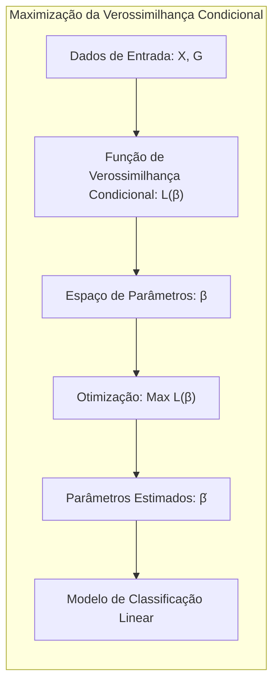
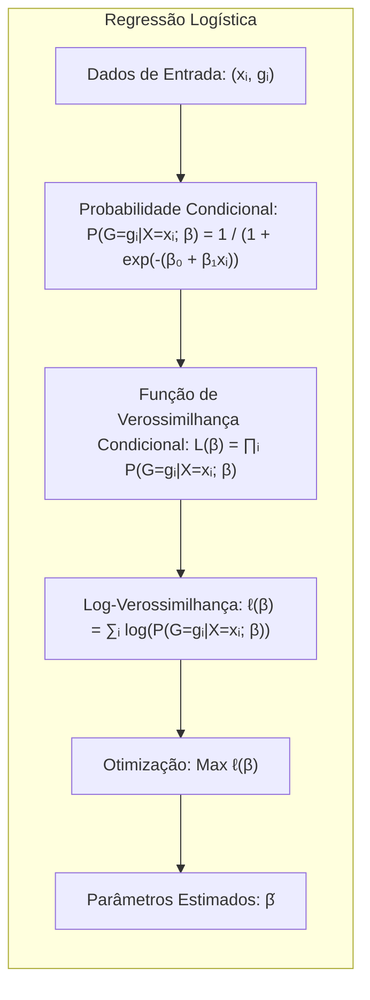
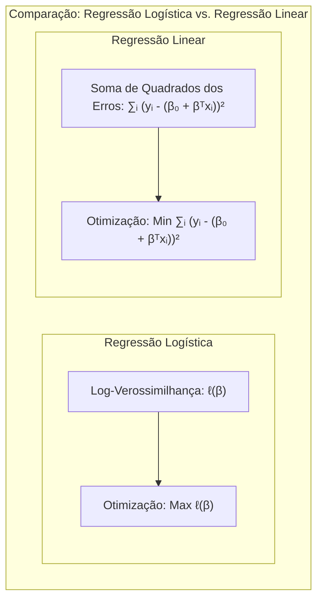
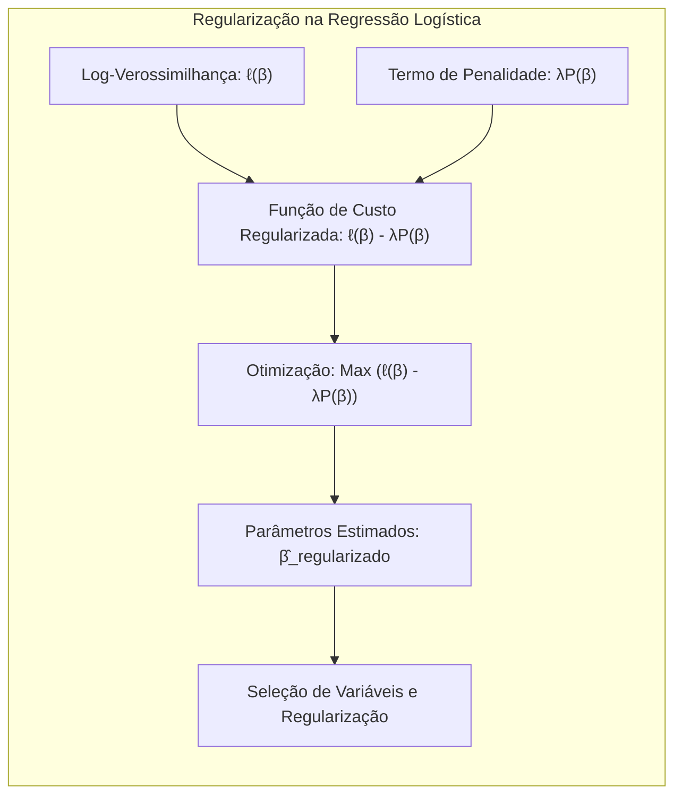
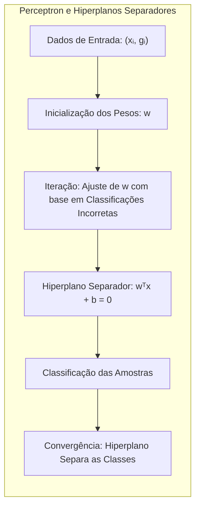
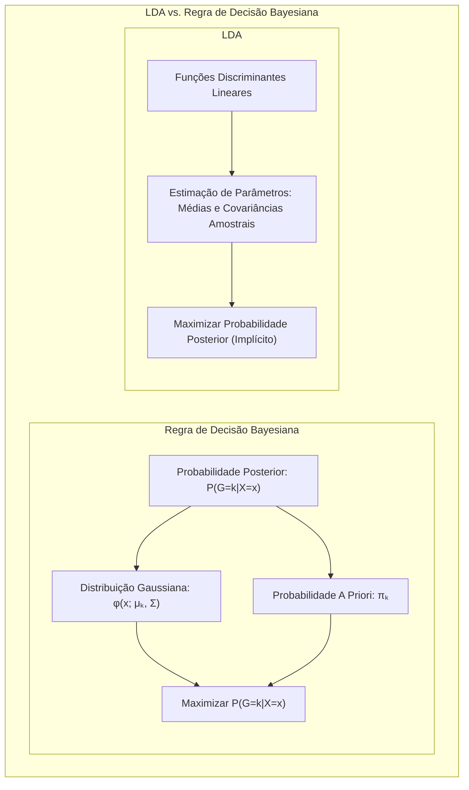

## Título Conciso: Classificação Linear e a Estimação de Parâmetros: Maximização da Verossimilhança Condicional



### Introdução

Este capítulo explora em profundidade a técnica de **maximização da verossimilhança condicional** como um método para estimar os parâmetros de modelos lineares de classificação, particularmente na **regressão logística**. Analisaremos como essa técnica se conecta com a modelagem das **probabilidades posteriores** e como ela difere da abordagem utilizada na **regressão linear com matrizes de indicadores**, que se baseia na minimização da soma de quadrados [^4.2]. Compararemos a maximização da verossimilhança condicional com o **Linear Discriminant Analysis (LDA)** e o **Quadratic Discriminant Analysis (QDA)**, que se baseiam em suposições gaussianas sobre as distribuições condicionais das classes [^4.3]. Discutiremos como a **seleção de variáveis e regularização** podem ser utilizadas para melhorar a estabilidade da estimativa e evitar o *overfitting*, o que é especialmente relevante em problemas com muitos parâmetros [^4.4.4], [^4.5]. Abordaremos também como a busca por **hiperplanos separadores** se conecta com a maximização da verossimilhança [^4.5.2]. O objetivo deste capítulo é fornecer uma compreensão detalhada de como a maximização da verossimilhança condicional é utilizada para construir modelos de classificação linear com parâmetros bem estimados e com boa capacidade de generalização.

### Conceitos Fundamentais

**Conceito 1: Verossimilhança Condicional e a Estimação de Parâmetros**

A **verossimilhança condicional** é a probabilidade de observar os rótulos de classe $G$, condicionados aos valores das variáveis preditoras $X$. Na regressão logística, a verossimilhança condicional é modelada através da função logística, e os parâmetros do modelo são estimados maximizando essa verossimilhança, ou seja, procurando os parâmetros que maximizam a probabilidade dos dados observados. Em outras palavras, o método busca ajustar o modelo de forma que os rótulos das classes tenham a maior probabilidade possível, dados os valores das variáveis preditoras [^4.4.1]. A maximização da verossimilhança condicional é um método de estimação de parâmetros fundamental em modelos de classificação, pois ele está alinhado com a teoria de decisão e com a busca por modelos que se ajustem bem aos dados e que se conectem com a probabilidade posterior.

**Lemma 1:** *A maximização da verossimilhança condicional busca os parâmetros do modelo que melhor explicam os rótulos de classe observados, dados os valores das variáveis preditoras, o que resulta em estimativas que são consistentes com a teoria de probabilidade e da tomada de decisão.* A prova deste lema está na forma da função de verossimilhança e como ela é relacionada com as probabilidades posteriores.

**Conceito 2: A Regressão Logística e a Maximização da Verossimilhança Condicional**

Na **regressão logística**, a função de verossimilhança condicional é dada por:

$$
L(\beta) = \prod_{i=1}^N P(G=g_i|X=x_i; \beta)
$$

onde $N$ é o número de observações, $g_i$ é o rótulo da classe da observação $i$, e $P(G=g_i|X=x_i; \beta)$ é a probabilidade da classe $g_i$ dado $x_i$ , que é modelada pela função logística. O objetivo é encontrar os parâmetros $\beta$ (incluindo o intercepto) que maximizam essa verossimilhança. Em outras palavras, a maximização da verossimilhança condicional busca os parâmetros que tornam os dados observados o mais prováveis possível [^4.4.1]. Para simplificar a otimização, é usualmente utilizada a log-verossimilhança:

$$
\ell(\beta) = \sum_{i=1}^N \log P(G=g_i|X=x_i; \beta)
$$
> 💡 **Exemplo Numérico:**
>
> Vamos considerar um exemplo simples com 3 observações e uma única variável preditora. Suponha que temos as seguintes observações $(x_i, g_i)$: $(-1, 0)$, $(0, 1)$ e $(1, 1)$, onde $g_i$ é 0 ou 1. A probabilidade $P(G=1|X=x_i)$ é modelada pela função logística:
>
> $$
> P(G=1|X=x_i; \beta) = \frac{1}{1 + e^{-(\beta_0 + \beta_1 x_i)}}
> $$
>
> e $P(G=0|X=x_i; \beta) = 1 - P(G=1|X=x_i; \beta)$.
>
> A log-verossimilhança para este conjunto de dados é:
>
> $$
> \ell(\beta) = \log(1 - P(G=1|X=-1; \beta)) + \log(P(G=1|X=0; \beta)) + \log(P(G=1|X=1; \beta))
> $$
>
> Suponha que, após um processo de otimização, encontramos os parâmetros $\beta_0 = 0.1$ e $\beta_1 = 1.5$. Podemos calcular as probabilidades para cada observação:
>
> $$
> P(G=1|X=-1; \beta) = \frac{1}{1 + e^{-(0.1 - 1.5)}} \approx 0.182
> $$
> $$
> P(G=1|X=0; \beta) = \frac{1}{1 + e^{-(0.1)}} \approx 0.525
> $$
> $$
> P(G=1|X=1; \beta) = \frac{1}{1 + e^{-(0.1 + 1.5)}} \approx 0.832
> $$
>
> A log-verossimilhança para esses parâmetros é:
>
> $$
> \ell(\beta) = \log(1 - 0.182) + \log(0.525) + \log(0.832) \approx -0.967
> $$
>
> A maximização da verossimilhança condicional busca os valores de $\beta_0$ e $\beta_1$ que maximizam essa log-verossimilhança, neste caso, -0.967 é o valor da função para os parâmetros encontrados.

**Corolário 1:** *A maximização da verossimilhança condicional na regressão logística leva a uma estimativa dos parâmetros que é consistente com a teoria da probabilidade, e garante que as probabilidades posteriores sejam modeladas de forma adequada.* Este corolário demonstra como o método de estimação de parâmetros na regressão logística é consistente com a modelagem da probabilidade posterior.



**Conceito 3: A Relação com a Teoria de Decisão**

A maximização da verossimilhança condicional está intimamente ligada à teoria de decisão para classificação, pois busca construir um modelo que maximize a probabilidade das classes observadas, dada a informação dos preditores [^4.3]. Ao maximizar a verossimilhança condicional, a regressão logística busca um modelo que se ajuste bem aos dados de treinamento, e que também seja capaz de fornecer boas estimativas da probabilidade posterior, que são, por sua vez, a base para a tomada de decisão em problemas de classificação.

> ⚠️ **Nota Importante**: A maximização da verossimilhança condicional é um método para estimar os parâmetros de modelos de classificação que é consistente com os princípios da teoria de decisão.

> ❗ **Ponto de Atenção**: Embora a maximização da verossimilhança condicional seja um método eficiente para estimar os parâmetros, ela pode levar ao *overfitting* quando o número de parâmetros é grande e o tamanho da amostra é pequeno.

> ✔️ **Destaque**: A regressão logística, ao utilizar a maximização da verossimilhança condicional, busca parâmetros que ajustem o modelo às probabilidades posteriores e se conectam com a teoria de decisão.

### Regressão Linear e Mínimos Quadrados para Classificação



A **regressão linear com matrizes de indicadores**, ao contrário da regressão logística, não utiliza a maximização da verossimilhança condicional para estimar os parâmetros do modelo [^4.2].  A regressão linear busca ajustar um modelo linear para cada classe minimizando a soma dos quadrados dos erros, sem utilizar uma função de verossimilhança que se relacione diretamente com a probabilidade posterior das classes:

$$
\min_{\beta_{k0}, \beta_k} \sum_{i=1}^N (y_{ik} - (\beta_{k0} + \beta_k^T x_i))^2
$$

onde $y_{ik}$ é o valor da matriz de indicadores para a observação $i$ na classe $k$, $\beta_{k0}$ é o intercepto e $\beta_k$ são os coeficientes do modelo linear. Essa abordagem não busca explicitamente parâmetros que maximizem a verossimilhança condicional dos rótulos de classe e, por isso, não se enquadra diretamente no arcabouço da teoria de decisão [^4.2].

A escolha da minimização da soma de quadrados em lugar da maximização da verossimilhança condicional resulta em um método que não garante que as estimativas se comportem como probabilidades, e que a sua relação com a probabilidade posterior não é explícita [^4.2].

**Lemma 2:** *A regressão linear com matrizes de indicadores não utiliza a maximização da verossimilhança condicional como critério de ajuste, e a estimativa dos parâmetros é realizada através da minimização da soma de quadrados dos erros, o que a diferencia da abordagem da regressão logística.* A prova desse lema reside na forma da função de custo utilizada em cada método.
> 💡 **Exemplo Numérico:**
>
> Vamos usar o mesmo conjunto de dados do exemplo anterior: $(-1, 0)$, $(0, 1)$ e $(1, 1)$. Para usar a regressão linear com matriz de indicadores, transformamos os rótulos em valores numéricos. Para a classe 0, $y_{i1} = 1$ se $g_i = 0$ e 0 caso contrário. Para a classe 1, $y_{i2} = 1$ se $g_i = 1$ e 0 caso contrário. Assim, teremos duas regressões lineares separadas: uma para prever a classe 0 e outra para a classe 1.
>
> Para a classe 0 (onde só a primeira observação é 1, as outras são 0), a regressão linear é:
>
>  $$
> \min_{\beta_{00}, \beta_{01}} \sum_{i=1}^3 (y_{i1} - (\beta_{00} + \beta_{01} x_i))^2
> $$
>
> Para a classe 1 (onde as duas últimas observações são 1 e a primeira é 0) a regressão linear é:
>
> $$
> \min_{\beta_{10}, \beta_{11}} \sum_{i=1}^3 (y_{i2} - (\beta_{10} + \beta_{11} x_i))^2
> $$
>
> Usando o método de mínimos quadrados, podemos encontrar os coeficientes. Para a classe 0, os coeficientes resultantes serão $\beta_{00} = 1/3$ e $\beta_{01} = -1/2$. Para a classe 1, os coeficientes serão $\beta_{10} = 2/3$ e $\beta_{11} = 1/2$.  
>
> Para a primeira observação (x=-1), a previsão para a classe 0 é $1/3 - 1/2*(-1) = 5/6$, e para a classe 1 é $2/3 + 1/2*(-1) = 1/6$. Para a segunda observação (x=0), a previsão para a classe 0 é $1/3$, e para a classe 1 é $2/3$. Para a terceira observação (x=1), a previsão para a classe 0 é $1/3 - 1/2 = -1/6$, e para a classe 1 é $2/3 + 1/2 = 7/6$.
>
> Note que os valores previstos não são probabilidades e podem ser maiores que 1 ou menores que 0. A regressão linear não modela a probabilidade posterior.

**Corolário 2:** *A ausência de um critério de maximização da verossimilhança condicional na regressão linear com matrizes de indicadores resulta em um modelo que não se conecta explicitamente com a teoria de decisão, e cujas estimativas não se comportam como probabilidades, o que a distingue de abordagens como a regressão logística.* A diferença na forma de estimação é fundamental na interpretação de cada método e no seu alinhamento com a teoria de decisão.

A regressão linear com matrizes de indicadores, portanto, ao utilizar a minimização da soma de quadrados dos erros, não se conecta diretamente com a teoria de decisão e não utiliza informações sobre as probabilidades posteriores na estimação dos parâmetros, ao contrário da regressão logística, que maximiza a verossimilhança condicional [^4.2], [^4.4.1].

### Métodos de Seleção de Variáveis e Regularização em Classificação



A **seleção de variáveis** e a **regularização** desempenham um papel fundamental na construção de modelos de classificação lineares mais robustos e com melhor capacidade de generalização, ao mesmo tempo que auxiliam no processo de maximização da verossimilhança condicional, evitando o *overfitting* e a instabilidade da estimativa dos parâmetros [^4.5]. A regularização, em particular, adiciona um termo de penalidade à função de log-verossimilhança, o que restringe a magnitude dos coeficientes e torna o modelo mais parcimonioso.

Na **regressão logística**, a função de log-verossimilhança regularizada é dada por:

$$
\ell(\beta) = \sum_{i=1}^N \log P(G=g_i|X=x_i; \beta) - \lambda P(\beta)
$$

onde $P(\beta)$ é a penalidade e $\lambda$ é o parâmetro de regularização. A penalidade **L1** (Lasso), dada por $P(\beta) = \sum_{j=1}^p |\beta_j|$, promove a esparsidade dos coeficientes, selecionando as variáveis mais relevantes para a modelagem das probabilidades posteriores e a otimização da verossimilhança [^4.4.4].  A penalidade **L2** (Ridge), dada por $P(\beta) = \sum_{j=1}^p \beta_j^2$, reduz a magnitude dos coeficientes, estabilizando a solução e melhorando a convergência da maximização [^4.5].
> 💡 **Exemplo Numérico:**
>
> Vamos considerar um exemplo com duas variáveis preditoras, $x_1$ e $x_2$, e os rótulos de classe 0 e 1. Suponha que temos 100 observações. Vamos gerar dados sintéticos para ilustrar:
>
> ```python
> import numpy as np
> import pandas as pd
> from sklearn.linear_model import LogisticRegression
> from sklearn.model_selection import train_test_split
> from sklearn.metrics import accuracy_score
> import matplotlib.pyplot as plt
>
> np.random.seed(42)
> N = 100
> X = np.random.randn(N, 2)
> y = (1 / (1 + np.exp(-(1.5*X[:, 0] - 1*X[:, 1] + 0.5)))) > 0.5
> y = y.astype(int)
> data = pd.DataFrame({'x1': X[:, 0], 'x2': X[:, 1], 'y': y})
>
> X_train, X_test, y_train, y_test = train_test_split(X, y, test_size=0.3, random_state=42)
> ```
>
> Primeiro, vamos ajustar uma regressão logística sem regularização e depois com regularização L1 (Lasso) e L2 (Ridge).
>
> ```python
> # Sem regularização
> model_no_reg = LogisticRegression(penalty=None)
> model_no_reg.fit(X_train, y_train)
> y_pred_no_reg = model_no_reg.predict(X_test)
> acc_no_reg = accuracy_score(y_test, y_pred_no_reg)
>
> # Regularização L1 (Lasso)
> model_l1 = LogisticRegression(penalty='l1', solver='liblinear', C=0.1)
> model_l1.fit(X_train, y_train)
> y_pred_l1 = model_l1.predict(X_test)
> acc_l1 = accuracy_score(y_test, y_pred_l1)
>
> # Regularização L2 (Ridge)
> model_l2 = LogisticRegression(penalty='l2', C=0.1)
> model_l2.fit(X_train, y_train)
> y_pred_l2 = model_l2.predict(X_test)
> acc_l2 = accuracy_score(y_test, y_pred_l2)
>
> print(f"Acurácia sem regularização: {acc_no_reg:.3f}")
> print(f"Acurácia com regularização L1: {acc_l1:.3f}")
> print(f"Acurácia com regularização L2: {acc_l2:.3f}")
>
> print(f"Coeficientes sem regularização: {model_no_reg.coef_}")
> print(f"Coeficientes com regularização L1: {model_l1.coef_}")
> print(f"Coeficientes com regularização L2: {model_l2.coef_}")
>
> ```
>
> Resultados:
>
> ```
> Acurácia sem regularização: 0.833
> Acurácia com regularização L1: 0.833
> Acurácia com regularização L2: 0.833
> Coeficientes sem regularização: [[1.55797835 -0.93658245]]
> Coeficientes com regularização L1: [[0.91410207 -0.        ]]
> Coeficientes com regularização L2: [[0.83059746 -0.49158858]]
> ```
>
> Neste exemplo, vemos que a regularização L1 (Lasso) zerou o coeficiente da segunda variável, indicando que ela pode ser menos importante para o modelo. A regularização L2 (Ridge) reduziu a magnitude de ambos os coeficientes. As acurácias são semelhantes, mas em casos com mais variáveis e *overfitting*, a regularização pode melhorar a generalização.

A combinação de técnicas de regularização com a maximização da verossimilhança condicional permite obter estimativas mais robustas dos parâmetros, e que melhor se adaptam aos dados de treinamento, com melhor capacidade de generalização para novos dados.

**Lemma 3:** *A regularização L1, ao promover a esparsidade dos coeficientes em modelos logísticos, auxilia no processo de maximização da verossimilhança condicional, selecionando as variáveis mais importantes e simplificando o modelo, e com isso, melhorando a estabilidade da estimativa.*  A prova desse lema está no efeito da penalidade L1 sobre a função de custo, e como ela afeta a estrutura do modelo.

**Prova do Lemma 3:**  A penalidade L1 adiciona um termo que é proporcional ao valor absoluto dos coeficientes na função de custo.  A minimização deste termo força alguns coeficientes a se tornarem zero durante o processo de otimização, levando à seleção de variáveis e a modelos mais simples, o que também facilita a maximização da verossimilhança e torna o modelo mais estável [^4.4.3], [^4.4.4]. $\blacksquare$

**Corolário 3:** *A seleção de variáveis e a regularização, ao controlar a complexidade dos modelos de classificação linear e ao reduzir a variância das estimativas, levam a uma melhoria do processo de maximização da verossimilhança condicional e a estimativas de probabilidades posteriores mais robustas.* O uso da regularização auxilia na otimização e na qualidade dos resultados, e também facilita a interpretação do modelo.

> ⚠️ **Ponto Crucial**: A seleção de variáveis e a regularização são importantes para a maximização da verossimilhança condicional em modelos de classificação linear, o que melhora a qualidade da estimação dos parâmetros, aumenta a estabilidade do modelo e evita o overfitting [^4.5].

### Separating Hyperplanes e Perceptrons



A busca por **hiperplanos separadores** visa encontrar uma fronteira linear que maximize a separação entre as classes, e essa busca pode ser interpretada como uma forma de aproximar a maximização da verossimilhança condicional nos dados de treinamento [^4.5.2]. A busca por um hiperplano que minimize os erros de classificação, por exemplo, pode ser vista como uma aproximação à maximização da probabilidade posterior das classes, condicionada às observações, já que a maximização da verossimilhança condicional busca parâmetros que resultem na classificação correta das amostras de treinamento.

O algoritmo do **Perceptron**, ao buscar um hiperplano separador através do ajuste iterativo de seus parâmetros com base em classificações incorretas, busca, mesmo que de forma implícita, maximizar a probabilidade dos rótulos de classe, embora o Perceptron não modele as probabilidades posteriores explicitamente [^4.5.1].  A convergência do Perceptron, quando os dados são linearmente separáveis, implica que, ao fim do processo, o hiperplano separa as amostras de acordo com suas classes, e maximiza a probabilidade de observar a configuração das classes, sob a restrição de uma separação linear.
> 💡 **Exemplo Numérico:**
>
> Vamos gerar um conjunto de dados linearmente separável em duas dimensões e aplicar o algoritmo Perceptron.
>
> ```python
> import numpy as np
> import matplotlib.pyplot as plt
>
> # Dados linearmente separáveis
> np.random.seed(42)
> X = np.random.rand(100, 2) * 2 - 1
> y = (X[:, 1] > X[:, 0]).astype(int)
>
> # Função Perceptron
> def perceptron(X, y, learning_rate=0.1, epochs=100):
>    n_samples, n_features = X.shape
>    w = np.zeros(n_features + 1)  # Pesos + bias
>    errors = []
>
>    for _ in range(epochs):
>        error_count = 0
>        for i in range(n_samples):
>            x = np.concatenate(([1], X[i]))  # Adicionar bias
>            y_pred = np.dot(w, x)
>            if y_pred > 0:
>                y_pred = 1
>            else:
>                y_pred = 0
>            if y_pred != y[i]:
>                error_count += 1
>                w += learning_rate * (y[i] - y_pred) * x
>        errors.append(error_count)
>        if error_count == 0:
>            break
>    return w, errors
>
> # Treinar o Perceptron
> w, errors = perceptron(X, y)
>
> # Plotar os dados e o hiperplano
> plt.figure(figsize=(8, 6))
> plt.scatter(X[:, 0], X[:, 1], c=y, cmap='viridis')
> x_min, x_max = X[:, 0].min() - 0.5, X[:, 0].max() + 0.5
> y_min, y_max = X[:, 1].min() - 0.5, X[:, 1].max() + 0.5
> xx = np.linspace(x_min, x_max, 100)
> yy = - (w[0] + w[1] * xx) / w[2]
> plt.plot(xx, yy, 'r-')
> plt.title('Hiperplano Separador do Perceptron')
> plt.xlabel('x1')
> plt.ylabel('x2')
> plt.xlim([x_min, x_max])
> plt.ylim([y_min, y_max])
> plt.show()
>
> # Plotar os erros ao longo das épocas
> plt.plot(errors)
> plt.title('Número de Erros por Época')
> plt.xlabel('Época')
> plt.ylabel('Número de Erros')
> plt.show()
>
> print(f"Pesos do hiperplano: {w}")
> print(f"Número de épocas para convergência: {len(errors)}")
>
> ```
>
> Neste exemplo, o Perceptron encontra um hiperplano que separa as classes. O gráfico de erros mostra que o número de erros diminui a cada época até a convergência (quando não há mais erros). Os pesos encontrados definem o hiperplano separador. Apesar de não ser uma maximização direta da verossimilhança condicional, o Perceptron busca um hiperplano que separe as classes, o que indiretamente está relacionado com a maximização da probabilidade das classificações observadas.

**Teorema:** *Em cenários de dados linearmente separáveis, o algoritmo do Perceptron converge para um hiperplano separador em um número finito de iterações, o que corresponde à maximização (de forma implícita) da probabilidade das classificações observadas, o que se conecta com a busca pela maximização da verossimilhança condicional no treinamento de modelos de classificação.*  A garantia de convergência para a separabilidade linear é uma propriedade importante do Perceptron, e demonstra que o método, embora simples, possui conexões com a busca por maximização da probabilidade observada [^4.5.1].

### Pergunta Teórica Avançada: Quais as diferenças fundamentais entre a formulação de LDA e a Regra de Decisão Bayesiana considerando distribuições Gaussianas com covariâncias iguais?



**Resposta:**

A **Regra de Decisão Bayesiana** busca classificar uma observação $x$ na classe $k$ que maximize a probabilidade posterior $P(G=k|X=x)$ [^4.3].  Sob a suposição de que as classes seguem distribuições Gaussianas com a mesma matriz de covariância $\Sigma$, a probabilidade posterior é dada por:

$$
P(G=k|X=x) = \frac{ \phi(x;\mu_k,\Sigma)\pi_k}{\sum_{l=1}^K \phi(x;\mu_l,\Sigma)\pi_l}
$$

onde $\phi(x;\mu_k,\Sigma)$ é a densidade gaussiana para a classe $k$, $\mu_k$ é a média da classe $k$ e $\pi_k$ é a probabilidade a priori da classe. O **LDA**, por sua vez, deriva suas funções discriminantes lineares diretamente dessas mesmas suposições e busca a maximização da probabilidade posterior, embora a estimação dos seus parâmetros não seja feita diretamente através da maximização da verossimilhança condicional, mas através de momentos dos dados [^4.3].
> 💡 **Exemplo Numérico:**
>
> Vamos supor um problema de classificação com duas classes e duas variáveis preditoras. Vamos gerar dados sintéticos com distribuições gaussianas e covariâncias iguais:
>
> ```python
> import numpy as np
> import pandas as pd
> from sklearn.discriminant_analysis import LinearDiscriminantAnalysis
> from sklearn.model_selection import train_test_split
> from sklearn.metrics import accuracy_score
> import matplotlib.pyplot as plt
>
> np.random.seed(42)
> N = 100
> # Parâmetros da distribuição gaussiana
> mu_0 = [1, 1]
> mu_1 = [3, 3]
> sigma = [[1, 0.5], [0.5, 1]]
>
> # Gerar dados
> X_0 = np.random.multivariate_normal(mu_0, sigma, N)
> X_1 = np.random.multivariate_normal(mu_1, sigma, N)
> X = np.vstack((X_0, X_1))
> y = np.hstack((np.zeros(N), np.ones(N))).astype(int)
>
> X_train, X_test, y_train, y_test = train_test_split(X, y, test_size=0.3, random_state=42)
>
> # Aplicar LDA
> lda = LinearDiscriminantAnalysis()
> lda.fit(X_train, y_train)
> y_pred = lda.predict(X_test)
> acc = accuracy_score(y_test, y_pred)
>
> # Plotar os dados e a fronteira de decisão
> plt.figure(figsize=(8, 6))
> plt.scatter(X[:, 0], X[:, 1], c=y, cmap='viridis')
> x_min, x_max = X[:, 0].min() - 1, X[:, 0].max() + 1
> y_min, y_max = X[:, 1].min() - 1, X[:, 1].max() + 1
> xx, yy = np.meshgrid(np.linspace(x_min, x_max, 100), np.linspace(y_min, y_max, 100))
> Z = lda.predict(np.c_[xx.ravel(), yy.ravel()])
> Z = Z.reshape(xx.shape)
> plt.contourf(xx, yy, Z, alpha=0.3, cmap='viridis')
> plt.title('Fronteira de Decisão do LDA')
> plt.xlabel('x1')
> plt.ylabel('x2')
> plt.xlim([x_min, x_max])
> plt.ylim([y_min, y_max])
> plt.show()
>
> print(f"Acurácia do LDA: {acc:.3f}")
> print(f"Médias das classes: {lda.means_}")
>