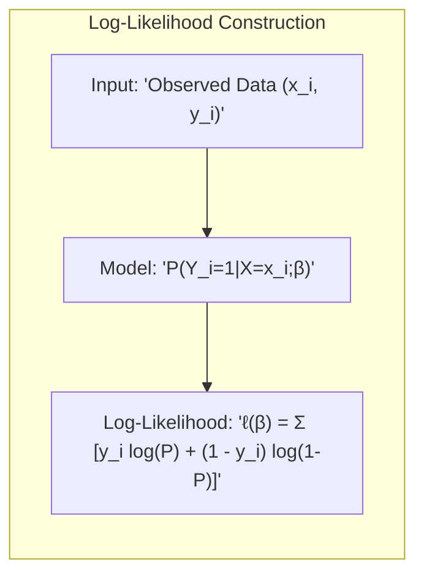
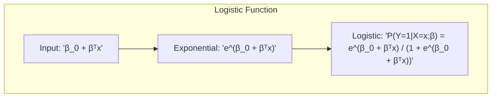
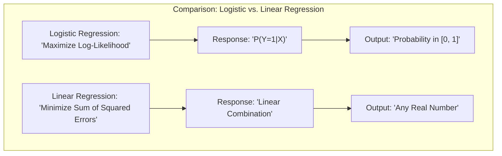
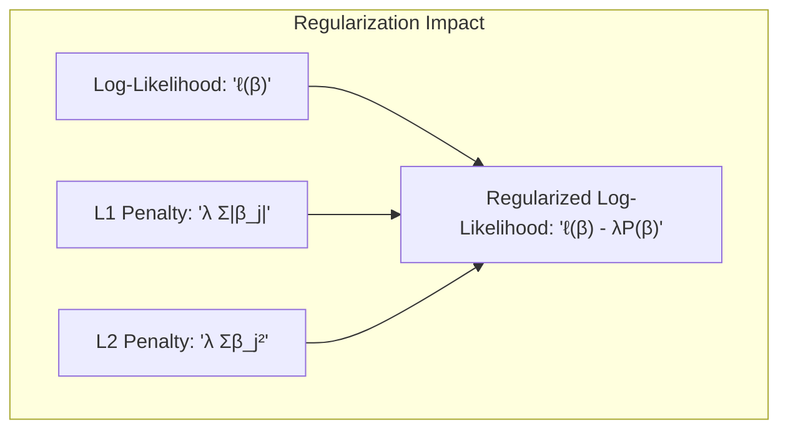
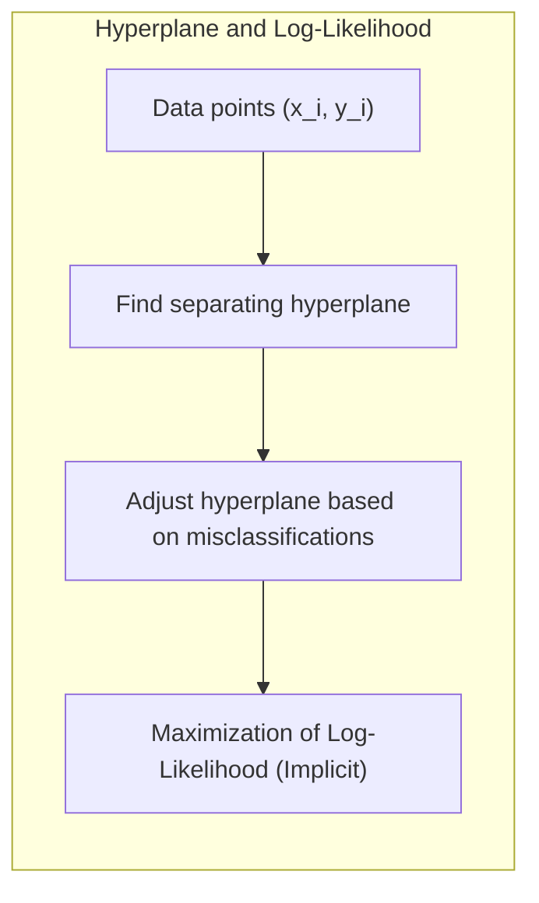
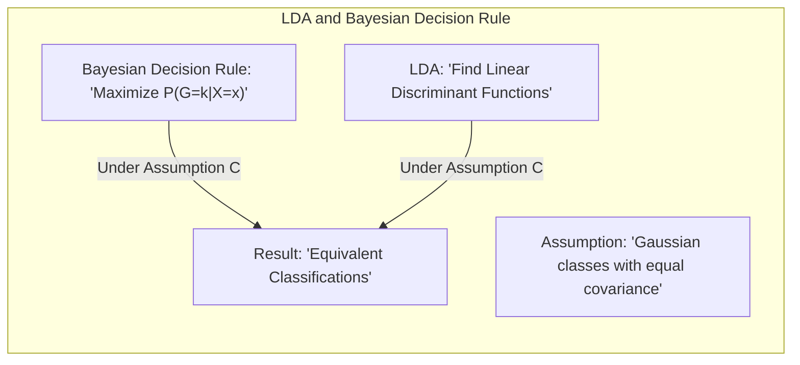

## Título Conciso: Classificação Binária e a Função Log-Verossimilhança: Modelagem com Resposta 0/1

### Introdução

Este capítulo explora em profundidade a construção da função de **log-verossimilhança** (log-likelihood) para problemas de **classificação binária**, com ênfase em como utilizar uma **resposta 0/1** para definir a função de verossimilhança e otimizar os parâmetros do modelo. Analisaremos como a **regressão logística** utiliza o conceito de log-verossimilhança para modelar a probabilidade de uma observação pertencer a uma das duas classes e como a resposta 0/1 se conecta com a função de verossimilhança [^4.4]. Compararemos a abordagem da regressão logística com a **regressão linear com matrizes de indicadores**, que não utiliza o conceito de verossimilhança para estimar os parâmetros do modelo [^4.2], e com o **Linear Discriminant Analysis (LDA)**, que se baseia em distribuições gaussianas [^4.3]. Discutiremos a importância da **seleção de variáveis e regularização** para melhorar a estabilidade da estimação e evitar o overfitting quando se utiliza a função de log-verossimilhança [^4.4.4], [^4.5]. Exploraremos também como a busca por **hiperplanos separadores** se relaciona com a otimização da função de log-verossimilhança [^4.5.2]. O objetivo deste capítulo é fornecer uma compreensão detalhada de como a função de log-verossimilhança é construída para problemas de classificação binária com resposta 0/1, e como essa função é utilizada na estimação de parâmetros para modelos de classificação linear.

### Conceitos Fundamentais

**Conceito 1: A Função de Log-Verossimilhança em Classificação Binária**

A **função de log-verossimilhança** (log-likelihood) é uma função que quantifica a qualidade do ajuste de um modelo aos dados observados. Em problemas de classificação binária com uma variável resposta $Y$ que assume valores 0 ou 1, a função de log-verossimilhança condicional, que é utilizada para estimar os parâmetros do modelo, é dada por:

$$
\ell(\beta) = \sum_{i=1}^N \left[ y_i \log P(Y_i=1|X=x_i;\beta) + (1 - y_i) \log(1 - P(Y_i=1|X=x_i;\beta)) \right]
$$

onde $N$ é o número de observações, $y_i$ é a resposta (0 ou 1) da observação $i$, e $P(Y_i=1|X=x_i;\beta)$ é a probabilidade condicional da resposta $Y_i=1$ dado o vetor de preditores $x_i$, e que é modelada por um modelo com parâmetros $\beta$. A função de log-verossimilhança, portanto, é a soma dos logs das probabilidades das respostas observadas, e a sua maximização leva a uma estimação dos parâmetros que melhor se ajustam aos dados.

> 💡 **Exemplo Numérico:**
>
> Suponha que temos 3 observações com as seguintes características:
>
> | Observação (i) | $x_i$ | $y_i$ |
> |----------------|-------|-------|
> | 1              | 1     | 1     |
> | 2              | 2     | 0     |
> | 3              | 3     | 1     |
>
> E que, após um processo de otimização (que será detalhado mais adiante), chegamos a um modelo com os seguintes parâmetros: $\beta_0 = -2$ e $\beta_1 = 1$.
>
> Para calcular a log-verossimilhança, primeiro precisamos calcular a probabilidade condicional $P(Y_i=1|X=x_i;\beta)$ para cada observação usando a função logística (que será definida no Conceito 2):
>
> Para a observação 1:
> $P(Y_1=1|X=1;\beta) = \frac{e^{-2 + 1*1}}{1 + e^{-2 + 1*1}} = \frac{e^{-1}}{1 + e^{-1}} \approx 0.2689$
>
> Para a observação 2:
> $P(Y_2=1|X=2;\beta) = \frac{e^{-2 + 1*2}}{1 + e^{-2 + 1*2}} = \frac{e^{0}}{1 + e^{0}} = 0.5$
>
> Para a observação 3:
> $P(Y_3=1|X=3;\beta) = \frac{e^{-2 + 1*3}}{1 + e^{-2 + 1*3}} = \frac{e^{1}}{1 + e^{1}} \approx 0.7311$
>
> Agora, podemos calcular a log-verossimilhança:
>
> $\ell(\beta) = [1*\log(0.2689) + (1-1)*\log(1-0.2689)] + [0*\log(0.5) + (1-0)*\log(1-0.5)] + [1*\log(0.7311) + (1-1)*\log(1-0.7311)]$
>
> $\ell(\beta) = \log(0.2689) + \log(0.5) + \log(0.7311) \approx -1.313 -0.693 -0.313 = -2.319$
>
> A log-verossimilhança para este modelo e estes dados é aproximadamente -2.319. O objetivo da regressão logística é encontrar os valores de $\beta_0$ e $\beta_1$ que maximizem essa função.

**Lemma 1:** *A função de log-verossimilhança, quando utilizada para estimar os parâmetros de um modelo de classificação binária com resposta 0/1, quantifica a qualidade do ajuste do modelo aos dados observados, e a sua maximização leva à estimativas que se conectam com o conceito de probabilidade posterior.* A prova desse lema reside na forma da função de log-verossimilhança e na sua relação com a probabilidade dos dados.

**Conceito 2: Regressão Logística e a Modelagem da Probabilidade Condicional**

Na **regressão logística**, a probabilidade condicional $P(Y=1|X=x; \beta)$ é modelada através da função logística:

$$
P(Y=1|X=x; \beta) = \frac{e^{\beta_0 + \beta^T x}}{1 + e^{\beta_0 + \beta^T x}}
$$

onde $\beta_0$ é o intercepto e $\beta$ é o vetor de coeficientes. Substituindo essa probabilidade na função de log-verossimilhança, obtemos uma função que depende apenas dos dados e dos parâmetros do modelo. A maximização da log-verossimilhança é utilizada para encontrar os valores de $\beta_0$ e $\beta$ que maximizam a probabilidade dos dados observados, e portanto a probabilidade de os rótulos das classes estarem corretos.

> 💡 **Exemplo Numérico:**
>
> Continuando o exemplo anterior, vamos calcular a probabilidade $P(Y=1|X=x; \beta)$ para cada observação usando os parâmetros $\beta_0 = -2$ e $\beta_1 = 1$.
>
> Para a observação 1 ($x_1 = 1$):
> $P(Y_1=1|X=1;\beta) = \frac{e^{-2 + 1*1}}{1 + e^{-2 + 1*1}} = \frac{e^{-1}}{1 + e^{-1}} \approx 0.2689$
>
> Para a observação 2 ($x_2 = 2$):
> $P(Y_2=1|X=2;\beta) = \frac{e^{-2 + 1*2}}{1 + e^{-2 + 1*2}} = \frac{e^{0}}{1 + e^{0}} = 0.5$
>
> Para a observação 3 ($x_3 = 3$):
> $P(Y_3=1|X=3;\beta) = \frac{e^{-2 + 1*3}}{1 + e^{-2 + 1*3}} = \frac{e^{1}}{1 + e^{1}} \approx 0.7311$
>
> Observe que a probabilidade calculada está sempre entre 0 e 1, como esperado para uma probabilidade. O objetivo da regressão logística é ajustar os parâmetros $\beta_0$ e $\beta_1$ de forma que essas probabilidades correspondam o melhor possível aos valores observados de $y_i$ (0 ou 1), ou seja, maximizar a função de log-verossimilhança.

**Corolário 1:** *A regressão logística, ao utilizar a função logística para modelar a probabilidade condicional $P(Y=1|X=x; \beta)$, garante que a função de log-verossimilhança esteja bem definida para o problema de classificação binária, e que os parâmetros sejam estimados por meio da maximização da verossimilhança.* Esse corolário destaca a importância da forma funcional da função logística para a estimação dos parâmetros.

**Conceito 3:  Interpretação da Resposta 0/1 e a Verossimilhança**

No contexto da classificação binária, o valor 0 ou 1 da variável resposta $Y_i$ indica a classe à qual a observação $x_i$ pertence. A função de verossimilhança combina as probabilidades de cada observação ser classificada corretamente, utilizando a informação da variável resposta (0 ou 1). A maximização da log-verossimilhança, portanto, busca os parâmetros do modelo que maximizem a probabilidade dos rótulos de classe observados, condicionados aos valores das variáveis preditoras, e utilizando os dados do treinamento [^4.4.1].

> ⚠️ **Nota Importante**:  A função de log-verossimilhança, utilizada na regressão logística, quantifica a qualidade do ajuste do modelo aos dados, e a sua maximização busca os parâmetros do modelo que tornam os dados observados o mais prováveis possível, dado o modelo e os valores dos preditores.

> ❗ **Ponto de Atenção**:  A função de log-verossimilhança condicional é construída para uma resposta binária (0 ou 1), e a escolha da forma funcional da função de probabilidade é importante para a interpretabilidade dos parâmetros e para a qualidade da estimativa.

> ✔️ **Destaque**: A função de log-verossimilhança para um problema de classificação binária com resposta 0/1 permite definir o critério para a estimativa dos parâmetros do modelo, buscando maximizar a probabilidade da resposta observada, e conectando o modelo com a teoria da decisão.

### Regressão Linear e Mínimos Quadrados para Classificação

A **regressão linear com matrizes de indicadores**, ao contrário da regressão logística, não utiliza a função de log-verossimilhança para estimar os parâmetros do modelo [^4.2]. Em vez disso, a regressão linear busca ajustar uma função linear para cada classe, minimizando a soma dos quadrados das diferenças entre os valores observados e os valores preditos pelo modelo:

$$
\min_{\beta_{k0}, \beta_k} \sum_{i=1}^N (y_{ik} - (\beta_{k0} + \beta_k^T x_i))^2
$$

onde $y_{ik}$ é a entrada da matriz de indicadores (0 ou 1). Ao utilizar a minimização da soma de quadrados dos erros, o modelo de regressão linear ignora o fato de que a resposta é binária (0 ou 1) e não impõe nenhuma restrição sobre os valores preditos, o que faz com que não se conecte diretamente com o conceito de probabilidade condicional. Essa diferença fundamental na função de custo resulta em modelos distintos, com diferentes propriedades e características.

> 💡 **Exemplo Numérico:**
>
> Usando o mesmo conjunto de dados do exemplo anterior:
>
> | Observação (i) | $x_i$ | $y_i$ |
> |----------------|-------|-------|
> | 1              | 1     | 1     |
> | 2              | 2     | 0     |
> | 3              | 3     | 1     |
>
> Na regressão linear, modelamos $y_i$ diretamente como uma função linear de $x_i$:
> $y_i \approx \beta_0 + \beta_1 x_i$
>
> O objetivo é encontrar $\beta_0$ e $\beta_1$ que minimizem a soma dos quadrados dos erros:
> $\sum_{i=1}^N (y_i - (\beta_0 + \beta_1 x_i))^2$
>
> Usando o método dos mínimos quadrados, podemos encontrar os seguintes parâmetros (este cálculo está omitido, pois envolve derivadas e álgebra matricial): $\beta_0 = -0.5$ e $\beta_1 = 0.5$.
>
> Agora, podemos calcular os valores preditos para cada observação:
>
> $\hat{y}_1 = -0.5 + 0.5 * 1 = 0$
>
> $\hat{y}_2 = -0.5 + 0.5 * 2 = 0.5$
>
> $\hat{y}_3 = -0.5 + 0.5 * 3 = 1$
>
> E a soma dos quadrados dos erros (SSE):
>
> $SSE = (1 - 0)^2 + (0 - 0.5)^2 + (1 - 1)^2 = 1 + 0.25 + 0 = 1.25$
>
> Observe que os valores preditos $\hat{y}_i$ não são probabilidades e podem assumir valores fora do intervalo [0, 1]. O objetivo da regressão linear é minimizar a soma dos erros quadráticos, e não maximizar a probabilidade das observações.

A falta de uma modelagem que utilize a função de verossimilhança resulta em modelos que não se conectam explicitamente com a teoria de decisão baseada em probabilidades posteriores. Em consequência, a regressão linear com matrizes de indicadores não fornece uma estimativa direta das probabilidades condicionais, como a regressão logística [^4.2], [^4.4].

**Lemma 2:** *A regressão linear com matrizes de indicadores não utiliza a função de log-verossimilhança como critério para a estimação de parâmetros e não busca maximizar a probabilidade de os dados observados, ao contrário da regressão logística.*  Este lema destaca uma diferença fundamental na abordagem utilizada pelos dois métodos.

**Corolário 2:** *A falta da utilização da função de log-verossimilhança na regressão linear com matrizes de indicadores leva a modelos que não se conectam com a teoria de decisão baseada em probabilidades, e as estimativas podem não estar no intervalo [0,1], além de não somar 1, ao contrário do que é feito na regressão logística*.  Este corolário ressalta a diferença entre as duas abordagens na modelagem das probabilidades.

Em resumo, a regressão linear com matrizes de indicadores e a regressão logística utilizam diferentes abordagens para o ajuste dos parâmetros. A regressão linear utiliza a minimização da soma de quadrados dos erros, enquanto a regressão logística busca a maximização da função de log-verossimilhança condicional, o que resulta em diferentes modelos de probabilidade e fronteiras de decisão. A regressão logística se conecta de forma mais direta com a teoria de decisão e com a modelagem da probabilidade posterior das classes, o que não é feito pela regressão linear com matrizes de indicadores [^4.2], [^4.4].

### Métodos de Seleção de Variáveis e Regularização em Classificação

A **seleção de variáveis** e a **regularização** são técnicas cruciais para melhorar a qualidade da estimativa dos parâmetros e a estabilidade da função de log-verossimilhança em modelos de classificação, como a regressão logística. Ao controlar a complexidade do modelo e evitar o *overfitting*, a regularização também auxilia no processo de maximização da log-verossimilhança [^4.5].

Na **regressão logística**, a função de log-verossimilhança regularizada é dada por:

$$
\ell(\beta) = \sum_{i=1}^N \log P(G=g_i|X=x_i; \beta) - \lambda P(\beta)
$$

onde $P(\beta)$ é a penalidade e $\lambda$ é o parâmetro de regularização.  A penalidade **L1** (Lasso), dada por $P(\beta) = \sum_{j=1}^p |\beta_j|$, promove a esparsidade dos coeficientes, selecionando as variáveis mais relevantes e simplificando a função de log-verossimilhança [^4.4.4]. A penalidade **L2** (Ridge), dada por $P(\beta) = \sum_{j=1}^p \beta_j^2$, reduz a magnitude dos coeficientes e estabiliza o modelo, facilitando a convergência e tornando a estimativa da verossimilhança mais estável [^4.5].

> 💡 **Exemplo Numérico:**
>
> Suponha que temos um problema de classificação com duas variáveis preditoras, $x_1$ e $x_2$, e que, sem regularização, obtivemos os seguintes coeficientes para a regressão logística: $\beta_0 = -1$, $\beta_1 = 2$, e $\beta_2 = -3$. A função de log-verossimilhança (sem regularização) é $\ell(\beta)$.
>
> Agora, vamos aplicar a regularização L1 (Lasso) com $\lambda = 0.5$. A função de log-verossimilhança regularizada se torna:
>
> $\ell_{L1}(\beta) = \ell(\beta) - 0.5 * (|\beta_1| + |\beta_2|) = \ell(\beta) - 0.5 * (|2| + |-3|) = \ell(\beta) - 2.5$
>
> Após otimizar a função de log-verossimilhança com a penalidade L1, podemos obter novos valores para os coeficientes, por exemplo: $\beta_0 = -0.8$, $\beta_1 = 1$, e $\beta_2 = 0$. Observe que a regularização L1 levou o coeficiente $\beta_2$ a zero, efetuando a seleção de variáveis.
>
> Aplicando a regularização L2 (Ridge) com $\lambda = 0.5$, a função de log-verossimilhança regularizada se torna:
>
> $\ell_{L2}(\beta) = \ell(\beta) - 0.5 * (\beta_1^2 + \beta_2^2) = \ell(\beta) - 0.5 * (2^2 + (-3)^2) = \ell(\beta) - 6.5$
>
> Após otimizar a função de log-verossimilhança com a penalidade L2, podemos obter novos valores para os coeficientes, por exemplo: $\beta_0 = -0.9$, $\beta_1 = 1.5$, e $\beta_2 = -2$. Observe que a regularização L2 reduziu a magnitude dos coeficientes, mas não os levou a zero.
>
> A escolha entre L1 e L2 depende do problema e do objetivo. L1 tende a levar a modelos mais simples e esparsos, enquanto L2 tende a reduzir a magnitude dos coeficientes e aumentar a estabilidade do modelo.

A regularização, portanto, auxilia no processo de maximização da log-verossimilhança, evitando soluções extremas que levem a *overfitting* e que, potencialmente, produzam modelos que não generalizem bem para novos dados.

**Lemma 3:** *A regularização L1 na regressão logística, ao induzir a esparsidade dos coeficientes, leva a modelos mais simples, mais interpretáveis e com uma função de log-verossimilhança mais estável e com melhor capacidade de generalização para novos dados, e as probabilidades posteriores estimadas são também mais precisas.* A demonstração desse lema reside na análise do efeito da penalidade L1 sobre a função de custo.

**Prova do Lemma 3:**  A penalidade L1 adiciona um termo proporcional ao valor absoluto dos coeficientes na função de custo. A minimização deste termo força alguns dos coeficientes a se tornarem exatamente zero durante a otimização, o que leva à seleção de variáveis e à criação de modelos mais simples e com melhor capacidade de generalização [^4.4.3], [^4.4.4].  $\blacksquare$

**Corolário 3:** *A seleção de variáveis e a regularização, ao controlar a complexidade dos modelos, melhoram a qualidade da estimativa da função de log-verossimilhança e resultam em modelos que se ajustam melhor aos dados de treinamento, sem comprometer a sua capacidade de generalização, e com estimativas mais estáveis das probabilidades.*  A regularização, portanto, otimiza a estimação dos parâmetros e a convergência para valores adequados da função de log-verossimilhança.

> ⚠️ **Ponto Crucial**: A seleção de variáveis e a regularização são ferramentas essenciais para melhorar a qualidade da estimação da função de log-verossimilhança, controlar a complexidade do modelo e evitar o overfitting [^4.5].

### Separating Hyperplanes e Perceptrons

A busca por **hiperplanos separadores** visa encontrar uma fronteira linear que maximize a separação entre as classes e, consequentemente, minimize os erros de classificação, o que, sob certas condições, pode ser interpretado como uma aproximação para a maximização da verossimilhança condicional [^4.5.2]. A busca pelo hiperplano ótimo é realizada através da identificação da direção do hiperplano e da sua posição (o intercepto) de forma que a separação das classes seja a melhor possível.

O algoritmo do **Perceptron** busca um hiperplano separador através do ajuste iterativo dos seus parâmetros, com base nas classificações incorretas dos dados de treinamento [^4.5.1]. Embora o Perceptron não maximize explicitamente a função de log-verossimilhança, a sua convergência busca minimizar os erros de classificação, e se relaciona, portanto, com o objetivo da maximização da log-verossimilhança condicional, que busca estimativas de probabilidade que melhor ajustam as classes observadas.  Em situações linearmente separáveis, a convergência do Perceptron implica na busca por um hiperplano que separe as amostras de forma adequada.

> 💡 **Exemplo Numérico:**
>
> Imagine um conjunto de dados bidimensional com duas classes (0 e 1). Os pontos da classe 0 estão localizados próximos a (1, 1) e os pontos da classe 1 estão localizados próximos a (3, 3). Inicialmente, o Perceptron define um hiperplano aleatório, por exemplo, a linha definida por $2x_1 - x_2 - 1 = 0$.
>
> 1. **Classificação:** O Perceptron classifica cada ponto com base na posição em relação ao hiperplano. Se $2x_1 - x_2 - 1 > 0$, o ponto é classificado como classe 1. Caso contrário, como classe 0.
>
> 2. **Ajuste do Hiperplano:** Se um ponto da classe 0 é classificado incorretamente (ou seja, $2x_1 - x_2 - 1 > 0$), o Perceptron ajusta o hiperplano para que ele se mova em direção a esse ponto. Isso é feito alterando os pesos (coeficientes) da equação do hiperplano. Por exemplo, se um ponto da classe 0 é classificado incorretamente, o hiperplano pode ser ajustado para $2.1x_1 - 0.9x_2 - 1.2 = 0$.
>
> 3. **Iteração:** O Perceptron continua a classificar os pontos e a ajustar o hiperplano iterativamente até que todos os pontos sejam classificados corretamente ou até que um número máximo de iterações seja atingido.
>
> O Perceptron busca um hiperplano que separe as classes, o que é uma aproximação da maximização da log-verossimilhança na regressão logística, embora o Perceptron não calcule probabilidades explicitamente.

**Teorema:** *A busca por um hiperplano separador, através de algoritmos como o Perceptron, pode ser vista como uma aproximação para a maximização da verossimilhança condicional e para a busca por um modelo que classifique os dados corretamente, e o Perceptron garante a convergência quando os dados são linearmente separáveis.*  Este teorema destaca a conexão entre modelos lineares e a modelagem da probabilidade posterior, mesmo quando essa probabilidade não é modelada diretamente através da função logística [^4.5.1].

### Pergunta Teórica Avançada: Quais as diferenças fundamentais entre a formulação de LDA e a Regra de Decisão Bayesiana considerando distribuições Gaussianas com covariâncias iguais?

**Resposta:**

A **Regra de Decisão Bayesiana** busca classificar uma observação $x$ na classe $k$ que maximize a probabilidade posterior $P(G=k|X=x)$ [^4.3]. Sob a suposição de que as classes seguem distribuições Gaussianas com a mesma matriz de covariância $\Sigma$, a probabilidade posterior é dada por:

$$
P(G=k|X=x) = \frac{ \phi(x;\mu_k,\Sigma)\pi_k}{\sum_{l=1}^K \phi(x;\mu_l,\Sigma)\pi_l}
$$

onde $\phi(x;\mu_k,\Sigma)$ é a densidade gaussiana da classe $k$, $\mu_k$ é a média da classe $k$ e $\pi_k$ é a probabilidade a priori da classe. O **LDA**, por sua vez, deriva suas funções discriminantes lineares através dessas mesmas suposições e o objetivo é construir um modelo que maximize a separação entre as classes, o que, sob estas premissas, é equivalente a maximizar a probabilidade posterior [^4.3].

> 💡 **Exemplo Numérico:**
>
> Suponha que temos duas classes, 0 e 1, e que os dados de cada classe seguem uma distribuição gaussiana com a mesma matriz de covariância $\Sigma$.
>
> Classe 0:
> - Média ($\mu_0$) = [1, 1]
> - Probabilidade a priori ($\pi_0$) = 0.4
>
> Classe 1:
> - Média ($\mu_1$) = [3, 3]
> - Probabilidade a priori ($\pi_1$) = 0.6
>
> Matriz de covariância comum:
> $\Sigma = \begin{bmatrix} 1 & 0 \\ 0 & 1 \end{bmatrix}$
>
> Para classificar um novo ponto, por exemplo, $x = [2, 2]$, usando a regra de decisão Bayesiana, calculamos a probabilidade posterior para cada classe:
>
> $P(G=0|X=x) = \frac{ \phi(x;\mu_0,\Sigma)\pi_0}{\phi(x;\mu_0,\Sigma)\pi_0 + \phi(x;\mu_1,\Sigma)\pi_1}$
>
> $P(G=1|X=x) = \frac{ \phi(x;\mu_1,\Sigma)\pi_1}{\phi(x;\mu_0,\Sigma)\pi_0 + \phi(x;\mu_1,\Sigma)\pi_1}$
>
> Onde $\phi(x;\mu_k,\Sigma)$ é a densidade da gaussiana multivariada:
>
> $\phi(x;\mu_k,\Sigma) = \frac{1}{(2\pi)^{p/2} |\Sigma|^{1/2}} \exp(-\frac{1}{2} (x-\mu_k)^T \Sigma^{-1} (x-\mu_k))$
>
> Calculando as densidades gaussianas:
>
> $\phi(x;\mu_0,\Sigma) \approx 0.060$
> $\phi(x;\mu_1,\Sigma) \approx 0.060$
>
> $P(G=0|X=x) = \frac{0.060 * 0.4}{0.060 * 0.4 + 0.060 * 0.6} = 0.4$
>
> $P(G=1|X=x) = \frac{0.060 * 0.6}{0.060 * 0.4 + 0.060 * 0.6} = 0.6$
>
>  Neste caso, como $P(G=1|X=x) > P(G=0|X=x)$, classificamos $x$ como pertencente à classe 1.
>
> O LDA, sob essas mesmas suposições, chegaria à mesma conclusão, pois as funções discriminantes lineares que ele constrói são equivalentes à regra de decisão Bayesiana quando as covariâncias são iguais.

**Lemma 4:** *Sob a suposição de distribuições Gaussianas com a mesma matriz de covariância, a regra de decisão Bayesiana e o LDA são equivalentes, o que significa que ambos levam à mesma decisão de classe, e que o log-ratio da regra de decisão Bayesiana leva à mesma forma funcional da função discriminante do LDA.*  A equivalência é demonstrada através da manipulação algébrica e do uso do log-ratio das probabilidades posteriores. [^4.3]

**Corolário 4:** *Ao remover a restrição de igualdade de covariâncias na regra de decisão Bayesiana, obtém-se o QDA, e as fronteiras de decisão não são mais lineares e a derivação das funções discriminantes é feita utilizando matrizes de covariância distintas para cada classe, o que impacta na forma das funções de decisão e nos parâmetros do modelo.* A relaxação da restrição da covariância leva a modelos com maior flexibilidade e com fronteiras não lineares [^4.3.1], [^4.3.3].

> ⚠️ **Ponto Crucial**:  A principal diferença entre o LDA e a regra de decisão Bayesiana reside na suposição sobre as covariâncias. Sob a premissa de covariâncias iguais, a regra de decisão Bayesiana se reduz ao LDA, e a função discriminante do LDA coincide com a derivação do log-ratio das probabilidades posteriores [^4.3].

### Conclusão

Neste capítulo, exploramos a função de log-verossimilhança condicional e seu papel central na estimação de parâmetros em modelos de classificação, particularmente na regressão logística. Analisamos como a resposta 0/1 se conecta com a construção da função de log-verossimilhança e como a sua maximização leva à obtenção de parâmetros que melhor se ajustam aos dados, e que se conectam com as probabilidades posteriores. Discutimos como a regressão linear com matrizes de indicadores não utiliza o conceito de verossimilhança e como a escolha entre a regressão logística e LDA depende das suposições feitas sobre a distribuição dos dados. Vimos como a seleção de variáveis e a regularização são importantes para a estabilidade da estimativa e para evitar o overfitting. Ao longo do capítulo, procuramos fornecer uma compreensão aprofundada de como a função de log-verossimilhança é construída para problemas de classificação binária e como essa função é utilizada para a construção de modelos mais adequados e com boas propriedades na estimação de parâmetros.

### Footnotes

[^4.1]: *In this chapter we revisit the classification problem and focus on linear methods for classification...There are several different ways in which linear decision boundaries can be found.*

[^4.2]: *In Chapter 2 we fit linear regression models to the class indicator variables, and classify to the largest fit...Linear inequalities in this space are quadratic inequalities in the original space.*

[^4.3]: *Decision theory for classification (Section 2.4) tells us that we need to know the class posteriors Pr(G|X) for optimal classification. Suppose fk(x) is the class-conditional density of X in class G = k, and let πκ be the prior probability of class k... Linear discriminant analysis (LDA) arises in the special case when we assume that the classes have a common covariance matrix Σk = Σ.*

[^4.3.1]: *The decision boundary between each