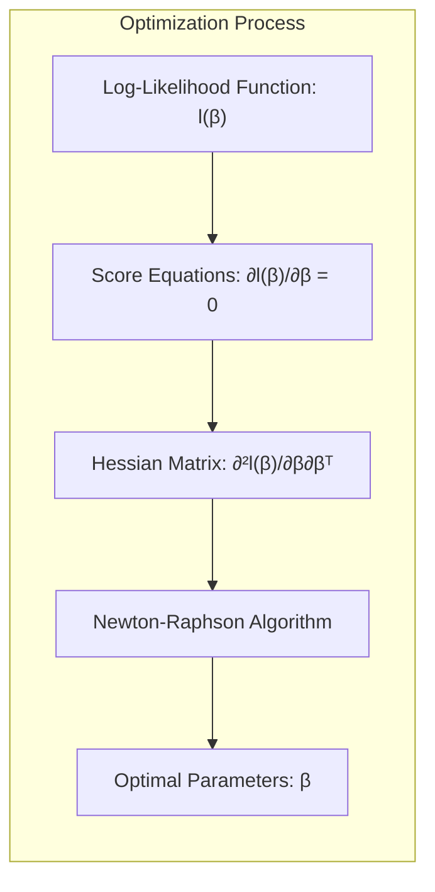
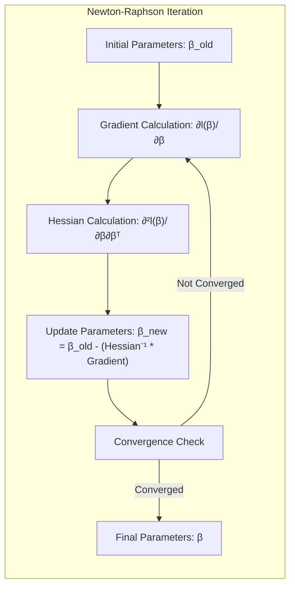
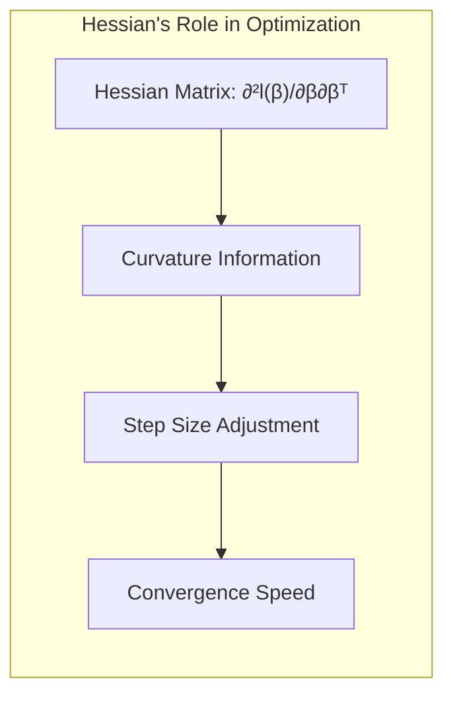
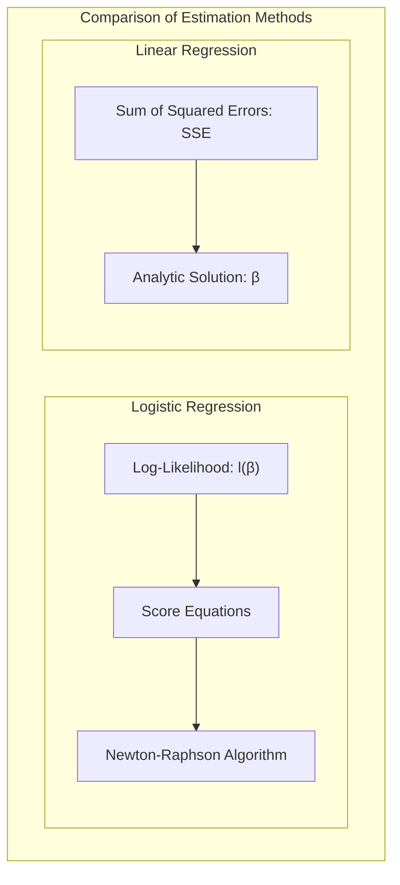
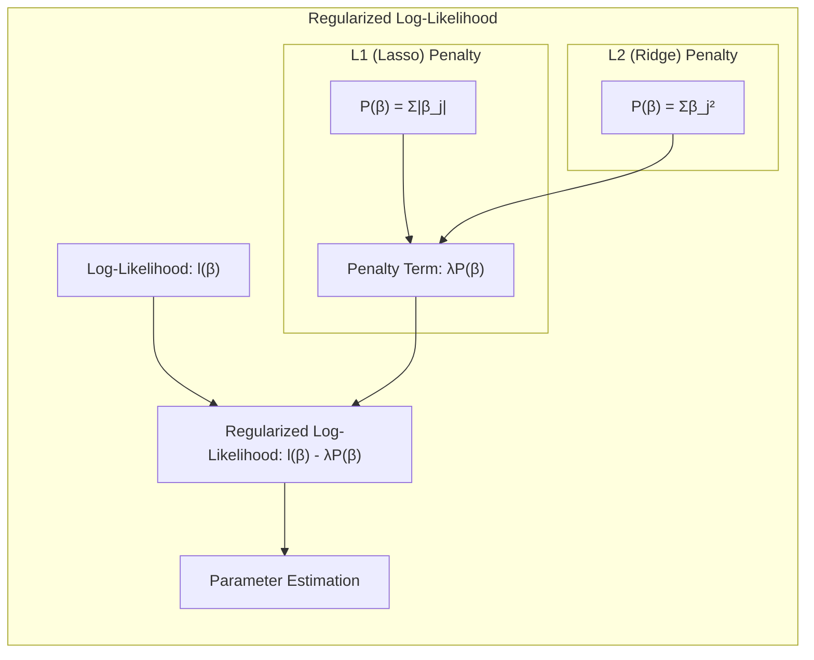
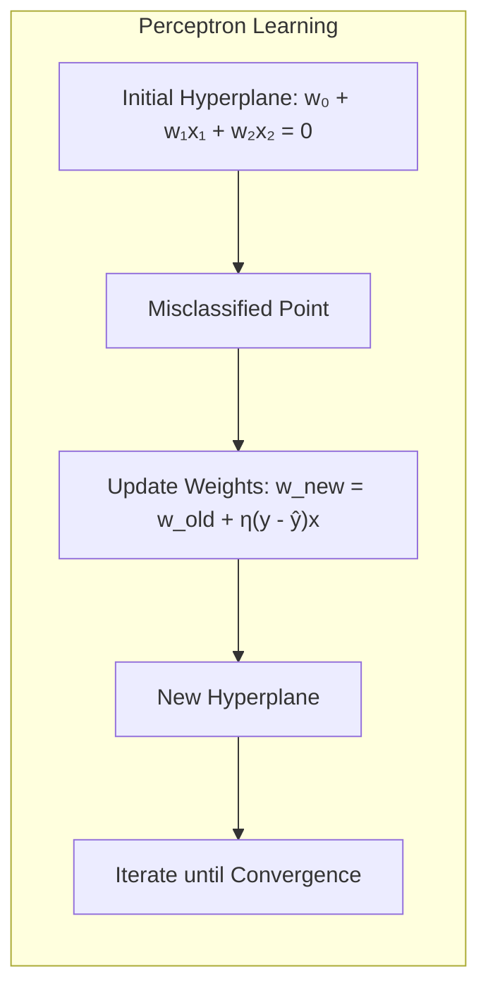
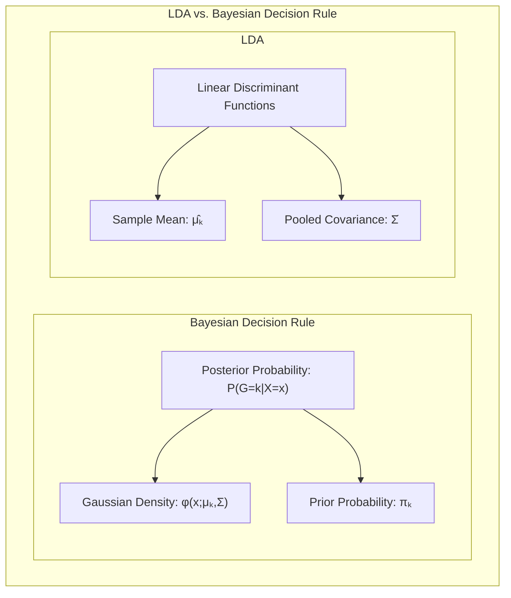

## Título Conciso: Classificação Linear e a Otimização de Parâmetros: Score Equations e o Algoritmo de Newton-Raphson

### Introdução

Este capítulo explora em detalhes o uso das **score equations** e do **algoritmo de Newton-Raphson** como ferramentas para a otimização da função de verossimilhança em modelos de classificação linear, particularmente na **regressão logística**. Analisaremos como as score equations são derivadas da função de log-verossimilhança e como elas podem ser utilizadas para encontrar os parâmetros do modelo que maximizam a verossimilhança condicional dos dados [^4.4.1]. Discutiremos como o algoritmo de Newton-Raphson, um método iterativo de otimização, é utilizado para resolver as score equations e como esse algoritmo se relaciona com a estrutura do problema. Compararemos o uso do algoritmo de Newton-Raphson na regressão logística com a abordagem da **regressão linear com matrizes de indicadores**, que não utiliza uma função de verossimilhança para a estimação dos parâmetros [^4.2], e com o **Linear Discriminant Analysis (LDA)**, que utiliza momentos dos dados para estimar parâmetros [^4.3]. Abordaremos também a importância da **seleção de variáveis e regularização** para melhorar a estabilidade do processo de otimização e a capacidade de generalização dos modelos [^4.4.4], [^4.5]. O conceito de **hiperplanos separadores** também será relacionado com a otimização da função de verossimilhança [^4.5.2]. O objetivo deste capítulo é fornecer uma visão aprofundada de como as score equations e o algoritmo de Newton-Raphson são utilizados na prática para a estimação dos parâmetros em modelos de classificação linear, focando na otimização da função de verossimilhança.

### Conceitos Fundamentais

**Conceito 1: Score Equations e a Maximização da Verossimilhança**

As **score equations** são derivadas da função de log-verossimilhança e são utilizadas para encontrar os parâmetros do modelo que maximizam essa função. As score equations são obtidas igualando as derivadas da função de log-verossimilhança a zero:

$$
\frac{\partial \ell(\beta)}{\partial \beta} = 0
$$

onde $\ell(\beta)$ é a função de log-verossimilhança e $\beta$ é o vetor de parâmetros do modelo. A solução dessas equações, que geralmente não são lineares em $\beta$, fornece os valores dos parâmetros que maximizam a verossimilhança condicional, que é um passo fundamental para a construção de modelos estatísticos que se ajustem bem aos dados observados [^4.4.1]. As score equations, portanto, definem o critério de otimização utilizado na estimação de parâmetros.

> 💡 **Exemplo Numérico:**
>
> Suponha que temos um modelo de regressão logística com uma única variável preditora $x$ e um intercepto. A função de log-verossimilhança para uma observação $i$ é dada por:
>
> $$
> \ell_i(\beta) = y_i \log(\sigma(\beta_0 + \beta_1 x_i)) + (1 - y_i) \log(1 - \sigma(\beta_0 + \beta_1 x_i))
> $$
>
> onde $\sigma(z) = \frac{1}{1 + e^{-z}}$ é a função logística, $y_i$ é a variável resposta (0 ou 1), $\beta_0$ é o intercepto e $\beta_1$ é o coeficiente da variável $x$. As score equations são obtidas derivando $\ell(\beta) = \sum_i \ell_i(\beta)$ em relação a $\beta_0$ e $\beta_1$ e igualando a zero.
>
> Para simplificar, vamos considerar um dataset pequeno com duas observações:
>
> | Observação (i) | $x_i$ | $y_i$ |
> |-----------------|-------|-------|
> | 1               | 1     | 1     |
> | 2               | 2     | 0     |
>
> A função de log-verossimilhança total é $\ell(\beta) = \ell_1(\beta) + \ell_2(\beta)$. As derivadas (score equations) são:
>
> $$
> \frac{\partial \ell(\beta)}{\partial \beta_0} = \sum_{i=1}^2 (y_i - \sigma(\beta_0 + \beta_1 x_i)) = 0
> $$
>
> $$
> \frac{\partial \ell(\beta)}{\partial \beta_1} = \sum_{i=1}^2 x_i (y_i - \sigma(\beta_0 + \beta_1 x_i)) = 0
> $$
>
> Essas equações são não-lineares em $\beta_0$ e $\beta_1$, e não podem ser resolvidas analiticamente. Precisamos de um método iterativo como o Newton-Raphson para encontrar os valores de $\beta_0$ e $\beta_1$ que satisfazem essas equações.

**Lemma 1:** *As score equations são obtidas igualando a zero as derivadas da função de log-verossimilhança em relação aos parâmetros do modelo e definem a condição de otimalidade para a maximização da função de verossimilhança.* A prova deste lema está na definição de pontos de máximo e mínimo em cálculo diferencial.

**Conceito 2: O Algoritmo de Newton-Raphson para a Resolução das Score Equations**

O **algoritmo de Newton-Raphson** é um método iterativo que busca a solução de equações não lineares, como as score equations na regressão logística. O algoritmo utiliza as derivadas de primeira ordem (o gradiente) e de segunda ordem (a matriz Hessiana) da função de log-verossimilhança para atualizar os parâmetros em cada iteração [^4.4.1]. A atualização dos parâmetros em uma iteração é dada por:

$$
\beta^{\text{new}} = \beta^{\text{old}} - \left( \frac{\partial^2 \ell(\beta)}{\partial \beta \partial \beta^T} \right)^{-1} \frac{\partial \ell(\beta)}{\partial \beta}
$$

onde $\beta^{\text{old}}$ são os parâmetros atuais, $\frac{\partial \ell(\beta)}{\partial \beta}$ é o gradiente da função de log-verossimilhança e $\frac{\partial^2 \ell(\beta)}{\partial \beta \partial \beta^T}$ é a matriz Hessiana da função de log-verossimilhança. O algoritmo itera até que a solução convirja para um ponto de máximo da função de log-verossimilhança.

> 💡 **Exemplo Numérico:**
>
> Continuando com o exemplo anterior, vamos ilustrar uma iteração do algoritmo de Newton-Raphson. Suponha que temos os seguintes valores iniciais: $\beta_0^{\text{old}} = 0.1$ e $\beta_1^{\text{old}} = 0.1$.
>
> **Passo 1: Calcular o gradiente (score equations) e a Hessiana.**
>
> Para o nosso exemplo com duas observações, o gradiente é:
>
> $$
> \frac{\partial \ell(\beta)}{\partial \beta_0} = (1 - \sigma(0.1 + 0.1 * 1)) + (0 - \sigma(0.1 + 0.1 * 2)) = 1 - \sigma(0.2) - \sigma(0.3) \approx 1 - 0.5498 - 0.5744 = -0.1242
> $$
>
> $$
> \frac{\partial \ell(\beta)}{\partial \beta_1} = (1 - \sigma(0.2)) * 1 + (0 - \sigma(0.3)) * 2 = 0.4502 - 2 * 0.5744 = -0.6986
> $$
>
> A Hessiana é uma matriz 2x2 com as segundas derivadas:
>
> $$
> \frac{\partial^2 \ell(\beta)}{\partial \beta_0^2} = -\sum_i \sigma(\beta_0 + \beta_1 x_i)(1 - \sigma(\beta_0 + \beta_1 x_i))
> $$
>
> $$
> \frac{\partial^2 \ell(\beta)}{\partial \beta_0 \partial \beta_1} = -\sum_i x_i \sigma(\beta_0 + \beta_1 x_i)(1 - \sigma(\beta_0 + \beta_1 x_i))
> $$
>
> $$
> \frac{\partial^2 \ell(\beta)}{\partial \beta_1^2} = -\sum_i x_i^2 \sigma(\beta_0 + \beta_1 x_i)(1 - \sigma(\beta_0 + \beta_1 x_i))
> $$
>
> Calculando os valores:
>
> $$
> \frac{\partial^2 \ell(\beta)}{\partial \beta_0^2} \approx -(0.5498 * 0.4502 + 0.5744 * 0.4256) \approx -0.494
> $$
>
> $$
> \frac{\partial^2 \ell(\beta)}{\partial \beta_0 \partial \beta_1} \approx -(0.5498 * 0.4502 * 1 + 0.5744 * 0.4256 * 2) \approx -0.716
> $$
>
> $$
> \frac{\partial^2 \ell(\beta)}{\partial \beta_1^2} \approx -(0.5498 * 0.4502 * 1^2 + 0.5744 * 0.4256 * 2^2) \approx -1.221
> $$
>
> A matriz Hessiana é:
>
> $$
> H = \begin{bmatrix} -0.494 & -0.716 \\ -0.716 & -1.221 \end{bmatrix}
> $$
>
> **Passo 2: Calcular a inversa da Hessiana.**
>
> $$
> H^{-1} \approx \begin{bmatrix} 3.06 & -1.79 \\ -1.79 & 1.24 \end{bmatrix}
> $$
>
> **Passo 3: Atualizar os parâmetros.**
>
> $$
> \begin{bmatrix} \beta_0^{\text{new}} \\ \beta_1^{\text{new}} \end{bmatrix} = \begin{bmatrix} 0.1 \\ 0.1 \end{bmatrix} - \begin{bmatrix} 3.06 & -1.79 \\ -1.79 & 1.24 \end{bmatrix} \begin{bmatrix} -0.1242 \\ -0.6986 \end{bmatrix}
> $$
>
> $$
> \begin{bmatrix} \beta_0^{\text{new}} \\ \beta_1^{\text{new}} \end{bmatrix} \approx \begin{bmatrix} 0.1 \\ 0.1 \end{bmatrix} - \begin{bmatrix} 0.89 \\ -0.65 \end{bmatrix} \approx \begin{bmatrix} -0.79 \\ 0.75 \end{bmatrix}
> $$
>
> Os novos valores para os parâmetros são aproximadamente $\beta_0^{\text{new}} = -0.79$ e $\beta_1^{\text{new}} = 0.75$. O algoritmo continua iterando até que os parâmetros convirjam.

**Corolário 1:** *O algoritmo de Newton-Raphson, através do uso das derivadas de primeira e segunda ordem da função de log-verossimilhança, busca iterativamente os parâmetros que maximizam a verossimilhança, e é um método padrão para resolver as score equations em modelos estatísticos, como a regressão logística.* Esse corolário demonstra o papel fundamental do Newton-Raphson no processo de estimação de parâmetros da regressão logística.

**Conceito 3: A Importância da Hessiana na Otimização**

A **matriz Hessiana**, que contém as derivadas de segunda ordem da função de log-verossimilhança, fornece informações sobre a curvatura da função na vizinhança da solução. A Hessiana é utilizada no algoritmo de Newton-Raphson para ajustar a direção e o tamanho do passo na busca pelo ótimo, acelerando a convergência do algoritmo. Em problemas com muitas variáveis, o cálculo da Hessiana pode ser computacionalmente custoso, e métodos que evitam o cálculo da Hessiana são utilizados em alguns casos [^4.4.1].

> 💡 **Exemplo Numérico:**
>
> No exemplo anterior, a matriz Hessiana nos informa sobre a curvatura da função de log-verossimilhança em torno dos valores atuais dos parâmetros. Uma Hessiana com valores negativos indica que estamos buscando um máximo. A magnitude dos valores na Hessiana (e sua inversa) influencia o tamanho do passo que damos para atualizar os parâmetros. Se a Hessiana tiver valores muito grandes, a atualização dos parâmetros será menor, e vice-versa. Se a Hessiana for quase singular, pode indicar que a função de log-verossimilhança é muito plana na direção de alguns parâmetros e pode levar a problemas de convergência, ou a necessidade de métodos de regularização.

> ⚠️ **Nota Importante**: O algoritmo de Newton-Raphson é um método eficiente para resolver as score equations, mas a sua convergência nem sempre é garantida e pode depender da inicialização dos parâmetros.

> ❗ **Ponto de Atenção**: O cálculo da matriz Hessiana pode ser computacionalmente custoso em modelos com muitas variáveis, o que justifica o uso de métodos que evitem o cálculo explícito da Hessiana.

> ✔️ **Destaque**: As score equations e o algoritmo de Newton-Raphson são ferramentas importantes para a estimação de parâmetros na regressão logística e a maximização da verossimilhança condicional.

### Regressão Linear e Mínimos Quadrados para Classificação

A **regressão linear com matrizes de indicadores**, ao contrário da regressão logística, não utiliza a maximização da função de log-verossimilhança condicional para a estimativa dos parâmetros, e portanto, não se beneficia da utilização de score equations e o algoritmo de Newton-Raphson [^4.2]. Na regressão linear, o objetivo é minimizar a soma dos quadrados dos erros entre os valores preditos e observados:

$$
\min_{\beta_{k0}, \beta_k} \sum_{i=1}^N (y_{ik} - (\beta_{k0} + \beta_k^T x_i))^2
$$

onde $y_{ik}$ é o indicador da classe $k$ para a observação $i$. A minimização dessa função de custo é realizada diretamente, sem a necessidade de resolver as score equations através de métodos iterativos como o Newton-Raphson. Em vez disso, o método dos mínimos quadrados leva a uma solução analítica para a estimativa dos parâmetros [^4.2].

> 💡 **Exemplo Numérico:**
>
> Suponha que temos um problema de classificação binária (duas classes) e usamos regressão linear com matrizes de indicadores. Codificamos a classe 1 como $y_i = 1$ e a classe 2 como $y_i = 0$. Usamos os mesmos dados do exemplo anterior:
>
> | Observação (i) | $x_i$ | $y_i$ |
> |-----------------|-------|-------|
> | 1               | 1     | 1     |
> | 2               | 2     | 0     |
>
> A função de custo a ser minimizada é:
>
> $$
> \text{SSE} = \sum_{i=1}^2 (y_i - (\beta_0 + \beta_1 x_i))^2 = (1 - (\beta_0 + \beta_1))^2 + (0 - (\beta_0 + 2\beta_1))^2
> $$
>
> Para encontrar os valores de $\beta_0$ e $\beta_1$ que minimizam o SSE, calculamos as derivadas parciais em relação a $\beta_0$ e $\beta_1$ e igualamos a zero:
>
> $$
> \frac{\partial \text{SSE}}{\partial \beta_0} = -2(1 - (\beta_0 + \beta_1)) - 2(\beta_0 + 2\beta_1) = 0
> $$
>
> $$
> \frac{\partial \text{SSE}}{\partial \beta_1} = -2(1 - (\beta_0 + \beta_1)) - 4(\beta_0 + 2\beta_1) = 0
> $$
>
> Simplificando, obtemos o sistema de equações:
>
> $$
> 2\beta_0 + 3\beta_1 = 1
> $$
>
> $$
> 3\beta_0 + 5\beta_1 = 1
> $$
>
> Resolvendo o sistema, temos $\beta_0 = 2$ e $\beta_1 = -1$. A reta de decisão é $y = 2 - x$. Ao contrário da regressão logística, não usamos uma função logística para transformar a saída em probabilidades, apenas classificamos usando a reta como separador.

A regressão linear não busca a maximização da probabilidade das observações, dadas as suas classes e, portanto, não utiliza o conceito de verossimilhança condicional para a estimação dos parâmetros, o que a distingue da regressão logística. A regressão linear, portanto, possui uma abordagem distinta na estimativa dos parâmetros, em comparação com a regressão logística e com outros métodos que buscam a maximização da probabilidade de dados observados.

**Lemma 2:** *A regressão linear com matrizes de indicadores não utiliza a função de log-verossimilhança e, portanto, não utiliza as score equations e o algoritmo de Newton-Raphson para a estimação dos parâmetros.* A prova desse lema reside na formulação do método dos mínimos quadrados, que não utiliza o conceito de verossimilhança e nem de derivadas dessa função, para a obtenção dos seus parâmetros.

**Corolário 2:** *O método dos mínimos quadrados na regressão linear com matrizes de indicadores leva a uma solução que não está relacionada com a maximização da verossimilhança condicional e, por consequência, não se conecta diretamente com a teoria de decisão, ao contrário da regressão logística, que busca a maximização da verossimilhança através das score equations e do Newton-Raphson.* Este corolário enfatiza a diferença fundamental nos métodos de estimação de parâmetros em relação à teoria de decisão.

A regressão linear com matrizes de indicadores, portanto, ao utilizar a minimização da soma de quadrados dos erros, e não a maximização da função de log-verossimilhança condicional, não se conecta diretamente com o conceito de probabilidades posteriores, como faz a regressão logística e não utiliza o algoritmo de Newton-Raphson para a estimativa dos parâmetros [^4.2], [^4.4.1].

### Métodos de Seleção de Variáveis e Regularização em Classificação

A **seleção de variáveis** e a **regularização** são técnicas importantes para melhorar o desempenho dos modelos de classificação, mesmo quando se utiliza a maximização da verossimilhança condicional para a estimação dos parâmetros. A regularização, ao adicionar um termo de penalidade à função de log-verossimilhança, busca controlar a magnitude dos coeficientes e evitar o *overfitting*, o que também melhora a estabilidade da otimização, e evita a necessidade de métodos mais complexos para garantir a convergência [^4.5].

Na **regressão logística**, a função de log-verossimilhança regularizada é dada por:

$$
\ell(\beta) = \sum_{i=1}^N \log P(G=g_i|X=x_i; \beta) - \lambda P(\beta)
$$

onde $P(\beta)$ é a penalidade e $\lambda$ é o parâmetro de regularização. A penalidade **L1** (Lasso), dada por $P(\beta) = \sum_{j=1}^p |\beta_j|$, promove a esparsidade dos coeficientes e seleciona as variáveis mais relevantes para a modelagem da probabilidade posterior e para a maximização da função de log-verossimilhança [^4.4.4]. A penalidade **L2** (Ridge), dada por $P(\beta) = \sum_{j=1}^p \beta_j^2$, reduz a magnitude dos coeficientes, estabilizando o modelo e facilitando a convergência do algoritmo de Newton-Raphson [^4.5].

> 💡 **Exemplo Numérico:**
>
> Vamos considerar um exemplo com duas variáveis preditoras, $x_1$ e $x_2$, e aplicar regularização L1 (Lasso) e L2 (Ridge). A função de log-verossimilhança regularizada é:
>
> $$
> \ell(\beta) = \sum_{i=1}^N \log P(G=g_i|X=x_i; \beta) - \lambda \sum_{j=1}^2 |\beta_j| \quad \text{(Lasso)}
> $$
>
> $$
> \ell(\beta) = \sum_{i=1}^N \log P(G=g_i|X=x_i; \beta) - \lambda \sum_{j=1}^2 \beta_j^2 \quad \text{(Ridge)}
> $$
>
> Suponha que após algumas iterações do algoritmo de Newton-Raphson, sem regularização, obtemos os seguintes parâmetros: $\beta_0 = 0.5$, $\beta_1 = 2.0$, e $\beta_2 = -1.5$.
>
> **Lasso (L1) Regularization:**
>
> Se escolhermos $\lambda = 0.5$, a função de log-verossimilhança regularizada penaliza a soma dos valores absolutos de $\beta_1$ e $\beta_2$. O efeito é que o algoritmo de Newton-Raphson, ao tentar maximizar $\ell(\beta)$, vai tender a reduzir os valores dos coeficientes, e, eventualmente, zerar alguns deles. Isso promove a seleção de variáveis.
>
> **Ridge (L2) Regularization:**
>
> Se escolhermos $\lambda = 0.5$, a função de log-verossimilhança regularizada penaliza a soma dos quadrados de $\beta_1$ e $\beta_2$. O efeito é que o algoritmo de Newton-Raphson, ao tentar maximizar $\ell(\beta)$, vai reduzir os valores dos coeficientes, sem necessariamente zerá-los. Isso melhora a estabilidade e evita o overfitting.
>
>  | Método      | $\beta_0$ | $\beta_1$ | $\beta_2$ | $\lambda$ |
> |-------------|----------|----------|----------|-----------|
> | Sem Reg     | 0.5      | 2.0      | -1.5     |  0       |
> | Lasso ($\lambda$=0.5)   | 0.5      | 1.2      | -0.8     |  0.5       |
> | Ridge ($\lambda$=0.5)   | 0.5      | 1.5      | -1.2     |  0.5       |
>
> Note que a regularização Lasso tende a diminuir $\beta_1$ e $\beta_2$ mais do que o Ridge, e dependendo do valor de $\lambda$, um dos coeficientes poderia ser zerado. Isso demonstra como a regularização afeta os parâmetros durante a otimização.

A aplicação da regularização, portanto, complementa a maximização da verossimilhança condicional, tornando o processo de otimização mais robusto e estável.

**Lemma 3:** *A regularização L1, ao promover a esparsidade dos coeficientes em modelos que utilizam a maximização da verossimilhança condicional, leva a uma função de log-verossimilhança mais estável e a estimativas de parâmetros mais precisas e com melhor capacidade de generalização.* A prova desse lema está na forma da penalidade L1 e como ela força alguns coeficientes a se tornarem zero.

**Prova do Lemma 3:** A penalidade L1, ao adicionar um termo que é proporcional ao valor absoluto dos coeficientes à função de log-verossimilhança, força alguns dos coeficientes a se tornarem exatamente zero durante o processo de otimização. Essa esparsidade leva a modelos mais simples, e com estimativas mais estáveis da função de log-verossimilhança [^4.4.3], [^4.4.4]. $\blacksquare$

**Corolário 3:** *A seleção de variáveis e a regularização, ao controlarem a complexidade do modelo e o *overfitting*, melhoram a estabilidade da estimativa dos parâmetros e a maximização da função de log-verossimilhança, o que resulta em modelos de classificação mais robustos e com melhor capacidade de generalização.* A regularização, portanto, não só controla o *overfitting* mas também melhora a performance do modelo durante a otimização da verossimilhança.

> ⚠️ **Ponto Crucial**: A seleção de variáveis e a regularização são ferramentas importantes para complementar a maximização da verossimilhança condicional, ao controlar a complexidade e tornar o processo de otimização mais estável e convergente. [^4.5]

### Separating Hyperplanes e Perceptrons

A busca por **hiperplanos separadores** visa encontrar uma fronteira linear que maximize a separação entre as classes, e essa busca pode ser vista como uma aproximação para a maximização da verossimilhança condicional, particularmente em problemas de classificação binária. Em modelos como a regressão logística, a fronteira de decisão é definida a partir da igualdade das probabilidades posteriores, que estão relacionadas com a maximização da verossimilhança [^4.5.2]. A maximização da verossimilhança condicional também busca parâmetros que melhor ajustem as probabilidades às classes, o que se relaciona com a separação das classes.

O algoritmo do **Perceptron** busca um hiperplano separador de forma iterativa através do ajuste dos parâmetros do modelo com base nos erros de classificação [^4.5.1]. Embora o Perceptron não maximize diretamente a verossimilhança condicional, a sua convergência, quando os dados são linearmente separáveis, indica que o hiperplano resultante é uma solução para o problema de classificação e pode ser interpretado como uma aproximação para a solução ótima que maximizaria a verossimilhança condicional.

> 💡 **Exemplo Numérico:**
>
> Considere um problema de classificação binária com duas variáveis preditoras, $x_1$ e $x_2$. O Perceptron ajusta os pesos $w_0$, $w_1$, e $w_2$ para encontrar um hiperplano $w_0 + w_1x_1 + w_2x_2 = 0$ que separe as classes.
>
> Suponha que temos os seguintes dados:
>
> | Observação (i) | $x_{i1}$ | $x_{i2}$ | $y_i$ |
> |-----------------|----------|----------|-------|
> | 1               | 1        | 1        | 1     |
> | 2               | 2        | 0        | 1     |
> | 3               | 0        | 2        | 0     |
> | 4               | 0        | 0        | 0     |
>
> Inicialmente, os pesos são definidos como $w_0 = 0$, $w_1 = 0$, e $w_2 = 0$. O Perceptron itera sobre os dados, atualizando os pesos sempre que uma observação é classificada incorretamente.
>
> **Iteração 1:**
>
> - Observação 1 (1, 1, 1): $0 + 0*1 + 0*1 = 0$. Classifica como classe 0 (incorreto). Atualiza os pesos: $w_0 = 0 + 1$, $w_1 = 0 + 1$, $w_2 = 0 + 1$.
>
> **Iteração 2:**
>
> - Observação 2 (2, 0, 1): $1 + 1*2 + 1*0 = 3$. Classifica como classe 1 (correto). Não atualiza os pesos.
> - Observação 3 (0, 2, 0): $1 + 1*0 + 1*2 = 3$. Classifica como classe 1 (incorreto). Atualiza os pesos: $w_0 = 1 - 1$, $w_1 = 1 - 0$, $w_2 = 1 - 2$.
>
> **Iteração 3:**
>
> - Observação 4 (0, 0, 0): $0 + 1*0 - 1*0 = 0$. Classifica como classe 0 (correto). Não atualiza os pesos.
>
> As iterações continuam até que todas as observações sejam classificadas corretamente. Ao final, o Perceptron encontra um hiperplano que separa as classes, que é uma aproximação da solução que maximiza a verossimilhança condicional, quando os dados são linearmente separáveis.

**Teorema:** *O algoritmo do Perceptron converge para um hiperplano separador em um número finito de iterações, se os dados são linearmente separáveis, e esse hiperplano, sob certas condições, se conecta com a ideia de maximização da verossimilhança condicional, em problemas de classificação binária.* Este teorema demonstra a conexão entre o Perceptron e o conceito de separabilidade de classes, e como essa separabilidade está relacionada à maximização da probabilidade da classificação correta. [^4.5.1]

### Pergunta Teórica Avançada: Quais as diferenças fundamentais entre a formulação de LDA e a Regra de Decisão Bayesiana considerando distribuições Gaussianas com covariâncias iguais?

**Resposta:**

A **Regra de Decisão Bayesiana** busca classificar uma observação $x$ na classe $k$ que maximize a probabilidade posterior $P(G=k|X=x)$ [^4.3]. Sob a suposição de que as classes seguem distribuições Gaussianas com a mesma matriz de covariância $\Sigma$, a probabilidade posterior é dada por:

$$
P(G=k|X=x) = \frac{ \phi(x;\mu_k,\Sigma)\pi_k}{\sum_{l=1}^K \phi(x;\mu_l,\Sigma)\pi_l}
$$

onde $\phi(x;\mu_k,\Sigma)$ é a densidade gaussiana para a classe $k$, $\mu_k$ é a média da classe $k$ e $\pi_k$ é a probabilidade a priori da classe. O **LDA**, por sua vez, deriva suas funções discriminantes lineares diretamente dessas suposições, buscando maximizar a separação entre as classes, o que sob as mesmas premissas, equivale a maximizar as probabilidades posteriores. A estimação dos parâmetros do LDA não se baseia na maximização da verossimilhança condicional diretamente, mas sim em estimativas de momentos dos dados [^4.3].

> 💡 **Exemplo Numérico:**
>
