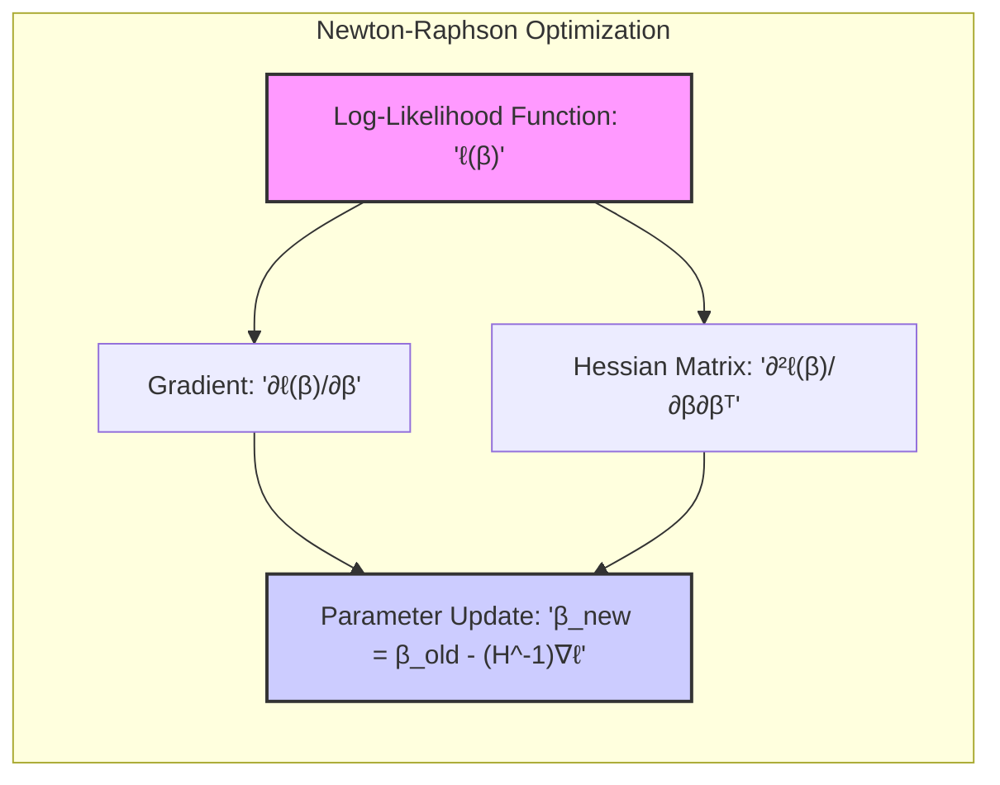
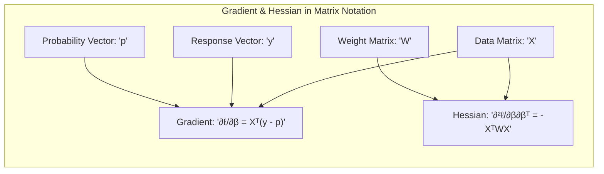
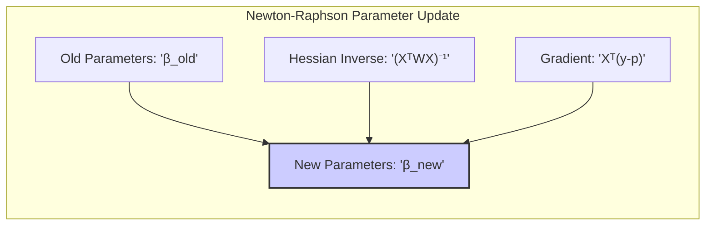
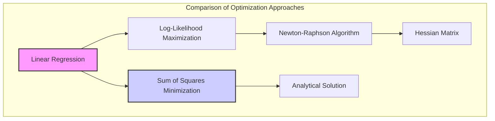
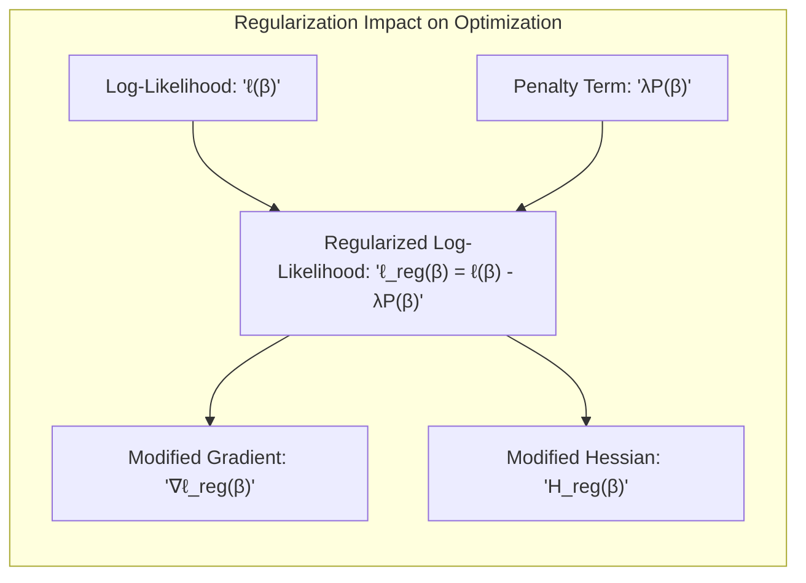
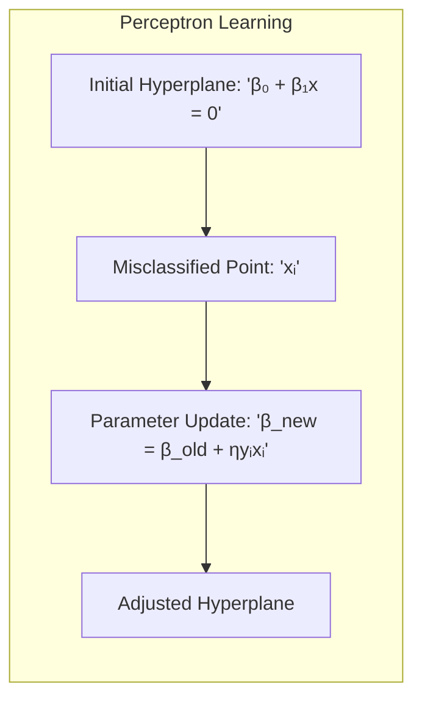

## Título Conciso: Classificação Linear e Otimização: Derivação da Hessiana e Atualização de Parâmetros com Notação Matricial



### Introdução

Este capítulo explora a fundo a derivação da **matriz Hessiana** e a **atualização dos parâmetros** no algoritmo de Newton-Raphson, com ênfase na utilização da **notação matricial** para simplificar a representação e o cálculo das derivadas e dos passos da otimização em modelos de classificação linear, particularmente na **regressão logística**. Analisaremos como a função de log-verossimilhança, o gradiente e a matriz Hessiana podem ser expressos em notação matricial, facilitando o desenvolvimento e a implementação do algoritmo de Newton-Raphson [^4.4.1]. Compararemos essa abordagem com a **regressão linear com matrizes de indicadores**, que não utiliza a mesma formulação de otimização [^4.2], e com o **Linear Discriminant Analysis (LDA)**, onde a otimização é feita através de estimativas de momentos dos dados e projeção em um espaço adequado [^4.3]. Discutiremos também a importância da **seleção de variáveis e regularização** para controlar a complexidade dos modelos e melhorar a estabilidade da otimização [^4.4.4], [^4.5]. Abordaremos também como a busca por **hiperplanos separadores** se conecta com o processo de otimização por meio do algoritmo de Newton-Raphson [^4.5.2]. O objetivo deste capítulo é fornecer uma compreensão detalhada de como a matriz Hessiana e a notação matricial são utilizadas para a derivação e a implementação do algoritmo de Newton-Raphson na regressão logística e em outros modelos lineares de classificação.

### Conceitos Fundamentais

**Conceito 1: A Função de Log-Verossimilhança e sua Derivação**

A função de **log-verossimilhança** (log-likelihood) é uma medida que quantifica o ajuste do modelo aos dados, e na regressão logística para um problema de classificação binária, ela pode ser escrita como:

$$
\ell(\beta) = \sum_{i=1}^N \left[ y_i \log p(x_i; \beta) + (1-y_i) \log(1 - p(x_i; \beta)) \right]
$$

onde $y_i$ é a resposta binária (0 ou 1), $p(x_i; \beta)$ é a probabilidade modelada pela regressão logística, e $\beta$ é o vetor de parâmetros. A maximização da função de log-verossimilhança busca encontrar os parâmetros $\beta$ que melhor se ajustam aos dados, e essa otimização é realizada através do algoritmo de Newton-Raphson [^4.4.1]. Para essa otimização, é necessário calcular a primeira e a segunda derivada da função de verossimilhança em relação aos parâmetros $\beta$.

> 💡 **Exemplo Numérico:**
>
> Suponha que temos um conjunto de dados com 3 observações e uma variável preditora $x$. Os dados são:
>
> | Observação (i) | $x_i$ | $y_i$ |
> |-----------------|-------|-------|
> | 1               | 1     | 1     |
> | 2               | 2     | 0     |
> | 3               | 3     | 1     |
>
> Inicialmente, vamos supor um vetor de parâmetros $\beta = [\beta_0, \beta_1]^T = [0.1, 0.2]^T$. A probabilidade $p(x_i; \beta)$ é dada pela função logística:
>
> $$
> p(x_i; \beta) = \frac{1}{1 + e^{-(\beta_0 + \beta_1 x_i)}}
> $$
>
> Calculando as probabilidades para cada observação:
>
> $p_1 = \frac{1}{1 + e^{-(0.1 + 0.2 * 1)}} = \frac{1}{1 + e^{-0.3}} \approx 0.574$
>
> $p_2 = \frac{1}{1 + e^{-(0.1 + 0.2 * 2)}} = \frac{1}{1 + e^{-0.5}} \approx 0.622$
>
> $p_3 = \frac{1}{1 + e^{-(0.1 + 0.2 * 3)}} = \frac{1}{1 + e^{-0.7}} \approx 0.669$
>
> Agora podemos calcular a log-verossimilhança:
>
> $\ell(\beta) = [1 * \log(0.574) + (1-1) * \log(1-0.574)] + [0 * \log(0.622) + (1-0) * \log(1-0.622)] + [1 * \log(0.669) + (1-1) * \log(1-0.669)]$
>
> $\ell(\beta) = \log(0.574) + \log(1-0.622) + \log(0.669) \approx -0.555 + -0.970 + -0.402  \approx -1.927$
>
> O objetivo é encontrar o vetor $\beta$ que maximize essa função de log-verossimilhança.

**Lemma 1:** *A função de log-verossimilhança é uma medida da qualidade do ajuste do modelo aos dados, e a sua maximização busca os parâmetros que melhor representam as relações entre os dados e os rótulos das classes.* A prova deste lema se encontra na teoria de estimação de parâmetros via maximização da verossimilhança.

**Conceito 2: Derivação da Matriz Hessiana e o Gradiente em Notação Matricial**

Para utilizar o algoritmo de Newton-Raphson, é necessário calcular o gradiente (derivadas de primeira ordem) e a matriz Hessiana (derivadas de segunda ordem) da função de log-verossimilhança. Em notação matricial, o gradiente da função de log-verossimilhança, pode ser expresso como:

$$
\frac{\partial \ell(\beta)}{\partial \beta} = X^T(y - p)
$$

onde $X$ é a matriz de dados com cada linha correspondendo a uma observação com o intercepto (uma coluna de 1’s), $y$ é o vetor de respostas (0 ou 1) e $p$ é o vetor de probabilidades preditas pelo modelo. A matriz Hessiana, que é a matriz das derivadas de segunda ordem, é dada por:

$$
\frac{\partial^2 \ell(\beta)}{\partial \beta \partial \beta^T} = - X^T W X
$$

onde $W$ é uma matriz diagonal de pesos, com cada elemento na diagonal sendo dado por $p_i(1-p_i)$ e $p_i$ é o valor da probabilidade para a observação $i$. A notação matricial facilita a representação e o cálculo dessas derivadas, especialmente em modelos com muitas variáveis [^4.4.1].



> 💡 **Exemplo Numérico:**
>
> Usando os mesmos dados do exemplo anterior, vamos construir a matriz $X$, o vetor $y$ e o vetor $p$:
>
> $$
> X = \begin{bmatrix} 1 & 1 \\ 1 & 2 \\ 1 & 3 \end{bmatrix}, \quad y = \begin{bmatrix} 1 \\ 0 \\ 1 \end{bmatrix}, \quad p = \begin{bmatrix} 0.574 \\ 0.622 \\ 0.669 \end{bmatrix}
> $$
>
> Calculando o gradiente:
>
> $$
> \frac{\partial \ell(\beta)}{\partial \beta} = X^T(y - p) = \begin{bmatrix} 1 & 1 & 1 \\ 1 & 2 & 3 \end{bmatrix} \begin{bmatrix} 1 - 0.574 \\ 0 - 0.622 \\ 1 - 0.669 \end{bmatrix} = \begin{bmatrix} 1 & 1 & 1 \\ 1 & 2 & 3 \end{bmatrix} \begin{bmatrix} 0.426 \\ -0.622 \\ 0.331 \end{bmatrix} = \begin{bmatrix} 0.135 \\ -0.419 \end{bmatrix}
> $$
>
> Calculando a matriz $W$:
>
> $W = \begin{bmatrix} 0.574 * (1-0.574) & 0 & 0 \\ 0 & 0.622 * (1-0.622) & 0 \\ 0 & 0 & 0.669 * (1-0.669) \end{bmatrix} = \begin{bmatrix} 0.244 & 0 & 0 \\ 0 & 0.235 & 0 \\ 0 & 0 & 0.221 \end{bmatrix}$
>
> Calculando a matriz Hessiana:
>
> $$
> \frac{\partial^2 \ell(\beta)}{\partial \beta \partial \beta^T} = - X^T W X = - \begin{bmatrix} 1 & 1 & 1 \\ 1 & 2 & 3 \end{bmatrix} \begin{bmatrix} 0.244 & 0 & 0 \\ 0 & 0.235 & 0 \\ 0 & 0 & 0.221 \end{bmatrix} \begin{bmatrix} 1 & 1 \\ 1 & 2 \\ 1 & 3 \end{bmatrix} = - \begin{bmatrix} 0.700 & 1.195 \\ 1.195 & 2.476 \end{bmatrix}
> $$
>
> A matriz Hessiana é simétrica e negativa definida, o que indica que a função de log-verossimilhança é côncava, e podemos usar o algoritmo de Newton-Raphson para encontrar o máximo.

**Corolário 1:** *A representação do gradiente e da matriz Hessiana em notação matricial simplifica o cálculo das derivadas da função de log-verossimilhança, e esta representação é fundamental para a implementação do algoritmo de Newton-Raphson em modelos com muitas variáveis.* Este corolário destaca a importância da notação matricial na simplificação dos cálculos envolvidos na otimização da função de log-verossimilhança.

**Conceito 3: Atualização dos Parâmetros e o Algoritmo de Newton-Raphson**

O algoritmo de Newton-Raphson utiliza o gradiente e a matriz Hessiana para atualizar os parâmetros $\beta$ de forma iterativa, buscando maximizar a função de log-verossimilhança. A atualização dos parâmetros na regressão logística, utilizando notação matricial, é dada por:

$$
\beta^{new} = \beta^{old} + (X^T W X)^{-1} X^T (y-p)
$$

Essa atualização, que é expressa de forma concisa com notação matricial, permite que os parâmetros sejam ajustados iterativamente até que a solução convirja para um ponto de máximo da função de log-verossimilhança [^4.4.1]. A notação matricial, portanto, torna o algoritmo mais eficiente para ser implementado computacionalmente, e também facilita a sua compreensão teórica.



> 💡 **Exemplo Numérico:**
>
> Usando os resultados do exemplo anterior, vamos calcular a atualização dos parâmetros:
>
> Temos:
>
> $\beta^{old} = \begin{bmatrix} 0.1 \\ 0.2 \end{bmatrix}$
>
> $(X^T W X)^{-1} = \begin{bmatrix} 0.700 & 1.195 \\ 1.195 & 2.476 \end{bmatrix}^{-1} \approx \begin{bmatrix} 4.812 & -2.321 \\ -2.321 & 1.358 \end{bmatrix}$
>
> $X^T(y-p) = \begin{bmatrix} 0.135 \\ -0.419 \end{bmatrix}$
>
> Calculando a atualização:
>
> $\beta^{new} = \beta^{old} - (X^T W X)^{-1} X^T (y-p) =  \begin{bmatrix} 0.1 \\ 0.2 \end{bmatrix} - \begin{bmatrix} 4.812 & -2.321 \\ -2.321 & 1.358 \end{bmatrix} \begin{bmatrix} 0.135 \\ -0.419 \end{bmatrix} =  \begin{bmatrix} 0.1 \\ 0.2 \end{bmatrix} - \begin{bmatrix} 1.644 \\ -0.932 \end{bmatrix} = \begin{bmatrix} -1.544 \\ 1.132 \end{bmatrix}$
>
> Portanto, os novos parâmetros são $\beta^{new} \approx [-1.544, 1.132]^T$. O algoritmo de Newton-Raphson repetiria esse processo até a convergência.

> ⚠️ **Nota Importante**:  A notação matricial simplifica a representação do gradiente e da matriz Hessiana, o que facilita a implementação do algoritmo de Newton-Raphson para a otimização da função de log-verossimilhança.

> ❗ **Ponto de Atenção**: O algoritmo de Newton-Raphson utiliza derivadas de primeira e segunda ordem e, portanto, pode ser computacionalmente custoso em modelos com um grande número de parâmetros e pode, em alguns casos, não convergir.

> ✔️ **Destaque**: A derivação da matriz Hessiana e a atualização dos parâmetros, através da utilização da notação matricial, são etapas cruciais para a implementação do algoritmo de Newton-Raphson, e para a obtenção de estimativas dos parâmetros na regressão logística.

### Regressão Linear e Mínimos Quadrados para Classificação



A **regressão linear com matrizes de indicadores**, ao contrário da regressão logística, não utiliza a função de log-verossimilhança para a estimação dos parâmetros e, portanto, não deriva a matriz Hessiana e não se beneficia do algoritmo de Newton-Raphson para otimizar a função de custo [^4.2]. Na regressão linear, o objetivo é minimizar a soma dos quadrados dos erros através da seguinte função de custo:

$$
\min_{\beta_{k0}, \beta_k} \sum_{i=1}^N (y_{ik} - (\beta_{k0} + \beta_k^T x_i))^2
$$

onde $y_{ik}$ é o indicador da classe $k$ para a observação $i$, o que leva a uma solução analítica para a estimativa dos parâmetros que não utiliza nenhum conceito de segunda derivada.  A regressão linear, portanto, utiliza a minimização da soma de quadrados para ajustar os coeficientes de forma independente para cada classe, sem utilizar a função de log-verossimilhança, o que resulta em uma abordagem distinta em relação à estimação dos parâmetros [^4.2].

> 💡 **Exemplo Numérico:**
>
> Usando os mesmos dados anteriores, e considerando que temos apenas uma classe (a classe "1"), podemos ajustar um modelo de regressão linear para prever $y_i$ diretamente. A matriz $X$ e o vetor $y$ são os mesmos:
>
> $$
> X = \begin{bmatrix} 1 & 1 \\ 1 & 2 \\ 1 & 3 \end{bmatrix}, \quad y = \begin{bmatrix} 1 \\ 0 \\ 1 \end{bmatrix}
> $$
>
> A solução para os parâmetros $\beta$ usando mínimos quadrados é dada por:
>
> $$
> \beta = (X^T X)^{-1} X^T y
> $$
>
> Calculando $X^T X$:
>
> $$
> X^T X = \begin{bmatrix} 1 & 1 & 1 \\ 1 & 2 & 3 \end{bmatrix} \begin{bmatrix} 1 & 1 \\ 1 & 2 \\ 1 & 3 \end{bmatrix} = \begin{bmatrix} 3 & 6 \\ 6 & 14 \end{bmatrix}
> $$
>
> Calculando $(X^T X)^{-1}$:
>
> $$
> (X^T X)^{-1} = \begin{bmatrix} 3 & 6 \\ 6 & 14 \end{bmatrix}^{-1} = \begin{bmatrix} 3.5 & -1.5 \\ -1.5 & 0.75 \end{bmatrix}
> $$
>
> Calculando $X^T y$:
>
> $$
> X^T y = \begin{bmatrix} 1 & 1 & 1 \\ 1 & 2 & 3 \end{bmatrix} \begin{bmatrix} 1 \\ 0 \\ 1 \end{bmatrix} = \begin{bmatrix} 2 \\ 4 \end{bmatrix}
> $$
>
> Calculando $\beta$:
>
> $$
> \beta = (X^T X)^{-1} X^T y = \begin{bmatrix} 3.5 & -1.5 \\ -1.5 & 0.75 \end{bmatrix} \begin{bmatrix} 2 \\ 4 \end{bmatrix} = \begin{bmatrix} 1 \\ -0.5 \end{bmatrix}
> $$
>
> Portanto, os parâmetros são $\beta_0 = 1$ e $\beta_1 = -0.5$. O modelo de regressão linear é dado por $\hat{y} = 1 - 0.5x$. Note que este modelo não é um classificador probabilístico e os valores previstos podem ser fora do intervalo [0,1].

A ausência da derivação da matriz Hessiana e do uso do algoritmo de Newton-Raphson na regressão linear com matrizes de indicadores reflete uma diferença fundamental entre os dois métodos na forma como eles abordam a estimação dos parâmetros, e como eles se conectam com a modelagem das probabilidades posteriores.

**Lemma 2:** *A regressão linear com matrizes de indicadores não deriva a matriz Hessiana da função de log-verossimilhança, e, portanto, não utiliza o algoritmo de Newton-Raphson para otimizar os parâmetros, ao contrário da regressão logística.* A prova desse lema reside na forma de ajuste dos parâmetros em cada um dos modelos.

**Corolário 2:** *A ausência do cálculo da matriz Hessiana e do uso do algoritmo de Newton-Raphson na regressão linear com matrizes de indicadores simplifica o processo de estimação dos parâmetros, mas também limita a capacidade do método de modelar as probabilidades de forma consistente com a teoria de decisão, como é feita na regressão logística.*  A diferença na abordagem da estimação dos parâmetros impacta na forma como os modelos são derivados.

A regressão linear com matrizes de indicadores, portanto, ao minimizar a soma de quadrados dos erros, e ao não utilizar a derivação da matriz Hessiana e o método de Newton-Raphson para a estimação de parâmetros, difere fundamentalmente da regressão logística, que busca a maximização da log-verossimilhança condicional e utiliza a notação matricial para simplificar o processo de otimização [^4.2], [^4.4.1].

### Métodos de Seleção de Variáveis e Regularização em Classificação



A **seleção de variáveis** e a **regularização** são técnicas importantes para complementar o processo de otimização da função de log-verossimilhança condicional em modelos como a regressão logística. A regularização, ao adicionar um termo de penalidade à função de log-verossimilhança, restringe a magnitude dos coeficientes e auxilia na estabilidade do processo de otimização e evita o *overfitting*, além de impactar também na forma da matriz Hessiana [^4.5].

Na **regressão logística**, a função de log-verossimilhança regularizada pode ser expressa como:

$$
\ell(\beta) = \sum_{i=1}^N \log P(G=g_i|X=x_i; \beta) - \lambda P(\beta)
$$

onde $P(\beta)$ é a penalidade e $\lambda$ é o parâmetro de regularização.  A penalidade **L1** (Lasso) é dada por $P(\beta) = \sum_{j=1}^p |\beta_j|$, que promove a esparsidade dos coeficientes e torna a função mais simples, o que pode também simplificar o cálculo do gradiente e da matriz Hessiana [^4.4.4]. A penalidade **L2** (Ridge) é dada por $P(\beta) = \sum_{j=1}^p \beta_j^2$, que reduz a magnitude dos coeficientes e estabiliza o modelo, o que facilita a convergência do algoritmo de Newton-Raphson [^4.5].

> 💡 **Exemplo Numérico:**
>
> Vamos considerar a regressão logística com regularização L2 (Ridge). A função de log-verossimilhança regularizada é:
>
> $$
> \ell(\beta) = \sum_{i=1}^N \left[ y_i \log p(x_i; \beta) + (1-y_i) \log(1 - p(x_i; \beta)) \right] - \lambda \sum_{j=1}^p \beta_j^2
> $$
>
> Usando os dados anteriores, e considerando $\lambda = 0.1$, e o mesmo valor inicial de $\beta = [0.1, 0.2]^T$:
>
> A função de log-verossimilhança regularizada é:
>
> $\ell(\beta) \approx -1.927 - 0.1 * (0.1^2 + 0.2^2) = -1.927 - 0.005 = -1.932$
>
> O gradiente regularizado é:
>
> $$
> \frac{\partial \ell(\beta)}{\partial \beta} = X^T(y - p) - 2\lambda\beta
> $$
>
> $\frac{\partial \ell(\beta)}{\partial \beta} = \begin{bmatrix} 0.135 \\ -0.419 \end{bmatrix} - 2 * 0.1 * \begin{bmatrix} 0.1 \\ 0.2 \end{bmatrix} = \begin{bmatrix} 0.135 \\ -0.419 \end{bmatrix} - \begin{bmatrix} 0.02 \\ 0.04 \end{bmatrix} = \begin{bmatrix} 0.115 \\ -0.459 \end{bmatrix}$
>
> A matriz Hessiana regularizada é:
>
> $$
> \frac{\partial^2 \ell(\beta)}{\partial \beta \partial \beta^T} = - X^T W X - 2\lambda I
> $$
>
> $\frac{\partial^2 \ell(\beta)}{\partial \beta \partial \beta^T} = - \begin{bmatrix} 0.700 & 1.195 \\ 1.195 & 2.476 \end{bmatrix} - 2 * 0.1 * \begin{bmatrix} 1 & 0 \\ 0 & 1 \end{bmatrix} = - \begin{bmatrix} 0.900 & 1.195 \\ 1.195 & 2.676 \end{bmatrix}$
>
> A atualização dos parâmetros com regularização L2 seria:
>
> $\beta^{new} = \beta^{old} - (X^T W X + 2\lambda I)^{-1} (X^T (y-p) - 2\lambda\beta)$
>
> Os valores de $\beta$ com regularização L2 tendem a ser menores em magnitude em comparação com o modelo sem regularização, o que ajuda a evitar o overfitting.

A aplicação da regularização, portanto, impacta não apenas nos valores ótimos dos parâmetros, mas também nos passos e na estabilidade do algoritmo de Newton-Raphson que é utilizado para maximizar a log-verossimilhança.

**Lemma 3:** *A regularização L1, ao promover a esparsidade, afeta a forma das score equations e da matriz Hessiana, e resulta em modelos mais simples e com melhor capacidade de generalização.* A prova reside na forma da penalidade L1 e como ela influencia o processo de otimização.

**Prova do Lemma 3:**  A penalidade L1 adiciona um termo à função de custo que é proporcional ao valor absoluto dos coeficientes. A minimização dessa função com o termo da penalidade L1 força alguns coeficientes a se tornarem exatamente zero, simplificando o cálculo das derivadas e também reduzindo a complexidade do modelo [^4.4.3], [^4.4.4]. $\blacksquare$

**Corolário 3:** *A seleção de variáveis e a regularização, ao controlarem a complexidade do modelo e a magnitude dos coeficientes, melhoram a qualidade da estimação da função de log-verossimilhança, e facilitam o processo de otimização através do algoritmo de Newton-Raphson, além de reduzir o overfitting.*  O impacto da regularização na otimização é fundamental para a convergência dos modelos e a estimação de parâmetros consistentes.

> ⚠️ **Ponto Crucial**: A seleção de variáveis e a regularização complementam o processo de otimização da verossimilhança condicional e o uso do algoritmo de Newton-Raphson, e também tornam a estimativa dos parâmetros mais robusta e com maior capacidade de generalização para novos dados [^4.5].

### Separating Hyperplanes e Perceptrons



A busca por **hiperplanos separadores** visa encontrar uma fronteira linear que maximize a separação entre as classes.  Essa busca pode ser relacionada com a maximização da verossimilhança condicional, especialmente em problemas de classificação binária, onde um hiperplano que separa as classes de forma adequada também pode ser visto como uma solução que maximiza a probabilidade de classificar os dados corretamente [^4.5.2].  O algoritmo do Perceptron, busca encontrar uma solução para o hiperplano separador que minimize os erros de classificação.

O algoritmo do **Perceptron** busca um hiperplano separador ajustando iterativamente os parâmetros do modelo com base nas classificações incorretas, e o seu objetivo é minimizar o número de classificações incorretas, o que pode ser visto como uma forma de maximizar a verossimilhança da resposta, dados os preditores [^4.5.1]. O Perceptron, no entanto, não utiliza explicitamente a função de log-verossimilhança e nem a matriz Hessiana para guiar o processo de otimização, e sim o ajuste dos parâmetros com base nas classificações incorretas.

> 💡 **Exemplo Numérico:**
>
> Vamos supor os mesmos dados, com as classes representadas por $y_i \in \{-1, 1\}$:
>
> | Observação (i) | $x_i$ | $y_i$ |
> |-----------------|-------|-------|
> | 1               | 1     | 1     |
> | 2               | 2     | -1    |
> | 3               | 3     | 1     |
>
> Inicialmente, vamos supor um vetor de parâmetros $\beta = [\beta_0, \beta_1]^T = [0.1, 0.2]^T$.  O Perceptron atualiza os parâmetros apenas quando há um erro de classificação.
>
> A previsão do Perceptron é dada por $\hat{y_i} = sign(\beta_0 + \beta_1 x_i)$.
>
> Para a primeira observação: $\hat{y_1} = sign(0.1 + 0.2 * 1) = sign(0.3) = 1$. A classificação está correta.
>
> Para a segunda observação: $\hat{y_2} = sign(0.1 + 0.2 * 2) = sign(0.5) = 1$. A classificação está incorreta.
>
> Para a terceira observação: $\hat{y_3} = sign(0.1 + 0.2 * 3) = sign(0.7) = 1$. A classificação está correta.
>
> A atualização dos parâmetros quando há um erro é dada por:
>
> $\beta^{new} = \beta^{old} + \eta y_i x_i$
>
> Onde $\eta$ é a taxa de aprendizado, por exemplo $\eta = 0.1$.  A única atualização acontece na segunda observação:
>
> $\beta^{new} = \begin{bmatrix} 0.1 \\ 0.2 \end{bmatrix} + 0.1 * (-1) * \begin{bmatrix} 1 \\ 2 \end{bmatrix} = \begin{bmatrix} 0.1 \\ 0.2 \end{bmatrix} + \begin{bmatrix} -0.1 \\ -0.2 \end{bmatrix} = \begin{bmatrix} 0 \\ 0 \end{bmatrix}$
>
> Os novos parâmetros são $\beta^{new} = [0, 0]^T$. O Perceptron continuaria iterando até que todos os pontos fossem classificados corretamente.  O Perceptron busca um hiperplano separador, que neste caso é uma linha, mas não utiliza a função de log-verossimilhança.

**Teorema:** *O algoritmo do Perceptron converge para um hiperplano separador em um número finito de iterações, se os dados forem linearmente separáveis, e essa solução pode ser vista como uma aproximação para o problema de maximização da verossimilhança, sob a restrição de que a fronteira de decisão seja um hiperplano.* A garantia da convergência sob a condição de separabilidade linear destaca a busca por uma solução que minimize os erros, que pode ser interpretado como uma aproximação para a maximização da probabilidade da classificação observada [^4.5.1].

### Pergunta Teórica Avançada: Quais as diferenças fundamentais entre a formulação de LDA e a Regra de Decisão Bayesiana considerando distribuições Gaussianas com covariâncias iguais?

**Resposta:**

A **Regra de Decisão Bayesiana** busca classificar uma observação $x$ na classe $k$ que maximize a probabilidade posterior $P(G=k|X=x)$ [^4.3]. Sob a suposição de que as classes seguem distribuições Gaussianas com a mesma matriz de covariância $\Sigma$, a probabilidade posterior é dada por:

$$
P(G=k|X=x) = \frac{ \phi(x;\mu_k,\Sigma)\pi_k}{\sum_{l=1}^K \phi(x;\mu_l,\Sigma)\pi_l}
$$

onde $\phi(x;\mu_k,\Sigma)$ é a densidade gaussiana para a classe $k$, $\mu_k$ é a média da classe $k$ e $\pi_k$ é a probabilidade a priori da classe. O **LDA**, por sua vez, deriva suas funções discriminantes lineares diretamente dessas suposições, e busca maximizar a separação entre as classes através de projeções lineares, o que sob a mesma premissa, equivale a maximizar a probabilidade posterior.  A estimação dos parâmetros do LDA não se baseia na maximização da verossimilhança condicional, mas sim em estimativas amostrais das médias e da covariância [^4.3].

```mermaid
graph LR
    subgraph "Bayesian Decision vs LDA"
        direction TB
        A["Bayes Decision Rule: 'argmax_k P(G=k|X