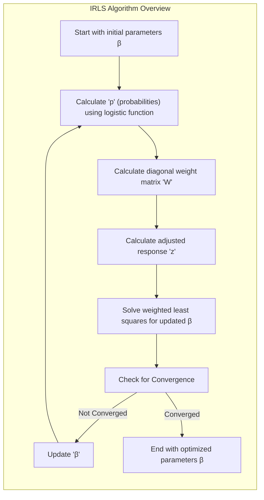
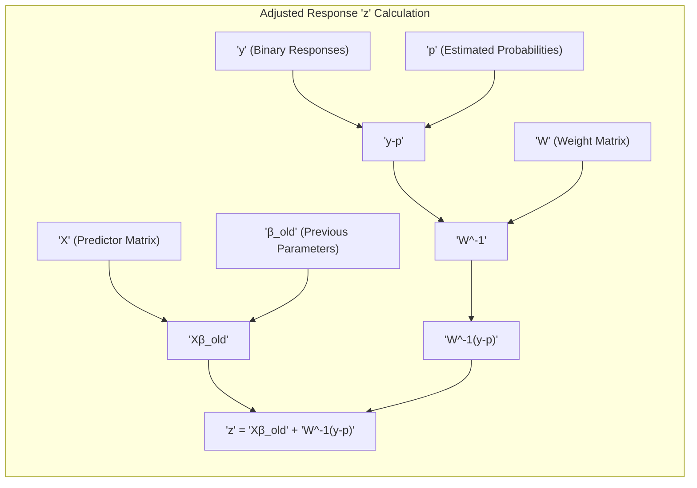
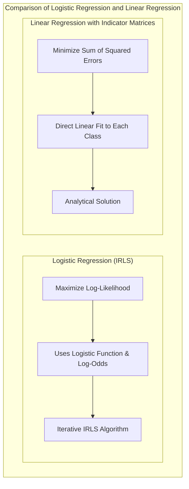
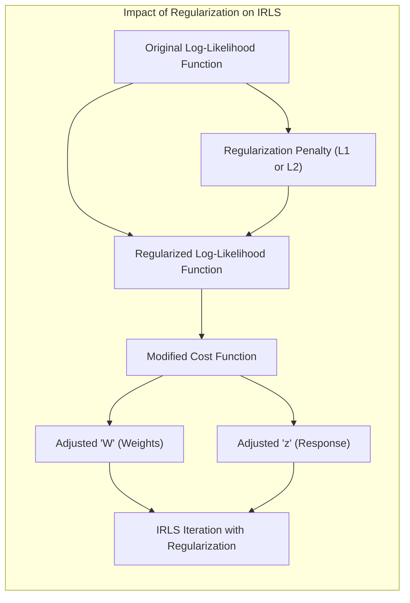
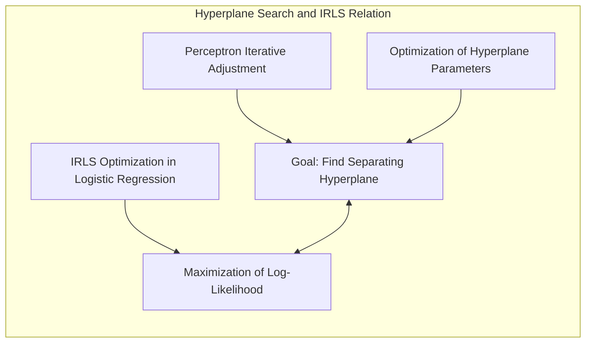
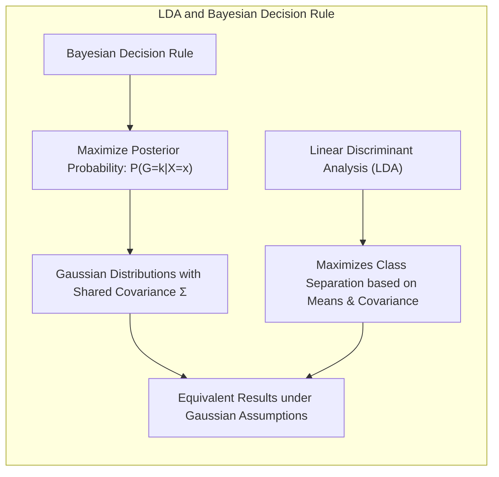

## Classificação Linear e Otimização: Algoritmo Iterativo de Mínimos Quadrados Re-ponderados (IRLS) e Regressão Logística



### Introdução

Este capítulo explora em profundidade o **algoritmo iterativo de mínimos quadrados re-ponderados (IRLS)** e sua aplicação na otimização dos parâmetros em modelos de classificação linear, particularmente na **regressão logística**. Analisaremos como o IRLS, através da utilização de um processo iterativo, aproxima a solução do problema de maximização da verossimilhança na regressão logística, e como o método de mínimos quadrados é utilizado a cada iteração para obter uma resposta ajustada e a atualização dos parâmetros.  Compararemos o IRLS com a **regressão linear com matrizes de indicadores**, que não utiliza a mesma abordagem de otimização iterativa [^4.2], e com o **Linear Discriminant Analysis (LDA)** e o **Quadratic Discriminant Analysis (QDA)**, que não se baseiam explicitamente na maximização da verossimilhança [^4.3]. Discutiremos como a **seleção de variáveis e regularização** podem ser incorporadas ao algoritmo IRLS para melhorar a qualidade do modelo [^4.4.4], [^4.5]. Abordaremos também como a busca por **hiperplanos separadores** se relaciona com a iteração do IRLS [^4.5.2]. O objetivo deste capítulo é fornecer uma compreensão detalhada de como o algoritmo IRLS funciona e como ele é utilizado para estimar os parâmetros na regressão logística, utilizando a linguagem de mínimos quadrados.

### Conceitos Fundamentais

**Conceito 1: O Algoritmo Iterativo de Mínimos Quadrados Re-ponderados (IRLS)**

O **algoritmo iterativo de mínimos quadrados re-ponderados (IRLS)** é um método iterativo para encontrar os parâmetros $\beta$ que maximizam a função de log-verossimilhança na regressão logística.  O IRLS transforma o problema de otimização não linear em uma sequência de problemas de mínimos quadrados ponderados, que são resolvidos de forma iterativa [^4.4.1]. Em cada iteração, o IRLS calcula uma resposta ajustada $z$ e utiliza essa resposta para atualizar os parâmetros do modelo, utilizando a solução dos mínimos quadrados ponderados.  Essa abordagem permite resolver o problema de otimização da regressão logística de forma eficiente, e faz uso de ferramentas de álgebra linear.

**Lemma 1:** *O algoritmo IRLS transforma o problema de otimização não linear da regressão logística em uma sequência de problemas de mínimos quadrados ponderados, tornando a resolução computacionalmente eficiente.* A demonstração da relação entre IRLS e a regressão logística se dá através da análise da derivada da função de log-verossimilhança.

**Conceito 2:  A Resposta Ajustada e os Pesos na Regressão Logística com IRLS**

Na regressão logística, o algoritmo IRLS calcula a **resposta ajustada** $z$ em cada iteração como:

$$
z = X\beta^{old} + W^{-1}(y-p)
$$

onde $X$ é a matriz de preditores (incluindo a coluna de interceptos), $\beta^{old}$ são os parâmetros da iteração anterior, $y$ é o vetor de respostas binárias (0 ou 1), $p$ é o vetor de probabilidades estimadas para cada observação na iteração anterior e $W$ é uma matriz diagonal de pesos que é obtida através da função logística, com elementos dados por $p_i(1-p_i)$, onde $p_i$ é a probabilidade estimada da i-ésima observação [^4.4.1].  Os pesos $W$ são utilizados para ponderar as observações no ajuste do modelo, e as observações com probabilidade mais próxima de 0 ou de 1 têm pesos menores, enquanto observações com probabilidades mais próximas de 0.5 têm pesos maiores.

> 💡 **Exemplo Numérico:**
>
> Vamos considerar um cenário simplificado com 3 observações e uma única variável preditora. Suponha que após a primeira iteração do IRLS, tenhamos:
>
> - Matriz de preditores $X$:
> ```
> X = np.array([[1, 2],
>               [1, 3],
>               [1, 5]])
> ```
> (A primeira coluna é o intercepto, e a segunda é a variável preditora)
>
> - Parâmetros da iteração anterior $\beta^{old}$:
> ```
> beta_old = np.array([0.5, 0.2])
> ```
>
> - Respostas binárias $y$:
> ```
> y = np.array([0, 1, 0])
> ```
>
> - Probabilidades estimadas $p$:
> ```
> p = np.array([0.3, 0.6, 0.8])
> ```
>
> - Matriz de pesos $W$:
> ```
> W = np.diag(p * (1 - p))
> W = np.array([[0.21, 0,    0   ],
>              [0,    0.24, 0    ],
>              [0,    0,    0.16 ]])
> ```
>
> Agora, podemos calcular a resposta ajustada $z$:
>
> $z = X\beta^{old} + W^{-1}(y-p)$
>
> Primeiro, calculamos $X\beta^{old}$:
>
> ```python
> import numpy as np
>
> X = np.array([[1, 2], [1, 3], [1, 5]])
> beta_old = np.array([0.5, 0.2])
> y = np.array([0, 1, 0])
> p = np.array([0.3, 0.6, 0.8])
> W = np.diag(p * (1 - p))
>
> X_beta_old = np.dot(X, beta_old)
> print(f"X * beta_old = {X_beta_old}")
> ```
>
> Resultado:
> ```
> X * beta_old = [0.9 1.1 1.5]
> ```
>
> Em seguida, calculamos $W^{-1}(y-p)$:
>
> ```python
> W_inv = np.linalg.inv(W)
> y_minus_p = y - p
> W_inv_y_minus_p = np.dot(W_inv, y_minus_p)
> print(f"W^-1 * (y - p) = {W_inv_y_minus_p}")
> ```
>
> Resultado:
> ```
> W^-1 * (y - p) = [-1.42857143  1.66666667 -5.        ]
> ```
>
> Finalmente, somamos os dois termos para obter $z$:
>
> ```python
> z = X_beta_old + W_inv_y_minus_p
> print(f"z = {z}")
> ```
>
> Resultado:
> ```
> z = [-0.52857143  2.76666667 -3.5       ]
> ```
>
> A resposta ajustada $z$ é então usada para atualizar os parâmetros $\beta$ na próxima iteração do IRLS. Note que os pesos em $W$ (0.21, 0.24 e 0.16) variam de acordo com a probabilidade estimada, e isso influencia o valor da resposta ajustada $z$.



**Corolário 1:** *O algoritmo IRLS utiliza os pesos $W$ e a resposta ajustada $z$ para calcular uma solução de mínimos quadrados ponderados que aproxima a solução do problema de maximização da log-verossimilhança na regressão logística.* Este corolário destaca o papel dos pesos e da resposta ajustada na iteração do IRLS.

**Conceito 3:  Iterações e a Convergência do IRLS**

O algoritmo IRLS é um método iterativo, e a cada iteração, os parâmetros $\beta$ são atualizados através da resolução do problema de mínimos quadrados ponderados:

$$
\beta^{new} = \arg \min_{\beta} (z-X\beta)^T W (z - X\beta)
$$

O algoritmo itera até que a solução convirja para um ponto de máximo da função de log-verossimilhança, ou seja, que as diferenças nos valores dos parâmetros de uma iteração para a seguinte seja menor que um determinado valor. Embora a convergência nem sempre seja garantida para todos os problemas, o IRLS é um método eficiente e amplamente utilizado para estimar os parâmetros da regressão logística [^4.4.1].

> ⚠️ **Nota Importante**: O algoritmo IRLS transforma o problema de otimização não linear da regressão logística em uma sequência de problemas de mínimos quadrados ponderados, o que possibilita encontrar a solução iterativamente.

> ❗ **Ponto de Atenção**: A convergência do algoritmo IRLS nem sempre é garantida, e pode depender da inicialização dos parâmetros e da estrutura dos dados.

> ✔️ **Destaque**: O algoritmo IRLS é uma ferramenta fundamental para estimar os parâmetros da regressão logística, e utiliza um procedimento iterativo que se baseia no método dos mínimos quadrados ponderados.

### Regressão Linear e Mínimos Quadrados para Classificação



A **regressão linear com matrizes de indicadores**, ao contrário da regressão logística que utiliza o algoritmo IRLS, não se baseia na maximização da verossimilhança para a estimação de parâmetros [^4.2]. Na regressão linear, o objetivo é ajustar modelos lineares para cada classe, através da minimização da soma dos quadrados dos erros, o que leva a uma solução analítica para os parâmetros do modelo:

$$
\min_{\beta_{k0}, \beta_k} \sum_{i=1}^N (y_{ik} - (\beta_{k0} + \beta_k^T x_i))^2
$$

onde $y_{ik}$ é o valor do indicador para a observação $i$ na classe $k$, e $\beta_{k0}$ e $\beta_k$ são os parâmetros a serem estimados. A regressão linear, portanto, não utiliza nenhum processo iterativo como o IRLS para estimar os seus parâmetros. Essa diferença na forma da estimação dos parâmetros é uma das características que distingue a regressão linear da regressão logística.

> 💡 **Exemplo Numérico:**
>
> Vamos usar o mesmo conjunto de dados do exemplo anterior, mas agora para regressão linear com matrizes de indicadores.  Como temos apenas duas classes (0 e 1), vamos criar uma matriz de indicadores $Y$ onde a coluna representa a classe 1.
>
> - Matriz de preditores $X$:
> ```
> X = np.array([[1, 2],
>               [1, 3],
>               [1, 5]])
> ```
>
> - Respostas binárias $y$:
> ```
> y = np.array([0, 1, 0])
> ```
>
> A matriz de indicadores $Y$ será igual ao vetor $y$.
>
> Para encontrar os parâmetros $\beta$ usando mínimos quadrados, resolvemos:
>
> $\beta = (X^TX)^{-1}X^Ty$
>
> Primeiro, calculamos $X^T X$:
>
> ```python
> X_transpose = X.T
> X_transpose_X = np.dot(X_transpose, X)
> print(f"X^T * X = \n{X_transpose_X}")
> ```
>
> Resultado:
> ```
> X^T * X =
> [[ 3 10]
> [10 38]]
> ```
>
> Em seguida, calculamos a inversa de $(X^T X)$:
>
> ```python
> X_transpose_X_inv = np.linalg.inv(X_transpose_X)
> print(f"(X^T * X)^-1 = \n{X_transpose_X_inv}")
> ```
>
> Resultado:
> ```
> (X^T * X)^-1 =
> [[ 1.1875 -0.3125]
> [-0.3125  0.09375]]
> ```
>
> Agora, calculamos $X^Ty$:
>
> ```python
> X_transpose_y = np.dot(X_transpose, y)
> print(f"X^T * y = {X_transpose_y}")
> ```
>
> Resultado:
> ```
> X^T * y = [1 3]
> ```
>
> Finalmente, calculamos $\beta$:
>
> ```python
> beta = np.dot(X_transpose_X_inv, X_transpose_y)
> print(f"beta = {beta}")
> ```
>
> Resultado:
> ```
> beta = [-0.1875  0.3125]
> ```
>
> Os parâmetros $\beta$ obtidos por mínimos quadrados são diferentes dos parâmetros obtidos por IRLS na regressão logística. A regressão linear busca minimizar a soma dos quadrados dos erros diretamente, enquanto a regressão logística usa um processo iterativo para maximizar a verossimilhança.

A regressão linear com matrizes de indicadores não utiliza o log-odds, a função logística ou um procedimento iterativo de estimação como o IRLS, e por isso, apresenta limitações na modelagem das probabilidades posteriores e na utilização da teoria de decisão.

**Lemma 2:** *A regressão linear com matrizes de indicadores não utiliza o algoritmo IRLS para a estimação dos parâmetros, e a minimização da soma de quadrados dos erros leva a uma solução analítica, ao contrário da abordagem iterativa da regressão logística.*  A prova desse lema está na formulação do método dos mínimos quadrados, que leva a uma solução direta para os parâmetros e não a um processo iterativo.

**Corolário 2:** *A ausência do uso do algoritmo IRLS e da maximização da verossimilhança na regressão linear com matrizes de indicadores torna o modelo mais simples do ponto de vista computacional, mas também limita a sua capacidade de modelar as probabilidades posteriores com a mesma precisão e calibração que a regressão logística.* Este corolário destaca como a diferença no método de estimação de parâmetros impacta as propriedades dos modelos.

A regressão linear com matrizes de indicadores, portanto, ao não utilizar um processo iterativo como o IRLS e ao não se basear na maximização da verossimilhança, se distingue da regressão logística e de outros modelos que se conectam com a teoria da decisão e que utilizam a função de log-verossimilhança como guia para a otimização dos seus parâmetros [^4.2], [^4.4.1].

### Métodos de Seleção de Variáveis e Regularização em Classificação



A **seleção de variáveis** e a **regularização** são técnicas importantes para complementar o algoritmo IRLS, especialmente em modelos de classificação com um número elevado de variáveis preditoras. A regularização, ao adicionar um termo de penalidade à função de log-verossimilhança, busca controlar a magnitude dos coeficientes e evitar o *overfitting*, e também estabilizar o processo iterativo do IRLS [^4.5].

Na **regressão logística**, a função de log-verossimilhança regularizada é dada por:

$$
\ell(\beta) = \sum_{i=1}^N \log P(G=g_i|X=x_i; \beta) - \lambda P(\beta)
$$

onde $P(\beta)$ é a penalidade e $\lambda$ é o parâmetro de regularização. A penalidade **L1** (Lasso), dada por $P(\beta) = \sum_{j=1}^p |\beta_j|$, promove a esparsidade dos coeficientes, selecionando as variáveis mais relevantes para a modelagem da probabilidade posterior e para a maximização da log-verossimilhança [^4.4.4]. A penalidade **L2** (Ridge), dada por $P(\beta) = \sum_{j=1}^p \beta_j^2$, reduz a magnitude dos coeficientes e estabiliza o modelo, facilitando a convergência do IRLS [^4.5].

> 💡 **Exemplo Numérico:**
>
> Vamos considerar um exemplo de regularização L2 (Ridge) aplicada à regressão logística com o mesmo conjunto de dados. Suponha que, após algumas iterações do IRLS (sem regularização), tenhamos os seguintes parâmetros:
>
> - Parâmetros $\beta$ (sem regularização):
> ```
> beta_unreg = np.array([0.5, 0.2])
> ```
>
> Agora, vamos aplicar a regularização L2 com $\lambda = 0.1$. A função de custo regularizada se torna:
>
> $ \ell(\beta) = \text{Log-Verossimilhança} - \lambda \sum_{j=1}^p \beta_j^2 $
>
> Para encontrar os novos parâmetros $\beta$ com regularização L2, precisamos modificar a atualização do IRLS para incorporar a penalidade. O problema de minimização se torna:
>
>  $\beta^{new} = \arg \min_{\beta} (z-X\beta)^T W (z - X\beta) + \lambda \sum_{j=1}^p \beta_j^2$
>
>  Em termos práticos, a atualização dos parâmetros $\beta$ com regularização Ridge pode ser feita através da seguinte equação:
>
>  $\beta^{new} = (X^T W X + \lambda I)^{-1} X^T W z$
>
>  Onde $I$ é a matriz identidade e $\lambda$ é o parâmetro de regularização.
>
> Vamos supor que, em uma iteração específica do IRLS, temos a matriz de preditores $X$, a matriz de pesos $W$ e a resposta ajustada $z$:
>
> ```python
> X = np.array([[1, 2],
>               [1, 3],
>               [1, 5]])
>
> W = np.array([[0.21, 0,    0   ],
>              [0,    0.24, 0    ],
>              [0,    0,    0.16 ]])
>
> z = np.array([-0.52857143,  2.76666667, -3.5       ])
>
> lambda_ridge = 0.1
>
> p = X.shape[1]  # Número de preditores (incluindo o intercepto)
> I = np.eye(p)   # Matriz identidade
>
> X_transpose = X.T
>
> # Calcula X^T W X
> X_transpose_W = np.dot(X_transpose, W)
> X_transpose_W_X = np.dot(X_transpose_W, X)
>
> # Calcula lambda * I
> lambda_I = lambda_ridge * I
>
> # Calcula (X^T W X + lambda * I)
> X_transpose_W_X_plus_lambda_I = X_transpose_W_X + lambda_I
>
> # Calcula a inversa de (X^T W X + lambda * I)
> inverse_matrix = np.linalg.inv(X_transpose_W_X_plus_lambda_I)
>
> # Calcula X^T W z
> X_transpose_W_z = np.dot(X_transpose_W, z)
>
> # Calcula beta_new
> beta_new_ridge = np.dot(inverse_matrix, X_transpose_W_z)
>
> print(f"beta com regularização L2 (Ridge) = {beta_new_ridge}")
> ```
>
> Resultado:
> ```
> beta com regularização L2 (Ridge) = [-0.03674381  0.41134677]
> ```
>
> Observe que os coeficientes de $\beta$ com regularização L2 são diferentes dos coeficientes sem regularização. A regularização L2 encolhe os coeficientes em direção a zero, o que ajuda a reduzir o overfitting e a estabilizar o modelo.

A regularização, portanto, modifica a função de log-verossimilhança e o processo iterativo do IRLS, e leva a modelos mais robustos e com melhor capacidade de generalização para novos dados.

**Lemma 3:** *A regularização L1 na regressão logística, ao promover a esparsidade dos coeficientes, altera a forma da função de log-verossimilhança e o comportamento do algoritmo IRLS, e com isso, leva a modelos mais simples, com menor número de variáveis, e melhor capacidade de generalização.*  A prova deste lema reside na forma da penalidade L1 e em como ela afeta a função de log-verossimilhança e o seu ponto de máximo.

**Prova do Lemma 3:**  A penalidade L1, ao adicionar um termo proporcional ao valor absoluto dos coeficientes à função de custo, força os coeficientes menos relevantes a se tornarem exatamente zero, selecionando as variáveis mais importantes e tornando a função mais simples para ser otimizada pelo IRLS [^4.4.3], [^4.4.4]. $\blacksquare$

**Corolário 3:** *A seleção de variáveis e a regularização, ao controlarem a complexidade do modelo e a magnitude dos coeficientes, contribuem para uma otimização mais estável e eficiente da função de log-verossimilhança através do algoritmo IRLS, e para a obtenção de modelos mais robustos e com melhor capacidade de generalização*.  A regularização afeta a estabilidade da otimização e o desempenho do modelo.

> ⚠️ **Ponto Crucial**:  A seleção de variáveis e a regularização são ferramentas essenciais para a aplicação do algoritmo IRLS, e para controlar a complexidade do modelo, e melhorar a capacidade de generalização e a estabilidade da otimização da função de log-verossimilhança [^4.5].

### Separating Hyperplanes e Perceptrons



A busca por **hiperplanos separadores** visa encontrar uma fronteira linear que maximize a separação entre as classes, e essa busca pode ser relacionada com a otimização da verossimilhança em modelos como a regressão logística. A ideia é que a busca por uma fronteira de decisão que separe as classes de forma eficiente pode ser vista como uma forma de aproximar a maximização da probabilidade das classificações observadas.  A utilização da técnica do Perceptron, embora não maximize explicitamente a verossimilhança, busca a obtenção de um hiperplano que separe as classes corretamente, de forma similar ao objetivo da regressão logística [^4.5.2].

O algoritmo do **Perceptron** busca um hiperplano separador através do ajuste iterativo de seus parâmetros com base nas classificações incorretas.  O algoritmo atualiza os parâmetros de uma função linear, baseando-se nos dados de treinamento, e o hiperplano resultante tem como objetivo a separação entre as classes. Embora o Perceptron não utilize o log-odds ou a função logística, como na regressão logística, a sua abordagem iterativa para a busca de um hiperplano separador pode ser vista como um algoritmo que aproxima a solução de modelos que maximizam a verossimilhança [^4.5.1].

**Teorema:** *Em problemas de classificação com dados linearmente separáveis, o algoritmo do Perceptron converge para um hiperplano separador em um número finito de iterações, e a busca pelo hiperplano pode ser vista como uma aproximação do problema de otimização através da maximização da verossimilhança, que é utilizado na regressão logística.* A convergência do Perceptron e a conexão com a busca de hiperplanos que separem as classes demonstra a relevância desse método na classificação linear, ainda que não modele as probabilidades de forma direta [^4.5.1].

### Pergunta Teórica Avançada: Quais as diferenças fundamentais entre a formulação de LDA e a Regra de Decisão Bayesiana considerando distribuições Gaussianas com covariâncias iguais?

**Resposta:**

A **Regra de Decisão Bayesiana** busca classificar uma observação $x$ na classe $k$ que maximize a probabilidade posterior $P(G=k|X=x)$ [^4.3]. Sob a suposição de que as classes seguem distribuições Gaussianas com a mesma matriz de covariância $\Sigma$, a probabilidade posterior é dada por:

$$
P(G=k|X=x) = \frac{ \phi(x;\mu_k,\Sigma)\pi_k}{\sum_{l=1}^K \phi(x;\mu_l,\Sigma)\pi_l}
$$

onde $\phi(x;\mu_k,\Sigma)$ é a densidade gaussiana da classe $k$, $\mu_k$ é a média da classe $k$ e $\pi_k$ é a probabilidade a priori da classe. O **LDA**, por sua vez, deriva suas funções discriminantes lineares diretamente dessas suposições e busca maximizar a separação entre as classes através da construção de funções que se baseiam nas médias e na covariância conjunta, que é uma forma de aproximar a maximização da probabilidade posterior [^4.3].

**Lemma 4:** *Sob a suposição de distribuições Gaussianas com a mesma matriz de covariância, a regra de decisão Bayesiana e o LDA são equivalentes, e ambos buscam maximizar a probabilidade posterior da classe, e a forma do hiperplano resultante é definida pelas médias, pela covariância, e pelas probabilidades a priori.*  A equivalência é demonstrada através da manipulação algébrica, que relaciona o log-ratio das probabilidades posteriores com a função discriminante do LDA [^4.3].



**Corolário 4:** *Ao relaxar a restrição de igualdade de covariâncias na regra de decisão Bayesiana, obtemos o QDA (Quadratic Discriminant Analysis), onde a fronteira de decisão não é mais linear e as matrizes de covariância são estimadas separadamente para cada classe, e os parâmetros não são mais obtidos como no LDA, através da estimação de momentos dos dados.* A forma da fronteira de decisão é mais flexível no QDA devido à eliminação da premissa de covariância igual para todas as classes [^4.3.1], [^4.3.3].

> ⚠️ **Ponto Crucial**: A principal diferença entre LDA e a regra de decisão Bayesiana está na forma de obtenção da fronteira de decisão. O LDA impõe a restrição de covariâncias iguais, e, sob esta suposição, a regra Bayesiana e o LDA levam ao mesmo resultado. O QDA remove a restrição de igualdade das covariâncias, resultando em fronteiras não lineares e na ausência da conexão com a derivação da função discriminante via o Critério de Fisher. [^4.3]

### Conclusão

Neste capítulo, exploramos a aplicação do algoritmo iterativo de mínimos quadrados re-ponderados (IRLS) na regressão logística para a estimação de parâmetros. Analisamos como o IRLS transforma o problema de otimização da regressão logística em uma sequência de problemas de mínimos quadrados ponderados e como a função de log-verossimilhança é utilizada como critério para o ajuste do modelo. Discutimos como o algoritmo de Newton-Raphson é utilizado para resolver as score equations, e como a regressão linear com matrizes de indicadores não utiliza essa abordagem de estimação de parâmetros. Exploramos a relação entre os hiperplanos separadores e a maximização da verossimilhança e analisamos como a seleção de variáveis e a regularização são importantes para obter modelos mais robustos e com melhor capacidade de generalização. Através deste capítulo, buscamos fornecer uma visão clara de como o algoritmo IRLS funciona e como ele é fundamental para a estimação dos parâmetros e para a otimização da função de log-verossimilhança na regressão logística, e como ele se conecta com o processo de tomada de decisão.

### Footnotes

[^4.1]: *In this chapter we revisit the classification problem and focus on linear methods for classification...There are several different ways in which linear decision boundaries can be found.*

[^4.2]: *In Chapter 2 we fit linear regression models to the class indicator variables, and classify to the largest fit...Linear inequalities in this space are quadratic inequalities in the original space.*

[^4.3]: *Decision theory for classification (Section 2.4) tells us that we need to know the class posteriors Pr(G|X) for optimal classification. Suppose fk(x) is the class-conditional density of X in class G = k, and let πκ be the prior probability of class k... Linear discriminant analysis (LDA) arises in the special case when we assume that the classes have a common covariance matrix Σk = Σ.*

[^4.3.1]: *The decision boundary between each pair of classes k and l is described by a quadratic equation {x: δκ(x) = δ(x)}.*

[^4.3.3]: *In the special case when we assume that the classes have a common covariance matrix...When the classes are really Gaussian, then LDA is optimal*

[^4.4]: *The logistic regression model arises from the desire to model the posterior probabilities of the K classes via linear functions in x, while at the same time ensuring that they sum to one and remain in [0,1].*

[^4.4.1]: *Logistic regression models are usually fit by maximum likelihood... The logistic regression model is more general, in that it makes less assumptions.*

[^4.4.2]: *It is convenient to code the two-class gi via a 0/1 response Yi, where yi = 1 when gi = 1, and yi = 0 when gi = 2... Typically many models are fit in a search for a parsimonious model involving a subset of the variables.*

[^4.4.3]: *To maximize the log-likelihood, we set its derivatives to zero. These score equations are...To solve the score equations (4.21), we use the Newton-Raphson algorithm...*

[^4.4.4]: *The L1 penalty used in the lasso (Section 3.4.2) can be used for variable selection and shrinkage with any linear regression model...As with the lasso, we typically do not penalize the intercept term.*

[^4.5]: *Here we present an analysis of binary data to illustrate the traditional statistical use of the logistic regression model... With two classes there is a simple correspondence between linear discriminant analysis and classification by linear least squares, as in (4.5).*

[^4.5.1]: *The perceptron learning algorithm tries to find a separating hyperplane by minimizing the distance of misclassified points to the decision boundary.*

[^4.5.2]: *The optimal separating hyperplane separates the two classes and maximizes the distance to the closest point from either class... In light of (4.40), the constraints define an empty slab or margin around the linear decision boundary...*
