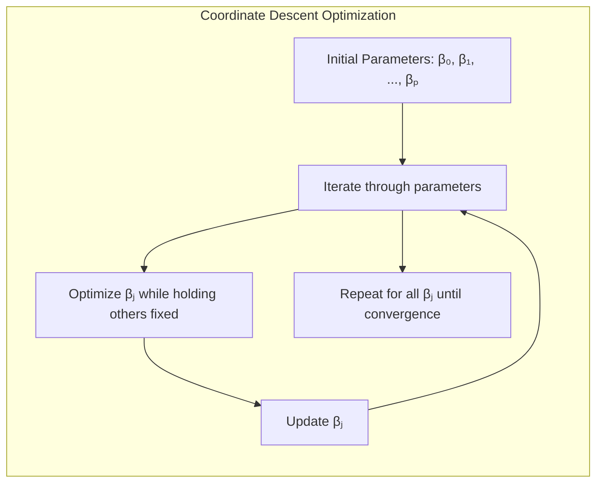
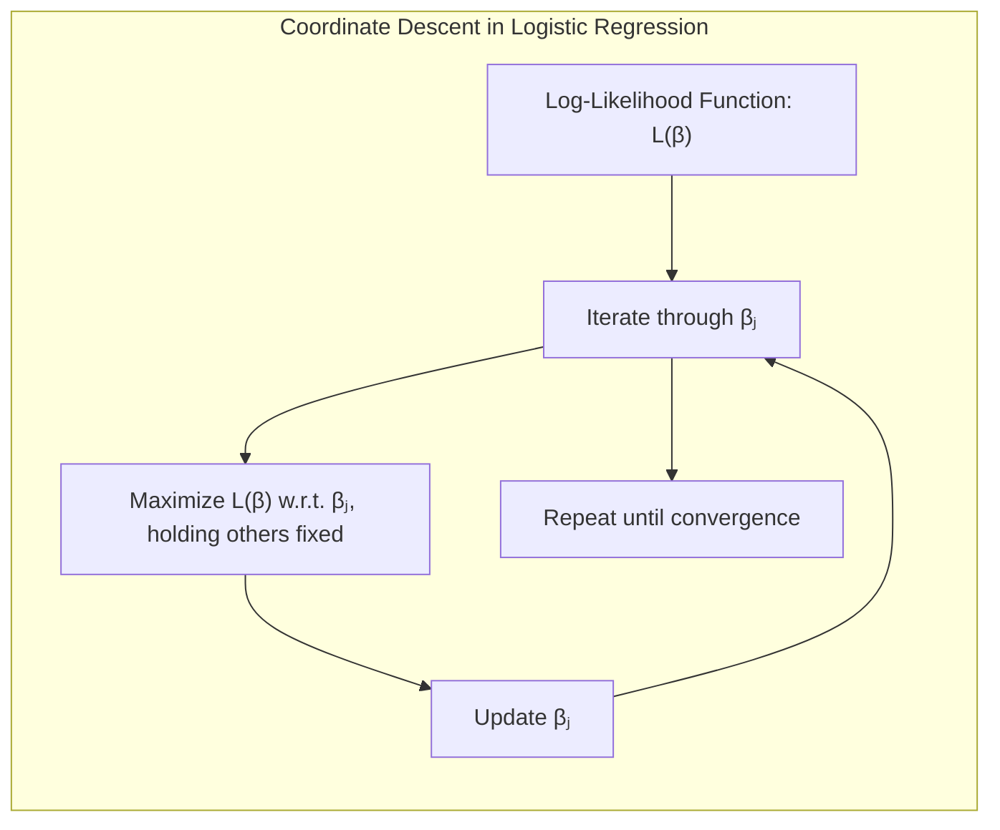
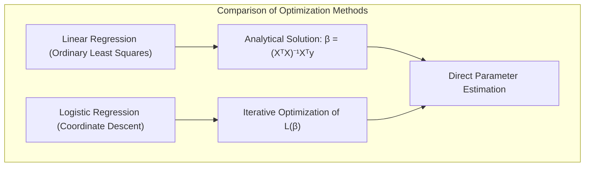
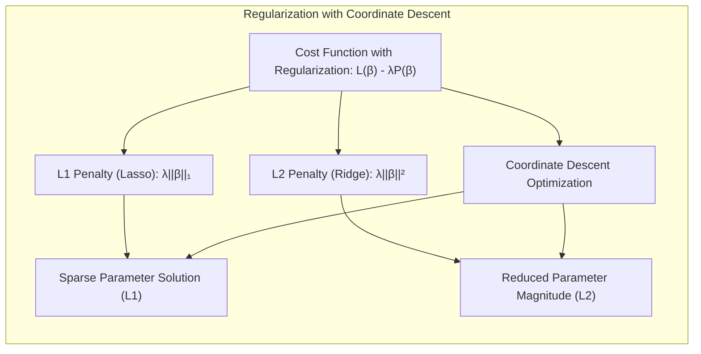
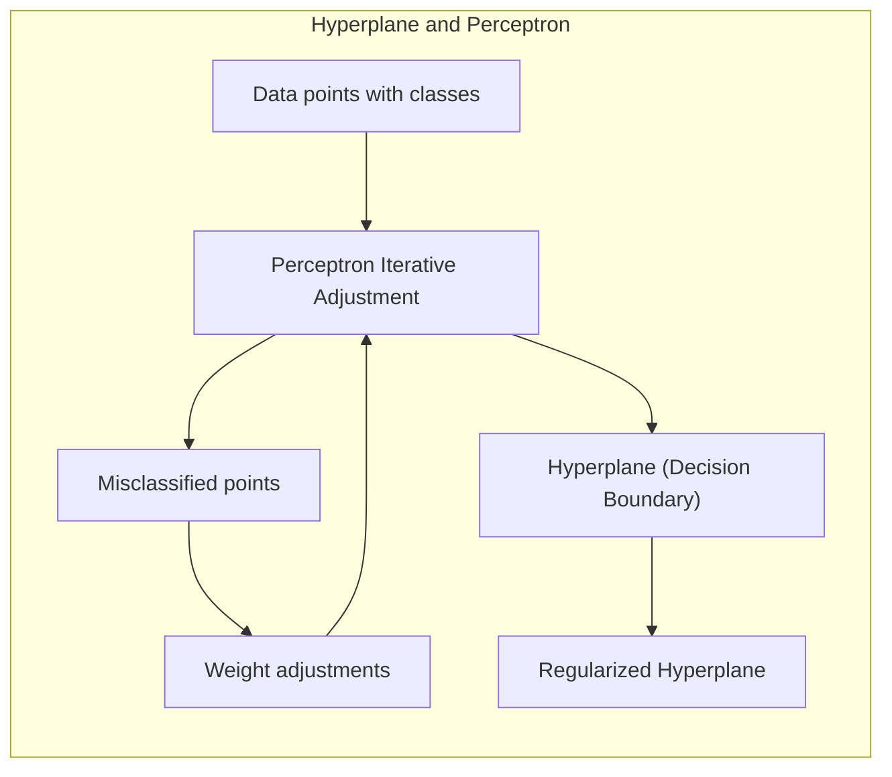
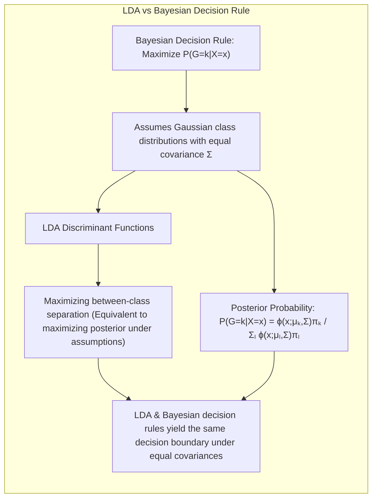

## Título Conciso: Classificação Linear e Otimização em Larga Escala: Coordinate Descent e o Pacote R glmnet



### Introdução

Este capítulo explora o método de **Coordinate Descent (descida por coordenadas)** como uma técnica eficiente para otimizar os parâmetros de modelos de classificação linear, especialmente em problemas de larga escala, onde o número de variáveis e/ou de observações é muito grande. Analisaremos como o método de *Coordinate Descent* atualiza os parâmetros iterativamente, otimizando uma variável por vez, enquanto as demais permanecem fixas, e como essa abordagem se conecta com o problema de otimização da **função de custo** em modelos como a **regressão logística** [^4.4.1]. Discutiremos como o pacote **`glmnet`** em R utiliza o método de *Coordinate Descent* para ajustar modelos de classificação regularizados de forma eficiente e como a esparsidade dos modelos, devido à regularização, influencia a performance do algoritmo.  Compararemos essa abordagem com a **regressão linear com matrizes de indicadores**, que não utiliza o método de *Coordinate Descent* [^4.2], e com o **Linear Discriminant Analysis (LDA)** e o **Quadratic Discriminant Analysis (QDA)**, que se baseiam em outros métodos de otimização [^4.3]. Abordaremos também como a **seleção de variáveis e regularização** se encaixam no contexto do método de *Coordinate Descent* [^4.4.4], [^4.5]. O conceito de **hiperplanos separadores** também será discutido em relação ao método de *Coordinate Descent* [^4.5.2]. O objetivo deste capítulo é fornecer uma compreensão detalhada de como o método de *Coordinate Descent* é utilizado para a otimização em larga escala em problemas de classificação linear, e como o pacote R `glmnet` implementa esse algoritmo.

### Conceitos Fundamentais

**Conceito 1: O Método de Coordinate Descent (Descida por Coordenadas)**

O método de **Coordinate Descent** (descida por coordenadas) é um algoritmo iterativo para a otimização de funções de custo, particularmente aquelas que dependem de muitas variáveis. O método otimiza uma variável por vez, enquanto as demais são mantidas fixas.  O processo é repetido para todas as variáveis até que a função de custo convirja para um mínimo.  A ideia central do Coordinate Descent é que, em cada passo, o problema de otimização se torna unidimensional, o que é mais simples e computacionalmente eficiente de resolver do que a otimização conjunta de todas as variáveis. O Coordinate Descent é especialmente útil em problemas onde a função de custo é diferenciável em relação a cada uma das variáveis, e para modelos que incluem termos de regularização L1, como no caso do lasso, que levam a soluções esparsas [^4.4.4].

> 💡 **Exemplo Numérico:**
>
> Imagine que temos uma função de custo $J(\beta_1, \beta_2) = (\beta_1 - 2)^2 + (\beta_2 - 3)^2 + \beta_1\beta_2$. Queremos encontrar os valores de $\beta_1$ e $\beta_2$ que minimizam $J$.
>
> 1.  **Inicialização:** Começamos com valores iniciais, por exemplo, $\beta_1 = 0$ e $\beta_2 = 0$.
> 2.  **Otimização de $\beta_1$ (mantendo $\beta_2$ fixo):**  Fixamos $\beta_2 = 0$ e minimizamos $J$ em relação a $\beta_1$:
>     $J(\beta_1, 0) = (\beta_1 - 2)^2 + (0 - 3)^2 + \beta_1 * 0 = (\beta_1 - 2)^2 + 9$.
>     A derivada em relação a $\beta_1$ é $2(\beta_1 - 2)$. Igualando a zero, obtemos $\beta_1 = 2$.
> 3. **Otimização de $\beta_2$ (mantendo $\beta_1$ fixo):** Fixamos $\beta_1 = 2$ e minimizamos $J$ em relação a $\beta_2$:
>     $J(2, \beta_2) = (2 - 2)^2 + (\beta_2 - 3)^2 + 2 * \beta_2 = (\beta_2 - 3)^2 + 2\beta_2$.
>     A derivada em relação a $\beta_2$ é $2(\beta_2 - 3) + 2$. Igualando a zero, obtemos $2\beta_2 - 6 + 2 = 0$, ou seja, $\beta_2 = 2$.
> 4.  **Iteração:** Repetimos os passos 2 e 3 até a convergência.
>     *  Fixando $\beta_2 = 2$,  $J(\beta_1, 2) = (\beta_1 - 2)^2 + (2 - 3)^2 + 2\beta_1 = (\beta_1 - 2)^2 + 1 + 2\beta_1$.
>         A derivada é $2(\beta_1 - 2) + 2 = 0$, resultando em $\beta_1=1$.
>     * Fixando $\beta_1 = 1$, $J(1, \beta_2) = (1 - 2)^2 + (\beta_2 - 3)^2 + 1 * \beta_2 = 1 + (\beta_2 - 3)^2 + \beta_2$.
>     A derivada é $2(\beta_2 - 3) + 1 = 0$, resultando em $\beta_2=2.5$.
>     ...
>
> Este exemplo mostra como a otimização é feita em cada variável separadamente, simplificando a busca pelo mínimo da função de custo.

**Lemma 1:** *O método de Coordinate Descent otimiza a função de custo através da atualização iterativa de cada parâmetro, enquanto os demais são mantidos fixos, transformando o problema de otimização multidimensional em uma sequência de otimizações unidimensionais.*

**Conceito 2: Aplicação do Coordinate Descent na Regressão Logística**



Na **regressão logística**, o método de *Coordinate Descent* é utilizado para encontrar os parâmetros $\beta$ que maximizam a função de log-verossimilhança, especialmente quando há termos de regularização L1. Em cada iteração do método, um parâmetro $\beta_j$ é atualizado de forma a maximizar a função de log-verossimilhança, enquanto todos os outros parâmetros são mantidos fixos. Essa atualização é feita de forma eficiente, utilizando as derivadas da função de log-verossimilhança em relação a esse parâmetro, dado que o resto dos parâmetros foram fixados em valores da iteração anterior [^4.4.1].  Esse processo é repetido para todos os parâmetros até que a função de verossimilhança convirja para um máximo ou um valor próximo do máximo. A natureza iterativa do método, portanto, é fundamental para a otimização dos parâmetros.

> 💡 **Exemplo Numérico:**
>
> Suponha que temos um modelo de regressão logística com duas variáveis preditoras $x_1$ e $x_2$, e que a função de log-verossimilhança com regularização L1 seja dada por:
>
>  $L(\beta) = \sum_{i=1}^N [y_i (\beta_0 + \beta_1 x_{i1} + \beta_2 x_{i2}) - \log(1 + e^{\beta_0 + \beta_1 x_{i1} + \beta_2 x_{i2}})] - \lambda(|\beta_1| + |\beta_2|)$
>
> onde $y_i$ são os rótulos de classe (0 ou 1), $x_{i1}$ e $x_{i2}$ são as variáveis preditoras para a observação $i$, e $\lambda$ é o parâmetro de regularização.
>
> O método de Coordinate Descent atualiza iterativamente cada $\beta_j$ enquanto mantém os outros fixos. Por exemplo:
>
> 1.  **Inicialização:** Inicializamos $\beta_0$, $\beta_1$ e $\beta_2$ com valores iniciais (por exemplo, 0).
> 2.  **Atualização de $\beta_0$:** Mantemos $\beta_1$ e $\beta_2$ fixos e atualizamos $\beta_0$ para maximizar $L$ (usando a derivada da função de log-verossimilhança em relação a $\beta_0$ e igualando a zero).
> 3.  **Atualização de $\beta_1$:** Mantemos $\beta_0$ e $\beta_2$ fixos e atualizamos $\beta_1$ para maximizar $L$ (usando a derivada da função de log-verossimilhança em relação a $\beta_1$ e igualando a zero).
> 4.  **Atualização de $\beta_2$:** Mantemos $\beta_0$ e $\beta_1$ fixos e atualizamos $\beta_2$ para maximizar $L$ (usando a derivada da função de log-verossimilhança em relação a $\beta_2$ e igualando a zero).
> 5.  **Iteração:** Repetimos os passos 2-4 até a convergência.
>
> Este processo é repetido até que os parâmetros convirjam. A regularização L1 ($\lambda(|\beta_1| + |\beta_2|)$) pode levar a valores de $\beta_1$ ou $\beta_2$ iguais a zero, promovendo a esparsidade.

**Corolário 1:** *O método de Coordinate Descent transforma o problema de otimização multidimensional da regressão logística em uma sequência de problemas de otimização unidimensional, o que torna o método eficiente e adequado para problemas de larga escala, onde existem muitas variáveis e muitas amostras.*

**Conceito 3: O Pacote R `glmnet` e a Eficiência da Otimização**

O pacote **`glmnet`** em R é uma implementação eficiente de modelos lineares generalizados (GLMs) que utiliza o método de *Coordinate Descent* para a otimização dos parâmetros. O `glmnet` é particularmente adequado para problemas de larga escala, onde o número de variáveis preditoras e de observações é grande, e a regularização L1 é utilizada para promover a esparsidade dos parâmetros.  O pacote `glmnet` é utilizado para ajustar modelos de regressão logística com penalidades L1 e L2 de forma eficiente, o que demonstra a importância do método de Coordinate Descent na prática [^4.4.4].

> 💡 **Exemplo Numérico:**
>
> No R, usando o `glmnet`, podemos ajustar um modelo de regressão logística com regularização L1 (Lasso):
> ```R
> library(glmnet)
> # Dados de exemplo
> x <- matrix(rnorm(100 * 20), 100, 20) # 100 amostras, 20 preditores
> y <- sample(0:1, 100, replace = TRUE) # Rótulos binários
>
> # Ajuste do modelo com regularização L1
> fit <- glmnet(x, y, family = "binomial", alpha = 1) # alpha = 1 para Lasso
>
> # Visualização dos coeficientes
> print(coef(fit))
> ```
>
> Este código ajusta um modelo de regressão logística com regularização L1. O `glmnet` usa *Coordinate Descent* para otimizar os parâmetros de forma eficiente. A saída mostrará os valores dos coeficientes $\beta$, e alguns deles podem ser zero devido à regularização L1, o que indica a seleção de variáveis.

> ⚠️ **Nota Importante**: O método de Coordinate Descent é uma técnica de otimização eficiente e adequada para modelos de classificação linear que possuem um grande número de variáveis, como em cenários de larga escala, e é utilizado no pacote `glmnet` em R para a estimação dos parâmetros.

> ❗ **Ponto de Atenção**: O método de Coordinate Descent, embora seja computacionalmente eficiente, não garante que a solução encontrada seja um mínimo global, mas sim um mínimo local da função de custo.

> ✔️ **Destaque**: A utilização do método de Coordinate Descent e o pacote `glmnet` são ferramentas essenciais para a construção e aplicação de modelos de classificação linear em problemas de larga escala e onde a regularização L1 é utilizada para gerar modelos esparsos e com melhor interpretabilidade.

### Regressão Linear e Mínimos Quadrados para Classificação



A **regressão linear com matrizes de indicadores**, ao contrário da regressão logística que se beneficia do método de *Coordinate Descent*, busca ajustar os parâmetros através da minimização da soma de quadrados dos erros, o que leva a uma solução analítica e não a um procedimento iterativo [^4.2].  A regressão linear, portanto, não utiliza o método de *Coordinate Descent* para otimizar o seu modelo, e ajusta cada componente do modelo de forma independente.

> 💡 **Exemplo Numérico:**
>
> Suponha que temos dados de classificação binária com duas classes (0 e 1) e duas variáveis preditoras. Podemos codificar a classe 1 como 1 e a classe 0 como 0 e usar regressão linear para modelar a probabilidade de pertencimento à classe 1.
>
> Os dados podem ser representados como:
>
> | $x_1$ | $x_2$ | $y$ |
> |-------|-------|-----|
> |   1   |   2   |  0  |
> |   2   |   3   |  1  |
> |   3   |   4   |  1  |
> |   4   |   5   |  0  |
>
> Podemos usar o método dos mínimos quadrados para encontrar os coeficientes $\beta_0, \beta_1, \beta_2$ que minimizam a soma dos erros quadráticos:
>
>  $SSE = \sum_{i=1}^N (y_i - (\beta_0 + \beta_1 x_{i1} + \beta_2 x_{i2}))^2$
>
>  A solução para os $\beta$ é dada por:
>  $\hat{\beta} = (X^T X)^{-1} X^T y$
>
>  Onde $X$ é a matriz de design (com uma coluna de 1 para o intercepto) e $y$ é o vetor de respostas.
>
> ```python
> import numpy as np
> from sklearn.linear_model import LinearRegression
>
> # Dados de exemplo
> X = np.array([[1, 1, 2], [1, 2, 3], [1, 3, 4], [1, 4, 5]])
> y = np.array([0, 1, 1, 0])
>
> # Ajuste do modelo de regressão linear
> model = LinearRegression()
> model.fit(X, y)
>
> # Coeficientes
> print("Intercepto:", model.intercept_)
> print("Coeficientes:", model.coef_[1:])
> ```
>
> Este código mostra como a regressão linear encontra os coeficientes diretamente, sem o processo iterativo do *Coordinate Descent*.

A falta do uso de um processo iterativo na regressão linear, como o Coordinate Descent, faz com que o método não se beneficie das vantagens da regularização L1 e de sua capacidade de promover a esparsidade. O método dos mínimos quadrados, ao invés de utilizar a maximização da verossimilhança com um algoritmo iterativo, utiliza a informação da matriz de indicadores e a minimização da soma dos quadrados para o ajuste dos parâmetros, o que resulta em modelos que podem ser mais simples, mas que também podem apresentar limitações quando as classes são linearmente separáveis, mas com grande sobreposição ou que exijam a seleção de variáveis preditoras para evitar overfitting.

A diferença entre o método da regressão linear e a regressão logística, por meio do IRLS, se manifesta tanto na forma de modelagem das probabilidades posteriores, quanto na forma de estimação dos parâmetros, sendo que apenas o segundo utiliza o método iterativo de otimização e a função logística [^4.2], [^4.4].

**Lemma 2:** *A regressão linear com matrizes de indicadores não utiliza o método de Coordinate Descent, ao contrário da regressão logística, que utiliza esse método para otimizar a função de verossimilhança, especialmente quando se utiliza regularização L1 para promover a esparsidade.*

**Corolário 2:** *A ausência do método de Coordinate Descent na regressão linear com matrizes de indicadores implica que a otimização da função de custo é realizada de forma distinta daquela feita na regressão logística, onde a otimização é feita através de um processo iterativo.*

A regressão linear com matrizes de indicadores, ao não utilizar métodos iterativos como o Coordinate Descent, e ao não ter como objetivo a maximização da verossimilhança condicional, apresenta uma abordagem distinta daquela utilizada na regressão logística, onde a otimização da função de custo se beneficia de métodos como o Coordinate Descent [^4.2], [^4.4.1].

### Métodos de Seleção de Variáveis e Regularização em Classificação



A **seleção de variáveis** e a **regularização** desempenham um papel fundamental para melhorar a capacidade de generalização e a eficiência computacional de modelos de classificação linear, especialmente em cenários de larga escala onde o número de variáveis preditoras e de observações é elevado [^4.5]. O pacote R `glmnet` utiliza o método de *Coordinate Descent* para otimizar modelos de classificação regularizados de forma eficiente, com foco em modelos esparsos onde muitas variáveis podem ser irrelevantes para a classificação [^4.4.4].

A regularização, ao adicionar termos de penalidade à função de custo, busca controlar a magnitude dos coeficientes e evitar o *overfitting*. O pacote `glmnet` implementa a regularização através da seguinte função de custo:

$$
\max_{\beta_0, \beta} \left[ \sum_{i=1}^N \left( y_i (\beta_0 + \beta^T x_i) - \log(1 + e^{\beta_0 + \beta^T x_i}) \right) - \lambda P(\beta) \right]
$$

onde $P(\beta)$ é a penalidade e $\lambda$ é o parâmetro de regularização.  A penalidade **L1** (Lasso), dada por $P(\beta) = \sum_{j=1}^p |\beta_j|$, promove a esparsidade dos coeficientes e a seleção das variáveis mais relevantes [^4.4.4]. A penalidade **L2** (Ridge), dada por $P(\beta) = \sum_{j=1}^p \beta_j^2$, reduz a magnitude dos coeficientes e estabiliza o modelo, evitando overfitting e tornando a estimação dos parâmetros mais rápida e eficiente [^4.5].

> 💡 **Exemplo Numérico:**
>
> Vamos comparar o efeito da regularização L1 (Lasso) e L2 (Ridge) em um conjunto de dados simulado.
>
> ```python
> import numpy as np
> import matplotlib.pyplot as plt
> from sklearn.linear_model import LogisticRegression
> from sklearn.preprocessing import StandardScaler
> from sklearn.model_selection import train_test_split
>
> # Gera dados simulados
> np.random.seed(42)
> X = np.random.rand(100, 10) # 100 amostras, 10 preditores
> true_beta = np.array([2, -1, 0.5, 0, 0, 0, 0, 0, 0, 0]) # Apenas 3 preditores são relevantes
> y = np.round(1 / (1 + np.exp(-X @ true_beta)) + np.random.normal(0, 0.2, 100)).astype(int)
>
> # Divide os dados em treino e teste
> X_train, X_test, y_train, y_test = train_test_split(X, y, test_size=0.3, random_state=42)
>
> # Padroniza os dados
> scaler = StandardScaler()
> X_train = scaler.fit_transform(X_train)
> X_test = scaler.transform(X_test)
>
> # Ajuste do modelo com regularização L1 (Lasso)
> lasso = LogisticRegression(penalty='l1', solver='liblinear', C=0.5, random_state=42)
> lasso.fit(X_train, y_train)
>
> # Ajuste do modelo com regularização L2 (Ridge)
> ridge = LogisticRegression(penalty='l2', solver='liblinear', C=0.5, random_state=42)
> ridge.fit(X_train, y_train)
>
> # Comparação dos coeficientes
> print("Coeficientes Lasso:", lasso.coef_)
> print("Coeficientes Ridge:", ridge.coef_)
>
> # Visualização dos coeficientes
> plt.figure(figsize=(10, 6))
> plt.plot(true_beta, 'o-', label='True Beta')
> plt.plot(lasso.coef_.flatten(), 'x-', label='Lasso Beta')
> plt.plot(ridge.coef_.flatten(), '*-', label='Ridge Beta')
> plt.xlabel('Preditor')
> plt.ylabel('Coeficiente')
> plt.legend()
> plt.title('Comparação dos Coeficientes com Regularização L1 (Lasso) e L2 (Ridge)')
> plt.grid(True)
> plt.show()
> ```
>
> O código acima demonstra como a regularização L1 (Lasso) zera alguns coeficientes, promovendo a seleção de variáveis, enquanto a regularização L2 (Ridge) reduz a magnitude de todos os coeficientes.

A escolha da penalidade L1 ou L2, ou a combinação de ambas (Elastic Net), depende do problema específico e das propriedades desejadas do modelo. A combinação da regularização com o método de Coordinate Descent resulta em modelos esparsos e com boa capacidade de generalização, o que é fundamental para problemas de larga escala.

**Lemma 3:** *O método de Coordinate Descent, utilizado no pacote `glmnet`, é particularmente adequado para modelos que utilizam a regularização L1 (Lasso), pois essa penalidade promove a esparsidade e leva a modelos que são mais eficientes do ponto de vista computacional.*

**Corolário 3:** *A utilização do método de Coordinate Descent e o pacote `glmnet` são ferramentas importantes para a estimação de parâmetros em modelos de classificação linear com regularização, especialmente em problemas com um grande número de variáveis e observações, onde é fundamental a escolha de um método de otimização que seja eficiente e capaz de produzir modelos robustos.* A regularização L1, combinada com o método de Coordinate Descent, leva a modelos esparsos, o que é importante para lidar com problemas de alta dimensionalidade.

> ⚠️ **Ponto Crucial**: A seleção de variáveis e a regularização, ao controlarem a complexidade do modelo e selecionarem as variáveis mais relevantes, tornam a otimização através do Coordinate Descent mais eficiente e levam a modelos com melhor capacidade de generalização em modelos de classificação lineares.

### Separating Hyperplanes e Perceptrons



A busca por **hiperplanos separadores** visa encontrar uma fronteira linear que maximize a separação entre as classes, e essa busca está relacionada com a otimização de uma função de custo, que pode ser a log-verossimilhança regularizada na regressão logística, ou a minimização do erro de classificação em outros métodos [^4.5.2].  A escolha do hiperplano ideal busca uma fronteira que seja simples e que ao mesmo tempo maximize a separação entre as classes.

O algoritmo do **Perceptron** busca um hiperplano separador através de ajustes iterativos nos parâmetros do modelo com base nas classificações incorretas, e essa busca pode ser vista como uma aproximação da otimização da função de custo, que é utilizada na regressão logística com regularização [^4.5.1]. O método de Coordinate Descent é uma forma de realizar essa otimização, através da atualização iterativa dos parâmetros, que pode auxiliar a encontrar o hiperplano que minimize os erros de classificação, de forma mais eficiente. A utilização de regularização, também auxilia na formação de um hiperplano mais simples e mais robusto.

> 💡 **Exemplo Numérico:**
>
> Vamos visualizar um exemplo de um hiperplano separador em um problema de classificação binária, e como o Perceptron ajusta esse hiperplano:
>
> ```python
> import numpy as np
> import matplotlib.pyplot as plt
> from sklearn.linear_model import Perceptron
> from sklearn.model_selection import train_test_split
> from sklearn.preprocessing import StandardScaler
>
> # Gera dados simulados
> np.random.seed(42)
> X = np.random.randn(100, 2)
> y = np.array([1 if x[0] + x[1] > 0 else 0 for x in X])
>
> # Divide os dados em treino e teste
> X_train, X_test, y_train, y_test = train_test_split(X, y, test_size=0.3, random_state=42)
>
> # Padroniza os dados
> scaler = StandardScaler()
> X_train = scaler.fit_transform(X_train)
> X_test = scaler.transform(X_test)
>
> # Ajuste do modelo Perceptron
> perceptron = Perceptron(random_state=42, max_iter=1000, tol=1e-3)
> perceptron.fit(X_train, y_train)
>
> # Cria a grade para plotar o hiperplano
> x_min, x_max = X[:, 0].min() - 1, X[:, 0].max() + 1
> y_min, y_max = X[:, 1].min() - 1, X[:, 1].max() + 1
> xx, yy = np.meshgrid(np.arange(x_min, x_max, 0.02), np.arange(y_min, y_max, 0.02))
>
> # Prediz as classes para a grade
> Z = perceptron.predict(np.c_[xx.ravel(), yy.ravel()])
> Z = Z.reshape(xx.shape)
>
> # Plota os dados e o hiperplano
> plt.figure(figsize=(8, 6))
> plt.contourf(xx, yy, Z, cmap=plt.cm.RdBu, alpha=0.8)
> plt.scatter(X_train[:, 0], X_train[:, 1], c=y_train, cmap=plt.cm.RdBu, edgecolors='k')
> plt.xlabel('X1')
> plt.ylabel('X2')
> plt.title('Hiperplano Separador (Perceptron)')
> plt.show()
> ```
>
> Este código mostra como o Perceptron ajusta um hiperplano para separar as classes, e este hiperplano corresponde a uma fronteira linear de decisão.

**Teorema:** *Em problemas linearmente separáveis, o algoritmo do Perceptron converge para um hiperplano que separa as classes em um número finito de iterações e, que o uso do método de Coordinate Descent, juntamente com técnicas de regularização, leva a um hiperplano mais estável e com melhor capacidade de generalização*. [^4.5.1]

### Pergunta Teórica Avançada: Quais as diferenças fundamentais entre a formulação de LDA e a Regra de Decisão Bayesiana considerando distribuições Gaussianas com covariâncias iguais?



**Resposta:**

A **Regra de Decisão Bayesiana** busca classificar uma observação $x$ na classe $k$ que maximize a probabilidade posterior $P(G=k|X=x)$ [^4.3].  Sob a suposição de que as classes seguem distribuições Gaussianas com a mesma matriz de covariância $\Sigma$, a probabilidade posterior é dada por:

$$
P(G=k|X=x) = \frac{ \phi(x;\mu_k,\Sigma)\pi_k}{\sum_{l=1}^K \phi(x;\mu_l,\Sigma)\pi_l}
$$

onde $\phi(x;\mu_k,\Sigma)$ é a densidade gaussiana da classe $k$, $\mu_k$ é a média da classe $k$ e $\pi_k$ é a probabilidade a priori da classe.  O **LDA**, por sua vez, deriva suas funções discriminantes lineares diretamente dessas suposições, buscando maximizar a separação entre as classes, que, sob essas premissas, corresponde a maximizar a probabilidade posterior [^4.3].

> 💡 **Exemplo Numérico:**
>
> Suponha que temos duas classes com distribuições Gaussianas, com médias $\mu_1 = [1, 1]$ e $\mu_2 = [3, 3]$, e a mesma matriz de covariância $\Sigma = \begin{bmatrix} 1 & 0 \\ 0 & 1 \end{bmatrix}$. As probabilidades a priori são $\pi_1 = 0.4$ e $\pi_2 = 0.6$.
>
> Para uma nova observação $x = [2, 2]$, podemos calcular as probabilidades posteriores usando a Regra de Decisão Bayesiana:
>
> 1.  **Densidades Gaussianas:**
>     *   $\phi(x;\mu_1,\Sigma) = \frac{1}{(2\pi)^{d/2}|\Sigma|^{1/2}} e^{-\frac{1}{2}(x-\mu_1)^T\Sigma^{-1}(x-\mu_1)} = \frac{1}{2\pi} e^{-\frac{1}{2}((2-1)^2 + (2-1)^2)} = \frac{1}{2\pi}e^{-1} \approx 0.0585$
>     *   $\phi(x;\mu_2,\Sigma) = \frac{1}{2\pi} e^{-\frac{1}{2}((2-3)^2 + (2-3)^2)} = \frac{1}{2\pi}e^{-1} \approx 0.0585$
>
> 2.  **Probabilidades Posteriores:**
>
>     $P(G=1|X=x) = \frac{\phi(x;\mu_1,\Sigma)\pi_1}{\phi(x;\mu_1,\Sigma)\pi_1 + \phi(x;\mu_2,\Sigma)\pi_2} = \frac{0.0585 * 0.4}{0.0585 * 0.4 + 0.0585 * 0.6} = \frac{0.0234}{0.0234 + 0.0351} = 0.4$
>
>     $P(G=2|X=x) = \frac{\phi(x;\mu_2,\Sigma)\pi_2}{\phi(x;\mu_1,\Sigma)\pi_1 + \phi(x;\mu_2,\Sigma)\pi_2} = \frac{0.0585 * 0.6}{0.0234 + 0.0351} = 0.6$
>
> A observação $x$ seria classificada na classe 2, pois $P(G=2|X=x) > P(G=1|X=x)$.
>
> O LDA, sob as mesmas premissas, chegaria à mesma decisão, mas através da maximização da separação entre as classes, que é equivalente a maximizar as probabilidades posteriores neste caso.
>
> ```python
> import numpy as np
> from sklearn.discriminant_analysis import LinearDiscriminantAnalysis
>
> # Dados de exemplo (médias e covariâncias)
> mu1 = np.array([1, 1])
> mu2 = np.array([3, 3])
> sigma = np.array([[1, 0], [0, 1]])
> pi1 = 0.4
> pi2 = 0.6
>
> # Observação a ser classificada
> x = np
