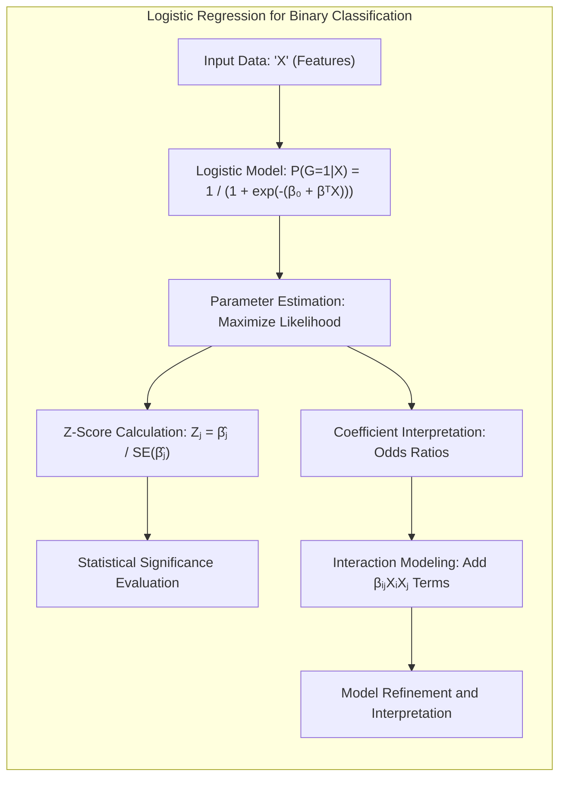
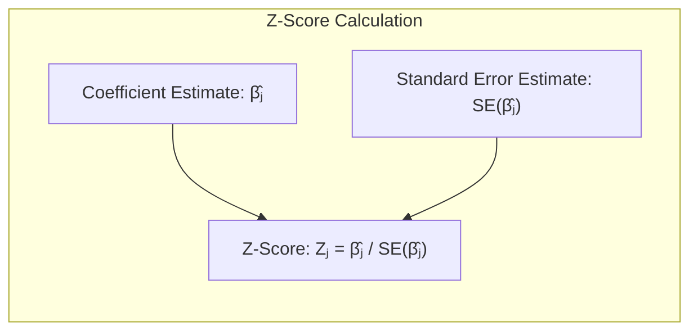
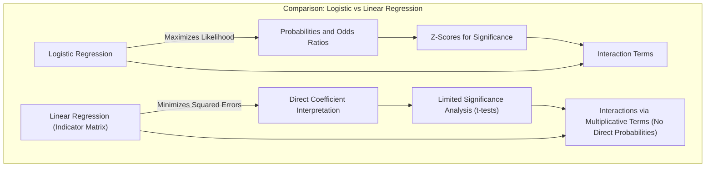
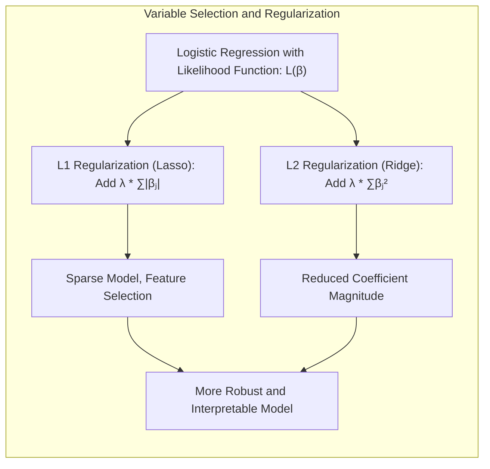
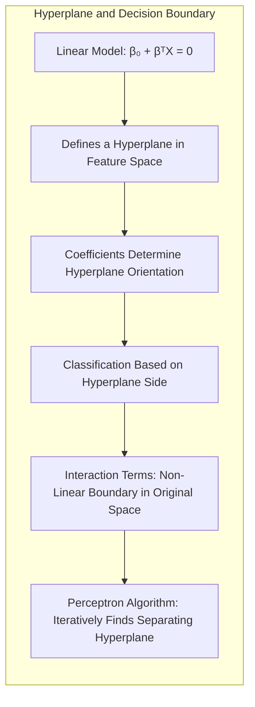
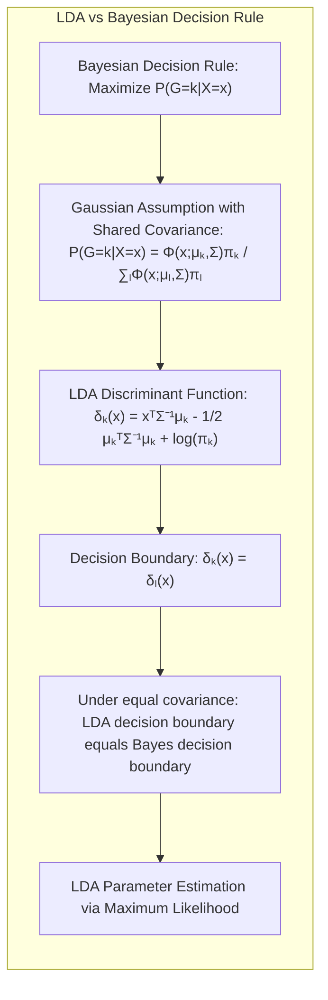

## Título Conciso: Classificação Binária e Regressão Logística: Interpretação, Significância e Interações

### Introdução

Este capítulo explora em profundidade o processo de ajuste de um modelo de **regressão logística** a dados de **classificação binária**, focando na interpretação dos coeficientes, no cálculo dos **scores Z** para avaliar a significância estatística e na análise de possíveis **interações entre as variáveis** [^4.4.2]. Analisaremos como os coeficientes do modelo logístico podem ser interpretados em termos de razões de chances (odds ratios) e como os scores Z podem ser utilizados para avaliar a significância de cada variável. Discutiremos como interações entre variáveis preditoras podem ser modeladas e como a interpretação dos modelos pode ser enriquecida através da inclusão de termos de interação. Compararemos esta abordagem com a **regressão linear com matrizes de indicadores**, que não modela as probabilidades posteriores diretamente [^4.2], e com o **Linear Discriminant Analysis (LDA)**, que se baseia em suposições gaussianas sobre as distribuições das classes [^4.3]. Abordaremos também como a **seleção de variáveis e regularização** podem ser utilizadas para auxiliar na construção de modelos de classificação mais robustos e que sejam interpretáveis [^4.4.4], [^4.5]. O conceito de **hiperplanos separadores** será abordado em relação à interpretação do modelo e à influência das variáveis na fronteira de decisão [^4.5.2]. O objetivo deste capítulo é fornecer uma compreensão clara e detalhada de como a regressão logística pode ser utilizada para a modelagem e interpretação de dados de classificação binária, com ênfase na significância estatística e na análise de interações entre as variáveis.

### Conceitos Fundamentais

**Conceito 1: Ajuste da Regressão Logística a Dados Binários**

A **regressão logística** é utilizada para modelar a probabilidade de uma observação $x$ pertencer à classe 1 em um problema de classificação binária. A probabilidade é modelada como:

$$
P(G=1|X=x) = \frac{e^{\beta_0 + \beta^T x}}{1 + e^{\beta_0 + \beta^T x}}
$$

onde $\beta_0$ é o intercepto e $\beta$ é o vetor de coeficientes das variáveis preditoras. O ajuste dos parâmetros $\beta$ é realizado através da maximização da verossimilhança condicional dos dados observados [^4.4.1].  A função logística garante que as probabilidades estimadas estejam no intervalo [0,1], e a relação entre as variáveis preditoras e a resposta é linear no log-odds.

> 💡 **Exemplo Numérico:**
>
> Suponha que estamos modelando a probabilidade de um cliente comprar um produto (G=1) com base em sua idade ($x_1$) e renda anual ($x_2$). Após ajustar um modelo de regressão logística, obtemos os seguintes coeficientes: $\beta_0 = -3$, $\beta_1 = 0.05$ (para idade) e $\beta_2 = 0.0001$ (para renda).
>
> Para um cliente com 40 anos e renda de 50.000, a probabilidade de comprar o produto seria:
>
> $\text{logit}(P(G=1|X=x)) = -3 + 0.05 \times 40 + 0.0001 \times 50000 = -3 + 2 + 5 = 4$
>
> $P(G=1|X=x) = \frac{e^{4}}{1 + e^{4}} \approx \frac{54.6}{1 + 54.6} \approx 0.982$.
>
> Isso significa que este cliente tem uma probabilidade de aproximadamente 98.2% de comprar o produto.
>
> Observe que a relação é linear no log-odds, ou seja, o logaritmo da razão de chances (odds) é uma função linear das variáveis preditoras.
>
> $\text{log-odds} = \beta_0 + \beta_1 x_1 + \beta_2 x_2$
>
>  Neste caso, o log-odds é 4.

**Lemma 1:** *A regressão logística modela a probabilidade de um evento binário (pertencer a classe 1 ou 0) por meio de uma função logística, que mapeia uma combinação linear de preditores para um valor entre 0 e 1, representando a probabilidade condicional da resposta.*  A prova desse lema reside na forma funcional da regressão logística, que é construída sobre a função logística.

**Conceito 2: Scores Z e a Avaliação da Significância Estatística**

Os **scores Z** são utilizados para avaliar a significância estatística dos coeficientes na regressão logística.  O score Z para o coeficiente $\beta_j$ é calculado como:

$$
Z_j = \frac{\hat{\beta}_j}{SE(\hat{\beta}_j)}
$$

onde $\hat{\beta}_j$ é a estimativa do coeficiente e $SE(\hat{\beta}_j)$ é o seu erro padrão estimado. O score Z segue aproximadamente uma distribuição normal padrão, e o valor absoluto de $Z_j$ pode ser comparado com um valor crítico para avaliar se o coeficiente é estatisticamente significativo [^4.4.2].  Um score Z significativo indica que a variável preditora correspondente possui um efeito estatisticamente relevante sobre o resultado.

> 💡 **Exemplo Numérico:**
>
> Usando o exemplo anterior, suponha que o erro padrão estimado para o coeficiente da idade ($\hat{\beta}_1 = 0.05$) seja $SE(\hat{\beta}_1) = 0.02$. Então, o score Z para idade seria:
>
> $Z_1 = \frac{0.05}{0.02} = 2.5$
>
> Se utilizarmos um nível de significância de 5% (valor crítico de aproximadamente 1.96 para um teste bicaudal), o score Z de 2.5 indica que o coeficiente da idade é estatisticamente significativo, pois 2.5 > 1.96. Isso sugere que a idade tem um efeito significativo na probabilidade de comprar o produto.
>
> Suponha agora que o erro padrão estimado para o coeficiente da renda ($\hat{\beta}_2 = 0.0001$) seja $SE(\hat{\beta}_2) = 0.00008$. Então, o score Z para a renda seria:
>
> $Z_2 = \frac{0.0001}{0.00008} = 1.25$
>
>  Nesse caso, o score Z de 1.25 não é estatisticamente significativo ao nível de 5% (1.25 < 1.96), indicando que a renda, com base nesses dados e modelo, não tem um efeito estatisticamente significativo na probabilidade de compra.

**Corolário 1:** *O score Z fornece uma medida da significância estatística de cada coeficiente, permitindo avaliar se a variável preditora correspondente tem um efeito relevante sobre a probabilidade da classe, e a magnitude do score indica a significância estatística, com valores altos indicando maior significância*.  Este corolário destaca a importância dos scores Z para avaliar o impacto de cada variável no modelo.

**Conceito 3: Interações entre Variáveis e Modelagem**

A inclusão de **interações entre as variáveis preditoras** em um modelo de regressão logística permite modelar efeitos que não são aditivos, ou seja, o efeito de uma variável sobre a probabilidade da resposta pode depender do valor de outra variável. A interação entre duas variáveis $x_1$ e $x_2$ pode ser modelada adicionando um termo de interação $x_1 x_2$ ao preditor linear:

$$
\text{logit}(P(G=1|X=x)) = \beta_0 + \beta_1 x_1 + \beta_2 x_2 + \beta_{12} x_1 x_2
$$

A análise das interações é fundamental para entender como as variáveis combinadas impactam a probabilidade da resposta, e para obter modelos mais precisos e mais adequados para cada problema [^4.4.2].

> 💡 **Exemplo Numérico:**
>
> Continuando com o exemplo anterior, suponha que suspeitamos que o efeito da idade na probabilidade de compra dependa da renda do cliente. Adicionamos um termo de interação $x_1 x_2$ ao modelo, resultando em:
>
> $\text{logit}(P(G=1|X=x)) = \beta_0 + \beta_1 x_1 + \beta_2 x_2 + \beta_{12} x_1 x_2$
>
> Após o ajuste, os coeficientes são: $\beta_0 = -5$, $\beta_1 = 0.1$, $\beta_2 = 0.00005$, e $\beta_{12} = 0.000002$.
>
> Para um cliente com 40 anos e renda de 50.000, o log-odds seria:
>
> $\text{logit}(P(G=1|X=x)) = -5 + 0.1 \times 40 + 0.00005 \times 50000 + 0.000002 \times 40 \times 50000 = -5 + 4 + 2.5 + 4 = 5.5$
>
> $P(G=1|X=x) = \frac{e^{5.5}}{1 + e^{5.5}} \approx 0.996$.
>
>
> Para um cliente com 60 anos e renda de 20.000, o log-odds seria:
>
> $\text{logit}(P(G=1|X=x)) = -5 + 0.1 \times 60 + 0.00005 \times 20000 + 0.000002 \times 60 \times 20000 = -5 + 6 + 1 + 2.4 = 4.4$
>
> $P(G=1|X=x) = \frac{e^{4.4}}{1 + e^{4.4}} \approx 0.988$.
>
> A interação captura que o efeito da idade é diferente para clientes com rendas diferentes. O coeficiente $\beta_{12}$ de 0.000002 indica que o efeito da idade é ligeiramente mais pronunciado para clientes com maior renda.

> ⚠️ **Nota Importante**: Os scores Z são utilizados para avaliar a significância estatística dos coeficientes, e a análise das interações entre as variáveis é importante para entender como a combinação das variáveis afeta a probabilidade das classes.

> ❗ **Ponto de Atenção**: A inclusão de interações aumenta a complexidade do modelo, e pode levar ao *overfitting* se não forem utilizados métodos de regularização e seleção de variáveis.

> ✔️ **Destaque**: A análise de significância e de interações é uma etapa fundamental para a interpretação dos resultados e para a construção de modelos de regressão logística mais completos e adequados.

### Regressão Linear e Mínimos Quadrados para Classificação

Na **regressão linear com matrizes de indicadores**, a interpretação dos coeficientes e a análise da significância estatística são diferentes da abordagem utilizada na regressão logística. A regressão linear busca ajustar modelos lineares independentes para cada classe, através da minimização da soma de quadrados dos erros, e não utiliza um conceito de verossimilhança para derivar os erros padrão e os scores Z. A regressão linear, portanto, não oferece uma forma direta de avaliar a significância estatística dos coeficientes e não tem mecanismos intrínsecos para avaliar possíveis interações entre variáveis, e a interpretação se dá apenas por meio da magnitude e sinal dos coeficientes do modelo.

A falta de um arcabouço estatístico baseado na probabilidade e na função de verossimilhança dificulta a análise e a interpretação dos resultados da regressão linear, especialmente em comparação com a regressão logística, que modela as probabilidades posteriores e utiliza os scores Z para avaliar a significância dos coeficientes [^4.2], [^4.4.2]. Além disso, as interações entre variáveis podem ser modeladas adicionando termos multiplicativos na regressão linear, mas a sua análise se torna mais difícil sem o arcabouço da função logística.

> 💡 **Exemplo Numérico:**
>
> Para o mesmo problema de classificação binária, podemos usar regressão linear com matrizes de indicadores, criando uma variável indicadora para a classe 1 (e.g., y = 1 se o cliente compra, 0 caso contrário). Ajustamos um modelo linear:
>
> $y = \beta_0 + \beta_1 x_1 + \beta_2 x_2 + \epsilon$
>
> Suponha que os coeficientes ajustados sejam $\beta_0 = -0.2$, $\beta_1 = 0.005$ e $\beta_2 = 0.00001$.
>
> Para um cliente com 40 anos e renda 50.000, a previsão seria:
>
> $y = -0.2 + 0.005 \times 40 + 0.00001 \times 50000 = -0.2 + 0.2 + 0.5 = 0.5$
>
> O resultado 0.5 não representa diretamente uma probabilidade, e a interpretação é diferente da regressão logística. A significância dos coeficientes é avaliada através de testes t, e não scores Z.
>
> Para modelar interações, adicionaríamos um termo $x_1 x_2$:
>
> $y = \beta_0 + \beta_1 x_1 + \beta_2 x_2 + \beta_{12} x_1 x_2 + \epsilon$
>
> A análise dos coeficientes, neste modelo, se torna complexa, e a interpretação não é tão direta quanto na regressão logística, uma vez que não existe uma função que mapeie a combinação linear dos preditores para uma probabilidade.

**Lemma 2:** *A regressão linear com matrizes de indicadores, ao contrário da regressão logística, não oferece uma forma direta de calcular os scores Z para avaliar a significância estatística dos coeficientes e não modela as interações entre variáveis explicitamente.* Este lema destaca a principal diferença entre as duas abordagens no que se refere à análise dos resultados e à estimação de parâmetros.

**Corolário 2:** *A falta de mecanismos para avaliar a significância estatística e modelar as interações torna a regressão linear com matrizes de indicadores menos adequada para problemas onde a interpretação dos coeficientes e a análise das interações são fundamentais.*  Essa limitação da regressão linear é uma consequência da forma de modelagem e da derivação do modelo.

A regressão linear com matrizes de indicadores, portanto, embora seja uma abordagem simples e computacionalmente eficiente, apresenta limitações em comparação com a regressão logística, particularmente na análise da significância estatística dos coeficientes e no tratamento de interações entre variáveis, o que a torna menos adequada em situações onde se deseja uma análise mais aprofundada e interpretável dos resultados e dos parâmetros do modelo [^4.2], [^4.4.2].

### Métodos de Seleção de Variáveis e Regularização em Classificação

A **seleção de variáveis** e a **regularização** desempenham um papel fundamental na construção de modelos de classificação mais robustos e interpretáveis, mesmo quando o objetivo é analisar a significância dos coeficientes e as possíveis interações entre as variáveis [^4.5]. A regularização, ao adicionar termos de penalidade à função de verossimilhança, controla a magnitude dos coeficientes e evita o *overfitting*, o que também impacta na avaliação da significância dos coeficientes através dos scores Z.

Na **regressão logística**, a função de log-verossimilhança regularizada é expressa como:

$$
\ell(\beta) = \sum_{i=1}^N \log P(G=g_i|X=x_i; \beta) - \lambda P(\beta)
$$

onde $P(\beta)$ é a penalidade e $\lambda$ é o parâmetro de regularização. A penalidade **L1** (Lasso) é dada por $P(\beta) = \sum_{j=1}^p |\beta_j|$, que promove a esparsidade dos coeficientes, selecionando as variáveis mais relevantes e que contribuem mais para a função de verossimilhança e consequentemente para o modelo [^4.4.4]. A penalidade **L2** (Ridge) é dada por $P(\beta) = \sum_{j=1}^p \beta_j^2$, que reduz a magnitude dos coeficientes e estabiliza o modelo, tornando a estimação das probabilidades e a avaliação da significância estatística mais robustas [^4.5].

A aplicação da regularização também pode simplificar a interpretação das interações entre as variáveis, pois os modelos resultantes da aplicação dessas técnicas tendem a ser mais simples e focados nas variáveis que são mais relevantes para a resposta.

> 💡 **Exemplo Numérico:**
>
> Suponha que, para o nosso problema de compra de produto, temos muitas variáveis preditoras, incluindo idade ($x_1$), renda ($x_2$), nível de escolaridade ($x_3$), tempo no emprego ($x_4$), etc. Após ajustar uma regressão logística sem regularização, alguns coeficientes podem ser grandes, e alguns podem ter erros padrão grandes, dificultando a interpretação.
>
> Aplicamos regularização L1 (Lasso) com um parâmetro $\lambda = 0.1$. Isso pode levar a um modelo onde os coeficientes de algumas variáveis, como nível de escolaridade ($x_3$) e tempo no emprego ($x_4$), são exatamente zero. O modelo resultante seria mais simples e focado nas variáveis mais importantes.
>
> Se aplicarmos regularização L2 (Ridge) com um parâmetro $\lambda = 0.1$, os coeficientes de todas as variáveis são reduzidos, mas não necessariamente a zero. Isso reduz a variância dos coeficientes e torna o modelo mais estável e a avaliação da significância mais robusta.
>
> **Comparação:**
>
> | Método          | $\beta_1$ (idade) | $\beta_2$ (renda) | $\beta_3$ (escolaridade) | $\beta_4$ (tempo emprego) |
> |-----------------|--------------------|--------------------|-------------------------|--------------------------|
> | OLS (sem reg.)  | 0.08              | 0.00015            | -0.02                   | 0.01                     |
> | Lasso ($\lambda=0.1$)  | 0.05              | 0.0001             | 0                       | 0                        |
> | Ridge ($\lambda=0.1$) | 0.06              | 0.00012            | -0.015                  | 0.008                    |
>
> A tabela mostra como a regularização L1 (Lasso) zerou os coeficientes de escolaridade e tempo de emprego, realizando seleção de variáveis, enquanto a regularização L2 (Ridge) reduziu a magnitude de todos os coeficientes.

**Lemma 3:** *A regularização L1, ao promover a esparsidade dos coeficientes, simplifica a estrutura do modelo e facilita a análise da significância estatística através dos scores Z, e melhora a interpretação das interações entre as variáveis.*  A prova desse lema está na forma como a penalidade L1 afeta o valor dos coeficientes e reduz a complexidade do modelo.

**Prova do Lemma 3:**  A penalidade L1 adiciona um termo à função de custo que é proporcional ao valor absoluto dos coeficientes, e, na minimização do custo, faz com que alguns coeficientes se tornem exatamente zero.  A esparsidade resultante leva a modelos mais simples, que facilitam a interpretação e a análise da significância [^4.4.3], [^4.4.4]. $\blacksquare$

**Corolário 3:** *A seleção de variáveis e a regularização, ao controlar a complexidade do modelo e selecionar as variáveis mais relevantes, melhoram a capacidade de analisar a significância estatística dos coeficientes, de entender as interações entre as variáveis, e de criar modelos mais robustos e com maior capacidade de generalização para novos dados.*  A regularização torna o modelo mais estável e mais fácil de interpretar.

> ⚠️ **Ponto Crucial**: A seleção de variáveis e a regularização são ferramentas fundamentais para complementar a análise de significância estatística e interações em modelos lineares de classificação, e levam a modelos mais robustos e com melhor capacidade de generalização [^4.5].

### Separating Hyperplanes e Perceptrons

A busca por **hiperplanos separadores** visa encontrar uma fronteira linear que separe as classes da melhor forma possível, e essa busca se relaciona com a interpretação dos coeficientes nos modelos de classificação linear. A orientação do hiperplano é determinada pelos coeficientes do modelo, que por sua vez, podem ser interpretados em termos de razões de chances e de significância estatística, se o modelo for ajustado através da função de verossimilhança [^4.5.2].

O algoritmo do **Perceptron** busca um hiperplano separador ajustando os parâmetros do modelo de forma iterativa. A interpretação dos coeficientes no Perceptron é mais limitada, mas ela se conecta com a ideia de buscar uma separação linear entre as classes, o que pode ser visto como um objetivo similar ao da modelagem das probabilidades posteriores na regressão logística, mesmo que através de uma abordagem distinta [^4.5.1].  No entanto, a informação sobre a significância estatística, e a modelagem de interações, são mais difíceis de serem obtidas através do Perceptron.

> 💡 **Exemplo Numérico:**
>
> No contexto do nosso exemplo, o hiperplano separador seria uma linha que separa os clientes que compraram o produto (classe 1) dos que não compraram (classe 0) no espaço definido por idade e renda. Em um modelo simples sem interação, a equação do hiperplano seria:
>
> $\beta_0 + \beta_1 x_1 + \beta_2 x_2 = 0$
>
> Usando os coeficientes do exemplo anterior (sem regularização), o hiperplano seria:
>
> $-3 + 0.05 x_1 + 0.0001 x_2 = 0$
>
>  Clientes que satisfazem $0.05 x_1 + 0.0001 x_2 > 3$ seriam classificados como compradores.
>
> Se incluirmos a interação, a equação do hiperplano se torna:
>
> $-5 + 0.1 x_1 + 0.00005 x_2 + 0.000002 x_1 x_2 = 0$
>
>  A presença do termo de interação muda a forma do hiperplano, tornando-o não linear no espaço das variáveis originais. O Perceptron iterativamente ajustaria os parâmetros para tentar encontrar um hiperplano que separe as classes, mas não fornece diretamente as probabilidades posteriores ou a análise da significância estatística como a regressão logística.

**Teorema:** *A busca por um hiperplano separador, através de algoritmos como o Perceptron, se relaciona com a estimação dos coeficientes no modelo de regressão logística, e ambos os métodos buscam soluções para a classificação de dados através de funções lineares*. A interpretação dos coeficientes em termos de razão de chances e significância estatística, é feita através da regressão logística, e não através de algoritmos como o Perceptron [^4.5.1].

### Pergunta Teórica Avançada: Quais as diferenças fundamentais entre a formulação de LDA e a Regra de Decisão Bayesiana considerando distribuições Gaussianas com covariâncias iguais?

**Resposta:**

A **Regra de Decisão Bayesiana** busca classificar uma observação $x$ na classe $k$ que maximize a probabilidade posterior $P(G=k|X=x)$ [^4.3]. Sob a suposição de que as classes seguem distribuições Gaussianas com a mesma matriz de covariância $\Sigma$, a probabilidade posterior é dada por:

$$
P(G=k|X=x) = \frac{ \phi(x;\mu_k,\Sigma)\pi_k}{\sum_{l=1}^K \phi(x;\mu_l,\Sigma)\pi_l}
$$

onde $\phi(x;\mu_k,\Sigma)$ é a densidade gaussiana da classe $k$, $\mu_k$ é a média da classe $k$ e $\pi_k$ é a probabilidade a priori da classe. O **LDA**, por sua vez, deriva suas funções discriminantes lineares diretamente dessas suposições, e as funções discriminantes são uma forma de buscar a separação ótima entre as classes, através de informações sobre as médias e a covariância compartilhada, mas a estimação dos parâmetros no LDA não se baseia na maximização da verossimilhança condicional [^4.3].

> 💡 **Exemplo Numérico:**
>
> Suponha que temos dados de duas classes com distribuições gaussianas. A classe 1 tem média $\mu_1 = [1, 1]$ e a classe 2 tem média $\mu_2 = [3, 3]$. Ambas as classes têm a mesma matriz de covariância $\Sigma = [[1, 0], [0, 1]]$.
>
> A regra de decisão Bayesiana classificaria um ponto $x$ na classe que maximiza $P(G=k|X=x)$. Para um ponto $x = [2, 2]$, a probabilidade posterior é calculada usando as densidades gaussianas e as probabilidades a priori das classes.
>
> O LDA, sob as mesmas premissas, derivaria uma função discriminante linear da forma:
>
> $\delta_k(x) = x^T \Sigma^{-1} \mu_k - \frac{1}{2} \mu_k^T \Sigma^{-1} \mu_k + \log \pi_k$
>
> A fronteira de decisão do LDA seria a linha onde $\delta_1(x) = \delta_2(x)$. No caso de covariâncias iguais, a fronteira de decisão do LDA e da regra de decisão Bayesiana seriam as mesmas.
>
> Se as probabilidades a priori das classes fossem iguais, a fronteira de decisão seria a mediatriz entre as médias, ou seja, a linha que passa pelo ponto [2,2] e tem inclinação -1, perpendicular à linha que une as médias [1,1] e [3,3].
>
> No entanto, o LDA estima os parâmetros (médias e covariância) usando estimativas de máxima verossimilhança, enquanto a regra de decisão bayesiana usa as densidades diretamente.

**Lemma 4:** *Sob a suposição de distribuições Gaussianas com a mesma matriz de covariância, a regra de decisão Bayesiana e as funções discriminantes do LDA levam à mesma fronteira de decisão, e a interpretação dos coeficientes é feita de forma distinta nos dois modelos.*  A equivalência das fronteiras de decisão é obtida mostrando que o log-ratio da probabilidade posterior e a função discriminante do LDA são equivalentes. [^4.3]

**Corolário 4:** *A remoção da restrição de igualdade de covariâncias na regra de decisão Bayesiana leva ao QDA, onde a fronteira de decisão não é mais linear e a estimação dos parâmetros não se baseia em estimativas da covariância compartilhada, como no LDA.*  O QDA é um método mais geral para modelar a probabilidade das classes, e que se beneficia de matrizes de covariâncias distintas [^4.3.1], [^4.3.3].

> ⚠️ **Ponto Crucial**: A principal diferença entre LDA e a regra de decisão Bayesiana é que LDA impõe a restrição de igualdade de covariância para obter uma função discriminante linear, o que não é feito na regra Bayesiana, que é um modelo mais geral e flexível. Sob a premissa de gaussianidade e covariâncias iguais, ambos os modelos são equivalentes em termos de fronteiras de decisão. [^4.3]

### Conclusão

Neste capítulo, exploramos a fundo o processo de ajuste de um modelo de regressão logística a dados de classificação binária, com ênfase na interpretação dos coeficientes, no cálculo dos scores Z para avaliar a significância estatística e na análise de possíveis interações entre as variáveis. Analisamos como os coeficientes da regressão logística são interpretados como razões de chances e como os scores Z podem ser utilizados para avaliar a significância estatística. Vimos que a modelagem de interações entre variáveis é fundamental para a construção de modelos mais precisos e como a escolha da regularização impacta a forma dos coeficientes e sua interpretação. A comparação entre a regressão logística com a regressão linear com matrizes de indicadores e a relação com o conceito de hiperplanos separadores, ressaltou a necessidade de se escolher um modelo que seja adequado para o problema a ser resolvido. Através deste capítulo, procuramos fornecer uma visão detalhada de como a regressão logística pode ser utilizada para a modelagem e interpretação de dados de classificação binária, com ênfase na avaliação da significância estatística e nas interações entre as variáveis.

### Footnotes

[^4.1]: *In this chapter we revisit the classification problem and focus on linear methods for classification...There are several different ways in which linear decision boundaries can be found.* *(Trecho de Linear Methods for Classification)*

[^4.2]: *In Chapter 2 we fit linear regression models to the class indicator variables, and classify to the largest fit...Linear inequalities in this space are quadratic inequalities in the original space.* *(Trecho de Linear Methods for Classification)*

[^4.3]: *Decision theory for classification (Section 2.4) tells us that we need to know the class posteriors Pr(G|X) for optimal classification. Suppose fk(x) is the class-conditional density of X in class G = k, and let πκ be the prior probability of class k... Linear discriminant analysis (LDA) arises in the special case when we assume that the classes have a common covariance matrix Σk = Σ.* *(Trecho de Linear Methods for Classification)*

[^4.3.1]: *The decision boundary between each pair of classes k and l is described by a quadratic equation {x: δκ(x) = δ(x)}.* *(Trecho de Linear Methods for Classification)*

[^4.3.3]: *In the special case when we assume that the classes have a common covariance matrix...When the classes are really Gaussian, then LDA is optimal* *(Trecho de Linear Methods for Classification)*

[^4.4]: *The logistic regression model arises from the desire to model the posterior probabilities of the K classes via linear functions in x, while at the same time ensuring that they sum to one and remain in [0,1].* *(Trecho de Linear Methods for Classification)*

[^4.4.1]: *Logistic regression models are usually fit by maximum likelihood... The logistic regression model is more general, in that it makes less assumptions.* *(Trecho de Linear Methods for Classification)*

[^4.4.2]: *It is convenient to code the two-class gi via a 0/1 response Yi, where yi = 1 when gi = 1, and yi = 0 when gi = 2... Typically many models are fit in a search for a parsimonious model involving a subset of the variables.* *(Trecho de Linear Methods for Classification)*

[^4.4.3]: *To maximize the log-likelihood, we set its derivatives to zero. These score equations are...To solve the score equations (4.21), we use the Newton-Raphson algorithm...* *(Trecho de Linear Methods for Classification)*

[^4.4.4]: *The L1 penalty used in the lasso (Section 3.4.2) can be used for variable selection and shrinkage with any linear regression model...As with the lasso, we typically do not penal