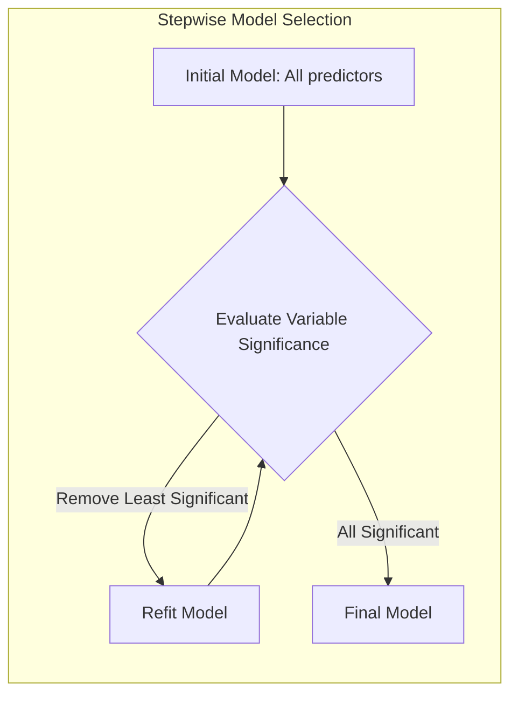
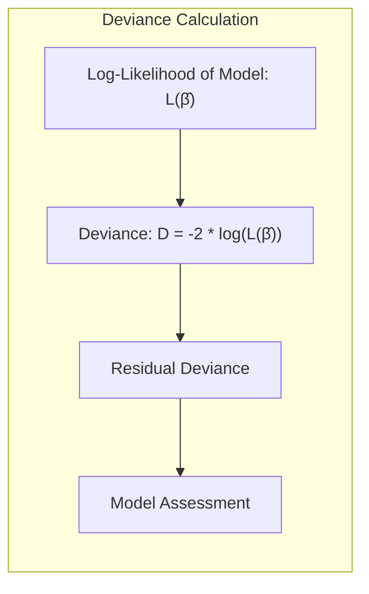
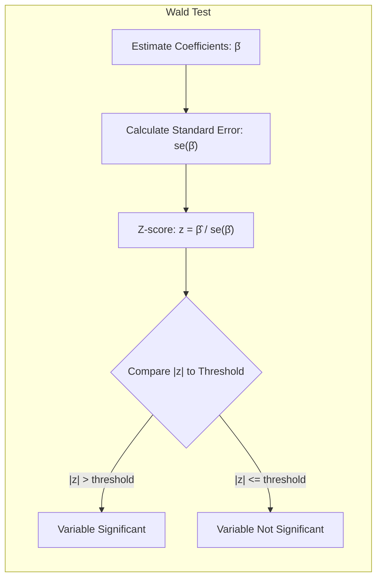
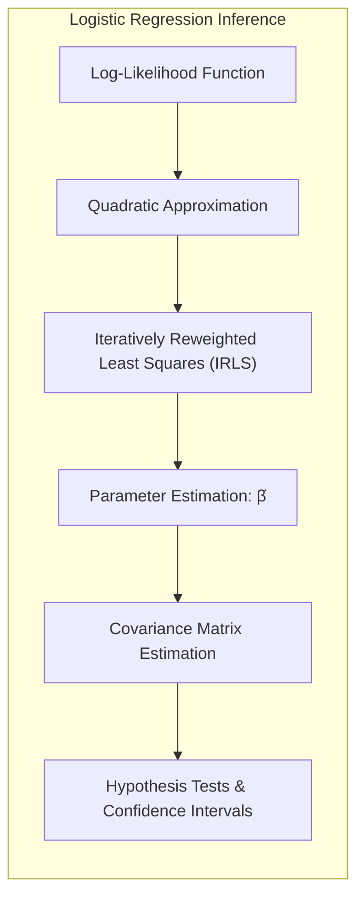
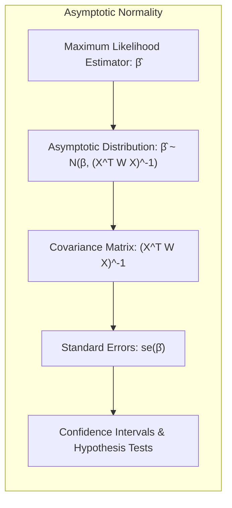
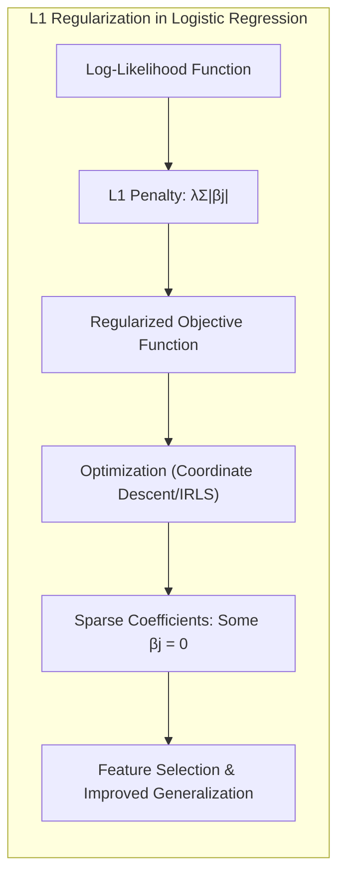
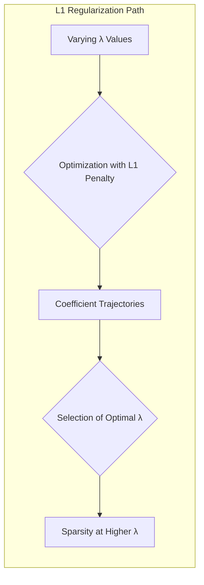
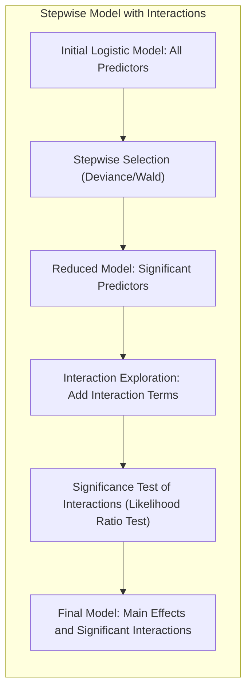
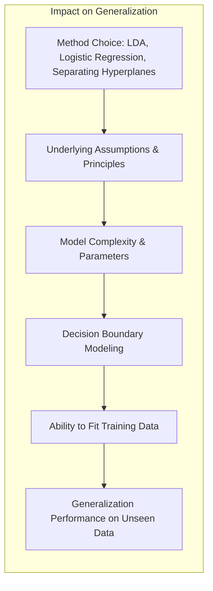

### Seleção de Modelos via Regressão Stepwise e Deviance Residual



A **seleção de modelos** é uma etapa crucial na análise estatística e em aprendizado de máquina, com o objetivo de identificar um subconjunto de variáveis preditoras que são mais informativas e que levam a um modelo mais parcimonioso e com boa capacidade de generalização. Métodos **stepwise**, como o *backward elimination*, oferecem abordagens sistemáticas para selecionar um conjunto de variáveis mais adequado [^4.4.2].

O *backward elimination* inicia com um modelo contendo todas as variáveis preditoras e, iterativamente, remove as variáveis menos significativas com base em algum critério, como o teste de razão de verossimilhança ou o teste Wald [^4.4.2]. Cada iteração envolve a remoção da variável com menor significância e o refit do modelo com o subconjunto restante de variáveis. O processo continua até que nenhum termo possa ser removido sem aumentar significativamente o erro do modelo, avaliado por um critério estatístico [^4.4.2].

> 💡 **Exemplo Numérico:**
>
> Vamos supor que temos um conjunto de dados com uma variável resposta binária (y) e quatro variáveis preditoras (X1, X2, X3, X4). Inicialmente, ajustamos um modelo logístico com todas as variáveis.
>
> ```python
> import numpy as np
> import statsmodels.api as sm
>
> # Dados de exemplo
> y = np.array([0, 1, 0, 1, 0, 1, 0, 1, 0, 1])
> X = np.array([[1, 2, 3, 4],
>               [2, 3, 4, 5],
>               [3, 4, 5, 6],
>               [4, 5, 6, 7],
>               [5, 6, 7, 8],
>               [6, 7, 8, 9],
>               [7, 8, 9, 10],
>               [8, 9, 10, 11],
>               [9, 10, 11, 12],
>               [10, 11, 12, 13]])
>
> X = sm.add_constant(X) # Adiciona a constante para o intercepto
>
> # Ajusta o modelo logístico inicial
> model = sm.Logit(y, X)
> result = model.fit()
> print(result.summary())
> ```
>
> Após o ajuste, suponha que os p-valores dos testes de Wald para os coeficientes são:
>
> *   X1: 0.02
> *   X2: 0.05
> *   X3: 0.15
> *   X4: 0.30
>
> Usando um nível de significância de 0.05, a variável X4 é a menos significativa. No primeiro passo do *backward elimination*, removemos X4 e reajustamos o modelo.
>
> ```python
> # Remove a variável X4 e reajusta o modelo
> X_reduced = X[:, [0, 1, 2, 3]] # Mantém as colunas 0 (constante), 1, 2 e 3
> model_reduced = sm.Logit(y, X_reduced)
> result_reduced = model_reduced.fit()
> print(result_reduced.summary())
> ```
>
> Agora, suponha que os p-valores para o modelo reduzido são:
> *   X1: 0.01
> *   X2: 0.04
> *   X3: 0.08
>
> A variável X3 é a menos significativa agora. Removemos X3 e reajustamos o modelo. Este processo continua até que todas as variáveis remanescentes sejam significativas.



O critério para avaliar a significância de uma variável e decidir pela remoção pode ser baseado na **deviance residual** [^4.4.2]. A deviance é uma medida de quão bem um modelo se ajusta aos dados, sendo definida como menos duas vezes o log-likelihood do modelo. Para modelos de regressão logística, a deviance é dada por [^4.4.3]:

$$
    D = -2 \sum_{i=1}^N [y_i \log(\hat{p}_i) + (1-y_i) \log(1 - \hat{p}_i)]
$$

onde $\hat{p}_i$ são as probabilidades ajustadas pelo modelo. A diferença na deviance entre dois modelos aninhados (um com mais variáveis que o outro) segue aproximadamente uma distribuição qui-quadrado sob a hipótese nula de que o modelo mais simples é verdadeiro. Assim, podemos utilizar um teste de razão de verossimilhança para determinar se a remoção de uma variável causa um aumento significativo na deviance. Ou seja, se a diferença de deviance entre um modelo com e sem a variável a ser testada for estatisticamente significativa, rejeita-se a hipótese nula de que a variável pode ser removida sem perda de informação [^4.4.2].

> 💡 **Exemplo Numérico:**
>
> Continuando o exemplo anterior, vamos calcular a deviance para os modelos com e sem a variável X4.
>
> ```python
> # Calcula a deviance para o modelo completo
> deviance_full = -2 * result.llf
> print(f"Deviance do modelo completo: {deviance_full:.2f}")
>
> # Calcula a deviance para o modelo reduzido
> deviance_reduced = -2 * result_reduced.llf
> print(f"Deviance do modelo reduzido: {deviance_reduced:.2f}")
>
> # Calcula a diferença de deviance
> deviance_diff = deviance_reduced - deviance_full
> print(f"Diferença na deviance: {deviance_diff:.2f}")
>
> # Calcula o p-valor do teste de razão de verossimilhança
> from scipy.stats import chi2
> df_diff = 1 # Diferença nos graus de liberdade (número de parâmetros removidos)
> p_value = 1 - chi2.cdf(deviance_diff, df_diff)
> print(f"P-valor do teste de razão de verossimilhança: {p_value:.3f}")
> ```
>
> Se a diferença na deviance for grande e o p-valor for menor que 0.05, rejeitamos a hipótese nula de que a variável X4 pode ser removida. Caso contrário, removemos a variável e continuamos o processo.



Alternativamente, pode-se usar o **teste de Wald**, que avalia a significância de um coeficiente em um modelo. O teste de Wald se baseia na estatística z (coeficiente dividido pelo seu erro padrão). Se o valor absoluto do z-score é maior que aproximadamente 2, a variável é considerada significativa no nível de 5%.

A deviance residual de um modelo é dada por $D = -2 \log \mathcal{L}(\hat{\beta})$, onde $\mathcal{L}(\hat{\beta})$ é a verossimilhança do modelo ajustado. Modelos mais simples tendem a ter deviances maiores, e modelos mais complexos tendem a ter deviances menores, a diferença de deviance entre dois modelos é dada por $D_1 - D_2$. O processo de seleção por stepwise, em resumo, busca identificar um modelo que minimize a deviance, mas também evita o overfiting através da remoção de variáveis não significativas [^4.4.2].

**Lemma 5:** *A diferença na deviance entre dois modelos aninhados é assintoticamente distribuída como uma qui-quadrado com graus de liberdade iguais à diferença no número de parâmetros entre os modelos*.

*Prova:* Este resultado é uma consequência da teoria assintótica da máxima verossimilhança. Sob certas condições de regularidade, a diferença na deviance tem uma distribuição qui-quadrado assintótica. [^4.4.3] $\blacksquare$

**Corolário 5:** *O processo stepwise de remoção de variáveis menos significativas, usando a deviance residual, tende a encontrar um modelo mais parcimonioso que equilibra o ajuste aos dados e a complexidade do modelo.*

*Prova:* A remoção iterativa de variáveis não significativas reduz o número de parâmetros do modelo, levando a um modelo mais simples e com melhor capacidade de generalização. [^4.4.2] $\blacksquare$

O uso da deviance e do teste de razão de verossimilhança oferece um critério formal para a seleção de modelos em regressão logística e outros modelos lineares generalizados. Ao remover as variáveis menos significativas de forma iterativa, podemos obter um modelo mais interpretável e com melhor capacidade de generalização.

### Inferência em Modelos Logísticos e Aproximações Quadráticas



A inferência em modelos logísticos é geralmente baseada em resultados assintóticos da teoria da máxima verossimilhança. O estimador de máxima verossimilhança $\hat{\beta}$ possui propriedades assintóticas que permitem a construção de intervalos de confiança e a realização de testes de hipótese. Uma forma de obter esses resultados é através de **aproximações quadráticas** da função de log-verossimilhança [^4.4.3].

Conforme discutido em [^4.4.3], as estimativas de máxima verossimilhança são as soluções de um problema de mínimos quadrados iterativamente ponderado (IRLS). Este processo iterativo envolve o ajuste de um modelo de regressão linear ponderado, onde as respostas são dadas por:

$$
    z_i = x_i^T\hat{\beta} + \frac{y_i - \hat{p}_i}{\hat{p}_i(1-\hat{p}_i)}
$$

e os pesos são dados por $w_i = \hat{p}_i(1-\hat{p}_i)$.  Esta formulação permite obter as estimativas dos coeficientes $\beta$ e também fornecer uma matriz de covariância dos coeficientes estimada.

> 💡 **Exemplo Numérico:**
>
> Vamos considerar um exemplo com 5 observações e 2 preditores (além do intercepto). As respostas observadas são $y = [0, 1, 0, 1, 0]$ e as matriz de preditores $X$ (incluindo o intercepto) e os coeficientes estimados $\hat{\beta}$ são:
>
> ```python
> import numpy as np
> import statsmodels.api as sm
>
> y = np.array([0, 1, 0, 1, 0])
> X = np.array([[1, 2],
>               [2, 3],
>               [3, 4],
>               [4, 5],
>               [5, 6]])
> X = sm.add_constant(X)
>
> model = sm.Logit(y, X)
> result = model.fit()
> beta_hat = result.params
> print("Coeficientes estimados:", beta_hat)
>
> # Calcula as probabilidades preditas
> p_hat = model.predict(result.params, exog=X)
> print("Probabilidades preditas:", p_hat)
>
> # Calcula a resposta z_i e pesos w_i
> z = X @ beta_hat + (y - p_hat) / (p_hat * (1 - p_hat))
> w = p_hat * (1 - p_hat)
> print("Respostas z_i:", z)
> print("Pesos w_i:", w)
> ```
>
> O processo IRLS itera sobre estes passos. Na primeira iteração, usa-se um valor inicial para $\hat{\beta}$. Em cada iteração, os valores de $z_i$ e $w_i$ são recalculados com base em $\hat{\beta}$ da iteração anterior.



As aproximações quadráticas também permitem a obtenção de resultados inferenciais utilizando a teoria normal assintótica. Em particular, sob certas condições de regularidade, o estimador $\hat{\beta}$ segue uma distribuição normal assintoticamente:

$$
\hat{\beta} \sim N(\beta, (X^T W X)^{-1})
$$

onde $W$ é a matriz diagonal de pesos $w_i$ [^4.4.3].

Com base nessa distribuição assintótica, podemos calcular intervalos de confiança para os coeficientes e realizar testes de hipótese, como o teste de Wald [^4.4.3]. O teste de Wald utiliza a estatística z, dada por $z_j = \hat{\beta}_j / se(\hat{\beta}_j)$, onde $se(\hat{\beta}_j)$ é o erro padrão do coeficiente $\hat{\beta}_j$. Se o valor absoluto do z-score é maior que um valor crítico (por exemplo, 1.96 para um nível de significância de 5%), rejeitamos a hipótese nula de que o coeficiente é igual a zero [^4.4.3].

> 💡 **Exemplo Numérico:**
>
> Usando os resultados do exemplo anterior, podemos calcular os erros padrão e os intervalos de confiança para os coeficientes:
>
> ```python
> # Calcula a matriz de covariância
> cov_matrix = result.cov_params()
> print("Matriz de covariância:", cov_matrix)
>
> # Calcula os erros padrão dos coeficientes
> se_beta = np.sqrt(np.diag(cov_matrix))
> print("Erros padrão dos coeficientes:", se_beta)
>
> # Calcula os z-scores
> z_scores = beta_hat / se_beta
> print("Z-scores:", z_scores)
>
> # Calcula os intervalos de confiança de 95%
> alpha = 0.05
> from scipy.stats import norm
> ci_lower = beta_hat - norm.ppf(1 - alpha/2) * se_beta
> ci_upper = beta_hat + norm.ppf(1 - alpha/2) * se_beta
> print("Intervalos de confiança:", list(zip(ci_lower, ci_upper)))
> ```
> Os intervalos de confiança indicam a precisão com que estimamos os coeficientes. Se o intervalo de confiança não inclui zero, o coeficiente é considerado estatisticamente significativo.

Além disso, o **resíduo ponderado** do ajuste é dado por:

$$
    r_i = \frac{y_i - \hat{p}_i}{\sqrt{\hat{p}_i(1 - \hat{p}_i)}}
$$

A soma dos quadrados dos resíduos ponderados é a estatística de qui-quadrado de Pearson, uma aproximação quadrática da deviance que pode ser usada para avaliar a qualidade do ajuste do modelo.

**Lemma 6:** *A matriz de covariância dos estimadores de máxima verossimilhança é assintoticamente igual ao inverso da matriz Hessiana da função de log-verossimilhança avaliada no estimador de máxima verossimilhança.*

*Prova:* Este resultado é uma consequência da teoria da máxima verossimilhança e do teorema de informação de Fisher, conforme discutido em [^4.4.3]. $\blacksquare$

**Corolário 6:** *O método de mínimos quadrados ponderados iterativamente (IRLS) utilizado para ajustar modelos logísticos fornece tanto as estimativas dos parâmetros quanto a matriz de covariância desses parâmetros, permitindo inferências estatísticas.*

*Prova:* Através da expansão de Taylor de segunda ordem da função de verossimilhança, o método IRLS gera os coeficientes e a matriz de covariância dos mesmos. [^4.4.3] $\blacksquare$

As aproximações quadráticas e a teoria assintótica são ferramentas poderosas para a realização de inferência em modelos logísticos. Elas permitem a construção de intervalos de confiança, testes de hipóteses e avaliações da qualidade do ajuste do modelo.

### Regularização L1 em Regressão Logística e Implicações



A regularização é um método essencial para lidar com overfitting e melhorar a generalização de modelos, particularmente em casos onde o número de preditores é grande ou quando há multicolinearidade. A **penalização L1** ou *Lasso* é uma abordagem de regularização que adiciona um termo proporcional à soma dos valores absolutos dos coeficientes na função de custo do modelo [^4.4.4]:

$$
    \max_{\beta_0, \beta} \sum_{i=1}^N \left[y_i(\beta_0 + \beta^T x_i) - \log(1 + e^{\beta_0 + \beta^T x_i})\right] - \lambda \sum_{j=1}^p |\beta_j|
$$

onde $\lambda$ é o parâmetro de regularização. A penalização L1 tem a propriedade de induzir esparsidade nos coeficientes, isto é, alguns coeficientes são forçados a exatamente zero. Isso resulta não apenas em um modelo mais simples e interpretável, mas também realiza seleção de variáveis, eliminando aquelas consideradas menos importantes [^4.4.4].

> 💡 **Exemplo Numérico:**
>
> Vamos demonstrar a penalização L1 com um exemplo. Suponha que temos um modelo logístico com 3 preditores e que, sem regularização, os coeficientes estimados são $\hat{\beta} = [0.8, -1.2, 0.5]$. Aplicando a penalidade L1 com um valor de $\lambda = 0.5$, a função objetivo torna-se:
>
> $$
>   \text{Objetivo} = \text{Verossimilhança} - 0.5 \times (|0.8| + |-1.2| + |0.5|)
> $$
>
> A penalidade L1 tenta reduzir o valor absoluto dos coeficientes, e em alguns casos, pode forçá-los a zero. Para valores maiores de $\lambda$, a penalidade tem um efeito maior na redução dos coeficientes.
>
> ```python
> import numpy as np
> from sklearn.linear_model import LogisticRegression
> from sklearn.preprocessing import StandardScaler
>
> # Dados de exemplo com 10 observações e 3 preditores
> X = np.array([[1, 2, 3],
>               [2, 3, 4],
>               [3, 4, 5],
>               [4, 5, 6],
>               [5, 6, 7],
>               [6, 7, 8],
>               [7, 8, 9],
>               [8, 9, 10],
>               [9, 10, 11],
>               [10, 11, 12]])
> y = np.array([0, 1, 0, 1, 0, 1, 0, 1, 0, 1])
>
> # Padroniza os preditores
> scaler = StandardScaler()
> X_scaled = scaler.fit_transform(X)
>
> # Aplica regressão logística com penalidade L1 (Lasso)
> lambda_values = [0.1, 0.5, 1] # Diferentes valores de lambda
>
> for lambda_value in lambda_values:
>     model_lasso = LogisticRegression(penalty='l1', C=1/(2*lambda_value), solver='liblinear', random_state=42)
>     model_lasso.fit(X_scaled, y)
>     print(f"Lambda = {lambda_value}: Coeficientes = {model_lasso.coef_}")
> ```
>
> Observe como os coeficientes se aproximam de zero à medida que aumentamos o valor de $\lambda$.



O processo de otimização com a penalidade L1 não é diferenciável no ponto zero. Para obter uma solução, são utilizadas abordagens como o método de gradiente descendente projetado e o método de *coordinate descent*, ou o algoritmo iterativo de mínimos quadrados ponderados (IRLS) com algumas modificações [^4.4.4]. O método IRLS, quando combinado com a penalidade L1, pode ser adaptado para encontrar soluções para o problema de otimização com penalidades [^4.4.4].

O parâmetro de regularização $\lambda$ controla o nível de esparsidade e *shrinkage* nos coeficientes. Valores maiores de $\lambda$ resultam em modelos mais esparsos, com um menor número de variáveis preditoras. A escolha de $\lambda$ pode ser feita por validação cruzada ou outros métodos de seleção de modelos [^4.4.5].

> 💡 **Exemplo Numérico:**
>
> Para ilustrar a escolha de $\lambda$ por validação cruzada, podemos usar o `LogisticRegressionCV` do scikit-learn:
>
> ```python
> from sklearn.linear_model import LogisticRegressionCV
>
> # Aplica regressão logística com validação cruzada para escolher o melhor lambda
> model_cv = LogisticRegressionCV(penalty='l1', solver='liblinear', cv=5, random_state=42, Cs=10)
> model_cv.fit(X_scaled, y)
>
> best_lambda = 1/(2*model_cv.C_[0])
> print(f"Melhor Lambda (via validação cruzada): {best_lambda:.3f}")
> print(f"Coeficientes com o melhor Lambda: {model_cv.coef_}")
> ```
> A validação cruzada ajuda a encontrar o valor de $\lambda$ que equilibra a complexidade e o ajuste do modelo aos dados.

A capacidade de seleção de variáveis da regularização L1 é valiosa em modelos logísticos, pois ajuda a identificar quais preditores são mais importantes para explicar a resposta, além de melhorar a generalização do modelo para dados não vistos.

**Lemma 7:** *A regularização L1 induz esparsidade nos coeficientes por meio de um processo de otimização onde a derivada do termo de verossimilhança (score) se equilibra com o sinal do coeficiente penalizado, resultando em coeficientes iguais a zero.*

*Prova:* Ao otimizar a função objetivo com penalização L1, a derivada da verossimilhança em relação a um coeficiente não nulo se iguala ao produto do parâmetro de regularização e o sinal do coeficiente. Se o score for menor que o parâmetro de regularização, o coeficiente é forçado a ser zero. [^4.4.4] $\blacksquare$

**Corolário 7:** *O caminho da regularização L1 revela a importância relativa das variáveis preditoras, mostrando como seus coeficientes variam com diferentes valores do parâmetro de regularização.*

*Prova:* Como o parâmetro de regularização varia, alguns coeficientes tendem a ser forçados a zero mais rapidamente, revelando que são menos relevantes. A trajetória dos coeficientes permite analisar e entender como a escolha do parâmetro de regularização afeta as variáveis preditoras no modelo. [^4.4.4] $\blacksquare$

A regularização L1 é, portanto, uma ferramenta poderosa para a seleção de variáveis e melhoria de modelos logísticos, especialmente quando há um grande número de preditores e deseja-se identificar os preditores mais informativos.

### Exemplo: Regressão Logística com Seleção Stepwise e Interações



Apresentamos aqui um exemplo de aplicação de regressão logística com seleção stepwise e exploração de interações, utilizando o conjunto de dados sobre doenças cardíacas da África do Sul, mencionado em [^4.4.2].

O conjunto de dados inclui as variáveis:
* sbp (pressão arterial sistólica)
* tobacco (consumo de tabaco)
* ldl (lipoproteína de baixa densidade)
* famhist (histórico familiar de doenças cardíacas)
* obesity (obesidade)
* alcohol (consumo de álcool)
* age (idade)

O objetivo é modelar a probabilidade de infarto do miocárdio (MI) com base nesses preditores.

**Análise Inicial:**

Ajustamos um modelo logístico com todos os preditores e avaliamos os z-scores, como apresentado em [^4.4.2]. Observamos que algumas variáveis, como a pressão arterial sistólica (sbp) e a obesidade, podem não ser significativas no modelo inicial. O teste de Wald nos ajuda a identificar quais variáveis podem ser removidas do modelo [^4.4.2].

> 💡 **Exemplo Numérico:**
>
> Usando dados simulados, vamos ajustar o modelo inicial e verificar os z-scores:
>
> ```python
> import numpy as np
> import pandas as pd
> import statsmodels.api as sm
>
> # Simulação de dados (substitua isso com seus dados reais)
> np.random.seed(42)
> n = 100
> sbp = np.random.normal(130, 15, n)
> tobacco = np.random.normal(10, 5, n)
> ldl = np.random.normal(4, 1.5, n)
> famhist = np.random.choice([0, 1], n)
> obesity = np.random.normal(30, 5, n)
> alcohol = np.random.normal(5, 3, n)
> age = np.random.normal(50, 10, n)
>
> # Cria um dataframe com os dados simulados
> data = pd.DataFrame({'sbp': sbp, 'tobacco': tobacco, 'ldl': ldl, 'famhist': famhist,
>                      'obesity': obesity, 'alcohol': alcohol, 'age': age})
>
> # Simula a variável resposta (MI)
> logit_prob = -3 + 0.02*sbp + 0.05*tobacco + 0.2*ldl + 0.8*famhist -0.01*obesity + 0.01*alcohol + 0.04*age
> prob = 1/(1 + np.exp(-logit_prob))
> MI = np.random.binomial(1, prob)
> data['MI'] = MI
>
> # Adiciona a constante para o intercepto
> X = sm.add_constant(data[['sbp', 'tobacco', 'ldl', 'famhist', 'obesity', 'alcohol', 'age']])
> y = data['MI']
>
> # Ajusta o modelo logístico inicial
> model = sm.Logit(y, X)
> result = model.fit()
> print(result.summary())
> ```
>
> Ao analisar o sumário do modelo, verificamos os z-scores (coluna `z`) e os p-valores (coluna `P>|z|`). Variáveis com p-valores altos (acima de 0.05) podem ser candidatas à remoção na seleção stepwise.

**Seleção Stepwise:**

Realizamos a seleção stepwise utilizando a deviance residual e o teste de razão de verossimilhança. Começamos removendo a variável menos significativa (por exemplo, a obesidade) e reajustamos o modelo com os preditores restantes. Esse processo é repetido até que todos os preditores restantes sejam significativos, conforme [^4.4.2].

> 💡 **Exemplo Numérico:**
>
> Vamos executar um passo do backward elimination usando o exemplo anterior:
>
> ```python
> # Remove a variável 'obesity' e reajusta o modelo
> X_reduced = sm.add_constant(data[['sbp', 'tobacco', 'ldl', 'famhist', 'alcohol', 'age']])
> model_reduced = sm.Logit(y, X_reduced)
> result_reduced = model_reduced.fit()
>
> # Calcula a deviance dos dois modelos
> deviance_full = -2 * result.llf
> deviance_reduced = -2 * result_reduced.llf
>
> # Calcula a diferença na deviance e o p-valor
> deviance_diff = deviance_reduced - deviance_full
> from scipy.stats import chi2
> p_value = 1 - chi2.cdf(deviance_diff, 1)
>
> print(f"Deviance do modelo completo: {deviance_full:.2f}")
> print(f"Deviance do modelo reduzido: {deviance_reduced:.2f}")
> print(f"Diferença na deviance: {deviance_diff:.2f}")
> print(f"P-valor do teste de razão de verossimilhança: {p_value:.3f}")
>
> print(result_reduced.summary())
> ```
> Se o p-valor for maior que 0.05, removemos a variável 'obesity' e continuamos o processo stepwise com as variáveis restantes.

**Exploração de Interações:**

Após a seleção stepwise, exploramos possíveis interações entre variáveis. Por exemplo, podemos avaliar se o efeito do tabaco na probabilidade de infarto varia com a idade. Para isso, adicionamos um termo de interação (age \* tobacco) ao modelo. Ajustamos o modelo com o termo de interação e avaliamos sua significância através do teste de razão de verossimilhança. Se a interação for significativa, ela permanece no modelo, caso contrário, é removida.

> 💡 **Exemplo Numérico:**
>
> Vamos adicionar a interação 'age*tobacco' e verificar sua significância:
>
> ```python
> # Cria o termo de interação
> data['age_tobacco'] = data['age'] * data['tobacco']
>
> # Ajusta o modelo com a interação
> X_interaction = sm.add_constant(data[['sbp', 'tobacco', 'ldl', 'famhist', 'alcohol', 'age', 'age_tobacco']])
> model_interaction = sm.Logit(y, X_interaction)
> result_interaction = model_interaction.fit()
>
> # Calcula a deviance do modelo com interação
> deviance_interaction = -2 * result_interaction.llf
>
> # Calcula a diferença de deviance e o p-valor
> deviance_diff_interaction = deviance_reduced - deviance_interaction
> p_value_interaction = 1 - chi2.cdf(deviance_diff_interaction, 1)
>
> print(f"Deviance do modelo com interação: {deviance_interaction:.2f}")
> print(f"Diferença na deviance: {deviance_diff_interaction:.2f}")
> print(f"P-valor do teste de razão de verossimilhança para interação: {p_value_interaction:.3f}")
>
> print(result_interaction.summary())
> ```
> Se o p-valor da interação for menor que 0.05, a interação é considerada significativa e mantida no modelo.

**Interpretação do Modelo Final:**

O modelo final selecionado por meio do método stepwise e exploração de interações permite uma interpretação mais precisa e parcimoniosa dos dados. As variáveis e interações que permanecem no modelo são consideradas as mais relevantes para predizer o risco de infarto do miocárdio. Além disso, os coeficientes podem ser interpretados em termos de aumentos no log-odds ou no odds-ratio para cada variável ou interação, de forma similar ao que foi descrito em [^4.4.2] e [^4.4.3].

### Pergunta Teórica Avançada: Como a escolha entre LDA, Regressão Logística e Hiperplanos Separadores influencia a generalização do modelo?



**Resposta:**

A escolha entre **Análise Discriminante Linear (LDA), regressão logística e hiperplanos separadores** impacta diretamente a capacidade de generalização de um modelo de classificação, que se refere à sua performance em dados não vistos [^4.1], [^4.3], [^4.4]. Cada método opera sob diferentes suposições e princípios, que influenciam a maneira como eles modelam as fronteiras de