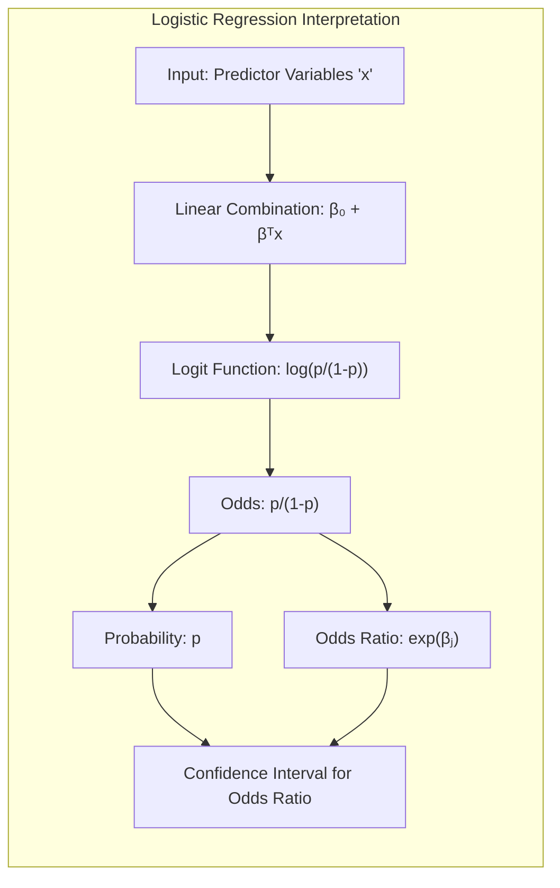
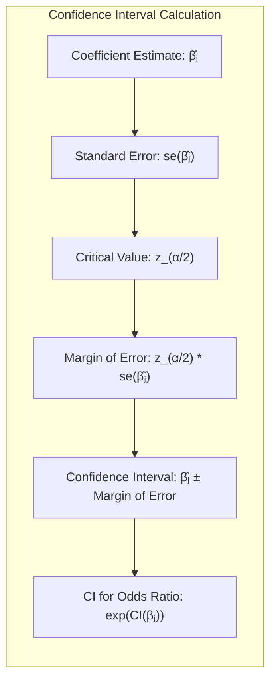
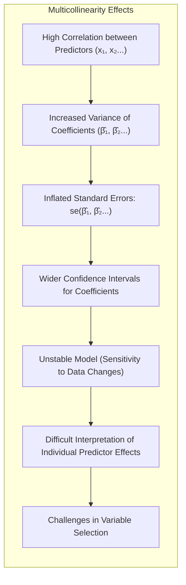
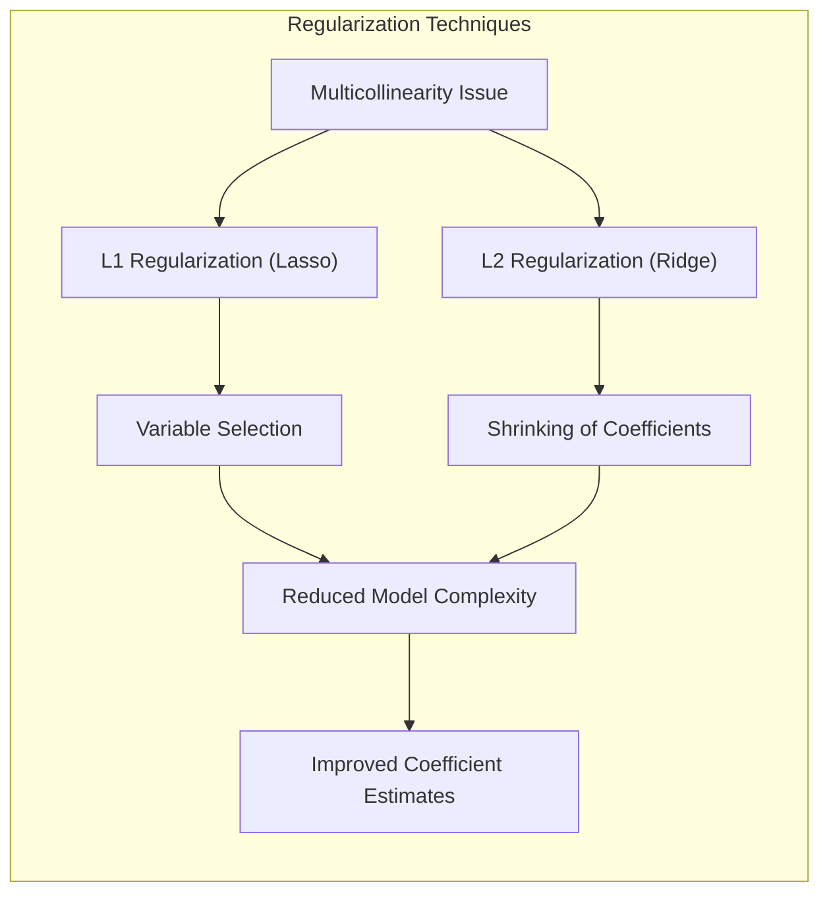
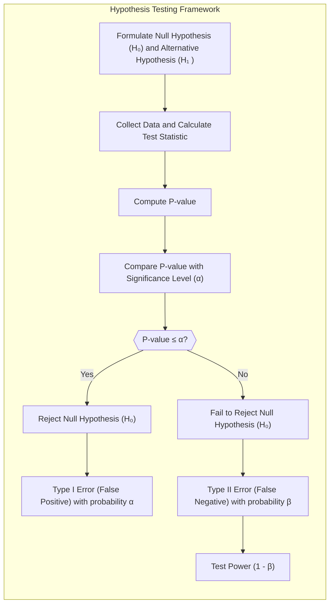

### Interpretação de Coeficientes em Regressão Logística: Odds, Odds Ratios e Intervalos de Confiança

Na **regressão logística**, os coeficientes estimados $\beta_j$ não têm uma interpretação direta como em modelos lineares. Isso ocorre porque o modelo logístico modela o logaritmo das *odds* (e não a probabilidade diretamente) como uma função linear dos preditores. A função logística, dada por:

$$
    p(x) = \frac{e^{\beta_0 + \beta^T x}}{1 + e^{\beta_0 + \beta^T x}}
$$

transforma a saída linear em uma probabilidade entre 0 e 1 [^4.4]. Para interpretar os coeficientes, é necessário compreender o conceito de *odds* e *odds ratios*.

As *odds* de um evento (por exemplo, a probabilidade de um indivíduo pertencer a uma classe) são definidas como a razão entre a probabilidade do evento ocorrer e a probabilidade de ele não ocorrer:

$$
    odds = \frac{p}{1-p}
$$

O logaritmo das *odds*, também chamado de *logit*, é dado por:

$$
    logit(p) = \log\left(\frac{p}{1-p}\right) = \beta_0 + \beta^T x
$$

Portanto, os coeficientes da regressão logística, $\beta_j$, representam a mudança no log das *odds* para um aumento unitário na variável preditora $x_j$, mantendo as demais variáveis constantes. A interpretação em termos de *odds ratio* (razão de *odds*) é mais intuitiva.

O *odds ratio* entre dois grupos (ou para dois valores de uma variável contínua) é dado pela razão das *odds* desses grupos. Para um aumento unitário em $x_j$, o *odds ratio* é:

$$
   OR = \frac{odds(x_j+1)}{odds(x_j)} = e^{\beta_j}
$$

Ou seja, $e^{\beta_j}$ representa a mudança nas *odds* para um aumento unitário em $x_j$, mantendo as outras variáveis constantes. Um *odds ratio* maior do que 1 indica que o aumento em $x_j$ está associado a um aumento nas *odds*, e um *odds ratio* menor do que 1 indica que um aumento em $x_j$ está associado a uma diminuição nas *odds*.

A interpretação dos coeficientes também pode ser realizada em termos de percentual de mudança nas *odds*. Por exemplo, se $e^{\beta_j} = 1.10$, isso indica que um aumento unitário em $x_j$ está associado a um aumento de 10% nas *odds*.

> 💡 **Exemplo Numérico:**
> Suponha que estamos modelando a probabilidade de um paciente desenvolver uma certa doença (variável resposta binária) com base em sua idade (variável preditora contínua). Ajustamos um modelo de regressão logística e obtemos o seguinte coeficiente para a idade: $\hat{\beta}_{idade} = 0.05$. Isso significa que para cada ano adicional de idade, o log das *odds* de desenvolver a doença aumenta em 0.05.
>
> Para obter o *odds ratio*, calculamos $e^{0.05} \approx 1.0513$. Isso indica que para cada ano adicional de idade, as *odds* de desenvolver a doença aumentam em aproximadamente 5.13%. Se a idade de um paciente aumenta de 50 para 51 anos, as *odds* de desenvolver a doença são aproximadamente 1.0513 vezes maiores. Se o coeficiente fosse negativo, por exemplo, $\hat{\beta}_{idade} = -0.02$, então $e^{-0.02} \approx 0.9802$. Isso indicaria que para cada ano adicional de idade, as *odds* diminuem em aproximadamente 1.98%.

**Intervalos de Confiança:**

Os intervalos de confiança fornecem uma estimativa da incerteza associada aos coeficientes estimados. Para calcular intervalos de confiança, assume-se que os estimadores de máxima verossimilhança, $\hat{\beta}$, seguem uma distribuição normal assintoticamente, conforme discutido em [^4.4.3]. O intervalo de confiança para um coeficiente $\beta_j$ é dado por:

$$
    CI(\beta_j) = \hat{\beta}_j \pm z_{\alpha/2} \cdot se(\hat{\beta}_j)
$$

onde $z_{\alpha/2}$ é o valor crítico da distribuição normal padrão para um nível de significância $\alpha$ (por exemplo, 1.96 para $\alpha = 0.05$), e $se(\hat{\beta}_j)$ é o erro padrão do coeficiente. O intervalo de confiança para o *odds ratio* $e^{\beta_j}$ é obtido pela exponenciação dos limites do intervalo de confiança do coeficiente:

$$
    CI(e^{\beta_j}) = [e^{\hat{\beta}_j - z_{\alpha/2} \cdot se(\hat{\beta}_j)}, e^{\hat{\beta}_j + z_{\alpha/2} \cdot se(\hat{\beta}_j)}]
$$

Este intervalo de confiança para o *odds ratio* nos permite avaliar a precisão da estimativa e a direção da associação entre a variável preditora e a resposta. Um intervalo que inclui o valor 1 indica que o efeito não é estatisticamente significativo ao nível de confiança escolhido.

> 💡 **Exemplo Numérico:**
> Continuando o exemplo anterior, suponha que o erro padrão do coeficiente da idade seja $se(\hat{\beta}_{idade}) = 0.01$. Para um nível de significância de $\alpha = 0.05$, temos $z_{\alpha/2} = 1.96$. Então, o intervalo de confiança para o coeficiente da idade é:
>
> $CI(\beta_{idade}) = 0.05 \pm 1.96 \times 0.01 = [0.0304, 0.0696]$
>
> O intervalo de confiança para o *odds ratio* é:
>
> $CI(e^{\beta_{idade}}) = [e^{0.0304}, e^{0.0696}] = [1.0308, 1.0721]$
>
> Este intervalo indica que, com 95% de confiança, o aumento nas *odds* devido a um ano adicional de idade está entre 3.08% e 7.21%. Como o intervalo não inclui o valor 1, podemos concluir que o efeito da idade sobre as *odds* de desenvolver a doença é estatisticamente significativo neste nível de confiança. Se o intervalo incluísse 1, o efeito não seria estatisticamente significativo.

**Lemma 8:** *O *odds ratio* é invariante sob transformações lineares da variável preditora*.

*Prova:* Seja $x^* = a + bx$. O *odds ratio* associado ao coeficiente de $x^*$ é $exp(\beta^*)$, onde $\beta^*$ é o coeficiente de $x^*$. Podemos mostrar que o *odds ratio* para uma mudança de tamanho $h$ em $x$ é o mesmo que o *odds ratio* para a mudança correspondente em $x^*$, multiplicando por $b$ a mudança original $h$, ou seja, $exp(b h \beta)$. $\blacksquare$

**Corolário 8:** *Intervalos de confiança para os coeficientes em regressão logística são assintoticamente corretos quando o número de amostras tende ao infinito.*

*Prova:* Os resultados assintóticos da teoria da máxima verossimilhança garantem que a distribuição dos estimadores de máxima verossimilhança se aproxima de uma normal, desde que as condições de regularidade sejam válidas. [^4.4.3] $\blacksquare$

A interpretação correta dos coeficientes em regressão logística, juntamente com o uso de *odds ratios* e intervalos de confiança, é essencial para uma análise significativa e robusta dos resultados.

### Implicações da Multicolinearidade em Modelos Lineares

A **multicolinearidade** ocorre quando há uma forte correlação entre duas ou mais variáveis preditoras em um modelo linear. Em modelos de classificação, como a regressão logística e o LDA, a multicolinearidade pode levar a diversos problemas, incluindo:

1.  **Inflação da Variância:** A multicolinearidade aumenta a variância dos coeficientes estimados, tornando-os menos precisos e com erros padrões maiores [^4.4.2]. Isso dificulta a interpretação dos coeficientes, uma vez que a incerteza sobre suas estimativas aumenta. Intervalos de confiança tornam-se mais amplos, e os testes de hipóteses se tornam menos poderosos.

2.  **Instabilidade:** Pequenas mudanças nos dados podem levar a grandes variações nos coeficientes estimados, tornando o modelo instável e menos confiável [^4.4.2].

3.  **Dificuldade na Interpretação:** Quando as variáveis preditoras são fortemente correlacionadas, é difícil determinar o efeito individual de cada variável na resposta. Um coeficiente pode ser significativo em um modelo, mas tornar-se não significativo em outro modelo com diferentes variáveis [^4.4.2].

4.  **Problemas na Seleção de Modelos:** Em seleção stepwise, a multicolinearidade pode levar à inclusão ou exclusão errônea de variáveis, dependendo da ordem de entrada ou remoção das variáveis.

Para ilustrar, considere um modelo linear com duas variáveis preditoras, $x_1$ e $x_2$. Se $x_1$ e $x_2$ são altamente correlacionadas, é difícil determinar se a variação na resposta é devida a $x_1$, a $x_2$ ou a ambas. Os coeficientes $\beta_1$ e $\beta_2$ podem ter grandes erros padrões, levando a inferências pouco confiáveis.

> 💡 **Exemplo Numérico:**
> Suponha que estamos tentando prever o preço de casas usando duas variáveis: área em metros quadrados ($x_1$) e número de quartos ($x_2$). É provável que essas duas variáveis sejam altamente correlacionadas, pois casas maiores geralmente têm mais quartos. Se ajustarmos um modelo linear e observarmos que os erros padrão dos coeficientes de $x_1$ e $x_2$ são muito altos e que os coeficientes mudam muito quando adicionamos ou removemos outras variáveis do modelo, suspeitamos de multicolinearidade.
>
> Por exemplo, podemos obter um modelo como:
> $preço = 10000 + 2000 * x_1 + 5000 * x_2$
>
> Onde, idealmente, esperaríamos um coeficiente positivo para ambos. No entanto, devido à multicolinearidade, um modelo ligeiramente diferente poderia ser:
> $preço = 5000 + 1500 * x_1 + 6000 * x_2$
>
> Ou até mesmo:
> $preço = 15000 + 3000 * x_1 - 1000 * x_2$
>
> A instabilidade e a troca de sinais indicam multicolinearidade.

**Medidas para Lidar com a Multicolinearidade:**

1.  **Remoção de Variáveis:** Uma abordagem é remover uma ou mais variáveis altamente correlacionadas. No entanto, isso deve ser feito com cautela, uma vez que pode haver perda de informação. É importante considerar quais variáveis têm maior importância teórica ou prática. Métodos como o stepwise, quando interpretado com cautela e juntamente com análise teórica, podem ser utilizados para eliminar variáveis redundantes [^4.4.2].

2.  **Regularização:** A regularização, como a penalização L1 (Lasso) e L2 (Ridge), pode ajudar a reduzir a variância dos coeficientes e a lidar com a multicolinearidade. O Lasso realiza seleção de variáveis através da esparsidade, enquanto o Ridge encolhe os coeficientes sem eliminá-los por completo [^4.4.4].

> 💡 **Exemplo Numérico:**
> Usando o mesmo exemplo de preço de casas, podemos aplicar a regularização Ridge para lidar com a multicolinearidade. O Ridge adiciona uma penalidade à função de custo que é proporcional ao quadrado da magnitude dos coeficientes. Isso faz com que os coeficientes diminuam de valor, reduzindo a variância. O parâmetro $\lambda$ controla a intensidade da regularização.
>
> Com um $\lambda$ pequeno, o Ridge se comporta de forma semelhante à regressão linear comum. Com um $\lambda$ grande, os coeficientes tendem a zero.
>
> Por exemplo, com um $\lambda$ pequeno, podemos obter:
> $preço = 10500 + 1800 * x_1 + 4500 * x_2$
>
> E com um $\lambda$ maior:
>
> $preço = 11000 + 1000 * x_1 + 2000 * x_2$
>
> Os coeficientes são menores, mas mais estáveis.

3.  **Combinação de Variáveis:** Criar novas variáveis combinando as variáveis correlacionadas, como por exemplo, por meio de componentes principais ou outras abordagens de redução de dimensionalidade.

4.  **Transformação de Variáveis:** Transformações não lineares podem reduzir a correlação entre algumas variáveis.

5.  **Interpretação com Cautela:** Quando a multicolinearidade está presente, a interpretação dos coeficientes individuais deve ser feita com cautela. É importante analisar o efeito das variáveis em conjunto, ao invés de de forma isolada.

**Lemma 9:** *A variância dos coeficientes em modelos lineares, na presença de multicolinearidade, é inversamente proporcional à quantidade de informação independente fornecida pelas variáveis preditoras.*

*Prova:* A matriz de covariância dos coeficientes $\beta$ é dada por $(X^TX)^{-1} \sigma^2$, onde $X$ é a matriz de design e $\sigma^2$ é a variância do erro. A presença de multicolinearidade aumenta a magnitude dos elementos da matriz inversa $(X^TX)^{-1}$, o que eleva a variância dos coeficientes estimados.  $\blacksquare$

**Corolário 9:** *A multicolinearidade pode levar a coeficientes com sinais opostos ao que se esperaria intuitivamente, pois a correlação entre os preditores afeta a estimação dos coeficientes parciais*.

*Prova:* Como a multicolinearidade afeta a variância dos coeficientes e seus erros padrões, em amostras finitas, isso pode levar a problemas de interpretação dos coeficientes, como troca de sinais. [^4.4.2] $\blacksquare$

Lidar com a multicolinearidade é essencial para obter resultados confiáveis em modelos lineares. Ignorar a multicolinearidade pode levar a interpretações errôneas e a modelos com baixa capacidade de generalização.

### Testes de Hipóteses, Erros Tipo I e Tipo II e Interpretações

A **inferência estatística** em modelos de classificação envolve a realização de **testes de hipóteses** para avaliar a significância dos coeficientes estimados e a validade das conclusões [^4.4.2]. Os testes de hipóteses fornecem uma estrutura formal para tomar decisões sobre as relações entre variáveis preditoras e a resposta com base em dados amostrais.

A lógica dos testes de hipóteses começa com a formulação de duas hipóteses: a **hipótese nula (H0)** e a **hipótese alternativa (H1)**. A hipótese nula representa a ausência de um efeito ou associação, enquanto a hipótese alternativa representa a presença de um efeito ou associação. O objetivo do teste é decidir se há evidências suficientes para rejeitar a hipótese nula em favor da hipótese alternativa.

Os testes de hipóteses são baseados em estatísticas de teste, como o z-score, o t-statistic, o qui-quadrado e o teste de razão de verossimilhança. O valor p, ou p-valor, é a probabilidade de se observar uma estatística de teste tão ou mais extrema do que a observada nos dados amostrais, assumindo que a hipótese nula é verdadeira.

Em testes de hipóteses, são possíveis dois tipos de erros:

1.  **Erro do Tipo I (Falso Positivo):** Rejeitar a hipótese nula quando ela é verdadeira. A probabilidade de cometer um erro do Tipo I é dada pelo nível de significância $\alpha$ do teste (por exemplo, $\alpha = 0.05$).

2.  **Erro do Tipo II (Falso Negativo):** Não rejeitar a hipótese nula quando ela é falsa. A probabilidade de cometer um erro do Tipo II é dada por $\beta$, e o poder do teste (1 - $\beta$) é a probabilidade de rejeitar a hipótese nula quando ela é falsa.

A escolha do nível de significância $\alpha$ afeta o trade-off entre os erros do Tipo I e do Tipo II. Um menor valor de $\alpha$ diminui a probabilidade de cometer um erro do Tipo I, mas aumenta a probabilidade de cometer um erro do Tipo II. Um maior valor de $\alpha$ aumenta a probabilidade de cometer um erro do Tipo I, mas diminui a probabilidade de cometer um erro do Tipo II.

A interpretação dos resultados dos testes de hipóteses requer cautela. Um resultado estatisticamente significativo (p-valor menor do que o nível de significância $\alpha$) indica que há evidências suficientes para rejeitar a hipótese nula, mas não prova que a hipótese alternativa é verdadeira. Um resultado não significativo (p-valor maior do que o nível de significância $\alpha$) não prova que a hipótese nula é verdadeira. Ele apenas indica que não há evidências suficientes para rejeitá-la.

Além disso, a significância estatística não implica necessariamente em significância prática ou causalidade. É importante considerar o tamanho do efeito e o contexto do problema ao interpretar os resultados.

> 💡 **Exemplo Numérico:**
> Suponha que estamos testando a hipótese de que um novo medicamento reduz a pressão arterial.
>
>  - **H0 (Hipótese Nula):** O medicamento não tem efeito sobre a pressão arterial ($\beta = 0$).
>  - **H1 (Hipótese Alternativa):** O medicamento reduz a pressão arterial ($\beta < 0$).
>
> Realizamos um estudo com um grupo de pacientes, coletamos os dados e ajustamos um modelo de regressão linear. Após os cálculos, obtemos um p-valor de 0.02.
>
>  - **Interpretação:**
>    - Se definirmos $\alpha = 0.05$, como o p-valor (0.02) é menor que $\alpha$, rejeitamos a hipótese nula. Concluímos que há evidências estatísticas de que o medicamento reduz a pressão arterial.
>    - Se definirmos $\alpha = 0.01$, como o p-valor (0.02) é maior que $\alpha$, não rejeitamos a hipótese nula. Concluímos que não há evidências estatísticas suficientes para afirmar que o medicamento reduz a pressão arterial neste nível de significância.
>
>  - **Erros:**
>    - **Erro do Tipo I:** Se rejeitamos H0 quando ela é verdadeira (o medicamento não tem efeito), cometemos um erro do Tipo I. A probabilidade desse erro é de 5% se usarmos $\alpha = 0.05$.
>    - **Erro do Tipo II:** Se não rejeitamos H0 quando ela é falsa (o medicamento realmente reduz a pressão), cometemos um erro do Tipo II. A probabilidade desse erro é $\beta$ e seu complemento é o poder do teste (1 - $\beta$).

**Lemma 10:** *O nível de significância $\alpha$ controla a probabilidade de cometer um erro do Tipo I, ou seja, de rejeitar a hipótese nula quando ela é verdadeira*.

*Prova:* O nível de significância é definido como a probabilidade de se observar um resultado tão ou mais extremo do que o observado sob a hipótese nula.  $\blacksquare$

**Corolário 10:** *O poder de um teste estatístico (1 - $\beta$) aumenta com o tamanho da amostra e com a magnitude do efeito verdadeiro.*

*Prova:* O poder de um teste representa a probabilidade de rejeitar a hipótese nula quando ela é falsa. O poder aumenta quando o tamanho da amostra aumenta, ou quando a diferença entre o efeito verdadeiro e o efeito sob a hipótese nula é maior. $\blacksquare$

A compreensão dos testes de hipóteses, dos erros do Tipo I e do Tipo II e de seus trade-offs, é fundamental para uma interpretação precisa e cautelosa dos resultados da inferência estatística.

### Conclusão

Este capítulo abordou a interpretação dos coeficientes em regressão logística utilizando *odds* e *odds ratios*, os intervalos de confiança, o efeito da multicolinearidade em modelos lineares, os testes de hipóteses, os erros tipo I e tipo II, além de como esses conceitos influenciam a interpretação dos resultados. A correta interpretação dos coeficientes, juntamente com o uso de *odds ratios* e intervalos de confiança, são essenciais para uma análise significativa e robusta dos resultados. A multicolinearidade pode causar problemas na estimação e interpretação dos coeficientes, exigindo estratégias como remoção de variáveis e regularização. Os testes de hipóteses fornecem uma estrutura para a tomada de decisões e são importantes para concluir sobre os modelos, mas os erros do Tipo I e do Tipo II devem ser levados em conta. Os trade-offs entre esses erros e os conceitos de significância estatística e prática são essenciais para uma interpretação cautelosa e precisa dos resultados.

### Footnotes

[^4.1]: "In this chapter we revisit the classification problem and focus on linear methods for classification. Since our predictor G(x) takes values in a discrete set G, we can always divide the input space into a collection of regions labeled according to the classification. We saw in Chapter 2 that the boundaries of these regions can be rough or smooth, depending on the prediction function. For an important class of procedures, these decision boundaries are linear; this is what we will mean by linear methods for classification." *(Trecho de "The Elements of Statistical Learning")*

[^4.3]: "Linear discriminant analysis (LDA) arises in the special case when we assume that the classes have a common covariance matrix Σk = ∑. In comparing two classes k and l, it is sufficient to look at the log-ratio, and we see that" *(Trecho de "The Elements of Statistical Learning")*

[^4.4]: "The logistic regression model arises from the desire to model the posterior probabilities of the K classes via linear functions in x, while at the same time ensuring that they sum to one and remain in [0,1]." *(Trecho de "The Elements of Statistical Learning")*

[^4.4.2]: "At this stage the analyst might do some model selection; find a subset of the variables that are sufficient for explaining their joint effect on the prevalence of chd. One way to proceed by is to drop the least significant co- efficient, and refit the model. This is done repeatedly until no further terms can be dropped from the model. This gave the model shown in Table 4.3." *(Trecho de "The Elements of Statistical Learning")*

[^4.4.3]: "The weighted residual sum-of-squares is the familiar Pearson chi-square statistic a quadratic approximation to the deviance" *(Trecho de "The Elements of Statistical Learning")*

[^4.4.4]:  "The L₁ penalty used in the lasso (Section 3.4.2) can be used for variable selection and shrinkage with any linear regression model. For logistic regression, we would maximize a penalized version of (4.20):" *(Trecho de "The Elements of Statistical Learning")*

[^4.5]: "In this situation the features are high-dimensional and correlated, and the LDA coefficients can be regularized to be smooth or sparse in the original domain of the signal. This leads to better generalization and allows for easier interpretation of the coefficients." *(Trecho de "The Elements of Statistical Learning")*
