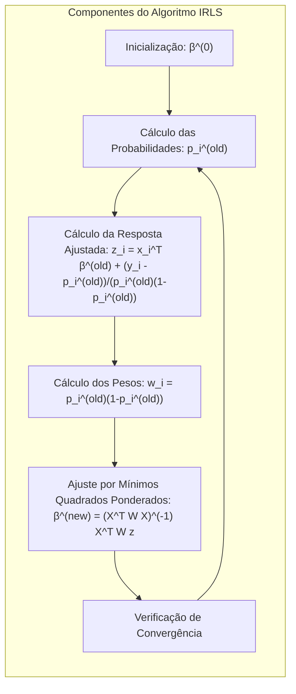
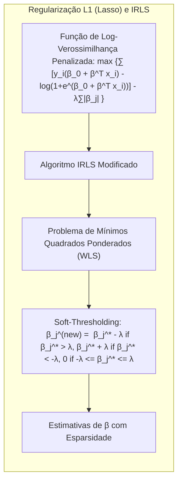
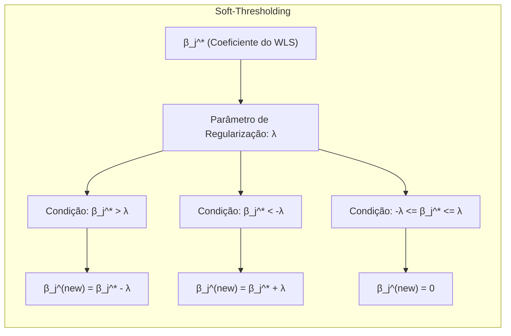
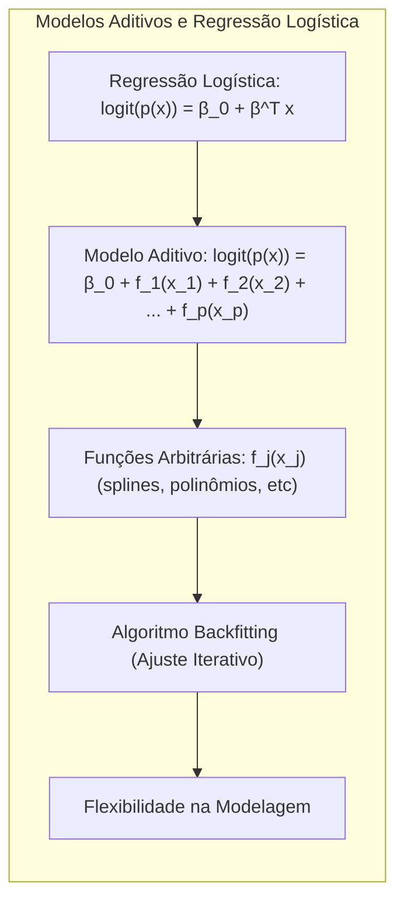
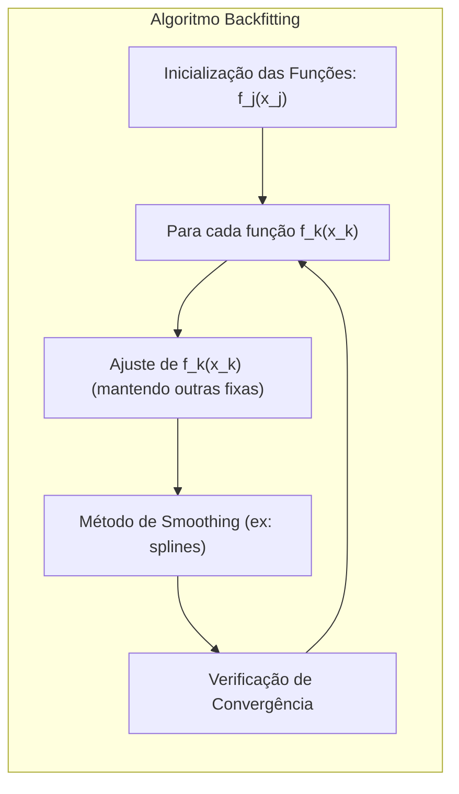

### Explorando a Relação entre Regressão Logística e Mínimos Quadrados Ponderados (Weighted Least Squares)

```mermaid
graph TB
    subgraph "Regressão Logística e IRLS"
        direction TB
        A["Função de Log-Verossimilhança: "l(β) = ∑ [y_i log(p(x_i)) + (1-y_i) log(1-p(x_i))]"]
        B["Aproximação Quadrática (Expansão de Taylor)"]
        C["Problema de Mínimos Quadrados Ponderados (WLS)"]
        D["Atualização Iterativa dos Parâmetros: β^(new) = argmin_β ∑ w_i (z_i - x_i^T β)^2"]
        E["Algoritmo IRLS"]
        A --> B
        B --> C
        C --> D
        D --> E
    end
```

A relação entre **regressão logística** e **mínimos quadrados ponderados (Weighted Least Squares - WLS)** é fundamental para a compreensão dos algoritmos de ajuste e para a realização de inferência estatística em modelos logísticos [^4.4.3]. Embora a regressão logística seja um modelo não linear, o processo de otimização da função de log-verossimilhança pode ser reformulado em termos de um problema de mínimos quadrados ponderados iterativamente (Iteratively Reweighted Least Squares - IRLS) [^4.4.3]. Essa reformulação não apenas fornece uma maneira eficiente de encontrar as estimativas de máxima verossimilhança, mas também permite que a teoria assintótica de modelos lineares seja aplicada à regressão logística [^4.4.3].

Como discutido em seções anteriores, a regressão logística modela o logaritmo das *odds* (ou *logit*) como uma função linear dos preditores [^4.4]:

$$
    logit(p(x)) = \log\left(\frac{p(x)}{1-p(x)}\right) = \beta_0 + \beta^T x
$$

onde $p(x)$ é a probabilidade da classe positiva dado $x$. Para encontrar os parâmetros $\beta_0$ e $\beta$, o modelo logístico maximiza a função de log-verossimilhança condicional:

$$
    \ell(\beta) = \sum_{i=1}^N [y_i \log(p(x_i)) + (1-y_i) \log(1-p(x_i))]
$$

onde $y_i$ são as respostas (0 ou 1) e $p(x_i)$ são as probabilidades estimadas. A maximização da função de log-verossimilhança é um problema não linear, e um algoritmo iterativo é necessário para encontrar a solução.

O algoritmo IRLS utiliza aproximações quadráticas da função de log-verossimilhança em cada iteração, transformando o problema de otimização em uma sequência de problemas de mínimos quadrados ponderados. Para isso, a função de log-verossimilhança é aproximada por uma expansão de Taylor de segunda ordem em torno de uma estimativa atual $\beta^{(old)}$. O resultado é que o problema de maximização da verossimilhança se transforma em uma atualização iterativa dos parâmetros via um problema de mínimos quadrados ponderados [^4.4.3]:

$$
   \beta^{(new)} = \text{argmin}_\beta \sum_{i=1}^N w_i (z_i - x_i^T \beta)^2
$$

onde:
*   $z_i$ é a resposta ajustada (adjusted response) definida por:
    $$
        z_i = x_i^T \beta^{(old)} + \frac{y_i - p_i^{(old)}}{p_i^{(old)}(1-p_i^{(old)})}
    $$
*   $w_i$ são os pesos dados por:
    $$
        w_i = p_i^{(old)}(1-p_i^{(old)})
    $$
*   $p_i^{(old)}$ é a probabilidade estimada na iteração anterior, avaliada em $\beta^{(old)}$.

> 💡 **Exemplo Numérico:**
>
> Vamos considerar um exemplo simplificado com dois dados ($N=2$) e um único preditor ($p=1$), onde $x_1 = 1$, $x_2 = 2$, $y_1 = 1$ e $y_2 = 0$. Inicializamos os coeficientes com $\beta_0^{(0)} = 0$ e $\beta_1^{(0)} = 0$.
>
> **Iteração 1:**
>
> 1.  **Inicialização:** $\beta^{(0)} = [0, 0]^T$.
>
> 2.  **Cálculo das Probabilidades:**
>     $p_1^{(0)} = \frac{1}{1 + e^{-(0 + 0*1)}} = 0.5$
>     $p_2^{(0)} = \frac{1}{1 + e^{-(0 + 0*2)}} = 0.5$
>
> 3.  **Cálculo da Resposta Ajustada e Pesos:**
>     $z_1 = 0 + \frac{1 - 0.5}{0.5 * 0.5} = 2$
>     $z_2 = 0 + \frac{0 - 0.5}{0.5 * 0.5} = -2$
>     $w_1 = 0.5 * 0.5 = 0.25$
>     $w_2 = 0.5 * 0.5 = 0.25$
>
> 4.  **Ajuste por Mínimos Quadrados Ponderados:**
>     $X = \begin{bmatrix} 1 & 1 \\ 1 & 2 \end{bmatrix}$, $W = \begin{bmatrix} 0.25 & 0 \\ 0 & 0.25 \end{bmatrix}$, $z = \begin{bmatrix} 2 \\ -2 \end{bmatrix}$
>     $X^T W X = \begin{bmatrix} 1 & 1 \\ 1 & 2 \end{bmatrix}^T \begin{bmatrix} 0.25 & 0 \\ 0 & 0.25 \end{bmatrix} \begin{bmatrix} 1 & 1 \\ 1 & 2 \end{bmatrix} = \begin{bmatrix} 0.5 & 0.75 \\ 0.75 & 1.25 \end{bmatrix}$
>     $(X^T W X)^{-1} = \begin{bmatrix} 5 & -3 \\ -3 & 2 \end{bmatrix}$
>     $X^T W z = \begin{bmatrix} 1 & 1 \\ 1 & 2 \end{bmatrix}^T \begin{bmatrix} 0.25 & 0 \\ 0 & 0.25 \end{bmatrix} \begin{bmatrix} 2 \\ -2 \end{bmatrix} = \begin{bmatrix} 0 \\ -1 \end{bmatrix}$
>     $\beta^{(1)} = (X^T W X)^{-1} X^T W z = \begin{bmatrix} 5 & -3 \\ -3 & 2 \end{bmatrix} \begin{bmatrix} 0 \\ -1 \end{bmatrix} = \begin{bmatrix} 3 \\ -2 \end{bmatrix}$
>
> 5.  **Verificação de Convergência:** Como $\beta^{(1)}$ é diferente de $\beta^{(0)}$, o algoritmo continua para a próxima iteração.
>
> Este exemplo ilustra como o algoritmo IRLS transforma um problema de otimização não linear em uma sequência de problemas de mínimos quadrados ponderados, onde os pesos e a resposta ajustada são atualizados iterativamente.



O algoritmo IRLS consiste nos seguintes passos:

1.  **Inicialização:** Começar com uma estimativa inicial para os coeficientes $\beta^{(0)}$, por exemplo, $\beta^{(0)} = 0$.

2.  **Cálculo das Probabilidades:** Calcular as probabilidades estimadas $p_i^{(old)}$ com base nas estimativas atuais de $\beta^{(old)}$.

3.  **Cálculo da Resposta Ajustada e Pesos:** Calcular a resposta ajustada $z_i$ e os pesos $w_i$.

4.  **Ajuste por Mínimos Quadrados Ponderados:** Resolver o problema de mínimos quadrados ponderados para obter as novas estimativas $\beta^{(new)}$:

    $$
        \beta^{(new)} = (X^T W X)^{-1} X^T W z
    $$

    onde $X$ é a matriz de design, $W$ é a matriz diagonal dos pesos $w_i$ e $z$ é o vetor da resposta ajustada $z_i$.

5.  **Verificação de Convergência:** Verificar se as estimativas de $\beta$ convergiram. Se não, retornar ao passo 2.

Essa relação entre regressão logística e mínimos quadrados ponderados permite o uso de algoritmos de mínimos quadrados padrão para ajustar modelos logísticos. Além disso, as propriedades assintóticas dos estimadores de mínimos quadrados ponderados (como a distribuição normal assintótica) podem ser usadas para obter resultados inferenciais, incluindo intervalos de confiança e testes de hipóteses [^4.4.3].

**Lemma 11:** *O algoritmo IRLS converge para a solução de máxima verossimilhança para o modelo de regressão logística, sob condições de regularidade*.

*Prova:* O algoritmo IRLS baseia-se em uma aproximação quadrática da função de log-verossimilhança, e em cada iteração o modelo é ajustado. Com um número suficiente de iterações, o algoritmo converge para a solução de máxima verossimilhança. [^4.4.3] $\blacksquare$

**Corolário 11:** *A matriz de covariância dos estimadores de máxima verossimilhança em regressão logística pode ser aproximada pela inversa da matriz de informação observada, que é estimada a partir dos pesos usados no processo iterativo do IRLS.*

*Prova:* A matriz de informação observada está relacionada ao hessiano negativo da função de log-verossimilhança. O processo IRLS permite obter uma aproximação da matriz de informação, e seu inverso fornece a matriz de covariância dos coeficientes estimados. [^4.4.3] $\blacksquare$

A relação entre regressão logística e mínimos quadrados ponderados é uma peça fundamental para entender como os algoritmos de ajuste funcionam e como as propriedades estatísticas dos estimadores são obtidas.

### Utilização do Lasso e Regularização L1 no Contexto do Algoritmo IRLS



A **regularização L1** (Lasso) é uma técnica poderosa para a seleção de variáveis e *shrinkage* em modelos lineares, e sua aplicação em regressão logística, por meio da integração ao algoritmo **IRLS**, oferece uma abordagem flexível e eficiente para a otimização de modelos complexos [^4.4.4]. A regularização L1 adiciona uma penalidade à função de log-verossimilhança, proporcional à soma dos valores absolutos dos coeficientes:

$$
     \max_{\beta_0, \beta} \left\{ \sum_{i=1}^N \left[ y_i (\beta_0 + \beta^T x_i) - \log(1 + e^{\beta_0 + \beta^T x_i})\right] - \lambda \sum_{j=1}^p |\beta_j| \right\}
$$

onde $\lambda$ é o parâmetro de regularização que controla o nível de *shrinkage* e esparsidade. A presença do termo $|\beta_j|$ torna o problema de otimização não diferenciável na origem.

Para aplicar o Lasso em regressão logística, o algoritmo IRLS é modificado para incorporar o termo de penalização L1 [^4.4.4]. A essência é que o problema de otimização, que já é resolvido iterativamente, agora também incorpora a penalidade L1 em cada iteração.
A modificação do algoritmo IRLS para incorporar a penalização L1 (Lasso) pode ser feita de diferentes formas, uma delas consiste em adicionar um passo de *shrinkage* após a obtenção das novas estimativas de $\beta$ via o problema de mínimos quadrados ponderados. Esse passo de *shrinkage* consiste na aplicação de um operador de *soft-thresholding*:

$$
    \beta_j^{(new)} =
    \begin{cases}
      \beta_j^* - \lambda & \text{se } \beta_j^* > \lambda \\
      \beta_j^* + \lambda & \text{se } \beta_j^* < -\lambda \\
      0 & \text{se } -\lambda \leq \beta_j^* \leq \lambda
    \end{cases}
$$

onde $\beta_j^*$ é o coeficiente obtido pelo problema de mínimos quadrados ponderados na iteração atual, e $\lambda$ é o parâmetro de regularização. O resultado desse processo é a esparsidade nos coeficientes, i.e, alguns coeficientes são forçados a exatamente zero, realizando seleção de variáveis.

> 💡 **Exemplo Numérico:**
>
> Vamos supor que, após uma iteração do IRLS, obtivemos o vetor de coeficientes $\beta^* = [2, -1, 0.5, -0.2]$. Agora, aplicaremos o *soft-thresholding* com $\lambda = 0.3$.
>
> Para $\beta_1^* = 2$: Como $2 > 0.3$, $\beta_1^{(new)} = 2 - 0.3 = 1.7$.
> Para $\beta_2^* = -1$: Como $-1 < -0.3$, $\beta_2^{(new)} = -1 + 0.3 = -0.7$.
> Para $\beta_3^* = 0.5$: Como $-0.3 \leq 0.5 \leq 0.3$ é falso, e como $0.5 > 0.3$, $\beta_3^{(new)} = 0.5 - 0.3 = 0.2$.
> Para $\beta_4^* = -0.2$: Como $-0.3 \leq -0.2 \leq 0.3$ é verdadeiro, $\beta_4^{(new)} = 0$.
>
> Assim, o novo vetor de coeficientes após o *soft-thresholding* é $\beta^{(new)} = [1.7, -0.7, 0.2, 0]$. Note que o coeficiente $\beta_4$ foi zerado, demonstrando a capacidade do Lasso de realizar seleção de variáveis.
>
> Este exemplo demonstra como o operador de *soft-thresholding* encolhe os coeficientes em direção a zero e zera aqueles que estão dentro do intervalo $[-\lambda, \lambda]$, promovendo a esparsidade.



Outras implementações do Lasso no contexto do IRLS podem envolver modificações na resposta ajustada e nos pesos [^4.4.4], mantendo a estrutura iterativa do IRLS, onde um problema de mínimos quadrados ponderados é resolvido em cada iteração. Essas modificações visam incorporar a penalização L1 de forma a encontrar a solução ótima do problema regularizado. Algoritmos mais recentes e eficientes utilizam métodos de *coordinate descent* ou métodos de *predictor-corrector* para encontrar o caminho da regularização de forma eficiente.

É importante notar que a escolha do valor de $\lambda$ é crucial para o desempenho do modelo. Uma abordagem comum é usar validação cruzada para selecionar o valor de $\lambda$ que otimiza alguma métrica de desempenho, como a acurácia ou a área sob a curva ROC.

Ao integrar a regularização L1 ao IRLS, podemos não só ajustar o modelo logístico de forma eficiente mas também selecionar variáveis preditoras relevantes, melhorando a capacidade de generalização e interpretabilidade do modelo.

**Lemma 12:** *A aplicação do operador de soft-thresholding aos coeficientes estimados em cada iteração do IRLS implementa a penalização L1, forçando coeficientes não relevantes a zero e levando a modelos esparsos.*

*Prova:* O operador de soft-thresholding reduz a magnitude dos coeficientes e os força a zero se eles estiverem dentro de um intervalo definido pelo parâmetro de regularização $\lambda$. Esse é o mecanismo central da regularização L1 que produz esparsidade. [^4.4.4] $\blacksquare$

**Corolário 12:** *A regularização L1 integrada ao algoritmo IRLS fornece uma forma de realizar seleção de variáveis em modelos logísticos, enquanto mantêm a estrutura eficiente do algoritmo IRLS.*

*Prova:* O algoritmo modificado com L1 adiciona uma etapa iterativa de penalização, mantendo a eficiência do algoritmo iterativo de IRLS e adicionando a capacidade de realizar seleção de variáveis. [^4.4.4] $\blacksquare$

A integração da regularização L1 ao algoritmo IRLS oferece uma abordagem robusta e flexível para ajustar modelos logísticos em cenários onde a seleção de variáveis é necessária.

### Modelos Aditivos e Generalizações da Regressão Logística



A regressão logística, apesar de ser um modelo flexível, assume que o log das *odds* (ou o *logit*) é uma função linear dos preditores. Em muitas aplicações, essa suposição pode ser limitante e modelos mais flexíveis podem ser necessários. Uma extensão importante da regressão logística é a sua generalização para **modelos aditivos**, onde os preditores entram no modelo por meio de funções arbitrárias, não necessariamente lineares [^4.4.5].

Em um modelo aditivo, o logit da probabilidade da classe positiva é dado por:

$$
   logit(p(x)) = \beta_0 + f_1(x_1) + f_2(x_2) + \ldots + f_p(x_p)
$$

onde $f_j(x_j)$ são funções arbitrárias das variáveis preditoras $x_j$. Essas funções podem ser splines, polinômios ou outras funções não lineares. Essa abordagem permite modelar relações não lineares entre os preditores e a resposta, que não podem ser capturadas por um modelo linear simples.

A estimação dos parâmetros de um modelo aditivo é mais complexa do que em um modelo linear. Geralmente, algoritmos iterativos são usados para encontrar as melhores funções $f_j(x_j)$, juntamente com seus coeficientes. Um dos algoritmos utilizados para ajuste desses modelos é o **backfitting**, onde as funções $f_j(x_j)$ são estimadas de forma iterativa, ajustando-se uma função por vez, enquanto as demais são mantidas fixas. Em cada iteração, uma função é ajustada por meio de um método de *smoothing*, como splines. O processo continua até a convergência dos parâmetros.

> 💡 **Exemplo Numérico:**
>
> Vamos considerar um modelo aditivo com dois preditores, idade ($x_1$) e pressão arterial ($x_2$), e a resposta é a probabilidade de ter uma doença cardíaca. O modelo pode ser expresso como:
>
> $$
> logit(p(x)) = \beta_0 + f_1(x_1) + f_2(x_2)
> $$
>
> Suponha que após algumas iterações do algoritmo backfitting, as funções $f_1(x_1)$ e $f_2(x_2)$ foram ajustadas.
>
> Para $f_1(x_1)$, usamos uma spline cúbica que captura a relação não linear entre idade e risco de doença cardíaca. Por exemplo:
>  - $f_1(30) = -0.5$
>  - $f_1(50) = 0.2$
>  - $f_1(70) = 1.0$
>
> Para $f_2(x_2)$, usamos um polinômio quadrático para modelar a relação entre pressão arterial e risco:
>  - $f_2(120) = -0.1$
>  - $f_2(140) = 0.3$
>  - $f_2(160) = 0.8$
>
> Se $\beta_0 = -2$, um paciente com 50 anos e pressão arterial de 140 teria um logit de:
>
> $$
> logit(p(x)) = -2 + f_1(50) + f_2(140) = -2 + 0.2 + 0.3 = -1.5
> $$
>
> A probabilidade de doença cardíaca para esse paciente seria:
>
> $$
> p(x) = \frac{1}{1 + e^{-(-1.5)}} = \frac{1}{1 + e^{1.5}} \approx 0.18
> $$
>
> Este exemplo demonstra como os modelos aditivos combinam funções não lineares para modelar a relação entre preditores e resposta, capturando efeitos que um modelo linear não conseguiria. O backfitting ajusta iterativamente cada função, enquanto as outras são mantidas fixas, até a convergência.



A generalização da regressão logística para modelos aditivos amplia o poder expressivo do modelo e permite modelar relações mais complexas entre as variáveis preditoras e a resposta. Modelos aditivos são particularmente úteis quando há razões para acreditar que a relação entre a resposta e os preditores não é linear. Por exemplo, em um modelo que prediz o risco de doenças cardíacas, é possível que o efeito da idade na resposta não seja linear, e a função $f(age)$ poderia ser ajustada com uma spline. Modelos aditivos, nesse sentido, são uma extensão natural de modelos lineares que incorporam flexibilidade na modelagem da relação entre preditores e resposta.

A escolha do tipo de função não linear a ser utilizada para modelar os preditores é um problema importante em modelos aditivos. A escolha correta pode melhorar a capacidade de generalização do modelo.

Modelos aditivos podem ser vistos como um caso especial dos **modelos lineares generalizados (GLM)**, onde a relação entre a resposta e os preditores é modelada por meio de uma função de ligação e uma função de dispersão. A regressão logística, com uma função de ligação logit, é um caso particular de GLM. A ideia dos modelos aditivos é extender essa abordagem a termos não lineares, onde o preditor linear é substituído por um somatório de funções.

**Lemma 13:** *Modelos aditivos generalizam modelos lineares ao permitir que os preditores entrem no modelo por meio de funções não lineares arbitrárias*.

*Prova:* Ao invés de uma combinação linear de preditores, os modelos aditivos modelam a resposta como um somatório de funções não lineares dos preditores, permitindo a modelagem de relações mais complexas. [^4.4.5] $\blacksquare$

**Corolário 13:** *A estimação dos parâmetros em modelos aditivos é geralmente realizada por meio de algoritmos iterativos, como o backfitting, que ajustam as funções não lineares de cada preditor de forma iterativa até a convergência.*

*Prova:* A estimação iterativa por meio do backfitting é uma abordagem comum para encontrar as funções e os coeficientes de cada preditor, pois as soluções não podem ser obtidas de forma analítica como em modelos lineares. [^4.4.5] $\blacksquare$

A generalização da regressão logística para modelos aditivos amplia a capacidade de modelagem do modelo, permitindo que sejam ajustadas relações não lineares e complexas entre os preditores e a resposta.

### Conclusão

Neste capítulo, exploramos a relação fundamental entre regressão logística e mínimos quadrados ponderados, demonstrando como o algoritmo IRLS transforma um problema de otimização não linear em uma sequência de problemas lineares. Discutimos também como a regularização L1 pode ser integrada ao IRLS, e como as propriedades de esparsidade e seleção de variáveis são obtidas. Adicionalmente, exploramos as generalizações da regressão logística para modelos aditivos, que estendem o poder expressivo do modelo para cenários onde relações não lineares entre preditores e resposta são esperadas. Cada uma dessas abordagens oferece ferramentas poderosas para a construção de modelos de classificação mais precisos, flexíveis e interpretáveis.

### Footnotes

[^4.1]: "In this chapter we revisit the classification problem and focus on linear methods for classification. Since our predictor G(x) takes values in a discrete set G, we can always divide the input space into a collection of regions labeled according to the classification. We saw in Chapter 2 that the boundaries of these regions can be rough or smooth, depending on the prediction function. For an important class of procedures, these decision boundaries are linear; this is what we will mean by linear methods for classification." *(Trecho de "The Elements of Statistical Learning")*

[^4.3]: "Linear discriminant analysis (LDA) arises in the special case when we assume that the classes have a common covariance matrix Σk = ∑. In comparing two classes k and l, it is sufficient to look at the log-ratio, and we see that" *(Trecho de "The Elements of Statistical Learning")*

[^4.4]: "The logistic regression model arises from the desire to model the posterior probabilities of the K classes via linear functions in x, while at the same time ensuring that they sum to one and remain in [0,1]." *(Trecho de "The Elements of Statistical Learning")*

[^4.4.3]: "The weighted residual sum-of-squares is the familiar Pearson chi-square statistic a quadratic approximation to the deviance" *(Trecho de "The Elements of Statistical Learning")*

[^4.4.4]:  "The L₁ penalty used in the lasso (Section 3.4.2) can be used for variable selection and shrinkage with any linear regression model. For logistic regression, we would maximize a penalized version of (4.20):" *(Trecho de "The Elements of Statistical Learning")*

[^4.4.5]: "As with the lasso, we typically do not penalize the intercept term, and standardize the predictors for the penalty to be meaningful. Criterion (4.31) is concave, and a solution can be found using nonlinear programming methods (Koh et al., 2007, for example)." *(Trecho de "The Elements of Statistical Learning")*
