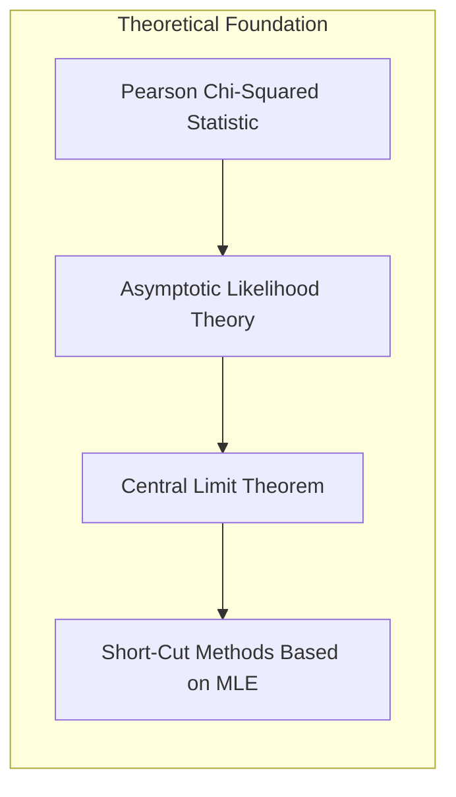
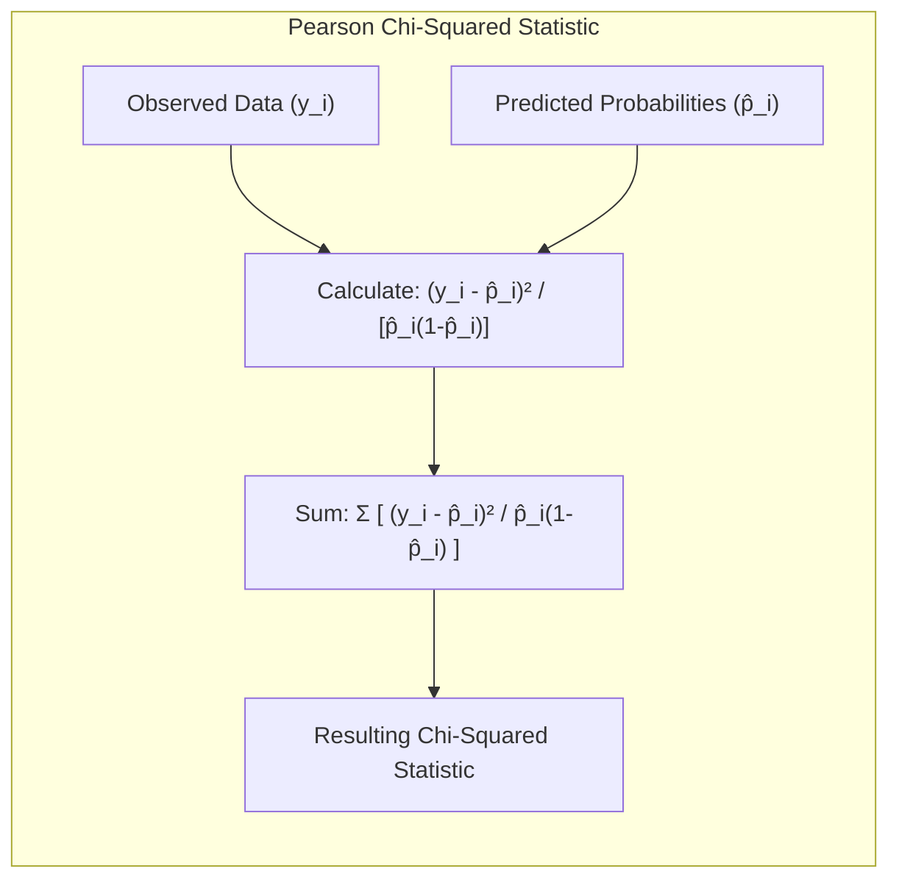
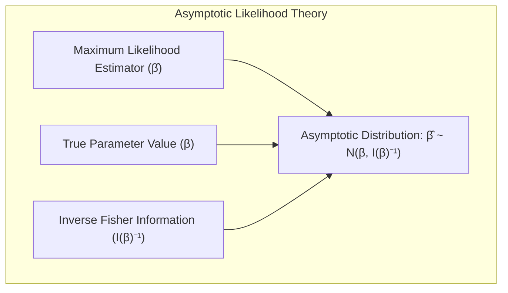
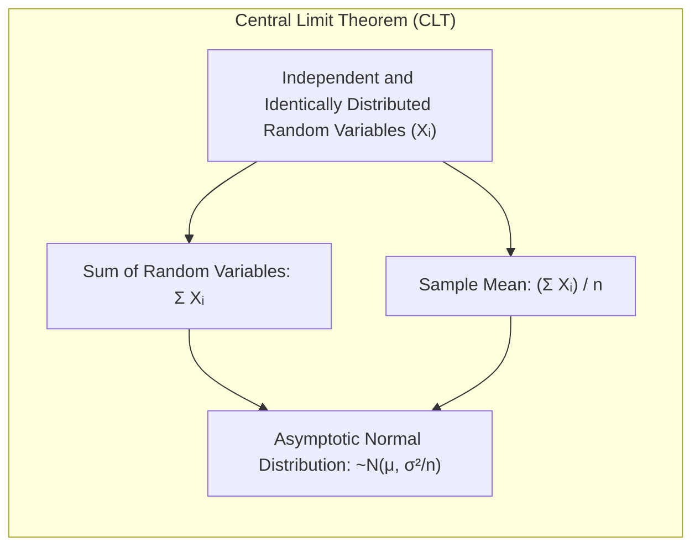
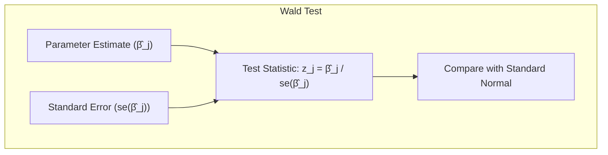
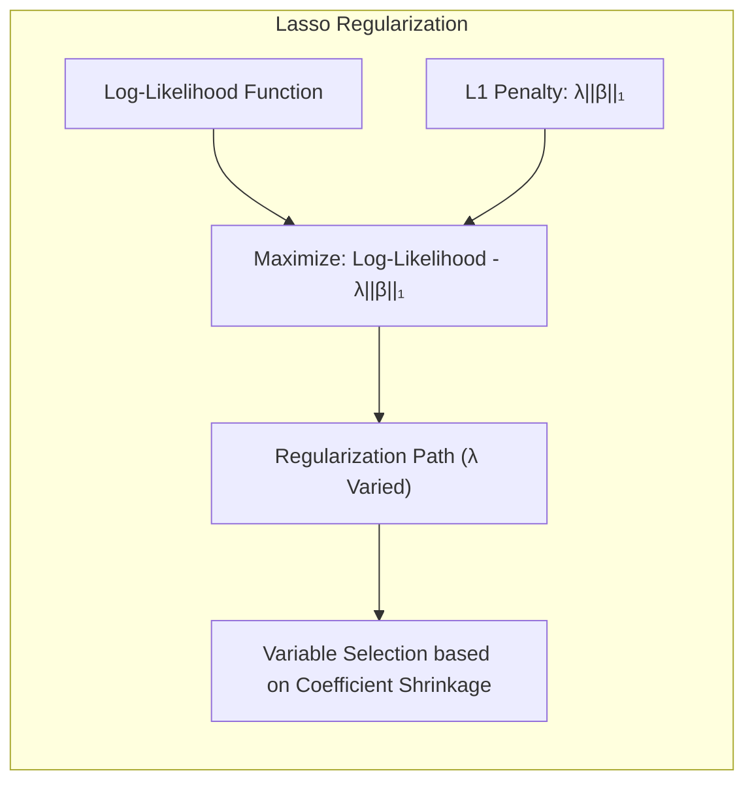
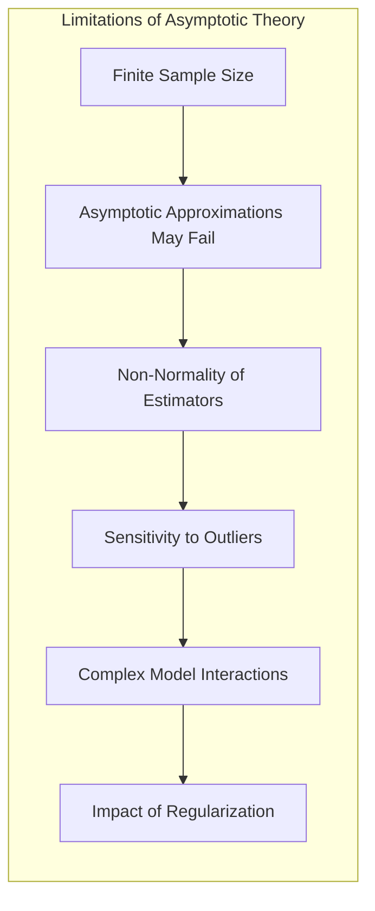
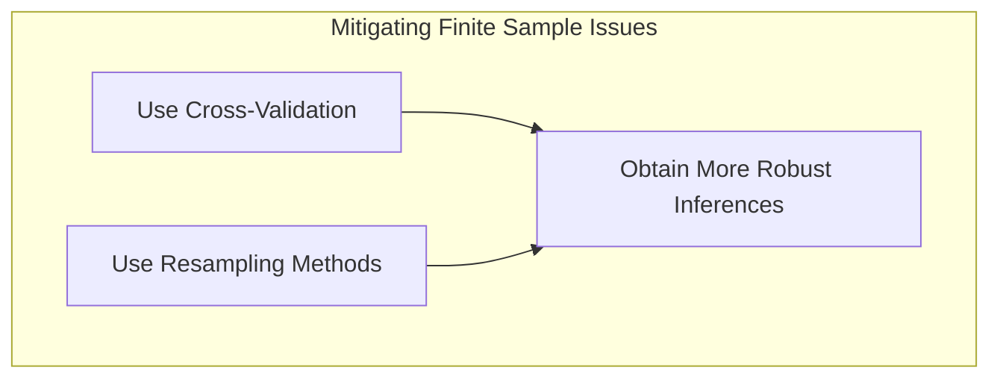

### A Estatística Qui-Quadrado de Pearson, Teoria Assintótica da Verossimilhança, Teorema do Limite Central e Métodos Abreviados Baseados em Máxima Verossimilhança



A análise de modelos logísticos e, mais amplamente, modelos lineares generalizados (GLMs), se beneficia de uma série de resultados teóricos e práticos que facilitam a interpretação, o ajuste e a inferência. A **estatística qui-quadrado de Pearson**, a **teoria assintótica da verossimilhança**, o **teorema do limite central** e os **métodos abreviados baseados em máxima verossimilhança** são ferramentas cruciais para o estudo e a aplicação desses modelos [^4.4.3].

A **estatística qui-quadrado de Pearson** é uma medida de discrepância entre os valores observados e os valores esperados sob um determinado modelo. Em modelos logísticos, essa estatística é calculada como a soma dos resíduos ponderados ao quadrado [^4.4.3]:

$$
    \chi^2 = \sum_{i=1}^N \frac{(y_i - \hat{p}_i)^2}{\hat{p}_i(1 - \hat{p}_i)}
$$

onde $y_i$ são as respostas observadas (0 ou 1) e $\hat{p}_i$ são as probabilidades estimadas pelo modelo. Essa estatística é uma aproximação quadrática para a deviance do modelo [^4.4.3]. Em particular, para modelos logísticos, o termo de ponderação $\hat{p}_i(1 - \hat{p}_i)$ é o valor da variância da resposta binária, avaliada no valor da probabilidade estimada.

> 💡 **Exemplo Numérico:**
>
> Suponha que temos um modelo logístico ajustado a um conjunto de dados com 5 observações. As respostas observadas ($y_i$) e as probabilidades estimadas ($\hat{p}_i$) são:
>
> | i | $y_i$ | $\hat{p}_i$ |
> |---|---|---|
> | 1 | 1 | 0.8 |
> | 2 | 0 | 0.3 |
> | 3 | 1 | 0.9 |
> | 4 | 0 | 0.1 |
> | 5 | 1 | 0.6 |
>
> Podemos calcular a estatística qui-quadrado de Pearson como:
>
> $\chi^2 = \frac{(1 - 0.8)^2}{0.8(1-0.8)} + \frac{(0 - 0.3)^2}{0.3(1-0.3)} + \frac{(1 - 0.9)^2}{0.9(1-0.9)} + \frac{(0 - 0.1)^2}{0.1(1-0.1)} + \frac{(1 - 0.6)^2}{0.6(1-0.6)}$
>
> $\chi^2 = \frac{0.04}{0.16} + \frac{0.09}{0.21} + \frac{0.01}{0.09} + \frac{0.01}{0.09} + \frac{0.16}{0.24}$
>
> $\chi^2 = 0.25 + 0.4286 + 0.1111 + 0.1111 + 0.6667 = 1.5675$
>
> Este valor de $\chi^2$ pode ser comparado com uma distribuição qui-quadrado com graus de liberdade iguais a $N - p$, onde $N$ é o número de observações e $p$ é o número de parâmetros do modelo. Se o valor de $\chi^2$ for muito grande em relação aos valores esperados da distribuição qui-quadrado, isso indica que o modelo não se ajusta bem aos dados.

A estatística qui-quadrado de Pearson pode ser usada para avaliar a qualidade do ajuste do modelo. Sob a hipótese de que o modelo é correto, essa estatística tem uma distribuição assintótica qui-quadrado, com graus de liberdade iguais à diferença entre o número de observações e o número de parâmetros do modelo.



A **teoria assintótica da verossimilhança** fornece resultados importantes sobre o comportamento das estimativas de máxima verossimilhança (MLEs) quando o tamanho da amostra tende ao infinito. Essa teoria estabelece que as MLEs são consistentes, ou seja, elas convergem para o verdadeiro valor do parâmetro quando o tamanho da amostra aumenta, e assintoticamente normais [^4.4.3]. A distribuição normal assintótica do MLE é dada por:

$$
    \hat{\beta} \sim N(\beta, I(\beta)^{-1})
$$

onde $\hat{\beta}$ é o estimador de máxima verossimilhança, $\beta$ é o verdadeiro valor do parâmetro e $I(\beta)$ é a matriz de informação de Fisher. Essa teoria nos permite usar a distribuição normal para construir intervalos de confiança para os parâmetros e realizar testes de hipóteses sobre os mesmos [^4.4.3].

> 💡 **Exemplo Numérico:**
>
> Suponha que, após ajustar um modelo de regressão logística, obtivemos o seguinte estimador de máxima verossimilhança para um parâmetro $\beta_1$: $\hat{\beta}_1 = 0.75$, e que a informação de Fisher inversa para esse parâmetro é $I(\beta_1)^{-1} = 0.09$. Segundo a teoria assintótica da verossimilhança, podemos aproximar a distribuição de $\hat{\beta}_1$ como uma normal com média $\beta_1$ (o verdadeiro valor, desconhecido) e variância 0.09.
>
>  Podemos então construir um intervalo de confiança de 95% para $\beta_1$ usando a distribuição normal:
>
>  $IC_{95\%} = \hat{\beta}_1 \pm 1.96 \times \sqrt{I(\beta_1)^{-1}} = 0.75 \pm 1.96 \times \sqrt{0.09} = 0.75 \pm 1.96 \times 0.3 = 0.75 \pm 0.588$
>
>  $IC_{95\%} = [0.162, 1.338]$
>
> Este intervalo nos diz que, com 95% de confiança, o verdadeiro valor de $\beta_1$ está entre 0.162 e 1.338.



O **teorema do limite central (TLC)** é um resultado fundamental da teoria das probabilidades que estabelece que a soma (ou média) de um número grande de variáveis aleatórias independentes e identicamente distribuídas (i.i.d.) tende a seguir uma distribuição normal, independentemente da distribuição original das variáveis. O TLC fornece a base teórica para a distribuição assintótica normal dos estimadores de máxima verossimilhança e para muitas outras aplicações em estatística. Em particular, a distribuição dos scores (derivada da log-verossimilhança) e dos estimadores de máxima verossimilhança são assintoticamente normais, o que permite derivar a distribuição da estatística qui-quadrado de Pearson e a estatística z (Wald) [^4.4.3].



A partir dos resultados assintóticos da teoria da verossimilhança, é possível derivar métodos abreviados que facilitam a realização de testes de hipóteses e a construção de intervalos de confiança sem a necessidade de ajustar modelos completos e iterativos. Entre os métodos abreviados, temos os testes de **Wald** e de **score** (ou de razão de verossimilhança) [^4.4.3].

O **teste de Wald** se baseia na estatística z, que compara o estimador do parâmetro $\hat{\beta}$ com a hipótese nula, levando em consideração o seu erro padrão:

$$
    z_j = \frac{\hat{\beta}_j}{se(\hat{\beta}_j)}
$$

Essa estatística possui uma distribuição assintótica normal padrão sob a hipótese nula. Já o teste de *score*, avalia a estatística do score do modelo (derivada da verossimilhança) sob a hipótese nula. Esses testes são aproximações aos testes de razão de verossimilhança.

> 💡 **Exemplo Numérico:**
>
> Suponha que queremos testar a hipótese nula $H_0: \beta_1 = 0$ contra a hipótese alternativa $H_1: \beta_1 \ne 0$. Após o ajuste do modelo, obtemos $\hat{\beta}_1 = 0.5$ e o erro padrão $se(\hat{\beta}_1) = 0.2$. A estatística de Wald é:
>
> $z_1 = \frac{0.5}{0.2} = 2.5$
>
> O valor-p associado a esta estatística, usando a distribuição normal padrão, é $2 \times P(Z > 2.5) \approx 0.0124$.  Se o nível de significância ($\alpha$) for 0.05, rejeitamos a hipótese nula, pois o valor-p é menor que $\alpha$. Isso indica que $\beta_1$ é estatisticamente diferente de zero.



**Lemma 14:** *A estatística qui-quadrado de Pearson, sob a hipótese de que o modelo é correto, possui uma distribuição assintótica qui-quadrado com graus de liberdade dados pela diferença entre o tamanho da amostra e o número de parâmetros do modelo*.

*Prova:* Esse resultado é obtido a partir da teoria assintótica da verossimilhança e do teorema do limite central, mostrando que a soma dos resíduos padronizados tem uma distribuição qui-quadrado. [^4.4.3] $\blacksquare$

**Corolário 14:** *Os testes de Wald e score são alternativas computacionalmente mais eficientes aos testes de razão de verossimilhança, pois não exigem o ajuste de um modelo completo, sendo úteis para a seleção de modelos.*

*Prova:* Os testes de Wald e score, por serem baseados na distribuição assintótica normal e na teoria da verossimilhança, podem ser calculados com as estimativas dos parâmetros de um modelo mais simples, evitando o ajuste iterativo de modelos mais complexos. [^4.4.3] $\blacksquare$

A estatística qui-quadrado de Pearson, a teoria assintótica da verossimilhança, o teorema do limite central e os métodos abreviados de testes de hipóteses são ferramentas essenciais para a análise estatística de modelos logísticos e lineares generalizados, permitindo inferências válidas e eficientes.

### Exemplo: Análise de Dados de Doenças Cardíacas da África do Sul com Regularização e Modelos Aditivos


Vamos aplicar os conceitos discutidos neste capítulo ao conjunto de dados sobre doenças cardíacas da África do Sul, mencionado em [^4.4.2], e já explorado em exemplos anteriores. Este exemplo visa demonstrar a utilização conjunta de regularização e modelos aditivos.

**Regularização L1 (Lasso) e Seleção de Variáveis:**

Inicialmente, vamos aplicar a regularização L1 (Lasso) para realizar seleção de variáveis no modelo logístico. A função de log-verossimilhança, juntamente com a penalidade L1, é maximizada para encontrar os coeficientes do modelo, com o parâmetro $\lambda$ determinando o nível de esparsidade. O caminho da regularização é avaliado para observar o comportamento dos coeficientes à medida que $\lambda$ varia [^4.4.4]. Variáveis com coeficientes que encolhem mais rapidamente em direção a zero são consideradas menos importantes e podem ser removidas do modelo. Podemos usar validação cruzada para selecionar um valor de $\lambda$ que maximize a acurácia ou outra métrica de desempenho do modelo.

> 💡 **Exemplo Numérico:**
>
> Suponha que aplicamos o Lasso a um modelo logístico com 5 preditores e observamos o seguinte comportamento dos coeficientes para diferentes valores de $\lambda$:
>
> | $\lambda$ | $\beta_1$ | $\beta_2$ | $\beta_3$ | $\beta_4$ | $\beta_5$ |
> |---|---|---|---|---|---|
> | 0.01 | 0.80 | -0.50 | 0.30 | 0.20 | -0.15 |
> | 0.10 | 0.55 | -0.20 | 0.10 | 0.05 | -0.02 |
> | 0.50 | 0.20 | -0.05 | 0.00 | 0.00 | 0.00 |
> | 1.00 | 0.00 | 0.00 | 0.00 | 0.00 | 0.00 |
>
> Observamos que $\beta_3$, $\beta_4$ e $\beta_5$ encolhem para zero mais rapidamente do que $\beta_1$ e $\beta_2$ à medida que $\lambda$ aumenta. Isso sugere que os preditores associados a $\beta_3$, $\beta_4$ e $\beta_5$ podem ser menos importantes para o modelo e podem ser removidos. Usando validação cruzada, podemos selecionar um valor de $\lambda$ (por exemplo, $\lambda=0.10$) que oferece um bom equilíbrio entre a complexidade do modelo e o desempenho preditivo.
>
> ```python
> import numpy as np
> import matplotlib.pyplot as plt
> from sklearn.linear_model import LogisticRegression
> from sklearn.model_selection import train_test_split, cross_val_score
> from sklearn.preprocessing import StandardScaler
> from sklearn.pipeline import Pipeline
>
> # Simulação de dados (substituir pelos dados reais)
> np.random.seed(42)
> X = np.random.rand(100, 5)
> y = np.random.randint(0, 2, 100)
>
> # Dividir os dados em treino e teste
> X_train, X_test, y_train, y_test = train_test_split(X, y, test_size=0.3, random_state=42)
>
> # Definir um pipeline com padronização e regressão logística com regularização L1
> pipeline = Pipeline([
>     ('scaler', StandardScaler()),
>     ('lasso', LogisticRegression(penalty='l1', solver='liblinear', random_state=42))
> ])
>
> # Definir os valores de lambda a serem testados
> lambdas = np.logspace(-3, 1, 10)
>
> # Inicializar listas para armazenar os scores
> scores = []
> coefs = []
>
> for lam in lambdas:
>     pipeline.set_params(lasso__C=1/lam)
>     cv_scores = cross_val_score(pipeline, X_train, y_train, cv=5, scoring='accuracy')
>     scores.append(np.mean(cv_scores))
>     pipeline.fit(X_train, y_train)
>     coefs.append(pipeline.named_steps['lasso'].coef_.flatten())
>
> # Plotar os scores de validação cruzada
> plt.figure(figsize=(10, 5))
> plt.plot(lambdas, scores)
> plt.xscale('log')
> plt.xlabel('Lambda (Regularization Strength)')
> plt.ylabel('Mean Cross-Validation Accuracy')
> plt.title('Cross-Validation Accuracy vs. Lambda')
> plt.grid(True)
> plt.show()
>
> # Plotar os coeficientes ao longo dos valores de lambda
> coefs = np.array(coefs)
> plt.figure(figsize=(10, 5))
> for i in range(X.shape[1]):
>    plt.plot(lambdas, coefs[:, i], label=f'Beta {i+1}')
> plt.xscale('log')
> plt.xlabel('Lambda (Regularization Strength)')
> plt.ylabel('Coefficient Value')
> plt.title('Lasso Regularization Path')
> plt.legend()
> plt.grid(True)
> plt.show()
> ```



**Modelos Aditivos para Flexibilidade:**

Para permitir uma modelagem mais flexível da relação entre os preditores e a resposta, vamos considerar modelos aditivos. Funções não lineares para cada preditor podem ser modeladas com splines ou outros métodos de *smoothing*. Por exemplo, a relação entre idade e a probabilidade de ocorrência de infarto do miocárdio pode ser modelada com uma spline para capturar um efeito não linear da idade sobre a resposta. O backfitting é utilizado para otimizar as funções não lineares do modelo aditivo.

**Interpretação e Resultados:**

Após o ajuste dos modelos, os coeficientes obtidos pela regressão logística com Lasso podem ser interpretados em termos de *odds ratios*, como discutido em seções anteriores. As funções não lineares obtidas pelos modelos aditivos podem ser visualizadas para entender o efeito das variáveis no risco de ocorrência de infarto do miocárdio. Avaliamos a qualidade do ajuste dos modelos por meio da deviance e de outras métricas de desempenho, bem como a avaliação da generalização através de validação cruzada e outras técnicas.

A combinação de regularização e modelos aditivos permite a construção de modelos mais precisos e interpretáveis para os dados de doenças cardíacas da África do Sul. A regularização L1 realiza seleção de variáveis, enquanto os modelos aditivos fornecem flexibilidade para modelar relações não lineares.

### Pergunta Teórica Avançada: Quais as limitações da Teoria Assintótica da Verossimilhança em Problemas de Classificação com Amostras Finitas?

**Resposta:**

A **teoria assintótica da verossimilhança** oferece um arcabouço poderoso para a inferência em modelos estatísticos, incluindo aqueles utilizados para classificação. No entanto, é essencial reconhecer que essa teoria se baseia em suposições que podem não ser completamente válidas em **problemas de classificação com amostras finitas**, ou seja, onde o tamanho da amostra é limitado [^4.4.3]. Essas limitações podem levar a resultados inferenciais menos precisos e à necessidade de abordagens alternativas para a avaliação de modelos.

**Principais Limitações:**

1.  **Aproximações Assintóticas:** A teoria assintótica se baseia na ideia de que o tamanho da amostra tende ao infinito. Na prática, as amostras são sempre finitas, e as aproximações podem não ser válidas, principalmente quando o tamanho da amostra é pequeno ou quando o número de parâmetros no modelo é comparável ao tamanho da amostra. Intervalos de confiança e testes de hipótese podem ser imprecisos nesses cenários [^4.4.3].

2.  **Normalidade dos Estimadores:** A teoria assintótica assume que os estimadores de máxima verossimilhança seguem uma distribuição normal assintoticamente. Em amostras finitas, a distribuição pode ser distorcida ou possuir caudas pesadas, levando a inferências errôneas. Em cenários com poucos eventos de uma classe (por exemplo, raros casos de doenças em estudos epidemiológicos), a normalidade assintótica pode não ser uma boa aproximação.

3.  **Sensibilidade a Outliers:** A estimação de máxima verossimilhança é sensível a outliers, que podem distorcer as estimativas dos parâmetros e comprometer a validade da teoria assintótica. Em amostras finitas, essa sensibilidade pode ser mais pronunciada do que em amostras grandes.

4.  **Escolha do Nível de Significância:** A escolha do nível de significância $\alpha$ nos testes de hipótese é arbitrária, e os testes se baseiam em resultados assintóticos. Em amostras finitas, a interpretação dos resultados deve ser feita com cautela, e outros critérios podem ser considerados, como o tamanho do efeito e a importância prática dos resultados.

5.  **Interações Complexas:** A teoria assintótica pode não se aplicar bem a modelos com muitas interações entre variáveis ou com relações não lineares complexas. Em amostras finitas, o ajuste de modelos mais complexos pode levar ao overfitting e resultados pouco confiáveis.

6.  **Efeitos da Regularização:** A regularização, que é frequentemente utilizada para melhorar o desempenho de modelos e reduzir o overfitting, pode impactar as propriedades assintóticas dos estimadores. A teoria assintótica, em alguns casos, não é diretamente aplicável a modelos regularizados.

7.  **Validação Cruzada:** Em amostras finitas, a validação cruzada é preferível para obter uma estimativa mais precisa do desempenho do modelo, e para seleção de parâmetros (como o parâmetro de regularização $\lambda$).

8.  **Dados Complexos:** Em problemas de classificação com dados de alta dimensionalidade ou estruturas complexas, a validade da teoria assintótica é ainda mais questionável. Nesses casos, métodos como o *bootstrap* e outras abordagens de reamostragem podem ser utilizados para obter resultados inferenciais mais confiáveis.

> 💡 **Exemplo Numérico:**
>
> Imagine que estamos construindo um modelo de classificação para prever se um paciente tem uma doença rara. Temos uma amostra de 100 pacientes, onde apenas 5 têm a doença (classe positiva). Nesse cenário, a teoria assintótica pode não ser muito precisa. Por exemplo, um intervalo de confiança para um parâmetro construído com base na distribuição normal assintótica pode ser muito amplo ou deslocado, devido ao pequeno número de casos positivos. Além disso, a estimativa do erro padrão pode ser instável. Nesses casos, métodos como o *bootstrap* podem fornecer uma estimativa mais robusta da incerteza dos parâmetros.



**Lemma 15:** *A teoria assintótica da verossimilhança baseia-se na premissa de que o tamanho da amostra tende ao infinito, e suas aproximações podem não ser válidas em amostras finitas, o que pode levar a estimativas imprecisas de parâmetros, intervalos de confiança e testes de hipóteses.*

*Prova:* As aproximações assintóticas se tornam mais precisas quanto maior o tamanho da amostra, sendo, por definição, uma aproximação para o caso limite. $\blacksquare$

**Corolário 15:** *Em problemas de classificação com amostras finitas, o uso de validação cruzada e métodos de reamostragem é recomendado para avaliar o desempenho do modelo e obter inferências mais robustas.*

*Prova:* A validação cruzada e o bootstrap, ao utilizarem subamostras dos dados originais, permitem uma estimativa mais precisa do desempenho em dados não vistos e são menos dependentes das aproximações assintóticas. $\blacksquare$



Em resumo, embora a teoria assintótica da verossimilhança seja uma ferramenta fundamental para a inferência em modelos de classificação, suas limitações em problemas com amostras finitas devem ser levadas em conta. O uso de métodos de validação e reamostragem, juntamente com a interpretação cautelosa dos resultados, são essenciais para garantir a robustez das análises e conclusões obtidas.

### Conclusão

Neste capítulo, exploramos a estatística qui-quadrado de Pearson, a teoria assintótica da verossimilhança, o teorema do limite central e os métodos abreviados baseados em máxima verossimilhança. A estatística qui-quadrado de Pearson, como aproximação da deviance, fornece uma maneira de avaliar a qualidade do ajuste do modelo. A teoria assintótica da verossimilhança e o teorema do limite central sustentam a distribuição dos estimadores de máxima verossimilhança, permitindo inferências sobre os parâmetros. Os métodos abreviados como o teste de Wald e os testes de score facilitam a realização de testes de hipóteses sem a necessidade de ajustar modelos iterativamente. Exploramos como o Lasso e a regularização L1, integrados ao algoritmo IRLS, permitem realizar seleção de variáveis em modelos logísticos. Apresentamos também como modelos aditivos podem ser usados para modelar relações não lineares entre preditores e resposta. E, finalmente, discutimos as limitações da teoria assintótica da verossimilhança em amostras finitas e a importância de abordagens alternativas, como a validação cruzada. Em conjunto, os conceitos apresentados neste capítulo fornecem uma base sólida para o estudo e a aplicação de métodos de classificação lineares e suas generalizações.

### Footnotes

[^4.1]: "In this chapter we revisit the classification problem and focus on linear methods for classification. Since our predictor G(x) takes values in a discrete set G, we can always divide the input space into a collection of regions labeled according to the classification. We saw in Chapter 2 that the boundaries of these regions can be rough or smooth, depending on the prediction function. For an important class of procedures, these decision boundaries are linear; this is what we will mean by linear methods for classification." *(Trecho de "The Elements of Statistical Learning")*

[^4.3]: "Linear discriminant analysis (LDA) arises in the special case when we assume that the classes have a common covariance matrix Σk = ∑. In comparing two classes k and l, it is sufficient to look at the log-ratio, and we see that" *(Trecho de "The Elements of Statistical Learning")*

[^4.4]: "The logistic regression model arises from the desire to model the posterior probabilities of the K classes via linear functions in x, while at the same time ensuring that they sum to one and remain in [0,1]." *(Trecho de "The Elements of Statistical Learning")*

[^4.4.2]: "At this stage the analyst might do some model selection; find a subset of the variables that are sufficient for explaining their joint effect on the prevalence of chd. One way to proceed by is to drop the least significant co- efficient, and refit the model. This is done repeatedly until no further terms can be dropped from the model. This gave the model shown in Table 4.3." *(Trecho de "The Elements of Statistical Learning")*

[^4.4.3]: "The weighted residual sum-of-squares is the familiar Pearson chi-square statistic a quadratic approximation to the deviance" *(Trecho de "The Elements of Statistical Learning")*

[^4.4.4]:  "The L₁ penalty used in the lasso (Section 3.4.2) can be used for variable selection and shrinkage with any linear regression model. For logistic regression, we would maximize a penalized version of (4.20):" *(Trecho de "The Elements of Statistical Learning")*

[^4.4.5]: "As with the lasso, we typically do not penalize the intercept term, and standardize the predictors for the penalty to be meaningful. Criterion (4.31) is concave, and a solution can be found using nonlinear programming methods (Koh et al., 2007, for example)." *(Trecho de "The Elements of Statistical Learning")*
