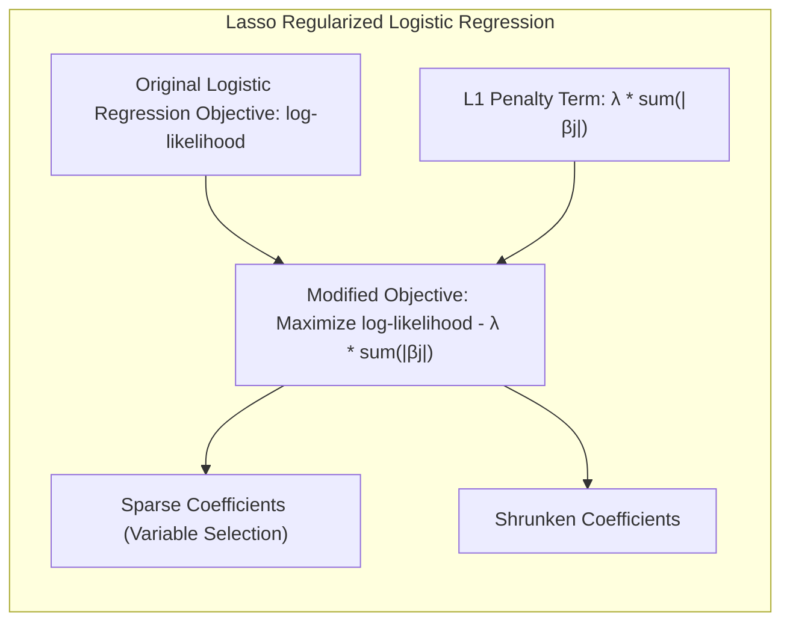
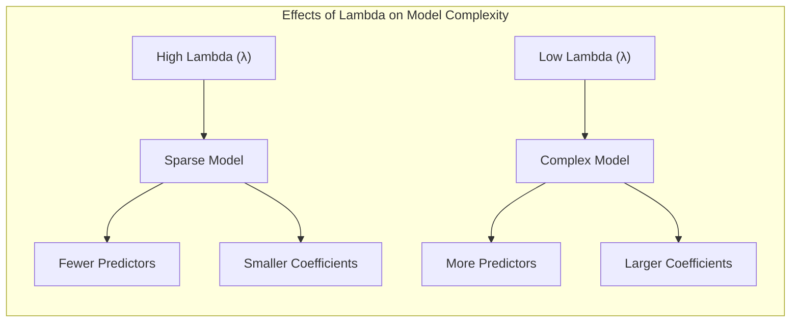
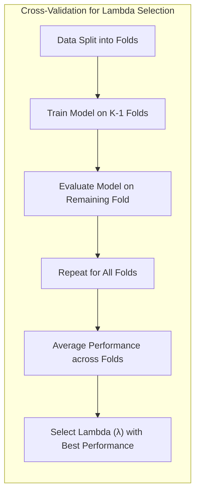
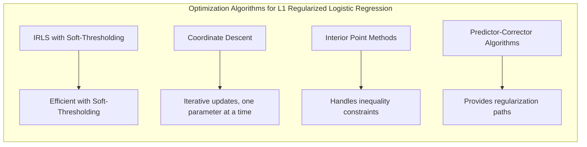
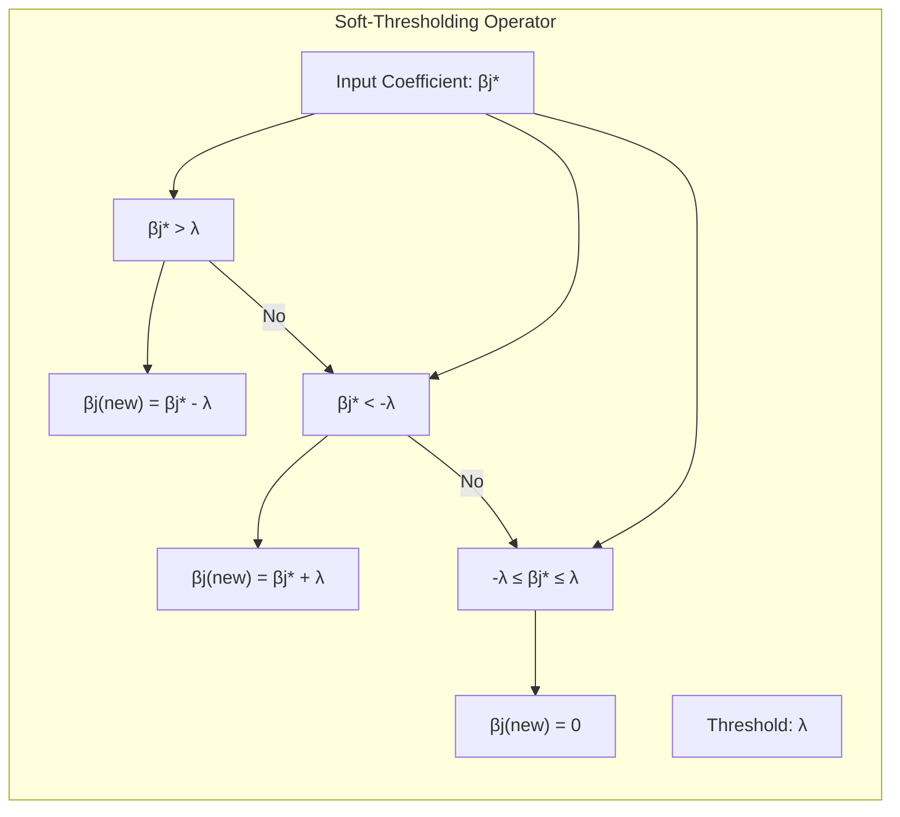

### Uso da Penalidade Lasso em Regressão Logística para Seleção de Variáveis e *Shrinkage* e uma Modificação do Problema de Otimização da Regressão Logística



A **penalidade Lasso (L1)** é uma ferramenta poderosa para a seleção de variáveis e o *shrinkage* de coeficientes em modelos de regressão, e sua aplicação na **regressão logística** oferece uma forma eficiente de lidar com a complexidade e o *overfitting* em problemas de classificação. A penalidade Lasso modifica o problema de otimização da regressão logística, adicionando um termo de penalização à função de custo, que encoraja a esparsidade nos coeficientes do modelo.

Em sua forma padrão, a regressão logística busca maximizar a função de log-verossimilhança condicional [^4.4.1]:

$$
    \ell(\beta) = \sum_{i=1}^N \left[ y_i (\beta_0 + \beta^T x_i) - \log(1 + e^{\beta_0 + \beta^T x_i}) \right]
$$

onde $y_i$ é a resposta binária (0 ou 1), $x_i$ é o vetor de preditores, e $\beta_0$ e $\beta$ são os coeficientes do modelo. O problema de otimização é encontrar os valores de $\beta_0$ e $\beta$ que maximizam a verossimilhança dos dados observados.

Ao introduzir a penalidade Lasso, o problema de otimização é modificado para:

$$
     \max_{\beta_0, \beta} \left\{ \sum_{i=1}^N \left[ y_i (\beta_0 + \beta^T x_i) - \log(1 + e^{\beta_0 + \beta^T x_i})\right] - \lambda \sum_{j=1}^p |\beta_j| \right\}
$$

onde $\lambda$ é o parâmetro de regularização que controla a intensidade da penalidade. A penalidade Lasso é dada pela soma dos valores absolutos dos coeficientes $|\beta_j|$. Note que o intercepto $\beta_0$ normalmente não é penalizado, e que é uma prática comum que as variáveis preditoras sejam previamente padronizadas, de forma que todos os preditores tenham um impacto similar no modelo [^4.4.4].

> 💡 **Exemplo Numérico:**
>
> Suponha que temos um conjunto de dados com 10 amostras e 3 preditores ($x_1$, $x_2$, $x_3$). As respostas binárias $y_i$ são [1, 0, 1, 1, 0, 1, 0, 0, 1, 1] e os preditores padronizados são dados pela matriz X:
> ```
> X = np.array([
>    [0.5, -0.2, 0.1],
>    [-0.1, 0.4, -0.3],
>    [0.3, 0.1, 0.2],
>    [0.2, -0.3, 0.4],
>    [-0.4, 0.2, -0.1],
>    [0.6, 0.3, 0.2],
>    [-0.2, -0.1, -0.4],
>    [-0.3, 0.5, 0.1],
>    [0.4, -0.2, 0.3],
>    [0.1, 0.1, -0.2]
> ])
> ```
>
> Inicialmente, sem a penalidade Lasso (i.e., $\lambda = 0$), podemos obter os coeficientes $\beta$ usando um algoritmo de otimização padrão para regressão logística. Suponha que obtemos os coeficientes iniciais:
>
> $\beta_0 = 0.2$
> $\beta = [0.8, -0.5, 0.3]$
>
> Agora, introduzimos a penalidade Lasso, por exemplo, com $\lambda = 0.1$. A função de otimização se torna:
>
> $$
>     \max_{\beta_0, \beta} \left\{ \sum_{i=1}^{10} \left[ y_i (\beta_0 + \beta^T x_i) - \log(1 + e^{\beta_0 + \beta^T x_i})\right] - 0.1 \sum_{j=1}^3 |\beta_j| \right\}
> $$
>
> Após a otimização com a penalidade Lasso, os coeficientes podem mudar. Suponha que os novos coeficientes sejam:
>
> $\beta_0 = 0.25$
> $\beta = [0.65, -0.3, 0.0]$
>
> Note que o coeficiente $\beta_3$ foi forçado a zero, indicando que o preditor $x_3$ foi considerado menos relevante pelo modelo com a penalidade. Os outros coeficientes também tiveram seus valores reduzidos (shrinkage).

Essa modificação do problema de otimização leva a algumas mudanças importantes no comportamento do modelo:

1.  **Seleção de Variáveis:** A penalidade L1 tende a gerar modelos *esparsos*, onde alguns coeficientes $\beta_j$ são forçados a exatamente zero [^4.4.4]. Isso tem o efeito de realizar seleção de variáveis, eliminando os preditores menos relevantes e mantendo apenas os mais informativos no modelo.

2.  **Shrinkage:** Os coeficientes que não são forçados a zero são encolhidos, ou seja, sua magnitude é reduzida. Isso ajuda a diminuir a variância das estimativas e a melhorar a capacidade de generalização do modelo [^4.4.4].

3.  **Complexidade do Modelo:** O parâmetro $\lambda$ controla o trade-off entre o ajuste do modelo aos dados e a complexidade do modelo. Valores maiores de $\lambda$ resultam em modelos mais esparsos e coeficientes menores, enquanto valores menores de $\lambda$ permitem modelos mais complexos. A escolha do valor de $\lambda$ é geralmente feita por validação cruzada ou outros métodos de seleção de modelos [^4.4.5].



A penalidade L1, ao contrário da penalidade L2 (Ridge), que também encolhe os coeficientes, mas não os força a zero, oferece uma forma automática de realizar seleção de variáveis, o que é útil em cenários onde há um grande número de preditores ou quando a interpretabilidade do modelo é importante.

No contexto do algoritmo **IRLS**, a penalidade L1 pode ser incorporada utilizando métodos de *soft-thresholding* [^4.4.4]. O operador de *soft-thresholding* é aplicado aos coeficientes estimados após cada iteração do IRLS, forçando-os a zero se sua magnitude for menor que o parâmetro de regularização. Essa abordagem combina a eficiência computacional do IRLS com a capacidade de seleção de variáveis da penalidade L1.

**Lemma 16:** *A modificação do problema de otimização da regressão logística pela adição da penalidade Lasso (L1) leva a modelos esparsos, com coeficientes iguais a zero, e permite a seleção automática de variáveis.*

*Prova:* A penalidade L1 penaliza o valor absoluto dos coeficientes, o que leva a uma solução onde alguns coeficientes são zerados para minimizar a função de custo. Esse mecanismo é fundamental para a seleção de variáveis. [^4.4.4] $\blacksquare$

**Corolário 16:** *A integração da penalidade Lasso ao algoritmo IRLS permite a otimização da regressão logística regularizada com L1, utilizando a eficiência do IRLS e os efeitos de seleção de variáveis do Lasso.*

*Prova:* Ao utilizar o operador de soft-thresholding ou outras formas de incorporar a penalidade L1 no algoritmo IRLS, é possível obter a solução para a regressão logística regularizada com Lasso de forma eficiente. [^4.4.4] $\blacksquare$

A penalidade Lasso oferece uma abordagem poderosa e versátil para ajustar modelos logísticos, permitindo a seleção de variáveis, o *shrinkage* dos coeficientes e o melhoramento da capacidade de generalização do modelo.

### Caminhos de Regularização e o Parâmetro Lambda


O **caminho de regularização** é um conceito fundamental na análise de modelos regularizados, como a regressão logística com penalidade Lasso. O caminho de regularização se refere ao conjunto de soluções do modelo, ou seja, os valores dos coeficientes $\beta$, obtidos para diferentes valores do parâmetro de regularização $\lambda$. Ao variar $\lambda$, é possível observar como os coeficientes do modelo são afetados e como a complexidade do modelo se altera [^4.4.4].

Em regressão logística com penalidade Lasso, o parâmetro $\lambda$ controla o trade-off entre o ajuste aos dados e a complexidade do modelo. Valores maiores de $\lambda$ resultam em modelos mais esparsos, com um menor número de variáveis preditoras, e coeficientes de menor magnitude. Valores menores de $\lambda$ resultam em modelos mais complexos, com mais variáveis preditoras e coeficientes maiores. A escolha do valor ideal de $\lambda$ é essencial para o bom desempenho do modelo.

O caminho de regularização é geralmente visualizado como um gráfico que mostra a variação dos coeficientes do modelo em função de $\lambda$. No gráfico, cada linha representa o comportamento de um coeficiente, e os pontos no gráfico indicam o valor do coeficiente para um determinado valor de $\lambda$. O caminho de regularização oferece *insights* sobre a importância relativa das variáveis preditoras no modelo e sobre a complexidade do modelo para diferentes valores de $\lambda$.

Em particular, o caminho da regularização pode mostrar:

*   **Variáveis Selecionadas:** As variáveis cujos coeficientes permanecem diferentes de zero para um intervalo maior de valores de $\lambda$ são consideradas mais importantes, enquanto variáveis cujos coeficientes são zerados rapidamente são menos relevantes.

*   **Shrinkage:** O caminho da regularização ilustra como a magnitude dos coeficientes é reduzida à medida que $\lambda$ aumenta.

*   **Estabilidade:** A estabilidade dos coeficientes em relação a pequenas mudanças em $\lambda$ pode ser avaliada através da análise do caminho da regularização.

A análise do caminho da regularização é um passo importante no processo de modelagem, ajudando a escolher um valor de $\lambda$ que maximize o desempenho do modelo em dados não vistos.

> 💡 **Exemplo Numérico:**
>
> Continuando o exemplo anterior, vamos analisar o caminho de regularização para o nosso conjunto de dados. Suponha que tenhamos calculado os coeficientes $\beta$ para diferentes valores de $\lambda$ usando um algoritmo de otimização apropriado. Os resultados podem ser visualizados em um gráfico, onde o eixo x representa o valor de $\lambda$ e o eixo y representa os valores dos coeficientes.
>
> | λ    | β₀    | β₁    | β₂    | β₃    |
> |------|-------|-------|-------|-------|
> | 0.00 | 0.20  | 0.80  | -0.50 | 0.30  |
> | 0.05 | 0.22  | 0.70  | -0.40 | 0.15  |
> | 0.10 | 0.25  | 0.65  | -0.30 | 0.00  |
> | 0.15 | 0.28  | 0.50  | -0.20 | 0.00  |
> | 0.20 | 0.30  | 0.40  | -0.10 | 0.00  |
> | 0.25 | 0.32  | 0.30  | 0.00  | 0.00  |
> | 0.30 | 0.35  | 0.20  | 0.00  | 0.00  |
>
> Observamos que:
>
> - Para $\lambda = 0$, todos os coeficientes são diferentes de zero.
> - À medida que $\lambda$ aumenta, os coeficientes são reduzidos (shrinkage).
> - O coeficiente $\beta_3$ é o primeiro a ser zerado, indicando que o preditor $x_3$ é menos importante.
> - O coeficiente $\beta_2$ é o segundo a ser zerado, indicando que o preditor $x_2$ é o segundo menos importante.
> - O coeficiente $\beta_1$ persiste por mais tempo, indicando que o preditor $x_1$ é o mais importante.
>
> Este caminho de regularização nos permite visualizar a importância relativa de cada preditor e escolher um valor apropriado de $\lambda$ com base na complexidade desejada para o modelo.
>
> ```mermaid
> graph LR
>     A[λ=0.00] --> B(β1=0.80, β2=-0.50, β3=0.30)
>     B --> C[λ=0.05]
>     C --> D(β1=0.70, β2=-0.40, β3=0.15)
>     D --> E[λ=0.10]
>     E --> F(β1=0.65, β2=-0.30, β3=0.00)
>     F --> G[λ=0.15]
>     G --> H(β1=0.50, β2=-0.20, β3=0.00)
>     H --> I[λ=0.20]
>     I --> J(β1=0.40, β2=-0.10, β3=0.00)
>     J --> K[λ=0.25]
>     K --> L(β1=0.30, β2=0.00, β3=0.00)
>     L --> M[λ=0.30]
>     M --> N(β1=0.20, β2=0.00, β3=0.00)
>
>     style A fill:#f9f,stroke:#333,stroke-width:2px
>     style N fill:#ccf,stroke:#333,stroke-width:2px
> ```

A escolha do valor ideal de $\lambda$ é frequentemente realizada através de **validação cruzada**. Na validação cruzada, os dados são divididos em partes, e o modelo é treinado em uma parte e avaliado em outra. Esse processo é repetido várias vezes, e o valor de $\lambda$ que leva ao melhor desempenho médio é selecionado. Outros métodos de seleção de modelo também podem ser utilizados, tais como o critério de informação de Akaike (AIC) e o critério de informação Bayesiano (BIC).



A escolha de $\lambda$ por validação cruzada busca encontrar o melhor trade-off entre o ajuste aos dados e a complexidade do modelo. Um modelo com um valor de $\lambda$ muito baixo pode resultar em *overfitting*, e um modelo com um valor de $\lambda$ muito alto pode resultar em *underfitting*. O valor ótimo de $\lambda$ é aquele que maximiza a capacidade de generalização do modelo. O gráfico do caminho de regularização permite a visualização de como a complexidade do modelo é afetada pela escolha de $\lambda$, auxiliando na interpretação do resultado final.

**Lemma 17:** *O caminho de regularização do Lasso, obtido pela variação do parâmetro $\lambda$, fornece uma representação visual da variação dos coeficientes do modelo e da complexidade do modelo*.

*Prova:* Ao variar o parâmetro $\lambda$, o caminho da regularização revela como os coeficientes variam e como as variáveis são selecionadas (ou eliminadas) pelo Lasso.  $\blacksquare$

**Corolário 17:** *A validação cruzada é uma ferramenta importante para a escolha do valor ótimo do parâmetro de regularização $\lambda$ na regressão logística com penalidade Lasso, pois ajuda a encontrar o melhor trade-off entre o ajuste aos dados e a complexidade do modelo*.

*Prova:* A validação cruzada permite avaliar o desempenho do modelo em dados não vistos e escolher o valor de $\lambda$ que maximiza o desempenho do modelo. $\blacksquare$

O caminho de regularização e a escolha do parâmetro $\lambda$ por validação cruzada são ferramentas essenciais na análise de modelos logísticos com penalidade Lasso, permitindo o ajuste de modelos robustos e interpretáveis.

### Algoritmos para Otimização da Regressão Logística com Penalidade L1



A otimização da regressão logística com penalidade L1 (Lasso) envolve a busca dos parâmetros $\beta$ e $\beta_0$ que maximizam a função de log-verossimilhança penalizada:

$$
    \max_{\beta_0, \beta} \left\{ \sum_{i=1}^N \left[ y_i (\beta_0 + \beta^T x_i) - \log(1 + e^{\beta_0 + \beta^T x_i})\right] - \lambda \sum_{j=1}^p |\beta_j| \right\}
$$

A presença do termo de penalização L1 torna o problema de otimização não diferenciável na origem, o que dificulta a aplicação de algoritmos de otimização tradicionais. Vários algoritmos foram desenvolvidos para resolver esse problema, com diferentes níveis de eficiência e complexidade.

1.  **IRLS com Soft-Thresholding:** Uma das abordagens mais comuns para incorporar a penalidade L1 na regressão logística é modificar o algoritmo **Iteratively Reweighted Least Squares (IRLS)**, adicionando um passo de *soft-thresholding* após cada iteração do IRLS [^4.4.4]. O algoritmo IRLS padrão é utilizado para atualizar os coeficientes, como descrito em seções anteriores. Após a obtenção das novas estimativas $\beta_j^*$, o operador de *soft-thresholding* é aplicado para obter as novas estimativas regularizadas $\beta_j$:

    $$
        \beta_j^{(new)} =
        \begin{cases}
            \beta_j^* - \lambda & \text{se } \beta_j^* > \lambda \\
            \beta_j^* + \lambda & \text{se } \beta_j^* < -\lambda \\
            0 & \text{se } -\lambda \leq \beta_j^* \leq \lambda
        \end{cases}
    $$

    O operador de *soft-thresholding* força a zero os coeficientes que estão dentro do intervalo $(-\lambda, \lambda)$, o que promove a esparsidade do modelo.

    > 💡 **Exemplo Numérico:**
    >
    > Suponha que, em uma iteração do IRLS, obtivemos as seguintes estimativas para os coeficientes:
    >
    > $\beta_1^* = 0.6$
    > $\beta_2^* = -0.2$
    > $\beta_3^* = 0.05$
    >
    > E que o parâmetro de regularização $\lambda = 0.1$. Aplicando o operador de *soft-thresholding*:
    >
    > - Para $\beta_1^* = 0.6$, como $0.6 > 0.1$, temos $\beta_1^{(new)} = 0.6 - 0.1 = 0.5$.
    > - Para $\beta_2^* = -0.2$, como $-0.2 < -0.1$, temos $\beta_2^{(new)} = -0.2 + 0.1 = -0.1$.
    > - Para $\beta_3^* = 0.05$, como $-0.1 \leq 0.05 \leq 0.1$, temos $\beta_3^{(new)} = 0$.
    >
    > O coeficiente $\beta_3$ é zerado, promovendo a esparsidade do modelo.



2.  **Coordinate Descent:** Os **métodos de coordinate descent** são uma classe de algoritmos iterativos que otimizam a função objetivo ao atualizar um parâmetro de cada vez, mantendo os demais fixos. Na regressão logística com penalidade L1, o *coordinate descent* atualiza iterativamente cada coeficiente $\beta_j$, resolvendo o problema de otimização unidimensional com a penalidade L1. Em cada passo, a otimização é feita mantendo todos os outros coeficientes fixos [^4.4.5]. O algoritmo coordena a atualização dos coeficientes em um processo iterativo até que a convergência seja alcançada. A forma como cada coeficiente é atualizado pode envolver uma aproximação quadrática e um operador de *soft-thresholding* na coordenada.

3.  **Métodos de Ponto Interior:** Os **métodos de ponto interior** são uma classe de algoritmos para otimização que resolvem problemas com restrições de desigualdade. No caso da regressão logística com penalidade L1, as restrições de desigualdade podem ser introduzidas para garantir que os coeficientes não sejam negativos (ou positivos). Essa abordagem, embora mais complexa, garante a convergência e pode ser mais eficiente para problemas com um grande número de parâmetros.

4.  **Algoritmos de Preditor-Corretor:** Métodos mais recentes para otimização da regressão logística com Lasso utilizam algoritmos de preditor-corretor. Esses métodos usam uma estimativa atual para prever o próximo passo de otimização e usam essa previsão para corrigir a trajetória de otimização, levando a resultados mais precisos. Esses métodos são úteis para obter caminhos de regularização, mostrando como os coeficientes se comportam com diferentes valores de $\lambda$ [^4.4.5].

A escolha do algoritmo para otimizar a regressão logística com penalidade L1 depende do tamanho do conjunto de dados, do número de parâmetros e dos recursos computacionais disponíveis. Métodos de *coordinate descent* são mais simples e rápidos, enquanto os métodos de ponto interior e preditor-corretor são mais complexos e podem ser mais eficientes em problemas grandes ou em cenários onde é necessária maior precisão.

**Lemma 18:** *O método IRLS modificado com soft-thresholding combina a eficiência computacional do IRLS com o mecanismo de seleção de variáveis do Lasso, levando a modelos logísticos esparsos*.

*Prova:* O operador de *soft-thresholding* aplicado aos coeficientes após cada iteração do IRLS força a esparsidade nos coeficientes, implementando a penalidade L1. [^4.4.4] $\blacksquare$

**Corolário 18:** *Os métodos de coordinate descent são eficientes para otimizar a regressão logística com penalidade L1 pois atualizam cada coeficiente separadamente, o que simplifica a otimização e permite a incorporação de penalidades L1 de forma direta.*

*Prova:* A atualização de cada coeficiente separadamente e em coordenadas simplifica o problema de otimização, e a aplicação de operadores de *soft-thresholding* permite obter os efeitos da penalização L1. [^4.4.5] $\blacksquare$

A escolha do algoritmo para otimização da regressão logística com penalidade L1 depende das características do problema e dos objetivos da análise, sendo a eficiência computacional um fator importante a ser considerado.

### Conclusão

Este capítulo abordou o uso da penalidade Lasso na regressão logística para seleção de variáveis e *shrinkage* dos coeficientes. A penalidade Lasso modifica o problema de otimização da regressão logística, resultando em modelos esparsos e com melhor capacidade de generalização. Exploramos o conceito do caminho da regularização e sua importância na seleção do parâmetro $\lambda$, e discutimos diferentes algoritmos para a otimização da regressão logística com penalidade L1. Os conceitos discutidos fornecem uma base teórica e prática para o uso da regularização L1 em modelos logísticos e uma compreensão mais profunda dos algoritmos de ajuste e do efeito do parâmetro de regularização no desempenho e interpretabilidade dos modelos.

### Footnotes

[^4.1]: "In this chapter we revisit the classification problem and focus on linear methods for classification. Since our predictor G(x) takes values in a discrete set G, we can always divide the input space into a collection of regions labeled according to the classification. We saw in Chapter 2 that the boundaries of these regions can be rough or smooth, depending on the prediction function. For an important class of procedures, these decision boundaries are linear; this is what we will mean by linear methods for classification." *(Trecho de "The Elements of Statistical Learning")*

[^4.3]: "Linear discriminant analysis (LDA) arises in the special case when we assume that the classes have a common covariance matrix Σk = ∑. In comparing two classes k and l, it is sufficient to look at the log-ratio, and we see that" *(Trecho de "The Elements of Statistical Learning")*

[^4.4]: "The logistic regression model arises from the desire to model the posterior probabilities of the K classes via linear functions in x, while at the same time ensuring that they sum to one and remain in [0,1]." *(Trecho de "The Elements of Statistical Learning")*

[^4.4.1]: "Logistic regression models are usually fit by maximum likelihood, using the conditional likelihood of G given X. Since Pr(G|X) completely specifies the conditional distribution, the multinomial distribution is appropriate. The log-likelihood for N observations is" *(Trecho de "The Elements of Statistical Learning")*

[^4.4.4]:  "The L₁ penalty used in the lasso (Section 3.4.2) can be used for variable selection and shrinkage with any linear regression model. For logistic regression, we would maximize a penalized version of (4.20):" *(Trecho de "The Elements of Statistical Learning")*

[^4.4.5]: "As with the lasso, we typically do not penalize the intercept term, and standardize the predictors for the penalty to be meaningful. Criterion (4.31) is concave, and a solution can be found using nonlinear programming methods (Koh et al., 2007, for example)." *(Trecho de "The Elements of Statistical Learning")*
