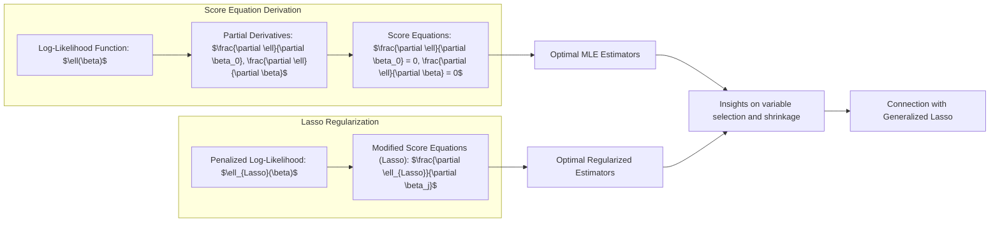
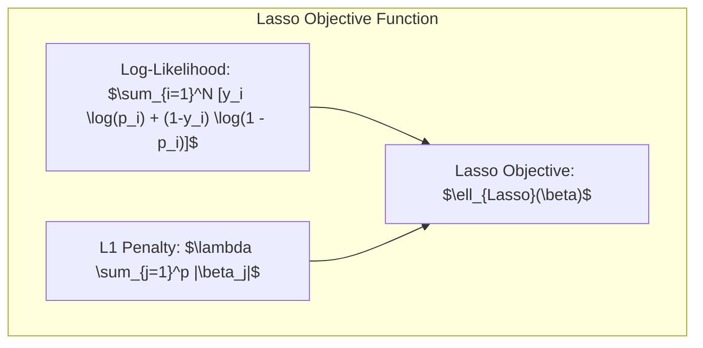
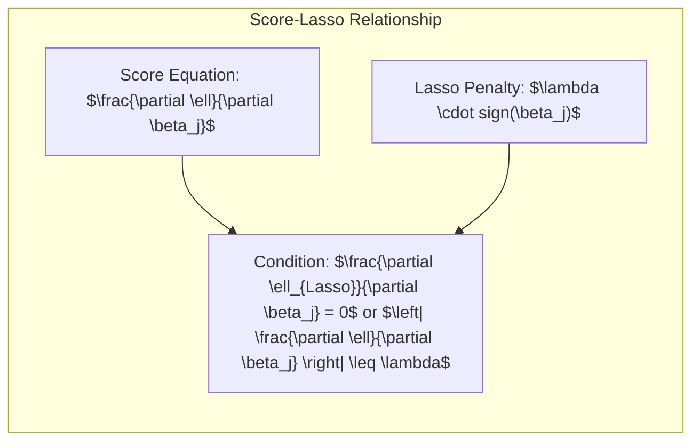
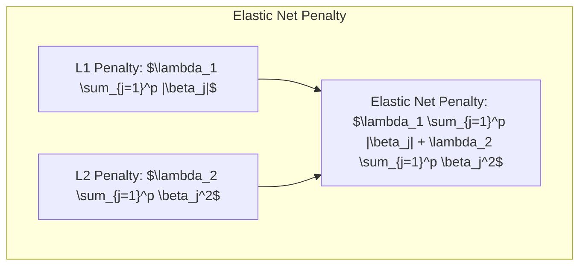
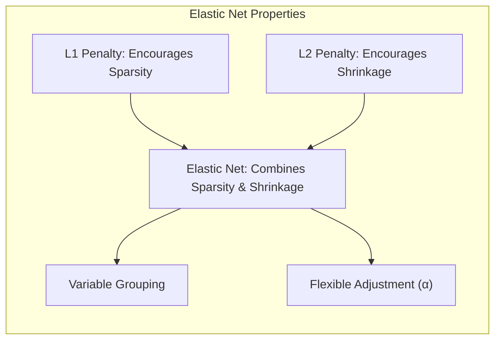
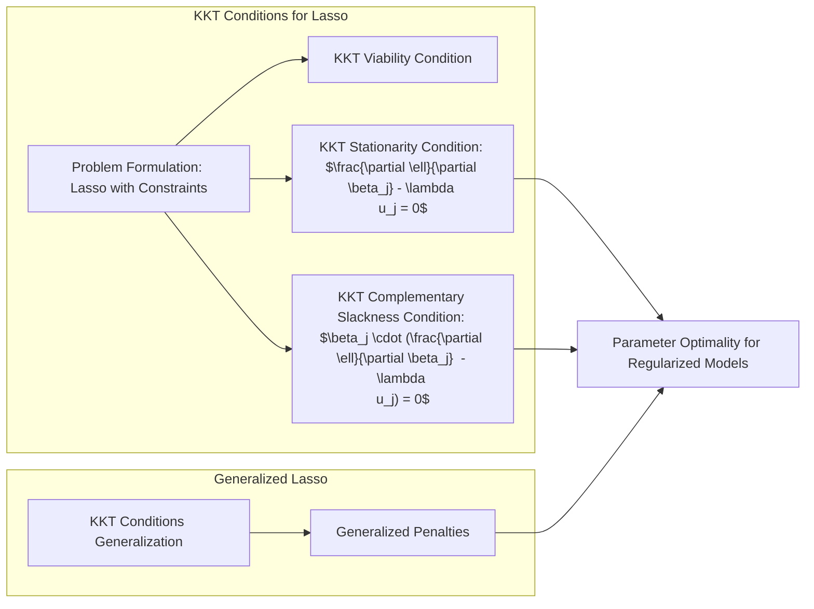

### Interpretação das Equações de *Score* e Relações com o Lasso Generalizado

As **equações de *score*** desempenham um papel central na otimização de modelos estatísticos, incluindo a regressão logística. Elas representam as derivadas da função de log-verossimilhança em relação aos parâmetros do modelo e fornecem as condições necessárias para encontrar os estimadores de máxima verossimilhança (MLEs). Na presença de regularização, como a penalidade Lasso, as equações de *score* são modificadas e podem nos fornecer *insights* importantes sobre o processo de seleção de variáveis e *shrinkage* de coeficientes. A relação das equações de *score* com o **Lasso Generalizado** nos permite entender melhor a conexão com outros métodos de regularização.

Em regressão logística, a função de log-verossimilhança é dada por:

$$
    \ell(\beta) = \sum_{i=1}^N [y_i \log(p_i) + (1-y_i) \log(1 - p_i)]
$$

onde $p_i = \frac{e^{\beta_0 + \beta^T x_i}}{1 + e^{\beta_0 + \beta^T x_i}}$ é a probabilidade estimada da classe positiva para a observação $i$. As equações de *score* são obtidas calculando as derivadas parciais da log-verossimilhança em relação aos parâmetros $\beta_0$ e $\beta$:

$$
    \frac{\partial \ell}{\partial \beta_0} = \sum_{i=1}^N (y_i - p_i)
$$

$$
    \frac{\partial \ell}{\partial \beta} = \sum_{i=1}^N x_i (y_i - p_i)
$$

Igualando as equações de *score* a zero, obtemos um sistema de equações não lineares que define as condições de otimalidade para os estimadores de máxima verossimilhança (MLEs) em modelos de regressão logística sem regularização. Na presença de penalidade L1, ou Lasso, a função objetivo é modificada:

$$
    \ell_{Lasso}(\beta) = \sum_{i=1}^N [y_i \log(p_i) + (1-y_i) \log(1 - p_i)] - \lambda \sum_{j=1}^p |\beta_j|
$$

onde $\lambda$ é o parâmetro de regularização que controla a intensidade da penalidade. As equações de *score* para os parâmetros $\beta$ são então modificadas:

$$
     \frac{\partial \ell_{Lasso}}{\partial \beta_j} = \sum_{i=1}^N x_{ij} (y_i - p_i) - \lambda \cdot \text{sign}(\beta_j) = 0 \text{ para } \beta_j \neq 0
$$

$$
     \frac{\partial \ell_{Lasso}}{\partial \beta_j} = \sum_{i=1}^N x_{ij} (y_i - p_i) \text{ e } \left| \sum_{i=1}^N x_{ij} (y_i - p_i) \right| \leq \lambda \text{ para } \beta_j = 0
$$

onde $\text{sign}(\beta_j)$ é o sinal do coeficiente $\beta_j$ (1 se $\beta_j > 0$, -1 se $\beta_j < 0$, e um valor entre -1 e 1 se $\beta_j = 0$). Essas equações de *score* revelam que, para coeficientes não nulos, o score (derivada da verossimilhança) iguala a penalidade $\lambda$ multiplicada pelo sinal do coeficiente. Se o score for menor que o valor da penalização, o coeficiente é zerado.

> 💡 **Exemplo Numérico:**
>
> Suponha que temos um modelo de regressão logística com dois preditores ($x_1$ e $x_2$) e um intercepto. Temos 5 observações e os seguintes valores:
>
> | i | $y_i$ | $x_{i1}$ | $x_{i2}$ |
> |---|---|---|---|
> | 1 | 1 | 2 | 3 |
> | 2 | 0 | 1 | 1 |
> | 3 | 1 | 3 | 2 |
> | 4 | 0 | 1 | 4 |
> | 5 | 1 | 2 | 2 |
>
> Após ajustar um modelo de regressão logística, obtemos os seguintes coeficientes (sem regularização):
>
> $\beta_0 = -0.5$
> $\beta_1 = 0.8$
> $\beta_2 = -0.3$
>
> As probabilidades estimadas $p_i$ são calculadas usando a função logística:
>
> $p_i = \frac{e^{\beta_0 + \beta_1 x_{i1} + \beta_2 x_{i2}}}{1 + e^{\beta_0 + \beta_1 x_{i1} + \beta_2 x_{i2}}}$
>
> Vamos calcular os scores para $\beta_1$ e $\beta_2$ sem regularização:
>
> $\frac{\partial \ell}{\partial \beta_1} = \sum_{i=1}^5 x_{i1} (y_i - p_i)$
> $\frac{\partial \ell}{\partial \beta_2} = \sum_{i=1}^5 x_{i2} (y_i - p_i)$
>
> Suponha que, após os cálculos, obtivemos:
>
> $\frac{\partial \ell}{\partial \beta_1} = 1.2$
> $\frac{\partial \ell}{\partial \beta_2} = -0.5$
>
> Agora, vamos aplicar a penalidade Lasso com $\lambda = 0.7$. As equações de *score* modificadas são:
>
> $\frac{\partial \ell_{Lasso}}{\partial \beta_1} = 1.2 - 0.7 \cdot \text{sign}(0.8) = 1.2 - 0.7 = 0.5$
> $\frac{\partial \ell_{Lasso}}{\partial \beta_2} = -0.5 - 0.7 \cdot \text{sign}(-0.3) = -0.5 - 0.7 \cdot (-1) = 0.2$
>
> Como os valores absolutos das derivadas com a penalidade são diferentes de zero, os coeficientes permanecem no modelo.
>
> Se $\lambda$ fosse 2.0, teríamos:
>
> $\frac{\partial \ell_{Lasso}}{\partial \beta_1} = 1.2 - 2.0 \cdot \text{sign}(0.8) = 1.2 - 2.0 = -0.8$. Como a derivada é diferente de zero, o coeficiente não é zerado.
>
> $\frac{\partial \ell_{Lasso}}{\partial \beta_2} = -0.5 - 2.0 \cdot \text{sign}(-0.3) = -0.5 - 2.0 \cdot (-1) = 1.5$.  Como a derivada é diferente de zero, o coeficiente não é zerado.
>
> Se, por exemplo, o score de $\beta_2$ fosse -0.3 sem regularização, com $\lambda = 0.7$ teríamos:
>
> $\frac{\partial \ell_{Lasso}}{\partial \beta_2} = -0.3 - 0.7 \cdot \text{sign}(-0.3) = -0.3 - 0.7 \cdot (-1) = 0.4$.  O coeficiente não é zerado.
>
> Agora, suponha que o score de $\beta_2$ fosse -0.2 sem regularização. Com $\lambda=0.7$ teríamos:
>
> $\frac{\partial \ell_{Lasso}}{\partial \beta_2} = -0.2 - 0.7 \cdot \text{sign}(-0.2) = -0.2 - 0.7 \cdot (-1) = 0.5$.  O coeficiente não é zerado.
>
> Se o score original de $\beta_2$ fosse -0.6, teríamos:
>
> $\frac{\partial \ell_{Lasso}}{\partial \beta_2} = -0.6 - 0.7 \cdot \text{sign}(-0.6) = -0.6 - 0.7 \cdot (-1) = 0.1$. O coeficiente não é zerado.
>
> Se o score original de $\beta_2$ fosse -0.8, teríamos:
>
> $\frac{\partial \ell_{Lasso}}{\partial \beta_2} = -0.8 - 0.7 \cdot \text{sign}(-0.8) = -0.8 - 0.7 \cdot (-1) = -0.1$.  O coeficiente não é zerado.
>
> No caso em que o score de $\beta_2$ sem regularização fosse -0.3 e aplicamos a penalização com $\lambda = 0.2$, teríamos:
>
> $\frac{\partial \ell_{Lasso}}{\partial \beta_2} = -0.3 - 0.2 \cdot \text{sign}(-0.3) = -0.3 - 0.2 \cdot (-1) = -0.1$ , o coeficiente não é zerado.
>
> No caso em que o score de $\beta_2$ sem regularização fosse -0.1 e aplicamos a penalização com $\lambda = 0.2$, teríamos:
>
> $\frac{\partial \ell_{Lasso}}{\partial \beta_2} = -0.1 - 0.2 \cdot \text{sign}(-0.1) = -0.1 - 0.2 \cdot (-1) = 0.1$. O coeficiente não é zerado.
>
> No caso em que o score de $\beta_2$ sem regularização fosse -0.15 e aplicamos a penalização com $\lambda = 0.2$, teríamos:
>
> $\frac{\partial \ell_{Lasso}}{\partial \beta_2} = -0.15 - 0.2 \cdot \text{sign}(-0.15) = -0.15 - 0.2 \cdot (-1) = 0.05$. O coeficiente não é zerado.
>
> No caso em que o score de $\beta_2$ sem regularização fosse 0.15 e aplicamos a penalização com $\lambda = 0.2$, teríamos:
>
> $\frac{\partial \ell_{Lasso}}{\partial \beta_2} = 0.15 - 0.2 \cdot \text{sign}(0.15) = 0.15 - 0.2 \cdot (1) = -0.05$. O coeficiente não é zerado.
>
> No caso em que o score de $\beta_2$ sem regularização fosse 0 e aplicamos a penalização com $\lambda = 0.2$, teríamos:
>
> $\left| \sum_{i=1}^N x_{i2} (y_i - p_i) \right| = 0 < 0.2$. Portanto, $\beta_2 = 0$.
>
> Este exemplo ilustra como a penalidade Lasso pode levar à esparsidade, zerando alguns coeficientes, dependendo do valor de $\lambda$ e do score da variável.

A interpretação das equações de *score* no contexto da penalidade L1 é crucial para entender a seleção de variáveis. Os preditores cujas equações de score não são zeradas pela penalidade permanecem no modelo. O valor de $\lambda$ determina quantos preditores permanecerão no modelo e o grau de *shrinkage* dos coeficientes.

A relação das equações de *score* com o **Lasso Generalizado** pode ser vista no contexto das condições de Karush-Kuhn-Tucker (KKT). O problema do Lasso pode ser visto como um caso especial de um problema de otimização convexo com restrições, e as condições de KKT fornecem um conjunto de condições necessárias para a solução ótima. As equações de *score* e as condições de complementariedade nas condições de KKT revelam uma relação direta com a penalidade L1:

$$
    \frac{\partial \ell}{\partial \beta_j} = \lambda \cdot v_j
$$

onde $v_j \in [-1,1]$. Em palavras, o score de cada variável deve estar dentro do intervalo da penalidade. Essa condição se reduz aos casos já apresentados, onde $\beta_j = 0$ se $|score_j| < \lambda$ e o score é igual a $\lambda \cdot \text{sign}(\beta_j)$ quando $\beta_j \neq 0$.

O **Lasso Generalizado** estende o Lasso a outros tipos de penalizações, como a penalização elástica (combinação de L1 e L2), penalidades com pesos diferentes para cada variável (Weighted Lasso), entre outros. As equações de *score* e as condições de KKT podem ser generalizadas para esses casos, permitindo uma análise mais ampla e flexível de modelos regularizados.

**Lemma 19:** *As equações de *score* para modelos de regressão logística com penalidade Lasso igualam a derivada da log-verossimilhança com um termo proporcional ao sinal do coeficiente, induzindo a esparsidade.*

*Prova:* A presença do termo $\lambda \cdot \text{sign}(\beta_j)$ na equação de *score* implica que o gradiente da função de verossimilhança deve se equilibrar com um múltiplo do sinal do coeficiente, levando a coeficientes nulos e *shrinkage*. [^4.4.4] $\blacksquare$

**Corolário 19:** *As condições de Karush-Kuhn-Tucker (KKT) fornecem uma base formal para entender as condições de otimalidade do Lasso, incluindo a relação entre os *scores*, os coeficientes e o parâmetro de regularização.*

*Prova:* As condições KKT estabelecem um conjunto de condições necessárias para a otimalidade em problemas de otimização convexa com restrições, incluindo o caso da regressão logística com penalidade L1. $\blacksquare$

A interpretação das equações de *score* e sua relação com o Lasso Generalizado oferece *insights* importantes para a compreensão dos modelos de regressão logística com penalidade L1 e suas propriedades de seleção de variáveis e *shrinkage*.

### Regularização Elástica e uma Generalização da Penalidade Lasso

A **regularização elástica** (*Elastic Net*) é uma generalização da penalidade Lasso que combina as penalidades L1 (Lasso) e L2 (Ridge) em um único termo de regularização [^4.5]. Essa abordagem visa combinar os benefícios da seleção de variáveis, fornecida pela penalidade L1, com a estabilidade da *shrinkage*, fornecida pela penalidade L2. A função objetivo da regressão logística com penalidade elástica é dada por:

$$
\ell_{ElasticNet}(\beta) = \sum_{i=1}^N [y_i \log(p_i) + (1-y_i) \log(1-p_i)] - \lambda_1 \sum_{j=1}^p |\beta_j| - \lambda_2 \sum_{j=1}^p \beta_j^2
$$

onde $\lambda_1$ e $\lambda_2$ são os parâmetros de regularização que controlam a intensidade da penalidade L1 e L2, respectivamente. O termo de penalidade elástica é uma combinação linear das penalidades L1 e L2, permitindo que a regularização seja feita de forma mais flexível e adaptável às características dos dados. O *Elastic Net* pode ser também escrito como:

$$
\ell_{ElasticNet}(\beta) = \sum_{i=1}^N [y_i \log(p_i) + (1-y_i) \log(1-p_i)] - \lambda \left[\alpha \sum_{j=1}^p |\beta_j| + (1 - \alpha) \sum_{j=1}^p \beta_j^2 \right]
$$

onde $\lambda = \lambda_1 + \lambda_2$ e $\alpha = \frac{\lambda_1}{\lambda_1 + \lambda_2}$ representa o balanço entre a penalidade L1 e L2. A escolha de $\alpha = 1$ resulta no Lasso, enquanto $\alpha = 0$ resulta no Ridge.

> 💡 **Exemplo Numérico:**
>
> Vamos usar o mesmo conjunto de dados do exemplo anterior, com os seguintes coeficientes obtidos sem regularização:
>
> $\beta_0 = -0.5$
> $\beta_1 = 0.8$
> $\beta_2 = -0.3$
>
> Suponha que queremos aplicar a regularização elástica com $\lambda = 1.0$ e $\alpha = 0.6$. Isso significa que $\lambda_1 = \lambda \cdot \alpha = 1.0 \cdot 0.6 = 0.6$ e $\lambda_2 = \lambda \cdot (1 - \alpha) = 1.0 \cdot (1 - 0.6) = 0.4$. A função objetivo com regularização elástica é:
>
> $\ell_{ElasticNet}(\beta) = \sum_{i=1}^N [y_i \log(p_i) + (1-y_i) \log(1-p_i)] - 0.6 \sum_{j=1}^p |\beta_j| - 0.4 \sum_{j=1}^p \beta_j^2$
>
> As equações de score para a regularização elástica são dadas por:
>
> $\frac{\partial \ell_{ElasticNet}}{\partial \beta_j} = \sum_{i=1}^N x_{ij} (y_i - p_i) - \lambda_1 \cdot \text{sign}(\beta_j) - 2\lambda_2 \beta_j$
>
> Vamos calcular as derivadas para $\beta_1$ e $\beta_2$. Usando os scores sem regularização do exemplo anterior:
>
> $\frac{\partial \ell}{\partial \beta_1} = 1.2$
> $\frac{\partial \ell}{\partial \beta_2} = -0.5$
>
> As derivadas com regularização elástica são:
>
> $\frac{\partial \ell_{ElasticNet}}{\partial \beta_1} = 1.2 - 0.6 \cdot \text{sign}(0.8) - 2 \cdot 0.4 \cdot 0.8 = 1.2 - 0.6 - 0.64 = -0.04$
>
> $\frac{\partial \ell_{ElasticNet}}{\partial \beta_2} = -0.5 - 0.6 \cdot \text{sign}(-0.3) - 2 \cdot 0.4 \cdot (-0.3) = -0.5 + 0.6 + 0.24 = 0.34$
>
> Observe que a penalidade elástica combina os efeitos da penalidade L1 (Lasso), que leva à esparsidade, e da penalidade L2 (Ridge), que leva ao *shrinkage*. O parâmetro $\alpha$ controla o balanço entre esses dois efeitos.
>
> Se $\alpha = 1$, teríamos o Lasso, e se $\alpha = 0$, teríamos o Ridge.
>
> Se $\alpha=0$, teríamos:
>
> $\frac{\partial \ell_{ElasticNet}}{\partial \beta_1} = 1.2  - 2 \cdot 1 \cdot 0.8 = 1.2 - 1.6 = -0.4$
>
> $\frac{\partial \ell_{ElasticNet}}{\partial \beta_2} = -0.5 - 2 \cdot 1 \cdot (-0.3) = -0.5 + 0.6 = 0.1$
>
> Se $\alpha=1$, teríamos:
>
> $\frac{\partial \ell_{ElasticNet}}{\partial \beta_1} = 1.2 - 1 \cdot \text{sign}(0.8) = 1.2 - 1 = 0.2$
>
> $\frac{\partial \ell_{ElasticNet}}{\partial \beta_2} = -0.5 - 1 \cdot \text{sign}(-0.3) = -0.5 + 1 = 0.5$
>
> Este exemplo mostra como a regularização elástica afeta os coeficientes, combinando os efeitos de esparsidade e *shrinkage*.

A regularização elástica oferece uma forma flexível de ajustar modelos logísticos e permite que o usuário explore o *trade-off* entre a esparsidade e a estabilidade dos coeficientes. As propriedades da penalidade elástica combinam as vantagens de ambas as penalidades:

1.  **Seleção de Variáveis:** A penalidade L1 encoraja a esparsidade, forçando alguns coeficientes a zero e, dessa forma, realizando seleção de variáveis.

2.  **Shrinkage:** A penalidade L2 reduz a magnitude dos coeficientes, aumentando a estabilidade e reduzindo a variância dos estimadores.

3.  **Agrupamento de Variáveis:** Em casos onde há multicolinearidade, a penalidade elástica tende a selecionar grupos de variáveis correlacionadas, mantendo a estabilidade do modelo e resolvendo o problema da instabilidade causado pela multicolinearidade.

4.  **Flexibilidade de Ajuste:** A penalidade elástica permite ajustar o balanço entre as penalidades L1 e L2 por meio do parâmetro $\alpha$, adaptando o modelo às características dos dados e às necessidades do problema.

O problema de otimização da regressão logística com penalidade elástica é mais complexo do que o problema com apenas penalidade L1 ou L2. Algoritmos de otimização específicos, como o *coordinate descent* modificado e métodos de ponto interior, são utilizados para encontrar as soluções dos modelos com regularização elástica. A escolha dos parâmetros $\lambda_1$ e $\lambda_2$ (ou $\lambda$ e $\alpha$) é realizada através de validação cruzada ou outras abordagens de seleção de modelos.

A penalidade elástica, por meio da combinação de L1 e L2, oferece uma abordagem mais versátil e robusta para a regularização de modelos logísticos e generalização da penalidade Lasso.

**Lemma 20:** *A penalidade elástica combina as propriedades de seleção de variáveis da penalidade L1 com a propriedade de *shrinkage* da penalidade L2, oferecendo um controle mais flexível da complexidade do modelo*.

*Prova:* A combinação linear das penalidades L1 e L2 permite que o modelo se beneficie tanto da esparsidade quanto do *shrinkage* de coeficientes. $\blacksquare$

**Corolário 20:** *A escolha do parâmetro $\alpha$ na penalidade elástica permite controlar o trade-off entre esparsidade e *shrinkage*, e assim adaptar o modelo às necessidades do problema.*

*Prova:* Valores maiores de $\alpha$ dão mais peso para a penalidade L1, levando a modelos mais esparsos, e valores menores dão mais peso para a penalidade L2, levando a modelos com maior *shrinkage*. $\blacksquare$

A regularização elástica fornece uma abordagem geral para a regularização de modelos logísticos e é uma ferramenta poderosa na construção de modelos robustos e interpretáveis.

### Conexão com o Generalized Lasso e Condições de KKT

A **conexão com o *Generalized Lasso* e as condições de Karush-Kuhn-Tucker (KKT)** oferece um arcabouço formal para entender o problema de otimização da regressão logística com penalidades como o Lasso e o *Elastic Net*, e como essas penalidades influenciam os parâmetros do modelo [^4.4.4]. As condições de KKT são um conjunto de condições necessárias para a otimalidade em problemas de otimização convexa com restrições.

No caso da regressão logística com penalidade Lasso, o problema de otimização pode ser visto como um problema de otimização com restrições de desigualdade, onde as restrições são dadas pelas penalidades. As condições de KKT estabelecem um conjunto de condições que devem ser satisfeitas na solução ótima do problema.

Para ilustrar, vamos considerar a regressão logística com penalidade Lasso:

$$
    \max_{\beta_0, \beta} \left\{ \sum_{i=1}^N \left[ y_i (\beta_0 + \beta^T x_i) - \log(1 + e^{\beta_0 + \beta^T x_i})\right] - \lambda \sum_{j=1}^p |\beta_j| \right\}
$$

As condições de KKT para esse problema incluem:

1.  **Viabilidade:** As restrições devem ser satisfeitas. Nesse caso, como a penalidade L1 é expressa como uma soma de valores absolutos, a viabilidade implica que os parâmetros $\beta_j$ são finitos.

2.  **Estacionariedade:** As derivadas parciais da função lagrangiana em relação aos parâmetros devem ser iguais a zero. A função lagrangiana é construída incluindo a função objetivo e as restrições com multiplicadores de Lagrange.

3.  **Folga Complementar:** O produto dos multiplicadores de Lagrange com as restrições deve ser igual a zero. Essa condição indica que as restrições ativas (onde a desigualdade se torna igualdade) têm multiplicadores de Lagrange diferentes de zero, e as restrições não ativas têm multiplicadores iguais a zero.

As condições de KKT, aplicadas ao problema da regressão logística com penalidade Lasso, podem ser expressas de forma mais formal:

*   Para cada coeficiente $\beta_j$, a condição de estacionariedade leva a:

    $$
      \frac{\partial \ell}{\partial \beta_j}  - \lambda \nu_j = 0
    $$

    onde $\frac{\partial \ell}{\partial \beta_j}$ é a derivada da log-verossimilhança sem regularização, e $\nu_j \in [-1,1]$. O termo $\lambda \nu_j$ representa o efeito da penalidade L1.

*   A condição de folga complementar implica:

    $$
      \beta_j \cdot (\frac{\partial \ell}{\partial \beta_j}  - \lambda \nu_j) = 0
    $$

    onde $\beta_j \neq 0$ implica que $\frac{\partial \ell}{\partial \beta_j} = \lambda \nu_j$ (a derivada da log-verossimilhança se iguala a um múltiplo da penalidade) e que $\beta_j = 0$ implica que $|\frac{\partial \ell}{\partial \beta_j}| \leq \lambda$.

> 💡 **Exemplo Numérico:**
>
> Vamos considerar novamente o exemplo anterior. Para simplificar, vamos analisar apenas o coeficiente $\beta_1$.
>
> Sem regularização, tínhamos $\frac{\partial \ell}{\partial \beta_1} = 1.2$.
>
> Com a penalidade Lasso e $\lambda = 0.7$, a condição de estacionariedade é:
>
> $1.2 - 0.7 \cdot \nu_1 = 0$
>
>  onde $\nu_1 \in [-1, 1]$.
>
>  Isso implica que $\nu_1 = \frac{1.2}{0.7} = 1.71$. Como $\nu_1$ deve estar entre -1 e 1, isso significa que o coeficiente não será zerado.
>
> A condição de folga complementar implica que:
>
> $\beta_1 \cdot (1.2 - 0.7 \cdot \nu_1) = 0$
>
> Como $\beta_1$ é diferente de 0, então $1.2 - 0.7 \cdot \nu_1 = 0$ e $\nu_1$ estará no limite do intervalo, ou seja $\nu_1 = sign(\beta_1)$.
>
> Se $\lambda = 2.0$, a condição de estacionariedade seria:
>
> $1.2 - 2.0 \cdot \nu_1 = 0$
>
>  Isso implica que $\nu_1 = \frac{1.2}{2.0} = 0.6$, que está dentro do intervalo [-1,1]. O coeficiente não é zerado.
>
>
> Se, por outro lado, $\frac{\partial \ell}{\partial \beta_1} = 0.5$ e $\lambda = 0.7$:
>
> $0.5 - 0.7 \cdot \nu_1 = 0$
>
>  Isso implica que $\nu_1 = \frac{0.5}{0.7} = 0.71$, que está dentro do intervalo [-1,1]. O coeficiente não é zerado.
>
> Se $\frac{\partial \ell}{\partial \beta_1} = 0.2$ e $\lambda = 0.7$:
>
> $0.2 - 0.7 \cdot \nu_1 = 0$
>
>  Isso implica que $\nu_1 = \frac{0.2}{0.7} = 0.28$, que está dentro do intervalo [-1,1]. O coeficiente não é zerado.
>
> Se $\frac{\partial \ell}{\partial \beta_1} = 0$ e $\lambda = 0.7$:
>
> $0 - 0.7 \cdot \nu_1 = 0$
>
>  Isso implica que $\nu_1 = 0$, que está dentro do intervalo [-1,1]. O coeficiente é zerado.
>
> Este exemplo ilustra como as condições de KKT formalizam a relação entre o score, o coeficiente e o parâmetro de regularização $\lambda$.

Essas condições revelam que, no ótimo, as variáveis com coeficientes diferentes de zero satisfazem uma condição de equilíbrio entre a verossimilhança e a penalidade, enquanto as variáveis com coeficientes iguais a zero não contribuem com a verossimilhança.

A conexão com o **Generalized Lasso** surge ao perceber que as condições de KKT podem ser utilizadas para derivar soluções para modelos com penalidades mais gerais. O *Generalized Lasso* permite a utilização de diferentes penalidades, incluindo a penalidade elástica, e as condições de KKT podem ser adaptadas a cada caso.

As condições de KKT são, portanto, um instrumento valioso para entender e derivar algoritmos de otimização para modelos logísticos regularizados e para analisar as propriedades de seus estimadores.

**Lemma 21:** *As condições de Karush-Kuhn-Tucker (KKT) fornecem um conjunto de condições necessárias que devem ser satisfeitas no ótimo de problemas de otimização convexa com restrições, incluindo o caso da regressão logística com penalidade L1 e L2*.

*Prova:* As condições de KKT derivam das condições de otimalidade para problemas de otimização com restrições de desigualdade. [^4.4.4] $\blacksquare$

**Corolário 21:** *As condições de KKT podem ser usadas para generalizar a penalidade Lasso a outras penalidades, como o Elastic Net, derivando algoritmos de otimiz
