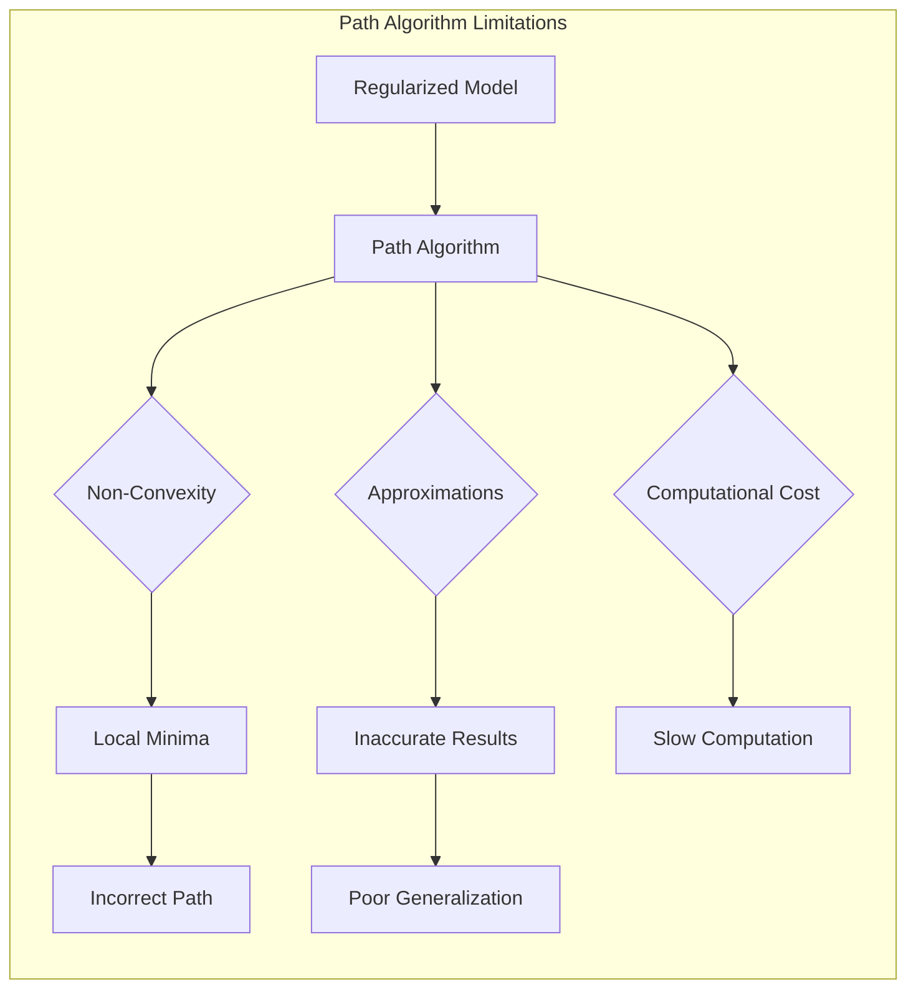
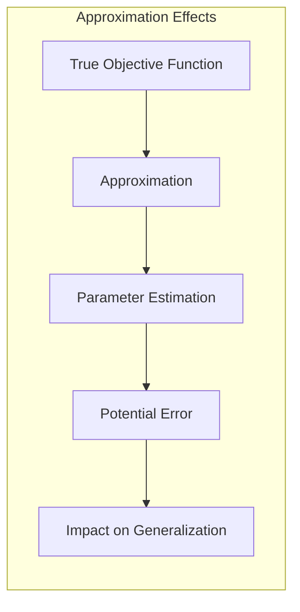
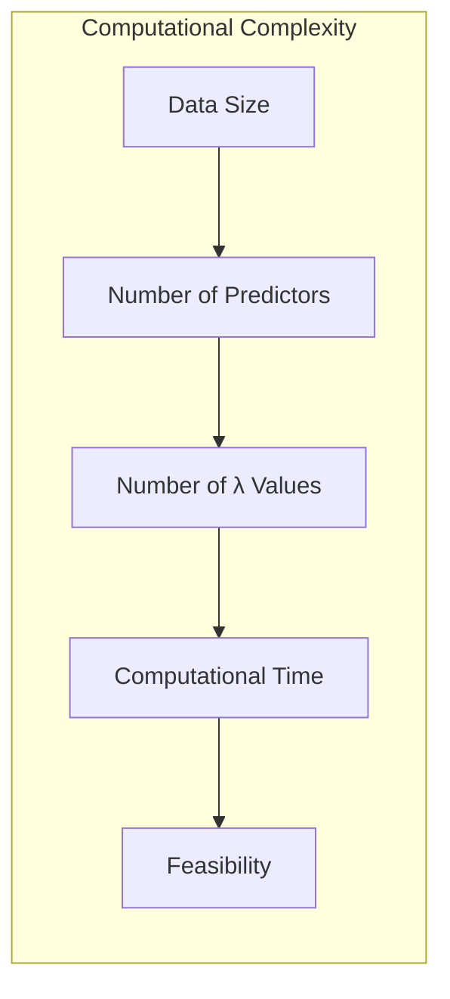
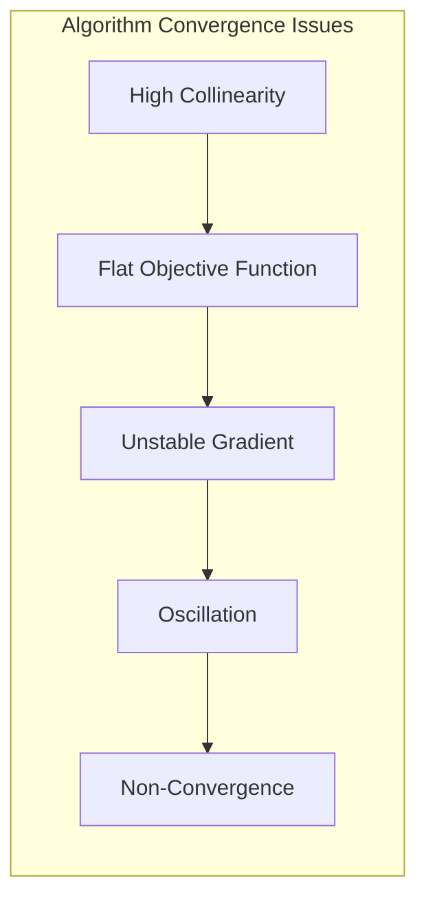
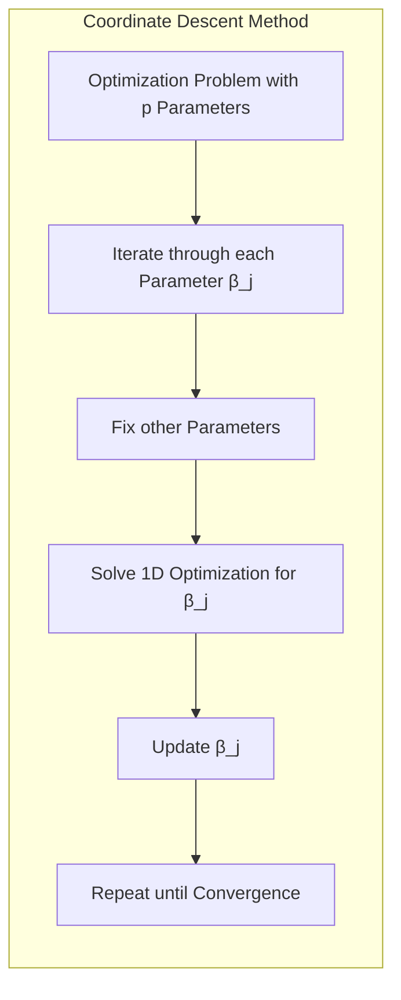
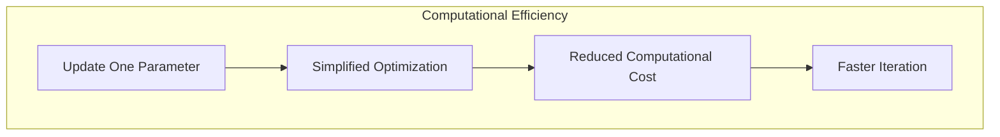
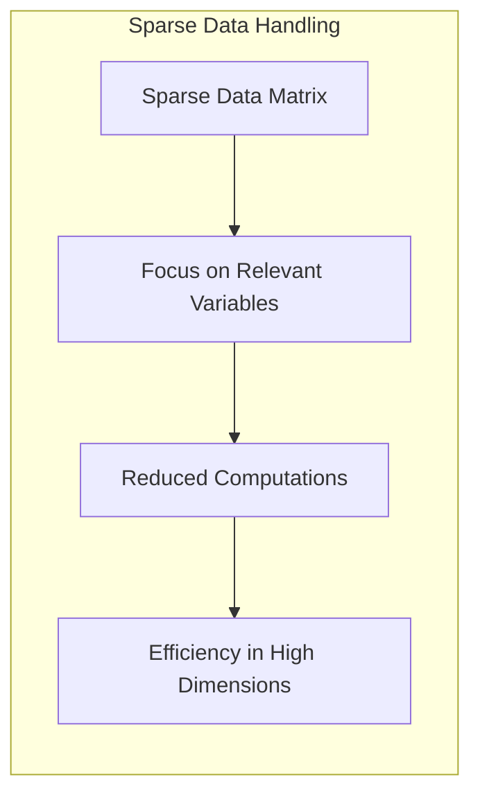
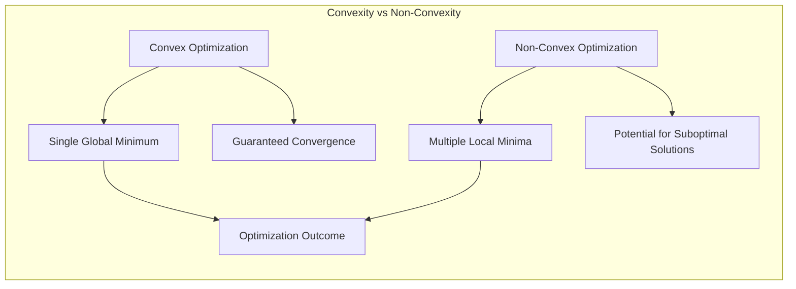
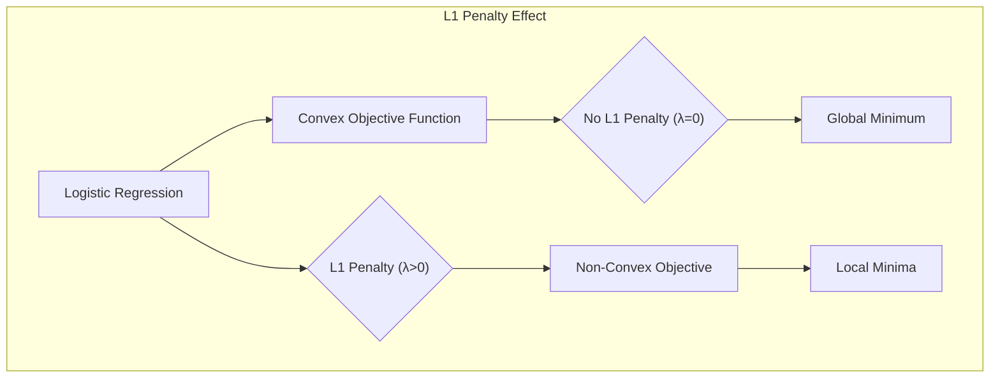
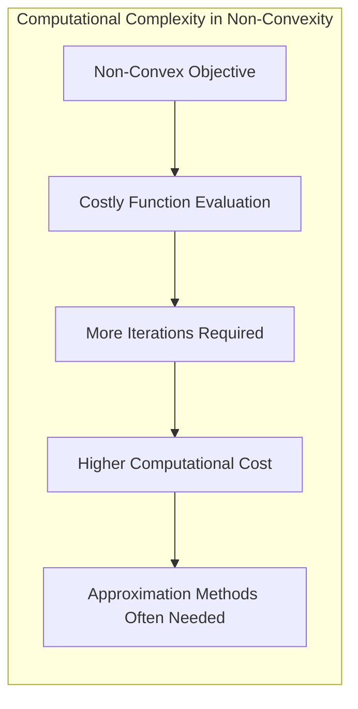

### Limitações dos Algoritmos de Caminho (Path Algorithms)

Os **algoritmos de caminho** (path algorithms) são métodos computacionais eficientes para encontrar as soluções de modelos regularizados, como a regressão logística com penalidade Lasso ou Elastic Net, ao longo de uma grade de valores do parâmetro de regularização $\lambda$. Embora esses algoritmos sejam poderosos e amplamente utilizados, eles possuem **limitações** importantes que precisam ser consideradas ao interpretarmos os resultados e avaliar a adequação do modelo.

Os algoritmos de caminho exploram o caminho da regularização, ou seja, como os coeficientes do modelo variam em função do parâmetro de regularização $\lambda$, encontrando soluções exatas ou aproximadas para uma sequência de valores de $\lambda$. Essa abordagem é particularmente útil quando o objetivo é entender o comportamento do modelo sob diferentes graus de regularização ou quando a seleção de um valor específico de $\lambda$ é um objetivo da análise [^4.4.5].

As principais limitações dos algoritmos de caminho incluem:

1.  **Não Convexidade:** Embora as funções objetivo da regressão logística e de outros modelos lineares generalizados sejam convexas em relação aos coeficientes, a adição da penalidade L1 (Lasso) ou Elastic Net torna o problema de otimização não diferenciável na origem, o que leva a um problema de otimização não-convexo. Embora os algoritmos de caminho sejam projetados para contornar essa não-convexidade, em alguns casos, eles podem convergir para mínimos locais, e não para o mínimo global da função objetivo. Nesses casos, o caminho da regularização encontrado pelo algoritmo pode não ser o caminho verdadeiro para o problema, especialmente se a função objetivo apresentar múltiplas regiões de mínimo local.

    > 💡 **Exemplo Numérico:**
    >
    > Imagine um problema de regressão logística com dois preditores ($x_1$ e $x_2$) e uma penalidade Lasso. A função objetivo é dada por:
    >
    >  $$J(\beta) = -\frac{1}{N} \sum_{i=1}^{N} [y_i \log(\sigma(\beta^T x_i)) + (1-y_i) \log(1 - \sigma(\beta^T x_i))] + \lambda (|\beta_1| + |\beta_2|)$$
    >
    > Onde $\sigma$ é a função sigmoide e $\lambda$ é o parâmetro de regularização. Sem a penalidade L1, a função objetivo seria convexa. Contudo, com a penalidade L1, a função objetivo torna-se não convexa em $\beta_1 = 0$ e $\beta_2 = 0$. Suponha que para um certo valor de $\lambda$, o algoritmo de caminho, começando de uma inicialização aleatória, encontra um mínimo local onde $\beta_1 = 0.5$ e $\beta_2 = 0.2$, com um valor da função objetivo $J(\beta) = 0.6$. Entretanto, o mínimo global poderia ser $\beta_1 = 0.7$ e $\beta_2 = 0$, com um valor $J(\beta) = 0.55$. O algoritmo ficou preso em um mínimo local, não encontrando o mínimo global. Isso ocorre devido à não convexidade induzida pela penalidade L1.

2.  **Aproximações:** Alguns algoritmos de caminho utilizam aproximações quadráticas ou outros métodos para simplificar o problema de otimização. Embora essas aproximações tornem a computação mais rápida, elas podem levar a resultados imprecisos, especialmente em casos com dados de alta dimensionalidade ou estruturas complexas. A qualidade das aproximações pode variar em diferentes regiões do caminho de regularização, o que leva a estimativas menos precisas em certas regiões.

    > 💡 **Exemplo Numérico:**
    >
    > Um algoritmo de caminho pode usar uma aproximação quadrática para a função de perda da regressão logística, substituindo a função sigmoide por uma aproximação de segunda ordem. Essa aproximação pode ser precisa em torno do ponto atual, mas pode ser menos precisa em outras regiões do espaço de parâmetros. Suponha que para um dado valor de $\lambda$, a solução verdadeira seja $\beta = [0.8, -0.3]$, mas devido à aproximação, o algoritmo encontre $\beta = [0.75, -0.25]$. Essa diferença pode parecer pequena, mas pode afetar a interpretação e a generalização do modelo. Em casos de alta dimensionalidade, a acumulação desses pequenos erros pode levar a soluções significativamente diferentes das soluções exatas.

3.  **Complexidade Computacional:** Embora os algoritmos de caminho sejam mais eficientes do que a resolução de um problema de otimização para cada valor de $\lambda$, a computação do caminho completo da regularização pode ainda ser computacionalmente custosa em conjuntos de dados muito grandes ou com um grande número de preditores. O número de valores de $\lambda$ que precisam ser computados para gerar o caminho completo, e a dificuldade de convergência do algoritmo para um número específico de $\lambda$ pode aumentar o custo computacional.

    > 💡 **Exemplo Numérico:**
    >
    > Em um conjunto de dados com 10000 amostras e 500 preditores, a computação do caminho completo da regularização para 100 valores de $\lambda$ pode levar várias horas. Se cada iteração do algoritmo para um valor de $\lambda$ leva 0.5 segundos, o tempo total para computar o caminho completo seria de $100 \times 0.5 = 50$ segundos. No entanto, em conjuntos de dados maiores com milhões de amostras e milhares de preditores, esse tempo pode aumentar significativamente, tornando a computação do caminho completo impraticável.

4.  **Interpretação do Caminho:** A interpretação do caminho da regularização nem sempre é direta. O caminho pode apresentar variações não lineares e comportamento complexo dos coeficientes, o que dificulta a escolha do valor de $\lambda$ e a interpretação dos resultados. Algumas vezes os coeficientes podem se mover de forma não intuitiva ao longo do caminho.

    > 💡 **Exemplo Numérico:**
    >
    > Considere um cenário em que dois preditores, $x_1$ e $x_2$, estão correlacionados. À medida que $\lambda$ aumenta, o coeficiente $\beta_1$ pode inicialmente diminuir enquanto $\beta_2$ aumenta, e depois ambos podem diminuir. Esse comportamento não linear pode ser difícil de interpretar, pois não há uma relação direta entre o aumento de $\lambda$ e a mudança nos coeficientes. A escolha de um valor específico de $\lambda$ para o modelo final também pode ser difícil, pois não há um critério claro baseado na análise do caminho.

5.  **Dependência de Parâmetros:** Alguns algoritmos de caminho podem depender de outros parâmetros além de $\lambda$, como a tolerância da convergência ou outros parâmetros internos do algoritmo. A escolha inadequada desses parâmetros pode afetar a precisão e a eficiência do algoritmo, e em alguns casos, levar a resultados diferentes e não robustos.

    > 💡 **Exemplo Numérico:**
    >
    > A tolerância de convergência em um algoritmo de caminho define o quão perto da solução ótima o algoritmo deve chegar antes de parar. Se a tolerância for muito alta (por exemplo, 0.1), o algoritmo pode parar prematuramente, levando a soluções imprecisas. Se a tolerância for muito baixa (por exemplo, 0.0001), o algoritmo pode levar muito tempo para convergir, aumentando o custo computacional. A escolha inadequada desse parâmetro pode resultar em resultados diferentes e não robustos para o mesmo problema.

6.  **Escolha da Grade de $\lambda$:** A escolha da grade de valores de $\lambda$ a ser usada no algoritmo de caminho pode afetar os resultados e o desempenho do modelo. É preciso selecionar uma sequência apropriada de valores que cubra a região de interesse, e o número e espaçamento desses valores também podem afetar a precisão da solução.

    > 💡 **Exemplo Numérico:**
    >
    > Uma grade de $\lambda$ com valores muito espaçados (por exemplo, $\lambda = [0.01, 0.1, 1, 10]$) pode não capturar o comportamento do modelo em regiões intermediárias. Por outro lado, uma grade muito densa (por exemplo, $\lambda = [0.01, 0.02, 0.03, ..., 10]$) pode aumentar o custo computacional sem trazer ganhos significativos na precisão. A escolha de uma grade adequada é um compromisso entre precisão e custo computacional, e uma escolha inadequada pode levar a uma representação incompleta do caminho de regularização.

7.  **Problemas de Escala:** Em alguns problemas, os valores dos coeficientes podem variar em escalas muito diferentes, o que pode dificultar a interpretação do caminho da regularização e a escolha de $\lambda$. Nesses casos, é recomendado padronizar os dados ou usar abordagens de *adaptive* ou *weighted* Lasso.

    > 💡 **Exemplo Numérico:**
    >
    > Imagine um problema com dois preditores, onde o primeiro preditor ($x_1$) tem valores na ordem de 1000, e o segundo preditor ($x_2$) tem valores na ordem de 0.01. Se os dados não forem padronizados, a penalidade L1 tratará os coeficientes $\beta_1$ e $\beta_2$ de forma diferente, e o caminho da regularização pode ser difícil de interpretar. Padronizar os dados antes de aplicar o Lasso garante que a penalidade L1 seja aplicada de forma justa a todos os coeficientes.

8.  **Não Convergência:** Em alguns casos, os algoritmos de caminho podem não convergir, especialmente para valores muito pequenos de $\lambda$ ou quando os dados apresentam problemas de colinearidade ou estruturas complexas. A não convergência pode resultar em caminhos de regularização incompletos ou em resultados imprecisos.

    > 💡 **Exemplo Numérico:**
    >
    > Em um problema com alta colinearidade entre os preditores, o algoritmo de caminho pode ter dificuldade em convergir para valores muito pequenos de $\lambda$ (próximos de zero). Isso ocorre porque a função objetivo torna-se quase plana, e a direção do gradiente é muito instável. O algoritmo pode oscilar em torno da solução, sem nunca convergir para um valor estável, resultando em um caminho de regularização incompleto.

**Lemma 22:** *A não convexidade da função objetivo com penalidade L1 pode levar a problemas de mínimos locais em algoritmos de caminho, que podem não encontrar a solução globalmente ótima.*

*Prova:* A penalidade L1 adiciona pontos não diferenciáveis à função objetivo, o que torna o problema não-convexo e pode levar a mínimos locais. $\blacksquare$

**Corolário 22:** *A escolha inadequada dos parâmetros dos algoritmos de caminho e da grade de $\lambda$ pode afetar a qualidade dos resultados e a interpretação do caminho da regularização.*

*Prova:* Algoritmos de caminho dependem de parâmetros, e a escolha inadequada desses parâmetros pode afetar a precisão e eficiência do método. $\blacksquare$

As limitações dos algoritmos de caminho devem ser consideradas na análise de modelos regularizados, e outras abordagens, como a validação cruzada ou métodos de reamostragem, podem ser usadas para complementar a análise do caminho de regularização.

### Métodos de Coordinate Descent e suas Vantagens na Otimização de Modelos L1

Os **métodos de *coordinate descent*** são uma classe de algoritmos iterativos que têm sido amplamente utilizados na otimização de modelos com penalidade L1, incluindo a regressão logística com Lasso e *Elastic Net* [^4.4.5]. Esses métodos se destacam por sua simplicidade, eficiência computacional e capacidade de lidar com problemas de alta dimensionalidade. O princípio fundamental dos métodos de *coordinate descent* é a atualização de um parâmetro de cada vez, enquanto os demais são mantidos fixos.

Em um problema de otimização com $p$ parâmetros, o *coordinate descent* itera por cada parâmetro $\beta_j$, resolvendo um problema de otimização unidimensional, mantendo todos os outros parâmetros fixos. Em modelos com penalidades L1 ou L2, o método iterativo atualiza os parâmetros de forma a reduzir o custo na direção de cada coordenada. Esse processo é repetido até que a convergência seja alcançada.

As vantagens dos métodos de *coordinate descent* são:

1.  **Simplicidade:** A implementação dos métodos de *coordinate descent* é geralmente simples e direta, o que facilita a sua utilização e adaptação a diferentes problemas.

2.  **Eficiência Computacional:** A atualização de um parâmetro por vez é computacionalmente mais eficiente do que a atualização conjunta de todos os parâmetros, especialmente em problemas de alta dimensionalidade. Em modelos com penalidades, a atualização para cada coeficiente pode ser feita utilizando uma solução analítica, aproximada ou por busca unidimensional.

    > 💡 **Exemplo Numérico:**
    >
    > Considere um modelo de regressão logística com 1000 preditores. Em cada iteração do *coordinate descent*, apenas um coeficiente é atualizado, enquanto os outros 999 são mantidos fixos. Isso simplifica o problema de otimização, pois o custo computacional da atualização de um único coeficiente é muito menor do que o custo da atualização de todos os 1000 coeficientes simultaneamente. Em cada iteração, a atualização de $\beta_j$ pode ser feita utilizando uma solução analítica ou por busca unidimensional, o que é computacionalmente eficiente.

3.  **Convergência Garantida:** Em problemas de otimização convexa, os métodos de *coordinate descent* têm convergência garantida para um mínimo global ou local da função objetivo, dependendo da forma da função e da ordem em que as coordenadas são atualizadas. Para funções não convexas, os métodos de *coordinate descent* geralmente se mostram eficientes e podem alcançar soluções razoáveis, embora não haja garantias de otimalidade global.

4.  **Adequado para Penalidades L1:** Os métodos de *coordinate descent* são particularmente adequados para lidar com as penalidades L1 (Lasso) e Elastic Net, pois a atualização dos parâmetros com o operador de *soft-thresholding* é simples e computacionalmente eficiente. Em cada iteração, para uma variável $\beta_j$ a ser atualizada, a função objetivo pode ser vista como uma função de uma única variável, o que torna o problema de otimização mais tratável. A solução da otimização em cada coordenada com a penalidade L1 pode ser feita de forma analítica, reduzindo o custo computacional da atualização.

    > 💡 **Exemplo Numérico:**
    >
    > Na regressão logística com penalidade Lasso, a atualização de cada coeficiente $\beta_j$ envolve um operador de *soft-thresholding*, que pode ser calculado analiticamente. Dada a função objetivo:
    >
    > $$J(\beta) = -\frac{1}{N} \sum_{i=1}^{N} [y_i \log(\sigma(\beta^T x_i)) + (1-y_i) \log(1 - \sigma(\beta^T x_i))] + \lambda \sum_{j=1}^{p} |\beta_j|$$
    >
    > A atualização de $\beta_j$ com os outros $\beta_k$ fixos, pode ser feita com o operador de *soft-thresholding*. Isso evita a necessidade de métodos de otimização mais complexos e garante que a atualização seja computacionalmente eficiente.

5.  **Tratamento de Dados Esparsos:** Os métodos de *coordinate descent* lidam bem com matrizes de dados esparsos, o que é comum em problemas de alta dimensionalidade. As operações em cada coordenada se focam apenas nas variáveis que são relevantes para aquela coordenada específica, o que torna o processo mais eficiente.

    > 💡 **Exemplo Numérico:**
    >
    > Em um conjunto de dados onde a maioria dos elementos da matriz de preditores é zero (esparsa), o método de *coordinate descent* só precisa calcular as operações para os elementos não zero em cada atualização de $\beta_j$. Isso reduz drasticamente o tempo computacional em comparação com métodos que precisam processar toda a matriz em cada iteração. Por exemplo, se em uma coluna da matriz de preditores, apenas 10% dos elementos são não zero, o método de *coordinate descent* economiza 90% dos cálculos em cada atualização do coeficiente correspondente.

O algoritmo básico de *coordinate descent* para regressão logística com Lasso pode ser descrito da seguinte forma:

1.  **Inicialização:** Começar com uma estimativa inicial dos coeficientes $\beta^{(0)}$.

2.  **Iteração:** Iterar pelos coeficientes, ou seja, para cada coeficiente $\beta_j$, realizar:

    *   **Fixar:** Manter todos os outros coeficientes fixos em seus valores atuais.

    *   **Atualização:** Encontrar o valor de $\beta_j$ que minimiza a função objetivo, dadas as demais coordenadas fixas. A atualização pode ser feita usando um operador de *soft-thresholding* ou usando outros métodos, dependendo da penalidade.

3.  **Convergência:** Repetir o passo 2 até que a convergência seja alcançada.

Em algumas implementações, os coeficientes podem ser atualizados em uma ordem aleatória para melhorar a convergência e evitar mínimos locais.

**Lemma 23:** *Os métodos de *coordinate descent* são computacionalmente eficientes para a otimização de modelos com penalidades L1, pois resolvem um problema de otimização unidimensional em cada iteração, o que simplifica a computação e permite convergência rápida*.

*Prova:* A atualização de apenas um parâmetro por vez simplifica a otimização e garante uma solução mais rápida.  $\blacksquare$

**Corolário 23:** *Os métodos de *coordinate descent* lidam bem com problemas de alta dimensionalidade e com dados esparsos, pois as operações em cada coordenada se focam nas variáveis relevantes para aquela coordenada específica, o que torna o processo computacional mais eficiente.*

*Prova:* Métodos de *coordinate descent* atuam sobre cada variável separadamente, e isso diminui o custo computacional ao trabalhar apenas sobre a parte relevante das matrizes de dados. $\blacksquare$

Os métodos de *coordinate descent* são, portanto, uma ferramenta importante para o ajuste de modelos com penalidades L1, como o Lasso e *Elastic Net* em regressão logística, oferecendo uma combinação de simplicidade, eficiência e robustez.

### Modelos Não Convexos e Complexidade Computacional

A **convexidade** é uma propriedade fundamental em problemas de otimização que garante a existência de um único mínimo global, o que facilita a aplicação de algoritmos de otimização e a obtenção de soluções precisas. No entanto, em alguns casos, como quando há penalidades L1 ou outras penalidades não convexas, a função objetivo do problema de otimização torna-se **não convexa**, o que pode levar a várias complicações e desafios na obtenção de soluções ótimas. A **complexidade computacional** se torna um fator importante quando modelos não convexos são avaliados.

Um problema de otimização é **convexo** quando a função objetivo e a região viável são convexas, ou seja, o segmento de linha que liga dois pontos na região viável está completamente contido na região viável, e a função objetivo não possui máximos ou mínimos locais, apenas um mínimo global. Os métodos de otimização para problemas convexos são bem estudados e, geralmente, garantem a convergência para a solução ótima.

Por outro lado, um problema de otimização é **não convexo** quando a função objetivo ou a região viável não são convexas. Nesses casos, a função objetivo pode ter múltiplos mínimos locais e mínimos globais, o que dificulta a obtenção da solução ótima. Os algoritmos de otimização para problemas não convexos geralmente não têm garantia de convergência para o mínimo global, e podem convergir para um mínimo local, que pode ser uma solução suboptimal. Além disso, a complexidade computacional pode aumentar consideravelmente.

A regressão logística, em si mesma, possui um problema de otimização que é convexo, e que pode ser resolvido por meio de algoritmos iterativos que buscam o máximo da função de verossimilhança. No entanto, a introdução de penalidades como L1 ou Elastic Net cria termos não diferenciáveis e podem levar a problemas não convexos. Por exemplo, a penalidade L1 (Lasso) introduz um ponto não diferenciável na origem, o que torna o problema de otimização não convexo. A complexidade de algoritmos para problemas não convexos aumenta, uma vez que não é garantido que todos os métodos convencionais convirjam para o ótimo global.

> 💡 **Exemplo Numérico:**
>
> Considere a função objetivo da regressão logística com penalidade L1:
>
> $$J(\beta) = -\frac{1}{N} \sum_{i=1}^{N} [y_i \log(\sigma(\beta^T x_i)) + (1-y_i) \log(1 - \sigma(\beta^T x_i))] + \lambda \sum_{j=1}^{p} |\beta_j|$$
>
> Sem a penalidade L1 ($\lambda = 0$), a função objetivo é convexa, e o algoritmo de otimização garante a convergência para o mínimo global. No entanto, quando $\lambda > 0$, a penalidade L1 introduz um ponto não diferenciável em $\beta_j = 0$, tornando a função objetivo não convexa. Isso pode resultar em mínimos locais. Por exemplo, um algoritmo de otimização pode convergir para um ponto onde $\beta = [0.2, 0.1]$, com $J(\beta) = 0.55$, enquanto o mínimo global poderia ser $\beta = [0.3, 0]$, com $J(\beta) = 0.5$. A não convexidade dificulta a garantia de encontrar a solução ótima.

Os algoritmos de caminho, que exploram o caminho da regularização para diferentes valores de $\lambda$, também podem ser afetados pela não convexidade, especialmente quando a função objetivo apresenta múltiplos mínimos locais ou regiões com inclinação pequena. O método de *coordinate descent*, também usado para otimizar modelos não convexos, pode ser afetado por problemas como mínimos locais, e em certos problemas, é possível que a solução final obtida não seja o ótimo global do problema, e seja sensível à ordem em que as coordenadas são atualizadas ou à condição inicial do algoritmo.

A **complexidade computacional** em modelos não convexos é geralmente maior do que em modelos convexos. A avaliação da função objetivo e suas derivadas pode ser mais custosa, e os algoritmos podem exigir mais iterações para convergir. Além disso, o número de parâmetros e a complexidade da função objetivo podem influenciar significativamente o tempo de computação. Técnicas de aproximação, como a utilização de funções quadráticas ou métodos de *proximal gradient*, são frequentemente usadas para reduzir o custo computacional, mas a qualidade das aproximações e a complexidade do método devem ser avaliadas caso a caso.

> 💡 **Exemplo Numérico:**
>
> Em um problema de regressão logística com 1000 preditores e penalidade L1, a avaliação da função objetivo em cada iteração pode ser computacionalmente cara, especialmente se a função sigmoide e a penalidade L1 precisarem ser calculadas para todas as amostras. Além disso, a não convexidade da função objetivo pode exigir que o algoritmo execute mais iterações para convergir, aumentando o custo computacional total. Em contraste, em um problema convexo, o algoritmo pode convergir mais rapidamente com menos iterações.

**Lemma 24:** *A não convexidade em problemas de otimização pode levar a múltiplos mínimos locais, tornando a obtenção do mínimo global mais difícil, e a complexidade computacional dos algoritmos aumenta*.

*Prova:*  Em problemas não convexos, as condições necessárias de otimalidade (como a derivada igual a zero) não garantem a otimalidade global, e pode haver várias soluções ótimas locais. $\blacksquare$

**Corolário 24:** *A complexidade computacional dos algoritmos para otimizar modelos não convexos geralmente é maior do que para modelos convexos, devido à necessidade de explorar o espaço de parâmetros e evitar soluções subótimas*.

*Prova:* Métodos de otimização para problemas não convexos requerem mais passos para explorar o espaço de parâmetros e podem não convergir para a solução ótima global. $\blacksquare$

A não convexidade e a complexidade computacional são fatores importantes a serem considerados na modelagem de problemas de classificação com métodos lineares, especialmente quando penalidades não lineares, como a L1 ou elástica são utilizadas.

### Conclusão

Este capítulo abordou as limitações dos algoritmos de caminho em modelos regularizados, as vantagens dos métodos de *coordinate descent* na otimização de modelos L1, e como a não convexidade da função objetivo pode afetar a complexidade computacional. Os algoritmos de caminho são ferramentas poderosas para explorar o comportamento do modelo sob diferentes valores do parâmetro de regularização, mas possuem limitações que devem ser consideradas na interpretação dos resultados. Métodos de *coordinate descent* se destacam por sua eficiência computacional e sua capacidade de lidar com modelos esparsos. A não convexidade pode levar a mínimos locais e a aumentar a complexidade computacional, o que exige cuidado na escolha de algoritmos de otimização e na interpretação dos resultados. O conhecimento dos conceitos discutidos neste capítulo é crucial para a aplicação adequada de métodos de regularização e para a compreensão dos desafios na otimização de modelos complexos.

### Footnotes

[^4.1]: "In this chapter we revisit the classification problem and focus on linear methods for classification. Since our predictor G(x) takes values in a discrete set G, we can always divide the input space into a collection of regions labeled according to the classification. We saw in Chapter 2 that the boundaries of these regions can be rough or smooth, depending on the prediction function. For an important class of procedures, these decision boundaries are linear; this is what we will mean by linear methods for classification." *(Trecho de "The Elements of Statistical Learning")*

[^4.3]: "Linear discriminant analysis (LDA) arises in the special case when we assume that the classes have a common covariance matrix Σk = ∑. In comparing two classes k and l, it is sufficient to look at the log-ratio, and we see that" *(Trecho de "The Elements of Statistical Learning")*

[^4.4]: "The logistic regression model arises from the desire to model the posterior probabilities of the K classes via linear functions in x, while at the same time ensuring that they sum to one and remain in [0,1]." *(Trecho de "The Elements of Statistical Learning")*

[^4.4.4]:  "The L₁ penalty used in the lasso (Section 3.4.2) can be used for variable selection and shrinkage with any linear regression model. For logistic regression, we would maximize a penalized version of (4.20):" *(Trecho de "The Elements of Statistical Learning")*

[^4.4.5]: "As with the lasso, we typically do not penalize the intercept term, and standardize the predictors for the penalty to be meaningful. Criterion (4.31) is concave, and a solution can be found using nonlinear programming methods (Koh et al., 2007, for example)." *(Trecho de "The Elements of Statistical Learning")*

[^4.5]: "In this situation the features are high-dimensional and correlated, and the LDA coefficients can be regularized to be smooth or sparse in the original domain of the signal. This leads to better generalization and allows for easier interpretation of the coefficients." *(Trecho de "The Elements of Statistical Learning")*
